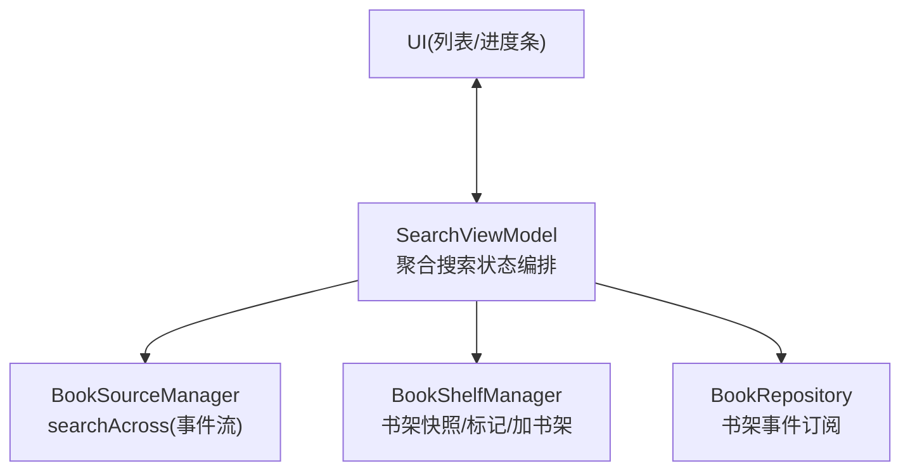
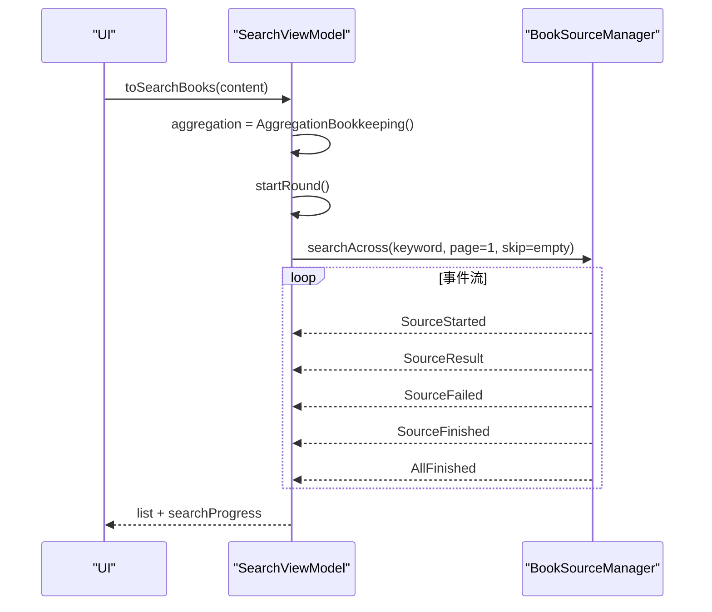
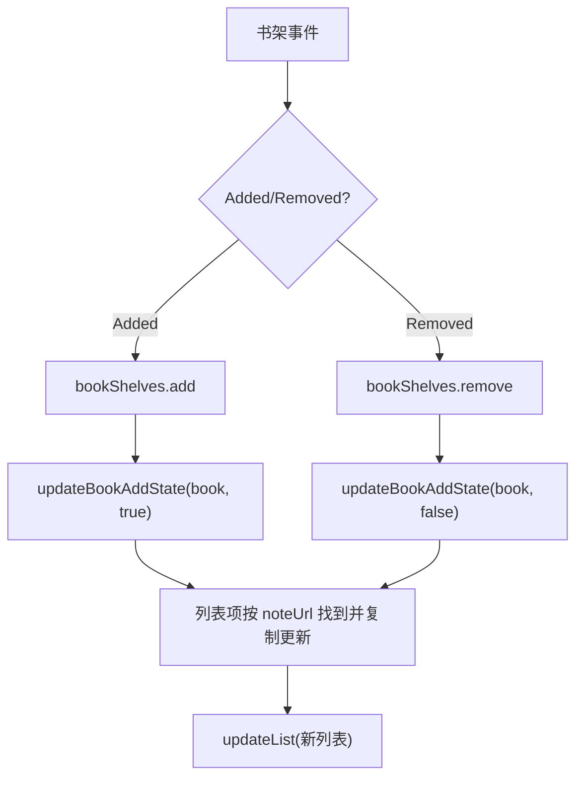
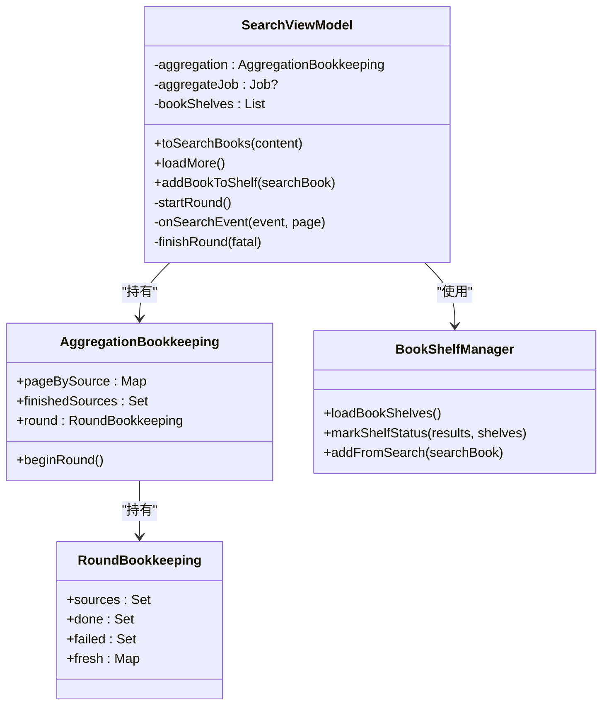

# 状态管理

<cite>
**本文引用的文件**
- [SearchViewModel.kt](file://module_find/src/main/java/com/ebook/find/mvvm/viewmodel/SearchViewModel.kt)
- [SearchViewModelTest.kt](file://module_find/src/test/java/com/ebook/find/mvvm/viewmodel/SearchViewModelTest.kt)
- [BookShelfManager.kt](file://lib_book_common/src/main/java/com/ebook/common/manager/BookShelfManager.kt)
</cite>

## 目录
1. [简介](#简介)
2. [项目结构](#项目结构)
3. [核心组件](#核心组件)
4. [架构总览](#架构总览)
5. [详细组件分析](#详细组件分析)
6. [依赖关系分析](#依赖关系分析)
7. [性能考量](#性能考量)
8. [故障排查指南](#故障排查指南)
9. [结论](#结论)

## 简介
本文件聚焦“聚合搜索”在 SearchViewModel 中的状态管理设计，重点解释：
- AggregationBookkeeping 的两层生命周期：会话级状态（pageBySource、finishedSources）与轮级状态（RoundBookkeeping）的职责分离。
- round 对象的 beginRound() 整块替换重置机制及其设计动机。
- SearchProgress 进度数据流：finished/total 的计算逻辑与 isRunning 判断条件。
- 书架状态同步机制：bookShelves 快照维护与 updateBookAddState 的状态更新流程。
- 通过测试用例展示如何正确管理状态变更、避免竞态并保证一致性。

## 项目结构
- 搜索页的 MVVM 视图模型位于 module_find，负责多书源聚合搜索的状态编排与 UI 暴露。
- 书架相关能力集中在 lib_book_common 的 BookShelfManager，提供书架查询、搜索结果标记与加入书架流程。
- 单元测试集中于 SearchViewModelTest，用于锁住并发、去重、翻页与进度等关键行为。

图表来源
- [SearchViewModel.kt:261-320](file://module_find/src/main/java/com/ebook/find/mvvm/viewmodel/SearchViewModel.kt#L261-L320)
- [BookShelfManager.kt:19-74](file://lib_book_common/src/main/java/com/ebook/common/manager/BookShelfManager.kt#L19-L74)

章节来源
- [SearchViewModel.kt:56-97](file://module_find/src/main/java/com/ebook/find/mvvm/viewmodel/SearchViewModel.kt#L56-L97)
- [BookShelfManager.kt:19-74](file://lib_book_common/src/main/java/com/ebook/common/manager/BookShelfManager.kt#L19-L74)

## 核心组件
- AggregationBookkeeping：封装“按源游标”和“跨轮结束集”，以及“本轮簿记”。
- RoundBookkeeping：单轮参与源集合、已结束源集合、失败源集合、各源新增条目计数。
- SearchProgress：对外暴露 finished、total 与派生字段 fraction、isRunning。
- BookShelfManager：提供书架快照加载、搜索结果标记、加书架完整流程。

章节来源
- [SearchViewModel.kt:408-460](file://module_find/src/main/java/com/ebook/find/mvvm/viewmodel/SearchViewModel.kt#L408-L460)
- [SearchViewModel.kt:492-499](file://module_find/src/main/java/com/ebook/find/mvvm/viewmodel/SearchViewModel.kt#L492-L499)
- [BookShelfManager.kt:23-74](file://lib_book_common/src/main/java/com/ebook/common/manager/BookShelfManager.kt#L23-L74)

## 架构总览
SearchViewModel 发起一次 searchAcross，收集 AggregateSearchEvent 事件流，按事件类型维护两层状态：
- 会话级：记录每个源的下一页游标 pageBySource，以及已到底/失败的去重后无新条目的 finishedSources；这些在换关键词时随整个簿记对象一起重建。
- 轮级：每轮新建 RoundBookkeeping，统计本轮参与源 sources、已结束 done、失败 failed、各源 fresh 新增数；beginRound 通过整块替换实现“不可能只清一半”的一致性保障。

图表来源
- [SearchViewModel.kt:212-226](file://module_find/src/main/java/com/ebook/find/mvvm/viewmodel/SearchViewModel.kt#L212-L226)
- [SearchViewModel.kt:261-320](file://module_find/src/main/java/com/ebook/find/mvvm/viewmodel/SearchViewModel.kt#L261-L320)

## 详细组件分析

### AggregationBookkeeping 的两层生命周期
- 会话级状态
  - pageBySource：每源独立分页游标，值为该源下一次请求的页码。跨轮存活，只在换关键词重搜时随整个 AggregationBookkeeping 被替换而清零。
  - finishedSources：跨轮累积的“不再继续翻”的源集合（到底、失败或去重后无新条目），下一轮经 skipSourceUrls 排除。
- 轮级状态
  - round：每轮开始由 beginRound() 整块替换为新的 RoundBookkeeping，包含 sources、done、failed、fresh。

为什么采用“整块替换”而非逐项清空？
- 将六份状态收进一个值类型后，重置变成一次赋值（aggregation = new 或 beginRound()）。旧写法是多个 VM 字段各自 .clear()，一旦漏掉一处，上一轮的进度与游标会混入新一轮，导致“已收到 X/Y 算重”“游标互相覆写”等难以复现的竞态问题。整块替换从结构上杜绝了“半清”的可能。

章节来源
- [SearchViewModel.kt:63-77](file://module_find/src/main/java/com/ebook/find/mvvm/viewmodel/SearchViewModel.kt#L63-L77)
- [SearchViewModel.kt:408-434](file://module_find/src/main/java/com/ebook/find/mvvm/viewmodel/SearchViewModel.kt#L408-L434)

### RoundBookkeeping 与 beginRound() 重置机制
- round.sources：本轮参与聚合的源集合（收到过 SourceStarted）。
- round.done：本轮已结束源集合（进度分子）。
- round.failed：本轮失败过的源集合（全部失败才触发错误覆盖层）。
- round.fresh：本轮各源去重后的新增条目数（软 404 靠它判到底）。

beginRound() 的调用时机与约束
- 在 startRound() 中先计算本轮应请求的页码与跳过集（基于上一轮存活源），再调用 beginRound() 替换 round。这样确保调用前能读到上一轮必要的状态，且替换后不会与旧轮共享可变集合。

章节来源
- [SearchViewModel.kt:261-284](file://module_find/src/main/java/com/ebook/find/mvvm/viewmodel/SearchViewModel.kt#L261-L284)
- [SearchViewModel.kt:444-460](file://module_find/src/main/java/com/ebook/find/mvvm/viewmodel/SearchViewModel.kt#L444-L460)

### SearchProgress 进度数据流
- total：本轮参与的书源数（round.sources.size）。
- finished：本轮已结束的书源数（round.done.size）。
- isRunning：total > 0 且 finished < total，表示还有源未结束。
- fraction：进度比例，total 为 0 时按 0 收，避免除零。

发布时机
- 每当有 SourceStarted、SourceResult、SourceFinished 到达时调用 publishProgress() 刷新 _searchProgress。
- 收到 AllFinished 时在 finishRound() 中一次性补齐 done（兜住某一路协程被取消不发送 Finished 的情况），从而保证进度行最终收敛。

章节来源
- [SearchViewModel.kt:388-394](file://module_find/src/main/java/com/ebook/find/mvvm/viewmodel/SearchViewModel.kt#L388-L394)
- [SearchViewModel.kt:492-499](file://module_find/src/main/java/com/ebook/find/mvvm/viewmodel/SearchViewModel.kt#L492-L499)
- [SearchViewModel.kt:352-375](file://module_find/src/main/java/com/ebook/find/mvvm/viewmodel/SearchViewModel.kt#L352-L375)

### 书架状态同步机制
- bookShelves 快照
  - VM init 中异步加载书架列表到 bookShelves，作为搜索结果“是否已加书架”的比对依据。
  - 当书架发生 Added/Removed 事件时，更新快照并在列表中找到对应项更新 add 标志。
- markShelfStatus
  - 对当前批次的搜索结果，根据 noteUrl 匹配书架快照，将已有书的 add 置为 true，供后续去重与追加。
- updateBookAddState
  - 收到书架事件后，取当前列表副本，按 noteUrl 定位目标项并拷贝更新，再整体回写列表，避免并发修改导致的异常。

图表来源
- [SearchViewModel.kt:103-128](file://module_find/src/main/java/com/ebook/find/mvvm/viewmodel/SearchViewModel.kt#L103-L128)
- [SearchViewModel.kt:249-257](file://module_find/src/main/java/com/ebook/find/mvvm/viewmodel/SearchViewModel.kt#L249-L257)
- [BookShelfManager.kt:27-37](file://lib_book_common/src/main/java/com/ebook/common/manager/BookShelfManager.kt#L27-L37)

章节来源
- [SearchViewModel.kt:103-128](file://module_find/src/main/java/com/ebook/find/mvvm/viewmodel/SearchViewModel.kt#L103-L128)
- [SearchViewModel.kt:249-257](file://module_find/src/main/java/com/ebook/find/mvvm/viewmodel/SearchViewModel.kt#L249-L257)
- [BookShelfManager.kt:27-37](file://lib_book_common/src/main/java/com/ebook/common/manager/BookShelfManager.kt#L27-L37)

### 翻页与“到底”判定
- 翻页策略
  - loadMore() 仅当仍有 activeSources() 时才起一轮；否则直接关闭加载更多。
  - roundPage() 取活跃源的最小游标作为本轮页码，若尚无游标则默认第 1 页。
- “到底”判定
  - 不仅看空页，还要看去重后是否带来新条目（fresh 计数）。若 hasMore=true 但 fresh=0（例如越界页重复首页书目），仍将该源加入 finishedSources，下一轮跳过。

章节来源
- [SearchViewModel.kt:130-167](file://module_find/src/main/java/com/ebook/find/mvvm/viewmodel/SearchViewModel.kt#L130-L167)
- [SearchViewModel.kt:306-317](file://module_find/src/main/java/com/ebook/find/mvvm/viewmodel/SearchViewModel.kt#L306-L317)
- [SearchViewModel.kt:377-386](file://module_find/src/main/java/com/ebook/find/mvvm/viewmodel/SearchViewModel.kt#L377-L386)

### 结果合并与全局去重
- 对每个 SourceResult：
  - 先调用 markShelfStatus 标记已加书架状态。
  - 以当前列表的 noteUrl 集合进行去重，仅追加 fresh 的新条目。
  - 记录 round.fresh[sourceUrl] = fresh.size，供“到底”判定使用。
- 第一条结果到手即移除 Loading 覆盖层，让用户看到增量效果。

章节来源
- [SearchViewModel.kt:323-342](file://module_find/src/main/java/com/ebook/find/mvvm/viewmodel/SearchViewModel.kt#L323-L342)

### 收尾与错误态
- finishRound(fatal)
  - 以 AllFinished 为“本轮结束”的可靠判据，一次性补齐 done。
  - 若所有源都失败（包括整条流出问题 fatal），进入 NetworkError 覆盖层并上报失败原因；否则正常退出 Loading。
  - 设置“还有更多”：只要 activeSources() 非空，就认为可继续翻页。

章节来源
- [SearchViewModel.kt:344-375](file://module_find/src/main/java/com/ebook/find/mvvm/viewmodel/SearchViewModel.kt#L344-L375)

## 依赖关系分析
- SearchViewModel 依赖 BookSourceManager 的 searchAcross 事件流，消费 SourceStarted/SourceResult/SourceFailed/SourceFinished/AllFinished。
- 依赖 BookShelfManager 完成书架快照加载、搜索结果标记与加书架。
- 通过 BookRepository 的 bookShelfEvents 订阅书架增删事件，保持列表与书架一致。

图表来源
- [SearchViewModel.kt:63-77](file://module_find/src/main/java/com/ebook/find/mvvm/viewmodel/SearchViewModel.kt#L63-L77)
- [SearchViewModel.kt:408-460](file://module_find/src/main/java/com/ebook/find/mvvm/viewmodel/SearchViewModel.kt#L408-L460)
- [BookShelfManager.kt:19-74](file://lib_book_common/src/main/java/com/ebook/common/manager/BookShelfManager.kt#L19-L74)

章节来源
- [SearchViewModel.kt:56-97](file://module_find/src/main/java/com/ebook/find/mvvm/viewmodel/SearchViewModel.kt#L56-L97)
- [BookShelfManager.kt:19-74](file://lib_book_common/src/main/java/com/ebook/common/manager/BookShelfManager.kt#L19-L74)

## 性能考量
- 并发聚合：searchAcross 对启用书源并发执行，减少等待时间。
- 去重策略：按 noteUrl 全局去重，避免重复渲染与崩溃风险。
- 翻页优化：只对尚未结束的源继续翻页，降低无效请求。
- 进度收敛：通过 AllFinished 一次性补齐进度，避免“差一格”导致的 UI 卡顿。

[本节为通用指导，无需代码引用]

## 故障排查指南
- 进度永远差一格
  - 检查是否以 AllFinished 作为本轮结束判据；若仅数 Finished，可能因某路被取消而未发出 Finished，导致进度不收敛。
- 加载更多误触发第二轮
  - 确认 loadMore() 在 aggregateJob 仍在活动时直接忽略，避免共享集合被两轮流交错改写。
- 软 404 导致源提前到底
  - 检查 fresh 计数与去重逻辑；若一页返回重复书目，should continue 应为 false，并将该源加入 finishedSources。
- 列表项加书架状态不同步
  - 确认 markShelfStatus 与 updateBookAddState 均按 noteUrl 精确匹配并复制更新，避免并发修改。

章节来源
- [SearchViewModel.kt:130-167](file://module_find/src/main/java/com/ebook/find/mvvm/viewmodel/SearchViewModel.kt#L130-L167)
- [SearchViewModel.kt:306-317](file://module_find/src/main/java/com/ebook/find/mvvm/viewmodel/SearchViewModel.kt#L306-L317)
- [SearchViewModel.kt:352-375](file://module_find/src/main/java/com/ebook/find/mvvm/viewmodel/SearchViewModel.kt#L352-L375)
- [SearchViewModel.kt:249-257](file://module_find/src/main/java/com/ebook/find/mvvm/viewmodel/SearchViewModel.kt#L249-L257)

## 结论
SearchViewModel 通过 AggregationBookkeeping 的两层生命周期设计，将“跨轮会话状态”与“单轮运行状态”解耦，既保证了翻页与排除集的长期一致性，又确保了每轮进度的独立与可恢复。beginRound() 的整块替换机制从根本上避免了“逐项清空”易出现的遗漏问题。SearchProgress 以 finished/total 为口径，结合 AllFinished 兜底，确保 UI 进度条稳定收敛。书架同步通过快照与事件驱动的双通道，保证列表与书架状态一致。配合完备的单测用例，这套设计能有效避免竞态、提升鲁棒性与可维护性。