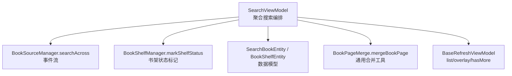
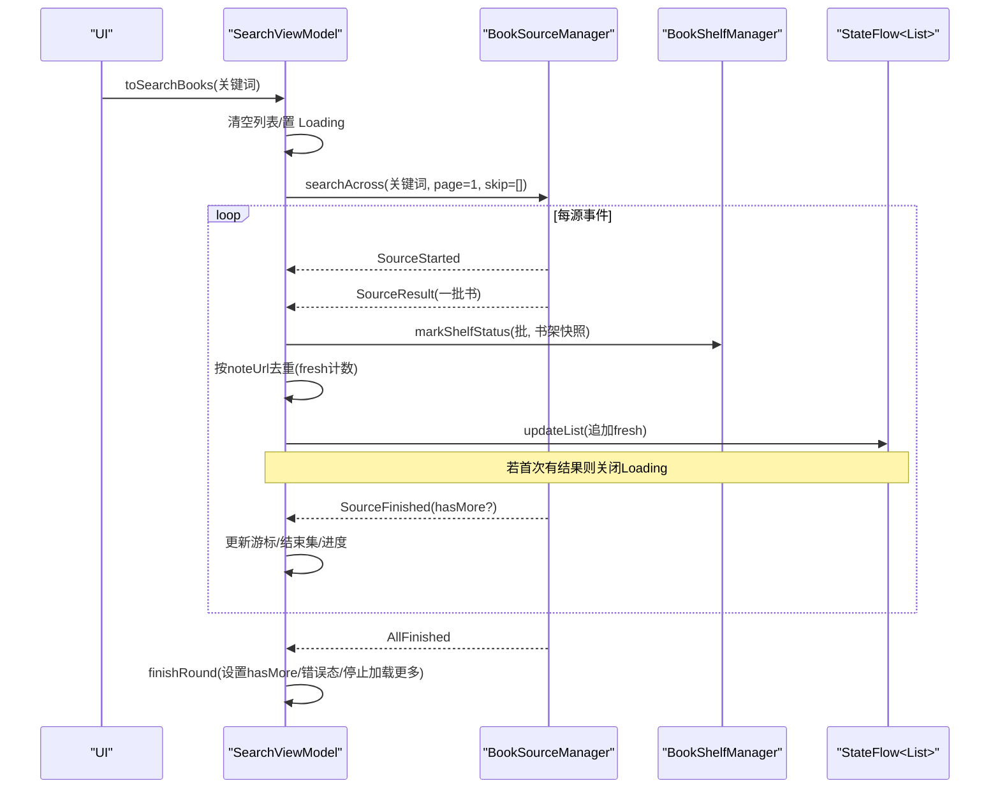
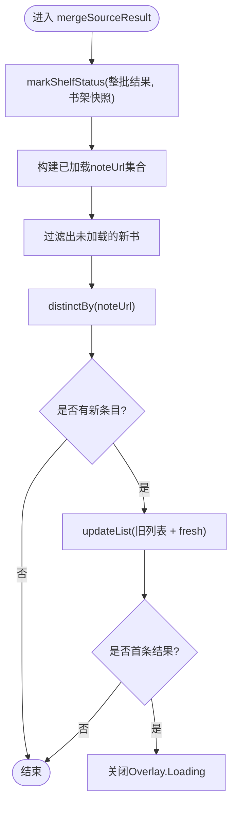
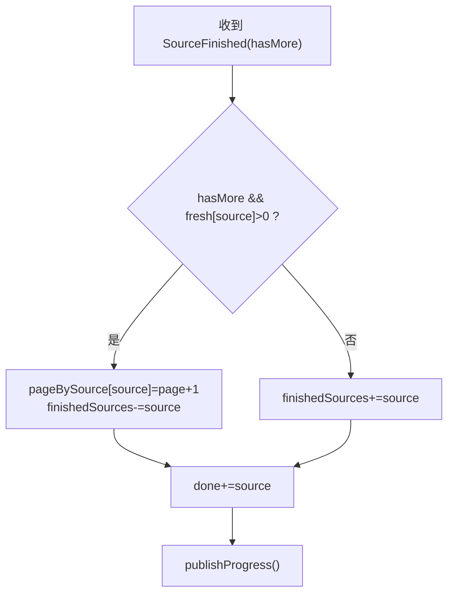
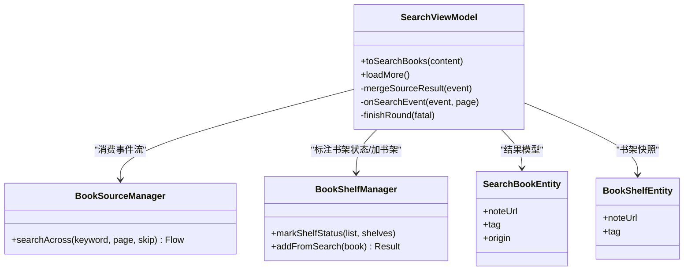

# 结果合并与去重

<cite>
**本文引用的文件**
- [SearchViewModel.kt](file://module_find/src/main/java/com/ebook/find/mvvm/viewmodel/SearchViewModel.kt)
- [BookPageMerge.kt](file://module_find/src/main/java/com/ebook/find/mvvm/viewmodel/BookPageMerge.kt)
- [SearchBookEntity.kt](file://lib_ebook_db/src/main/java/com/ebook/db/entity/SearchBookEntity.kt)
- [BookShelfEntity.kt](file://lib_ebook_db/src/main/java/com/ebook/db/entity/BookShelfEntity.kt)
- [SearchViewModelTest.kt](file://module_find/src/test/java/com/ebook/find/mvvm/viewmodel/SearchViewModelTest.kt)
</cite>

## 目录
1. [引言](#引言)
2. [项目结构](#项目结构)
3. [核心组件](#核心组件)
4. [架构总览](#架构总览)
5. [详细组件分析](#详细组件分析)
6. [依赖关系分析](#依赖关系分析)
7. [性能考量](#性能考量)
8. [故障排查指南](#故障排查指南)
9. [结论](#结论)
10. [附录](#附录)

## 引言
本文件聚焦“搜索结果聚合”的合并与去重机制，围绕 SearchViewModel 中的 mergeSourceResult 方法展开，解释按 noteUrl 全局去重的设计原理、同名不同源保留的业务价值、fresh 计数器的软 404 处理与“零新条目”到底逻辑、列表更新的原子性（markShelfStatus + distinctBy），以及 UI 状态管理（Overlay.Loading 显示时机、第一条结果到达时切换）。文末提供边界场景示例与优化建议。

## 项目结构
与本次主题直接相关的代码分布在：
- module_find：搜索页 ViewModel、分页合并工具、测试
- lib_ebook_db：搜索结果与书架实体模型
- 其他模块仅间接引用上述内容

图示来源
- [SearchViewModel.kt:261-342](file://module_find/src/main/java/com/ebook/find/mvvm/viewmodel/SearchViewModel.kt#L261-L342)
- [BookPageMerge.kt:16-23](file://module_find/src/main/java/com/ebook/find/mvvm/viewmodel/BookPageMerge.kt#L16-L23)
- [SearchBookEntity.kt:6-25](file://lib_ebook_db/src/main/java/com/ebook/db/entity/SearchBookEntity.kt#L6-L25)
- [BookShelfEntity.kt:11-83](file://lib_ebook_db/src/main/java/com/ebook/db/entity/BookShelfEntity.kt#L11-L83)

章节来源
- [SearchViewModel.kt:29-54](file://module_find/src/main/java/com/ebook/find/mvvm/viewmodel/SearchViewModel.kt#L29-L54)
- [BookPageMerge.kt:1-23](file://module_find/src/main/java/com/ebook/find/mvvm/viewmodel/BookPageMerge.kt#L1-L23)

## 核心组件
- SearchViewModel：负责聚合搜索流程编排、事件分发、结果合并与去重、进度与覆盖层管理、翻页游标维护。
- BookPageMerge：通用的“一页结果并入已加载列表”的工具函数，按 noteUrl 去重并返回合并后的列表或 null。
- SearchBookEntity/BookShelfEntity：搜索结果与书架项的数据载体，noteUrl 作为全局唯一键。
- BookShelfManager：提供 markShelfStatus，为当前批结果批量标注“是否已在书架”。

章节来源
- [SearchViewModel.kt:55-128](file://module_find/src/main/java/com/ebook/find/mvvm/viewmodel/SearchViewModel.kt#L55-L128)
- [BookPageMerge.kt:16-23](file://module_find/src/main/java/com/ebook/find/mvvm/viewmodel/BookPageMerge.kt#L16-L23)
- [SearchBookEntity.kt:6-25](file://lib_ebook_db/src/main/java/com/ebook/db/entity/SearchBookEntity.kt#L6-L25)
- [BookShelfEntity.kt:11-83](file://lib_ebook_db/src/main/java/com/ebook/db/entity/BookShelfEntity.kt#L11-L83)

## 架构总览
搜索采用“多源并发、事件驱动、边收边合”的架构。每个书源独立解析，通过 AggregateSearchEvent 逐步发出 SourceStarted/SourceResult/SourceFailed/SourceFinished/AllFinished。VM 在 onSearchEvent 中维护轮级簿记，并在 SourceResult 中执行合并与去重。

图示来源
- [SearchViewModel.kt:212-375](file://module_find/src/main/java/com/ebook/find/mvvm/viewmodel/SearchViewModel.kt#L212-L375)
- [SearchViewModel.kt:289-342](file://module_find/src/main/java/com/ebook/find/mvvm/viewmodel/SearchViewModel.kt#L289-L342)

## 详细组件分析

### 按 noteUrl 全局去重的设计与业务考量
- 为什么选 noteUrl：
  - 列表以 noteUrl 作为 item key，重复 key 会触发 Compose 异常；用 noteUrl 去重可避免崩溃。
  - noteUrl 是“同一本书在不同站点可能共享”的全局标识；跨站同书只留一条即可。
- 为什么不用 name+author：
  - 同名不同源的书籍需要同时保留，作为“换源备选”（某源失效或质量差时可切换到另一源阅读）。
  - 如果按 name+author 去重，第一次搜索就可能永久丢弃第二条备选，影响后续体验。
- 实现要点：
  - 先将已加载集合映射到 noteUrl 集合，再过滤不在其中的新书，再用 distinctBy 去重。
  - 使用 bookShelfManager.markShelfStatus 对整批结果标注“是否在书架”，再合并，保证 UI 一次性更新。

图示来源
- [SearchViewModel.kt:323-342](file://module_find/src/main/java/com/ebook/find/mvvm/viewmodel/SearchViewModel.kt#L323-L342)

章节来源
- [SearchViewModel.kt:48-53](file://module_find/src/main/java/com/ebook/find/mvvm/viewmodel/SearchViewModel.kt#L48-L53)
- [SearchViewModel.kt:323-342](file://module_find/src/main/java/com/ebook/find/mvvm/viewmodel/SearchViewModel.kt#L323-L342)
- [SearchBookEntity.kt:6-25](file://lib_ebook_db/src/main/java/com/ebook/db/entity/SearchBookEntity.kt#L6-L25)

### fresh 计数器与“零新条目”到底逻辑
- fresh 计数器（每源本轮新增条目数）的作用：
  - 记录该源这一页去重后实际新增的数量，用于判断“软 404”（HTTP 200 但返回的是重复首页书目）。
  - 当 hasMore=true 但 fresh==0，说明本页无新条目，将该源标记为“已结束”，不再继续翻。
- “零新条目”的判断位置：
  - SourceFinished 分支中，将 event.hasMore 与 round.fresh[sourceUrl] > 0 组合，决定是否推进下一页游标与移除 finishedSources。
- 效果：
  - 避免因为“越界页仍返回首页书目”而无限翻页；也避免 footer 误判“没有更多”（首轮正常翻页不会误判）。

图示来源
- [SearchViewModel.kt:306-317](file://module_find/src/main/java/com/ebook/find/mvvm/viewmodel/SearchViewModel.kt#L306-L317)
- [SearchViewModel.kt:444-460](file://module_find/src/main/java/com/ebook/find/mvvm/viewmodel/SearchViewModel.kt#L444-L460)

章节来源
- [SearchViewModel.kt:306-317](file://module_find/src/main/java/com/ebook/find/mvvm/viewmodel/SearchViewModel.kt#L306-L317)
- [SearchViewModelTest.kt:467-506](file://module_find/src/test/java/com/ebook/find/mvvm/viewmodel/SearchViewModelTest.kt#L467-L506)

### 列表更新的原子性与 markShelfStatus + distinctBy
- 原子性保障：
  - 先 markShelfStatus 给整批结果打标签，再统一计算 fresh，最后一次 updateList 追加。避免多次 UI 刷新导致闪烁或错乱。
- distinctBy 的去重过程：
  - 基于 noteUrl 进行稳定去重，确保 LazyColumn 的 key 唯一，防止崩溃。
- 与通用工具的复用：
  - BookPageMerge.mergeBookPage 提供相同语义的“按 noteUrl 去重并入”，适用于分类页与搜索页。

章节来源
- [SearchViewModel.kt:323-342](file://module_find/src/main/java/com/ebook/find/mvvm/viewmodel/SearchViewModel.kt#L323-L342)
- [BookPageMerge.kt:16-23](file://module_find/src/main/java/com/ebook/find/mvvm/viewmodel/BookPageMerge.kt#L16-L23)

### UI 状态管理：Overlay.Loading 与首条结果切换
- 显示时机：
  - toSearchBooks 开始时置 Overlay.Loading，确保用户看到加载反馈。
- 隐藏时机：
  - 当 mergeSourceResult 中 first result 到来时，若当前处于 Loading，立即切换为 None，让用户尽快看到结果，进度由进度条表达。
- 失败与收尾：
  - 全部源失败时置 NetworkError 并报告可操作文案；否则正常结束，hasMore 由 activeSources 决定。

章节来源
- [SearchViewModel.kt:212-226](file://module_find/src/main/java/com/ebook/find/mvvm/viewmodel/SearchViewModel.kt#L212-L226)
- [SearchViewModel.kt:339-342](file://module_find/src/main/java/com/ebook/find/mvvm/viewmodel/SearchViewModel.kt#L339-L342)
- [SearchViewModel.kt:352-375](file://module_find/src/main/java/com/ebook/find/mvvm/viewmodel/SearchViewModel.kt#L352-L375)

### 翻页与轮次隔离
- 轮次隔离：
  - AggregationBookkeeping.round 每次 startRound 整块替换，避免上一轮状态污染新一轮。
- 翻页策略：
  - 只对未结束的源翻页（finishedSources 排除），游标 per-source 递增。
  - loadMore 在 aggregateJob 仍在运行或无活跃源时短路，避免并发改写与无效请求。

章节来源
- [SearchViewModel.kt:130-167](file://module_find/src/main/java/com/ebook/find/mvvm/viewmodel/SearchViewModel.kt#L130-L167)
- [SearchViewModel.kt:261-284](file://module_find/src/main/java/com/ebook/find/mvvm/viewmodel/SearchViewModel.kt#L261-L284)
- [SearchViewModel.kt:377-386](file://module_find/src/main/java/com/ebook/find/mvvm/viewmodel/SearchViewModel.kt#L377-L386)

### 具体边界场景与代码片段路径
- 两源返回同一 noteUrl：只保留一条（避免 Compose 重复 key 崩溃）
  - 参考路径：[SearchViewModelTest.kt:325-343](file://module_find/src/test/java/com/ebook/find/mvvm/viewmodel/SearchViewModelTest.kt#L325-L343)
- 同名不同源的两条都保留：作为换源备选
  - 参考路径：[SearchViewModelTest.kt:345-365](file://module_find/src/test/java/com/ebook/find/mvvm/viewmodel/SearchViewModelTest.kt#L345-L365)
- 软 404（整页重复）导致该源被判到底
  - 参考路径：[SearchViewModelTest.kt:467-506](file://module_find/src/test/java/com/ebook/find/mvvm/viewmodel/SearchViewModelTest.kt#L467-L506)
- 首轮搜索在途时加载更多不并起第二轮
  - 参考路径：[SearchViewModelTest.kt:402-464](file://module_find/src/test/java/com/ebook/find/mvvm/viewmodel/SearchViewModelTest.kt#L402-L464)
- 换关键词重搜取消旧轮，避免旧结果污染新列表
  - 参考路径：[SearchViewModelTest.kt:508-546](file://module_find/src/test/java/com/ebook/find/mvvm/viewmodel/SearchViewModelTest.kt#L508-L546)
- 部分失败展示已有结果，全部失败才进错误态
  - 参考路径：[SearchViewModelTest.kt:609-650](file://module_find/src/test/java/com/ebook/find/mvvm/viewmodel/SearchViewModelTest.kt#L609-L650)

## 依赖关系分析
- SearchViewModel 依赖：
  - BookSourceManager：提供 searchAcross 事件流
  - BookShelfManager：提供 markShelfStatus、加书架等
  - BaseRefreshViewModel：提供 list/overlay/hasMore 等 UI 状态管理
- 数据模型：
  - SearchBookEntity：携带 noteUrl、tag（归属源）、origin（源名）等
  - BookShelfEntity：持久化书架项，noteUrl 为主键之一

图示来源
- [SearchViewModel.kt:55-128](file://module_find/src/main/java/com/ebook/find/mvvm/viewmodel/SearchViewModel.kt#L55-L128)
- [SearchBookEntity.kt:6-25](file://lib_ebook_db/src/main/java/com/ebook/db/entity/SearchBookEntity.kt#L6-L25)
- [BookShelfEntity.kt:11-83](file://lib_ebook_db/src/main/java/com/ebook/db/entity/BookShelfEntity.kt#L11-L83)

章节来源
- [SearchViewModel.kt:55-128](file://module_find/src/main/java/com/ebook/find/mvvm/viewmodel/SearchViewModel.kt#L55-L128)

## 性能考量
- 去重成本：
  - mapTo(mutableSetOf()) + filterNot + distinctBy 的复杂度近似 O(n)，n 为 incoming 大小；注意控制单页规模。
- 批量标注：
  - markShelfStatus 对整批结果批量处理，减少多次 IO 与 UI 刷新。
- 进度与覆盖层：
  - 仅在必要时切换 Overlay.Loading，避免频繁 UI 重绘。
- 翻页节流：
  - loadMore 在 aggregateJob 活跃或无活跃源时短路，避免无效请求与竞态。

## 故障排查指南
- 症状：列表出现重复项导致 Compose 崩溃
  - 检查是否正确使用 noteUrl 作为 key，并确保 mergeSourceResult 中 distinctBy 生效。
  - 参考路径：[SearchViewModel.kt:323-342](file://module_find/src/main/java/com/ebook/find/mvvm/viewmodel/SearchViewModel.kt#L323-L342)
- 症状：一直显示“加载中”
  - 确认 AllFinished 是否能到达；若某路协程被取消，需靠 finishRound 兜底收满进度。
  - 参考路径：[SearchViewModel.kt:352-375](file://module_find/src/main/java/com/ebook/find/mvvm/viewmodel/SearchViewModel.kt#L352-L375)
- 症状：翻页不终止（无限翻页）
  - 检查 soft 404 场景下 fresh 计数是否为 0，以及 SourceFinished 分支是否正确将源加入 finishedSources。
  - 参考路径：[SearchViewModel.kt:306-317](file://module_find/src/main/java/com/ebook/find/mvvm/viewmodel/SearchViewModel.kt#L306-L317)
- 症状：换关键词后混入旧结果
  - 确认 toSearchBooks 是否先 cancel 上一轮，再清空列表并置 Loading。
  - 参考路径：[SearchViewModel.kt:212-226](file://module_find/src/main/java/com/ebook/find/mvvm/viewmodel/SearchViewModel.kt#L212-L226)

## 结论
- 以 noteUrl 为全局去重键，既避免 UI 崩溃，又保留同名不同源的“换源备选”能力。
- fresh 计数器结合 SourceFinished 的 hasMore，精准识别“软 404”并正确推进或结束翻页。
- 列表更新采用“批量标注 + 一次性追加”的原子模式，保证 UI 一致性与流畅度。
- UI 状态在首条结果到达时及时收起 Loading，提升用户体验；全部失败时给出明确错误态。
- 通过轮次隔离与 loadMore 短路，有效避免并发竞态与无效请求。

## 附录
- 关键流程入口路径：
  - 发起搜索：[SearchViewModel.kt:212-226](file://module_find/src/main/java/com/ebook/find/mvvm/viewmodel/SearchViewModel.kt#L212-L226)
  - 合并与去重：[SearchViewModel.kt:323-342](file://module_find/src/main/java/com/ebook/find/mvvm/viewmodel/SearchViewModel.kt#L323-L342)
  - 翻页与结束判断：[SearchViewModel.kt:306-317](file://module_find/src/main/java/com/ebook/find/mvvm/viewmodel/SearchViewModel.kt#L306-L317)
  - 收尾与错误态：[SearchViewModel.kt:352-375](file://module_find/src/main/java/com/ebook/find/mvvm/viewmodel/SearchViewModel.kt#L352-L375)
- 通用合并工具：
  - 分类/搜索共用：[BookPageMerge.kt:16-23](file://module_find/src/main/java/com/ebook/find/mvvm/viewmodel/BookPageMerge.kt#L16-L23)