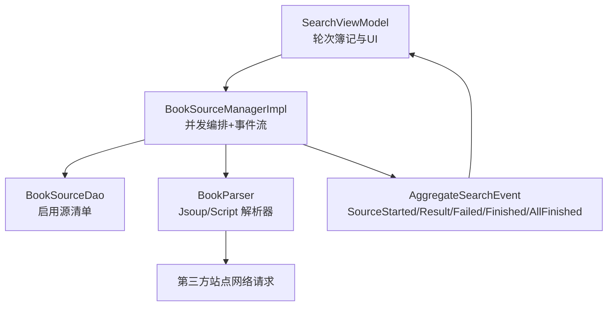
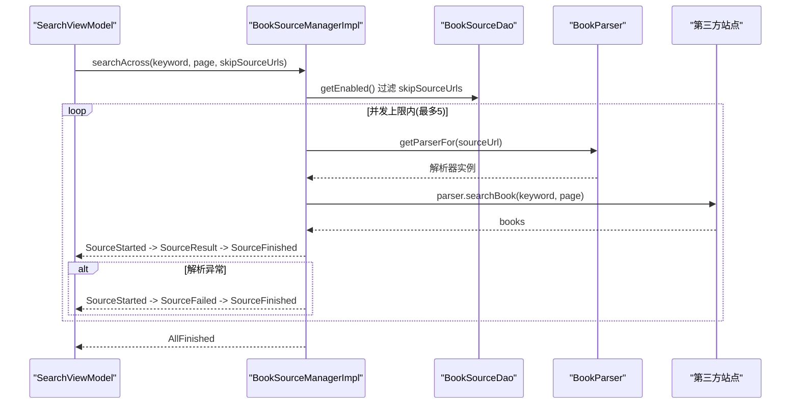
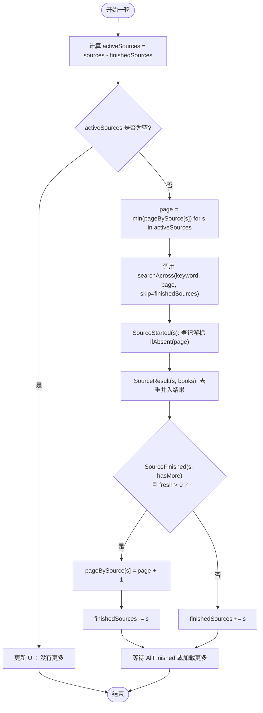
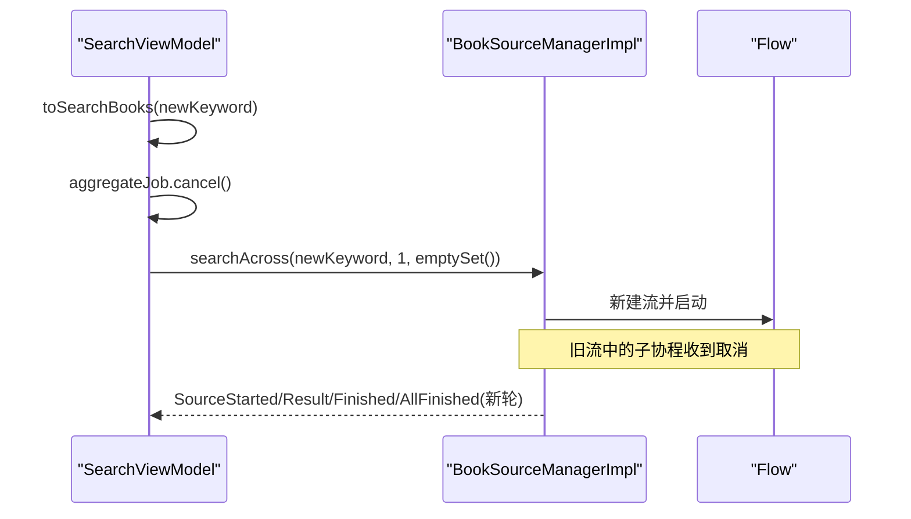
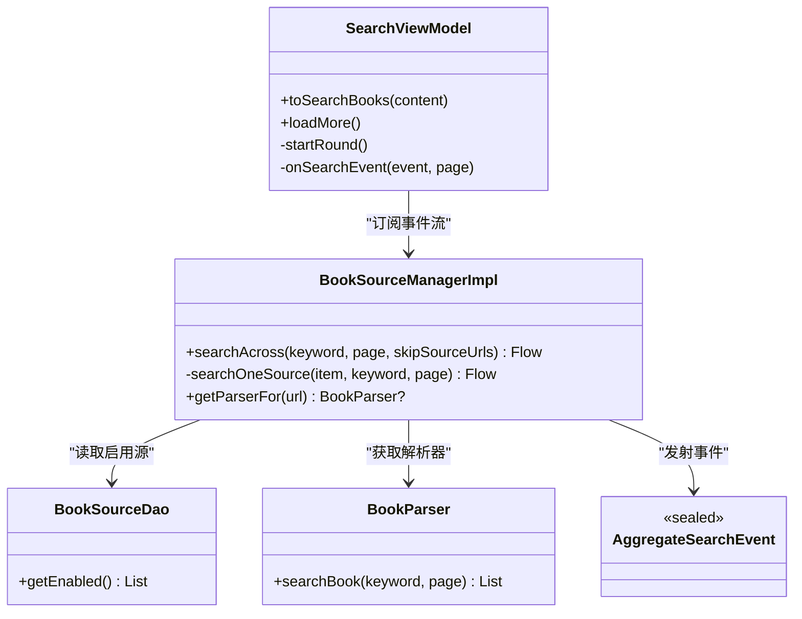

# 聚合搜索引擎

<cite>
**本文引用的文件**
- [BookSourceManager.kt](file://lib_book_common/src/main/java/com/ebook/common/analyze/source/BookSourceManager.kt)
- [BookSourceManagerImpl.kt](file://lib_book_common/src/main/java/com/ebook/common/analyze/source/BookSourceManagerImpl.kt)
- [AggregateSearchEvent.kt](file://lib_book_source/src/main/java/com/ebook/source/analyze/AggregateSearchEvent.kt)
- [SearchViewModel.kt](file://module_find/src/main/java/com/ebook/find/mvvm/viewmodel/SearchViewModel.kt)
- [BookSourceManagerImplTest.kt](file://lib_book_common/src/test/java/com/ebook/common/analyze/source/BookSourceManagerImplTest.kt)
</cite>

## 目录
1. [简介](#简介)
2. [项目结构](#项目结构)
3. [核心组件](#核心组件)
4. [架构总览](#架构总览)
5. [详细组件分析](#详细组件分析)
6. [依赖关系分析](#依赖关系分析)
7. [性能与并发特性](#性能与并发特性)
8. [故障排查指南](#故障排查指南)
9. [结论](#结论)
10. [附录：实现示例与最佳实践](#附录：实现示例与最佳实践)

## 简介
本章节面向“多书源聚合搜索”的完整机制，围绕 BookSourceManager.searchAcross 的事件流、每源独立翻页策略、协程取消与恢复、以及网络异常与超时处理进行系统性说明。读者将理解：
- 事件流生命周期：SourceStarted → SourceResult/SourceFailed → SourceFinished → AllFinished
- 每源独立翻页：pageBySource 游标、finishedSources 结束集、skipSourceUrls 排除
- 并发控制：聚合并发上限、取消传播、CancellationException 的处理
- 实战要点：如何新增搜索策略、优化并发、处理网络异常和超时

## 项目结构
聚合搜索涉及三层协作：
- 管理接口与实现：BookSourceManager 定义 searchAcross；BookSourceManagerImpl 实现并发编排、事件发射、解析器获取与缓存失效
- 事件模型：AggregateSearchEvent 定义单源事件与全局结束事件
- 消费方：SearchViewModel 维护轮次簿记（pageBySource、finishedSources）、结果合并、UI 进度与“加载更多”翻页

图表来源
- [BookSourceManagerImpl.kt:464-510](file://lib_book_common/src/main/java/com/ebook/common/analyze/source/BookSourceManagerImpl.kt#L464-L510)
- [SearchViewModel.kt:261-321](file://module_find/src/main/java/com/ebook/find/mvvm/viewmodel/SearchViewModel.kt#L261-L321)
- [AggregateSearchEvent.kt:5-75](file://lib_book_source/src/main/java/com/ebook/source/analyze/AggregateSearchEvent.kt#L5-L75)

章节来源
- [BookSourceManager.kt:114-155](file://lib_book_common/src/main/java/com/ebook/common/analyze/source/BookSourceManager.kt#L114-L155)
- [BookSourceManagerImpl.kt:445-510](file://lib_book_common/src/main/java/com/ebook/common/analyze/source/BookSourceManagerImpl.kt#L445-L510)
- [AggregateSearchEvent.kt:5-75](file://lib_book_source/src/main/java/com/ebook/source/analyze/AggregateSearchEvent.kt#L5-L75)
- [SearchViewModel.kt:261-321](file://module_find/src/main/java/com/ebook/find/mvvm/viewmodel/SearchViewModel.kt#L261-L321)

## 核心组件
- BookSourceManager.searchAcross：冷 Flow，对每条启用源并发解析该页，按 AggregateSearchEvent 增量输出；并发上限为 5；任何单源异常被收敛为该源的 SourceFailed + SourceFinished(hasMore=false)；CancellationException 原样上抛以支持取消整条流
- BookSourceManagerImpl.searchOneSource：单源事件流：SourceStarted → (SourceResult 或 SourceFailed) → SourceFinished；getParserFor 返回 null 时抛出 IllegalStateException 并收敛为 Failed
- AggregateSearchEvent：统一事件类型，包括 SourceStarted、SourceResult、SourceFailed、SourceFinished、AllFinished
- SearchViewModel：负责轮次级簿记（round.sources/done/failed/fresh）、会话级状态（pageBySource、finishedSources），合并结果、驱动 UI 进度与“加载更多”

章节来源
- [BookSourceManager.kt:114-155](file://lib_book_common/src/main/java/com/ebook/common/analyze/source/BookSourceManager.kt#L114-L155)
- [BookSourceManagerImpl.kt:464-510](file://lib_book_common/src/main/java/com/ebook/common/analyze/source/BookSourceManagerImpl.kt#L464-L510)
- [AggregateSearchEvent.kt:5-75](file://lib_book_source/src/main/java/com/ebook/source/analyze/AggregateSearchEvent.kt#L5-L75)
- [SearchViewModel.kt:261-321](file://module_find/src/main/java/com/ebook/find/mvvm/viewmodel/SearchViewModel.kt#L261-L321)

## 架构总览
searchAcross 的端到端流程如下：

图表来源
- [BookSourceManagerImpl.kt:464-510](file://lib_book_common/src/main/java/com/ebook/common/analyze/source/BookSourceManagerImpl.kt#L464-L510)
- [BookSourceManagerImpl.kt:433-443](file://lib_book_common/src/main/java/com/ebook/common/analyze/source/BookSourceManagerImpl.kt#L433-L443)
- [AggregateSearchEvent.kt:21-75](file://lib_book_source/src/main/java/com/ebook/source/analyze/AggregateSearchEvent.kt#L21-L75)
- [SearchViewModel.kt:261-321](file://module_find/src/main/java/com/ebook/find/mvvm/viewmodel/SearchViewModel.kt#L261-L321)

## 详细组件分析

### 事件流与生命周期
- SourceStarted：标记某源开始解析，用于统计参与源数量
- SourceResult：携带该页搜索结果；空列表也合法，配合 Finished(hasMore=false) 表达该源到底
- SourceFailed：单源失败，不影响其他源继续运行；紧随其后必发 SourceFinished(hasMore=false)
- SourceFinished：标志该源本轮结束；hasMore 仅表示“该页有结果”，是否真到底需调用方按 noteUrl 去重判断
- AllFinished：全部源结束，流完成；即使某路因取消未发 Finished，也会到达

章节来源
- [AggregateSearchEvent.kt:21-75](file://lib_book_source/src/main/java/com/ebook/source/analyze/AggregateSearchEvent.kt#L21-L75)
- [BookSourceManagerImpl.kt:464-510](file://lib_book_common/src/main/java/com/ebook/common/analyze/source/BookSourceManagerImpl.kt#L464-L510)

### 每源独立翻页策略
- pageBySource：记录每个源下一次应请求的页码；初始由 SourceStarted 登记为本轮 page
- finishedSources：跨轮存活集合，包含已到底/失败/去重后无新条目的源；下一轮通过 skipSourceUrls 排除
- skipSourceUrls：传入 searchAcross 的排除集，避免对已结束源重复请求
- roundPage：取 activeSources 的最小游标作为本轮页码；若为空则从第 1 页开始

图表来源
- [SearchViewModel.kt:261-321](file://module_find/src/main/java/com/ebook/find/mvvm/viewmodel/SearchViewModel.kt#L261-L321)
- [SearchViewModel.kt:377-386](file://module_find/src/main/java/com/ebook/find/mvvm/viewmodel/SearchViewModel.kt#L377-L386)
- [BookSourceManager.kt:114-155](file://lib_book_common/src/main/java/com/ebook/common/analyze/source/BookSourceManager.kt#L114-L155)

章节来源
- [SearchViewModel.kt:261-321](file://module_find/src/main/java/com/ebook/find/mvvm/viewmodel/SearchViewModel.kt#L261-L321)
- [SearchViewModel.kt:377-386](file://module_find/src/main/java/com/ebook/find/mvvm/viewmodel/SearchViewModel.kt#L377-L386)
- [BookSourceManager.kt:114-155](file://lib_book_common/src/main/java/com/ebook/common/analyze/source/BookSourceManager.kt#L114-L155)

### 取消与恢复机制
- 取消传播：searchOneSource 在 catch 中优先 rethrow CancellationException，保证 flatMapMerge 能丢弃整路，从而终止旧轮
- 取消场景：换关键词触发 aggregateJob.cancel()；VM 销毁也会取消当前 job
- 恢复：新一轮重新创建 Job 并收集新的 Flow，pageBySource 与 finishedSources 跨轮保留，确保加载更多只翻未结束的源

图表来源
- [SearchViewModel.kt:212-226](file://module_find/src/main/java/com/ebook/find/mvvm/viewmodel/SearchViewModel.kt#L212-L226)
- [BookSourceManagerImpl.kt:487-510](file://lib_book_common/src/main/java/com/ebook/common/analyze/source/BookSourceManagerImpl.kt#L487-L510)

章节来源
- [SearchViewModel.kt:212-226](file://module_find/src/main/java/com/ebook/find/mvvm/viewmodel/SearchViewModel.kt#L212-L226)
- [BookSourceManagerImpl.kt:487-510](file://lib_book_common/src/main/java/com/ebook/common/analyze/source/BookSourceManagerImpl.kt#L487-L510)

### 并发管理与异常处理
- 并发上限：AGGREGATE_SEARCH_CONCURRENCY = 5，使用 flatMapMerge 控制并行度，避免对第三方站点造成风控
- 单源异常收敛：getParserFor 为 null 时抛 IllegalStateException，随后被捕获为 SourceFailed；其它解析异常也被捕获为 SourceFailed，并紧跟 SourceFinished(hasMore=false)
- 网络异常与超时：解析器内部通常吞掉网络异常返回空列表，表现为 SourceResult([])+SourceFinished(false)，而非 SourceFailed；因此“到底”判定需结合去重与 hasMore

章节来源
- [BookSourceManagerImpl.kt:156-160](file://lib_book_common/src/main/java/com/ebook/common/analyze/source/BookSourceManagerImpl.kt#L156-L160)
- [BookSourceManagerImpl.kt:487-510](file://lib_book_common/src/main/java/com/ebook/common/analyze/source/BookSourceManagerImpl.kt#L487-L510)
- [AggregateSearchEvent.kt:40-61](file://lib_book_source/src/main/java/com/ebook/source/analyze/AggregateSearchEvent.kt#L40-L61)

## 依赖关系分析
- SearchViewModel 依赖 BookSourceManager 提供的 searchAcross 流
- BookSourceManagerImpl 依赖 BookSourceDao 获取启用源、依赖 BookParser 工厂生产解析器
- 解析器 JsoupBookParser/ScriptBookParser 负责具体网络请求与解析
- 事件 AggregateSearchEvent 由 Manager 发出，被 ViewModel 消费并合并

图表来源
- [SearchViewModel.kt:261-321](file://module_find/src/main/java/com/ebook/find/mvvm/viewmodel/SearchViewModel.kt#L261-L321)
- [BookSourceManagerImpl.kt:464-510](file://lib_book_common/src/main/java/com/ebook/common/analyze/source/BookSourceManagerImpl.kt#L464-L510)
- [BookSourceManagerImpl.kt:433-443](file://lib_book_common/src/main/java/com/ebook/common/analyze/source/BookSourceManagerImpl.kt#L433-L443)
- [AggregateSearchEvent.kt:21-75](file://lib_book_source/src/main/java/com/ebook/source/analyze/AggregateSearchEvent.kt#L21-L75)

章节来源
- [SearchViewModel.kt:261-321](file://module_find/src/main/java/com/ebook/find/mvvm/viewmodel/SearchViewModel.kt#L261-L321)
- [BookSourceManagerImpl.kt:433-510](file://lib_book_common/src/main/java/com/ebook/common/analyze/source/BookSourceManagerImpl.kt#L433-L510)

## 性能与并发特性
- 并发上限 5：平衡用户体验与第三方站点风控；少于 5 个源时等同全并发
- LRU 解析器缓存：容量 3，减少频繁构建 Retrofit service 的开销
- 事件流增量渲染：边收边展示，无需等待最慢源
- 每源独立翻页：避免无效请求，提升加载更多效率
- 取消高效：CancellationException 原样上抛，旧轮立即停止，不污染新轮数据

章节来源
- [BookSourceManagerImpl.kt:147-160](file://lib_book_common/src/main/java/com/ebook/common/analyze/source/BookSourceManagerImpl.kt#L147-L160)
- [BookSourceManagerImpl.kt:181-193](file://lib_book_common/src/main/java/com/ebook/common/analyze/source/BookSourceManagerImpl.kt#L181-L193)
- [BookSourceManagerImpl.kt:464-510](file://lib_book_common/src/main/java/com/ebook/common/analyze/source/BookSourceManagerImpl.kt#L464-L510)
- [SearchViewModel.kt:261-321](file://module_find/src/main/java/com/ebook/find/mvvm/viewmodel/SearchViewModel.kt#L261-L321)

## 故障排查指南
- 某源始终不到底：检查 SourceFinished.hasMore 与去重逻辑；注意软 404（HTTP 200 返回首页书目）导致 hasMore=true 但无新条目
- 所有源都失败：finishRound 会设置 NetworkError；查看日志确认是网络层还是解析层异常
- 取消无效：确认 catch 中优先 rethrow CancellationException；检查是否在 collect 前被错误地吞掉
- 加载更多无响应：检查 activeSources 是否为空；确认 pageBySource 是否正确递增；验证 finishedSources 是否误加入已结束源

章节来源
- [SearchViewModel.kt:352-375](file://module_find/src/main/java/com/ebook/find/mvvm/viewmodel/SearchViewModel.kt#L352-L375)
- [BookSourceManagerImpl.kt:487-510](file://lib_book_common/src/main/java/com/ebook/common/analyze/source/BookSourceManagerImpl.kt#L487-L510)
- [AggregateSearchEvent.kt:53-75](file://lib_book_source/src/main/java/com/ebook/source/analyze/AggregateSearchEvent.kt#L53-L75)

## 结论
聚合搜索通过事件流与并发编排实现了高可用、可观测、可扩展的多书源检索能力。每源独立翻页与取消传播保证了资源利用与用户体验；严格的异常收敛与去重策略提升了鲁棒性。遵循上述机制，可安全扩展新的搜索策略并持续优化并发与容错。

## 附录：实现示例与最佳实践
- 新增搜索策略
  - 在 BookParser 中实现 searchBook(keyword, page)；确保网络异常返回空列表而非抛异常，以便表现一致
  - 在 BookSourceManagerImpl.parserFactory 中按 SourceDefinition 分发到对应解析器
  - 在 SearchViewModel 中复用现有轮次簿记逻辑，无需改动事件消费

- 优化并发性能
  - 合理调整 AGGREGATE_SEARCH_CONCURRENCY（默认 5），依据目标站点负载与风控阈值
  - 利用 LRU 缓存解析器，避免重复构造重型对象
  - 对高频查询可考虑结果缓存（注意 TTL 与失效策略）

- 处理网络异常与超时
  - 解析器内部统一吞掉网络异常并返回空列表，配合 SourceFinished(hasMore=false) 表达到底
  - 对于真正的解析失败（如 JSON 无法解析、JS 执行失败），会被捕获为 SourceFailed，并紧跟 SourceFinished
  - 调用方可根据 SourceFailed 的数量与上下文决定 UI 提示（部分失败照常展示，全部失败才报错）

- 代码片段路径参考
  - 事件发射与并发编排：[BookSourceManagerImpl.kt:464-510](file://lib_book_common/src/main/java/com/ebook/common/analyze/source/BookSourceManagerImpl.kt#L464-L510)
  - 取消与异常处理：[BookSourceManagerImpl.kt:487-510](file://lib_book_common/src/main/java/com/ebook/common/analyze/source/BookSourceManagerImpl.kt#L487-L510)
  - 轮次簿记与翻页：[SearchViewModel.kt:261-321](file://module_find/src/main/java/com/ebook/find/mvvm/viewmodel/SearchViewModel.kt#L261-L321)
  - 事件模型定义：[AggregateSearchEvent.kt:21-75](file://lib_book_source/src/main/java/com/ebook/source/analyze/AggregateSearchEvent.kt#L21-L75)

章节来源
- [BookSourceManagerImpl.kt:464-510](file://lib_book_common/src/main/java/com/ebook/common/analyze/source/BookSourceManagerImpl.kt#L464-L510)
- [SearchViewModel.kt:261-321](file://module_find/src/main/java/com/ebook/find/mvvm/viewmodel/SearchViewModel.kt#L261-L321)
- [AggregateSearchEvent.kt:21-75](file://lib_book_source/src/main/java/com/ebook/source/analyze/AggregateSearchEvent.kt#L21-L75)
- [BookSourceManagerImplTest.kt:44-77](file://lib_book_common/src/test/java/com/ebook/common/analyze/source/BookSourceManagerImplTest.kt#L44-L77)