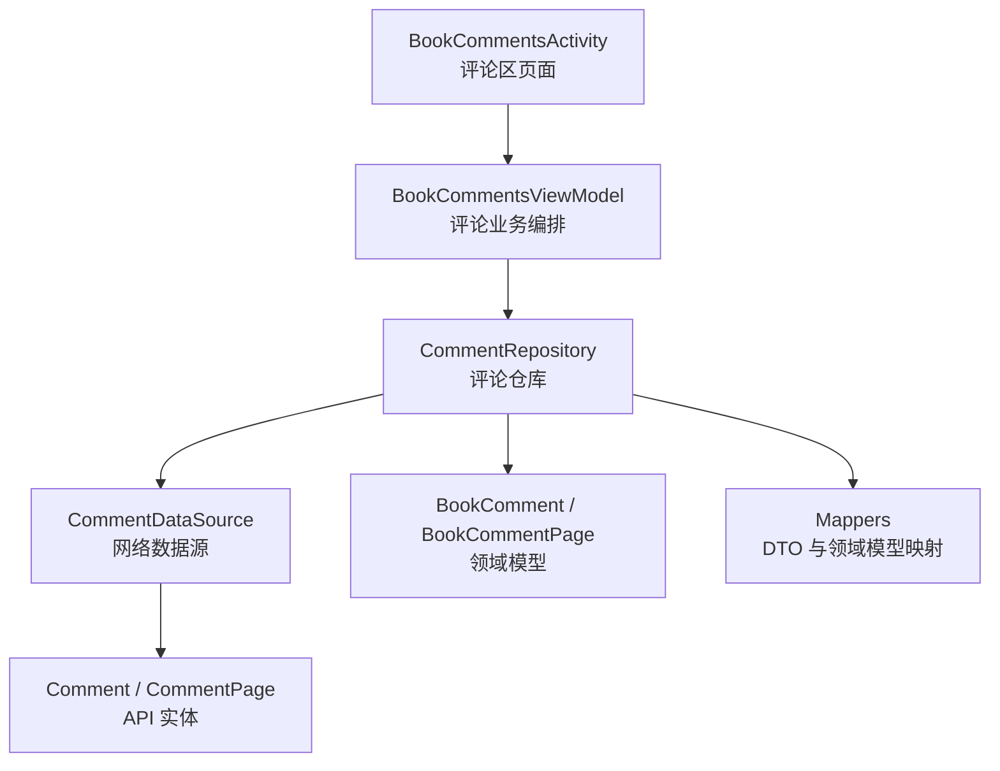
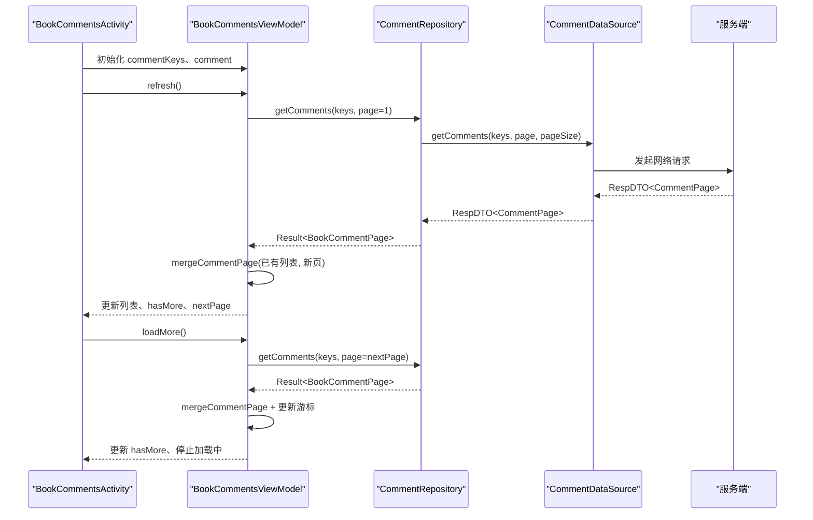
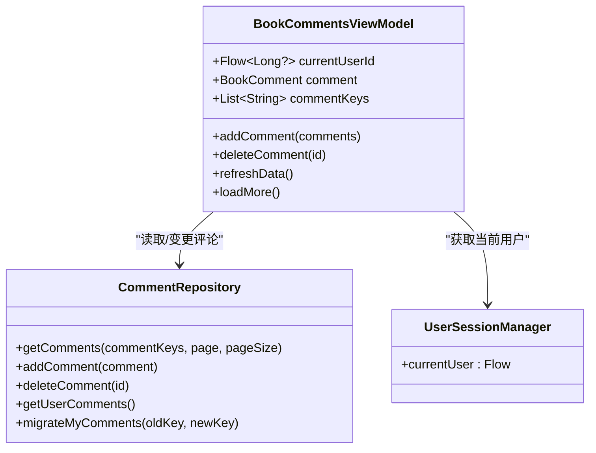
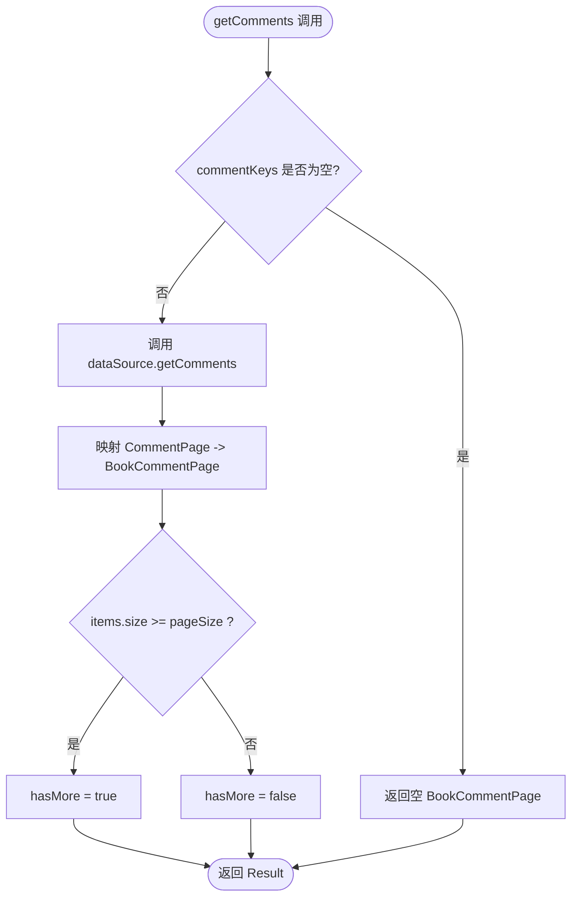
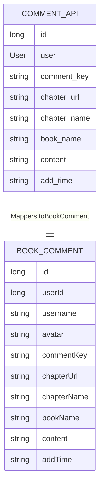
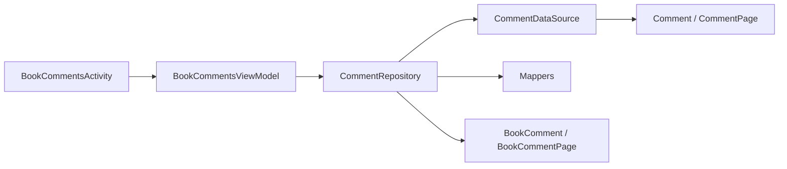
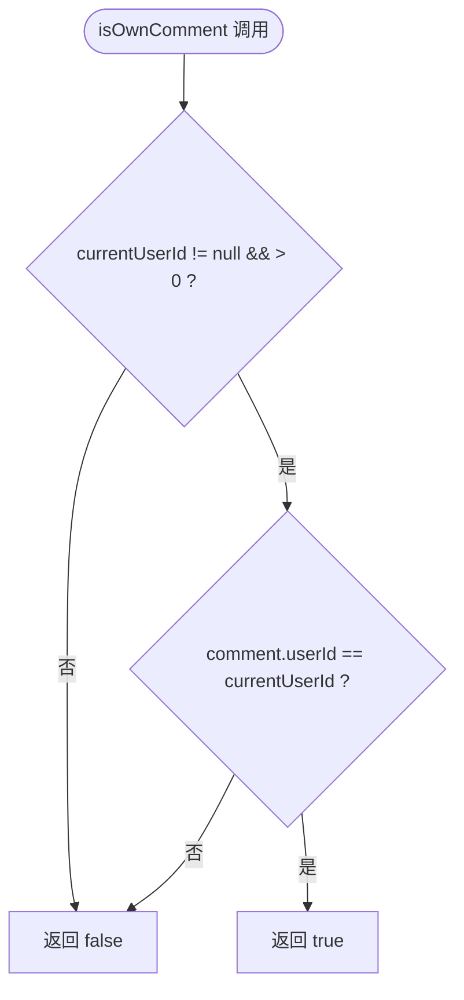
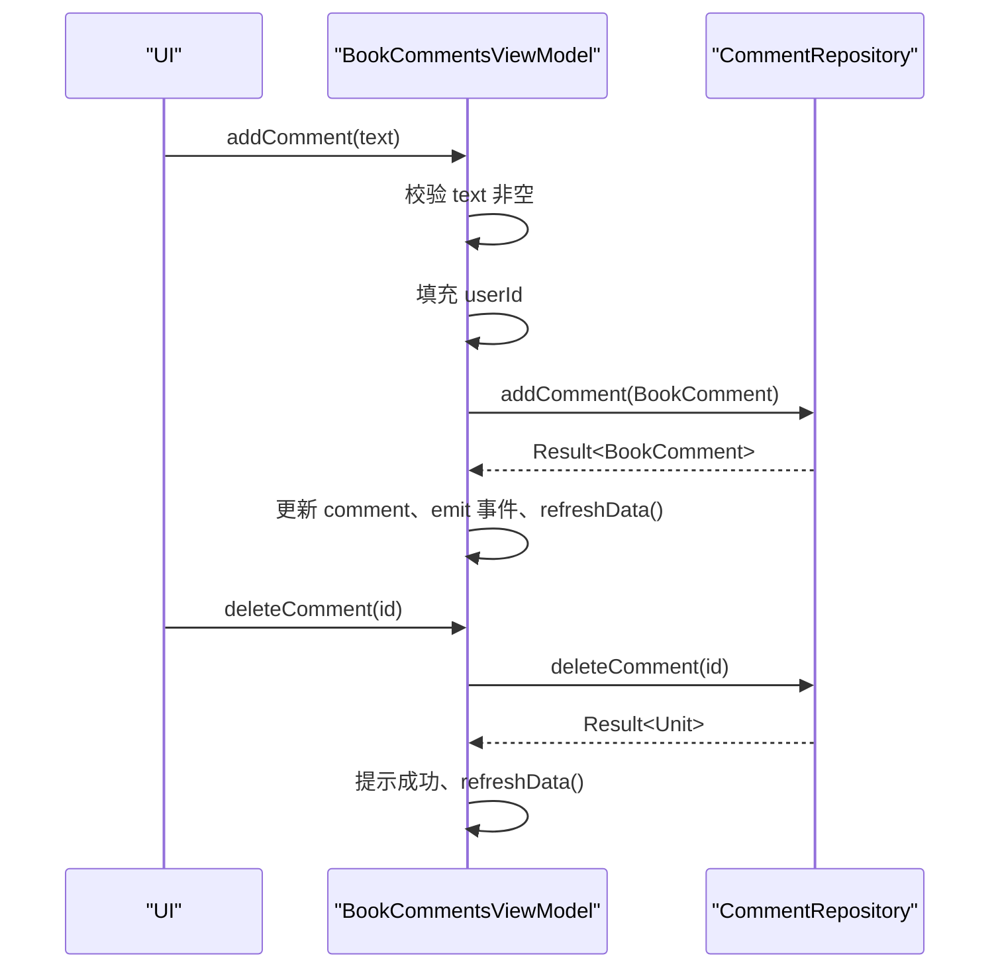
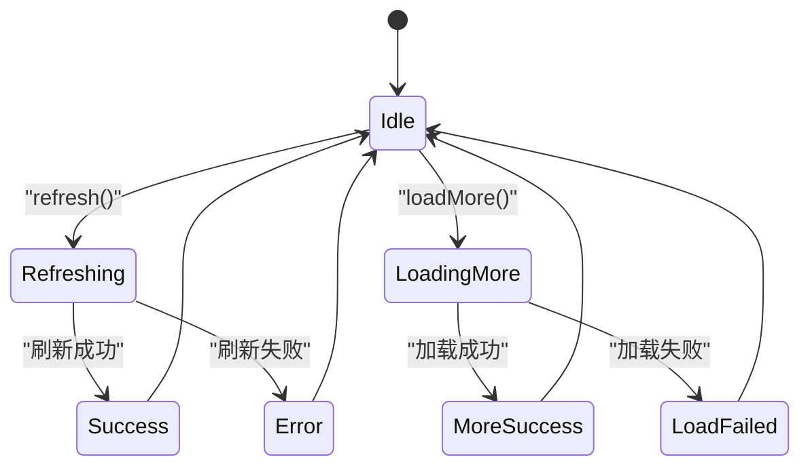

# BookCommentsViewModel - 评论系统管理

<cite>
**本文引用的文件**   
- [BookCommentsViewModel.kt](file://module_book/src/main/java/com/ebook/book/mvvm/viewmodel/BookCommentsViewModel.kt)
- [BookCommentsActivity.kt](file://module_book/src/main/java/com/ebook/book/BookCommentsActivity.kt)
- [CommentRepository.kt](file://lib_book_common/src/main/java/com/ebook/common/repository/CommentRepository.kt)
- [Comment.kt](file://lib_ebook_api/src/main/java/com/ebook/api/entity/Comment.kt)
- [CommentPage.kt](file://lib_ebook_api/src/main/java/com/ebook/api/entity/CommentPage.kt)
- [CommentMigrate.kt](file://lib_ebook_api/src/main/java/com/ebook/api/entity/CommentMigrate.kt)
- [BookComment.kt](file://lib_book_common/src/main/java/com/ebook/common/domain/BookComment.kt)
- [BookCommentPage.kt](file://lib_book_common/src/main/java/com/ebook/common/domain/BookCommentPage.kt)
- [Mappers.kt](file://lib_book_common/src/main/java/com/ebook/common/mapper/Mappers.kt)
- [MergeCommentPageTest.kt](file://module_book/src/test/java/com/ebook/book/mvvm/viewmodel/MergeCommentPageTest.kt)
- [IsOwnCommentTest.kt](file://module_book/src/test/java/com/ebook/book/mvvm/viewmodel/IsOwnCommentTest.kt)
- [CommentRepositoryTest.kt](file://lib_book_common/src/test/java/com/ebook/common/repository/CommentRepositoryTest.kt)
</cite>

## 目录
1. [简介](#简介)
2. [项目结构中的定位](#项目结构中的定位)
3. [核心组件](#核心组件)
4. [架构总览](#架构总览)
5. [详细组件分析](#详细组件分析)
6. [依赖关系分析](#依赖关系分析)
7. [性能与分页特性](#性能与分页特性)
8. [身份识别与权限控制](#身份识别与权限控制)
9. [增删改查操作说明](#增删改查操作说明)
10. [过滤、排序与搜索](#过滤排序与搜索)
11. [异步流程与状态管理示例](#异步流程与状态管理示例)
12. [故障排查指南](#故障排查指南)
13. [结论](#结论)

## 简介
BookCommentsViewModel 是书籍模块中“章节评论”与“我的评论”能力在 ViewModel 层的统一入口。它对外暴露评论列表、当前用户身份、评论输入框以及评论相关动作；对内通过 CommentRepository 访问网络数据源，负责：
- 章节评论和个人评论的数据获取与合并
- 服务端评论与本地占位评论的整合策略
- 评论的发布、删除等变更操作
- 下拉刷新、触底无限滚动和分页加载
- 基于用户身份的本人判定与删除门禁

该 ViewModel 继承通用刷新基类，配合 Activity 的 Compose UI，实现可测试、可预览且与生命周期解耦的评论体验。

## 项目结构中的定位
BookCommentsViewModel 位于书籍模块的 MVVM viewmodel 包中，被 BookCommentsActivity 持有并驱动评论区界面。数据层由共享库 lib_book_common 的 CommentRepository 封装，网络契约由 lib_ebook_api 的 Comment / CommentPage 实体定义，领域模型由 lib_book_common 的 BookComment / BookCommentPage 承载。

**图表来源**
- [BookCommentsActivity.kt:1-200](file://module_book/src/main/java/com/ebook/book/BookCommentsActivity.kt#L1-L200)
- [BookCommentsViewModel.kt:1-179](file://module_book/src/main/java/com/ebook/book/mvvm/viewmodel/BookCommentsViewModel.kt#L1-L179)
- [CommentRepository.kt:1-114](file://lib_book_common/src/main/java/com/ebook/common/repository/CommentRepository.kt#L1-L114)
- [Comment.kt:1-39](file://lib_ebook_api/src/main/java/com/ebook/api/entity/Comment.kt#L1-L39)
- [CommentPage.kt:1-18](file://lib_ebook_api/src/main/java/com/ebook/api/entity/CommentPage.kt#L1-L18)
- [BookComment.kt:1-18](file://lib_book_common/src/main/java/com/ebook/common/domain/BookComment.kt#L1-L18)
- [BookCommentPage.kt:1-17](file://lib_book_common/src/main/java/com/ebook/common/domain/BookCommentPage.kt#L1-L17)
- [Mappers.kt:1-59](file://lib_book_common/src/main/java/com/ebook/common/mapper/Mappers.kt#L1-L59)

**章节来源**
- [BookCommentsActivity.kt:1-200](file://module_book/src/main/java/com/ebook/book/BookCommentsActivity.kt#L1-L200)
- [BookCommentsViewModel.kt:1-179](file://module_book/src/main/java/com/ebook/book/mvvm/viewmodel/BookCommentsViewModel.kt#L1-L179)
- [CommentRepository.kt:1-114](file://lib_book_common/src/main/java/com/ebook/common/repository/CommentRepository.kt#L1-L114)

## 核心组件
- BookCommentsViewModel：评论页面的业务编排者，维护评论列表、当前用户、评论键、下一页游标、加载更多闸门等状态，并暴露 addComment、deleteComment、refreshData、loadMore 等方法。
- CommentRepository：评论数据的统一入口，负责网络请求、分页结果映射、空键守卫、失败翻译、领域模型转换。
- BookComment / BookCommentPage：领域模型，屏蔽 API 嵌套结构，供 UI 和 ViewModel 直接使用。
- Comment / CommentPage：API 传输实体，对齐服务端蛇形字段与分页包裹结构。
- Mappers：Comment 与 BookComment 的双向映射，处理昵称优先展示、chapterUrl 废弃兼容、发送评论时补全 user 信息。
- BookCommentsActivity：评论区页面壳，负责路由参数解析、Compose 状态收集、刷新与加载更多信号绑定。

**章节来源**
- [BookCommentsViewModel.kt:1-179](file://module_book/src/main/java/com/ebook/book/mvvm/viewmodel/BookCommentsViewModel.kt#L1-L179)
- [CommentRepository.kt:1-114](file://lib_book_common/src/main/java/com/ebook/common/repository/CommentRepository.kt#L1-L114)
- [BookComment.kt:1-18](file://lib_book_common/src/main/java/com/ebook/common/domain/BookComment.kt#L1-L18)
- [BookCommentPage.kt:1-17](file://lib_book_common/src/main/java/com/ebook/common/domain/BookCommentPage.kt#L1-L17)
- [Comment.kt:1-39](file://lib_ebook_api/src/main/java/com/ebook/api/entity/Comment.kt#L1-L39)
- [CommentPage.kt:1-18](file://lib_ebook_api/src/main/java/com/ebook/api/entity/CommentPage.kt#L1-L18)
- [Mappers.kt:1-59](file://lib_book_common/src/main/java/com/ebook/common/mapper/Mappers.kt#L1-L59)
- [BookCommentsActivity.kt:1-200](file://module_book/src/main/java/com/ebook/book/BookCommentsActivity.kt#L1-L200)

## 架构总览
评论系统的调用链从 UI 到 Repository 再到网络层，ViewModel 承担状态编排与合并逻辑：

**图表来源**
- [BookCommentsViewModel.kt:1-179](file://module_book/src/main/java/com/ebook/book/mvvm/viewmodel/BookCommentsViewModel.kt#L1-L179)
- [CommentRepository.kt:1-114](file://lib_book_common/src/main/java/com/ebook/common/repository/CommentRepository.kt#L1-L114)
- [BookCommentsActivity.kt:1-200](file://module_book/src/main/java/com/ebook/book/BookCommentsActivity.kt#L1-L200)

## 详细组件分析

### BookCommentsViewModel
BookCommentsViewModel 是评论系统的核心协调器。其职责包括：
- 维护 currentUserId 流，作为本人判定的唯一来源
- 维护 comment 与 commentKeys，前者用于新增评论归属键，后者用于查询范围
- 管理 nextPage、hasMoreData、loadMoreInProgress，控制分页与防抖
- 实现 refreshData、loadMore 以对接 BaseRefreshViewModel
- 提供 addComment、deleteComment 等变更方法
- 提供 isOwnComment 与 mergeCommentPage 两个纯函数，便于单测

关键设计点：
- currentUserId 来自 UserSessionManager.currentUser，避免 UI 直接读 SP
- nextPage 初始为 2，首屏前不触发 loadMore，刷新成功后重置
- loadMoreInProgress 防止滚动中连续触发多次加载
- mergeCommentPage 使用 distinctBy(id) 去重并按时间倒序排序
- isOwnComment 使用 userId 而非 username，避免昵称重复导致误判

**图表来源**
- [BookCommentsViewModel.kt:1-179](file://module_book/src/main/java/com/ebook/book/mvvm/viewmodel/BookCommentsViewModel.kt#L1-L179)
- [CommentRepository.kt:1-114](file://lib_book_common/src/main/java/com/ebook/common/repository/CommentRepository.kt#L1-L114)

**章节来源**
- [BookCommentsViewModel.kt:1-179](file://module_book/src/main/java/com/ebook/book/mvvm/viewmodel/BookCommentsViewModel.kt#L1-L179)

### CommentRepository
CommentRepository 将网络响应包装为领域对象，并提供统一的失败处理和分页判断：
- deleteComment：返回 Unit，成功时 data 为空，以业务码 00000 为成功判据
- getUserComments：一次性拉取个人评论，使用较大的 MY_COMMENTS_PAGE_SIZE
- addComment：把 BookComment 转换为 Comment 后调用网络层
- getComments：按 commentKeys 分页查询，空键直接返回空页，不发请求
- queryCommentPage：统一把 CommentPage 映射为 BookCommentPage，并根据 items.size >= requestedPageSize 推导 hasMore

分页策略：
- PAGE_SIZE = 20，适合轻量的评论条目
- MY_COMMENTS_PAGE_SIZE = 100，保证“我的评论”在未接入分页时不被截断
- hasMore 不信任服务端 total，采用“整页即可能还有下一页”的保守策略

**图表来源**
- [CommentRepository.kt:1-114](file://lib_book_common/src/main/java/com/ebook/common/repository/CommentRepository.kt#L1-L114)

**章节来源**
- [CommentRepository.kt:1-114](file://lib_book_common/src/main/java/com/ebook/common/repository/CommentRepository.kt#L1-L114)

### 数据模型与映射
API 层 Comment 使用蛇形命名并与 User 嵌套；领域层 BookComment 扁平化，避免 UI 直接与 API 耦合。Mappers 负责双向转换：
- toBookComment：username 取 nickname.ifEmpty(username)，avatar 取 image
- toApiComment：新建评论时补全 user 字段，chapterUrl 已废弃但保留兼容

**图表来源**
- [Comment.kt:1-39](file://lib_ebook_api/src/main/java/com/ebook/api/entity/Comment.kt#L1-L39)
- [BookComment.kt:1-18](file://lib_book_common/src/main/java/com/ebook/common/domain/BookComment.kt#L1-L18)
- [Mappers.kt:1-59](file://lib_book_common/src/main/java/com/ebook/common/mapper/Mappers.kt#L1-L59)

**章节来源**
- [Comment.kt:1-39](file://lib_ebook_api/src/main/java/com/ebook/api/entity/Comment.kt#L1-L39)
- [BookComment.kt:1-18](file://lib_book_common/src/main/java/com/ebook/common/domain/BookComment.kt#L1-L18)
- [Mappers.kt:1-59](file://lib_book_common/src/main/java/com/ebook/common/mapper/Mappers.kt#L1-L59)

## 依赖关系分析
- UI 层只消费 BookCommentsViewModel 暴露的状态与回调，不直接访问 Repository
- ViewModel 依赖 CommentRepository 进行数据读写，依赖 UserSessionManager 获取当前用户
- Repository 依赖 CommentDataSource 进行网络调用，并通过 CoroutineAdapter 处理令牌刷新与错误
- Mapper 层解耦 API 实体与领域模型，使 ViewModel 和 UI 仅关心 BookComment

**图表来源**
- [BookCommentsActivity.kt:1-200](file://module_book/src/main/java/com/ebook/book/BookCommentsActivity.kt#L1-L200)
- [BookCommentsViewModel.kt:1-179](file://module_book/src/main/java/com/ebook/book/mvvm/viewmodel/BookCommentsViewModel.kt#L1-L179)
- [CommentRepository.kt:1-114](file://lib_book_common/src/main/java/com/ebook/common/repository/CommentRepository.kt#L1-L114)
- [Mappers.kt:1-59](file://lib_book_common/src/main/java/com/ebook/common/mapper/Mappers.kt#L1-L59)

**章节来源**
- [BookCommentsViewModel.kt:1-179](file://module_book/src/main/java/com/ebook/book/mvvm/viewmodel/BookCommentsViewModel.kt#L1-L179)
- [CommentRepository.kt:1-114](file://lib_book_common/src/main/java/com/ebook/common/repository/CommentRepository.kt#L1-L114)

## 性能与分页特性
- 分页大小：PAGE_SIZE 为 20，MY_COMMENTS_PAGE_SIZE 为 100，兼顾首屏速度与翻页体验
- 空键守卫：空 commentKeys 直接返回空页，避免命中“全局最新列表”的网络分支
- hasMore 推导：以 items.size >= pageSize 为准，减少与服务端 total 的强耦合
- 合并去重：mergeCommentPage 使用 distinctBy(id)，避免并发窗口或键变化导致重复
- 排序口径：按 CommentTime.sortMillis 秒级排序，确保同分钟评论稳定顺序
- 加载更多闸门：loadMoreInProgress 防止滚动中多次触发，刷新不启用该闸门以保证下拉刷新始终可用

这些策略在单元测试中有明确覆盖：
- MergeCommentPageTest 验证追加页、去重、空列表等价首页排序
- CommentRepositoryTest 验证空键守卫、hasMore 推导、透传 page/pageSize、失败翻译、data 为空兜底

**章节来源**
- [CommentRepository.kt:1-114](file://lib_book_common/src/main/java/com/ebook/common/repository/CommentRepository.kt#L1-L114)
- [BookCommentsViewModel.kt:1-179](file://module_book/src/main/java/com/ebook/book/mvvm/viewmodel/BookCommentsViewModel.kt#L1-L179)
- [MergeCommentPageTest.kt:1-61](file://module_book/src/test/java/com/ebook/book/mvvm/viewmodel/MergeCommentPageTest.kt#L1-L61)
- [CommentRepositoryTest.kt:1-200](file://lib_book_common/src/test/java/com/ebook/common/repository/CommentRepositoryTest.kt#L1-L200)

## 身份识别与权限控制
本人判定逻辑集中在 isOwnComment 纯函数：
- 使用 userId 比较，不使用 username，避免昵称重复导致的误判
- currentUserId 必须非 null 且大于 0，未登录或占位评论一律判为非本人
- BookCommentsActivity 通过 viewModel.currentUserId.collectAsState 获取会话用户 ID，并在 UI 上控制删除入口

权限边界：
- 只有本人评论才允许长按删除（UI 层根据 isOwnComment 控制）
- 删除操作最终调用 CommentRepository.deleteComment，后端以 token 校验身份

**图表来源**
- [BookCommentsViewModel.kt:1-179](file://module_book/src/main/java/com/ebook/book/mvvm/viewmodel/BookCommentsViewModel.kt#L1-L179)
- [IsOwnCommentTest.kt:1-56](file://module_book/src/test/java/com/ebook/book/mvvm/viewmodel/IsOwnCommentTest.kt#L1-L56)

**章节来源**
- [BookCommentsViewModel.kt:1-179](file://module_book/src/main/java/com/ebook/book/mvvm/viewmodel/BookCommentsViewModel.kt#L1-L179)
- [IsOwnCommentTest.kt:1-56](file://module_book/src/test/java/com/ebook/book/mvvm/viewmodel/IsOwnCommentTest.kt#L1-L56)

## 增删改查操作说明
- 查询：
  - 章节评论：refreshData 调用 getComments(keys, page=1)，loadMore 调用 getComments(keys, page=nextPage)
  - 个人评论：CommentRepository.getUserComments 一次性拉取（未来可并入分页）
- 新增：
  - addComment 校验内容非空，设置 userId，调用 addComment 成功后刷新列表
- 删除：
  - deleteComment 调用 deleteComment，成功后提示并刷新列表
- 修改：
  - 当前实现未暴露编辑接口；如需编辑可在 ViewModel 增加 editComment 并复用 CommentRepository 的 mutateComment 模式

**图表来源**
- [BookCommentsViewModel.kt:1-179](file://module_book/src/main/java/com/ebook/book/mvvm/viewmodel/BookCommentsViewModel.kt#L1-L179)
- [CommentRepository.kt:1-114](file://lib_book_common/src/main/java/com/ebook/common/repository/CommentRepository.kt#L1-L114)

**章节来源**
- [BookCommentsViewModel.kt:1-179](file://module_book/src/main/java/com/ebook/book/mvvm/viewmodel/BookCommentsViewModel.kt#L1-L179)
- [CommentRepository.kt:1-114](file://lib_book_common/src/main/java/com/ebook/common/repository/CommentRepository.kt#L1-L114)

## 过滤、排序与搜索
- 排序：mergeCommentPage 对合并后的列表按时间倒序排序，保证任何到达顺序的分页都收敛到一致的展示序
- 过滤：当前实现未在 ViewModel 提供内置过滤逻辑；若需按用户名、关键词过滤，可在 UI 层对 list.value 做二次过滤，或在 ViewModel 暴露 filterState 与 filteredComments 流
- 搜索：当前实现未提供搜索功能；可扩展 searchQuery StateFlow，结合 Repository 的 keyword 参数或服务端搜索接口

由于当前代码未包含内置过滤与搜索实现，本节提供概念性建议，不涉及具体源码行号。

## 异步流程与状态管理示例
以下示例展示如何处理评论相关的异步操作与状态管理：

- 首次加载：
  - Activity 初始化 commentKeys 与 comment
  - 触发 refreshData，ViewModel 调用 getComments(page=1)
  - 成功后 updateList(mergeCommentPage(emptyList(), items))，重置 nextPage=2，更新 hasMoreData

- 加载更多：
  - 触底触发 loadMore，检查 loadMoreInProgress 与 hasMoreData
  - 调用 getComments(nextPage)，成功后 mergeCommentPage(list.value, items)
  - 递增 nextPage，更新 hasMoreData，结束 loading

- 发布评论：
  - 校验内容非空，设置 userId
  - 调用 addComment，成功后更新 comment、emit mVoidSingleLiveEvent、refreshData

- 删除评论：
  - 调用 deleteComment，成功后提示并 refreshData

**图表来源**
- [BookCommentsViewModel.kt:1-179](file://module_book/src/main/java/com/ebook/book/mvvm/viewmodel/BookCommentsViewModel.kt#L1-L179)

**章节来源**
- [BookCommentsViewModel.kt:1-179](file://module_book/src/main/java/com/ebook/book/mvvm/viewmodel/BookCommentsViewModel.kt#L1-L179)

## 故障排查指南
常见问题与定位思路：
- 评论列表不更新：
  - 检查 refreshData 是否调用 updateList 与 updateStopRefresh
  - 检查 mergeCommentPage 是否正确合并与排序
- 加载更多无效：
  - 检查 hasMoreData 与 loadMoreInProgress 状态
  - 检查 nextPage 是否递增
  - 检查 CommentRepository.getComments 是否返回正确的 hasMore
- 删除按钮异常显示：
  - 检查 isOwnComment 是否传入正确的 currentUserId
  - 检查 UI 层是否正确收集 currentUserId 流
- 网络错误处理：
  - 检查 reportFailure 是否被调用
  - 检查 CommentRepository.safeApiCall 与 mapCatching 的错误传播

相关测试用例可作为行为参考：
- IsOwnCommentTest 覆盖未登录、占位评论、负数 ID 等边界
- MergeCommentPageTest 覆盖追加页、去重、空列表
- CommentRepositoryTest 覆盖空键守卫、hasMore 推导、失败翻译

**章节来源**
- [BookCommentsViewModel.kt:1-179](file://module_book/src/main/java/com/ebook/book/mvvm/viewmodel/BookCommentsViewModel.kt#L1-L179)
- [IsOwnCommentTest.kt:1-56](file://module_book/src/test/java/com/ebook/book/mvvm/viewmodel/IsOwnCommentTest.kt#L1-L56)
- [MergeCommentPageTest.kt:1-61](file://module_book/src/test/java/com/ebook/book/mvvm/viewmodel/MergeCommentPageTest.kt#L1-L61)
- [CommentRepositoryTest.kt:1-200](file://lib_book_common/src/test/java/com/ebook/common/repository/CommentRepositoryTest.kt#L1-L200)

## 结论
BookCommentsViewModel 通过清晰的职责划分与纯函数设计，实现了章节评论与个人评论的统一管理。它以 CommentRepository 为数据边界，以 UserSessionManager 为身份边界，以 mergeCommentPage 与 isOwnComment 为核心算法，保证了分页合并的正确性与本人判定的稳定性。配合 BookCommentsActivity 的 Compose 状态管理与基础刷新组件，该实现具备良好的可测试性、可维护性与扩展性。后续如需支持编辑、搜索与更细粒度的过滤，可在现有 ViewModel 基础上引入更多 StateFlow 与筛选逻辑，同时保持 Repository 层的数据契约不变。