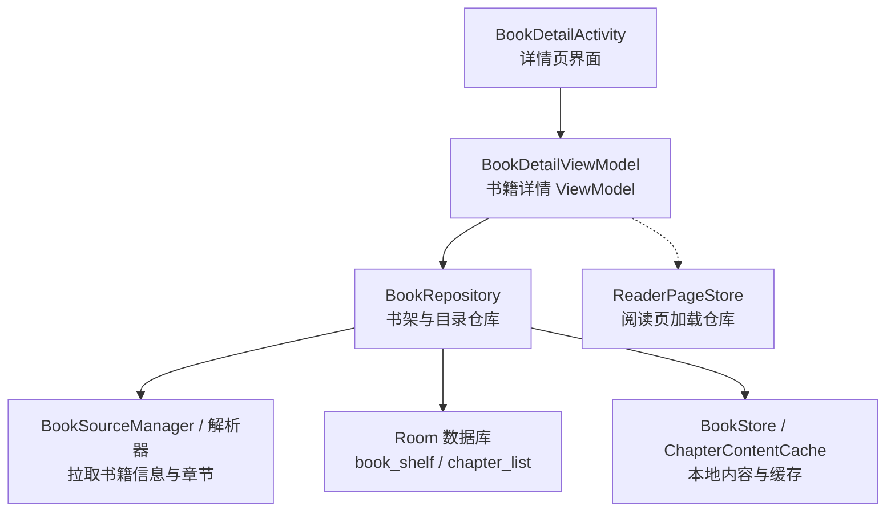
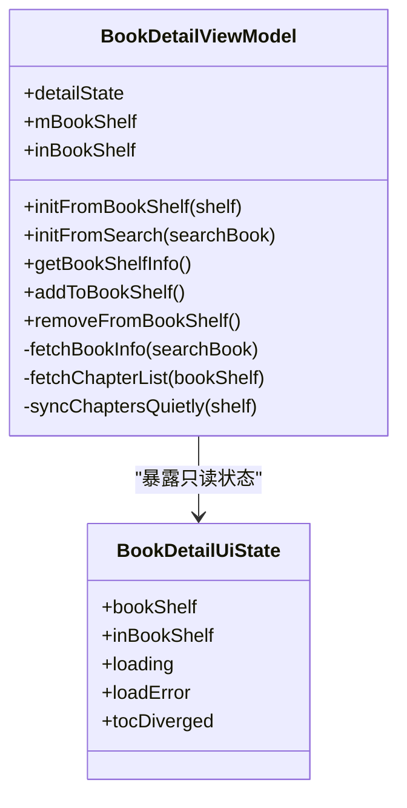
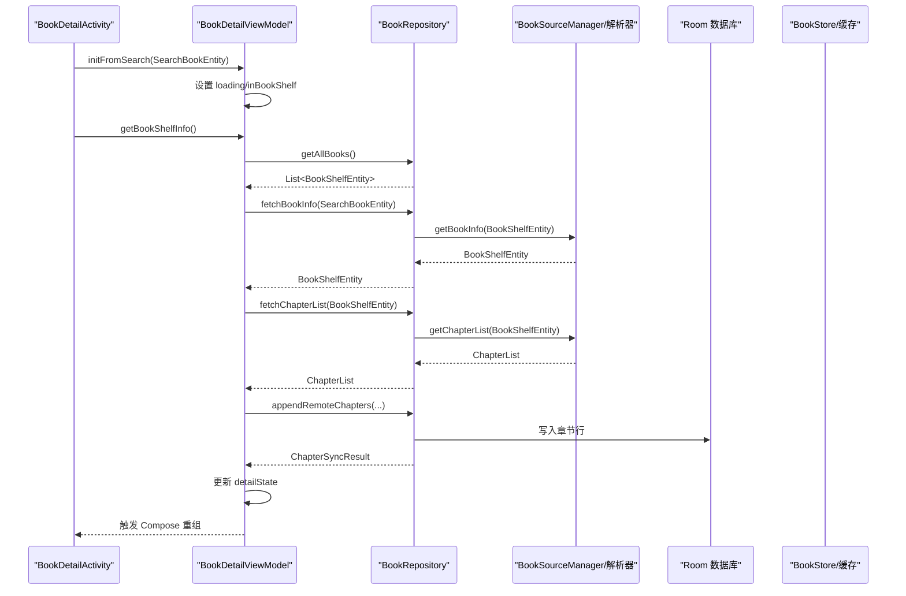
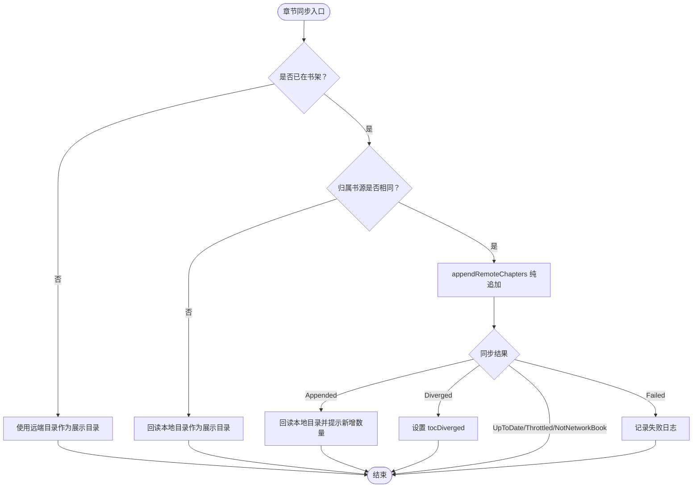
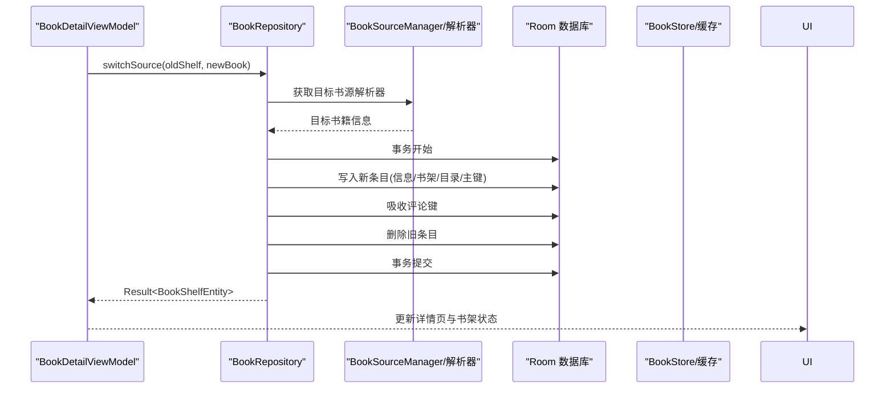
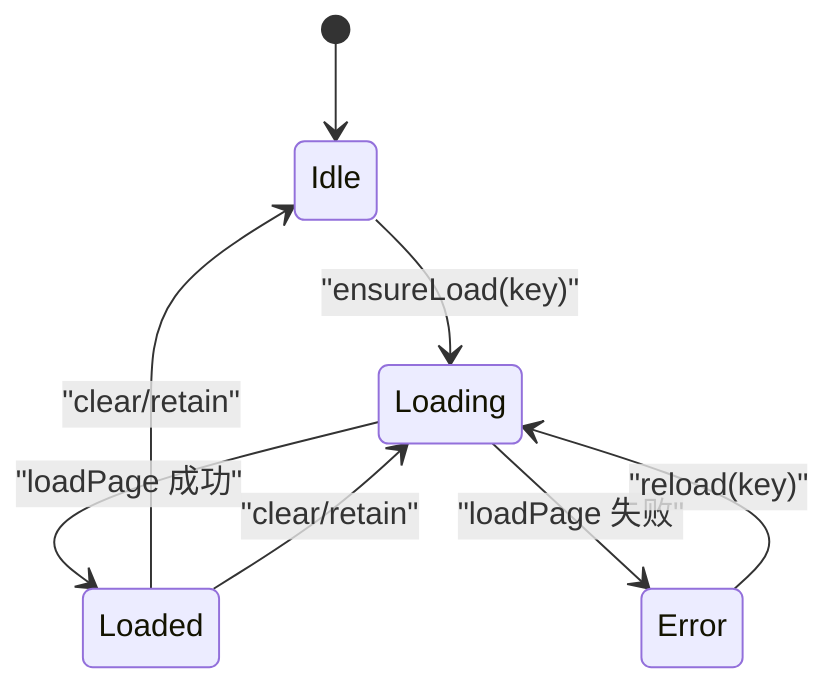
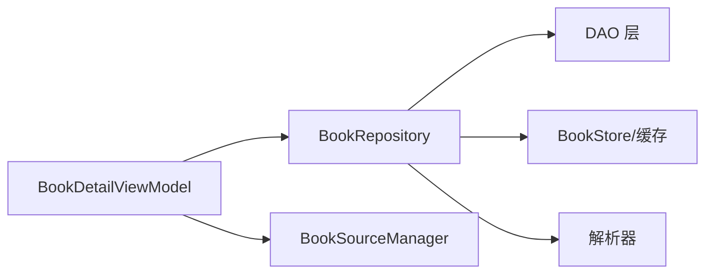

# BookDetailViewModel - 书籍详情管理

<cite>
**本文引用的文件**   
- [BookDetailViewModel.kt](file://module_book/src/main/java/com/ebook/book/mvvm/viewmodel/BookDetailViewModel.kt)
- [ReaderPageStore.kt](file://module_book/src/main/java/com/ebook/book/reader/ReaderPageStore.kt)
- [BookRepository.kt](file://lib_book_common/src/main/java/com/ebook/common/repository/BookRepository.kt)
- [BookDetailActivity.kt](file://module_book/src/main/java/com/ebook/book/BookDetailActivity.kt)
</cite>

## 目录
1. [简介](#简介)
2. [项目结构与定位](#项目结构与定位)
3. [核心职责与状态模型](#核心职责与状态模型)
4. [架构总览](#架构总览)
5. [详细组件分析](#详细组件分析)
6. [依赖关系分析](#依赖关系分析)
7. [性能与可扩展性](#性能与可扩展性)
8. [故障排查指南](#故障排查指南)
9. [结论](#结论)

## 简介
本文围绕 `BookDetailViewModel`（书籍详情 ViewModel）展开，系统梳理其在书籍元数据管理、章节列表加载、目录树构建、跨书源换书、异步加载与重试、评分标签扩展点，以及与阅读页 `ReaderPageStore` 的集成方式。文档面向不同技术背景的读者，先给出高层结构，再逐步深入到源码级流程与边界条件。

## 项目结构与定位
`BookDetailViewModel` 位于书籍模块的 MVVM 视图模型层，负责“详情页”的可观察 UI 状态与业务编排；它不直接操作数据库或网络，而是通过 `BookRepository` 统一调度 DAO、书源解析器、内容仓库与缓存。UI 侧由 `BookDetailActivity` 订阅其状态流并驱动 Compose 重组。

**图表来源**
- [BookDetailViewModel.kt:1-339](file://module_book/src/main/java/com/ebook/book/mvvm/viewmodel/BookDetailViewModel.kt#L1-L339)
- [BookRepository.kt:43-1105](file://lib_book_common/src/main/java/com/ebook/common/repository/BookRepository.kt#L43-L1105)
- [ReaderPageStore.kt:1-98](file://module_book/src/main/java/com/ebook/book/reader/ReaderPageStore.kt#L1-L98)

**章节来源**
- [BookDetailViewModel.kt:1-339](file://module_book/src/main/java/com/ebook/book/mvvm/viewmodel/BookDetailViewModel.kt#L1-L339)
- [BookDetailActivity.kt](file://module_book/src/main/java/com/ebook/book/BookDetailActivity.kt)

## 核心职责与状态模型
`BookDetailViewModel` 的核心职责可归纳为：
- 维护详情页 UI 状态，驱动 Compose 重组。
- 处理两种入口：书架入口（本地实体立即渲染 + 静默目录检查）和搜索入口（网络拉取详情与章节）。
- 同步章节目录，区分追加成功、目录分叉、限频与失败等结果。
- 管理“是否在书架”的状态，响应书架事件。
- 提供加入书架、移出书架等命令式动作。
- 封装从 `SearchBookEntity` 到 `BookShelfEntity` 的映射、按书源解析器拉取详情与目录。

### UI 状态模型
UI 状态收敛为单一 `BookDetailUiState`，包含：
- `bookShelf`：当前书籍详情实体，含章节列表。
- `inBookShelf`：是否已在书架。
- `loading`：详情是否正在网络拉取。
- `loadError`：详情拉取是否失败。
- `tocDiverged`：本次会话内目录被判定为分叉（本地不是远端前缀），提示用户处置。

该设计避免了历史实现中多事件流与字段不同步导致的页面不刷新问题。

**图表来源**
- [BookDetailViewModel.kt:1-339](file://module_book/src/main/java/com/ebook/book/mvvm/viewmodel/BookDetailViewModel.kt#L1-L339)

**章节来源**
- [BookDetailViewModel.kt:1-120](file://module_book/src/main/java/com/ebook/book/mvvm/viewmodel/BookDetailViewModel.kt#L1-L120)

## 架构总览
详情页的数据流遵循“ViewModel 编排 → Repository 调度 → DAO/Parser/Store → 事件回写 → ViewModel 状态更新”的路径。搜索入口会走完整网络路径；书架入口优先本地数据，后台静默校验目录。

**图表来源**
- [BookDetailViewModel.kt:120-339](file://module_book/src/main/java/com/ebook/book/mvvm/viewmodel/BookDetailViewModel.kt#L120-L339)
- [BookRepository.kt:585-722](file://lib_book_common/src/main/java/com/ebook/common/repository/BookRepository.kt#L585-L722)

**章节来源**
- [BookDetailViewModel.kt:120-339](file://module_book/src/main/java/com/ebook/book/mvvm/viewmodel/BookDetailViewModel.kt#L120-L339)
- [BookRepository.kt:585-722](file://lib_book_common/src/main/java/com/ebook/common/repository/BookRepository.kt#L585-L722)

## 详细组件分析

### 1. 书籍元数据管理与搜索入口
- 搜索入口调用 `initFromSearch` 先用 `SearchBookEntity.add` 标记是否在书架，并把 `loading` 置位。
- `getBookShelfInfo` 拉取全部书架条目作为内存快照，用于后续进度合并与归属判断。
- `fetchBookInfo` 根据 `SearchBookEntity.tag` 获取对应书源解析器，构造 `BookShelfEntity` 并拉取书籍信息。
- 如果书源已失效或解析失败，使用 `reportFailure` 提示后返回空，让上层进入错误态，避免页面永远转圈。

关键点：
- 书源选择基于 `tag`，而非默认源，确保详情页展示的书来自正确的站点。
- 取消异常不会被吞掉，防止销毁中的页面误报错误。

**章节来源**
- [BookDetailViewModel.kt:120-230](file://module_book/src/main/java/com/ebook/book/mvvm/viewmodel/BookDetailViewModel.kt#L120-L230)
- [BookDetailViewModel.kt:260-305](file://module_book/src/main/java/com/ebook/book/mvvm/viewmodel/BookDetailViewModel.kt#L260-L305)

### 2. 章节列表加载与目录同步
- `fetchChapterList` 同样按 `bookShelf.tag` 获取解析器拉取章节列表。
- 若书籍已在书架且归属相同，则调用 `appendRemoteChapters` 做纯追加落库；否则直接使用远端目录作为展示。
- `syncChaptersQuietly` 是书架入口的静默目录检查：只有新增章节时提示条数，出现分叉才设置 `tocDiverged`，其余结果（限频、无网络书、失败）不打扰用户。

目录同步的关键语义：
- 纯追加策略：一旦检测到目录分叉（本地不是远端前缀），放弃自动合并，交由用户换源或手动处置。
- 读取最新目录：追加成功后从数据库重新读取章节列表，保证 UI 与阅读器使用的目录一致。
- 未加书架的情况：直接使用远端目录作为唯一可读目录；此时无法持久化进度，因为书架行尚未存在。

**图表来源**
- [BookDetailViewModel.kt:140-250](file://module_book/src/main/java/com/ebook/book/mvvm/viewmodel/BookDetailViewModel.kt#L140-L250)
- [BookRepository.kt:585-722](file://lib_book_common/src/main/java/com/ebook/common/repository/BookRepository.kt#L585-L722)

**章节来源**
- [BookDetailViewModel.kt:140-250](file://module_book/src/main/java/com/ebook/book/mvvm/viewmodel/BookDetailViewModel.kt#L140-L250)
- [BookRepository.kt:585-722](file://lib_book_common/src/main/java/com/ebook/common/repository/BookRepository.kt#L585-L722)

### 3. 跨书源换书功能
跨书源换书的核心在 `BookRepository.switchSource`，`BookDetailViewModel` 的职责是持有当前书籍并触发相关操作；实际换源逻辑包括：
- 目标书源解析与详情拉取。
- 将旧书架条目原地替换为新条目。
- 对章节序号进行映射，保留阅读进度。
- 清理下载队列中与旧条目相关的任务。
- 保持本地书内容缓存一致性，允许切回旧源时快速恢复。

换书的约束与保障：
- 本地书不可换源，因为本地书没有外部书源。
- 事务内完成新条目写入、评论键吸收、旧条目删除，保证原子性。
- 事件不在事务内发出，避免“半提交”状态污染观察者。
- 旧目录暂留以便切回旧源时秒开，但进程重启后会由 `reconcileContentStore` 回收。

**图表来源**
- [BookRepository.kt:362-430](file://lib_book_common/src/main/java/com/ebook/common/repository/BookRepository.kt#L362-L430)
- [BookRepository.kt:957-975](file://lib_book_common/src/main/java/com/ebook/common/repository/BookRepository.kt#L957-L975)

**章节来源**
- [BookRepository.kt:362-430](file://lib_book_common/src/main/java/com/ebook/common/repository/BookRepository.kt#L362-L430)
- [BookRepository.kt:957-975](file://lib_book_common/src/main/java/com/ebook/common/repository/BookRepository.kt#L957-L975)

### 4. 书籍信息的异步加载机制
- 网络请求：通过解析器的 `getBookInfo` 与 `getChapterList` 发起，失败时区分取消、书源无效与其他异常。
- 本地缓存：目录与正文分别通过 `ChapterContentCache` 与 `BookStore` 管理；换源与目录同步会谨慎地控制缓存失效。
- 错误重试：详情页错误态仅表示“详情或章节拉取失败”，不会清空已有书籍实体；用户可重试或切换书源。

重点行为：
- 搜索入口失败时保留已有 `bookShelf`，避免书架入口打开后突然断链。
- 取消异常不被捕获，避免销毁中的页面显示错误态。
- 书源无效时通过 `reportFailure` 提示用户，同时记录日志便于诊断。

**章节来源**
- [BookDetailViewModel.kt:200-339](file://module_book/src/main/java/com/ebook/book/mvvm/viewmodel/BookDetailViewModel.kt#L200-L339)
- [BookRepository.kt:585-722](file://lib_book_common/src/main/java/com/ebook/common/repository/BookRepository.kt#L585-L722)

### 5. 章节目录动态加载与分页机制
- 目录分页由书源解析器负责；ViewModel 不关心分页细节，只消费最终章节列表。
- 大目录优化：静默目录检查只在必要时执行；追加成功后从数据库读取稳定目录，避免内存与 UI 不一致。
- 阅读器侧分页由 `ReaderPageStore` 负责，按页面键去重并在几何变化时裁剪缓存。

关键设计：
- 详情页展示目录与阅读器使用的目录必须一致，因此追加成功后回读数据库，而不是拼接远端与本地。
- 进度保存时对 `durChapter` 做钳制，防止因目录行数不一致导致越界。

**章节来源**
- [BookDetailViewModel.kt:140-250](file://module_book/src/main/java/com/ebook/book/mvvm/viewmodel/BookDetailViewModel.kt#L140-L250)
- [BookRepository.kt:180-210](file://lib_book_common/src/main/java/com/ebook/common/repository/BookRepository.kt#L180-L210)
- [ReaderPageStore.kt:1-98](file://module_book/src/main/java/com/ebook/book/reader/ReaderPageStore.kt#L1-L98)

### 6. 书籍评分、标签管理与自定义字段
在当前源码中，`BookDetailViewModel` 主要围绕书籍基本信息、章节与书架状态；评分、标签与自定义字段的持久化与聚合通常落在 `BookShelfEntity`、`BookInfoDao`、`CommentKey` 及评论区相关仓库中。ViewModel 可通过以下扩展点接入：
- 在 `BookDetailUiState` 增加评分与标签字段，并由 `BookRepository` 暴露查询与更新接口。
- 在 `getBookWithDetails` 或 `getAllBooksWithDetails` 中补齐评分与标签关联数据。
- 在评论区通过 `getCommentKeysForBook` 聚合跨源评论键，支持评分与标签的跨源一致性。

建议实现原则：
- 评分与标签变更应触发书架事件，使详情页与书架页保持一致。
- 自定义字段需考虑向后兼容与 schema 迁移。
- UI 状态更新仍通过 `detailState.update` 提交，确保 Compose 重组。

**章节来源**
- [BookRepository.kt:753-761](file://lib_book_common/src/main/java/com/ebook/common/repository/BookRepository.kt#L753-L761)
- [BookDetailViewModel.kt:1-120](file://module_book/src/main/java/com/ebook/book/mvvm/viewmodel/BookDetailViewModel.kt#L1-L120)

### 7. 与 ReaderPageStore 的集成与阅读恢复
`ReaderPageStore` 是阅读页的加载仓库，负责：
- 以 `ReaderPageKey` 为键去重加载页面。
- 维护页面状态映射与在途任务。
- 提供 `ensureLoad`、`reload`、`clear`、`retain` 等生命周期方法。
- 通过 `onLoaded` 回调通知前端重算几何，避免重复请求与闪烁。

与 `BookDetailViewModel` 的关系：
- 详情页决定进入阅读器时的初始章节与页面位置。
- 阅读器侧使用 `ReaderPageStore` 管理翻页与滚屏模式的页面加载。
- 阅读恢复通过 `saveProgress` 持久化 `durChapter` 与 `durChapterPage`，退出时由 `BookRepository` 更新书架事件。

**图表来源**
- [ReaderPageStore.kt:1-98](file://module_book/src/main/java/com/ebook/book/reader/ReaderPageStore.kt#L1-L98)

**章节来源**
- [ReaderPageStore.kt:1-98](file://module_book/src/main/java/com/ebook/book/reader/ReaderPageStore.kt#L1-L98)
- [BookRepository.kt:180-210](file://lib_book_common/src/main/java/com/ebook/common/repository/BookRepository.kt#L180-L210)

## 依赖关系分析
`BookDetailViewModel` 依赖较少，耦合集中在 `BookRepository` 与 `BookSourceManager`：
- `BookRepository`：统一书架 CRUD、目录同步、换源、内容仓库对账、事件发布。
- `BookSourceManager`：按 `tag` 获取解析器，负责跨书源解析。
- `ReaderPageStore`：由阅读器侧使用，ViewModel 不直接持有，但共享“目录与进度一致性”的设计约束。

**图表来源**
- [BookDetailViewModel.kt:1-339](file://module_book/src/main/java/com/ebook/book/mvvm/viewmodel/BookDetailViewModel.kt#L1-L339)
- [BookRepository.kt:43-1105](file://lib_book_common/src/main/java/com/ebook/common/repository/BookRepository.kt#L43-L1105)

**章节来源**
- [BookDetailViewModel.kt:1-339](file://module_book/src/main/java/com/ebook/book/mvvm/viewmodel/BookDetailViewModel.kt#L1-L339)
- [BookRepository.kt:43-1105](file://lib_book_common/src/main/java/com/ebook/common/repository/BookRepository.kt#L43-L1105)

## 性能与可扩展性
- 静默目录检查：书架入口先渲染本地数据，后台检查目录，避免白屏。
- 目录追加限制：仅允许纯追加，避免序号漂移导致读错章。
- 进度钳制：保存进度时钳制到库内行数，防止越界。
- 缓存一致性：换源与目录同步谨慎控制缓存失效，保证切回旧源可秒开。
- 状态收敛：单一 `detailState` 避免多事件流与字段不同步导致的 UI 不刷新。

建议优化方向：
- 对超大目录可引入懒加载与虚拟滚动。
- 评分与标签可在仓库层批量更新，减少 UI 抖动。
- 错误重试可增加退避策略，避免频繁请求失败书源。

[本节为通用指导，不直接分析具体代码文件]

## 故障排查指南
常见问题与排查要点：
- 详情页不刷新：确认是否使用 `detailState.update` 提交新对象引用；普通字段修改不会触发重组。
- 目录不同步：检查是否追加成功后回读数据库，而不是拼接远端与本地目录。
- 阅读进度丢失：确认 `saveProgress` 是否正确钳制 `durChapter` 并触发书架事件。
- 书源无效：查看 `reportFailure` 提示与日志，确认 `tag` 与解析器匹配。
- 换源失败：检查事务内写入顺序、评论键吸收与旧条目删除逻辑。

**章节来源**
- [BookDetailViewModel.kt:1-120](file://module_book/src/main/java/com/ebook/book/mvvm/viewmodel/BookDetailViewModel.kt#L1-L120)
- [BookDetailViewModel.kt:260-339](file://module_book/src/main/java/com/ebook/book/mvvm/viewmodel/BookDetailViewModel.kt#L260-L339)
- [BookRepository.kt:180-210](file://lib_book_common/src/main/java/com/ebook/common/repository/BookRepository.kt#L180-L210)
- [BookRepository.kt:362-430](file://lib_book_common/src/main/java/com/ebook/common/repository/BookRepository.kt#L362-L430)

## 结论
`BookDetailViewModel` 以简洁的状态模型和清晰的编排逻辑，支撑了书籍详情页的核心体验：快速渲染、目录同步、跨书源换书、阅读恢复与错误提示。它与 `BookRepository` 和 `ReaderPageStore` 的配合，体现了分层清晰、职责明确、可测试性与可扩展性的设计目标。未来在评分、标签与自定义字段方面，可沿现有事件与状态流模式扩展，保持 UI 与数据的一致性。