# BookListViewModel - 书架列表管理

<cite>
**本文引用的文件 **
- [BookListViewModel.kt](file://module_book/src/main/java/com/ebook/book/mvvm/viewmodel/BookListViewModel.kt)
- [BookShelfPage.kt](file://module_book/src/main/java/com/ebook/book/page/BookShelfPage.kt)
- [BookRepository.kt](file://lib_book_common/src/main/java/com/ebook/common/repository/BookRepository.kt)
- [BookShelfManager.kt](file://lib_book_common/src/main/java/com/ebook/common/manager/BookShelfManager.kt)
- [LocalImportCoordinator.kt](file://lib_book_common/src/main/java/com/ebook/common/importer/LocalImportCoordinator.kt)
- [LocalBookImporter.kt](file://lib_book_common/src/main/java/com/ebook/common/importer/LocalBookImporter.kt)
- [BookImportViewModel.kt](file://module_book/src/main/java/com/ebook/book/mvvm/viewmodel/BookImportViewModel.kt)
- [ImportBookActivity.kt](file://module_book/src/main/java/com/ebook/book/ImportBookActivity.kt)
</cite>

## 目录
1. [简介](#简介)
2. [项目结构与定位](#项目结构与定位)
3. [核心职责与数据流](#核心职责与数据流)
4. [架构总览](#架构总览)
5. [详细组件分析](#详细组件分析)
6. [依赖关系分析](#依赖关系分析)
7. [性能与优化建议](#性能与优化建议)
8. [故障排查指南](#故障排查指南)
9. [结论](#结论)

## 简介
本文件围绕 `BookListViewModel`（书架列表 ViewModel）展开，系统说明其在 MVVM 架构中的职责、与 `BookRepository` 的协作方式、阅读进度跟踪逻辑、多书源切换策略、StateFlow 状态管理，以及本地书籍导入在书架侧的表现。文档同时给出 Compose UI 观察状态的实践路径、常见问题与性能建议，帮助读者在不深入源码的情况下理解并正确使用该组件。

## 项目结构与定位
`BookListViewModel` 位于模块 `module_book` 的 `mvvm.viewmodel` 包中，是书架页面的视图模型；它继承基础刷新 ViewModel，并委托 `BookRepository` 完成书架数据的获取、事件广播与更新。UI 层由 Compose 实现的 `BookShelfPage` 消费其 StateFlow 列表与解析中占位列表。

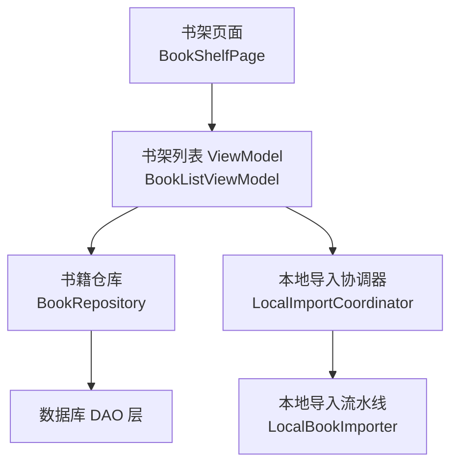

**图示来源**
- [BookListViewModel.kt:1-68](file://module_book/src/main/java/com/ebook/book/mvvm/viewmodel/BookListViewModel.kt#L1-L68)
- [BookShelfPage.kt:1-200](file://module_book/src/main/java/com/ebook/book/page/BookShelfPage.kt#L1-L200)
- [BookRepository.kt:1-200](file://lib_book_common/src/main/java/com/ebook/common/repository/BookRepository.kt#L1-L200)
- [LocalImportCoordinator.kt:1-200](file://lib_book_common/src/main/java/com/ebook/common/importer/LocalImportCoordinator.kt#L1-L200)
- [LocalBookImporter.kt:1-200](file://lib_book_common/src/main/java/com/ebook/common/importer/LocalBookImporter.kt#L1-L200)

**章节来源**
- [BookListViewModel.kt:1-68](file://module_book/src/main/java/com/ebook/book/mvvm/viewmodel/BookListViewModel.kt#L1-L68)
- [BookShelfPage.kt:1-200](file://module_book/src/main/java/com/ebook/book/page/BookShelfPage.kt#L1-L200)

## 核心职责与数据流
`BookListViewModel` 的职责可归纳为四点：
1. 刷新书架列表：下拉刷新与事件驱动刷新共用同一实现，保证行为一致且幂等。
2. 收集仓库事件：自动响应新增、移除、阅读进度更新和章节更新事件，触发列表刷新。
3. 转发正在解析的导入：将进程级导入协调器的解析进度以占位行形式展示在书架。
4. 提供统一的数据读取入口：通过仓库一次性加载带详情的书架条目，避免 UI 层重复拼装。

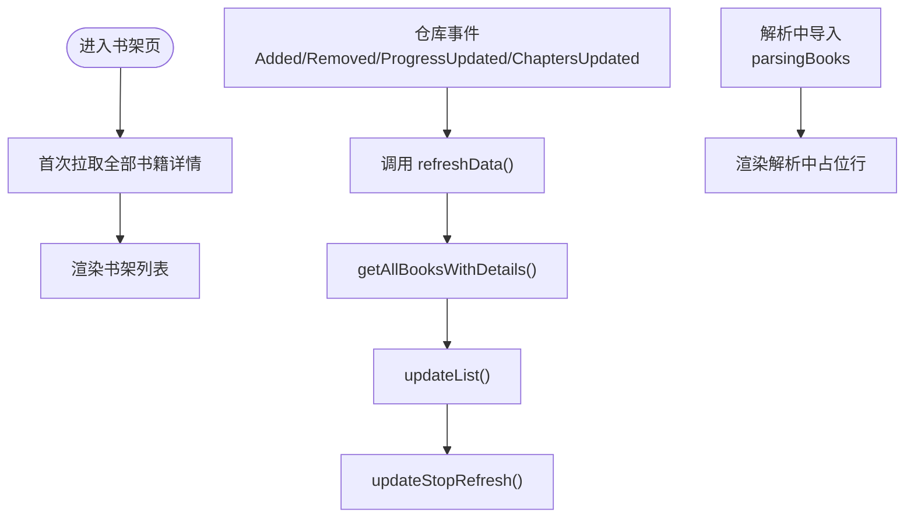

**图示来源**
- [BookListViewModel.kt:19-68](file://module_book/src/main/java/com/ebook/book/mvvm/viewmodel/BookListViewModel.kt#L19-L68)
- [BookRepository.kt:1-200](file://lib_book_common/src/main/java/com/ebook/common/repository/BookRepository.kt#L1-L200)
- [LocalImportCoordinator.kt:1-200](file://lib_book_common/src/main/java/com/ebook/common/importer/LocalImportCoordinator.kt#L1-L200)

**章节来源**
- [BookListViewModel.kt:19-68](file://module_book/src/main/java/com/ebook/book/mvvm/viewmodel/BookListViewModel.kt#L19-L68)

## 架构总览
书架界面采用典型的 MVVM + Compose 架构：
- UI 层：`BookShelfPage` 负责组合、交互与空态展示。
- 视图模型层：`BookListViewModel` 负责状态聚合、事件收集与刷新控制。
- 数据层：`BookRepository` 封装书架 CRUD、阅读进度保存、内容缓存与事件广播。
- 导入子系统：`LocalImportCoordinator` 与 `LocalBookImporter` 负责本地文件解析、判重与落库，并在书架上暴露“解析中”占位。

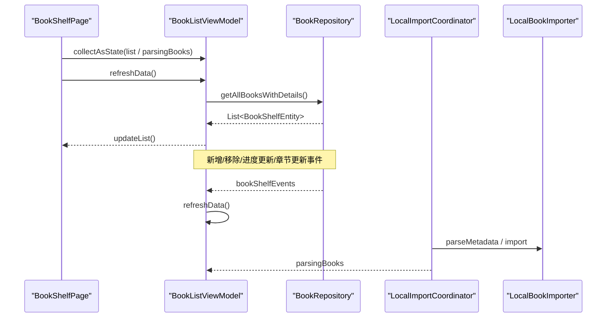

**图示来源**
- [BookShelfPage.kt:1-200](file://module_book/src/main/java/com/ebook/book/page/BookShelfPage.kt#L1-L200)
- [BookListViewModel.kt:19-68](file://module_book/src/main/java/com/ebook/book/mvvm/viewmodel/BookListViewModel.kt#L19-L68)
- [BookRepository.kt:1-200](file://lib_book_common/src/main/java/com/ebook/common/repository/BookRepository.kt#L1-L200)
- [LocalImportCoordinator.kt:1-200](file://lib_book_common/src/main/java/com/ebook/common/importer/LocalImportCoordinator.kt#L1-L200)
- [LocalBookImporter.kt:1-200](file://lib_book_common/src/main/java/com/ebook/common/importer/LocalBookImporter.kt#L1-L200)

## 详细组件分析

### BookListViewModel：书架列表管理器
- 构造依赖：
  - `BookRepository`：书架数据与事件。
  - `LocalImportCoordinator`：解析中导入的进程级状态。
- 关键属性与方法：
  - `parsingBooks`：导出解析中书籍列表，供 UI 渲染占位行。
  - `init` 块：启动协程收集 `bookShelfEvents`，对新增、移除、进度更新与章节更新执行刷新。
  - `refreshData()`：异步调用 `getAllBooksWithDetails()`，成功则更新列表，失败记录日志，最终一律停止刷新指示器。
- 设计要点：
  - 刷新幂等：手动刷新与事件刷新走同一路径，避免状态不一致。
  - 异常不中断 UI：捕获异常仅记录日志，确保下拉刷新指示器始终复位。
  - 与导入解耦：解析中状态由进程级协调器维护，不因页面销毁而丢失。

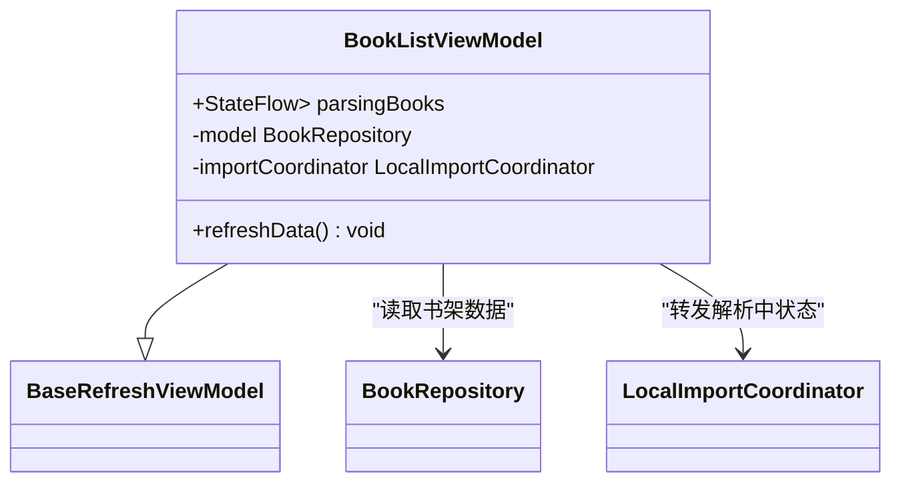

**图示来源**
- [BookListViewModel.kt:1-68](file://module_book/src/main/java/com/ebook/book/mvvm/viewmodel/BookListViewModel.kt#L1-L68)

**章节来源**
- [BookListViewModel.kt:1-68](file://module_book/src/main/java/com/ebook/book/mvvm/viewmodel/BookListViewModel.kt#L1-L68)

### BookRepository：数据获取、缓存与更新
- 书架查询：
  - `getAllBooks()`：返回无关联的基础书架列表。
  - `observeBookShelf()`：响应式 Flow，填充关联信息并过滤孤立条目。
  - `getAllBooksWithDetails()`：一次性加载完整书架条目，包含书籍信息与按序号排序的章节列表，并清理孤立记录。
- 阅读进度：
  - `saveProgress()`：钳制 `durChapter` 到有效范围，持久化后发布进度更新事件。
- 收藏与移除：
  - `addToShelf()`：在一个事务内写入书籍元数据、书架行、章节列表与评论键，成功后广播 `Added`。
  - `removeFromShelf()`：删除索引行、清理内容与缓存，广播 `Removed`。
- 多书源切换：
  - `switchSource()`：网络解析留在事务外，写库操作在一个事务内完成；失败窗口有清晰边界；旧源正文文件保留但目录行删除，以保证切回时正文命中盘上文件。
- 事件机制：
  - 使用 `SharedFlow` 广播书架事件，缓冲容量足够，避免高频场景丢消息。

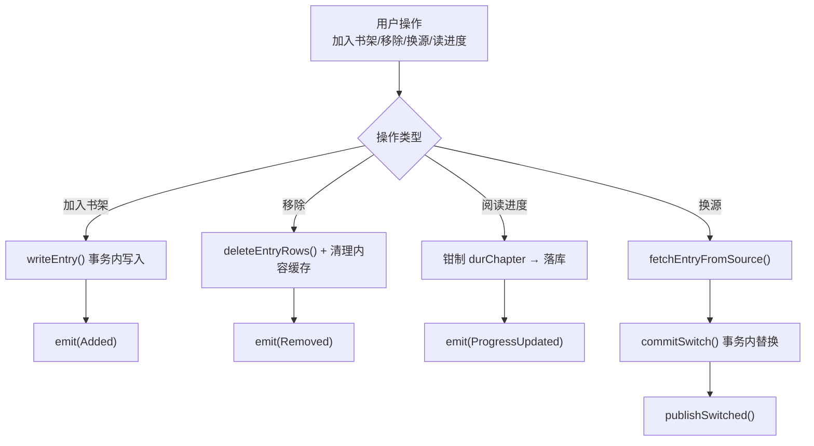

**图示来源**
- [BookRepository.kt:1-429](file://lib_book_common/src/main/java/com/ebook/common/repository/BookRepository.kt#L1-L429)

**章节来源**
- [BookRepository.kt:1-429](file://lib_book_common/src/main/java/com/ebook/common/repository/BookRepository.kt#L1-L429)

### 阅读进度跟踪与显示
- 跟踪点：
  - 阅读器在退出或暂停时调用 `saveProgress()`，把当前章节位置持久化到数据库。
  - 方法内部会校验章节行数是否为零，避免误伤搜索直接开读的空目录路径。
  - 成功后广播 `ProgressUpdated`，书架事件收集者触发刷新。
- 显示逻辑：
  - `BookShelfPage` 从 `BookShelfEntity.chapterList` 读取当前章节名，并渲染“读至”文案。
  - 若章节为空，则不显示“读至”，卡片退化为两行形态。

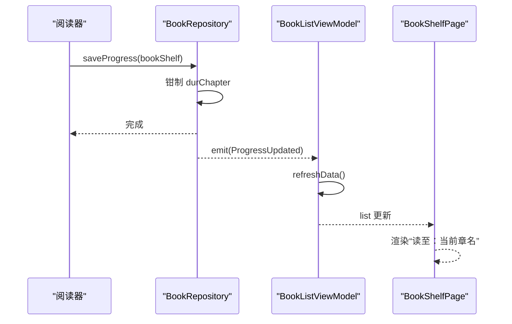

**图示来源**
- [BookRepository.kt:1-200](file://lib_book_common/src/main/java/com/ebook/common/repository/BookRepository.kt#L1-L200)
- [BookShelfPage.kt:200-571](file://module_book/src/main/java/com/ebook/book/page/BookShelfPage.kt#L200-L571)

**章节来源**
- [BookRepository.kt:1-200](file://lib_book_common/src/main/java/com/ebook/common/repository/BookRepository.kt#L1-L200)
- [BookShelfPage.kt:200-571](file://module_book/src/main/java/com/ebook/book/page/BookShelfPage.kt#L200-L571)

### 多书源切换策略
- 目标限制：
  - 本地书不可换源。
  - 不能切换到与当前条目相同的 URL。
  - 不能切换到书架已存在的其他条目 URL。
- 解析阶段：
  - 根据目标源的 tag 取得 parser，拉取书籍详情与目录。
  - 解析失败不会写库，保持原状态。
- 写库阶段：
  - 使用一个事务写入新条目的四张表，再发布切换事件。
  - 失败时整个事务回滚，保证原子性。
- 进度映射：
  - 章节序号取新旧目录长度的较小值，页级进度重置到起始页。
  - 最后阅读时间保留旧值，避免换源影响排序。
- 缓存取舍：
  - 旧源目录行删除，但正文文件保留，以便切回旧源时秒开已读章节。
  - 下次应用对账时回收无主目录，符合现有存储回收机制。

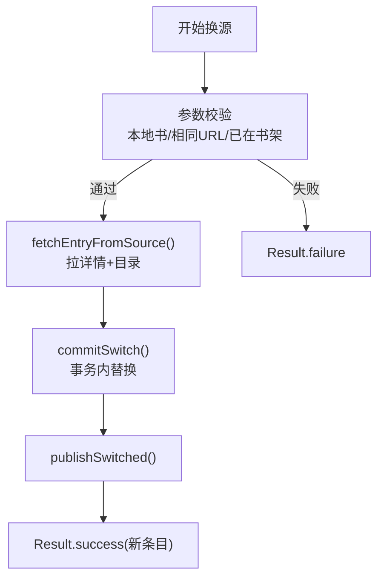

**图示来源**
- [BookRepository.kt:200-429](file://lib_book_common/src/main/java/com/ebook/common/repository/BookRepository.kt#L200-L429)

**章节来源**
- [BookRepository.kt:200-429](file://lib_book_common/src/main/java/com/ebook/common/repository/BookRepository.kt#L200-L429)

### 本地书籍导入与书架展示
- 扫描与选择：
  - `BookImportViewModel` 负责扫描本地文件，过滤 EPUB 与大于阈值大小的 TXT。
  - 扫描结果整体替换，避免重复堆叠。
- 批量导入：
  - `LocalImportCoordinator` 是进程级单例，持有独立作用域，不受页面生命周期影响。
  - 逐文件解析元数据、判重、等待用户处置（合并/覆盖/跳过/共存）。
  - 解析中时在书架渲染占位行，待落库后再替换为真实条目。
- 本地导入流水线：
  - `LocalBookImporter` 实现“拷贝即哈希”、后台切分章节、单事务批量写索引。
  - 导入完成后通过仓库发布新增事件，使书架自动刷新。

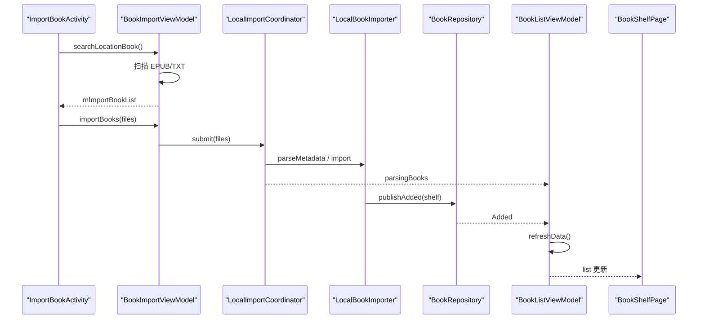

**图示来源**
- [ImportBookActivity.kt:1-200](file://module_book/src/main/java/com/ebook/book/ImportBookActivity.kt#L1-L200)
- [BookImportViewModel.kt:1-192](file://module_book/src/main/java/com/ebook/book/mvvm/viewmodel/BookImportViewModel.kt#L1-L192)
- [LocalImportCoordinator.kt:1-200](file://lib_book_common/src/main/java/com/ebook/common/importer/LocalImportCoordinator.kt#L1-L200)
- [LocalBookImporter.kt:1-200](file://lib_book_common/src/main/java/com/ebook/common/importer/LocalBookImporter.kt#L1-L200)
- [BookRepository.kt:1-200](file://lib_book_common/src/main/java/com/ebook/common/repository/BookRepository.kt#L1-L200)
- [BookListViewModel.kt:19-68](file://module_book/src/main/java/com/ebook/book/mvvm/viewmodel/BookListViewModel.kt#L19-L68)
- [BookShelfPage.kt:200-571](file://module_book/src/main/java/com/ebook/book/page/BookShelfPage.kt#L200-L571)

**章节来源**
- [BookImportViewModel.kt:1-192](file://module_book/src/main/java/com/ebook/book/mvvm/viewmodel/BookImportViewModel.kt#L1-L192)
- [LocalImportCoordinator.kt:1-200](file://lib_book_common/src/main/java/com/ebook/common/importer/LocalImportCoordinator.kt#L1-L200)
- [LocalBookImporter.kt:1-200](file://lib_book_common/src/main/java/com/ebook/common/importer/LocalBookImporter.kt#L1-L200)

### 收藏与移除的实现边界
- 收藏：
  - 搜索结果加书架的统一入口是 `BookShelfManager.addFromSearch()`，按搜索结果所属源解析详情与目录，再调用 `BookRepository.addToShelf()`。
  - 本地书不走此流程，而是由导入流水线直接入库。
- 移除：
  - `BookRepository.removeFromShelf()` 清理索引、内容与缓存，并发出 `Removed` 事件。
  - 书架 UI 通过事件刷新，不再需要页面自行维护集合。

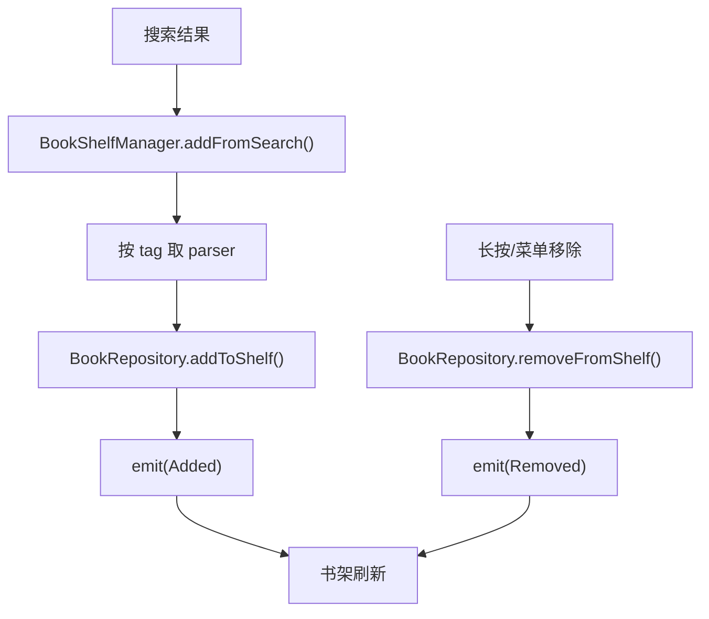

**图示来源**
- [BookShelfManager.kt:1-74](file://lib_book_common/src/main/java/com/ebook/common/manager/BookShelfManager.kt#L1-L74)
- [BookRepository.kt:1-200](file://lib_book_common/src/main/java/com/ebook/common/repository/BookRepository.kt#L1-L200)

**章节来源**
- [BookShelfManager.kt:1-74](file://lib_book_common/src/main/java/com/ebook/common/manager/BookShelfManager.kt#L1-L74)
- [BookRepository.kt:1-200](file://lib_book_common/src/main/java/com/ebook/common/repository/BookRepository.kt#L1-L200)

### StateFlow 状态管理与空态展示
- 列表状态：
  - `BookListViewModel.list`（继承自基础 ViewModel）被 `BookShelfPage` 用 `collectAsState()` 观察。
- 解析中状态：
  - `parsingBooks` 是进程级协调器的 `StateFlow`，在书架列表中排在书目之前。
- 空态逻辑：
  - 首帧不直接判定为空，需等待首次刷新完成后再展示空态，避免冷启动闪屏。
  - 只有当书目与解析中均为空时才显示空态，否则优先展示占位行。
- 下载角标：
  - 由 `DownloadManageViewModel.remainingCount` 驱动，未集成到 `BookListViewModel`，但与其并列消费。

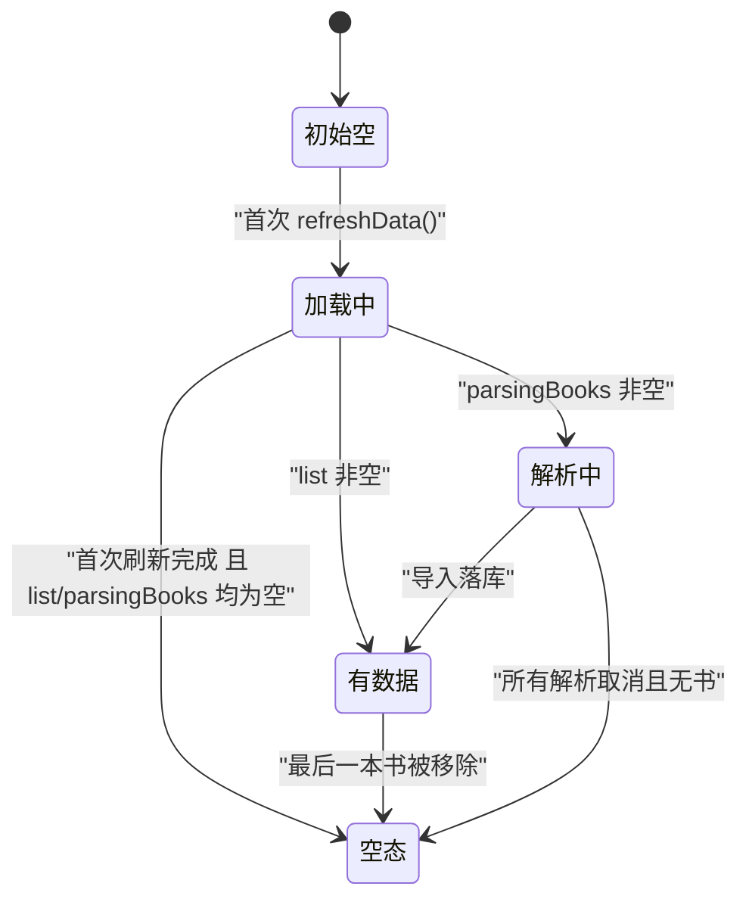

**图示来源**
- [BookShelfPage.kt:1-200](file://module_book/src/main/java/com/ebook/book/page/BookShelfPage.kt#L1-L200)
- [BookShelfPage.kt:200-571](file://module_book/src/main/java/com/ebook/book/page/BookShelfPage.kt#L200-L571)

**章节来源**
- [BookShelfPage.kt:1-200](file://module_book/src/main/java/com/ebook/book/page/BookShelfPage.kt#L1-L200)
- [BookShelfPage.kt:200-571](file://module_book/src/main/java/com/ebook/book/page/BookShelfPage.kt#L200-L571)

## 依赖关系分析
- `BookListViewModel` 只依赖 `BookRepository` 与 `LocalImportCoordinator`，职责清晰，不直接访问 DAO。
- `BookRepository` 是数据层唯一入口，封装 Room DAO、内容存储、缓存与事件广播。
- `BookShelfManager` 封装搜索结果加书架的共享逻辑，避免 ViewModel 与页面重复实现。
- `LocalImportCoordinator` 作为进程级单例，解耦导入生命周期与页面生命周期。
- `LocalBookImporter` 负责本地文件的解析、切章与落库，与仓库事件联动。

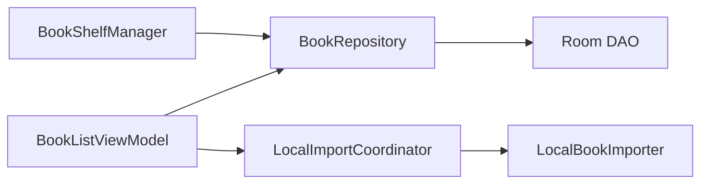

**图示来源**
- [BookListViewModel.kt:1-68](file://module_book/src/main/java/com/ebook/book/mvvm/viewmodel/BookListViewModel.kt#L1-L68)
- [BookRepository.kt:1-200](file://lib_book_common/src/main/java/com/ebook/common/repository/BookRepository.kt#L1-L200)
- [BookShelfManager.kt:1-74](file://lib_book_common/src/main/java/com/ebook/common/manager/BookShelfManager.kt#L1-L74)
- [LocalImportCoordinator.kt:1-200](file://lib_book_common/src/main/java/com/ebook/common/importer/LocalImportCoordinator.kt#L1-L200)
- [LocalBookImporter.kt:1-200](file://lib_book_common/src/main/java/com/ebook/common/importer/LocalBookImporter.kt#L1-L200)

**章节来源**
- [BookListViewModel.kt:1-68](file://module_book/src/main/java/com/ebook/book/mvvm/viewmodel/BookListViewModel.kt#L1-L68)
- [BookRepository.kt:1-200](file://lib_book_common/src/main/java/com/ebook/common/repository/BookRepository.kt#L1-L200)
- [BookShelfManager.kt:1-74](file://lib_book_common/src/main/java/com/ebook/common/manager/BookShelfManager.kt#L1-L74)
- [LocalImportCoordinator.kt:1-200](file://lib_book_common/src/main/java/com/ebook/common/importer/LocalImportCoordinator.kt#L1-L200)
- [LocalBookImporter.kt:1-200](file://lib_book_common/src/main/java/com/ebook/common/importer/LocalBookImporter.kt#L1-L200)

## 性能与优化建议
- 列表刷新：
  - 尽量复用 `refreshData()`，避免 UI 层各自实现去重与加载状态。
  - 事件驱动刷新与手动刷新共用实现，减少分支复杂度。
- 数据加载：
  - 使用 `getAllBooksWithDetails()` 一次性获取完整条目，避免 UI 层多次关联查询。
  - 关注 `chapterList` 显式排序，防止因 rowid 变化导致章节错序。
- 进度保存：
  - 仅在必要时调用 `saveProgress()`，避免频繁写库。
  - 注意章节数为零时的边界情况，不要误钳进度。
- 导入性能：
  - 利用 `LocalBookImporter` 的单遍拷贝与单事务写索引，避免重复 IO 与大量提交。
  - 大文件 TXT 需满足大小阈值，减少无效扫描。
- UI 重组：
  - 使用 `collectAsState()` 与稳定的 key（如 `noteUrl`、`parsing.id`）降低重组开销。
  - 空态只在首次刷新完成后渲染，避免首帧闪烁。

[本节为通用性能建议，不直接分析具体代码片段]

## 故障排查指南
- 书架刷新后仍为空：
  - 检查 `refreshData()` 是否抛出异常并被捕获；确认 `updateStopRefresh()` 是否执行。
  - 查看仓库日志是否报告进度越界或孤立记录清理。
- “读至”显示空白：
  - 确认 `chapterList` 非空且 `durChapter` 有效。
  - 检查是否在详情页搜索入口直接开读而未写 `chapter_list`，导致内存目录与库目录不一致。
- 本地导入后书架未刷新：
  - 确认 `LocalImportCoordinator.submit()` 未被忽略（已有批次运行时会拒绝新批次）。
  - 检查解析中占位是否出现；若出现但未变真实条目，查看导入是否成功落库。
- 多书源切换失败：
  - 检查是否尝试切换本地书、相同 URL 或已在书架的其他条目。
  - 查看事务提交前后日志，确认是解析失败还是写库失败。
- 空态闪烁：
  - 确认 `initialLoadDone` 在刷新完成后再置为 true。
  - 避免在首次拉取前就判断“空书架”。

**章节来源**
- [BookListViewModel.kt:45-68](file://module_book/src/main/java/com/ebook/book/mvvm/viewmodel/BookListViewModel.kt#L45-L68)
- [BookRepository.kt:1-200](file://lib_book_common/src/main/java/com/ebook/common/repository/BookRepository.kt#L1-L200)
- [LocalImportCoordinator.kt:1-200](file://lib_book_common/src/main/java/com/ebook/common/importer/LocalImportCoordinator.kt#L1-L200)
- [BookShelfPage.kt:1-200](file://module_book/src/main/java/com/ebook/book/page/BookShelfPage.kt#L1-L200)

## 结论
`BookListViewModel` 在书架界面中扮演轻量但关键的协调角色：它不直接处理复杂业务，而是通过 `BookRepository` 统一获取数据、接收事件、触发刷新，并通过 `LocalImportCoordinator` 展示导入进度。该设计降低了 UI 层的复杂度，提升了事件驱动的响应性与一致性。配合 Compose 的状态观察与空态策略，书架页面能够在加载、解析、空态与数据之间平滑过渡。对于扩展功能（如排序、搜索），建议在 ViewModel 层增加输入状态与过滤逻辑，但仍保持对 `BookRepository` 的单一数据依赖，以维持架构清晰度与可测试性。