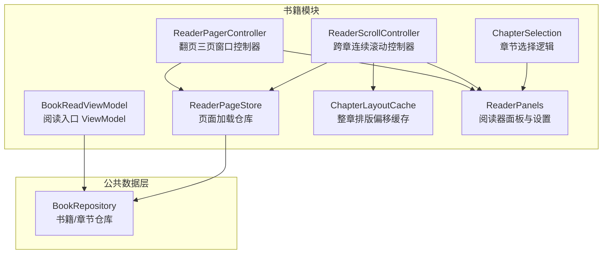
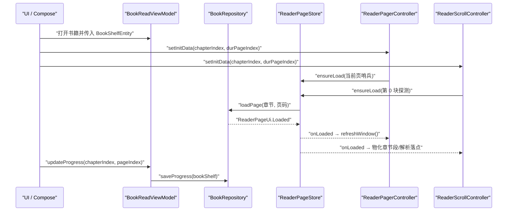
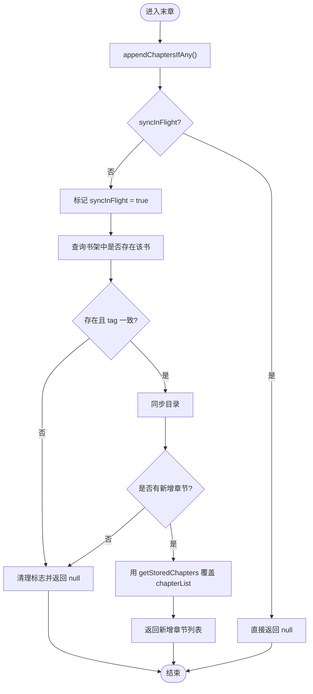
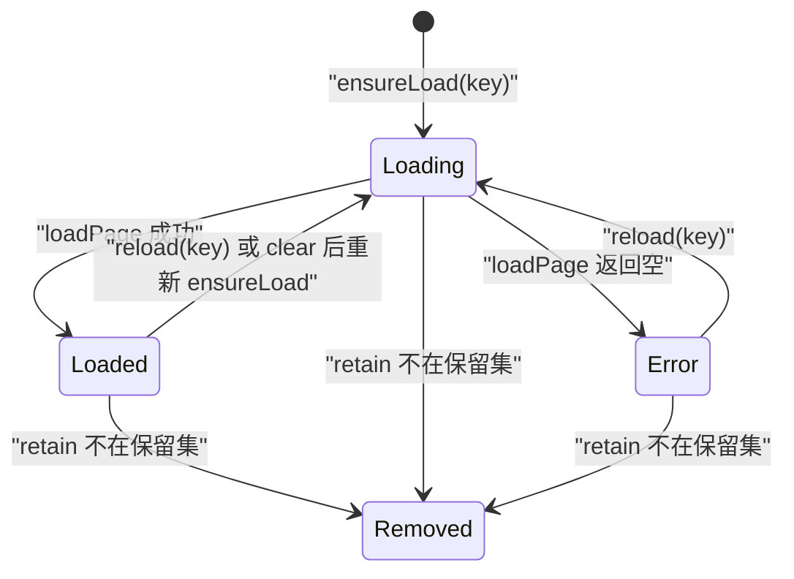
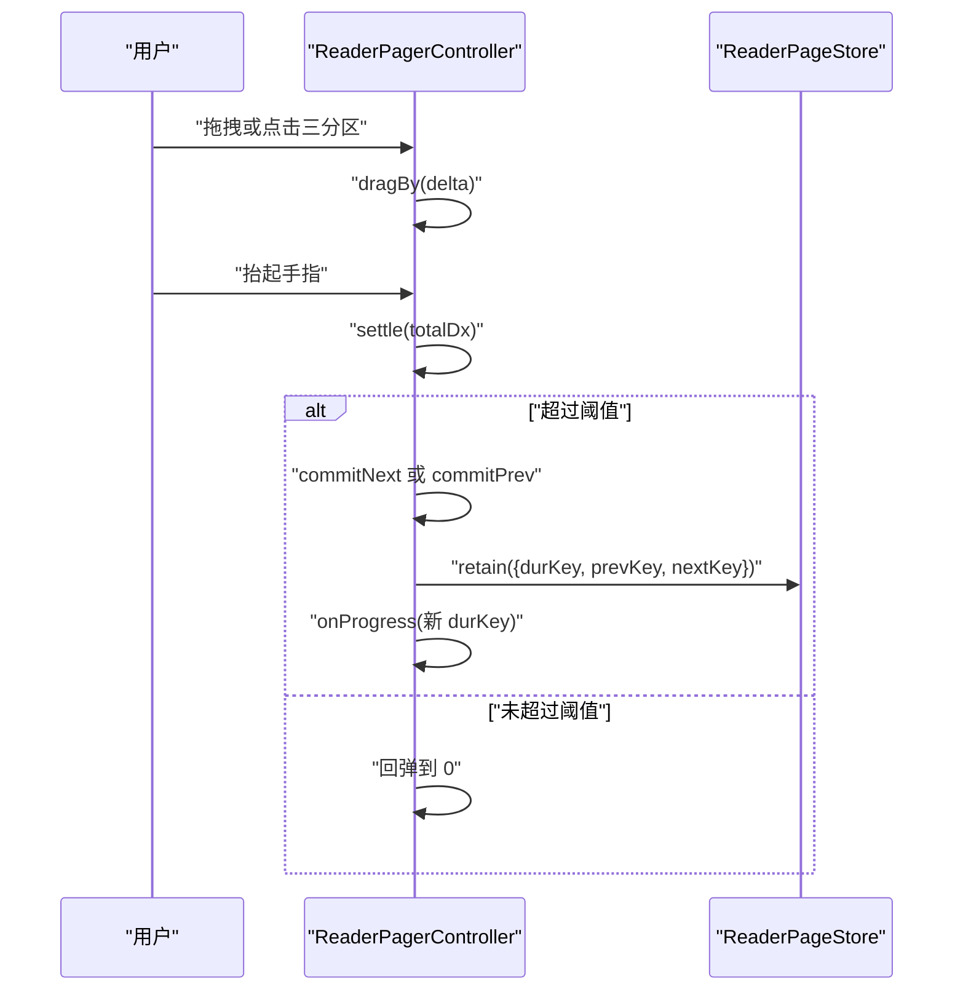
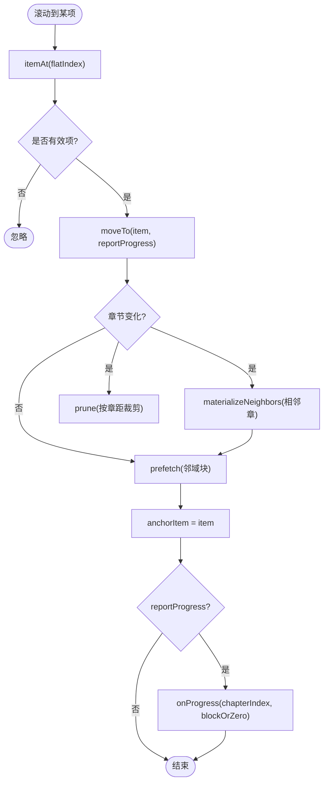
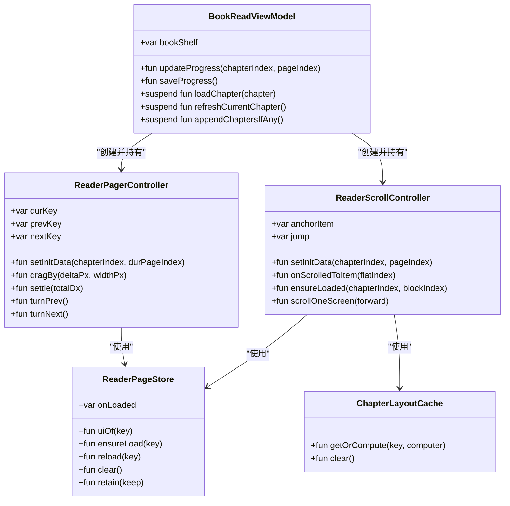

# BookReadViewModel - 阅读器核心逻辑

<cite>
**本文引用的文件**   
- [BookReadViewModel.kt](file://module_book/src/main/java/com/ebook/book/mvvm/viewmodel/BookReadViewModel.kt)
- [ReaderPageStore.kt](file://module_book/src/main/java/com/ebook/book/reader/ReaderPageStore.kt)
- [ReaderPager.kt](file://module_book/src/main/java/com/ebook/book/reader/ReaderPager.kt)
- [ReaderScrollController.kt](file://module_book/src/main/java/com/ebook/book/reader/ReaderScrollController.kt)
- [ChapterLayoutCache.kt](file://module_book/src/main/java/com/ebook/book/reader/ChapterLayoutCache.kt)
- [ChapterSelection.kt](file://module_book/src/main/java/com/ebook/book/reader/ChapterSelection.kt)
- [ReaderPanels.kt](file://module_book/src/main/java/com/ebook/book/reader/ReaderPanels.kt)
- [0040-reader-resume-after-abnormal-exit.md](file://docs/adr/0040-reader-resume-after-abnormal-exit.md)
</cite>

## 目录
1. [引言](#引言)
2. [项目结构与定位](#项目结构与定位)
3. [核心组件总览](#核心组件总览)
4. [架构概览](#架构概览)
5. [详细组件分析](#详细组件分析)
6. [依赖关系分析](#依赖关系分析)
7. [阅读恢复与进度持久化](#阅读恢复与进度持久化)
8. [性能与内存优化](#性能与内存优化)
9. [常见问题排查](#常见问题排查)
10. [结论](#结论)

## 引言
本文围绕 `BookReadViewModel` 及其深度协作的阅读器组件，系统性梳理阅读器的核心设计：阅读进度管理、章节导航、页面状态控制、翻页与滚屏双模式、内容异步加载与缓存、异常退出后的阅读恢复，以及阅读设置面板的管理方式。文档面向希望理解“从 ViewModel 到渲染”的全链路读者，既提供高层架构图，也给出代码级流程图和关键实现约束。

## 项目结构与定位
`BookReadViewModel` 位于书籍模块的 MVVM 视图模型层，负责把书架实体、章节列表、网络/本地章节加载能力统一暴露给 UI；真正的前端翻页与滚动逻辑由 `ReaderPagerController`（翻页）和 `ReaderScrollController`（滚屏）承担，二者共享 `ReaderPageStore` 作为页面加载仓库，并通过 `ChapterLayoutCache` 做整章排版偏移缓存。

图表来源
- [BookReadViewModel.kt:1-151](file://module_book/src/main/java/com/ebook/book/mvvm/viewmodel/BookReadViewModel.kt#L1-L151)
- [ReaderPageStore.kt:1-98](file://module_book/src/main/java/com/ebook/book/reader/ReaderPageStore.kt#L1-L98)
- [ReaderPager.kt:1-200](file://module_book/src/main/java/com/ebook/book/reader/ReaderPager.kt#L1-L200)
- [ReaderScrollController.kt:1-200](file://module_book/src/main/java/com/ebook/book/reader/ReaderScrollController.kt#L1-L200)
- [ChapterLayoutCache.kt:1-61](file://module_book/src/main/java/com/ebook/book/reader/ChapterLayoutCache.kt#L1-L61)
- [ChapterSelection.kt:1-117](file://module_book/src/main/java/com/ebook/book/reader/ChapterSelection.kt#L1-L117)
- [ReaderPanels.kt:1-200](file://module_book/src/main/java/com/ebook/book/reader/ReaderPanels.kt#L1-L200)

章节来源
- [BookReadViewModel.kt:1-151](file://module_book/src/main/java/com/ebook/book/mvvm/viewmodel/BookReadViewModel.kt#L1-L151)

## 核心组件总览
- `BookReadViewModel`：阅读会话入口，封装书架信息、进度写入、章节加载、目录追更、添加书架等通用业务。
- `ReaderPageStore`：以 `(章节索引, 页码)` 为键的页面加载仓库，提供加载中、错误、已加载三态，并处理在途任务去重、失败重试、跳转清理与保留集裁剪。
- `ReaderPagerController`：移植自原 View 体系的三页窗口翻页控制器，维护当前页、上一页、下一页三个键，并驱动手势拖拽、阈值判定与窗口收敛。
- `ReaderScrollController`：跨章连续滚动控制器，维护“标题项 + 正文块”的扁平列表、锚点项、预取与按章距裁剪。
- `ChapterLayoutCache`：按 `(内容引用、内容长度、字号、宽度像素)` 缓存整章排版偏移，避免同章多页重复 O(章长) 计算。
- `ChapterSelection`：纯逻辑的章节范围解析、下载选择容量、默认区间与主操作三态判定。
- `ReaderPanels`：阅读器顶栏、底部栏、章节、字体、亮度、设置、换源等面板的统一枚举与 UI 常量。

章节来源
- [ReaderPageStore.kt:1-98](file://module_book/src/main/java/com/ebook/book/reader/ReaderPageStore.kt#L1-L98)
- [ReaderPager.kt:1-200](file://module_book/src/main/java/com/ebook/book/reader/ReaderPager.kt#L1-L200)
- [ReaderScrollController.kt:1-200](file://module_book/src/main/java/com/ebook/book/reader/ReaderScrollController.kt#L1-L200)
- [ChapterLayoutCache.kt:1-61](file://module_book/src/main/java/com/ebook/book/reader/ChapterLayoutCache.kt#L1-L61)
- [ChapterSelection.kt:1-117](file://module_book/src/main/java/com/ebook/book/reader/ChapterSelection.kt#L1-L117)
- [ReaderPanels.kt:1-200](file://module_book/src/main/java/com/ebook/book/reader/ReaderPanels.kt#L1-L200)

## 架构概览
阅读器采用“ViewModel 负责会话与数据边界，前端控制器负责几何与交互，仓库负责加载竞态”的分层：

图表来源
- [BookReadViewModel.kt:24-63](file://module_book/src/main/java/com/ebook/book/mvvm/viewmodel/BookReadViewModel.kt#L24-L63)
- [ReaderPageStore.kt:25-98](file://module_book/src/main/java/com/ebook/book/reader/ReaderPageStore.kt#L25-L98)
- [ReaderPager.kt:120-199](file://module_book/src/main/java/com/ebook/book/reader/ReaderPager.kt#L120-L199)
- [ReaderScrollController.kt:224-286](file://module_book/src/main/java/com/ebook/book/reader/ReaderScrollController.kt#L224-L286)

## 详细组件分析

### BookReadViewModel：阅读会话与进度中枢
`BookReadViewModel` 是阅读界面的业务入口，主要职责包括：
- 持有当前书 `bookShelf`，记录是否通过外部导入打开。
- 更新并保存阅读进度：`durChapter`、`durChapterPage`。
- 提供章节标题查询、章节列表大小与指定章节访问。
- 提供统一章节正文读取路径，屏蔽本地书与网络书差异。
- 支持网络书刷新当前章节缓存。
- 末章静默检查目录追加，就地替换 `chapterList` 并返回新增章节。
- 支持添加到书架与添加结果事件通知。

关键设计要点：
- 进度更新只修改内存中的 `BookShelfEntity`，显式调用 `saveProgress` 才落库，避免频繁 IO。
- `appendChaptersIfAny` 使用 `syncInFlight` 单飞标志，防止快速翻页触发并发目录检查。
- 追更前校验书架行存在且 `tag` 一致，避免跨源浏览时误判分叉。
- 目录追加成功后用 `getStoredChapters` 回读完整目录，而不是拼接远端目录，避免重复章节。

图表来源
- [BookReadViewModel.kt:64-118](file://module_book/src/main/java/com/ebook/book/mvvm/viewmodel/BookReadViewModel.kt#L64-L118)

章节来源
- [BookReadViewModel.kt:1-151](file://module_book/src/main/java/com/ebook/book/mvvm/viewmodel/BookReadViewModel.kt#L1-L151)

### ReaderPageStore：页面加载仓库与状态机
`ReaderPageStore` 是所有页面加载请求的唯一出口，核心语义如下：
- 键：`ReaderPageKey(chapterIndex, pageIndex)`，其中页码包含哨兵值，表示章节首页或末页。
- 三态：`Loading`、`Error`、`Loaded(title, chapterIndex, durPageIndex, pageAll, text)`。
- 去重：同一键同时只有一个在途协程；已 `Loaded` 的页不会重复抓取。
- 回调：`onLoaded` 由前端判断是否与当前窗口相关，无关则自动归属新窗口。
- 清理：跳转或换点时调用 `clear` 取消全部在途任务并清空状态。
- 保留集：`retain` 仅保留前端提供的键集合，其余移除并取消对应任务，防止内存累积。

复杂度与行为说明：
- `ensureLoad` 的时间复杂度接近 O(1)，因为基于 Map 去重。
- `uiOf` 在未登记时返回 `Loading`，保证 UI 始终有兜底态。
- `retain` 会遍历所有键并按差集移除，适合低频调用（跳转、换点、换模式）。

图表来源
- [ReaderPageStore.kt:1-98](file://module_book/src/main/java/com/ebook/book/reader/ReaderPageStore.kt#L1-L98)

章节来源
- [ReaderPageStore.kt:1-98](file://module_book/src/main/java/com/ebook/book/reader/ReaderPageStore.kt#L1-L98)

### ReaderPagerController：翻页三页窗口状态机
翻页模式维护三个键：
- `durKey`：当前页。
- `prevKey`：上一页，可能为 `null`。
- `nextKey`：下一页，可能为 `null`。

核心流程：
- `setInitData`：清空仓库、重置窗口、初始化当前页哨兵，并立即上报进度。
- `refreshWindow`：根据当前页、总页数、每章总页数计算前后页键，并触发预加载。
- `dragBy`、`settle`：处理手势拖拽与 30dp 阈值判定，动画期间锁定手势。
- `commitNext`、`commitPrev`：提交翻页，非 `Loaded` 时按收敛规则保留来路方向，避免死页。
- `prune`：只保留窗口内三个键，防止连续阅读跨章累积。

图表来源
- [ReaderPager.kt:201-560](file://module_book/src/main/java/com/ebook/book/reader/ReaderPager.kt#L201-L560)
- [ReaderPageStore.kt:60-98](file://module_book/src/main/java/com/ebook/book/reader/ReaderPageStore.kt#L60-L98)

章节来源
- [ReaderPager.kt:1-584](file://module_book/src/main/java/com/ebook/book/reader/ReaderPager.kt#L1-L584)

### ReaderScrollController：跨章连续滚动控制器
滚屏模式把全书视为一条连续列表，每项是：
- `Title(chapterIndex)`：章标题项。
- `Block(chapterIndex, blockIndex)`：正文块项。

核心机制：
- 列表惰性物化：进入某章即物化相邻两章，避免跨章时等待排版。
- 锚点存语义值 `(chapterIndex, blockIndex)`，而非扁平序号，避免上方插入导致进度漂移。
- 哨兵页码解析：`BEGIN`→首块，`END`→末块；块数未知时先落第 0 块，再补发目标块加载。
- 预取邻域：锚点前后若干块提前加载，提升滑屏顺滑度。
- 按章距裁剪：保留锚点章 ±2 章的全部块，避免回滚闪转圈。
- 兜底加载：LazyColumn 组合上屏的块自行请求加载，防止 fling 跳过中间块号。

图表来源
- [ReaderScrollController.kt:201-399](file://module_book/src/main/java/com/ebook/book/reader/ReaderScrollController.kt#L201-L399)

章节来源
- [ReaderScrollController.kt:1-399](file://module_book/src/main/java/com/ebook/book/reader/ReaderScrollController.kt#L1-L399)

### ChapterLayoutCache：整章排版偏移缓存
该缓存解决的关键问题是：`ReaderTypesetter.lineStartOffsets` 对整章计算一次开销很大，而翻页时每页都可能调用，形成 O(章长 × 页数) 的重复计算。

缓存键构成：
- `contentRef`：章节内容引用。
- `contentLength`：内容长度，用于区分“强刷后 URL 不变但正文已变”的情况。
- `fontSizeSp`：字号。
- `widthPx`：正文宽度像素。

线程安全与容量：
- 使用 `Collections.synchronizedMap` 包装 `LinkedHashMap`，并在锁内执行 check-then-act，避免并发预加载破坏结构。
- 默认容量 5，近似覆盖“当前章 + 前后各两章”，配合 LRU 淘汰最旧条目。

章节来源
- [ChapterLayoutCache.kt:1-61](file://module_book/src/main/java/com/ebook/book/reader/ChapterLayoutCache.kt#L1-L61)

### ChapterSelection：章节选择与下载策略
该模块不含 UI，专注于章节选择语义：
- 单次下载软上限 500 章。
- 解析用户输入的起止章号，非法输入返回 `null`。
- 默认窗口：从焦点章起 50 章，封顶到最后一章。
- 默认范围选择：优先取已勾选边界，其次退化为默认窗口，最后退化为前 50 章。
- 主操作三态：正在下载显示暂停；已暂停且无可下发勾选显示继续；其余显示下载。
- 正倒序索引换算函数，避免展示位置与原始索引混淆。

章节来源
- [ChapterSelection.kt:1-117](file://module_book/src/main/java/com/ebook/book/reader/ChapterSelection.kt#L1-L117)

### ReaderPanels：阅读器面板与设置管理
`ReaderPanels` 统一管理阅读器 chrome 层的面板枚举与视觉常量，包括：
- 面板类型：章节、亮度、字体、设置、换源等。
- 顶栏：返回、章节标题、副标题书名、“更多”菜单。
- 面板开关行样式、圆角、间距、滑块尺寸等视觉规范。
- 与 UI 层的解耦：面板枚举放在 reader 包供 chrome 层共用，避免反向依赖 Activity。

章节来源
- [ReaderPanels.kt:1-200](file://module_book/src/main/java/com/ebook/book/reader/ReaderPanels.kt#L1-L200)

## 依赖关系分析

图表来源
- [BookReadViewModel.kt:1-151](file://module_book/src/main/java/com/ebook/book/mvvm/viewmodel/BookReadViewModel.kt#L1-L151)
- [ReaderPageStore.kt:1-98](file://module_book/src/main/java/com/ebook/book/reader/ReaderPageStore.kt#L1-L98)
- [ReaderPager.kt:1-200](file://module_book/src/main/java/com/ebook/book/reader/ReaderPager.kt#L1-L200)
- [ReaderScrollController.kt:1-200](file://module_book/src/main/java/com/ebook/book/reader/ReaderScrollController.kt#L1-L200)
- [ChapterLayoutCache.kt:1-61](file://module_book/src/main/java/com/ebook/book/reader/ChapterLayoutCache.kt#L1-L61)

章节来源
- [BookReadViewModel.kt:1-151](file://module_book/src/main/java/com/ebook/book/mvvm/viewmodel/BookReadViewModel.kt#L1-L151)
- [ReaderPageStore.kt:1-98](file://module_book/src/main/java/com/ebook/book/reader/ReaderPageStore.kt#L1-L98)
- [ReaderPager.kt:1-200](file://module_book/src/main/java/com/ebook/book/reader/ReaderPager.kt#L1-L200)
- [ReaderScrollController.kt:1-200](file://module_book/src/main/java/com/ebook/book/reader/ReaderScrollController.kt#L1-L200)
- [ChapterLayoutCache.kt:1-61](file://module_book/src/main/java/com/ebook/book/reader/ChapterLayoutCache.kt#L1-L61)

## 阅读恢复与进度持久化
阅读恢复分为两个层面：
1. **界面恢复**：异常退出后下次启动直接进入阅读界面，恢复精度为章级。
2. **进度持久化**：阅读过程中保存 `durChapter`、`durChapterPage`，正常退出时清除会话标记。

异常退出恢复决策要点：
- 会话标记由阅读器写入和清除，写点是“成功打开某本书”，清除点是“正常销毁且 `isFinishing`”。
- 恢复前必须回库复核：书架行、书籍元数据、章节列表必须完整，否则静默走主页。
- 不新增“翻章即落库”，以避免高频写库换取有限精度。
- 恢复时通过路由构建 Intent 并自己启动，不依赖异步路由表探测。

进度持久化接口：
- `updateProgress`：更新内存中的书架实体。
- `saveProgress`：异步调用仓库保存进度。

章节来源
- [BookReadViewModel.kt:24-63](file://module_book/src/main/java/com/ebook/book/mvvm/viewmodel/BookReadViewModel.kt#L24-L63)
- [0040-reader-resume-after-abnormal-exit.md:1-76](file://docs/adr/0040-reader-resume-after-abnormal-exit.md#L1-L76)

## 性能与内存优化
- **页面加载去重**：`ReaderPageStore.ensureLoad` 在同一 key 下只允许一个在途任务，避免重复 DB/网络请求。
- **已加载短路**：已 `Loaded` 的页不会被重复抓取，快速回翻不会闪加载态。
- **窗口裁剪**：翻页模式保留三页窗口键；滚屏模式按章距保留锚点章 ±2 章。
- **整章排版缓存**：`ChapterLayoutCache` 缓存整章偏移，同章翻页只计算一次。
- **懒物化与增量插入**：滚屏模式惰性物化章节段，避免一次性展开整书。
- **布局期位移**：翻页动画期间通过布局期 `offset` 驱动，减少重组频率。
- **正文样式一致性**：分页测量与绘制使用同一文本样式，避免切行与画行不一致导致溢出被裁。
- **并发安全**：排版缓存使用同步 map 保护，防止并发预加载破坏结构。
- **内存泄漏防护建议**：
  - 确保 `ReaderPageStore.clear` 在跳转、换翻页模式、Activity 销毁前调用。
  - 避免在 ViewModel 或 Controller 中持有 Activity/Context 的强引用。
  - 避免将大型 `BookShelfEntity.chapterList` 放入短生命周期 Bundle。
  - 使用 `viewModelScope` 管理协程，避免手动持有 `CoroutineScope` 导致泄漏。
  - 谨慎使用全局单例缓存，必要时提供明确清理入口。

章节来源
- [ReaderPageStore.kt:25-98](file://module_book/src/main/java/com/ebook/book/reader/ReaderPageStore.kt#L25-L98)
- [ReaderPager.kt:201-560](file://module_book/src/main/java/com/ebook/book/reader/ReaderPager.kt#L201-L560)
- [ReaderScrollController.kt:201-399](file://module_book/src/main/java/com/ebook/book/reader/ReaderScrollController.kt#L201-L399)
- [ChapterLayoutCache.kt:1-61](file://module_book/src/main/java/com/ebook/book/reader/ChapterLayoutCache.kt#L1-L61)

## 常见问题排查
- **翻页后卡在失败页**：可能是窗口收敛规则未正确保留来路方向；检查 `commitNext`/`commitPrev` 是否对非 `Loaded` 目标设置了正确的 `prevKey`/`nextKey`。
- **滚屏回滚闪加载**：可能是保留集半径过小；确认 `RETAIN_CHAPTERS` 按章而不是按块裁剪。
- **强刷后内容错位**：检查 `ChapterLayoutKey` 是否包含 `contentLength`，否则旧行偏移可能匹配到新正文。
- **跳转后进度偏移**：滚屏模式下锚点应存 `(chapterIndex, blockIndex)`，不能存扁平序号。
- **异常退出没恢复**：检查会话标记是否在成功打开阅读界面时写入，并在正常销毁时清除。
- **目录追更无效**：检查书架行是否存在、`tag` 是否一致，以及 `syncInFlight` 是否被其他路径意外置位。

章节来源
- [ReaderPager.kt:201-560](file://module_book/src/main/java/com/ebook/book/reader/ReaderPager.kt#L201-L560)
- [ReaderScrollController.kt:201-399](file://module_book/src/main/java/com/ebook/book/reader/ReaderScrollController.kt#L201-L399)
- [ChapterLayoutCache.kt:1-61](file://module_book/src/main/java/com/ebook/book/reader/ChapterLayoutCache.kt#L1-L61)
- [BookReadViewModel.kt:64-118](file://module_book/src/main/java/com/ebook/book/mvvm/viewmodel/BookReadViewModel.kt#L64-L118)
- [0040-reader-resume-after-abnormal-exit.md:1-76](file://docs/adr/0040-reader-resume-after-abnormal-exit.md#L1-L76)

## 结论
`BookReadViewModel` 作为阅读会话的业务中枢，把书架、进度、章节加载与目录追更整合成稳定接口；真正的阅读体验由 `ReaderPagerController` 与 `ReaderScrollController` 分别承担翻页与滚屏几何，二者共享 `ReaderPageStore` 保证加载竞态一致，并通过 `ChapterLayoutCache` 降低排版成本。阅读恢复以会话标记为主、回库复核为辅，在不引入高频写库的前提下提供可靠的章级恢复。整体架构清晰、职责分离，适合在后续扩展中继续强化性能与可测试性。