# DownloadManageViewModel - 下载任务管理

<cite>
**本文引用的文件**   
- [DownloadManageViewModel.kt](file://module_book/src/main/java/com/ebook/book/mvvm/viewmodel/DownloadManageViewModel.kt)
- [DownloadService.kt](file://module_book/src/main/java/com/ebook/book/service/DownloadService.kt)
- [DownloadRepository.kt](file://module_book/src/main/java/com/ebook/book/repository/DownloadRepository.kt)
- [DownloadManageActivity.kt](file://module_book/src/main/java/com/ebook/book/DownloadManageActivity.kt)
- [DownloadChapterEntity.kt](file://lib_ebook_db/src/main/java/com/ebook/db/entity/DownloadChapterEntity.kt)
- [BookShelfEntity.kt](file://lib_ebook_db/src/main/java/com/ebook/db/entity/BookShelfEntity.kt)
- [0035-download-center.md](file://docs/adr/0035-download-center.md)
- [0036-download-pause-per-book.md](file://docs/adr/0036-download-pause-per-book.md)
- [0018-download-foreground-service-data-sync-quota.md](file://docs/adr/0018-download-foreground-service-data-sync-quota.md)
</cite>

## 目录
1. [简介](#简介)
2. [项目结构定位](#项目结构定位)
3. [核心组件与职责边界](#核心组件与职责边界)
4. [架构总览](#架构总览)
5. [详细组件分析](#详细组件分析)
6. [下载队列调度算法](#下载队列调度算法)
7. [断点续传与中断恢复](#断点续传与中断恢复)
8. [分组管理与统计口径](#分组管理与统计口径)
9. [与前台服务通信协议](#与前台服务通信协议)
10. [错误处理、重试与资源限制](#错误处理重试与资源限制)
11. [性能与内存特性](#性能与内存特性)
12. [常见问题排查](#常见问题排查)
13. [最佳实践与扩展建议](#最佳实践与扩展建议)
14. [结论](#结论)

## 简介
本文件围绕 `DownloadManageViewModel`，系统梳理下载任务管理的业务逻辑与代码实现。它不是单纯的状态持有者，而是“下载中心”这一功能域的主协调器：把按书分组的任务列表、二级选章页、暂停/继续控制、批量下载确认、以及与服务端 `DownloadService` 的通信都纳入统一模型。

从设计文档看，该功能承接了“下载中心重设计”“每书可暂停”“数据同步配额限制”等关键决策；因此阅读时不仅要关注 ViewModel 本身，还要理解它与仓库、前台服务和数据库之间的契约。

**章节来源**
- [0035-download-center.md](file://docs/adr/0035-download-center.md)
- [0036-download-pause-per-book.md](file://docs/adr/0036-download-pause-per-book.md)
- [0018-download-foreground-service-data-sync-quota.md](file://docs/adr/0018-download-foreground-service-data-sync-quota.md)

## 项目结构定位
`DownloadManageViewModel` 位于书籍模块的 MVVM 视图模型层，依赖 `DownloadRepository` 作为 Model；页面由 `DownloadManageActivity` 承载，实际下载工作由 `DownloadService` 在前台执行。

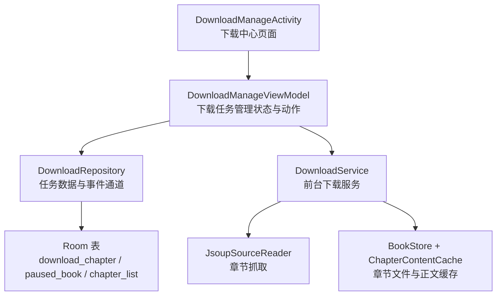

**图表来源**
- [DownloadManageActivity.kt:1-120](file://module_book/src/main/java/com/ebook/book/DownloadManageActivity.kt#L1-L120)
- [DownloadManageViewModel.kt:1-120](file://module_book/src/main/java/com/ebook/book/mvvm/viewmodel/DownloadManageViewModel.kt#L1-L120)
- [DownloadRepository.kt:1-120](file://module_book/src/main/java/com/ebook/book/repository/DownloadRepository.kt#L1-L120)
- [DownloadService.kt:1-120](file://module_book/src/main/java/com/ebook/book/service/DownloadService.kt#L1-L120)

**章节来源**
- [DownloadManageActivity.kt:1-120](file://module_book/src/main/java/com/ebook/book/DownloadManageActivity.kt#L1-L120)
- [DownloadManageViewModel.kt:1-120](file://module_book/src/main/java/com/ebook/book/mvvm/viewmodel/DownloadManageViewModel.kt#L1-L120)
- [DownloadRepository.kt:1-120](file://module_book/src/main/java/com/ebook/book/repository/DownloadRepository.kt#L1-L120)
- [DownloadService.kt:1-120](file://module_book/src/main/java/com/ebook/book/service/DownloadService.kt#L1-L120)

## 核心组件与职责边界

| 组件 | 主要职责 | 对外暴露的关键能力 |
|---|---|---|
| `DownloadManageViewModel` | 下载中心页面状态、按书分组、二级选章装载、暂停/继续、批量下载确认、进度高亮 | `groups`、`step`、`bookSheet`、`remainingCount`、`onDownloadState`、`confirmDownload`、`pauseBook`、`resumeBook`、`cancelBook` |
| `DownloadRepository` | 下载任务持久化、暂停书标记、覆盖率计算、下载状态事件通道、批量下发 | `addTasks`、`startDownload`、`getPausedBooks`、`getCacheCoverage`、`emitState`、`tryEmitState`、`observeRemainingCount` |
| `DownloadService` | 前台下载循环、章节抓取、重试、通知、生命周期与配额保护 | 通过 Intent 接收开始/暂停/取消，广播 `DownloadState` |
| `DownloadManageActivity` | Compose 两级页面编排、权限申请、阅读器直达入口、返回语义 | `requestDownloadPermission`、直达参数携带与消费 |

**章节来源**
- [DownloadManageViewModel.kt:120-200](file://module_book/src/main/java/com/ebook/book/mvvm/viewmodel/DownloadManageViewModel.kt#L120-L200)
- [DownloadRepository.kt:1-120](file://module_book/src/main/java/com/ebook/book/repository/DownloadRepository.kt#L1-L120)
- [DownloadService.kt:1-200](file://module_book/src/main/java/com/ebook/book/service/DownloadService.kt#L1-L200)
- [DownloadManageActivity.kt:1-120](file://module_book/src/main/java/com/ebook/book/DownloadManageActivity.kt#L1-L120)

## 架构总览
下载中心采用“页面 → ViewModel → Repository → Service + Room”的分层结构。UI 不直接操作数据库，也不直接调用网络；所有下载控制走 Android Intent，保证服务被回收或进程重启后仍可恢复。

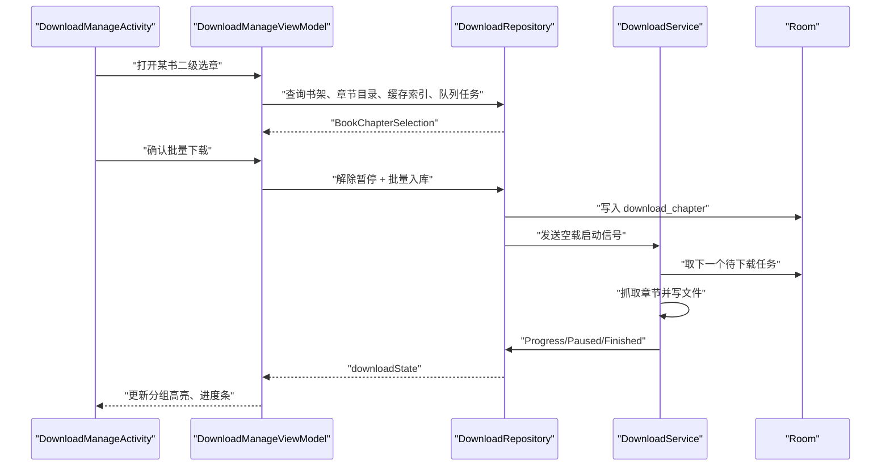

**图表来源**
- [DownloadManageViewModel.kt:300-430](file://module_book/src/main/java/com/ebook/book/mvvm/viewmodel/DownloadManageViewModel.kt#L300-L430)
- [DownloadRepository.kt:240-311](file://module_book/src/main/java/com/ebook/book/repository/DownloadRepository.kt#L240-L311)
- [DownloadService.kt:201-491](file://module_book/src/main/java/com/ebook/book/service/DownloadService.kt#L201-L491)

## 详细组件分析

### `DownloadManageViewModel` 数据模型
该 ViewModel 定义了三个关键模型：

1. `DownloadBookGroup`：一级按书卡片。包含书名、封面、来源标记、剩余任务数、全书总章节、已缓存章节、当前活跃章节、是否按书暂停。
2. `DownloadCenterStep`：页面步骤，区分一级按书列表和二级某书选章。
3. `BookSelectionState`：二级装载结果，分为加载中、书不在架、失败、就绪四类，避免把“加载态”和“无书态”混成单一 null。

这些类型体现了两个重要设计原则：
- 下载进度与全书缓存覆盖率是两条不同口径。
- 二级装载失败必须显式表达，不能无限等待加载。

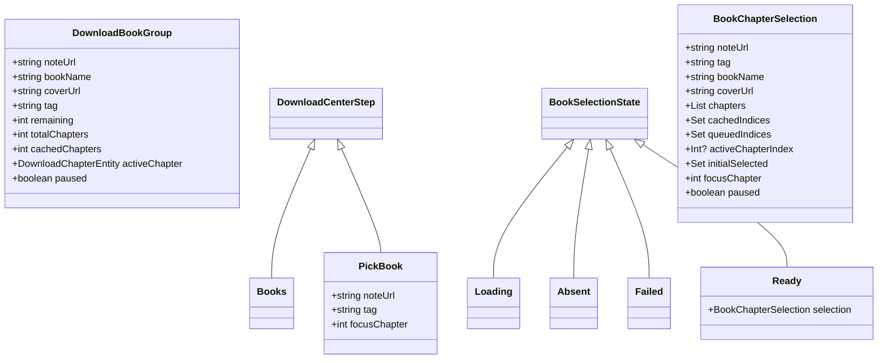

**图表来源**
- [DownloadManageViewModel.kt:20-120](file://module_book/src/main/java/com/ebook/book/mvvm/viewmodel/DownloadManageViewModel.kt#L20-L120)

**章节来源**
- [DownloadManageViewModel.kt:20-120](file://module_book/src/main/java/com/ebook/book/mvvm/viewmodel/DownloadManageViewModel.kt#L20-L120)

### 下载状态与分组刷新
`loadGroups` 是下载中心的核心刷新函数。它会：
- 一次性读取暂停书集合。
- 获取全部待下载任务并按 `noteUrl` 分组。
- 对每组计算全书缓存覆盖率。
- 根据当前活跃章节判断哪本书处于“正在下载”。
- 输出 `DownloadBookGroup` 列表供 UI 渲染。

这里的关键是：**队列剩余数不等于全书覆盖率**。前者随批次变化，后者随阅读和下载单调增长。

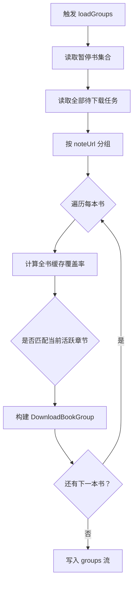

**图表来源**
- [DownloadManageViewModel.kt:120-200](file://module_book/src/main/java/com/ebook/book/mvvm/viewmodel/DownloadManageViewModel.kt#L120-L200)

**章节来源**
- [DownloadManageViewModel.kt:120-200](file://module_book/src/main/java/com/ebook/book/mvvm/viewmodel/DownloadManageViewModel.kt#L120-L200)

### 二级选章装载流程
二级选章页负责展示章节目录、已缓存章节、排队章节、当前下载章节、预勾选范围和暂停态。其装载流程强调三点：
1. 先写 Loading，防止换书时旧数据短暂上屏。
2. 书不在架时进入 Absent，而不是 Loading。
3. 异常时进入 Failed，并通过 `reportFailure` 提示用户。

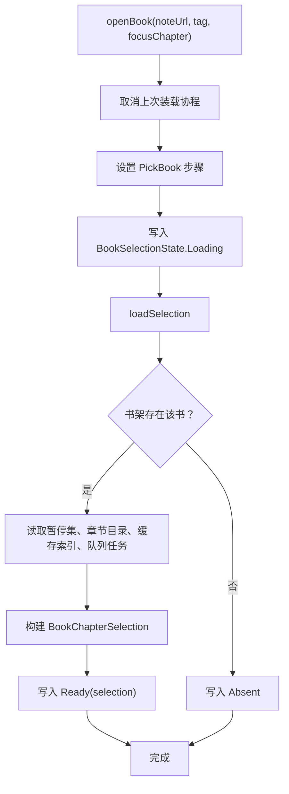

**图表来源**
- [DownloadManageViewModel.kt:200-330](file://module_book/src/main/java/com/ebook/book/mvvm/viewmodel/DownloadManageViewModel.kt#L200-L330)

**章节来源**
- [DownloadManageViewModel.kt:200-330](file://module_book/src/main/java/com/ebook/book/mvvm/viewmodel/DownloadManageViewModel.kt#L200-L330)

### 批量下载确认与乐观更新
`confirmDownload` 是用户点击“确认下载”后的主路径。它的核心行为包括：
- 剔除已在队列中的章节，避免重复下载。
- 构造 `DownloadChapterEntity` 列表，其中 `forceRefresh=true`。
- 先乐观更新 UI：解除暂停标记、把新勾章节加入 `queuedIndices`。
- 再调用仓库解除暂停并批量入库。
- 仓库负责拉起前台服务。

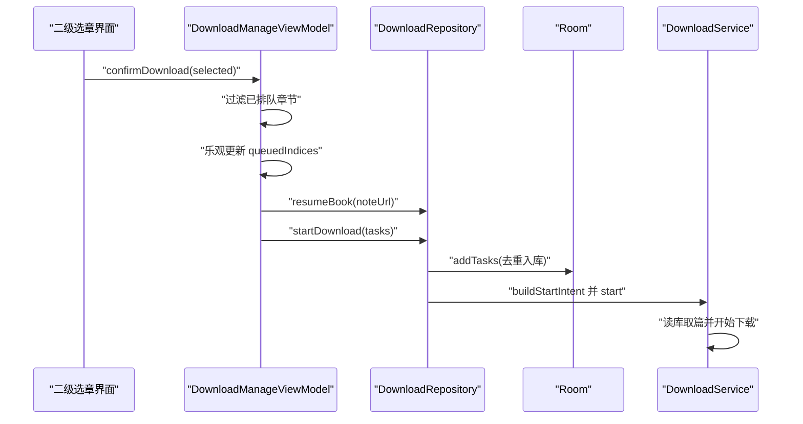

**图表来源**
- [DownloadManageViewModel.kt:330-430](file://module_book/src/main/java/com/ebook/book/mvvm/viewmodel/DownloadManageViewModel.kt#L330-L430)
- [DownloadRepository.kt:240-311](file://module_book/src/main/java/com/ebook/book/repository/DownloadRepository.kt#L240-L311)

**章节来源**
- [DownloadManageViewModel.kt:330-430](file://module_book/src/main/java/com/ebook/book/mvvm/viewmodel/DownloadManageViewModel.kt#L330-L430)
- [DownloadRepository.kt:240-311](file://module_book/src/main/java/com/ebook/book/repository/DownloadRepository.kt#L240-L311)

## 下载队列调度算法

### 取篇顺序
`DownloadRepository.getNextDownloadTask` 的调度策略可以概括为：
1. 读取暂停书集合。
2. 按书架顺序遍历非本地书。
3. 跳过暂停书。
4. 对每本书取 `dur_chapter_index` 最小的未完成任务。
5. 返回第一个能下之书的第一章。

这意味着调度并非简单“先进先出”，而是“按书架顺序、每书内部按章节序号递增”。

### 优先级与并发控制
- **优先级**：书架顺序优先于暂停标记；同一书内章节序号越小越优先。
- **并发**：服务当前实现为单任务串行下载，每章之间通过延迟间隔推进，不并发拉取多章。
- **资源限制**：通过 `CHAPTER_INTERVAL_MS` 控制章节间节奏；通过 `RETRY_TIMES` 与 `RETRY_DELAY_MS` 控制重试次数与退避。
- **配额限制**：Android 15 的 dataSync 前台服务时长配额由 `onTimeout` 保护，避免长时间后台运行。

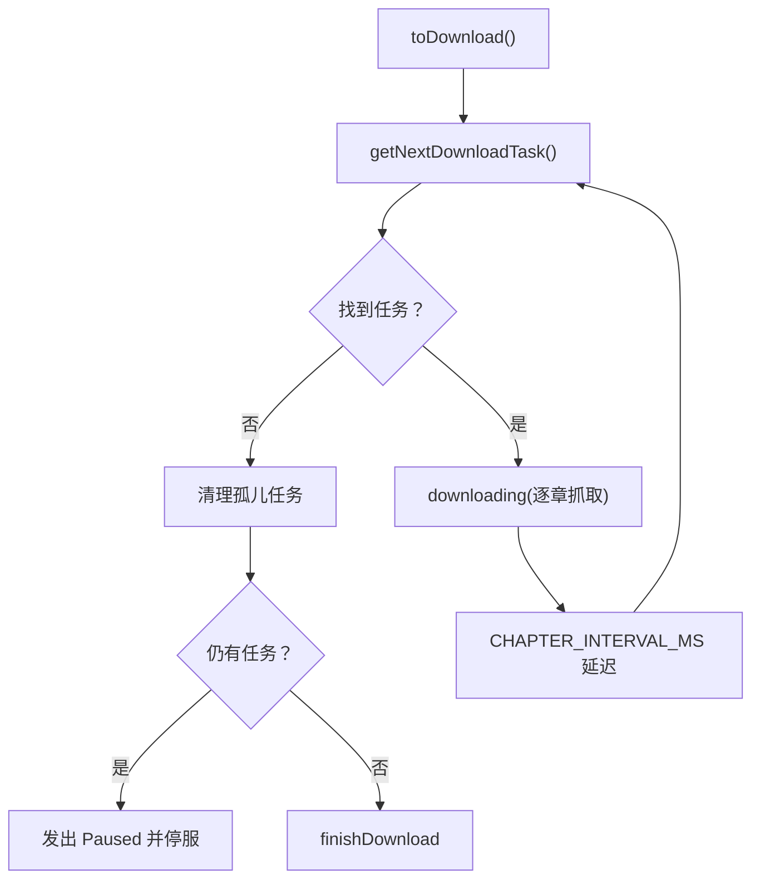

**图表来源**
- [DownloadService.kt:201-330](file://module_book/src/main/java/com/ebook/book/service/DownloadService.kt#L201-L330)
- [DownloadRepository.kt:80-120](file://module_book/src/main/java/com/ebook/book/repository/DownloadRepository.kt#L80-L120)

**章节来源**
- [DownloadRepository.kt:80-120](file://module_book/src/main/java/com/ebook/book/repository/DownloadRepository.kt#L80-L120)
- [DownloadService.kt:201-330](file://module_book/src/main/java/com/ebook/book/service/DownloadService.kt#L201-L330)

## 断点续传与中断恢复

### 断点基础
断点续传的核心事实源是 `download_chapter` 表。未完成的任务始终留在表中，直到成功删除或被取消。暂停书不会删除任务，只通过 `paused_book` 标记让调度器跳过。

### 中断恢复路径
恢复下载有两条主要路径：
1. **用户主动继续**：`resumeBook` 清除暂停标记，并发送 `ACTION_RESUME`。
2. **服务冷启动或 START_STICKY 重启**：`onStartCommand` 发现没有正在运行的下载，会查库取篇；如果有任务则继续，否则静默退出。

### 进度持久化
当前实现的“断点”更多体现为“任务未删即断点”，而不是“章节字节级断点续传”。章节内容写入由 `JsoupSourceReader` 和 `BookStore` 完成；若章节文件不存在，下一次抓取会从该章节重新拉取。

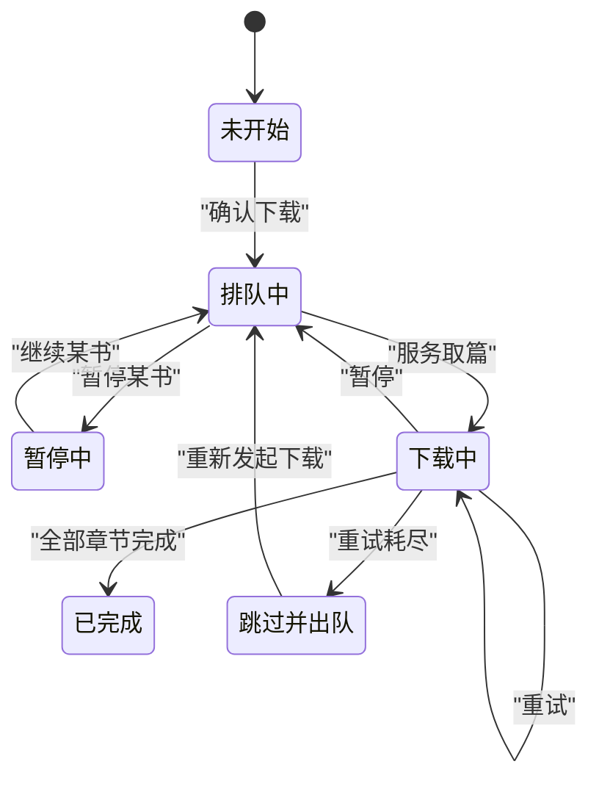

**图表来源**
- [DownloadService.kt:201-491](file://module_book/src/main/java/com/ebook/book/service/DownloadService.kt#L201-L491)
- [DownloadRepository.kt:120-240](file://module_book/src/main/java/com/ebook/book/repository/DownloadRepository.kt#L120-L240)

**章节来源**
- [DownloadService.kt:201-491](file://module_book/src/main/java/com/ebook/book/service/DownloadService.kt#L201-L491)
- [DownloadRepository.kt:120-240](file://module_book/src/main/java/com/ebook/book/repository/DownloadRepository.kt#L120-L240)

## 分组管理与统计口径

### 按书分组
一级页面以 `noteUrl` 作为书的唯一标识进行分组。每个组显示：
- 书名、封面、来源标记。
- 剩余任务数。
- 全书总章节数。
- 已缓存章节数。
- 是否暂停。
- 是否有活跃下载章节。

### 两种进度口径
| 口径 | 含义 | 变化方式 |
|---|---|---|
| 队列剩余 | 这本书还没下完的章节数 | 随入队、完成、取消而变化 |
| 全书缓存覆盖率 | 已可离线阅读的章节比例 | 随阅读、下载、强制刷新而变化 |

### 统计信息展示
- 一级卡片用覆盖率做进度条。
- 二级选章页标注每章是否已缓存、是否排队、是否正在下载。
- 书架角标使用 `remainingCount` 观察队列总数。

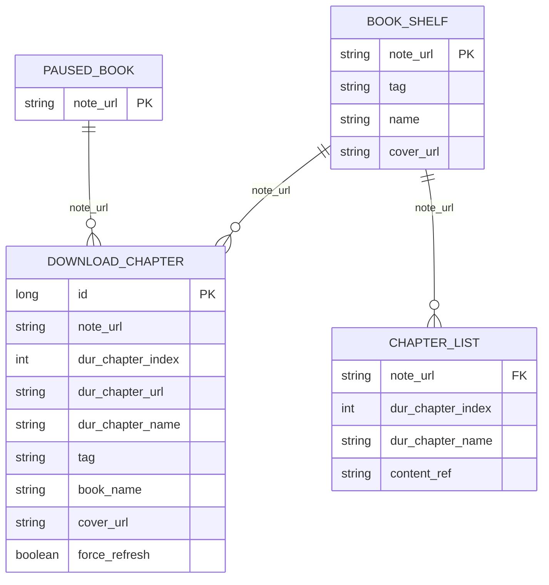

**图表来源**
- [DownloadChapterEntity.kt](file://lib_ebook_db/src/main/java/com/ebook/db/entity/DownloadChapterEntity.kt)
- [BookShelfEntity.kt](file://lib_ebook_db/src/main/java/com/ebook/db/entity/BookShelfEntity.kt)
- [DownloadRepository.kt:120-240](file://module_book/src/main/java/com/ebook/book/repository/DownloadRepository.kt#L120-L240)

**章节来源**
- [DownloadManageViewModel.kt:120-200](file://module_book/src/main/java/com/ebook/book/mvvm/viewmodel/DownloadManageViewModel.kt#L120-L200)
- [DownloadRepository.kt:201-311](file://module_book/src/main/java/com/ebook/book/repository/DownloadRepository.kt#L201-L311)

## 与前台服务通信协议

### 控制动作
ViewModel 不直接维护下载线程，而是通过 Intent 向 `DownloadService` 发送全局动作：

| 动作 | 含义 | 触发方 |
|---|---|---|
| `ACTION_RESUME` | 恢复或开始下载 | 下载管理页、书架弹窗、继续按钮 |
| `ACTION_PAUSE` | 暂停当前批次 | 下载管理页、通知栏暂停 |
| `ACTION_CANCEL` | 清空队列并结束 | 下载管理页、取消按钮 |

注意：按书暂停不走 Intent，而是写入 `paused_book` 表，由调度器在取篇时跳过。

### 状态回传
服务通过 `DownloadRepository.downloadState` 向 UI 推送三类状态：
- `Progress`：当前正在下载的章节。
- `Paused`：批次暂停。
- `Finished`：队列跑完或取消。

`SharedFlow` 使用 `replay=1`，让晚开的下载管理页也能立刻对齐当前进度，避免“页面已打开但进度仍显示完成”的错觉。

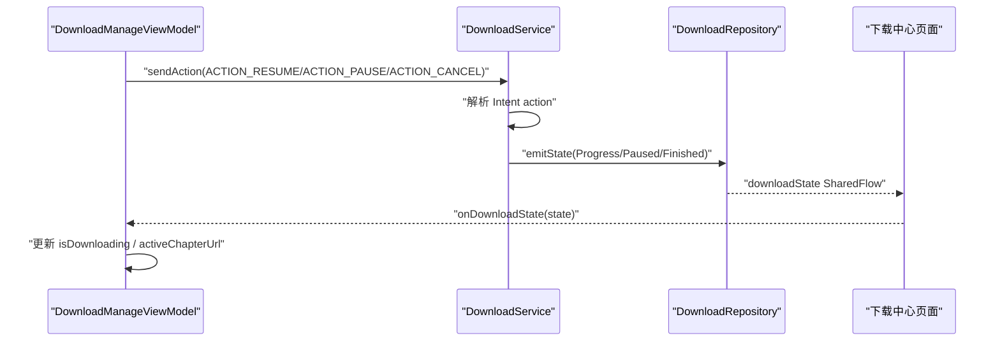

**图表来源**
- [DownloadManageViewModel.kt:200-260](file://module_book/src/main/java/com/ebook/book/mvvm/viewmodel/DownloadManageViewModel.kt#L200-L260)
- [DownloadService.kt:1-200](file://module_book/src/main/java/com/ebook/book/service/DownloadService.kt#L1-L200)
- [DownloadRepository.kt:1-80](file://module_book/src/main/java/com/ebook/book/repository/DownloadRepository.kt#L1-L80)

**章节来源**
- [DownloadManageViewModel.kt:200-260](file://module_book/src/main/java/com/ebook/book/mvvm/viewmodel/DownloadManageViewModel.kt#L200-L260)
- [DownloadService.kt:1-200](file://module_book/src/main/java/com/ebook/book/service/DownloadService.kt#L1-L200)
- [DownloadRepository.kt:1-80](file://module_book/src/main/java/com/ebook/book/repository/DownloadRepository.kt#L1-L80)

## 错误处理、重试与资源限制

### 章节下载重试
`downloading` 中对每章最多重试 `RETRY_TIMES` 次，每次失败后延迟 `RETRY_DELAY_MS`。重试耗尽后：
- 将跳过章节计数加一。
- 删除该任务。
- 继续下一章节。

这样避免队头一个失败章节阻塞整本书后续章节。

### 特殊失败场景
- **空正文**：站点返回 200 但内容为空时视为解析失败，走重试。
- **书源失效**：不按永久失败处理，同样走普通失败通道，最终出队。
- **取消异常**：捕获 `CancellationException` 并向上抛出，避免把“取消”误记为“抓取失败”。
- **前台服务不可用**：dataSync 配额用尽或前台初始化失败时，记录标记并静默收尾，不反复空转。

### 存储空间检查
当前实现没有独立的“可用空间不足”分支；空间不足通常表现为写入失败，落入通用异常路径。建议在扩展时增加明确的存储空间检查，并在 UI 提示“存储空间不足”而非笼统失败。

### 资源限制策略
| 限制项 | 当前实现 | 说明 |
|---|---|---|
| 并发数 | 1 | 单章串行下载 |
| 章节间隔 | `CHAPTER_INTERVAL_MS` | 避免频繁 IO 和网络请求 |
| 重试次数 | `RETRY_TIMES` | 防止无限重试 |
| 重试间隔 | `RETRY_DELAY_MS` | 避免瞬时限流 |
| 前台配额 | `onTimeout` | Android 15 dataSync 超时保护 |

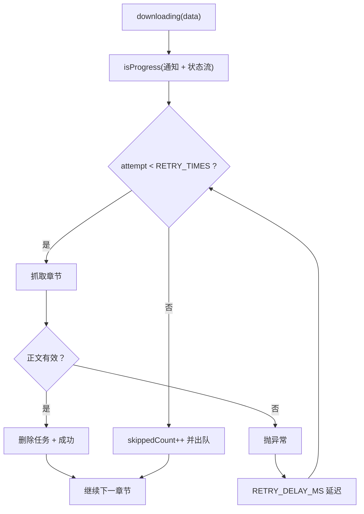

**图表来源**
- [DownloadService.kt:330-491](file://module_book/src/main/java/com/ebook/book/service/DownloadService.kt#L330-L491)

**章节来源**
- [DownloadService.kt:330-491](file://module_book/src/main/java/com/ebook/book/service/DownloadService.kt#L330-L491)

## 性能与内存特性

### 状态流优化
- `downloadState` 使用 `replay=1`，避免晚开页面错过进度。
- `remainingCount` 使用 `WhileSubscribed(5_000)`，只在书架页可见时保持活跃，离开后停止查库。
- `groups`、`step`、`bookSheet` 都是 `StateFlow`，支持 UI 自动重组。

### 数据库访问
- 暂停书集合只取一次，避免每本书重复查库。
- 覆盖率计算基于 `chapter_list` 长度和 `BookStore.hasChapter`，不再依赖旧字段。
- 批量任务先入库再拉起服务，避免启动失败丢任务。

### 内存与缓存
- `ChapterContentCache` 是进程级单例，强制刷新时会按书失效，避免阅读器读到旧正文。
- 通知异常被收敛到内部兜底，防止通知崩溃导致整条下载链路静默死亡。

**章节来源**
- [DownloadRepository.kt:1-120](file://module_book/src/main/java/com/ebook/book/repository/DownloadRepository.kt#L1-L120)
- [DownloadRepository.kt:201-311](file://module_book/src/main/java/com/ebook/book/repository/DownloadRepository.kt#L201-L311)
- [DownloadService.kt:1-200](file://module_book/src/main/java/com/ebook/book/service/DownloadService.kt#L1-L200)

## 常见问题排查

| 现象 | 可能原因 | 排查方向 |
|---|---|---|
| 点击继续没反应 | 前台服务启动被拒或 dataSync 配额用尽 | 查看 `DownloadService.start` 返回值与 `fgUnavailable` 分支 |
| 下载一直显示完成但队列还有任务 | 漏发 Finished 或状态回放残留 | 检查 `tryEmitState(Finished)` 路径 |
| 暂停后任务不跑 | 正常：暂停书被调度器跳过 | 检查 `paused_book` 表和 `getNextDownloadTask` |
| 取消后任务复活 | 清队协程被取消或异常 | 查看 `cancelDownload` 中清队与停服顺序 |
| 二级选章卡住 Loading | Room 或章节文件 IO 异常 | 查看 `BookSelectionState.Failed` 分支 |
| 强制刷新后阅读器仍看到旧内容 | `contentCache.invalidateBook` 未生效 | 检查强制刷新路径和缓存键一致性 |

**章节来源**
- [DownloadManageViewModel.kt:200-430](file://module_book/src/main/java/com/ebook/book/mvvm/viewmodel/DownloadManageViewModel.kt#L200-L430)
- [DownloadService.kt:201-491](file://module_book/src/main/java/com/ebook/book/service/DownloadService.kt#L201-L491)
- [DownloadRepository.kt:120-311](file://module_book/src/main/java/com/ebook/book/repository/DownloadRepository.kt#L120-L311)

## 最佳实践与扩展建议

### 现有最佳实践
1. **控制走 Intent，不依赖命令总线**：避免服务被回收后命令丢失。
2. **任务表是唯一队列事实源**：Intent 不携带章节列表，避免 Binder 事务过大。
3. **失败必须出队**：防止队头失败任务永久阻塞。
4. **暂停是队列策略**：保留任务，调度时跳过，而不是删除。
5. **覆盖率与队列剩余分开表达**：避免误导用户。
6. **收尾状态用 `tryEmitState`**：确保 stopSelf 前状态已进入 replay 缓冲。

### 可扩展方向
1. **增加独立存储空间检查**：在批量入库前检查可用空间，并返回明确错误码。
2. **增强网络异常分类**：区分临时网络错误、服务器 5xx、反爬、书源失效。
3. **可选并发下载**：在配置允许时开启有限并发，同时限制总带宽和磁盘 IO。
4. **断点续传升级为字节级断点**：当前是章节级断点，未来可按 HTTP Range 实现真正断点。
5. **下载优先级策略**：例如“最近阅读优先”“已选范围优先”“低电量降速”。
6. **下载统计报表**：累计成功率、平均速度、失败原因分布。

**章节来源**
- [DownloadManageViewModel.kt:120-430](file://module_book/src/main/java/com/ebook/book/mvvm/viewmodel/DownloadManageViewModel.kt#L120-L430)
- [DownloadService.kt:201-491](file://module_book/src/main/java/com/ebook/book/service/DownloadService.kt#L201-L491)
- [DownloadRepository.kt:120-311](file://module_book/src/main/java/com/ebook/book/repository/DownloadRepository.kt#L120-L311)

## 结论
`DownloadManageViewModel` 是下载中心的协调中枢：它把按书分组、二级选章、暂停/继续、批量下载、进度高亮和服务通信整合在一起，并通过 `DownloadRepository` 与 `DownloadService` 解耦 UI 与下载实现。

其核心设计价值在于：
- 用 Intent 保证控制命令可靠送达。
- 用 Room 表保证任务状态可恢复。
- 用暂停标记实现细粒度队列控制。
- 用两类进度口径避免 UI 误导。
- 用重试与出队机制防止失败任务阻塞整体下载。

在实际使用中，应特别注意：
- 不要混淆“队列剩余”和“全书覆盖率”。
- 不要假设暂停等同于删除任务。
- 不要忽略 dataSync 前台服务配额限制。
- 不要在 UI 层直接操作下载线程或数据库。