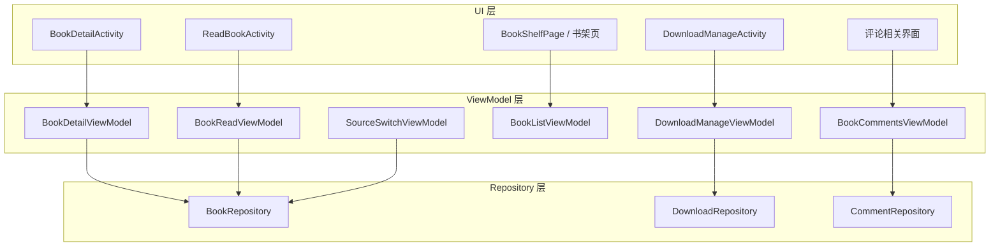
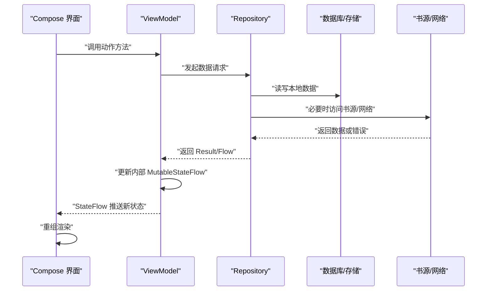
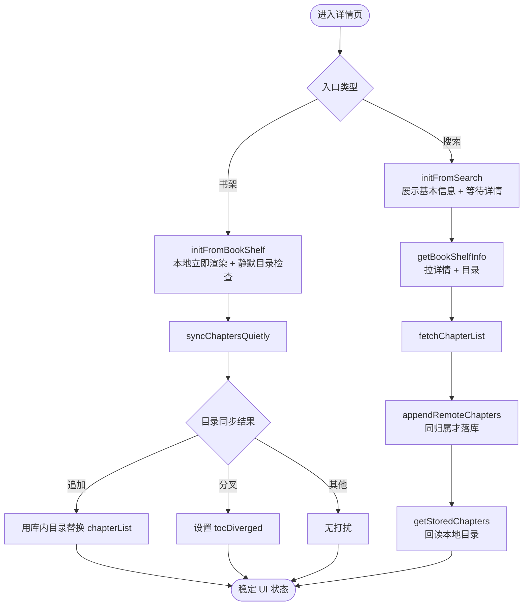
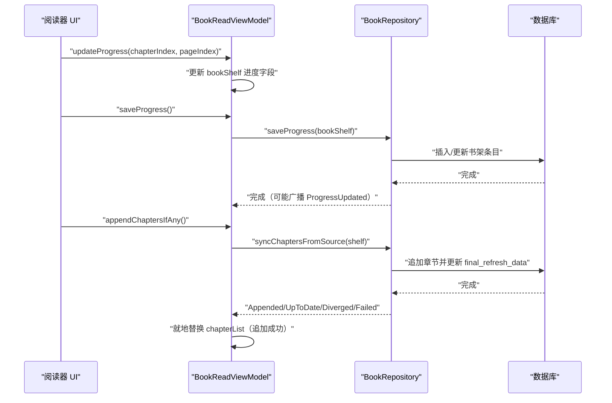
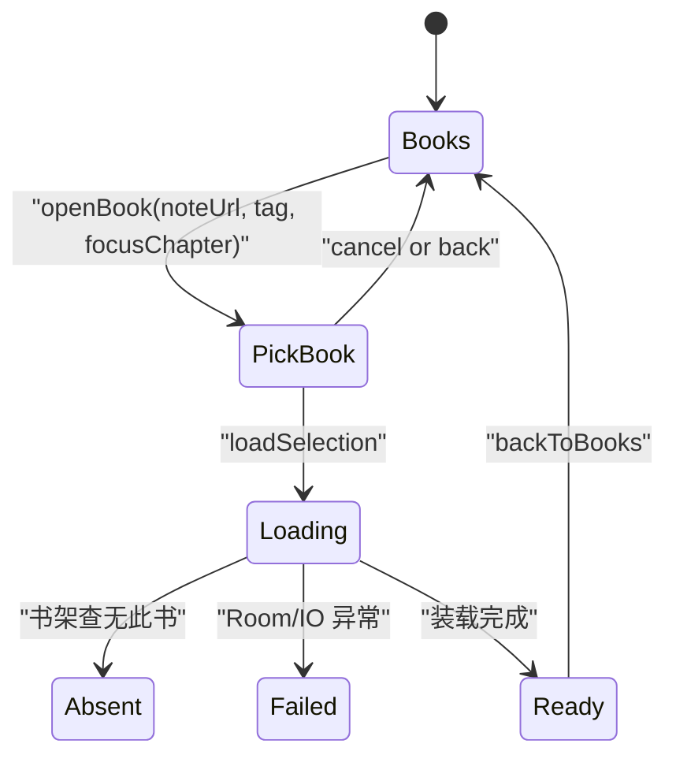
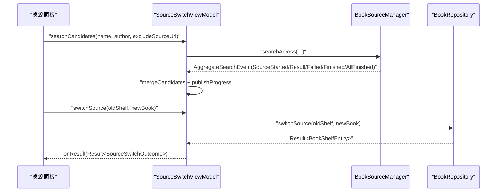
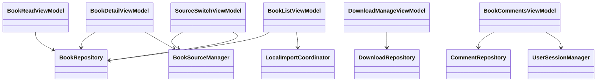

# ViewModel 层架构

<cite>
**本文引用的文件 **
- [BookDetailViewModel.kt](file://module_book/src/main/java/com/ebook/book/mvvm/viewmodel/BookDetailViewModel.kt)
- [BookReadViewModel.kt](file://module_book/src/main/java/com/ebook/book/mvvm/viewmodel/BookReadViewModel.kt)
- [DownloadManageViewModel.kt](file://module_book/src/main/java/com/ebook/book/mvvm/viewmodel/DownloadManageViewModel.kt)
- [BookListViewModel.kt](file://module_book/src/main/java/com/ebook/book/mvvm/viewmodel/BookListViewModel.kt)
- [SourceSwitchViewModel.kt](file://module_book/src/main/java/com/ebook/book/mvvm/viewmodel/SourceSwitchViewModel.kt)
- [BookCommentsViewModel.kt](file://module_book/src/main/java/com/ebook/book/mvvm/viewmodel/BookCommentsViewModel.kt)
- [BookRepository.kt](file://lib_book_common/src/main/java/com/ebook/common/repository/BookRepository.kt)
- [CommentRepository.kt](file://lib_book_common/src/main/java/com/ebook/common/repository/CommentRepository.kt)
- [DownloadRepository.kt](file://module_book/src/main/java/com/ebook/book/repository/DownloadRepository.kt)
</cite>

## 目录
1. [引言](#引言)
2. [项目结构](#项目结构)
3. [核心组件](#核心组件)
4. [架构总览](#架构总览)
5. [详细组件分析](#详细组件分析)
6. [依赖关系分析](#依赖关系分析)
7. [性能与内存优化](#性能与内存优化)
8. [常见问题排查](#常见问题排查)
9. [结论](#结论)
10. [附录：测试与最佳实践](#附录测试与最佳实践)

## 引言
本章节聚焦 module_book 模块的 ViewModel 层，说明 MVVM 在书籍管理、阅读、下载与评论等场景中的实现方式。重点包括：
- 各 ViewModel 的职责边界与状态模型。
- ViewModel 与 Repository 的数据流协作。
- StateFlow、SharedFlow、LiveData 的使用模式与 Compose 观察方式。
- 生命周期管理、并发控制与内存优化策略。
- 错误处理与可观测性设计。
- 单元测试要点与现有测试覆盖。

## 项目结构
module_book 的 MVVM 相关代码按职责分层组织：
- `mvvm/viewmodel`：页面级或功能级 ViewModel，持有 UI 状态并协调 Repository。
- `repository`：下载领域专用的 Model/Repository（遵循“仓库即 Model”约定）。
- `lib_book_common/repository`：通用书架、评论、书源等 Repository。
- 对应 Activity 通过 Hilt 注入 ViewModel，并通过 Compose 收集 StateFlow 驱动重组。

**图表来源**
- [BookDetailViewModel.kt:1-200](file://module_book/src/main/java/com/ebook/book/mvvm/viewmodel/BookDetailViewModel.kt#L1-L200)
- [BookReadViewModel.kt:1-151](file://module_book/src/main/java/com/ebook/book/mvvm/viewmodel/BookReadViewModel.kt#L1-L151)
- [DownloadManageViewModel.kt:1-200](file://module_book/src/main/java/com/ebook/book/mvvm/viewmodel/DownloadManageViewModel.kt#L1-L200)
- [BookListViewModel.kt:1-68](file://module_book/src/main/java/com/ebook/book/mvvm/viewmodel/BookListViewModel.kt#L1-L68)
- [SourceSwitchViewModel.kt:1-200](file://module_book/src/main/java/com/ebook/book/mvvm/viewmodel/SourceSwitchViewModel.kt#L1-L200)
- [BookCommentsViewModel.kt:1-179](file://module_book/src/main/java/com/ebook/book/mvvm/viewmodel/BookCommentsViewModel.kt#L1-L179)
- [BookRepository.kt:1-200](file://lib_book_common/src/main/java/com/ebook/common/repository/BookRepository.kt#L1-L200)
- [DownloadRepository.kt:1-200](file://module_book/src/main/java/com/ebook/book/repository/DownloadRepository.kt#L1-L200)
- [CommentRepository.kt:1-114](file://lib_book_common/src/main/java/com/ebook/common/repository/CommentRepository.kt#L1-L114)

**分节来源**
- [BookDetailViewModel.kt:1-200](file://module_book/src/main/java/com/ebook/book/mvvm/viewmodel/BookDetailViewModel.kt#L1-L200)
- [BookReadViewModel.kt:1-151](file://module_book/src/main/java/com/ebook/book/mvvm/viewmodel/BookReadViewModel.kt#L1-L151)
- [DownloadManageViewModel.kt:1-200](file://module_book/src/main/java/com/ebook/book/mvvm/viewmodel/DownloadManageViewModel.kt#L1-L200)
- [BookListViewModel.kt:1-68](file://module_book/src/main/java/com/ebook/book/mvvm/viewmodel/BookListViewModel.kt#L1-L68)
- [SourceSwitchViewModel.kt:1-200](file://module_book/src/main/java/com/ebook/book/mvvm/viewmodel/SourceSwitchViewModel.kt#L1-L200)
- [BookCommentsViewModel.kt:1-179](file://module_book/src/main/java/com/ebook/book/mvvm/viewmodel/BookCommentsViewModel.kt#L1-L179)
- [BookRepository.kt:1-200](file://lib_book_common/src/main/java/com/ebook/common/repository/BookRepository.kt#L1-L200)
- [DownloadRepository.kt:1-200](file://module_book/src/main/java/com/ebook/book/repository/DownloadRepository.kt#L1-L200)
- [CommentRepository.kt:1-114](file://lib_book_common/src/main/java/com/ebook/common/repository/CommentRepository.kt#L1-L114)

## 核心组件
本节概述各 ViewModel 的职责与关键数据流：

- BookDetailViewModel：负责书籍详情页 UI 状态、从搜索入口拉详情与目录、从书架入口静默检查目录更新、加入书架/移出书架、目录分叉提示等。
- BookReadViewModel：负责阅读进度保存、章节标题获取、是否已在书架判断、加入书架、章节正文加载、当前章缓存刷新、末章自动追更。
- DownloadManageViewModel：负责下载中心按书分组、二级选章装载、服务状态同步、开始/暂停/取消/继续下载、队列剩余角标等。
- BookListViewModel：负责书架列表刷新、事件驱动刷新、导入解析中占位行展示。
- SourceSwitchViewModel：负责跨书源聚合候选搜索、执行换源、失败与结果回传。
- BookCommentsViewModel：负责评论分页加载、合并、本人判定、新增与删除评论。

**分节来源**
- [BookDetailViewModel.kt:1-200](file://module_book/src/main/java/com/ebook/book/mvvm/viewmodel/BookDetailViewModel.kt#L1-L200)
- [BookReadViewModel.kt:1-151](file://module_book/src/main/java/com/ebook/book/mvvm/viewmodel/BookReadViewModel.kt#L1-L151)
- [DownloadManageViewModel.kt:1-200](file://module_book/src/main/java/com/ebook/book/mvvm/viewmodel/DownloadManageViewModel.kt#L1-L200)
- [BookListViewModel.kt:1-68](file://module_book/src/main/java/com/ebook/book/mvvm/viewmodel/BookListViewModel.kt#L1-L68)
- [SourceSwitchViewModel.kt:1-200](file://module_book/src/main/java/com/ebook/book/mvvm/viewmodel/SourceSwitchViewModel.kt#L1-L200)
- [BookCommentsViewModel.kt:1-179](file://module_book/src/main/java/com/ebook/book/mvvm/viewmodel/BookCommentsViewModel.kt#L1-L179)

## 架构总览
MVVM 在本模块中遵循以下原则：
- ViewModel 只暴露可观察状态（StateFlow），不直接操作 UI；命令方法封装业务逻辑。
- Repository 作为单一事实源，封装 Room、网络、存储、事件发布。
- 页面使用 Compose 收集 StateFlow 触发重组。
- 事件采用 SharedFlow 进行单向广播（如书架事件、下载状态）。
- 复杂 UI 状态收敛为单一 StateFlow，避免多字段不同步导致的刷新问题。

**图表来源**
- [BookDetailViewModel.kt:1-200](file://module_book/src/main/java/com/ebook/book/mvvm/viewmodel/BookDetailViewModel.kt#L1-L200)
- [BookReadViewModel.kt:1-151](file://module_book/src/main/java/com/ebook/book/mvvm/viewmodel/BookReadViewModel.kt#L1-L151)
- [DownloadManageViewModel.kt:1-200](file://module_book/src/main/java/com/ebook/book/mvvm/viewmodel/DownloadManageViewModel.kt#L1-L200)
- [BookRepository.kt:1-200](file://lib_book_common/src/main/java/com/ebook/common/repository/BookRepository.kt#L1-L200)
- [DownloadRepository.kt:1-200](file://module_book/src/main/java/com/ebook/book/repository/DownloadRepository.kt#L1-L200)

## 详细组件分析

### BookDetailViewModel：书籍详情页
职责与状态模型：
- 维护 `BookDetailUiState`，包含书籍实体、是否在书架、加载态、错误态、目录分叉提示。
- 书架事件订阅：Added/Removed/ProgressUpdated/ChaptersUpdated，保证旋转重建时不重复累积。
- 两个入口：
  - 书架入口：先渲染本地条目，再静默重抓目录；追加成功仅提示条数，失败不打扰用户。
  - 搜索入口：先显示基本信息，再拉详情与目录；失败置 loadError，不清空已有实体。
- 加入书架/移出书架：异常路径走 sendToast 与日志。
- 书源失效与网络异常统一捕获，避免页面永远转圈。

**图表来源**
- [BookDetailViewModel.kt:1-200](file://module_book/src/main/java/com/ebook/book/mvvm/viewmodel/BookDetailViewModel.kt#L1-L200)
- [BookDetailViewModel.kt:201-339](file://module_book/src/main/java/com/ebook/book/mvvm/viewmodel/BookDetailViewModel.kt#L201-L339)

**分节来源**
- [BookDetailViewModel.kt:1-200](file://module_book/src/main/java/com/ebook/book/mvvm/viewmodel/BookDetailViewModel.kt#L1-L200)
- [BookDetailViewModel.kt:201-339](file://module_book/src/main/java/com/ebook/book/mvvm/viewmodel/BookDetailViewModel.kt#L201-L339)

### BookReadViewModel：阅读器状态
职责与流程：
- 保存阅读进度：钳制到库内行数，避免越界；并发写库并广播进度事件。
- 章节读取与缓存刷新：统一通过 Repository.loadChapter 路由，支持本地与网络书。
- 末章追更：单飞标志防止并发；只在主线程回调中触发；成功后就地替换 chapterList。
- 是否已在书架：异步查询后通过 SharedFlow 通知 UI。
- 加入书架：成功后标记 isAdd 并回调。

**图表来源**
- [BookReadViewModel.kt:1-151](file://module_book/src/main/java/com/ebook/book/mvvm/viewmodel/BookReadViewModel.kt#L1-L151)
- [BookRepository.kt:201-429](file://lib_book_common/src/main/java/com/ebook/common/repository/BookRepository.kt#L201-L429)

**分节来源**
- [BookReadViewModel.kt:1-151](file://module_book/src/main/java/com/ebook/book/mvvm/viewmodel/BookReadViewModel.kt#L1-L151)
- [BookRepository.kt:201-429](file://lib_book_common/src/main/java/com/ebook/common/repository/BookRepository.kt#L201-L429)

### DownloadManageViewModel：下载中心
职责与数据流：
- 按书分组任务，叠加全书缓存覆盖率，区分“队列剩余”和“全书覆盖率”。
- 服务状态流 downloadState：Progress 时高亮活跃章节，Paused/Finished 收起活跃态。
- 页面步骤：一级按书列表 / 二级该书选章，整屏切换。
- 二级装载：书架信息 + 章目录 + 缓存 + 队列三方合并，失败落 Failed 态。
- 预勾选：当前章+50 范围未缓存且未排队者，排除已排队。
- 确认下载：剔除已在队列中的章，乐观更新 queuedIndices，解除暂停后下发任务。

**图表来源**
- [DownloadManageViewModel.kt:1-200](file://module_book/src/main/java/com/ebook/book/mvvm/viewmodel/DownloadManageViewModel.kt#L1-L200)
- [DownloadManageViewModel.kt:201-430](file://module_book/src/main/java/com/ebook/book/mvvm/viewmodel/DownloadManageViewModel.kt#L201-L430)

**分节来源**
- [DownloadManageViewModel.kt:1-200](file://module_book/src/main/java/com/ebook/book/mvvm/viewmodel/DownloadManageViewModel.kt#L1-L200)
- [DownloadManageViewModel.kt:201-430](file://module_book/src/main/java/com/ebook/book/mvvm/viewmodel/DownloadManageViewModel.kt#L201-L430)

### BookListViewModel：书架列表
职责与事件驱动：
- 刷新书架列表：下拉刷新 + 事件驱动刷新共用 refreshData。
- 订阅 BookRepository.bookShelfEvents：Added/Removed/ProgressUpdated/ChaptersUpdated → 刷新。
- 转发 LocalImportCoordinator.parsingBooks：解析中占位行。

**分节来源**
- [BookListViewModel.kt:1-68](file://module_book/src/main/java/com/ebook/book/mvvm/viewmodel/BookListViewModel.kt#L1-L68)
- [BookRepository.kt:1-200](file://lib_book_common/src/main/java/com/ebook/common/repository/BookRepository.kt#L1-L200)

### SourceSwitchViewModel：阅读中换源
职责与流程：
- 跨书源聚合候选搜索：增量流边收边并，进度表达“已收到 X/Y 书源结果”。
- 排除当前书源，避免原地换源。
- 失败经 searchFailure 状态流返回，由面板内联渲染；不调用 reportFailure/sendToast。
- 执行换源：委托 BookRepository.switchSource，成功时返回 SourceSwitchOutcome。

**图表来源**
- [SourceSwitchViewModel.kt:1-200](file://module_book/src/main/java/com/ebook/book/mvvm/viewmodel/SourceSwitchViewModel.kt#L1-L200)
- [BookRepository.kt:201-429](file://lib_book_common/src/main/java/com/ebook/common/repository/BookRepository.kt#L201-L429)

**分节来源**
- [SourceSwitchViewModel.kt:1-200](file://module_book/src/main/java/com/ebook/book/mvvm/viewmodel/SourceSwitchViewModel.kt#L1-L200)
- [BookRepository.kt:201-429](file://lib_book_common/src/main/java/com/ebook/common/repository/BookRepository.kt#L201-L429)

### BookCommentsViewModel：书籍评论
职责与流程：
- 分页加载评论：首页重置 nextPage=2，hasMoreData 控制加载更多闸门。
- 合并评论：按 id 去重，按 CommentTime 倒序排序，避免并发窗口乱序。
- 本人判定：currentUserId > 0 且 comment.userId == currentUserId。
- 新增/删除评论：成功后刷新列表或发送一次性事件。

**分节来源**
- [BookCommentsViewModel.kt:1-179](file://module_book/src/main/java/com/ebook/book/mvvm/viewmodel/BookCommentsViewModel.kt#L1-L179)
- [CommentRepository.kt:1-114](file://lib_book_common/src/main/java/com/ebook/common/repository/CommentRepository.kt#L1-L114)

## 依赖关系分析
ViewModel 与 Repository 的耦合点：
- BookDetailViewModel 依赖 BookRepository 与 BookSourceManager。
- BookReadViewModel 依赖 BookRepository。
- DownloadManageViewModel 依赖 DownloadRepository。
- BookListViewModel 依赖 BookRepository 与 LocalImportCoordinator。
- SourceSwitchViewModel 依赖 BookSourceManager 与 BookRepository。
- BookCommentsViewModel 依赖 CommentRepository 与 UserSessionManager。

**图表来源**
- [BookDetailViewModel.kt:1-200](file://module_book/src/main/java/com/ebook/book/mvvm/viewmodel/BookDetailViewModel.kt#L1-L200)
- [BookReadViewModel.kt:1-151](file://module_book/src/main/java/com/ebook/book/mvvm/viewmodel/BookReadViewModel.kt#L1-L151)
- [DownloadManageViewModel.kt:1-200](file://module_book/src/main/java/com/ebook/book/mvvm/viewmodel/DownloadManageViewModel.kt#L1-L200)
- [BookListViewModel.kt:1-68](file://module_book/src/main/java/com/ebook/book/mvvm/viewmodel/BookListViewModel.kt#L1-L68)
- [SourceSwitchViewModel.kt:1-200](file://module_book/src/main/java/com/ebook/book/mvvm/viewmodel/SourceSwitchViewModel.kt#L1-L200)
- [BookCommentsViewModel.kt:1-179](file://module_book/src/main/java/com/ebook/book/mvvm/viewmodel/BookCommentsViewModel.kt#L1-L179)

**分节来源**
- [BookDetailViewModel.kt:1-200](file://module_book/src/main/java/com/ebook/book/mvvm/viewmodel/BookDetailViewModel.kt#L1-L200)
- [BookReadViewModel.kt:1-151](file://module_book/src/main/java/com/ebook/book/mvvm/viewmodel/BookReadViewModel.kt#L1-L151)
- [DownloadManageViewModel.kt:1-200](file://module_book/src/main/java/com/ebook/book/mvvm/viewmodel/DownloadManageViewModel.kt#L1-L200)
- [BookListViewModel.kt:1-68](file://module_book/src/main/java/com/ebook/book/mvvm/viewmodel/BookListViewModel.kt#L1-L68)
- [SourceSwitchViewModel.kt:1-200](file://module_book/src/main/java/com/ebook/book/mvvm/viewmodel/SourceSwitchViewModel.kt#L1-L200)
- [BookCommentsViewModel.kt:1-179](file://module_book/src/main/java/com/ebook/book/mvvm/viewmodel/BookCommentsViewModel.kt#L1-L179)

## 性能与内存优化
- StateFlow 收敛 UI 状态：避免多字段不同步导致多次重组；例如详情页 detailState 替代 mBookShelf/inBookShelf 多个字段。
- SharedFlow replay 与缓冲：下载状态流 replay=1，确保晚开页面能对齐当前进度；书架事件额外 buffer 容量，避免快速事件丢失。
- WhileSubscribed 节流：下载剩余角标仅在书架页可见时保持活跃，离开后停止查库。
- 协程作用域：所有异步操作在 viewModelScope 中启动，随 ViewModel 销毁自动取消。
- 单飞标志：末章追更使用 syncInFlight 防止并发重复检查。
- 事务最小化：BookRepository.switchSource 将网络解析放在事务外，减少 Room 写事务阻塞。
- 数据钳制：saveProgress 对 durChapter 钳制到库内行数，避免越界写入。
- 内存缓存失效：移除书架时统一清理内容存储与章节内容缓存。

[无需分节来源：本节为通用性能建议总结]

## 常见问题排查
- 详情页网络拉取完成后页面不刷新：原因是历史实现中 mBookShelf/inBookShelf 为普通字段，Compose 化后无订阅者；现已收敛为 detailState 单一 StateFlow。
- 书架列表旋转重建重复元素：原 Activity onCreate 收集事件会重复 add；现移入 VM init，每 VM 只收集一次，天然幂等。
- 详情页搜索入口失败后“开始阅读”断链：旧 catch 清空已填充实体；现失败仅置 loadError，不清空已有 bookShelf。
- 阅读进度越界：Repository.saveProgress 钳制到库内行数，避免书架侧 getOrNull(durChapter) 越界。
- 下载管理页提示不显示：若该 VM 被非 BaseMvvmActivity 宿主承载，sendToast 通道无人消费；应使用 ToastUtil 或直接 UI 提示。
- 换源面板失败不提示：SourceSwitchViewModel 的命令通道无人收集，必须把失败原因交给 onResult，由面板内联渲染。
- 评论列表并发窗口重复：mergeCommentPage 按 id 去重并按时间倒序全局重排，保证一致展示序。

**分节来源**
- [BookDetailViewModel.kt:1-200](file://module_book/src/main/java/com/ebook/book/mvvm/viewmodel/BookDetailViewModel.kt#L1-L200)
- [BookDetailViewModel.kt:201-339](file://module_book/src/main/java/com/ebook/book/mvvm/viewmodel/BookDetailViewModel.kt#L201-L339)
- [BookListViewModel.kt:1-68](file://module_book/src/main/java/com/ebook/book/mvvm/viewmodel/BookListViewModel.kt#L1-L68)
- [BookReadViewModel.kt:1-151](file://module_book/src/main/java/com/ebook/book/mvvm/viewmodel/BookReadViewModel.kt#L1-L151)
- [DownloadManageViewModel.kt:201-430](file://module_book/src/main/java/com/ebook/book/mvvm/viewmodel/DownloadManageViewModel.kt#L201-L430)
- [SourceSwitchViewModel.kt:1-200](file://module_book/src/main/java/com/ebook/book/mvvm/viewmodel/SourceSwitchViewModel.kt#L1-L200)
- [BookCommentsViewModel.kt:1-179](file://module_book/src/main/java/com/ebook/book/mvvm/viewmodel/BookCommentsViewModel.kt#L1-L179)

## 结论
module_book 的 ViewModel 层以清晰职责边界、单一事实源、可观察状态与强生命周期管理为核心。通过 StateFlow/SharedFlow 构建稳定数据流，配合 Repository 的事务与缓存策略，实现了书籍详情、阅读、下载与评论等复杂场景的可维护实现。未来可继续强化纯函数状态合并、更细粒度事件拆分以及端到端测试覆盖。

[无需分节来源：本节为总结性内容]

## 附录：测试与最佳实践
现有测试覆盖要点：
- BookDetailViewModelSourceTest：验证换源/书源失效等分支。
- IsOwnCommentTest：评论本人判定的纯函数测试。
- MergeCommentPageTest：评论合并逻辑测试。
- ReadingProgressFlowTest：阅读进度流测试。
- SourceSwitchViewModelTest：换源候选搜索与执行测试。
- BookRepositoryTest/ChapterSync*：仓库层章节同步与差异测试。
- DownloadQueueActionRenderTest/ChapterDownloadStatusTest：下载队列行为测试。

最佳实践建议：
- ViewModel 测试优先使用协程测试调度器，模拟 Repository 返回值与 Flow 事件。
- 对纯函数（如 mergeCommentPage、isOwnComment）编写 JVM 单测。
- 对异步流程（如 appendChaptersIfAny、loadSelection）使用 runTest 与 advanceUntilIdle。
- 对 SharedFlow 使用 test 扩展校验事件序列。
- 对 UI 组合函数使用 @Preview 与 RenderTest 验证渲染分支。

**分节来源**
- [BookDetailViewModelSourceTest.kt](file://module_book/src/test/java/com/ebook/book/mvvm/viewmodel/BookDetailViewModelSourceTest.kt)
- [IsOwnCommentTest.kt](file://module_book/src/test/java/com/ebook/book/mvvm/viewmodel/IsOwnCommentTest.kt)
- [MergeCommentPageTest.kt](file://module_book/src/test/java/com/ebook/book/mvvm/viewmodel/MergeCommentPageTest.kt)
- [ReadingProgressFlowTest.kt](file://module_book/src/test/java/com/ebook/book/mvvm/viewmodel/ReadingProgressFlowTest.kt)
- [SourceSwitchViewModelTest.kt](file://module_book/src/test/java/com/ebook/book/mvvm/viewmodel/SourceSwitchViewModelTest.kt)
- [BookRepositoryTest.kt](file://lib_book_common/src/test/java/com/ebook/common/repository/BookRepositoryTest.kt)
- [ChapterTocDiffTest.kt](file://lib_book_common/src/test/java/com/ebook/common/repository/ChapterTocDiffTest.kt)
- [ChapterAppendProgressTest.kt](file://lib_book_common/src/test/java/com/ebook/common/repository/ChapterAppendProgressTest.kt)
- [DownloadQueueActionRenderTest.kt](file://module_book/src/test/java/com/ebook/book/page/DownloadQueueActionRenderTest.kt)
- [ChapterDownloadStatusTest.kt](file://module_book/src/test/java/com/ebook/book/reader/ChapterDownloadStatusTest.kt)