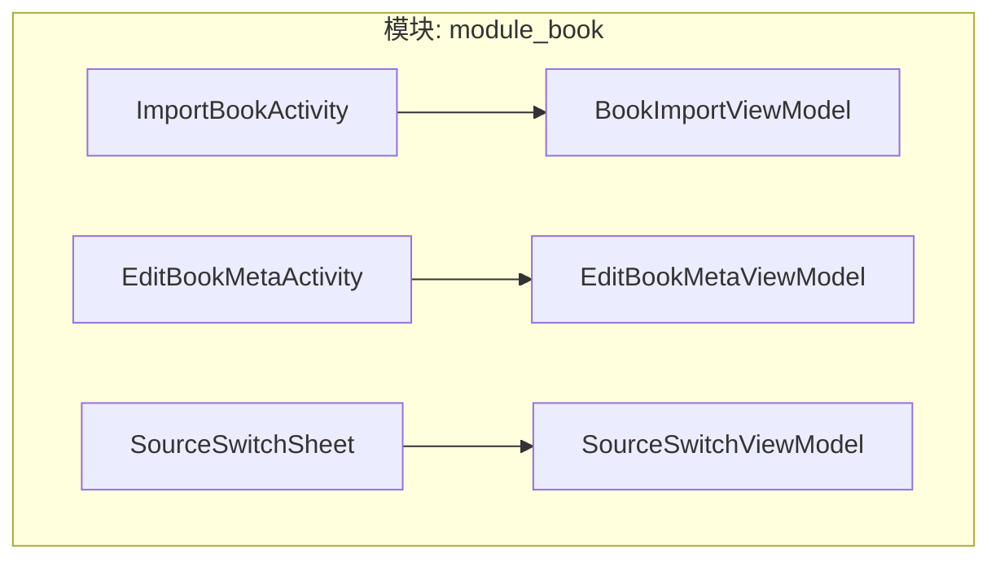
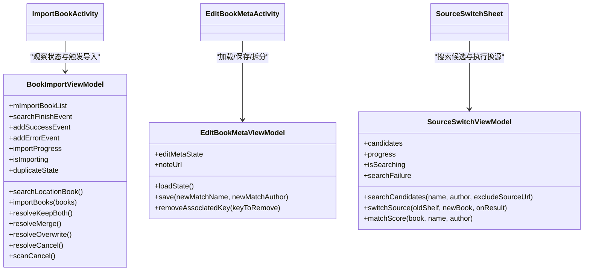
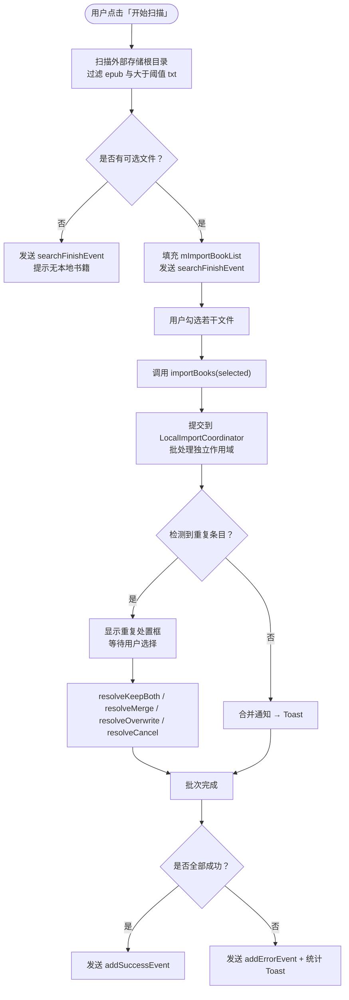
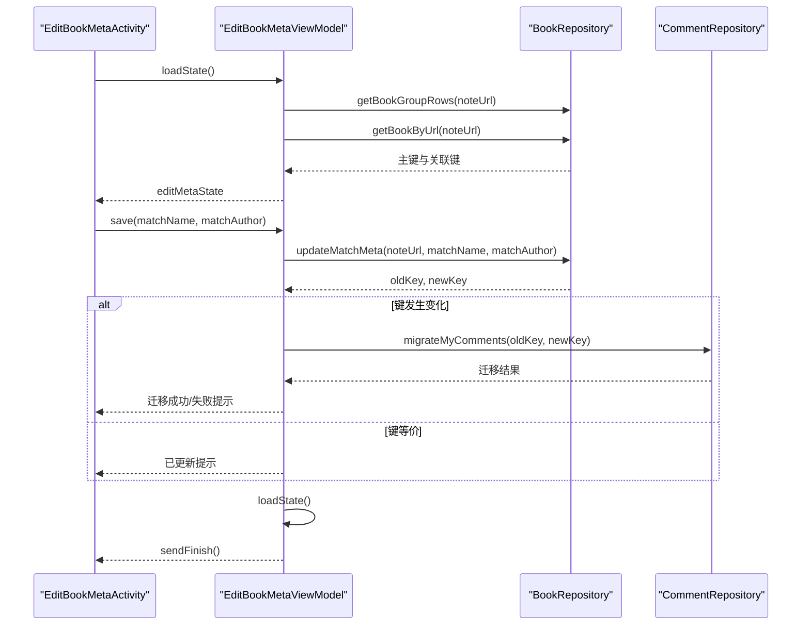
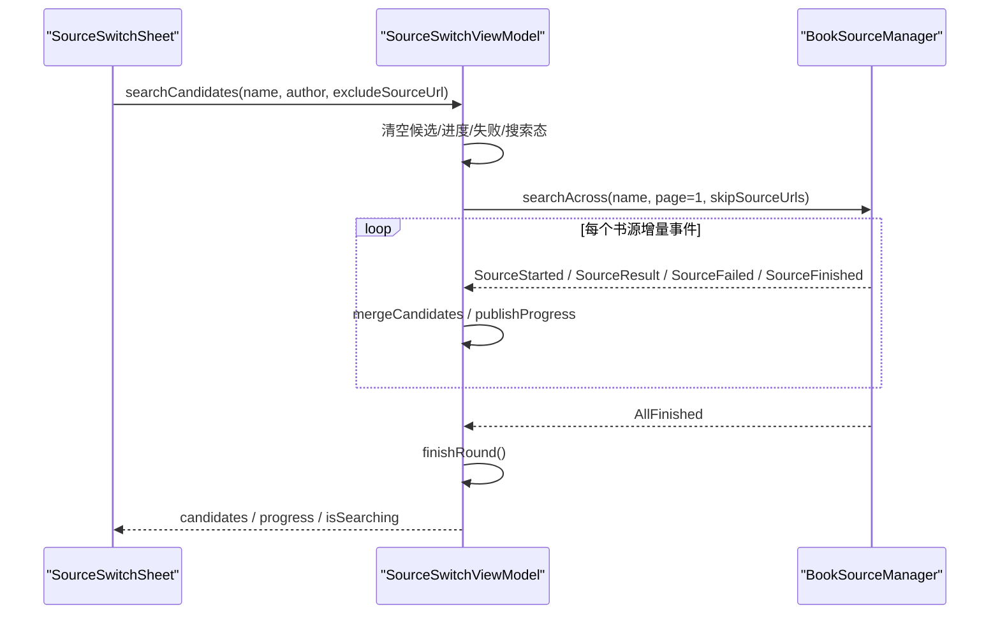
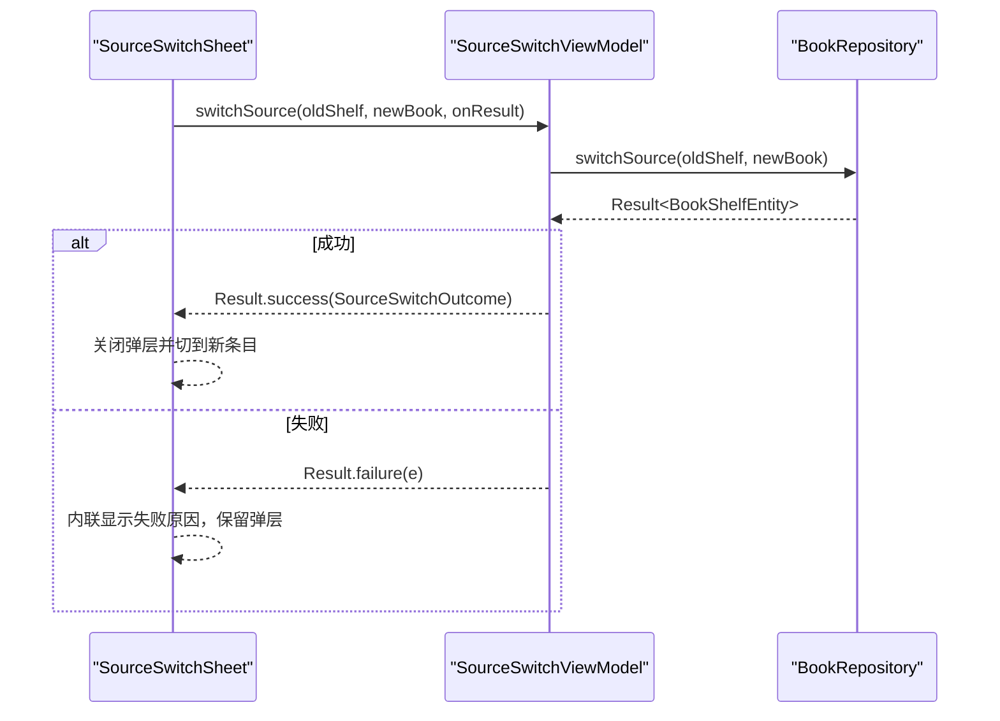
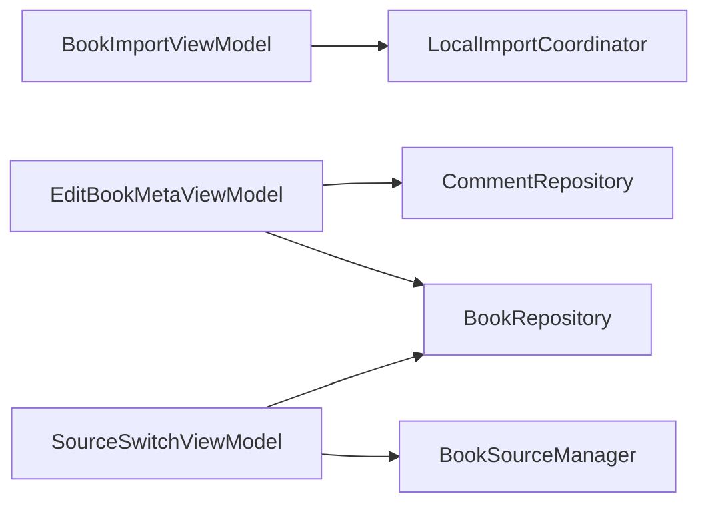

# 辅助 ViewModel - 补充功能支持

<cite>
**本文引用的文件**   
- [BookImportViewModel.kt](file://module_book/src/main/java/com/ebook/book/mvvm/viewmodel/BookImportViewModel.kt)
- [EditBookMetaViewModel.kt](file://module_book/src/main/java/com/ebook/book/mvvm/viewmodel/EditBookMetaViewModel.kt)
- [SourceSwitchViewModel.kt](file://module_book/src/main/java/com/ebook/book/mvvm/viewmodel/SourceSwitchViewModel.kt)
- [ImportBookActivity.kt](file://module_book/src/main/java/com/ebook/book/ImportBookActivity.kt)
- [EditBookMetaActivity.kt](file://module_book/src/main/java/com/ebook/book/EditBookMetaActivity.kt)
- [SourceSwitchSheet.kt](file://module_book/src/main/java/com/ebook/book/reader/SourceSwitchSheet.kt)
</cite>

## 目录
1. [引言](#引言)
2. [项目结构](#项目结构)
3. [核心组件](#核心组件)
4. [架构总览](#架构总览)
5. [详细组件分析](#详细组件分析)
6. [依赖关系分析](#依赖关系分析)
7. [性能与一致性考量](#性能与一致性考量)
8. [故障排查指南](#故障排查指南)
9. [结论](#结论)

## 引言
本文聚焦三个辅助 ViewModel：`BookImportViewModel`、`EditBookMetaViewModel` 和 `SourceSwitchViewModel`。它们分别承担本地书籍导入、书籍元数据（匹配键）编辑，以及阅读中跨书源切换三类“增强型”能力。文章从代码实现出发，说明文件选择与批量导入流程、匹配键重算与评论迁移机制、候选搜索与章节映射逻辑，并给出与 Activity / Compose 面板的集成方式、错误处理与数据一致性保障实践。

## 项目结构
这三个 ViewModel 都位于 `module_book` 的 MVVM 层中，各自对应一个页面或弹层：

**图表来源**
- [BookImportViewModel.kt:1-192](file://module_book/src/main/java/com/ebook/book/mvvm/viewmodel/BookImportViewModel.kt#L1-L192)
- [EditBookMetaViewModel.kt:1-148](file://module_book/src/main/java/com/ebook/book/mvvm/viewmodel/EditBookMetaViewModel.kt#L1-L148)
- [SourceSwitchViewModel.kt:1-318](file://module_book/src/main/java/com/ebook/book/mvvm/viewmodel/SourceSwitchViewModel.kt#L1-L318)
- [ImportBookActivity.kt:1-200](file://module_book/src/main/java/com/ebook/book/ImportBookActivity.kt#L1-L200)
- [EditBookMetaActivity.kt:1-200](file://module_book/src/main/java/com/ebook/book/EditBookMetaActivity.kt#L1-L200)
- [SourceSwitchSheet.kt:1-200](file://module_book/src/main/java/com/ebook/book/reader/SourceSwitchSheet.kt#L1-L200)

**章节来源**
- [BookImportViewModel.kt:1-192](file://module_book/src/main/java/com/ebook/book/mvvm/viewmodel/BookImportViewModel.kt#L1-L192)
- [EditBookMetaViewModel.kt:1-148](file://module_book/src/main/java/com/ebook/book/mvvm/viewmodel/EditBookMetaViewModel.kt#L1-L148)
- [SourceSwitchViewModel.kt:1-318](file://module_book/src/main/java/com/ebook/book/mvvm/viewmodel/SourceSwitchViewModel.kt#L1-L318)

## 核心组件
- `BookImportViewModel`：负责本地文件扫描、格式筛选、进度与判重状态投影，并把批量导入委托给进程级协调器；页面只观察结果、显示 Toast 或弹窗。
- `EditBookMetaViewModel`：负责加载当前书的匹配名、匹配作者、主键与关联键列表；保存时重算键、切换主键、迁移本人评论；拆分操作移除次要键。
- `SourceSwitchViewModel`：负责按书名 + 作者聚合多书源候选，维护候选列表、进度、失败原因，并提供换源事务调用入口及结果封装。

**章节来源**
- [BookImportViewModel.kt:1-192](file://module_book/src/main/java/com/ebook/book/mvvm/viewmodel/BookImportViewModel.kt#L1-L192)
- [EditBookMetaViewModel.kt:1-148](file://module_book/src/main/java/com/ebook/book/mvvm/viewmodel/EditBookMetaViewModel.kt#L1-L148)
- [SourceSwitchViewModel.kt:1-318](file://module_book/src/main/java/com/ebook/book/mvvm/viewmodel/SourceSwitchViewModel.kt#L1-L318)

## 架构总览
三个 ViewModel 都遵循轻量 ViewModel 约定：不持有一次性命令门面，使用 `NoOpModel`；通过协程与 Flow / LiveData 暴露 UI 状态；业务副作用交给仓库或协调器。

**图表来源**
- [BookImportViewModel.kt:1-192](file://module_book/src/main/java/com/ebook/book/mvvm/viewmodel/BookImportViewModel.kt#L1-L192)
- [EditBookMetaViewModel.kt:1-148](file://module_book/src/main/java/com/ebook/book/mvvm/viewmodel/EditBookMetaViewModel.kt#L1-L148)
- [SourceSwitchViewModel.kt:1-318](file://module_book/src/main/java/com/ebook/book/mvvm/viewmodel/SourceSwitchViewModel.kt#L1-L318)
- [ImportBookActivity.kt:1-200](file://module_book/src/main/java/com/ebook/book/ImportBookActivity.kt#L1-L200)
- [EditBookMetaActivity.kt:1-200](file://module_book/src/main/java/com/ebook/book/EditBookMetaActivity.kt#L1-L200)
- [SourceSwitchSheet.kt:1-200](file://module_book/src/main/java/com/ebook/book/reader/SourceSwitchSheet.kt#L1-L200)

## 详细组件分析

### BookImportViewModel：本地书籍导入
该 ViewModel 是导入页面的薄桥：文件扫描归它，真正导入循环由进程级 `LocalImportCoordinator` 管理，以保证页面销毁也不中断批次。UI 仅观察以下投影：
- `importProgress`：已处理文件数。
- `isImporting`：是否仍有批次在运行。
- `duplicateState`：重复检测处置状态。
- `searchFinishEvent`、`addSuccessEvent`、`addErrorEvent`：扫描结束、成功、失败的单向事件。

#### 导入流程图

**图表来源**
- [BookImportViewModel.kt:1-192](file://module_book/src/main/java/com/ebook/book/mvvm/viewmodel/BookImportViewModel.kt#L1-L192)
- [ImportBookActivity.kt:201-500](file://module_book/src/main/java/com/ebook/book/ImportBookActivity.kt#L201-L500)

#### 关键行为
- **文件扫描**：递归遍历外部存储根目录，跳过系统 Android data/obb 路径；仅接受 `.epub` 或体积大于阈值的 `.txt`；支持取消扫描。
- **批量导入**：将选中文件交给协调器；页面继续可交互，遮罩由 `isImporting` 驱动。
- **重复检测**：当导入命中已有条目时，由 UI 展示处置框；ViewModel 仅提供四个决策入口。
- **结果反馈**：成功走 `addSuccessEvent`，部分失败走 `addErrorEvent` 并附带成功/失败数量文案；合并类通知以 Toast 表达语义而非具体条数。

#### 与 Activity 的集成
`ImportBookActivity` 通过 `BaseMvvmActivity<BookImportViewModel>` 持有 ViewModel，把 LiveData 镜像为 Compose 状态，并订阅三个事件流：
- 扫描结束：停止转圈，空结果提示，非空则开放勾选。
- 导入成功：轻提示。
- 导入失败：弹出信息对话框。

**章节来源**
- [BookImportViewModel.kt:1-192](file://module_book/src/main/java/com/ebook/book/mvvm/viewmodel/BookImportViewModel.kt#L1-L192)
- [ImportBookActivity.kt:1-200](file://module_book/src/main/java/com/ebook/book/ImportBookActivity.kt#L1-L200)
- [ImportBookActivity.kt:201-500](file://module_book/src/main/java/com/ebook/book/ImportBookActivity.kt#L201-L500)

### EditBookMetaViewModel：书籍元数据编辑
该 ViewModel 负责“修键面板”，即编辑匹配名与匹配作者，从而改变 `comment_key` 的主键与关联键集合。它并不修改书架上的显示书名，而是影响评论键计算、评论桶归属与导入判重。

#### 状态与生命周期
- `editMetaState`：包含匹配名、匹配作者、主键、已关联键列表。
- `noteUrl`：由 Activity 从路由参数注入。
- `loadState()`：加载书柜行与分组键行，填充初始值。
- `save(...)`：重算键、切换主键、迁移本人评论，成功后刷新状态并关闭面板。
- `removeAssociatedKey(...)`：移除次要键后重新加载。

**图表来源**
- [EditBookMetaViewModel.kt:1-148](file://module_book/src/main/java/com/ebook/book/mvvm/viewmodel/EditBookMetaViewModel.kt#L1-L148)
- [EditBookMetaActivity.kt:1-200](file://module_book/src/main/java/com/ebook/book/EditBookMetaActivity.kt#L1-L200)

#### 字段验证与保存机制
- **匹配名/匹配作者**：作为输入项参与 `comment_key` 计算；保存时由仓库决定旧主键降级与新键升级。
- **主键展示**：只读，便于比对哈希长度与版本前缀。
- **关联键列表**：展示合并历史中的次要键，支持移除；移除会删除并集中的一个 key，不会删除主键。
- **失败上报**：所有异常经 `reportFailure` 上报，同时保留带栈日志；避免“点了没反应且无提示”的静默失败。

#### 与 Activity 的集成
`EditBookMetaActivity` 从路由参数读取 `noteUrl`，首次进入自动调用 `loadState()`，并将 `editMetaState` 绑定到 Compose 界面。用户修改匹配名/匹配作者后点击保存，VM 负责持久化、迁移与关闭面板。

**章节来源**
- [EditBookMetaViewModel.kt:1-148](file://module_book/src/main/java/com/ebook/book/mvvm/viewmodel/EditBookMetaViewModel.kt#L1-L148)
- [EditBookMetaActivity.kt:1-200](file://module_book/src/main/java/com/ebook/book/EditBookMetaActivity.kt#L1-L200)
- [EditBookMetaActivity.kt:201-278](file://module_book/src/main/java/com/ebook/book/EditBookMetaActivity.kt#L201-L278)

### SourceSwitchViewModel：阅读中书源切换
该 ViewModel 只做两件事：搜索候选和执行换源。候选来自多个书源的增量搜索结果，按匹配度排序；换源事务交给仓库，返回结果由面板决定是否关闭弹层。

#### 候选搜索流程

**图表来源**
- [SourceSwitchViewModel.kt:1-318](file://module_book/src/main/java/com/ebook/book/mvvm/viewmodel/SourceSwitchViewModel.kt#L1-L318)
- [SourceSwitchSheet.kt:1-200](file://module_book/src/main/java/com/ebook/book/reader/SourceSwitchSheet.kt#L1-L200)

#### 目标书源检测、章节映射与兼容性处理
- **排除当前书源**：通过 `excludeSourceUrl` 传入 `skipSourceUrls`，避免候选中出现当前正在读的源。
- **候选去重**：按 `noteUrl` 全局去重，避免 Compose 因重复 item key 崩溃。
- **匹配打分**：基于归一化后的书名与作者打分，档位包括完全匹配、书名相同、书名互相包含、仅作者相同等；零分候选不入候选列表。
- **章节映射**：换源成功后，仓库返回的新 `BookShelfEntity` 已经携带映射后的 `durChapter`；`SourceSwitchOutcome` 提供 `chapterCount`、`targetChapter`、`clamped`，帮助 UI 输出“已跳到第 X 章”或“新源章节较少，已落到最后一章”。

#### 换源执行时序

**图表来源**
- [SourceSwitchViewModel.kt:1-318](file://module_book/src/main/java/com/ebook/book/mvvm/viewmodel/SourceSwitchViewModel.kt#L1-L318)
- [SourceSwitchSheet.kt:1-200](file://module_book/src/main/java/com/ebook/book/reader/SourceSwitchSheet.kt#L1-L200)

#### 与面板的集成
`SourceSwitchSheet` 收集 VM 的候选、进度、搜索态和失败原因；打开时立即搜索一轮；点候选时设置 `pendingUrl` 防止并发换源；成功回调交给宿主切阅读器，失败回调在面板内联提示且不关闭弹层。

**章节来源**
- [SourceSwitchViewModel.kt:1-318](file://module_book/src/main/java/com/ebook/book/mvvm/viewmodel/SourceSwitchViewModel.kt#L1-L318)
- [SourceSwitchSheet.kt:1-200](file://module_book/src/main/java/com/ebook/book/reader/SourceSwitchSheet.kt#L1-L200)
- [SourceSwitchSheet.kt:201-400](file://module_book/src/main/java/com/ebook/book/reader/SourceSwitchSheet.kt#L201-L400)

## 依赖关系分析
三个 ViewModel 的依赖方向清晰：

- `BookImportViewModel` 依赖进程级导入协调器，解耦页面生命周期与批量任务。
- `EditBookMetaViewModel` 依赖书柜仓库与评论仓库，保证键变更与评论迁移的一致性。
- `SourceSwitchViewModel` 依赖书源管理器与书柜仓库，前者负责候选聚合，后者负责事务性换源。

**图表来源**
- [BookImportViewModel.kt:1-192](file://module_book/src/main/java/com/ebook/book/mvvm/viewmodel/BookImportViewModel.kt#L1-L192)
- [EditBookMetaViewModel.kt:1-148](file://module_book/src/main/java/com/ebook/book/mvvm/viewmodel/EditBookMetaViewModel.kt#L1-L148)
- [SourceSwitchViewModel.kt:1-318](file://module_book/src/main/java/com/ebook/book/mvvm/viewmodel/SourceSwitchViewModel.kt#L1-L318)

**章节来源**
- [BookImportViewModel.kt:1-192](file://module_book/src/main/java/com/ebook/book/mvvm/viewmodel/BookImportViewModel.kt#L1-L192)
- [EditBookMetaViewModel.kt:1-148](file://module_book/src/main/java/com/ebook/book/mvvm/viewmodel/EditBookMetaViewModel.kt#L1-L148)
- [SourceSwitchViewModel.kt:1-318](file://module_book/src/main/java/com/ebook/book/mvvm/viewmodel/SourceSwitchViewModel.kt#L1-L318)

## 性能与一致性考量
- **异步与背压**：导入进度、候选搜索、状态流均使用协程与 Flow/LiveData，避免阻塞 UI。
- **进程级任务隔离**：导入批次不在 `viewModelScope` 上执行，避免页面退出导致整批取消。
- **增量候选合并**：候选按书源分批到达，边收边并，避免等待慢源拖垮整页。
- **确定性排序**：候选每次按分数稳定重排，同分者保持到达顺序，避免 UI 抖动。
- **去重策略**：候选按 `noteUrl` 去重，避免 Compose 异常；关联键列表区分主键与次要键。
- **数据一致性**：编辑元数据时先重算键再迁移评论；换源事务由仓库统一处理，UI 只消费结果。

[本节为通用指导，不直接分析具体文件]

## 故障排查指南
- **导入无结果**：检查外部存储权限与 Android 11+ 全部文件访问授权；确认扫描路径未包含受保护目录；核对文件格式与体积阈值。
- **导入卡住**：查看 `isImporting` 是否仍为真；确认是否存在重复检测弹窗未处理；检查协调器是否仍在运行。
- **编辑元数据无响应**：检查 `reportFailure` 上报日志；确认 `noteUrl` 是否正确传入；留意保存失败时不应关闭面板。
- **评论迁移不一致**：若键已切换但评论仍留在旧桶，应提示用户再次调整或手动合并；不要静吞异常。
- **换源候选为空**：可能是书名/作者无法匹配任何源；也可能是聚合流整体失败；注意区分“确实没有候选”和“搜索失败”。
- **换源提示不显示**：确保面板监听 `searchFailure` 与 `switchSource` 的失败分支；本 VM 不调用 `reportFailure`，因为命令通道无人收集。

**章节来源**
- [BookImportViewModel.kt:1-192](file://module_book/src/main/java/com/ebook/book/mvvm/viewmodel/BookImportViewModel.kt#L1-L192)
- [EditBookMetaViewModel.kt:1-148](file://module_book/src/main/java/com/ebook/book/mvvm/viewmodel/EditBookMetaViewModel.kt#L1-L148)
- [SourceSwitchViewModel.kt:1-318](file://module_book/src/main/java/com/ebook/book/mvvm/viewmodel/SourceSwitchViewModel.kt#L1-L318)

## 结论
这三个辅助 ViewModel 把原本容易耦合在 Activity 或页面逻辑中的复杂流程拆分为清晰职责：导入扫描与批处理分离、元数据编辑与评论迁移解耦、候选聚合与换源事务分工明确。配合 Activity 与 Compose 面板的状态订阅与事件回调，它们在提升用户体验的同时，也提供了可测试、可追踪、可恢复的错误处理和数据一致性保障。

[本节为总结性内容，不直接分析具体文件]