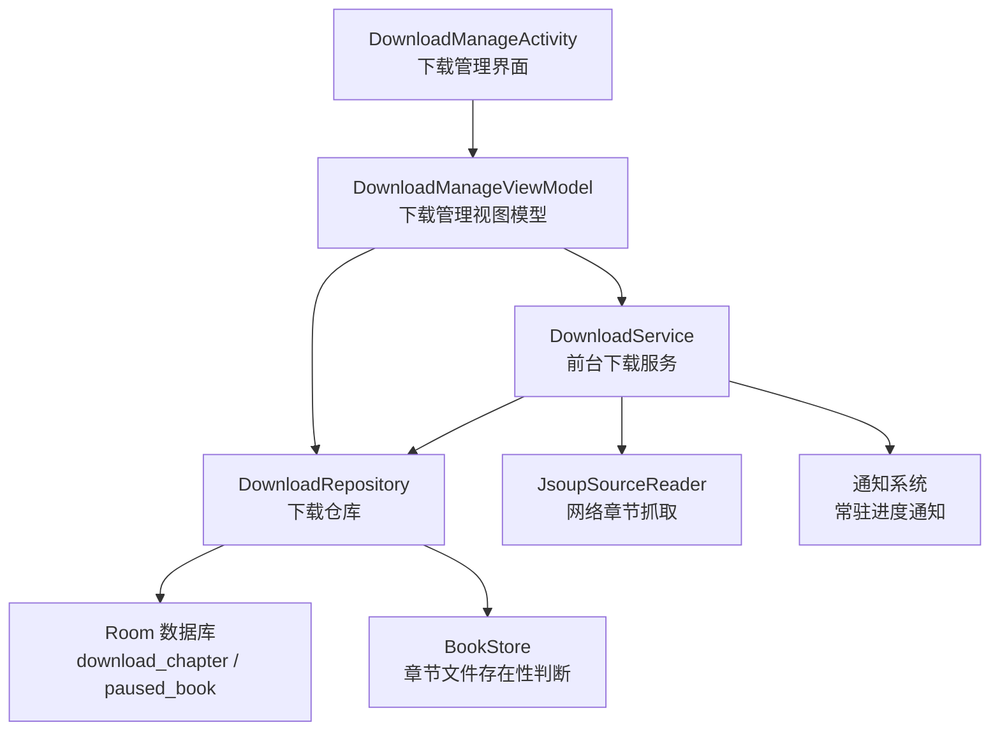
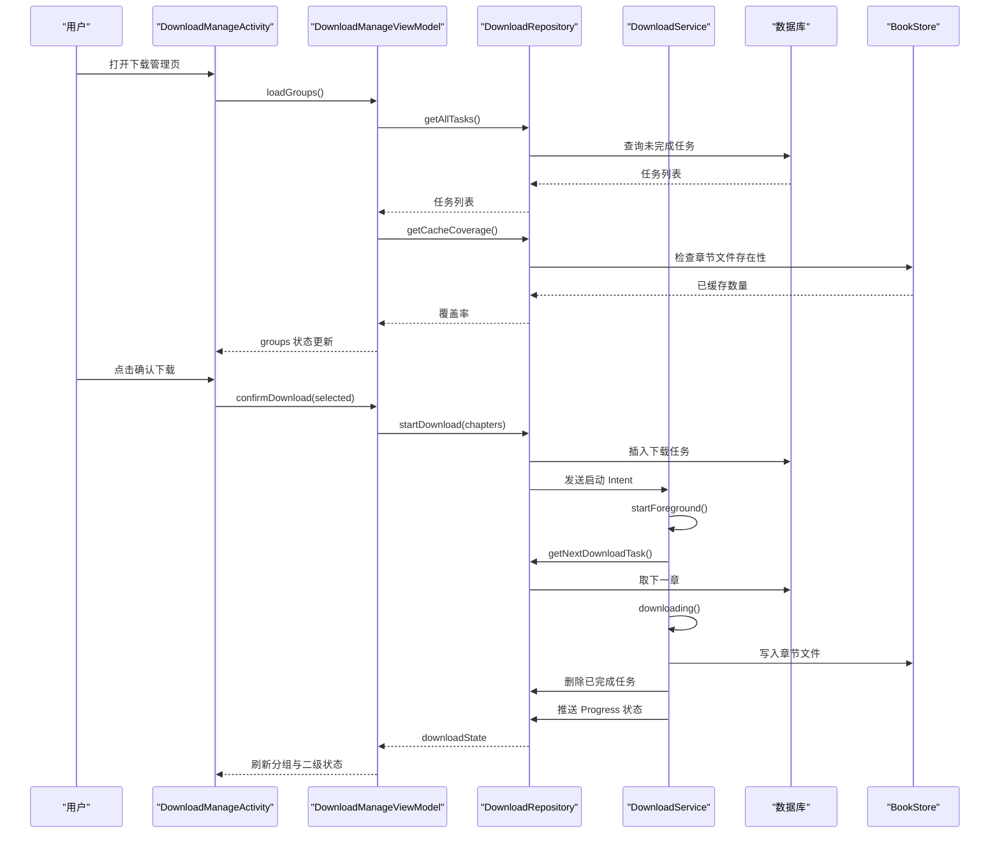
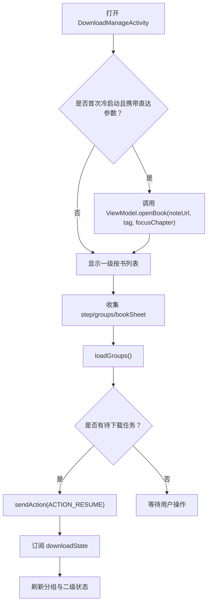
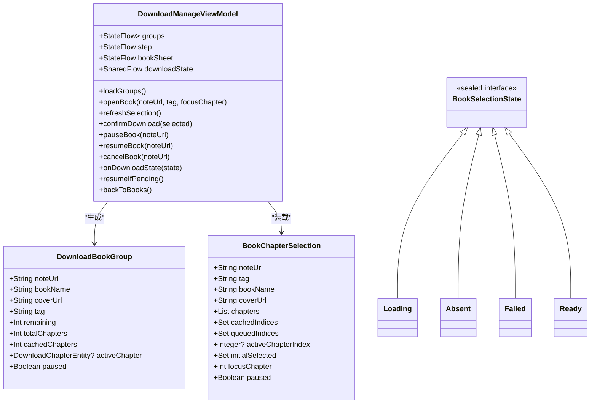
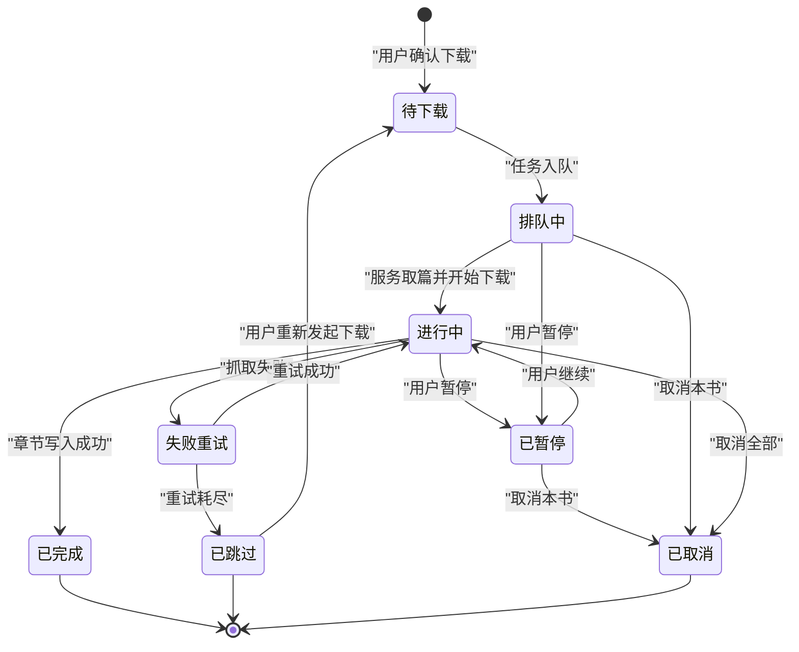
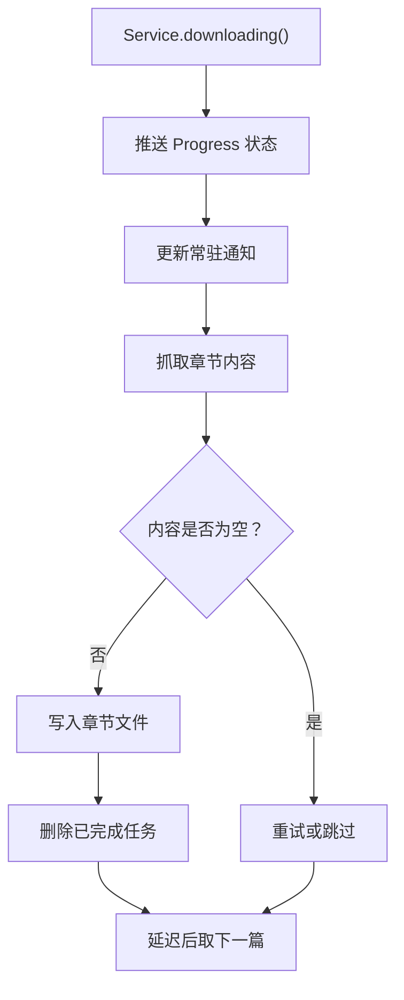
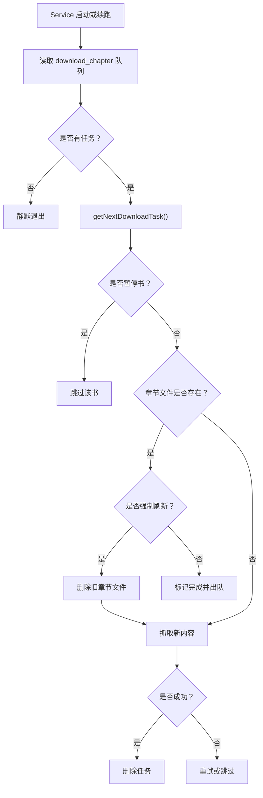
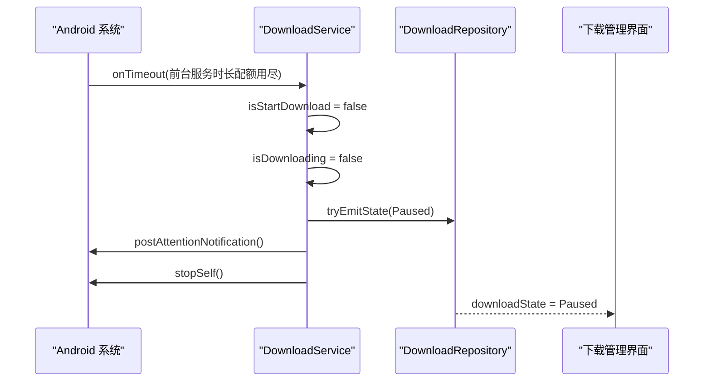
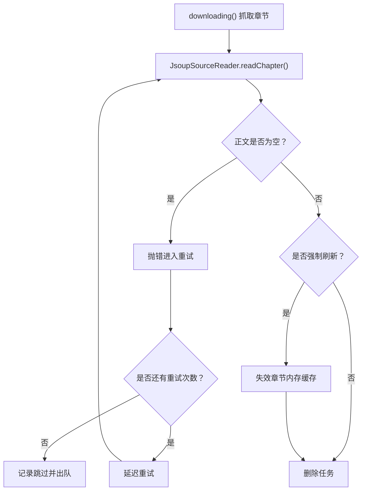
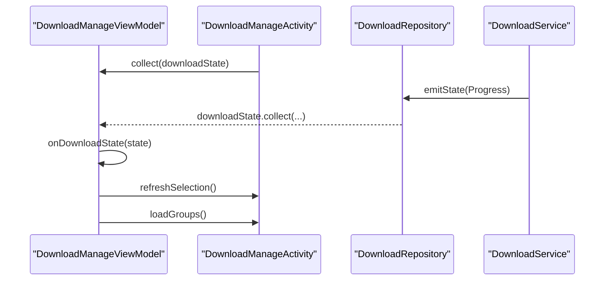

# 下载管理（DownloadManageActivity）

<cite>
**本文引用的文件**   
- [module_book/src/main/java/com/ebook/book/DownloadManageActivity.kt](file://module_book/src/main/java/com/ebook/book/DownloadManageActivity.kt)
- [module_book/src/main/java/com/ebook/book/mvvm/viewmodel/DownloadManageViewModel.kt](file://module_book/src/main/java/com/ebook/book/mvvm/viewmodel/DownloadManageViewModel.kt)
- [module_book/src/main/java/com/ebook/book/repository/DownloadRepository.kt](file://module_book/src/main/java/com/ebook/book/repository/DownloadRepository.kt)
- [module_book/src/main/java/com/ebook/book/service/DownloadService.kt](file://module_book/src/main/java/com/ebook/book/service/DownloadService.kt)
</cite>

## 目录
1. [简介](#简介)
2. [项目结构与职责边界](#项目结构与职责边界)
3. [核心组件总览](#核心组件总览)
4. [架构与数据流](#架构与数据流)
5. [详细组件分析](#详细组件分析)
6. [下载任务生命周期](#下载任务生命周期)
7. [队列管理与进度监控](#队列管理与进度监控)
8. [断点续传与持久化恢复](#断点续传与持久化恢复)
9. [后台服务运行机制与系统兼容性](#后台服务运行机制与系统兼容性)
10. [错误处理与重试策略](#错误处理与重试策略)
11. [用户界面响应式更新](#用户界面响应式更新)
12. [可配置项与性能注意事项](#可配置项与性能注意事项)
13. [故障排查指南](#故障排查指南)
14. [结论](#结论)

## 简介
`DownloadManageActivity` 是电子书应用的“下载管理”主界面，负责展示按书分组的下载任务、进入二级章节选择页、触发下载控制动作，并观察前台服务推送的下载状态。它本身不直接抓取网络或写入文件；真正的下载逻辑由 `DownloadService` 在 Android 前台服务中执行，而任务状态、暂停标记、缓存覆盖率等数据通过 `DownloadRepository` 访问数据库和文件系统。

该界面的设计目标是：
- 只负责“展示 + 导航 + 控制动作入口”。
- 用两级页面表达“按书任务列表”和“某本书的章节选择”。
- 把下载进度、暂停态、活跃章节等实时状态交给 ViewModel 和仓库层处理。
- 与通知系统和前台服务保持松耦合，即使用户关闭页面，下载仍可继续。

## 项目结构与职责边界
围绕下载管理的代码分布在四个关键文件中：

| 文件 | 角色 | 主要职责 |
|---|---|---|
| `DownloadManageActivity` | 活动与 UI 壳层 | 初始化直达参数、申请通知权限、组装两级 Compose 界面、绑定 ViewModel 回调 |
| `DownloadManageViewModel` | MVVM 视图模型 | 分组聚合、二级选章装载、下载状态观察、发送开始/暂停/取消/确认下载等动作 |
| `DownloadRepository` | 数据仓库 | 下载任务增删查、暂停标记、缓存覆盖率、下载事件通道、启动服务信号 |
| `DownloadService` | 前台下载服务 | 逐章抓取正文、写入本地章节文件、维护下载队列、更新通知、处理超时与重试 |

**图表来源**
- [module_book/src/main/java/com/ebook/book/DownloadManageActivity.kt:1-200](file://module_book/src/main/java/com/ebook/book/DownloadManageActivity.kt#L1-L200)
- [module_book/src/main/java/com/ebook/book/mvvm/viewmodel/DownloadManageViewModel.kt:1-200](file://module_book/src/main/java/com/ebook/book/mvvm/viewmodel/DownloadManageViewModel.kt#L1-L200)
- [module_book/src/main/java/com/ebook/book/repository/DownloadRepository.kt:1-200](file://module_book/src/main/java/com/ebook/book/repository/DownloadRepository.kt#L1-L200)
- [module_book/src/main/java/com/ebook/book/service/DownloadService.kt:1-200](file://module_book/src/main/java/com/ebook/book/service/DownloadService.kt#L1-L200)

**章节来源**
- [module_book/src/main/java/com/ebook/book/DownloadManageActivity.kt:1-200](file://module_book/src/main/java/com/ebook/book/DownloadManageActivity.kt#L1-L200)
- [module_book/src/main/java/com/ebook/book/mvvm/viewmodel/DownloadManageViewModel.kt:1-200](file://module_book/src/main/java/com/ebook/book/mvvm/viewmodel/DownloadManageViewModel.kt#L1-L200)
- [module_book/src/main/java/com/ebook/book/repository/DownloadRepository.kt:1-200](file://module_book/src/main/java/com/ebook/book/repository/DownloadRepository.kt#L1-L200)
- [module_book/src/main/java/com/ebook/book/service/DownloadService.kt:1-200](file://module_book/src/main/java/com/ebook/book/service/DownloadService.kt#L1-L200)

## 核心组件总览

### DownloadManageActivity
- 继承通用 MVVM Activity，并通过 Hilt 注入 `DownloadManageViewModel`。
- 使用路由常量打开，标题来自字符串资源。
- 支持从阅读器“直达”某个书的下载选择页：当首次冷启动且携带直达参数时，立即调用 ViewModel 打开对应书籍，避免一级列表闪帧。
- 提供通知权限请求方法，但明确说明“通知权限不是下载前置门槛”，无论授予与否都会继续后续流程。

### DownloadManageViewModel
- 暴露三个核心 StateFlow：
  - `groups`：按书分组的任务列表，包含剩余章节数、全书总章节数、已缓存章节数、当前活跃章节、是否暂停。
  - `step`：当前页面步骤，分为“一级按书列表”和“二级某书选章”。
  - `bookSheet`：二级选章装载结果，包括加载中、不在架、失败、就绪四种状态。
- 负责：
  - 加载并按书分组任务。
  - 观察服务状态流，标记当前正在下载的章节。
  - 发送开始、暂停、继续、取消、确认下载等动作。
  - 管理二级页面的章节预勾选逻辑。

### DownloadRepository
- 作为 Singleton，被 ViewModel 和 Service 共享。
- 提供下载任务 CRUD、暂停标记、缓存覆盖率、任务计数、状态事件通道。
- 将“控制动作”从仓库层解耦：不再经 SharedFlow 下发命令，而是让 UI 通过 Intent 直接启动/控制 `DownloadService`。

### DownloadService
- 前台下载服务，通过 Intent 通信，不使用 Binder。
- 负责：
  - 前台通知初始化。
  - 接收开始、暂停、取消动作。
  - 查找下一个待下载章节。
  - 抓取网络章节内容并写入本地文件。
  - 重试机制与失败出队。
  - 处理 Android 15 前台服务时长配额超时。
  - 清理孤儿任务和暂停标记。

**章节来源**
- [module_book/src/main/java/com/ebook/book/DownloadManageActivity.kt:1-200](file://module_book/src/main/java/com/ebook/book/DownloadManageActivity.kt#L1-L200)
- [module_book/src/main/java/com/ebook/book/mvvm/viewmodel/DownloadManageViewModel.kt:1-200](file://module_book/src/main/java/com/ebook/book/mvvm/viewmodel/DownloadManageViewModel.kt#L1-L200)
- [module_book/src/main/java/com/ebook/book/repository/DownloadRepository.kt:1-200](file://module_book/src/main/java/com/ebook/book/repository/DownloadRepository.kt#L1-L200)
- [module_book/src/main/java/com/ebook/book/service/DownloadService.kt:1-200](file://module_book/src/main/java/com/ebook/book/service/DownloadService.kt#L1-L200)

## 架构与数据流

**图表来源**
- [module_book/src/main/java/com/ebook/book/DownloadManageActivity.kt:201-528](file://module_book/src/main/java/com/ebook/book/DownloadManageActivity.kt#L201-L528)
- [module_book/src/main/java/com/ebook/book/mvvm/viewmodel/DownloadManageViewModel.kt:201-430](file://module_book/src/main/java/com/ebook/book/mvvm/viewmodel/DownloadManageViewModel.kt#L201-L430)
- [module_book/src/main/java/com/ebook/book/repository/DownloadRepository.kt:201-311](file://module_book/src/main/java/com/ebook/book/repository/DownloadRepository.kt#L201-L311)
- [module_book/src/main/java/com/ebook/book/service/DownloadService.kt:201-491](file://module_book/src/main/java/com/ebook/book/service/DownloadService.kt#L201-L491)

## 详细组件分析

### DownloadManageActivity：下载管理界面壳层
`DownloadManageActivity` 的核心不是布局细节，而是“界面如何与 ViewModel 协作”：

1. **路由与标题**  
   通过路由常量进入，设置工具栏标题。

2. **阅读器直达逻辑**  
   如果首次冷启动且 intent 携带直达参数，则立即调用 ViewModel 打开对应书籍，使二级选章页成为首帧目标，避免先显示一级列表再跳转。

3. **通知权限请求**  
   使用第三方权限库请求 `POST_NOTIFICATIONS`，但回调无论成功失败都继续执行后续逻辑。注释明确指出：通知只是进度展示渠道，不应成为下载前置条件。

4. **两级页面编排**  
   Activity 的 Compose 内容委托给 `DownloadCenterScreen`，后者负责：
   - 收集 ViewModel 的 `step`、`groups`、`bookSheet`。
   - 在首次 `LaunchedEffect` 中加载分组、尝试自动续跑。
   - 订阅 `downloadState`，根据 Progress/Paused/Finished 刷新二级状态和一级分组。
   - 封装通知权限、确认下载、暂停、继续、取消、返回等操作。

5. **直达态返回语义**  
   从阅读器直达时，二级页面返回应直接结束 Activity，而不是回退到一级列表；显式导航取消某本书后，会清空直达标记，恢复常规返回栈语义。

**图表来源**
- [module_book/src/main/java/com/ebook/book/DownloadManageActivity.kt:1-200](file://module_book/src/main/java/com/ebook/book/DownloadManageActivity.kt#L1-L200)
- [module_book/src/main/java/com/ebook/book/DownloadManageActivity.kt:201-528](file://module_book/src/main/java/com/ebook/book/DownloadManageActivity.kt#L201-L528)

**章节来源**
- [module_book/src/main/java/com/ebook/book/DownloadManageActivity.kt:1-200](file://module_book/src/main/java/com/ebook/book/DownloadManageActivity.kt#L1-L200)
- [module_book/src/main/java/com/ebook/book/DownloadManageActivity.kt:201-528](file://module_book/src/main/java/com/ebook/book/DownloadManageActivity.kt#L201-L528)

### DownloadManageViewModel：下载管理视图模型
ViewModel 承担“页面状态 + 动作转发 + 数据聚合”的职责：

| 能力 | 实现方式 |
|---|---|
| 按书分组任务 | 读取全部任务，按 `noteUrl` 分组，叠加缓存覆盖率 |
| 当前活跃章节 | 观察 `DownloadState.Progress.chapter.durChapterUrl` |
| 页面步骤切换 | `Books` 与 `PickBook` 两种状态 |
| 二级选章装载 | 书架信息、章节目录、已缓存索引、排队索引、初始预勾选 |
| 下载控制 | 发送 `ACTION_RESUME` / `ACTION_PAUSE` / `ACTION_CANCEL` |
| 确认下载 | 去重排队任务、解除暂停、构建任务、调用仓库下发 |

#### 两个重要进度口径
ViewModel 明确区分：
- **队列剩余**：`download_chapter` 表中这本书还没下完的章数。
- **全书缓存覆盖率**：已缓存章节数除以总章节数，反映“全书可离线比例”。

二者不能混为一谈：前者随批次增减，后者单调增长。

**图表来源**
- [module_book/src/main/java/com/ebook/book/mvvm/viewmodel/DownloadManageViewModel.kt:1-200](file://module_book/src/main/java/com/ebook/book/mvvm/viewmodel/DownloadManageViewModel.kt#L1-L200)
- [module_book/src/main/java/com/ebook/book/mvvm/viewmodel/DownloadManageViewModel.kt:201-430](file://module_book/src/main/java/com/ebook/book/mvvm/viewmodel/DownloadManageViewModel.kt#L201-L430)

**章节来源**
- [module_book/src/main/java/com/ebook/book/mvvm/viewmodel/DownloadManageViewModel.kt:1-200](file://module_book/src/main/java/com/ebook/book/mvvm/viewmodel/DownloadManageViewModel.kt#L1-L200)
- [module_book/src/main/java/com/ebook/book/mvvm/viewmodel/DownloadManageViewModel.kt:201-430](file://module_book/src/main/java/com/ebook/book/mvvm/viewmodel/DownloadManageViewModel.kt#L201-L430)

### DownloadRepository：下载数据仓库
仓库是 ViewModel 的 Model，也是 Service 的数据入口：

| 接口 | 作用 |
|---|---|
| `getNextDownloadTask()` | 按书架顺序取下一本非本地、非暂停书的第一个待下载章节 |
| `findLatestDownloadTask()` | 取书架上最近一个待下载章节，用于判断是否需要自动续跑 |
| `pauseBook()` | 插入暂停标记 |
| `resumeBook()` | 删除暂停标记 |
| `getPausedBooks()` | 获取所有暂停书 |
| `addTasks()` | 去重插入下载任务 |
| `deleteTask()` | 删除单个任务 |
| `clearAllTasks()` | 清空全部任务及暂停标记 |
| `deleteTasksForBook()` | 删除某书任务并清除其暂停标记 |
| `deleteTasksOutsideShelf()` | 清理孤儿任务行 |
| `getCacheCoverage()` | 计算全书缓存覆盖率 |
| `startDownload()` | 先入库，再拉起前台服务 |
| `tryEmitState()` | 非挂起发射状态，用于服务收尾路径 |

**章节来源**
- [module_book/src/main/java/com/ebook/book/repository/DownloadRepository.kt:1-200](file://module_book/src/main/java/com/ebook/book/repository/DownloadRepository.kt#L1-L200)
- [module_book/src/main/java/com/ebook/book/repository/DownloadRepository.kt:201-311](file://module_book/src/main/java/com/ebook/book/repository/DownloadRepository.kt#L201-L311)

### DownloadService：前台下载服务
服务是下载能力的真正执行者：

| 能力 | 实现要点 |
|---|---|
| 前台通知 | 创建通知通道、常驻通知、进度通知、完成通知 |
| 控制动作 | 通过 Intent action 处理暂停、继续、取消 |
| 任务调度 | `toDownload()` → `findNextDownloadChapter()` → `downloading()` |
| 章节抓取 | 使用 `JsoupSourceReader` 读取网络章节，写入本地文件 |
| 断点续传 | 已有章节跳过，强制刷新时先删旧章节文件 |
| 重试机制 | 每章最多重试固定次数，耗尽后出队并记录跳过数 |
| 超时保护 | Android 15 前台服务时长配额用尽时停止下载并保留任务 |
| 状态回传 | 通过 `DownloadRepository.downloadState` 推送 Progress/Paused/Finished |

**章节来源**
- [module_book/src/main/java/com/ebook/book/service/DownloadService.kt:1-200](file://module_book/src/main/java/com/ebook/book/service/DownloadService.kt#L1-L200)
- [module_book/src/main/java/com/ebook/book/service/DownloadService.kt:201-491](file://module_book/src/main/java/com/ebook/book/service/DownloadService.kt#L201-L491)

## 下载任务生命周期
下载任务的生命周期贯穿“用户操作 → ViewModel → Repository → Service → 数据库 → 文件系统 → UI 反馈”：

**图表来源**
- [module_book/src/main/java/com/ebook/book/mvvm/viewmodel/DownloadManageViewModel.kt:201-430](file://module_book/src/main/java/com/ebook/book/mvvm/viewmodel/DownloadManageViewModel.kt#L201-L430)
- [module_book/src/main/java/com/ebook/book/repository/DownloadRepository.kt:1-200](file://module_book/src/main/java/com/ebook/book/repository/DownloadRepository.kt#L1-L200)
- [module_book/src/main/java/com/ebook/book/service/DownloadService.kt:201-491](file://module_book/src/main/java/com/ebook/book/service/DownloadService.kt#L201-L491)

### 任务创建
- 用户在二级选章页勾选章节。
- ViewModel 剔除已在队列中的章节，避免重复下载。
- 若该书处于暂停状态，先解除暂停。
- 乐观更新 UI 的“排队中”集合。
- 调用 `DownloadRepository.startDownload()`，先入库再拉服务。

### 任务暂停
- 暂停是“书级队列策略”，不是中断当前网络请求。
- 暂停标记写入 `paused_book` 表。
- Service 取篇时跳过暂停书。
- 一级列表显示“已暂停”胶囊，二级页面主操作变为“继续下载”。

### 任务恢复
- 删除暂停标记。
- 发送 `ACTION_RESUME`。
- 如果服务已死，Intent 会通过系统前台服务机制拉起。
- 服务再次取篇时，轮到该书就继续下载。

### 任务删除
- “取消本书”删除该书的所有待下载任务。
- 同时删除该书的暂停标记，避免残留标记导致下次排队静默不跑。
- 注意：正在进行的网络请求不会被立刻打断，但该任务完成后不会重新入库。

**章节来源**
- [module_book/src/main/java/com/ebook/book/mvvm/viewmodel/DownloadManageViewModel.kt:201-430](file://module_book/src/main/java/com/ebook/book/mvvm/viewmodel/DownloadManageViewModel.kt#L201-L430)
- [module_book/src/main/java/com/ebook/book/repository/DownloadRepository.kt:1-200](file://module_book/src/main/java/com/ebook/book/repository/DownloadRepository.kt#L1-L200)
- [module_book/src/main/java/com/ebook/book/service/DownloadService.kt:201-491](file://module_book/src/main/java/com/ebook/book/service/DownloadService.kt#L201-L491)

## 队列管理与进度监控

### 队列管理
队列事实源是 `download_chapter` 表，而不是 Intent 或内存对象。这样设计解决了几个问题：
- 服务被回收后，任务不会丢失。
- START_STICKY 重启后，服务可以重新读库续跑。
- 避免了大体积章节列表通过 Intent 传输导致的 TransactionTooLargeException。

取篇顺序遵循：
1. 遍历书架。
2. 排除本地书。
3. 排除暂停书。
4. 取该书第一个待下载章节。

### 进度监控
- Service 每抓一章前，调用 `isProgress()` 推送 `DownloadState.Progress`。
- ViewModel 记录当前活跃章节 URL。
- Activity 收到 Progress 后刷新二级选章状态和一级分组。
- 常驻通知同步更新书名、章节名、剩余量、暂停态。

**图表来源**
- [module_book/src/main/java/com/ebook/book/service/DownloadService.kt:201-491](file://module_book/src/main/java/com/ebook/book/service/DownloadService.kt#L201-L491)
- [module_book/src/main/java/com/ebook/book/repository/DownloadRepository.kt:201-311](file://module_book/src/main/java/com/ebook/book/repository/DownloadRepository.kt#L201-L311)

**章节来源**
- [module_book/src/main/java/com/ebook/book/service/DownloadService.kt:201-491](file://module_book/src/main/java/com/ebook/book/service/DownloadService.kt#L201-L491)
- [module_book/src/main/java/com/ebook/book/repository/DownloadRepository.kt:201-311](file://module_book/src/main/java/com/ebook/book/repository/DownloadRepository.kt#L201-L311)

## 断点续传与持久化恢复

### 断点续传机制
断点续传不是靠“下载进度百分比”恢复，而是靠“章节文件是否存在”：

- 如果章节文件已存在且未强制刷新，直接视为完成并出队。
- 如果强制刷新，先删除旧章节文件，再重新抓取。
- 抓取成功后删除任务，表示该章已完成。
- 抓取失败进入重试循环。
- 重试耗尽后只出队，不做“永久失败”标记，用户可重新下载。

### 持久化恢复
- 任务持久化在 `download_chapter` 表。
- 暂停标记持久化在 `paused_book` 表。
- 缓存覆盖率基于 `BookStore.hasChapter()` 判断章节文件是否存在。
- 服务启动时：
  - 如果是空载信号，读库取篇。
  - 如果有任务，开始下载。
  - 如果没有任务，静默退出。
- 前台服务不可用时，不反复空转，而是停服并提示用户稍后再试。

**图表来源**
- [module_book/src/main/java/com/ebook/book/service/DownloadService.kt:201-491](file://module_book/src/main/java/com/ebook/book/service/DownloadService.kt#L201-L491)
- [module_book/src/main/java/com/ebook/book/repository/DownloadRepository.kt:201-311](file://module_book/src/main/java/com/ebook/book/repository/DownloadRepository.kt#L201-L311)

**章节来源**
- [module_book/src/main/java/com/ebook/book/service/DownloadService.kt:201-491](file://module_book/src/main/java/com/ebook/book/service/DownloadService.kt#L201-L491)
- [module_book/src/main/java/com/ebook/book/repository/DownloadRepository.kt:201-311](file://module_book/src/main/java/com/ebook/book/repository/DownloadRepository.kt#L201-L311)

## 后台服务运行机制与系统兼容性

### 前台服务契约
- 服务通过 Intent 通信，`onBind` 返回 null。
- 控制动作包括：
  - `ACTION_PAUSE`：暂停下载。
  - `ACTION_RESUME`：继续或开始下载。
  - `ACTION_CANCEL`：清空队列并收尾。
- 启动 Intent 是空载信号，任务来源统一为数据库。

### 前台通知
- 使用两条通知通道：
  - 进行中和暂停通知走低重要性通道，不弹横幅。
  - 完成通知走默认重要性通道，值得弹一次。
- 常驻通知 ID 固定，避免与结果通知混淆。

### Android 15 前台服务时长配额
- Android 15 引入前台服务时长配额：dataSync 类型前台服务在任意 24 小时内累计运行不超过 6 小时。
- 超长下载容易触发配额限制。
- 触发时，系统先摘掉前台态，再回调 `onTimeout`。
- 服务在 `onTimeout` 中：
  - 停止下载。
  - 保留任务。
  - 推送暂停状态。
  - 发布提示通知。
  - 停止自身。

**图表来源**
- [module_book/src/main/java/com/ebook/book/service/DownloadService.kt:1-200](file://module_book/src/main/java/com/ebook/book/service/DownloadService.kt#L1-L200)

**章节来源**
- [module_book/src/main/java/com/ebook/book/service/DownloadService.kt:1-200](file://module_book/src/main/java/com/ebook/book/service/DownloadService.kt#L1-L200)

## 错误处理与重试策略

### 章节抓取失败
- 每章最多重试固定次数。
- 重试之间加入延迟，避开瞬时限流或网络抖动。
- 捕获 `CancellationException` 时直接抛出，避免把取消误记为普通失败。
- 重试耗尽后：
  - 记录跳过数。
  - 删除任务。
  - 继续处理下一篇。
  - 收尾时提示用户有 N 章因失败被跳过。

### 空正文失败
- 如果站点返回 HTTP 200 但内容为空壳页，解析为空正文。
- 主动抛错，走重试失败通道。
- 避免“任务已删除但本地无内容”的空白章节。

### 书源失效
- 书源缺失时，异常与普通抓取失败走同一通道。
- 不把“书源失效”做成永久失败态，否则队头会被永远占用。
- 用户重新导入书源后可再次发起下载。

### 取消与清空队列
- 取消时先同步发射 Finished，让用户界面立刻知道任务已结束。
- 然后异步清空队列。
- 清队失败不影响停服，但会记录日志。

**图表来源**
- [module_book/src/main/java/com/ebook/book/service/DownloadService.kt:201-491](file://module_book/src/main/java/com/ebook/book/service/DownloadService.kt#L201-L491)

**章节来源**
- [module_book/src/main/java/com/ebook/book/service/DownloadService.kt:201-491](file://module_book/src/main/java/com/ebook/book/service/DownloadService.kt#L201-L491)

## 用户界面响应式更新

### 一级列表更新
- 打开页面时调用 `loadGroups()`。
- 收到 `DownloadState.Progress` 时刷新二级选章状态和一级分组。
- 收到 `DownloadState.Paused` 或 `DownloadState.Finished` 时也刷新，确保“正在下载”徽章和元信息口径一致。

### 二级选章更新
- 每次进度推进时调用 `refreshSelection()`。
- 合并三类事实：
  - 章节目录。
  - 已缓存章节。
  - 排队章节。
- 预勾选逻辑沿用“当前章 + 一定范围内未缓存且未排队的章节”这一交互习惯。

### 直达态与返回语义
- 从阅读器直达时，二级返回直接结束 Activity。
- 从一级列表进入时，二级返回回到一级列表。
- 取消某本书后清空直达标记，恢复常规返回语义。

**图表来源**
- [module_book/src/main/java/com/ebook/book/DownloadManageActivity.kt:201-528](file://module_book/src/main/java/com/ebook/book/DownloadManageActivity.kt#L201-L528)
- [module_book/src/main/java/com/ebook/book/mvvm/viewmodel/DownloadManageViewModel.kt:201-430](file://module_book/src/main/java/com/ebook/book/mvvm/viewmodel/DownloadManageViewModel.kt#L201-L430)

**章节来源**
- [module_book/src/main/java/com/ebook/book/DownloadManageActivity.kt:201-528](file://module_book/src/main/java/com/ebook/book/DownloadManageActivity.kt#L201-L528)
- [module_book/src/main/java/com/ebook/book/mvvm/viewmodel/DownloadManageViewModel.kt:201-430](file://module_book/src/main/java/com/ebook/book/mvvm/viewmodel/DownloadManageViewModel.kt#L201-L430)

## 可配置项与性能注意事项

### 当前实现中的关键配置点
| 配置点 | 含义 | 影响 |
|---|---|---|
| 重试次数 | 每章最大重试次数 | 决定网络抖动时的容错能力 |
| 重试延迟 | 重试前的等待时间 | 避免频繁触发限流 |
| 章节间隔 | 每章之间的延迟 | 降低瞬时并发压力 |
| 前台服务类型 | dataSync | 受 Android 15 时长配额限制 |
| 通知权限 | POST_NOTIFICATIONS | 仅影响进度展示，不影响下载本身 |
| 强制刷新 | forceRefresh | 重新抓取章节并失效内存缓存 |
| 暂停机制 | 书级暂停标记 | 保留任务但不参与取篇 |

### 性能与稳定性建议
- **不要无限重试**：已有重试上限，防止常驻通知永不消失。
- **失败必须出队**：否则队头任务会阻塞整本书的后续章节。
- **缓存一致性**：强制刷新后失效章节内存缓存，避免阅读器读到旧内容。
- **前台服务配额**：长时间下载可能触发 Android 15 配额限制，应允许用户稍后再继续。
- **通知权限降级**：即使通知权限被拒绝，也不应阻断下载功能。
- **孤儿任务清理**：书已从书架移除的任务应清理，但暂停书的任务必须保留。

[本节为通用性能指导，不直接分析具体代码行，因此不附加章节来源]

## 故障排查指南

### 现象：点击开始下载没有反应
可能原因：
- 前台服务启动被拒，例如 dataSync 配额用尽。
- 通知权限相关链路异常，但下载仍可能继续。
- 队列为空，Service 走到“无任务静默退出”分支。

排查建议：
- 检查是否已有待下载任务。
- 查看是否触发了“下载启动受限”提示。
- 确认 Service 是否被系统回收后重建。

**章节来源**
- [module_book/src/main/java/com/ebook/book/mvvm/viewmodel/DownloadManageViewModel.kt:201-430](file://module_book/src/main/java/com/ebook/book/mvvm/viewmodel/DownloadManageViewModel.kt#L201-L430)
- [module_book/src/main/java/com/ebook/book/repository/DownloadRepository.kt:201-311](file://module_book/src/main/java/com/ebook/book/repository/DownloadRepository.kt#L201-L311)
- [module_book/src/main/java/com/ebook/book/service/DownloadService.kt:1-200](file://module_book/src/main/java/com/ebook/book/service/DownloadService.kt#L1-L200)

### 现象：下载中途卡住，常驻通知不消失
可能原因：
- 章节抓取失败且重试耗尽后未正确出队。
- 书源失效导致队头任务永久阻塞。
- 前台服务超时但未及时停服。

排查建议：
- 检查 `download_chapter` 表中是否仍有失败任务。
- 确认失败任务是否被跳过并出队。
- 查看是否触发 `onTimeout`。

**章节来源**
- [module_book/src/main/java/com/ebook/book/service/DownloadService.kt:201-491](file://module_book/src/main/java/com/ebook/book/service/DownloadService.kt#L201-L491)

### 现象：暂停后任务不跑
可能原因：
- 该书仍处于暂停状态。
- 队列中只剩暂停书的任务。
- 任务属于本地书，不参与下载。

排查建议：
- 检查 `paused_book` 表。
- 确认该书是否从书架移除。
- 确认是否是本地书。

**章节来源**
- [module_book/src/main/java/com/ebook/book/repository/DownloadRepository.kt:1-200](file://module_book/src/main/java/com/ebook/book/repository/DownloadRepository.kt#L1-L200)
- [module_book/src/main/java/com/ebook/book/service/DownloadService.kt:201-491](file://module_book/src/main/java/com/ebook/book/service/DownloadService.kt#L201-L491)

### 现象：取消某本书后仍出现相同任务
可能原因：
- 取消时清空队列失败。
- 正在进行的网络请求完成后重新入库。

排查建议：
- 查看 Service 日志中“取消下载清空队列失败”的警告。
- 确认是否仍有正在进行中的章节抓取。

**章节来源**
- [module_book/src/main/java/com/ebook/book/service/DownloadService.kt:201-491](file://module_book/src/main/java/com/ebook/book/service/DownloadService.kt#L201-L491)

## 结论
`DownloadManageActivity` 并不是一个孤立的界面类，而是下载子系统的前端入口。它的价值在于把复杂的下载生命周期、队列管理、断点续传、前台服务、通知系统和数据库持久化，包装成用户可以理解的两级界面：

- 一级页面回答“还有哪些书在下载”。
- 二级页面回答“这本书还差哪些章节”。
- ViewModel 负责把服务状态、数据库事实和用户操作对齐。
- Repository 负责数据一致性和事务边界。
- Service 负责真正的网络抓取、文件写入和系统兼容。

从架构角度看，这个模块最值得关注的特性是：**控制动作走 Intent，状态数据走 SharedFlow，任务事实走数据库**。这种设计让下载功能既能在前台可见，也能在后台稳定运行，还能在进程重启后恢复。对于后续扩展，如果需要增加并发限制、速度控制或存储空间管理，应在 `DownloadRepository` 和 `DownloadService` 中新增协调器，而不是直接侵入 Activity 或 ViewModel。