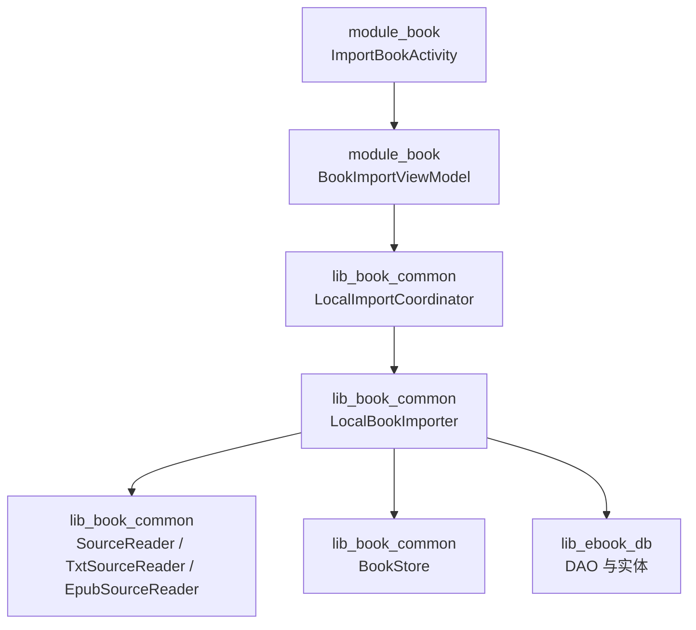
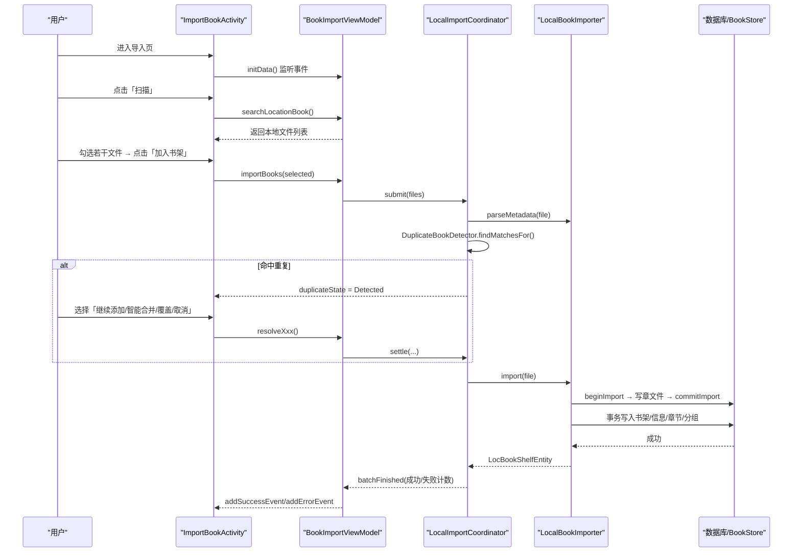
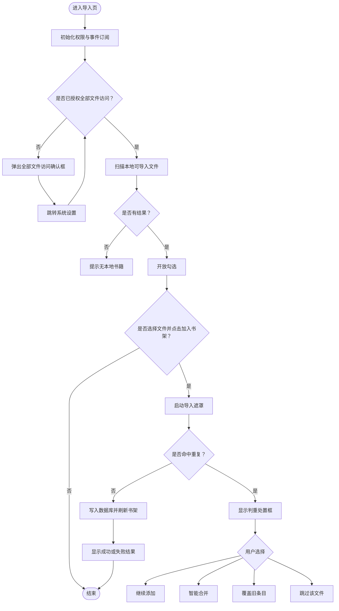
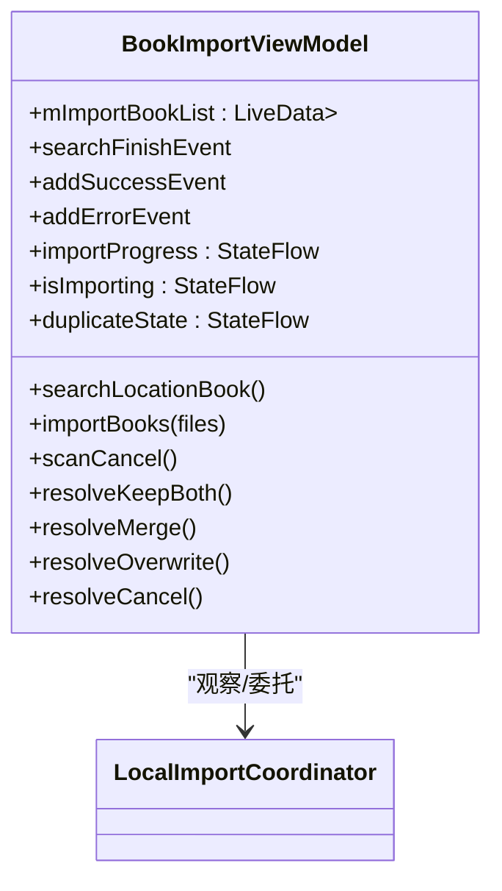
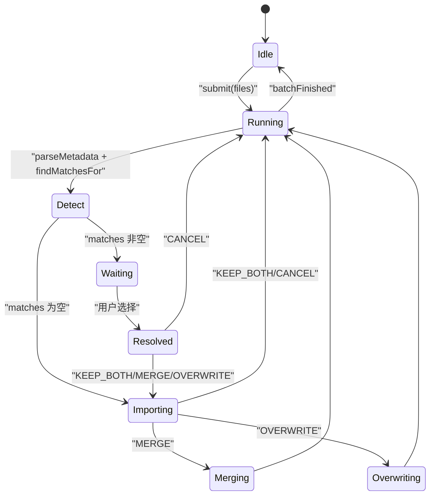
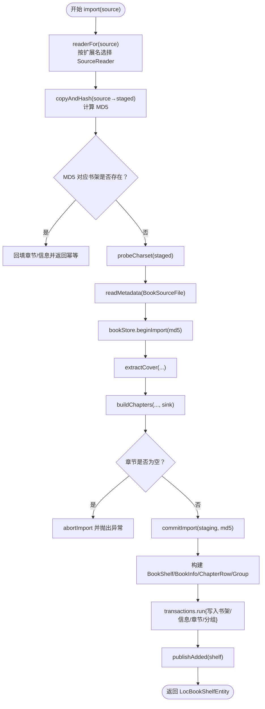
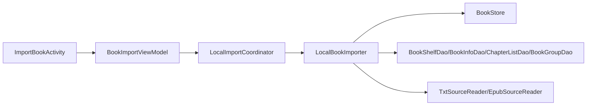

# 书籍导入 (ImportBookActivity)

<cite>
**本文引用的文件**   
- [ImportBookActivity.kt](file://module_book/src/main/java/com/ebook/book/ImportBookActivity.kt)
- [BookImportViewModel.kt](file://module_book/src/main/java/com/ebook/book/mvvm/viewmodel/BookImportViewModel.kt)
- [LocalBookImporter.kt](file://lib_book_common/src/main/java/com/ebook/common/importer/LocalBookImporter.kt)
- [LocalImportCoordinator.kt](file://lib_book_common/src/main/java/com/ebook/common/importer/LocalImportCoordinator.kt)
</cite>

## 目录
1. [简介](#简介)
2. [项目结构定位](#项目结构定位)
3. [核心组件](#核心组件)
4. [架构总览](#架构总览)
5. [详细组件分析](#详细组件分析)
6. [依赖关系分析](#依赖关系分析)
7. [性能与数据流特性](#性能与数据流特性)
8. [故障排查](#故障排查)
9. [结论](#结论)

## 简介
本文件聚焦 ImportBookActivity 的本地书籍导入能力，覆盖从 Android 存储权限、全部文件访问授权、本地 TXT/EPUB 扫描、用户勾选与进度反馈，到与 lib_book_common 中 LocalBookImporter、LocalImportCoordinator 的协作。文档重点说明：
- 本地 TXT 文件的导入流程：选择、编码检测、内容解析与章节切分。
- 用户界面交互：扫描状态、勾选、导入遮罩、失败弹窗、判重处置框。
- 与导入器的协作机制：LocalBookImporter 的单遍拷贝哈希、元数据解析、章节落盘与事务入库；LocalImportCoordinator 的进程级批量协调、重复检测门与合并/覆盖策略。
- 书籍元数据的自动提取与手动编辑入口。
- 导入完成后的数据处理：书架、信息表、分组、章节索引与正文引用。
- 扩展接口：如何支持更多本地文件格式。
- 常见问题与解决方案。

## 项目结构定位
ImportBookActivity 位于 module_book，负责 UI 与页面侧 ViewModel；真正的导入逻辑下沉到 lib_book_common，避免 UI 生命周期影响长任务。

图表来源
- [ImportBookActivity.kt:1-923](file://module_book/src/main/java/com/ebook/book/ImportBookActivity.kt#L1-L923)
- [BookImportViewModel.kt:1-192](file://module_book/src/main/java/com/ebook/book/mvvm/viewmodel/BookImportViewModel.kt#L1-L192)
- [LocalImportCoordinator.kt:1-308](file://lib_book_common/src/main/java/com/ebook/common/importer/LocalImportCoordinator.kt#L1-L308)
- [LocalBookImporter.kt:1-201](file://lib_book_common/src/main/java/com/ebook/common/importer/LocalBookImporter.kt#L1-L201)

章节来源
- [ImportBookActivity.kt:1-923](file://module_book/src/main/java/com/ebook/book/ImportBookActivity.kt#L1-L923)
- [BookImportViewModel.kt:1-192](file://module_book/src/main/java/com/ebook/book/mvvm/viewmodel/BookImportViewModel.kt#L1-L192)

## 核心组件
- ImportBookActivity：Compose 实现的导入页，处理权限、扫描列表、勾选、导入遮罩、错误提示与判重处置展示。
- BookImportViewModel：页面侧薄桥，转发 Coordinator 的状态与事件，封装本地文件扫描与取消逻辑。
- LocalImportCoordinator：进程级单例协调器，负责批量导入循环、重复检测门、合并/覆盖/共存策略以及“解析中”占位行。
- LocalBookImporter：本地书籍导入流水线，负责拷贝即哈希、格式探测、编码检测、元数据读取、封面提取、章节切分、事务化入库。

章节来源
- [ImportBookActivity.kt:1-923](file://module_book/src/main/java/com/ebook/book/ImportBookActivity.kt#L1-L923)
- [BookImportViewModel.kt:1-192](file://module_book/src/main/java/com/ebook/book/mvvm/viewmodel/BookImportViewModel.kt#L1-L192)
- [LocalImportCoordinator.kt:1-308](file://lib_book_common/src/main/java/com/ebook/common/importer/LocalImportCoordinator.kt#L1-L308)
- [LocalBookImporter.kt:1-201](file://lib_book_common/src/main/java/com/ebook/common/importer/LocalBookImporter.kt#L1-L201)

## 架构总览
导入流程分为三层：
- 表现层（ImportBookActivity + Compose）：权限引导、文件列表、勾选、导入遮罩、错误与判重对话框。
- 页面控制器（BookImportViewModel）：扫描本地可导入文件、把选中文件交给 Coordinator，并订阅进度与结果事件。
- 业务协调层（LocalImportCoordinator + LocalBookImporter）：批量推进、重复检测、合并/覆盖、事务写入数据库与章节目录。

图表来源
- [ImportBookActivity.kt:1-923](file://module_book/src/main/java/com/ebook/book/ImportBookActivity.kt#L1-L923)
- [BookImportViewModel.kt:1-192](file://module_book/src/main/java/com/ebook/book/mvvm/viewmodel/BookImportViewModel.kt#L1-L192)
- [LocalImportCoordinator.kt:1-308](file://lib_book_common/src/main/java/com/ebook/common/importer/LocalImportCoordinator.kt#L1-L308)
- [LocalBookImporter.kt:1-201](file://lib_book_common/src/main/java/com/ebook/common/importer/LocalBookImporter.kt#L1-L201)

## 详细组件分析

### ImportBookActivity：UI 与权限交互
- 权限处理：
  - Android 11 以下请求读写外部存储与通知权限。
  - Android 11+ 不再申请旧存储权限，改为引导「所有文件访问权限」设置页；若无法直达 per-app 设置则回退全量应用列表页。
- 扫描与列表：
  - 通过 viewModel.mImportBookList 镜像扫描结果；扫描结束若无结果给出空态提示。
  - 扫描中底部显示转圈与取消按钮；扫描完成后开放勾选。
- 导入交互：
  - 点击「加入书架」后调用 viewModel.importBooks(selected)，由进程级 Coordinator 接管。
  - 导入中显示 LoadingView 遮罩，文案随进度更新；若出现失败则弹出 AlertDialog。
- 判重处置：
  - 当检测到重复时，显示 DuplicateDispositionDialog，提供「继续添加」「智能合并」「覆盖」「取消」。
  - 「智能合并」仅在有本地匹配项时出现，因为补章需要本机章节载体。

图表来源
- [ImportBookActivity.kt:1-923](file://module_book/src/main/java/com/ebook/book/ImportBookActivity.kt#L1-L923)

章节来源
- [ImportBookActivity.kt:1-923](file://module_book/src/main/java/com/ebook/book/ImportBookActivity.kt#L1-L923)

### BookImportViewModel：页面侧薄桥与本地扫描
- 职责边界：
  - 不持有导入循环；只观察 Coordinator 的进度、判重状态、批次结果。
  - 负责本地文件扫描（按扩展名过滤 EPUB/TXT），并在扫描期间支持取消。
- 关键行为：
  - searchLocationBook：清空旧结果 → IO 线程遍历外部存储根目录 → 过滤 EPUB 与大于 100KB 的 TXT → 跳过 Android/data、Android/obb → 返回 File 列表。
  - importBooks：将选中文件提交给 LocalImportCoordinator.submit。
  - 合并/覆盖等处置回调直接委托给 Coordinator。

图表来源
- [BookImportViewModel.kt:1-192](file://module_book/src/main/java/com/ebook/book/mvvm/viewmodel/BookImportViewModel.kt#L1-L192)

章节来源
- [BookImportViewModel.kt:1-192](file://module_book/src/main/java/com/ebook/book/mvvm/viewmodel/BookImportViewModel.kt#L1-L192)

### LocalImportCoordinator：进程级导入协调器
- 作用域设计：
  - 使用自有 CoroutineScope(SupervisorJob + IO)，使导入批次的生命周期独立于任何页面；用户离开导入页也不会中断导入。
- 并发控制：
  - running 原子标志确保同一时刻只有一批导入运行；重复提交会被忽略。
- 重复检测门：
  - 用 AtomicReference<CompletableDeferred<DuplicateResolution>> 实现跨线程暂停/恢复；主线程取出决策并 complete，IO 线程 await。
- 进度与状态：
  - progress：running/done/total。
  - parsingBooks：以唯一 id 管理“解析中”占位行，避免同名书互相误删。
  - notices：语义化合并结果（追加章节数、等价、分叉、目标非本地、条目缺失）。
  - batchFinished：整批成功/失败计数。
- 处置策略：
  - KEEP_BOTH：同键两条目共存，评论取并集。
  - MERGE：新条目尾部多出的章节补进旧本地条目，新条目删除。
  - OVERWRITE：先吸收 book_group 键，再逐个删除旧条目。
  - CANCEL：跳过当前文件。

图表来源
- [LocalImportCoordinator.kt:1-308](file://lib_book_common/src/main/java/com/ebook/common/importer/LocalImportCoordinator.kt#L1-L308)

章节来源
- [LocalImportCoordinator.kt:1-308](file://lib_book_common/src/main/java/com/ebook/common/importer/LocalImportCoordinator.kt#L1-L308)

### LocalBookImporter：本地书籍导入流水线
- 核心步骤（spec §6）：
  1. 根据扩展名选择 SourceReader。
  2. 源文件只读一遍：copyAndHash 边拷贝边计算 MD5，得到稳定 noteUrl。
  3. 判重：若 MD5 对应的书架条目已存在，直接回填章节与信息并返回幂等结果。
  4. 编码探测与元数据读取：reader.probeCharset(source) → reader.readMetadata(BookSourceFile)。
  5. 封面提取：reader.extractCover(...)。
  6. 章节切分：reader.buildChapters(..., sink) 流式产出章节，写入暂存目录并按 bookId 生成 contentRef。
  7. 提交导入：bookStore.commitImport(staging, md5)。
  8. 事务写入：一次性插入书架、书籍信息、章节列表、分组。
  9. 发布新增事件：bookRepository.publishAdded(shelf)。
- 轻量解析：
  - parseMetadata 只做标题与作者解析，用于导入前判重与 UI 展示，不做章节切分与数据库写入。

图表来源
- [LocalBookImporter.kt:1-201](file://lib_book_common/src/main/java/com/ebook/common/importer/LocalBookImporter.kt#L1-L201)

章节来源
- [LocalBookImporter.kt:1-201](file://lib_book_common/src/main/java/com/ebook/common/importer/LocalBookImporter.kt#L1-L201)

### 本地 TXT 文件导入流程详解
- 文件选择：
  - BookImportViewModel.searchLocationBook 递归扫描外部存储根目录，筛选 EPUB 与大小大于 100KB 的 TXT 文件，跳过 Android/data 与 Android/obb。
  - ImportBookActivity 在扫描结束后允许勾选多个 TXT 文件。
- 编码检测：
  - LocalBookImporter.parseMetadata 与 import 均调用 SourceReader.probeCharset(source/staged)，对 TXT 进行编码探测。
- 内容解析与章节切分：
  - SourceReader 由 BookFormat 路由；TXT 由 TxtSourceReader 实现（属于 lib_book_common.analyze.local）。
  - buildChapters 流式产出章节，sink 将每章段落拼接为文本并写入 BookStore 暂存目录，同时返回 contentRef。
- 元数据自动提取：
  - readMetadata 提取书名与作者；默认作者常量用于显示。
- 手动编辑：
  - 导入成功后，书籍信息可通过 EditBookMetaActivity 进行后续编辑（模块内已有该 Activity，可在书架详情页触发）。

章节来源
- [BookImportViewModel.kt:80-170](file://module_book/src/main/java/com/ebook/book/mvvm/viewmodel/BookImportViewModel.kt#L80-L170)
- [LocalBookImporter.kt:1-201](file://lib_book_common/src/main/java/com/ebook/common/importer/LocalBookImporter.kt#L1-L201)

### 用户界面交互与反馈
- 权限提示：
  - Android 11+ 全部文件访问权限弹窗；确认后跳转到系统设置页；取消则退出导入页。
- 扫描状态：
  - 扫描中底部显示转圈与「取消扫描」；扫描完成显示共 X 本。
- 导入状态：
  - 导入中显示 LoadingView 遮罩，文案在“放入书架中...”与“导入中 X/Y”之间切换。
  - 判重处置框隐藏遮罩，避免遮挡对话框。
- 错误反馈：
  - 导入失败弹出 AlertDialog；整批收尾时根据成功/失败计数提示结果。
- 判重处置：
  - 列出所有命中条目，区分本地与网络来源；智能合并仅在有本地命中时出现；覆盖操作使用 error 色强调破坏性。

章节来源
- [ImportBookActivity.kt:1-923](file://module_book/src/main/java/com/ebook/book/ImportBookActivity.kt#L1-L923)

### 与 lib_book_common 的协作机制
- BookImportViewModel 仅作为薄桥，订阅 coordinator 的 StateFlow 与 SharedFlow，并将 UI 动作委托给 coordinator。
- LocalImportCoordinator 负责：
  - 批量推进导入循环。
  - 重复检测门与处置回调。
  - 解析中占位行的增删。
  - 合并/覆盖/共存的策略执行。
- LocalBookImporter 负责：
  - 格式探测、编码检测、元数据读取、封面提取、章节切分、事务写入数据库。
  - 幂等导入：相同 MD5 直接返回已有条目。

章节来源
- [BookImportViewModel.kt:1-192](file://module_book/src/main/java/com/ebook/book/mvvm/viewmodel/BookImportViewModel.kt#L1-L192)
- [LocalImportCoordinator.kt:1-308](file://lib_book_common/src/main/java/com/ebook/common/importer/LocalImportCoordinator.kt#L1-L308)
- [LocalBookImporter.kt:1-201](file://lib_book_common/src/main/java/com/ebook/common/importer/LocalBookImporter.kt#L1-L201)

### 书籍元数据自动提取与手动编辑
- 自动提取：
  - LocalBookImporter.parseMetadata 与 import 都依赖 SourceReader.readMetadata，提取 title 与 author。
  - 默认作者常量用于显示，不参与 comment_key 计算。
- 手动编辑：
  - 模块内提供 EditBookMetaActivity，可在导入成功后对书籍信息进行补充与修改。
  - 实际触发位置通常由书架详情页或书籍详情入口进入。

章节来源
- [LocalBookImporter.kt:120-180](file://lib_book_common/src/main/java/com/ebook/common/importer/LocalBookImporter.kt#L120-L180)
- [module_book/.../EditBookMetaActivity.kt](file://module_book/src/main/java/com/ebook/book/EditBookMetaActivity.kt)

### 导入完成后的数据处理
- 书架与书籍信息：
  - 创建 BookShelfEntity（noteUrl=MD5、tag=LOCAL_TAG、textCharset、finalDate）。
  - 创建 BookInfoEntity（name、author、coverUrl、origin/status/introduce 等字段）。
  - 创建 BookGroupEntity（commentKey 基于 name/author，isPrimary=true）。
- 章节组织：
  - ChapterEntry.toRow 生成 ChapterListEntity，包含 durChapterIndex、contentRef、durChapterName。
  - contentRef 指向 BookStore 中的章节文件路径。
- 发布事件：
  - bookRepository.publishAdded(shelf) 通知书架与相关观察者。

章节来源
- [LocalBookImporter.kt:60-140](file://lib_book_common/src/main/java/com/ebook/common/importer/LocalBookImporter.kt#L60-L140)

### 自定义配置与扩展接口
- 支持更多本地文件格式：
  - 扩展点：BookFormat.fromExtension 与 readers Map。
  - 新增格式需实现 SourceReader 接口，并提供 probeCharset、readMetadata、extractCover、buildChapters。
  - 在 AnalyzeModule 中注册新的 BookFormat → SourceReader 映射。
- 调整 TXT 过滤规则：
  - 在 BookImportViewModel.searchBook 中调整 ext 判断与文件大小阈值（当前 TXT > 100KB）。
- 自定义合并策略：
  - 在 LocalImportCoordinator.applyMerge 中扩展 mergeTailChapters 的分支逻辑或 notice 类型。
- 自定义导入流水线：
  - 继承或替换 LocalBookImporter，注入不同 BookStore、DAO 与 WriteTransactionRunner。

章节来源
- [BookImportViewModel.kt:120-170](file://module_book/src/main/java/com/ebook/book/mvvm/viewmodel/BookImportViewModel.kt#L120-L170)
- [LocalBookImporter.kt:150-201](file://lib_book_common/src/main/java/com/ebook/common/importer/LocalBookImporter.kt#L150-L201)
- [LocalImportCoordinator.kt:230-308](file://lib_book_common/src/main/java/com/ebook/common/importer/LocalImportCoordinator.kt#L230-L308)

## 依赖关系分析
- ImportBookActivity 依赖：
  - BaseMvvmActivity、Hilt 注入、Compose UI、PermissionX、协程。
- BookImportViewModel 依赖：
  - LocalImportCoordinator、协程 Flow、日志工具。
- LocalImportCoordinator 依赖：
  - LocalBookImporter、DuplicateBookDetector、BookRepository。
- LocalBookImporter 依赖：
  - BookStore、DAO（BookShelfDao/BookInfoDao/ChapterListDao/BookGroupDao）、WriteTransactionRunner、SourceReader 集合、DigestInputStream。

图表来源
- [ImportBookActivity.kt:1-923](file://module_book/src/main/java/com/ebook/book/ImportBookActivity.kt#L1-L923)
- [BookImportViewModel.kt:1-192](file://module_book/src/main/java/com/ebook/book/mvvm/viewmodel/BookImportViewModel.kt#L1-L192)
- [LocalImportCoordinator.kt:1-308](file://lib_book_common/src/main/java/com/ebook/common/importer/LocalImportCoordinator.kt#L1-L308)
- [LocalBookImporter.kt:1-201](file://lib_book_common/src/main/java/com/ebook/common/importer/LocalBookImporter.kt#L1-L201)

章节来源
- [ImportBookActivity.kt:1-923](file://module_book/src/main/java/com/ebook/book/ImportBookActivity.kt#L1-L923)
- [BookImportViewModel.kt:1-192](file://module_book/src/main/java/com/ebook/book/mvvm/viewmodel/BookImportViewModel.kt#L1-L192)
- [LocalImportCoordinator.kt:1-308](file://lib_book_common/src/main/java/com/ebook/common/importer/LocalImportCoordinator.kt#L1-L308)
- [LocalBookImporter.kt:1-201](file://lib_book_common/src/main/java/com/ebook/common/importer/LocalBookImporter.kt#L1-L201)

## 性能与数据流特性
- 单遍拷贝哈希：
  - copyAndHash 使用 DigestInputStream 一次流式拷贝并计算 MD5，避免旧实现多次全文件读取。
- 流式章节切分：
  - buildChapters 返回可迭代序列，sink 逐章写入暂存目录，减少内存峰值。
- 事务化写入：
  - transactions.run 一次性写入书架、信息、章节、分组，避免频繁提交导致的性能与一致性风险。
- 并发安全：
  - running 原子标志保证批次串行；duplicateGate 使用 AtomicReference 保证跨线程可见性与幂等消费。
- 进度与状态解耦：
  - Coordinator 持有进程级状态，Activity 销毁不影响导入；重新进入页面仍可看到仍在运行的批次。

[本节为通用性能讨论，不直接分析具体代码行]

## 故障排查
- 扫描不到本地书籍：
  - 检查是否授予 Android 11+ 的全部文件访问权限；未授权会直接进入设置页。
  - 确认文件扩展名为 epub 或 txt，且 TXT 大于 100KB。
  - 检查是否在 Android/data、Android/obb 下（被跳过）。
- 导入失败弹窗：
  - 可能原因：章节切分失败、严格解码失败、数据库写入失败；LocalBookImporter 会在失败时回滚暂存目录。
  - 查看 batchFinished 的成功/失败计数，定位具体失败文件。
- 重复检测卡住：
  - 检查 duplicateGate 是否被正确 complete；确保 UI 回调调用 resolveXxx。
- 智能合并不可用：
  - 当命中项全是网络书时，智能合并不出现；因为补章需要本地章节载体。
- 覆盖后评论丢失：
  - 覆盖前会先吸收 book_group 键；若仍丢失，检查 BookRepository.absorbGroupKeys 是否正确调用。

章节来源
- [ImportBookActivity.kt:1-923](file://module_book/src/main/java/com/ebook/book/ImportBookActivity.kt#L1-L923)
- [BookImportViewModel.kt:1-192](file://module_book/src/main/java/com/ebook/book/mvvm/viewmodel/BookImportViewModel.kt#L1-L192)
- [LocalImportCoordinator.kt:1-308](file://lib_book_common/src/main/java/com/ebook/common/importer/LocalImportCoordinator.kt#L1-L308)
- [LocalBookImporter.kt:1-201](file://lib_book_common/src/main/java/com/ebook/common/importer/LocalBookImporter.kt#L1-L201)

## 结论
ImportBookActivity 通过 Compose 实现了清晰的用户交互与权限引导，BookImportViewModel 作为薄桥将页面逻辑与长任务解耦，LocalImportCoordinator 与 LocalBookImporter 在 lib_book_common 中提供了稳定、高性能、可扩展的本地书籍导入流水线。对于本地 TXT 文件，系统完成了从文件选择、编码检测、元数据解析、章节切分到事务入库的全链路处理；同时提供判重处置、进度反馈与错误提示，帮助开发者快速扩展更多格式并优化用户体验。

[本节为总结性内容，不直接分析具体代码行]