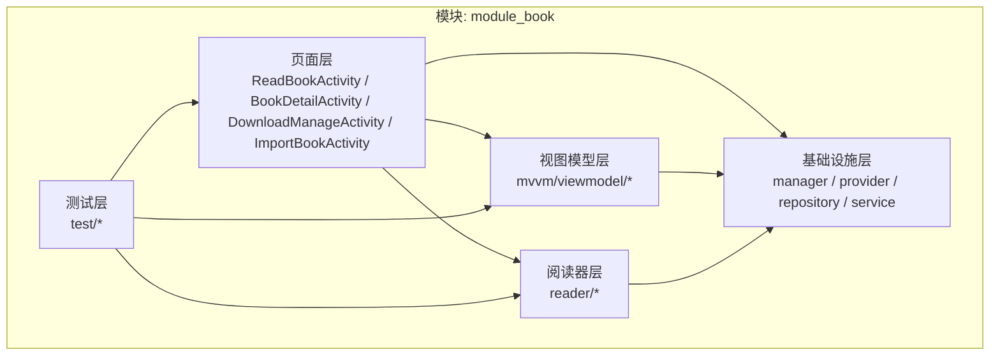
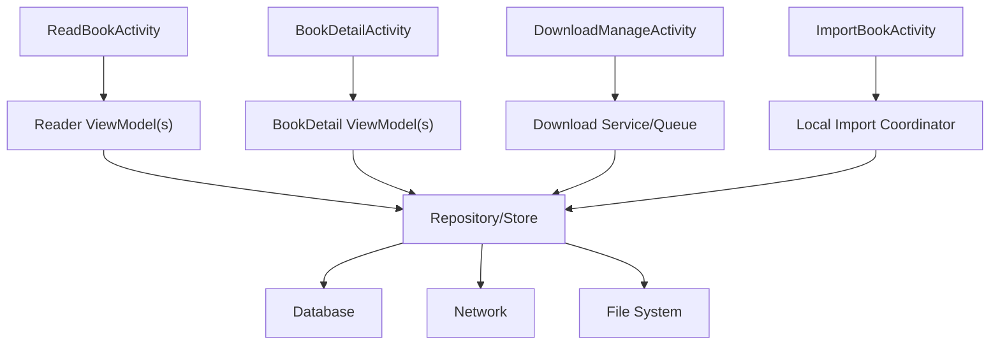
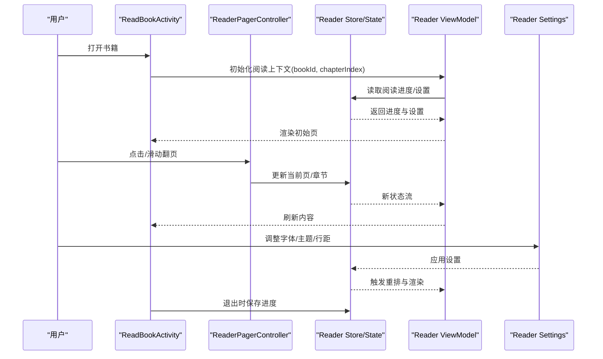
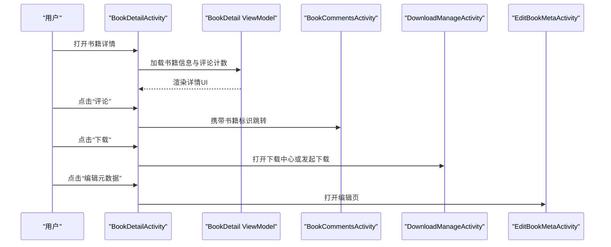
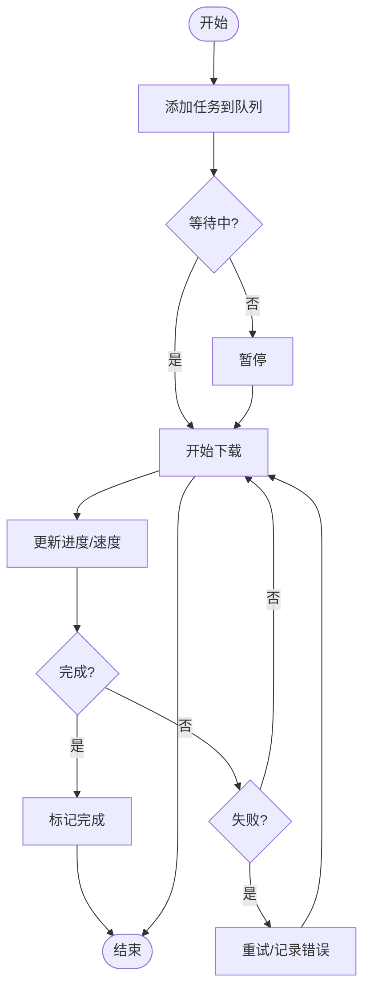
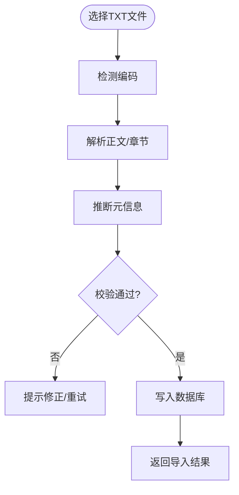
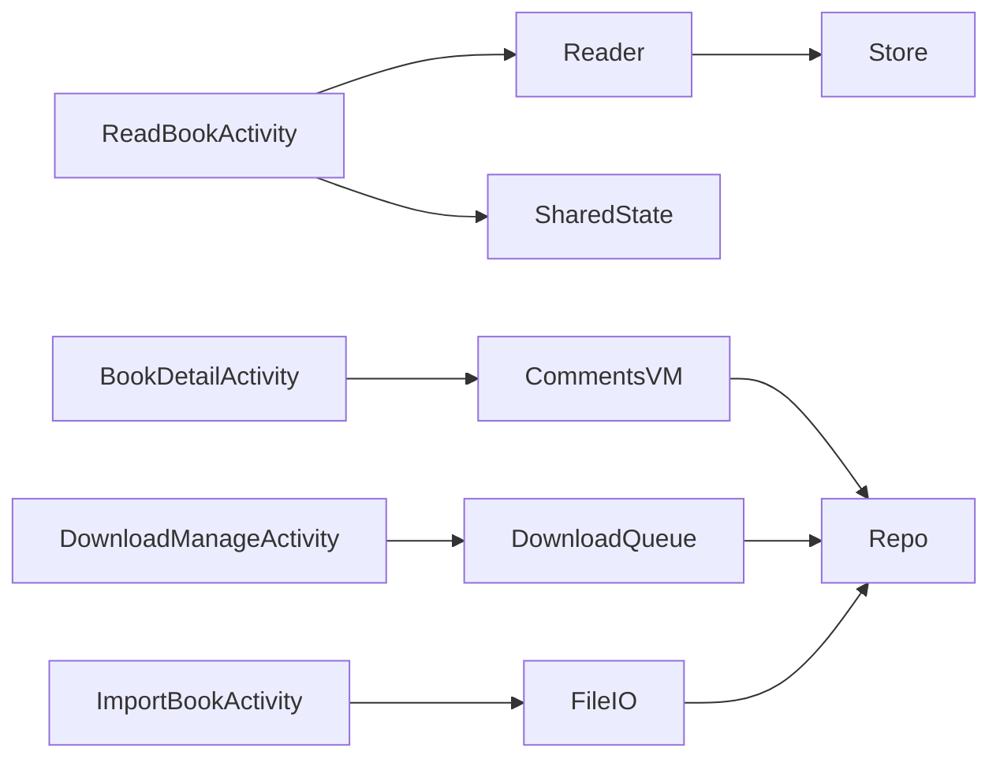

# 书籍管理模块 (module_book)

<cite>
**本文引用的文件**   
- [ReadBookActivity.kt](file://module_book/src/main/java/com/ebook/module_book/book/ReadBookActivity.kt)
- [BookDetailActivity.kt](file://module_book/src/main/java/com/ebook/module_book/book/BookDetailActivity.kt)
- [DownloadManageActivity.kt](file://module_book/src/main/java/com/ebook/module_book/book/DownloadManageActivity.kt)
- [ImportBookActivity.kt](file://module_book/src/main/java/com/ebook/module_book/book/ImportBookActivity.kt)
- [BitIntentDataManager.kt](file://module_book/src/main/java/com/ebook/module_book/book/manager/BitIntentDataManager.kt)
- [BookCommentsViewModel.kt](file://module_book/src/main/java/com/ebook/module_book/book/mvvm/viewmodel/BookCommentsViewModel.kt)
- [BookCommentsActivity.kt](file://module_book/src/main/java/com/ebook/module_book/book/BookCommentsActivity.kt)
- [EditBookMetaActivity.kt](file://module_book/src/main/java/com/ebook/module_book/book/EditBookMetaActivity.kt)
- [ReaderPagerControllerTest.kt](file://module_book/src/test/java/com/ebook/module_book/book/reader/ReaderPagerControllerTest.kt)
- [ReadingProgressFlowTest.kt](file://module_book/src/test/java/com/ebook/module_book/book/mvvm/viewmodel/ReadingProgressFlowTest.kt)
- [ChapterSelectionTest.kt](file://module_book/src/test/java/com/ebook/module_book/book/reader/ChapterSelectionTest.kt)
- [SourceSwitchViewModelTest.kt](file://module_book/src/test/java/com/ebook/module_book/book/mvvm/viewmodel/SourceSwitchViewModelTest.kt)
- [IsOwnCommentTest.kt](file://module_book/src/test/java/com/ebook/module_book/book/mvvm/viewmodel/IsOwnCommentTest.kt)
</cite>

## 目录
1. [引言](#引言)
2. [项目结构](#项目结构)
3. [核心组件](#核心组件)
4. [架构总览](#架构总览)
5. [详细组件分析](#详细组件分析)
6. [依赖关系分析](#依赖关系分析)
7. [性能与体验考量](#性能与体验考量)
8. [故障排查指南](#故障排查指南)
9. [结论](#结论)

## 引言
本文件面向 module_book 书籍管理模块，围绕以下目标展开：
- 阅读界面 ReadBookActivity：阅读器状态管理、翻页控制、章节目录显示、阅读设置面板。
- 书籍详情 BookDetailActivity：书籍信息展示、评论系统集成、下载管理入口。
- 下载中心 DownloadManageActivity：前台服务下载、队列管理、进度监控、断点续传机制。
- 本地导入 ImportBookActivity：本地 TXT 导入流程。
- MVVM 设计模式：数据绑定、状态管理与业务逻辑分离。
- 自定义配置与扩展接口：帮助开发者理解并扩展阅读器和书籍管理能力。

## 项目结构
module_book 以“功能域 + 分层”组织代码，关键目录包括：
- book：页面 Activity（阅读、详情、下载、评论、编辑元数据、导入）。
- reader：阅读器相关能力（分页、滚动、布局缓存、主题渲染等）。
- mvvm/viewmodel：基于 ViewModel 的状态管理与业务编排。
- manager/provider/repository/service：跨页面共享的数据管理器、Provider、仓库与服务。
- page/view：页面级 UI 组合与渲染逻辑。

**图示来源**
- [ReadBookActivity.kt](file://module_book/src/main/java/com/ebook/module_book/book/ReadBookActivity.kt)
- [BookDetailActivity.kt](file://module_book/src/main/java/com/ebook/module_book/book/BookDetailActivity.kt)
- [DownloadManageActivity.kt](file://module_book/src/main/java/com/ebook/module_book/book/DownloadManageActivity.kt)
- [ImportBookActivity.kt](file://module_book/src/main/java/com/ebook/module_book/book/ImportBookActivity.kt)

**章节来源**
- [ReadBookActivity.kt](file://module_book/src/main/java/com/ebook/module_book/book/ReadBookActivity.kt)
- [BookDetailActivity.kt](file://module_book/src/main/java/com/ebook/module_book/book/BookDetailActivity.kt)
- [DownloadManageActivity.kt](file://module_book/src/main/java/com/ebook/module_book/book/DownloadManageActivity.kt)
- [ImportBookActivity.kt](file://module_book/src/main/java/com/ebook/module_book/book/ImportBookActivity.kt)

## 核心组件
- ReadBookActivity：承载阅读器 UI 与交互，负责阅读器生命周期、状态持久化、目录与设置面板弹出、翻页与滚动模式切换、章节选择与跳转、阅读进度同步。
- BookDetailActivity：展示书籍封面、作者、简介、评分等元信息；提供评论入口与下载入口；聚合 ViewModel 状态进行 UI 渲染。
- DownloadManageActivity：管理下载任务队列，支持暂停/继续、删除、批量操作；通过前台服务保持后台下载稳定运行；展示每个任务的进度与状态。
- ImportBookActivity：处理本地 TXT 文件选择、编码检测、章节切分、元信息推断与入库；完成后回传结果供书架或详情页使用。
- 共享数据与状态：
  - BitIntentDataManager：用于跨页面传递二进制或复杂参数，避免 Intent 参数过大导致的崩溃。
  - BookCommentsViewModel：评论列表的加载、分页、合并、点赞/回复等业务编排。
  - Reader 测试套件：覆盖翻页控制器、滚动控制器、章节选择、页存储、渲染探测等关键路径。

**章节来源**
- [ReadBookActivity.kt](file://module_book/src/main/java/com/ebook/module_book/book/ReadBookActivity.kt)
- [BookDetailActivity.kt](file://module_book/src/main/java/com/ebook/module_book/book/BookDetailActivity.kt)
- [DownloadManageActivity.kt](file://module_book/src/main/java/com/ebook/module_book/book/DownloadManageActivity.kt)
- [ImportBookActivity.kt](file://module_book/src/main/java/com/ebook/module_book/book/ImportBookActivity.kt)
- [BitIntentDataManager.kt](file://module_book/src/main/java/com/ebook/module_book/book/manager/BitIntentDataManager.kt)
- [BookCommentsViewModel.kt](file://module_book/src/main/java/com/ebook/module_book/book/mvvm/viewmodel/BookCommentsViewModel.kt)
- [BookCommentsActivity.kt](file://module_book/src/main/java/com/ebook/module_book/book/BookCommentsActivity.kt)
- [EditBookMetaActivity.kt](file://module_book/src/main/java/com/ebook/module_book/book/EditBookMetaActivity.kt)
- [ReaderPagerControllerTest.kt](file://module_book/src/test/java/com/ebook/module_book/book/reader/ReaderPagerControllerTest.kt)
- [ReadingProgressFlowTest.kt](file://module_book/src/test/java/com/ebook/module_book/book/mvvm/viewmodel/ReadingProgressFlowTest.kt)
- [ChapterSelectionTest.kt](file://module_book/src/test/java/com/ebook/module_book/book/reader/ChapterSelectionTest.kt)
- [SourceSwitchViewModelTest.kt](file://module_book/src/test/java/com/ebook/module_book/book/mvvm/viewmodel/SourceSwitchViewModelTest.kt)
- [IsOwnCommentTest.kt](file://module_book/src/test/java/com/ebook/module_book/book/mvvm/viewmodel/IsOwnCommentTest.kt)

## 架构总览
模块整体采用 MVVM + 多模块分层：
- 页面层（Activity）仅做轻量编排与事件转发，不持有重型业务逻辑。
- ViewModel 暴露 StateFlow/SharedFlow 等响应式状态，驱动 UI。
- Repository/Manager/Service 封装数据源与网络/数据库/文件系统访问。
- Reader 子模块将“内容解析、分页、滚动、布局缓存、主题渲染”解耦，便于扩展。

**图示来源**
- [ReadBookActivity.kt](file://module_book/src/main/java/com/ebook/module_book/book/ReadBookActivity.kt)
- [BookDetailActivity.kt](file://module_book/src/main/java/com/ebook/module_book/book/BookDetailActivity.kt)
- [DownloadManageActivity.kt](file://module_book/src/main/java/com/ebook/module_book/book/DownloadManageActivity.kt)
- [ImportBookActivity.kt](file://module_book/src/main/java/com/ebook/module_book/book/ImportBookActivity.kt)

## 详细组件分析

### 阅读器：ReadBookActivity
职责边界
- 生命周期管理：启动/恢复/销毁时协调阅读器资源，确保内存与 IO 安全。
- 状态管理：当前章节、页码、滚动位置、字体大小、行距、亮度、夜间模式等。
- 翻页控制：支持点击翻页、手势滑动翻页、滚动模式与无缝衔接。
- 章节目录：侧边目录弹出、定位到指定章节、锚点高亮。
- 阅读设置：字体、主题、行距、段落间距、背景色等实时生效。
- 进度同步：在退出、章节切换、页码变化时持久化阅读进度。

关键交互流程

**图示来源**
- [ReadBookActivity.kt](file://module_book/src/main/java/com/ebook/module_book/book/ReadBookActivity.kt)
- [ReaderPagerControllerTest.kt](file://module_book/src/test/java/com/ebook/module_book/book/reader/ReaderPagerControllerTest.kt)
- [ReadingProgressFlowTest.kt](file://module_book/src/test/java/com/ebook/module_book/book/mvvm/viewmodel/ReadingProgressFlowTest.kt)

实现要点
- 翻页控制器与滚动控制器解耦，分别负责“离散翻页”和“连续滚动”两种模式。
- 章节选择器维护章节索引映射，支持搜索与快速跳转。
- 阅读设置通过可观察状态下发至渲染管线，避免重复解析。
- 阅读进度采用增量写入策略，降低频繁 IO 对性能的冲击。

常见扩展点
- 新增翻页手势或动画：在翻页控制器中扩展手势识别与过渡效果。
- 新增阅读设置项：在设置模型中添加字段，并在渲染管线中消费该字段。
- 新增目录样式：替换目录适配器或节点渲染器。

**章节来源**
- [ReadBookActivity.kt](file://module_book/src/main/java/com/ebook/module_book/book/ReadBookActivity.kt)
- [ReaderPagerControllerTest.kt](file://module_book/src/test/java/com/ebook/module_book/book/reader/ReaderPagerControllerTest.kt)
- [ReadingProgressFlowTest.kt](file://module_book/src/test/java/com/ebook/module_book/book/mvvm/viewmodel/ReadingProgressFlowTest.kt)

### 书籍详情：BookDetailActivity
职责边界
- 书籍信息展示：封面、标题、作者、简介、标签、评分、来源、更新时间等。
- 评论系统集成：跳转到 BookCommentsActivity，或通过内嵌列表展示评论。
- 下载管理入口：进入 DownloadManageActivity 或触发单章/整本下载。
- 元数据编辑：进入 EditBookMetaActivity 修改书名、作者、分类等。

典型流程

**图示来源**
- [BookDetailActivity.kt](file://module_book/src/main/java/com/ebook/module_book/book/BookDetailActivity.kt)
- [BookCommentsActivity.kt](file://module_book/src/main/java/com/ebook/module_book/book/BookCommentsActivity.kt)
- [DownloadManageActivity.kt](file://module_book/src/main/java/com/ebook/module_book/book/DownloadManageActivity.kt)
- [EditBookMetaActivity.kt](file://module_book/src/main/java/com/ebook/module_book/book/EditBookMetaActivity.kt)

注意事项
- 评论集成需考虑未登录态与权限提示。
- 下载入口应区分“已有任务”与“新建任务”，避免重复入队。
- 元数据变更需要同步到书架与搜索索引。

**章节来源**
- [BookDetailActivity.kt](file://module_book/src/main/java/com/ebook/module_book/book/BookDetailActivity.kt)
- [BookCommentsActivity.kt](file://module_book/src/main/java/com/ebook/module_book/book/BookCommentsActivity.kt)
- [DownloadManageActivity.kt](file://module_book/src/main/java/com/ebook/module_book/book/DownloadManageActivity.kt)
- [EditBookMetaActivity.kt](file://module_book/src/main/java/com/ebook/module_book/book/EditBookMetaActivity.kt)

### 下载中心：DownloadManageActivity
职责边界
- 下载队列管理：新增、暂停、继续、删除、清空、批量操作。
- 进度监控：实时进度百分比、速度、剩余时间、失败重试次数。
- 断点续传：记录已下载字节范围，异常中断后从断点继续。
- 前台服务：保证应用在后台时下载仍可稳定运行。

队列与任务状态流转

**图示来源**
- [DownloadManageActivity.kt](file://module_book/src/main/java/com/ebook/module_book/book/DownloadManageActivity.kt)

实现要点
- 队列数据结构优先使用有序集合以保证顺序一致性。
- 断点续传需在服务端与客户端共同维护 Range 头与偏移量。
- 前台通知需与任务一一对应，支持点击查看详情与操作。

**章节来源**
- [DownloadManageActivity.kt](file://module_book/src/main/java/com/ebook/module_book/book/DownloadManageActivity.kt)

### 本地导入：ImportBookActivity
职责边界
- 文件选择：调用系统文件选择器或自有文件浏览。
- 编码检测：自动探测文本编码，必要时允许用户手动选择。
- 章节切分：根据正则或规则将文本拆分为章节。
- 元信息推断：从文件名、头部注释、正文片段提取标题、作者、简介。
- 入库与回调：将书籍与章节写入数据库，并将结果返回给上层页面。

导入流程

**图示来源**
- [ImportBookActivity.kt](file://module_book/src/main/java/com/ebook/module_book/book/ImportBookActivity.kt)

注意事项
- 大文件导入需要分页读取与异步处理，避免主线程卡顿。
- 章节切分规则应可配置，便于不同来源的文本适配。
- 重复导入时应去重并提示用户是否覆盖或合并。

**章节来源**
- [ImportBookActivity.kt](file://module_book/src/main/java/com/ebook/module_book/book/ImportBookActivity.kt)

### MVVM 视图模型与数据绑定
模块内 ViewModel 的职责是将 UI 所需状态暴露为响应式流，业务逻辑下沉至 Repository/Manager。

- BookCommentsViewModel：负责评论列表加载、分页、合并、点赞/回复等编排。
- ReadingProgressFlowTest：验证阅读进度流的正确性与幂等性。
- SourceSwitchViewModelTest：验证多来源切换时的状态一致性与反馈。
- IsOwnCommentTest：验证评论归属判断逻辑。

数据绑定建议
- UI 只订阅 StateFlow/SharedFlow，不做业务判断。
- ViewModel 中统一处理错误与空态，向上抛出统一的 UI 状态。
- 对耗时操作使用协程作用域与取消令牌，避免泄漏。

**章节来源**
- [BookCommentsViewModel.kt](file://module_book/src/main/java/com/ebook/module_book/book/mvvm/viewmodel/BookCommentsViewModel.kt)
- [ReadingProgressFlowTest.kt](file://module_book/src/test/java/com/ebook/module_book/book/mvvm/viewmodel/ReadingProgressFlowTest.kt)
- [SourceSwitchViewModelTest.kt](file://module_book/src/test/java/com/ebook/module_book/book/mvvm/viewmodel/SourceSwitchViewModelTest.kt)
- [IsOwnCommentTest.kt](file://module_book/src/test/java/com/ebook/module_book/book/mvvm/viewmodel/IsOwnCommentTest.kt)

## 依赖关系分析
模块内部依赖方向明确：页面依赖 ViewModel 与共享管理器；ViewModel 依赖 Repository/Service；Reader 作为独立子模块被页面复用。

**图示来源**
- [ReadBookActivity.kt](file://module_book/src/main/java/com/ebook/module_book/book/ReadBookActivity.kt)
- [BookDetailActivity.kt](file://module_book/src/main/java/com/ebook/module_book/book/BookDetailActivity.kt)
- [DownloadManageActivity.kt](file://module_book/src/main/java/com/ebook/module_book/book/DownloadManageActivity.kt)
- [ImportBookActivity.kt](file://module_book/src/main/java/com/ebook/module_book/book/ImportBookActivity.kt)
- [BitIntentDataManager.kt](file://module_book/src/main/java/com/ebook/module_book/book/manager/BitIntentDataManager.kt)

潜在风险与建议
- 避免页面直接持有 Repository 实例，尽量通过 ViewModel 暴露状态。
- 对 Reader 与下载队列这类长生命周期对象，注意生命周期绑定与释放。
- 跨页面大数据传输优先使用 BitIntentDataManager 或持久化键值。

**章节来源**
- [BitIntentDataManager.kt](file://module_book/src/main/java/com/ebook/module_book/book/manager/BitIntentDataManager.kt)

## 性能与体验考量
- 阅读器渲染
  - 分页缓存：预加载前后若干页，减少首屏延迟与频繁 IO。
  - 滚动模式优化：滚动模式下按需测量与绘制，避免一次性构建全章。
  - 主题切换：局部重绘而非重建整页，降低掉帧概率。
- 下载中心
  - 批量任务调度：限制并发数，避免抢占带宽导致其他功能卡顿。
  - 进度上报节流：合并多次进度更新，降低 UI 刷新频率。
- 导入流程
  - 流式读取：避免一次性加载整个 TXT 到内存。
  - 章节切分并行化：对大块文本进行分段切分与合并。

[本节为通用指导，不直接分析具体文件]

## 故障排查指南
常见问题与定位思路
- 阅读器白屏或闪退
  - 检查章节内容与分页计算是否正确；参考 ReaderPagerControllerTest 用例。
  - 确认阅读进度读取是否幂等；参考 ReadingProgressFlowTest。
- 目录无法定位
  - 检查章节索引映射与锚点计算；参考 ChapterSelectionTest。
- 评论列表不更新
  - 检查 ViewModel 状态流与分页合并逻辑；参考 BookCommentsViewModel 与相关测试。
- 下载任务异常中断
  - 检查断点续传的偏移量与 Range 请求；核对 DownloadManageActivity 的任务状态机。
- 导入失败或乱码
  - 检查编码检测与章节切分规则；必要时让用户手动指定编码与切分规则。

**章节来源**
- [ReaderPagerControllerTest.kt](file://module_book/src/test/java/com/ebook/module_book/book/reader/ReaderPagerControllerTest.kt)
- [ReadingProgressFlowTest.kt](file://module_book/src/test/java/com/ebook/module_book/book/mvvm/viewmodel/ReadingProgressFlowTest.kt)
- [ChapterSelectionTest.kt](file://module_book/src/test/java/com/ebook/module_book/book/reader/ChapterSelectionTest.kt)
- [BookCommentsViewModel.kt](file://module_book/src/main/java/com/ebook/module_book/book/mvvm/viewmodel/BookCommentsViewModel.kt)
- [DownloadManageActivity.kt](file://module_book/src/main/java/com/ebook/module_book/book/DownloadManageActivity.kt)
- [ImportBookActivity.kt](file://module_book/src/main/java/com/ebook/module_book/book/ImportBookActivity.kt)

## 结论
module_book 通过清晰的 MVVM 分层与 Reader 子模块解耦，实现了可扩展的阅读体验与稳定的下载能力。页面层专注编排与交互，ViewModel 集中状态与业务，Reader 聚焦渲染与分页，下载与导入分别由专用 Activity 与队列管理。借助完善的测试覆盖与共享数据工具，开发者可在不破坏现有契约的前提下，扩展阅读设置、目录样式、下载策略与导入规则。