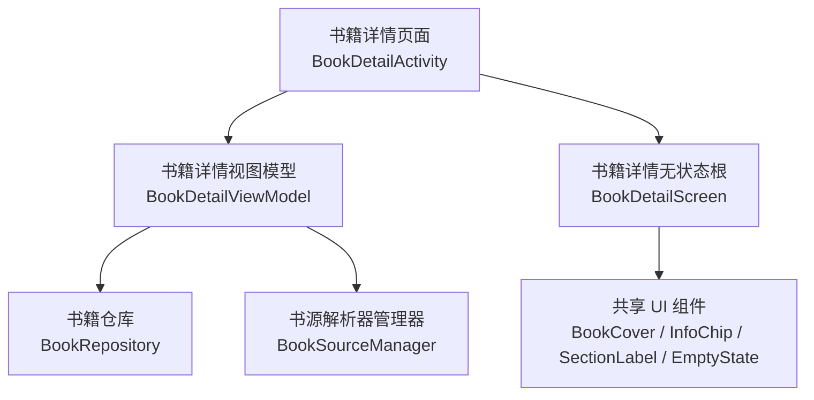
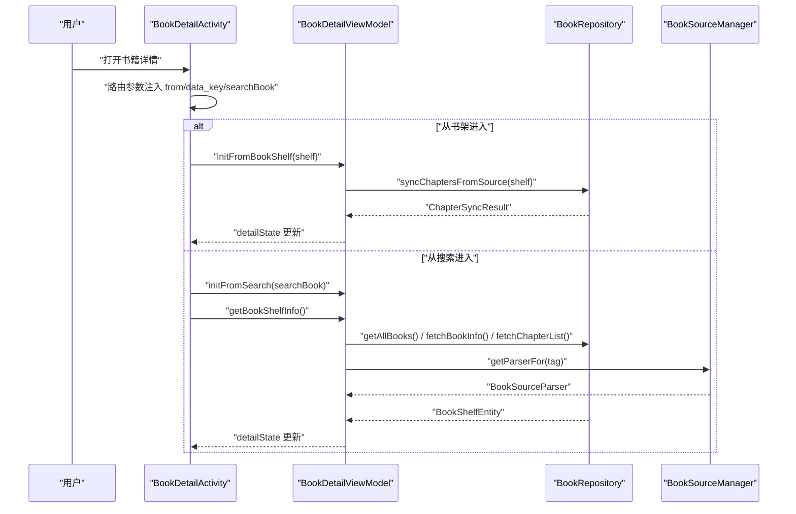
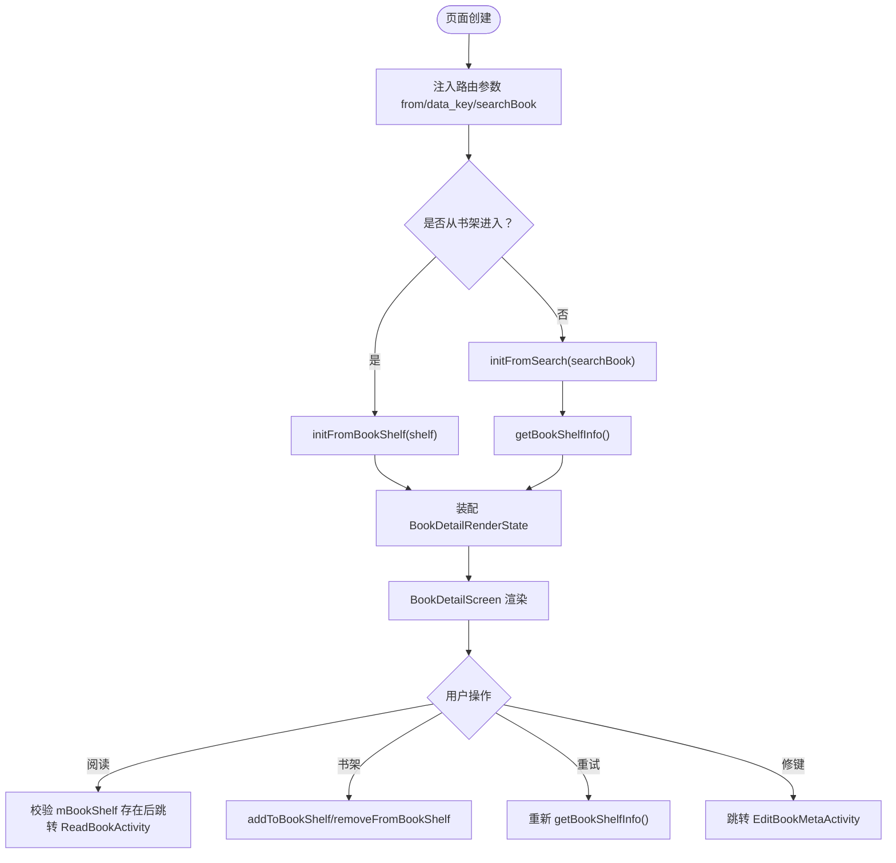
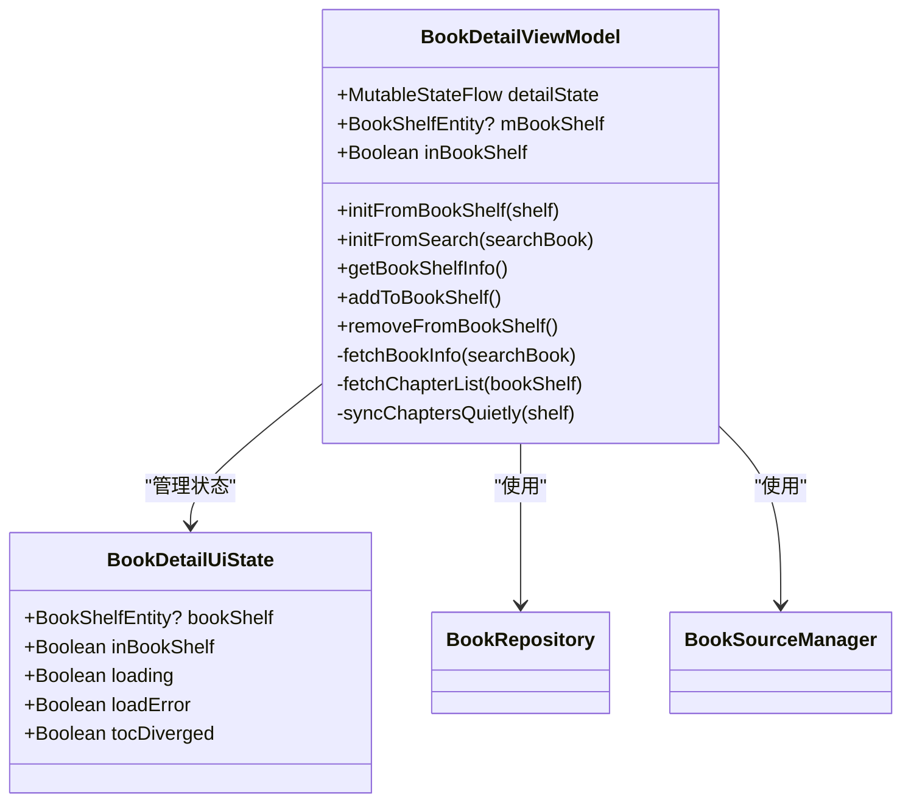
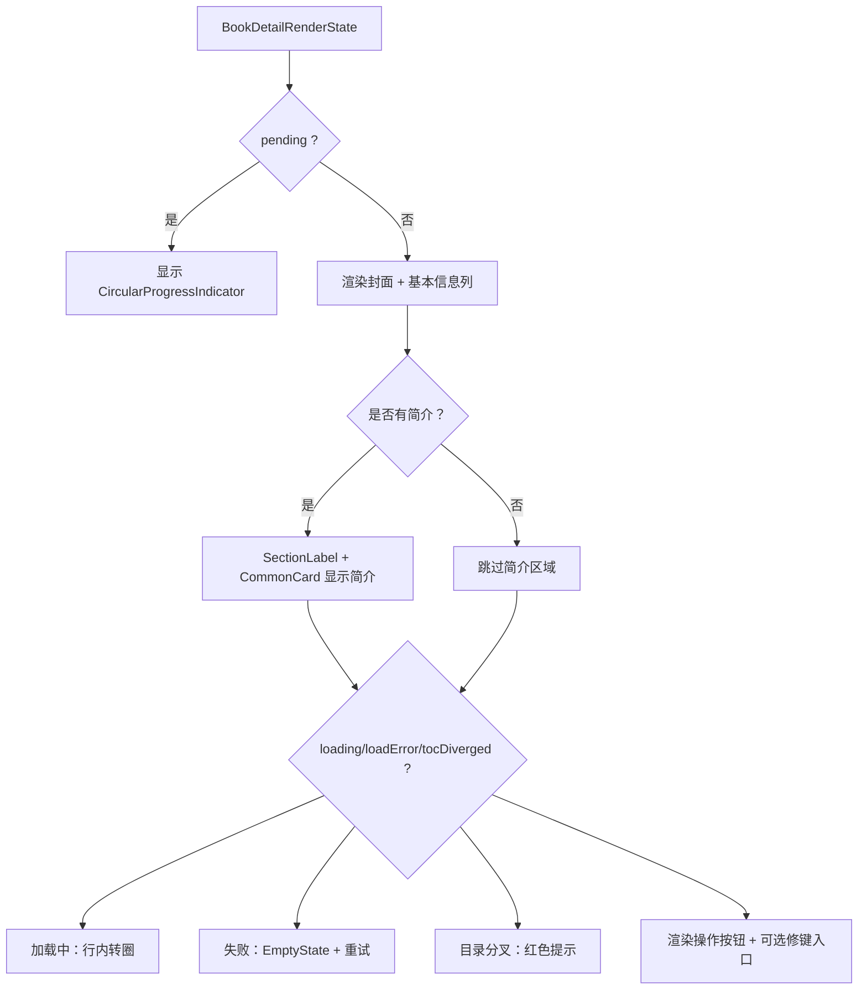
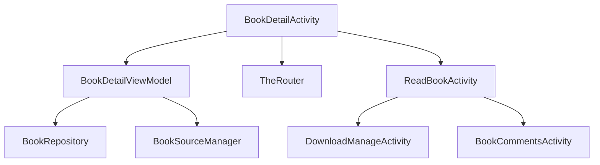
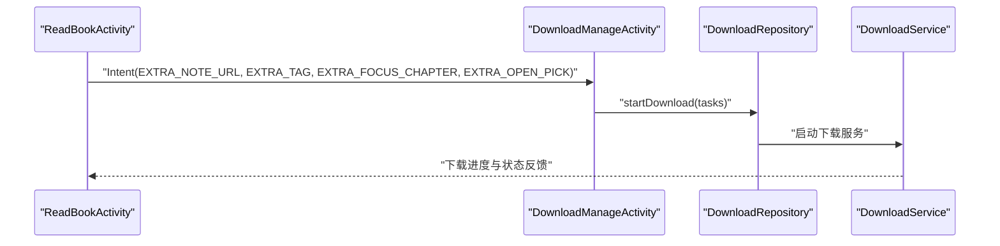
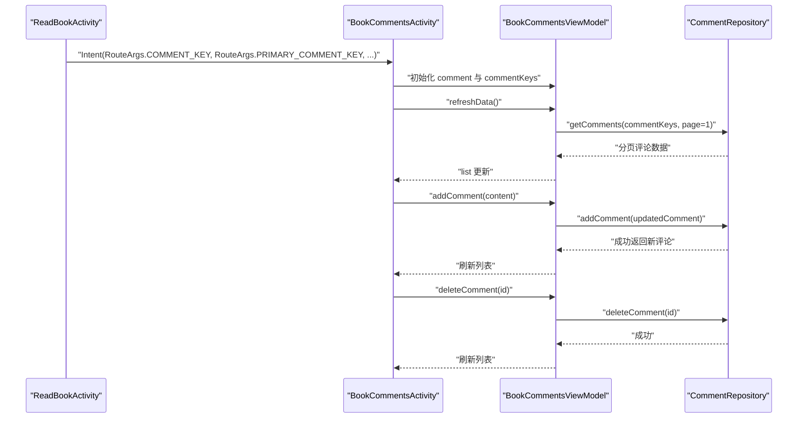
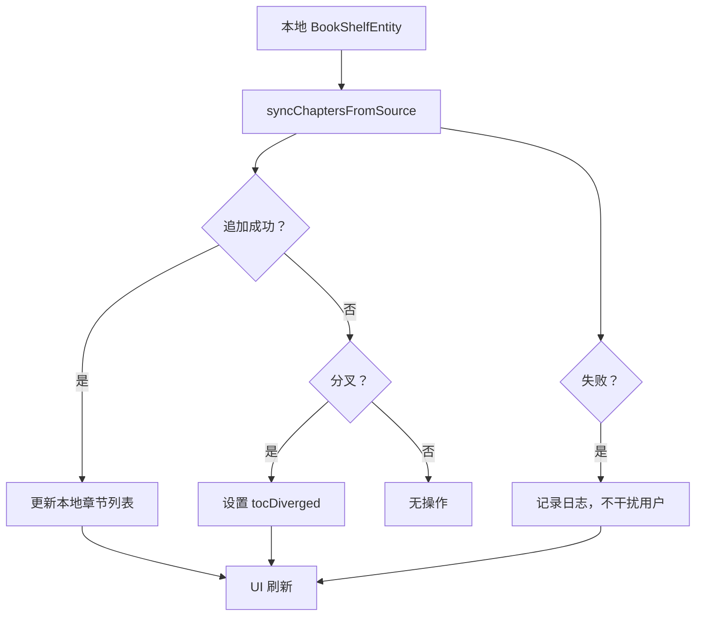

# 书籍详情（BookDetailActivity）

<cite>
**本文引用的文件**   
- [module_book/src/main/java/com/ebook/book/BookDetailActivity.kt](file://module_book/src/main/java/com/ebook/book/BookDetailActivity.kt)
- [module_book/src/main/java/com/ebook/book/mvvm/viewmodel/BookDetailViewModel.kt](file://module_book/src/main/java/com/ebook/book/mvvm/viewmodel/BookDetailViewModel.kt)
- [module_book/src/main/java/com/ebook/book/BookCommentsActivity.kt](file://module_book/src/main/java/com/ebook/book/BookCommentsActivity.kt)
- [module_book/src/main/java/com/ebook/book/mvvm/viewmodel/BookCommentsViewModel.kt](file://module_book/src/main/java/com/ebook/book/mvvm/viewmodel/BookCommentsViewModel.kt)
- [lib_book_common/src/main/java/com/ebook/common/repository/CommentRepository.kt](file://lib_book_common/src/main/java/com/ebook/common/repository/CommentRepository.kt)
- [lib_ebook_api/src/main/java/com/ebook/api/service/comment/CommentService.kt](file://lib_ebook_api/src/main/java/com/ebook/api/service/comment/CommentService.kt)
- [module_book/src/main/java/com/ebook/book/DownloadManageActivity.kt](file://module_book/src/main/java/com/ebook/book/DownloadManageActivity.kt)
- [module_book/src/main/java/com/ebook/book/repository/DownloadRepository.kt](file://module_book/src/main/java/com/ebook/book/repository/DownloadRepository.kt)
- [module_book/src/main/java/com/ebook/book/service/DownloadService.kt](file://module_book/src/main/java/com/ebook/book/service/DownloadService.kt)
- [module_book/src/main/java/com/ebook/book/ReadBookActivity.kt](file://module_book/src/main/java/com/ebook/book/ReadBookActivity.kt)
- [lib_book_common/src/main/java/com/ebook/common/event/KeyCode.kt](file://lib_book_common/src/main/java/com/ebook/common/event/KeyCode.kt)
</cite>

## 目录
1. [简介](#简介)
2. [项目结构定位](#项目结构定位)
3. [核心组件总览](#核心组件总览)
4. [架构概览](#架构概览)
5. [详细组件分析](#详细组件分析)
6. [依赖关系分析](#依赖关系分析)
7. [性能与行为特性](#性能与行为特性)
8. [下载管理集成](#下载管理集成)
9. [评论系统集成](#评论系统集成)
10. [缓存策略与更新机制](#缓存策略与更新机制)
11. [自定义配置与扩展点](#自定义配置与扩展点)
12. [故障排查指南](#故障排查指南)
13. [结论](#结论)

## 简介
本书详文档聚焦 `BookDetailActivity` 书籍详情页面，围绕其 UI 设计、MVVM 数据流、评论系统集成、下载入口关联、缓存与更新策略，以及开发者可定制的配置点进行系统性说明。该页面是用户从书架或搜索结果进入一本书的“详情页”，负责展示封面、基本信息、章节状态、简介，并作为阅读、书架管理、修键面板等功能的统一入口。

## 项目结构定位
`BookDetailActivity` 位于书籍模块中，采用 Compose + MVVM 实现：Activity 承担路由参数注入和 UI 壳层，`BookDetailViewModel` 承载可观察 UI 状态与业务逻辑，共享 UI 组件来自 `lib_book_common`，网络与仓库能力通过 `BookRepository`、`BookSourceManager` 等抽象提供。

**图表来源**
- [module_book/src/main/java/com/ebook/book/BookDetailActivity.kt:63-120](file://module_book/src/main/java/com/ebook/book/BookDetailActivity.kt#L63-L120)
- [module_book/src/main/java/com/ebook/book/mvvm/viewmodel/BookDetailViewModel.kt:20-40](file://module_book/src/main/java/com/ebook/book/mvvm/viewmodel/BookDetailViewModel.kt#L20-L40)

**章节来源**
- [module_book/src/main/java/com/ebook/book/BookDetailActivity.kt:63-120](file://module_book/src/main/java/com/ebook/book/BookDetailActivity.kt#L63-L120)
- [module_book/src/main/java/com/ebook/book/mvvm/viewmodel/BookDetailViewModel.kt:20-40](file://module_book/src/main/java/com/ebook/book/mvvm/viewmodel/BookDetailViewModel.kt#L20-L40)

## 核心组件总览
- `BookDetailActivity`：路由注入、初始化数据来源、触发阅读/书架操作、组装渲染态。
- `BookDetailRenderState`：详情页的无状态渲染输入，聚合封面、书名、作者、来源、简介、章节信息、加载状态、是否已在书架、是否可读、修键入口等字段。
- `BookDetailUiState`：ViewModel 的可观察状态，包含书籍实体、书架归属、加载中、加载失败、目录分叉等。
- `BookDetailViewModel`：处理书架事件、静默目录同步、搜索入口详情拉取、章节列表合并、书架增删、书源失效处理。
- `BookDetailScreen`：Compose 无状态根，只消费渲染状态和回调，绘制封面、基本信息、简介、状态提示和操作按钮。

**章节来源**
- [module_book/src/main/java/com/ebook/book/BookDetailActivity.kt:120-200](file://module_book/src/main/java/com/ebook/book/BookDetailActivity.kt#L120-L200)
- [module_book/src/main/java/com/ebook/book/BookDetailActivity.kt:201-528](file://module_book/src/main/java/com/ebook/book/BookDetailActivity.kt#L201-L528)
- [module_book/src/main/java/com/ebook/book/mvvm/viewmodel/BookDetailViewModel.kt:20-120](file://module_book/src/main/java/com/ebook/book/mvvm/viewmodel/BookDetailViewModel.kt#L20-L120)

## 架构概览
详情页遵循“壳层收集 + 无状态根”模式：
- Activity 持有 ViewModel，收集 `detailState`，并派生 `BookDetailRenderState`。
- 根组件仅消费不可变状态，避免在 UI 层做来源判断逻辑。
- ViewModel 通过 Flow 暴露状态，使用 Hilt 注入仓库与书源管理器。
- 书架事件由 VM 订阅，实时修正书架归属与页面关闭语义。

**图表来源**
- [module_book/src/main/java/com/ebook/book/BookDetailActivity.kt:80-120](file://module_book/src/main/java/com/ebook/book/BookDetailActivity.kt#L80-L120)
- [module_book/src/main/java/com/ebook/book/mvvm/viewmodel/BookDetailViewModel.kt:120-220](file://module_book/src/main/java/com/ebook/book/mvvm/viewmodel/BookDetailViewModel.kt#L120-L220)

**章节来源**
- [module_book/src/main/java/com/ebook/book/BookDetailActivity.kt:80-120](file://module_book/src/main/java/com/ebook/book/BookDetailActivity.kt#L80-L120)
- [module_book/src/main/java/com/ebook/book/mvvm/viewmodel/BookDetailViewModel.kt:120-220](file://module_book/src/main/java/com/ebook/book/mvvm/viewmodel/BookDetailViewModel.kt#L120-L220)

## 详细组件分析

### BookDetailActivity：页面壳层与渲染态装配
- 路由参数：`from`、`data_key`、`searchBook`。
- 初始化逻辑：
  - 书架入口：用本地 `BookShelfEntity` 立即渲染，随后静默重抓目录；不无条件重拉详情，避免断链。
  - 搜索入口：先显示搜索条目基本信息，再调用 `getBookShelfInfo()` 拉取详情与章节列表。
- 渲染态装配：
  - 根据是否在书架决定封面、书名、作者、来源、简介、章节信息的优先来源。
  - 计算 `chapterInfo`：已在书架显示“观看至某章”，不在书架显示“最新章节”。
  - 控制“开始阅读/继续阅读”按钮可用性与文案。
  - 提供修键面板入口，仅在已有 `noteUrl` 时出现。
- 交互动作：
  - 点击阅读：校验 `mBookShelf` 存在后跳转阅读器。
  - 点击书架：切换添加/移除。
  - 重试：重新拉取详情。
  - 修键：携带 `RouteArgs.NOTE_URL` 跳转到编辑元数据页。

**图表来源**
- [module_book/src/main/java/com/ebook/book/BookDetailActivity.kt:80-120](file://module_book/src/main/java/com/ebook/book/BookDetailActivity.kt#L80-L120)
- [module_book/src/main/java/com/ebook/book/BookDetailActivity.kt:201-528](file://module_book/src/main/java/com/ebook/book/BookDetailActivity.kt#L201-L528)

**章节来源**
- [module_book/src/main/java/com/ebook/book/BookDetailActivity.kt:80-120](file://module_book/src/main/java/com/ebook/book/BookDetailActivity.kt#L80-L120)
- [module_book/src/main/java/com/ebook/book/BookDetailActivity.kt:201-528](file://module_book/src/main/java/com/ebook/book/BookDetailActivity.kt#L201-L528)

### BookDetailViewModel：MVVM 数据管理与业务逻辑
- 可观察状态 `detailState`：
  - `bookShelf`：书籍详情实体，含章节列表。
  - `inBookShelf`：当前书是否已在书架。
  - `loading`：详情网络拉取中。
  - `loadError`：详情网络拉取失败。
  - `tocDiverged`：目录分叉提示。
- 书架事件订阅：
  - 新增书架：实时更新 `inBookShelf`，并在匹配 `noteUrl` 时更新搜索条目标记。
  - 移除书架：直接关闭详情页。
  - 进度更新与章节更新：详情页不做额外处理，避免覆盖用户浏览位置。
- 书架入口静默同步：
  - 先用本地实体渲染，再调用 `syncChaptersFromSource`。
  - 追加成功时更新本地章节列表并提示数量；分叉设置标记；失败静默记录日志。
- 搜索入口详情拉取：
  - 拉取书架列表用于归属判定。
  - 构造 `BookShelfEntity`，按 `tag` 获取书源解析器并拉取详情与章节列表。
  - 若已在书架，读取库内进度并合并远端章节；否则直接使用远端章节。
  - 失败时置错误态但不清空已存在的 `bookShelf`，防止书架入口断链。
- 书架增删：
  - 调用仓库接口，捕获异常并通过一次性消息通道提示。

**图表来源**
- [module_book/src/main/java/com/ebook/book/mvvm/viewmodel/BookDetailViewModel.kt:20-120](file://module_book/src/main/java/com/ebook/book/mvvm/viewmodel/BookDetailViewModel.kt#L20-L120)
- [module_book/src/main/java/com/ebook/book/mvvm/viewmodel/BookDetailViewModel.kt:201-339](file://module_book/src/main/java/com/ebook/book/mvvm/viewmodel/BookDetailViewModel.kt#L201-L339)

**章节来源**
- [module_book/src/main/java/com/ebook/book/mvvm/viewmodel/BookDetailViewModel.kt:20-120](file://module_book/src/main/java/com/ebook/book/mvvm/viewmodel/BookDetailViewModel.kt#L20-L120)
- [module_book/src/main/java/com/ebook/book/mvvm/viewmodel/BookDetailViewModel.kt:201-339](file://module_book/src/main/java/com/ebook/book/mvvm/viewmodel/BookDetailViewModel.kt#L201-L339)

### BookDetailScreen：UI 渲染与状态分支
- 封面展示：固定尺寸，按比例裁剪，内容描述为书名。
- 基本信息列：书名、作者、来源标签、章节信息行。
- 简介区域：分组标题 + 共享卡片容器。
- 加载状态：行内转圈；失败态使用共享 `EmptyState` 并提供重试。
- 目录分叉提示：红色文字提示，不作为可点重试。
- 操作按钮：
  - “添加到书架/从书架移除”：次要按钮。
  - “开始阅读/继续阅读”：主要按钮，未就绪时禁用。
- 修键面板入口：仅在已有 `noteUrl` 时显示。

**图表来源**
- [module_book/src/main/java/com/ebook/book/BookDetailActivity.kt:201-528](file://module_book/src/main/java/com/ebook/book/BookDetailActivity.kt#L201-L528)

**章节来源**
- [module_book/src/main/java/com/ebook/book/BookDetailActivity.kt:201-528](file://module_book/src/main/java/com/ebook/book/BookDetailActivity.kt#L201-L528)

## 依赖关系分析
- `BookDetailActivity` 依赖：
  - `BookDetailViewModel`：数据与业务逻辑。
  - `BitIntentDataManager`：临时存储书架实体供阅读器使用。
  - `TheRouter`：路由跳转修键面板。
  - 共享 UI 组件：`BookCover`、`InfoChip`、`SectionLabel`、`EmptyState`。
- `BookDetailViewModel` 依赖：
  - `BookRepository`：书架事件、章节同步、详情与章节拉取、落库。
  - `BookSourceManager`：按 `tag` 获取书源解析器。
  - 日志与工具：`Logger`、`reportFailure`、`context`。
- 外部集成：
  - 阅读器：`ReadBookActivity`，通过 Intent 传递书架实体。
  - 下载管理：`DownloadManageActivity`，从阅读器或书架页进入，非直接从详情页触发。
  - 评论系统：独立 `BookCommentsActivity`，通过路由参数传入章节与书籍信息。

**图表来源**
- [module_book/src/main/java/com/ebook/book/BookDetailActivity.kt:63-120](file://module_book/src/main/java/com/ebook/book/BookDetailActivity.kt#L63-L120)
- [module_book/src/main/java/com/ebook/book/mvvm/viewmodel/BookDetailViewModel.kt:20-40](file://module_book/src/main/java/com/ebook/book/mvvm/viewmodel/BookDetailViewModel.kt#L20-L40)
- [module_book/src/main/java/com/ebook/book/ReadBookActivity.kt:780-784](file://module_book/src/main/java/com/ebook/book/ReadBookActivity.kt#L780-L784)

**章节来源**
- [module_book/src/main/java/com/ebook/book/BookDetailActivity.kt:63-120](file://module_book/src/main/java/com/ebook/book/BookDetailActivity.kt#L63-L120)
- [module_book/src/main/java/com/ebook/book/mvvm/viewmodel/BookDetailViewModel.kt:20-40](file://module_book/src/main/java/com/ebook/book/mvvm/viewmodel/BookDetailViewModel.kt#L20-L40)
- [module_book/src/main/java/com/ebook/book/ReadBookActivity.kt:780-784](file://module_book/src/main/java/com/ebook/book/ReadBookActivity.kt#L780-L784)

## 性能与行为特性
- 书架入口“先渲染后检查”：避免长时间目录同步导致白屏。
- 静默目录同步：只在追加成功时分发提示，失败不干扰用户。
- 搜索入口失败语义：保留已有 `bookShelf`，防止书架入口断链。
- 书架事件订阅收敛到 VM：旋转重建不重复累积，避免列表重复。
- 目录分叉：本地目录未改动但远端分叉，提示常驻但不阻塞阅读。
- 阅读器跳转保护：`canRead` 确保章节数据就绪，避免空页死链。

[本节为通用行为说明，不直接分析具体代码文件]

## 下载管理集成
详情页本身不提供直接“开始下载”按钮；下载入口主要通过以下路径集成：
- 阅读器：从 `ReadBookActivity` 进入 `DownloadManageActivity`，传递 `noteUrl`、`tag`、`durChapter` 与“自动打开选择面板”标志。
- 书架页：通过下载图标进入下载管理页。
- 下载管理页：由 `DownloadManageViewModel` 构建任务，经 `DownloadRepository.startDownload` 统一下发，`DownloadService` 启动后台服务执行下载。

**图表来源**
- [module_book/src/main/java/com/ebook/book/ReadBookActivity.kt:780-784](file://module_book/src/main/java/com/ebook/book/ReadBookActivity.kt#L780-L784)
- [module_book/src/main/java/com/ebook/book/repository/DownloadRepository.kt:264-267](file://module_book/src/main/java/com/ebook/book/repository/DownloadRepository.kt#L264-L267)
- [module_book/src/main/java/com/ebook/book/service/DownloadService.kt:44-45](file://module_book/src/main/java/com/ebook/book/service/DownloadService.kt#L44-L45)

**章节来源**
- [module_book/src/main/java/com/ebook/book/ReadBookActivity.kt:780-784](file://module_book/src/main/java/com/ebook/book/ReadBookActivity.kt#L780-L784)
- [module_book/src/main/java/com/ebook/book/repository/DownloadRepository.kt:264-267](file://module_book/src/main/java/com/ebook/book/repository/DownloadRepository.kt#L264-L267)
- [module_book/src/main/java/com/ebook/book/service/DownloadService.kt:44-45](file://module_book/src/main/java/com/ebook/book/service/DownloadService.kt#L44-L45)

## 评论系统集成
评论系统独立于详情页，通过 `BookCommentsActivity` 实现：
- 路由参数：`commentKey`、`primaryCommentKey`、`chapterUrl`、`chapterName`、`bookName`。
- 数据获取：
  - 章节评论：按 `commentKeys`（支持逗号分隔的多章键）调用 `CommentRepository.getComments`。
  - 我的评论：通过 `UserSessionManager.currentUser` 获取会话用户 ID，结合评论列表进行本人判定。
- 显示与管理：
  - 刷新列表与加载更多：使用 `RefreshableList` 与 `MvvmBinder` 绑定刷新状态。
  - 发送评论：校验非空后调用 `addComment`，成功后刷新列表并收起键盘。
  - 删除评论：仅本人评论可删除，调用 `deleteComment` 成功后刷新列表。

**图表来源**
- [module_book/src/main/java/com/ebook/book/BookCommentsActivity.kt:1-120](file://module_book/src/main/java/com/ebook/book/BookCommentsActivity.kt#L1-L120)
- [module_book/src/main/java/com/ebook/book/mvvm/viewmodel/BookCommentsViewModel.kt:20-179](file://module_book/src/main/java/com/ebook/book/mvvm/viewmodel/BookCommentsViewModel.kt#L20-L179)
- [lib_book_common/src/main/java/com/ebook/common/repository/CommentRepository.kt:28-41](file://lib_book_common/src/main/java/com/ebook/common/repository/CommentRepository.kt#L28-L41)

**章节来源**
- [module_book/src/main/java/com/ebook/book/BookCommentsActivity.kt:1-120](file://module_book/src/main/java/com/ebook/book/BookCommentsActivity.kt#L1-L120)
- [module_book/src/main/java/com/ebook/book/mvvm/viewmodel/BookCommentsViewModel.kt:20-179](file://module_book/src/main/java/com/ebook/book/mvvm/viewmodel/BookCommentsViewModel.kt#L20-L179)
- [lib_book_common/src/main/java/com/ebook/common/repository/CommentRepository.kt:28-41](file://lib_book_common/src/main/java/com/ebook/common/repository/CommentRepository.kt#L28-L41)

## 缓存策略与更新机制
- 本地缓存：
  - 书架实体 `BookShelfEntity` 作为详情与阅读的主要数据源。
  - 章节列表通过 `BookRepository.getStoredChapters` 读取落库结果。
- 网络更新：
  - 书架入口：静默 `syncChaptersFromSource`，追加成功时更新本地章节。
  - 搜索入口：`fetchBookInfo` 与 `fetchChapterList` 拉取远端详情与章节，再合并到本地。
- 目录同步：
  - 追加成功：提示追加章节数。
  - 分叉：设置 `tocDiverged` 标记，提示用户本地目录与远端不一致。
  - 失败：静默记录日志，不影响本地可读性。
- 书架事件：
  - 新增/移除/进度更新/章节更新事件由 VM 订阅，实时更新页面状态或关闭页面。

**图表来源**
- [module_book/src/main/java/com/ebook/book/mvvm/viewmodel/BookDetailViewModel.kt:120-200](file://module_book/src/main/java/com/ebook/book/mvvm/viewmodel/BookDetailViewModel.kt#L120-L200)

**章节来源**
- [module_book/src/main/java/com/ebook/book/mvvm/viewmodel/BookDetailViewModel.kt:120-200](file://module_book/src/main/java/com/ebook/book/mvvm/viewmodel/BookDetailViewModel.kt#L120-L200)

## 自定义配置与扩展点
- 路由扩展：
  - 详情页路由路径：`KeyCode.Book.DETAIL_PATH`。
  - 评论页路由路径：`KeyCode.Book.COMMENT_PATH`，带登录要求。
- UI 主题与排版：
  - 封面尺寸与比例：100dp × (100dp × 4/3)，与全仓封面档位一致。
  - 文本样式：Material Typography，颜色使用 `onSurfaceVariant`。
  - 间距：使用 `CommonUiTokens.pagePadding` 与 `sectionSpacing`。
- 行为扩展：
  - 修键面板：通过 `RouteArgs.NOTE_URL` 跳转编辑元数据页。
  - 阅读器跳转：携带 `OPEN_FROM_APP` 与书架实体数据键。
  - 书架事件：可在 VM 中扩展对 `BookShelfEvent.ChaptersUpdated` 的处理，但需避免覆盖用户浏览位置。

**章节来源**
- [lib_book_common/src/main/java/com/ebook/common/event/KeyCode.kt:50-55](file://lib_book_common/src/main/java/com/ebook/common/event/KeyCode.kt#L50-L55)
- [module_book/src/main/java/com/ebook/book/BookDetailActivity.kt:201-528](file://module_book/src/main/java/com/ebook/book/BookDetailActivity.kt#L201-L528)

## 故障排查指南
- 详情页空白：
  - 检查是否从书架入口且 `data_key` 有效。
  - 确认 `BitIntentDataManager.getData` 能取出 `BookShelfEntity`。
- 阅读按钮禁用：
  - 检查 `canRead` 是否为真，即 `bookShelf` 是否存在。
  - 确认章节数据已通过 `getStoredChapters` 填充。
- 加载失败：
  - 检查 `loadError` 是否为真，点击重试会重新调用 `getBookShelfInfo()`。
  - 确认书源解析器可用，`BookSourceNotFoundException` 会触发失败提示。
- 目录分叉：
  - 检查 `tocDiverged` 标记，表示本地目录与远端不一致。
  - 提示为常驻文本，不阻塞阅读，需在后续同步中解决。
- 评论无法删除：
  - 确认当前用户 ID 与评论作者 ID 一致。
  - 检查 `isOwnComment` 判定逻辑与 `UserSessionManager.currentUser`。

**章节来源**
- [module_book/src/main/java/com/ebook/book/BookDetailActivity.kt:80-120](file://module_book/src/main/java/com/ebook/book/BookDetailActivity.kt#L80-L120)
- [module_book/src/main/java/com/ebook/book/mvvm/viewmodel/BookDetailViewModel.kt:201-339](file://module_book/src/main/java/com/ebook/book/mvvm/viewmodel/BookDetailViewModel.kt#L201-L339)
- [module_book/src/main/java/com/ebook/book/mvvm/viewmodel/BookCommentsViewModel.kt:150-179](file://module_book/src/main/java/com/ebook/book/mvvm/viewmodel/BookCommentsViewModel.kt#L150-L179)

## 结论
`BookDetailActivity` 以清晰的 MVVM 分层与无状态 UI 根实现了书籍详情的完整功能：封面与基本信息展示、简介渲染、章节状态提示、阅读与书架管理、修键面板入口。其数据流由 `BookDetailViewModel` 统一管理，结合书架事件与目录同步机制保证数据一致性。评论系统与下载管理虽不直接嵌入详情页，但通过路由与活动间通信紧密集成。开发者可通过路由、UI 主题与行为扩展点定制展示界面与交互流程。

[本节为总结性内容，不直接分析具体代码文件]