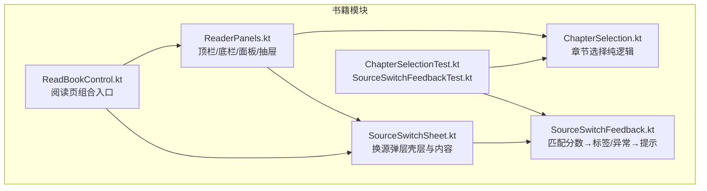
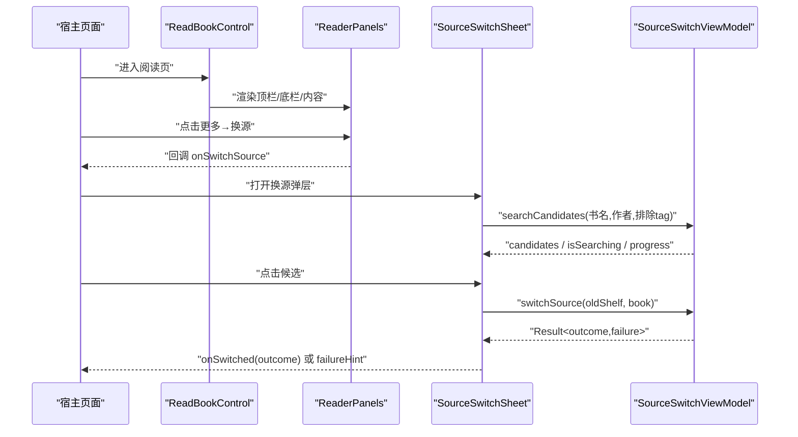
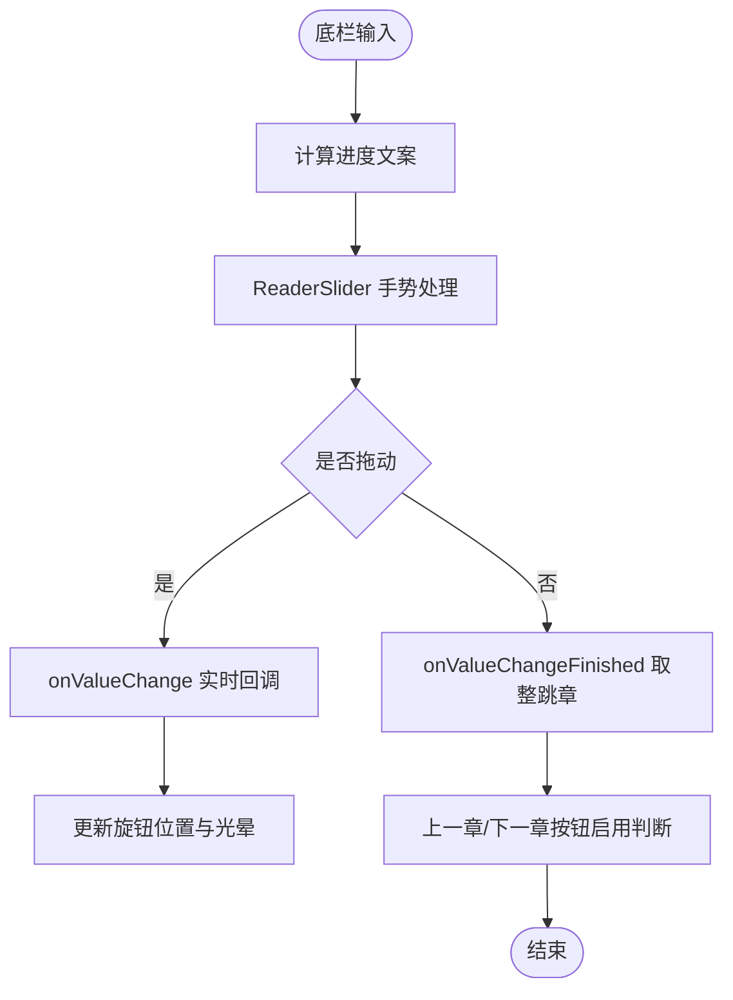
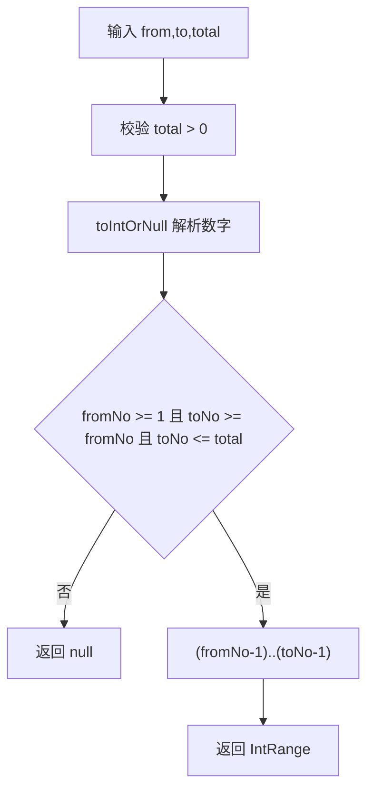
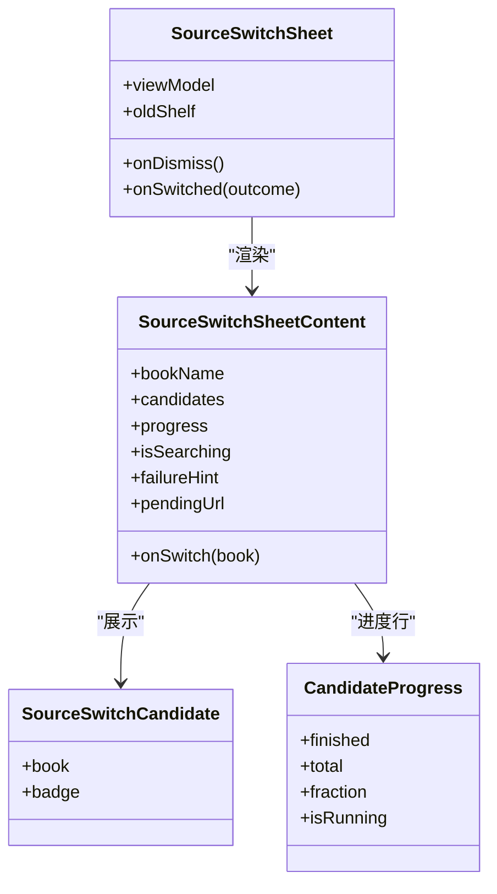
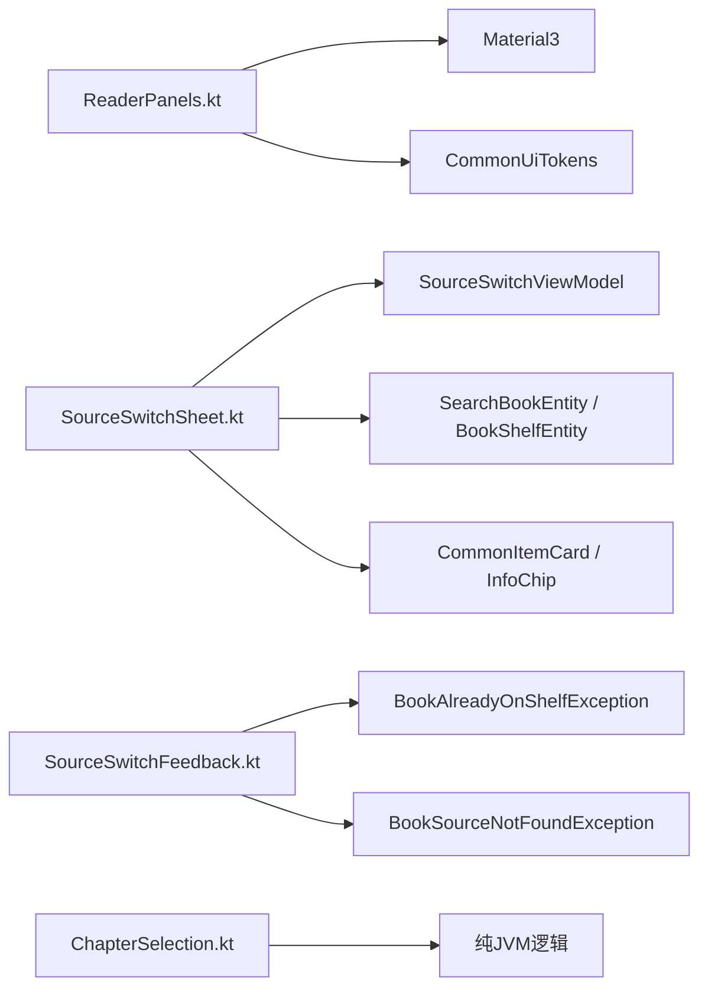

# UI交互界面

<cite>
**本文引用的文件**   
- [ReaderPanels.kt](file://module_book/src/main/java/com/ebook/book/reader/ReaderPanels.kt)
- [ChapterSelection.kt](file://module_book/src/main/java/com/ebook/book/reader/ChapterSelection.kt)
- [SourceSwitchSheet.kt](file://module_book/src/main/java/com/ebook/book/reader/SourceSwitchSheet.kt)
- [SourceSwitchFeedback.kt](file://module_book/src/main/java/com/ebook/book/reader/SourceSwitchFeedback.kt)
- [ReadBookControl.kt](file://module_book/src/main/java/com/ebook/book/view/ReadBookControl.kt)
- [ChapterSelectionTest.kt](file://module_book/src/test/java/com/ebook/book/reader/ChapterSelectionTest.kt)
- [SourceSwitchFeedbackTest.kt](file://module_book/src/test/java/com/ebook/book/reader/SourceSwitchFeedbackTest.kt)
</cite>

## 目录
1. [引言](#引言)
2. [项目结构](#项目结构)
3. [核心组件](#核心组件)
4. [架构总览](#架构总览)
5. [详细组件分析](#详细组件分析)
6. [依赖关系分析](#依赖关系分析)
7. [性能与可访问性](#性能与可访问性)
8. [动画与用户反馈](#动画与用户反馈)
9. [样式与主题适配](#样式与主题适配)
10. [Compose示例与测试方法](#compose示例与测试方法)
11. [故障排查](#故障排查)
12. [结论](#结论)

## 引言
本文面向阅读器UI交互界面，重点解释以下三部分：
- 阅读器面板系统 ReaderPanels：顶部进度标题栏、底部设置栏与中间内容区域的布局管理。
- 章节目录选择 ChapterSelection：目录树展示、范围选择、下载三态控制以及正倒序索引换算。
- 书源切换对话框 SourceSwitchSheet：多书源候选列表、匹配度标签、异步换源流程与失败提示。

同时说明动画过渡、无障碍语义、自定义滑条实现、主题适配方案，并给出基于现有源码路径的 Compose 示例定位和 UI 测试方法。

## 项目结构
阅读相关 UI 主要位于书籍模块 `module_book` 的 reader 包中；ViewModel 层位于同模块的 mvvm/viewmodel 包中；纯逻辑与反馈映射被拆到独立文件以便 JVM 单测。

**图表来源**
- [ReaderPanels.kt:1-200](file://module_book/src/main/java/com/ebook/book/reader/ReaderPanels.kt#L1-L200)
- [ChapterSelection.kt:1-117](file://module_book/src/main/java/com/ebook/book/reader/ChapterSelection.kt#L1-L117)
- [SourceSwitchSheet.kt:1-200](file://module_book/src/main/java/com/ebook/book/reader/SourceSwitchSheet.kt#L1-L200)
- [SourceSwitchFeedback.kt:1-113](file://module_book/src/main/java/com/ebook/book/reader/SourceSwitchFeedback.kt#L1-L113)
- [ReadBookControl.kt:27](file://module_book/src/main/java/com/ebook/book/view/ReadBookControl.kt#L27)

**章节来源**
- [ReaderPanels.kt:1-200](file://module_book/src/main/java/com/ebook/book/reader/ReaderPanels.kt#L1-L200)
- [ChapterSelection.kt:1-117](file://module_book/src/main/java/com/ebook/book/reader/ChapterSelection.kt#L1-L117)
- [SourceSwitchSheet.kt:1-200](file://module_book/src/main/java/com/ebook/book/reader/SourceSwitchSheet.kt#L1-L200)
- [SourceSwitchFeedback.kt:1-113](file://module_book/src/main/java/com/ebook/book/reader/SourceSwitchFeedback.kt#L1-L113)
- [ReadBookControl.kt:27](file://module_book/src/main/java/com/ebook/book/view/ReadBookControl.kt#L27)

## 核心组件
- ReaderPanel 枚举统一五个面板显隐状态：目录、亮度、字体、设置、书源切换。
- ReaderTopBar 显示返回键、当前章节标题、副标题“书名”，以及更多菜单（下载、刷新、换源、评论）。
- ReaderBottomBar 提供章节进度文本、上一章/下一章按钮、自绘 ReaderSlider、以及四个功能入口胶囊。
- ChapterListDrawer 是左侧滑入的章节目录覆盖层，支持正倒序切换、回到当前章、快速滚动。
- SourceSwitchSheet 是 ModalBottomSheet 形式的换源候选弹层，包含搜索进度、候选列表、换源提交与失败提示。
- ChapterSelection 提供纯函数：下载软上限、范围解析、默认窗口、主操作三态、正倒序索引换算。
- SourceSwitchFeedback 提供纯判定表：匹配分数→标签档、换源结果→反馈、异常→提示档。

**章节来源**
- [ReaderPanels.kt:1-200](file://module_book/src/main/java/com/ebook/book/reader/ReaderPanels.kt#L1-L200)
- [ReaderPanels.kt:580-889](file://module_book/src/main/java/com/ebook/book/reader/ReaderPanels.kt#L580-L889)
- [ReaderPanels.kt:750-953](file://module_book/src/main/java/com/ebook/book/reader/ReaderPanels.kt#L750-L953)
- [ChapterSelection.kt:1-117](file://module_book/src/main/java/com/ebook/book/reader/ChapterSelection.kt#L1-L117)
- [SourceSwitchSheet.kt:1-200](file://module_book/src/main/java/com/ebook/book/reader/SourceSwitchSheet.kt#L1-L200)
- [SourceSwitchFeedback.kt:1-113](file://module_book/src/main/java/com/ebook/book/reader/SourceSwitchFeedback.kt#L1-L113)

## 架构总览
阅读器页面由 ReadBookControl 作为组合入口，组合出 ReaderPanels 提供的顶栏、底栏、内容区与各类面板；换源流程通过 SourceSwitchSheet 与 ViewModel 协作，将候选与结果回传给宿主。

**图表来源**
- [ReadBookControl.kt:27](file://module_book/src/main/java/com/ebook/book/view/ReadBookControl.kt#L27)
- [ReaderPanels.kt:200-583](file://module_book/src/main/java/com/ebook/book/reader/ReaderPanels.kt#L200-L583)
- [SourceSwitchSheet.kt:1-200](file://module_book/src/main/java/com/ebook/book/reader/SourceSwitchSheet.kt#L1-L200)

## 详细组件分析

### 阅读器面板系统 ReaderPanels
ReaderPanels 把阅读器的 chrome 层集中管理，包括：
- ReaderPanel 枚举统一面板状态。
- ReaderChromeTokens 集中定义阅读器专属设计常量：顶栏高度、图标块尺寸、滑条轨道厚度、旋钮静止/按下直径等。
- ReaderTopBar：
  - 使用 Surface + shadowElevation 让顶栏浮于正文之上。
  - 标题居中，副标题常驻显示书名；更多菜单根据本地书/网络书分支隐藏换源入口。
  - 边缘避让使用 statusBarsPadding，背景延伸到状态栏后方保持视觉连续。
- ReaderBottomBar：
  - 显示章节进度文本，例如“第 X 章 · 共 Y 章”。
  - 上一章/下一章为圆形 IconButton，禁用态淡出。
  - ReaderSlider 是自绘紧凑滑条，替代 Material3 Slider，避免手柄抢视线。
  - 四联排入口：目录、亮度、字体、设置，选中态用 secondaryContainer 胶囊高亮。
- ChapterListDrawer：
  - 左侧滑入覆盖层，宽度为窗口宽度的 80% 且不超过 320dp。
  - 正序打开定位到当前章；倒序打开停在顶部。
  - 支持顺序切换、回到当前章、右侧快速滚动条。
  - 遮罩淡入淡出，点击空白关闭。

**图表来源**
- [ReaderPanels.kt:200-583](file://module_book/src/main/java/com/ebook/book/reader/ReaderPanels.kt#L200-L583)
- [ReaderPanels.kt:580-889](file://module_book/src/main/java/com/ebook/book/reader/ReaderPanels.kt#L580-L889)

**章节来源**
- [ReaderPanels.kt:1-200](file://module_book/src/main/java/com/ebook/book/reader/ReaderPanels.kt#L1-L200)
- [ReaderPanels.kt:200-583](file://module_book/src/main/java/com/ebook/book/reader/ReaderPanels.kt#L200-L583)
- [ReaderPanels.kt:580-889](file://module_book/src/main/java/com/ebook/book/reader/ReaderPanels.kt#L580-L889)
- [ReaderPanels.kt:750-953](file://module_book/src/main/java/com/ebook/book/reader/ReaderPanels.kt#L750-L953)

### 章节目录选择 ChapterSelection
ChapterSelection 不包含 Compose，只暴露纯函数，用于：
- 下载软上限 MAX_DOWNLOAD_SELECTION = 500。
- exceedsSelectionCap 判断是否超出软上限。
- parseChapterRange 将用户输入的 1-based 起止章号转换为 0-based 闭区间，非法输入返回 null。
- defaultChapterWindow 以焦点章起 50 章为默认窗口，封顶到最后一章。
- defaultRangeSelection 优先取已勾选边界，否则退回焦点窗口或第一章起 50 章。
- BookDownloadAction 三态：下载、暂停、继续；isEnabledWith 限定“下载”需要有效勾选。
- originalIndexAt 与 displayPositionOf 互为逆运算，支持正序/倒序列表索引转换。

**图表来源**
- [ChapterSelection.kt:1-117](file://module_book/src/main/java/com/ebook/book/reader/ChapterSelection.kt#L1-L117)

**章节来源**
- [ChapterSelection.kt:1-117](file://module_book/src/main/java/com/ebook/book/reader/ChapterSelection.kt#L1-L117)
- [ChapterSelectionTest.kt:1-204](file://module_book/src/test/java/com/ebook/book/reader/ChapterSelectionTest.kt#L1-L204)

### 书源切换对话框 SourceSwitchSheet
SourceSwitchSheet 是换源的主交互壳层：
- 使用 ModalBottomSheet 承载 sheet body。
- 打开时调用 viewModel.searchCandidates(bookName, bookAuthor, tag)。
- 收集 candidates、progress、isSearching、searchFailure。
- pendingUrl 作为一次只能执行一笔换源的闸门，防止并发写库。
- 成功回调 onSwitched(SourceSwitchOutcome)，失败在面板内显示 failureHint。
- SourceSwitchSheetContent 是无状态根，负责候选列表、空态、加载态、进度行。

**图表来源**
- [SourceSwitchSheet.kt:1-200](file://module_book/src/main/java/com/ebook/book/reader/SourceSwitchSheet.kt#L1-L200)
- [SourceSwitchSheet.kt:200-450](file://module_book/src/main/java/com/ebook/book/reader/SourceSwitchSheet.kt#L200-L450)

**章节来源**
- [SourceSwitchSheet.kt:1-200](file://module_book/src/main/java/com/ebook/book/reader/SourceSwitchSheet.kt#L1-L200)
- [SourceSwitchSheet.kt:200-450](file://module_book/src/main/java/com/ebook/book/reader/SourceSwitchSheet.kt#L200-L450)

## 依赖关系分析
- ReaderPanels 依赖 MaterialTheme、CommonUiTokens、资源字符串，以及与阅读器相关的实体类型。
- SourceSwitchSheet 依赖 ViewModel 流、SearchBookEntity、BookShelfEntity、CommonItemCard、InfoChip。
- SourceSwitchFeedback 不依赖 Compose，仅依赖仓库异常与书源异常类型，输出枚举。
- ChapterSelection 完全不依赖 UI，是纯 JVM 可测逻辑。

**图表来源**
- [ReaderPanels.kt:1-200](file://module_book/src/main/java/com/ebook/book/reader/ReaderPanels.kt#L1-L200)
- [SourceSwitchSheet.kt:1-200](file://module_book/src/main/java/com/ebook/book/reader/SourceSwitchSheet.kt#L1-L200)
- [SourceSwitchFeedback.kt:1-113](file://module_book/src/main/java/com/ebook/book/reader/SourceSwitchFeedback.kt#L1-L113)
- [ChapterSelection.kt:1-117](file://module_book/src/main/java/com/ebook/book/reader/ChapterSelection.kt#L1-L117)

**章节来源**
- [ReaderPanels.kt:1-200](file://module_book/src/main/java/com/ebook/book/reader/ReaderPanels.kt#L1-L200)
- [SourceSwitchSheet.kt:1-200](file://module_book/src/main/java/com/ebook/book/reader/SourceSwitchSheet.kt#L1-L200)
- [SourceSwitchFeedback.kt:1-113](file://module_book/src/main/java/com/ebook/book/reader/SourceSwitchFeedback.kt#L1-L113)
- [ChapterSelection.kt:1-117](file://module_book/src/main/java/com/ebook/book/reader/ChapterSelection.kt#L1-L117)

## 性能与可访问性
- 目录抽屉使用 rememberLazyListState 和 remember(chapters, descending) 缓存反转视图，避免每帧重建。
- ReaderSlider 使用 animateDpAsState 与 animateFloatAsState 控制旋钮大小和光晕透明度，避免无意义重组抖动。
- 无障碍方面：
  - ReaderSlider 通过 semantics.progressBarRangeInfo 表达进度滑条。
  - 目录顺序切换使用 stateDescription 补充“当前模式”语义。
  - 顶栏/底栏图标使用 contentDescription 提供语义描述。

**章节来源**
- [ReaderPanels.kt:580-889](file://module_book/src/main/java/com/ebook/book/reader/ReaderPanels.kt#L580-L889)
- [ReaderPanels.kt:750-953](file://module_book/src/main/java/com/ebook/book/reader/ReaderPanels.kt#L750-L953)

## 动画与用户反馈
- 顶栏/底栏：Surface 阴影与胶囊高亮提供层级与选中反馈。
- 目录抽屉：AnimatedVisibility 配合 fadeIn/fadeOut 与 slideInHorizontally/slideOutHorizontally 完成遮罩与侧边面板动画。
- ReaderSlider：按下时光晕淡入、旋钮放大，抬起后恢复；位置映射固定以静止旋钮直径为基准，避免数值抖动。
- 换源面板：
  - 搜索中显示线性进度条与“已收到 X/Y 个书源的结果”。
  - 候选列表项出现 CircularProgressIndicator + “正在应用”提示。
  - 失败提示常驻列表上方，允许用户立即另选一本。

**章节来源**
- [ReaderPanels.kt:200-583](file://module_book/src/main/java/com/ebook/book/reader/ReaderPanels.kt#L200-L583)
- [ReaderPanels.kt:580-889](file://module_book/src/main/java/com/ebook/book/reader/ReaderPanels.kt#L580-L889)
- [ReaderPanels.kt:750-953](file://module_book/src/main/java/com/ebook/book/reader/ReaderPanels.kt#L750-L953)
- [SourceSwitchSheet.kt:200-450](file://module_book/src/main/java/com/ebook/book/reader/SourceSwitchSheet.kt#L200-L450)

## 样式与主题适配
- 所有颜色使用 MaterialTheme.colorScheme 相关字段：surfaceContainer、onSurface、secondaryContainer、primary、outlineVariant 等。
- 阅读器专属常量集中在 ReaderChromeTokens，避免散落魔法值。
- 共享通用间距与圆角走 CommonUiTokens，阅读器内部只维护阅读器特有值。
- 主题深浅色自动生效：面板不额外套 MaterialTheme，继承宿主 AppTheme。

**章节来源**
- [ReaderPanels.kt:1-200](file://module_book/src/main/java/com/ebook/book/reader/ReaderPanels.kt#L1-L200)
- [SourceSwitchSheet.kt:200-450](file://module_book/src/main/java/com/ebook/book/reader/SourceSwitchSheet.kt#L200-L450)

## Compose示例与测试方法
本节不粘贴代码，而是给出源码中的关键 Composable 与测试类路径，便于直接定位实现。

- 顶栏示例：
  - 入口：ReaderTopBar
  - 参考路径：[ReaderPanels.kt:200-583](file://module_book/src/main/java/com/ebook/book/reader/ReaderPanels.kt#L200-L583)
- 底栏示例：
  - 入口：ReaderBottomBar
  - 子组件：ChapterStepButton、ReaderSlider、ReaderBottomEntry
  - 参考路径：[ReaderPanels.kt:200-583](file://module_book/src/main/java/com/ebook/book/reader/ReaderPanels.kt#L200-L583)、[ReaderPanels.kt:580-889](file://module_book/src/main/java/com/ebook/book/reader/ReaderPanels.kt#L580-L889)
- 目录抽屉示例：
  - 入口：ChapterListDrawer
  - 参考路径：[ReaderPanels.kt:750-953](file://module_book/src/main/java/com/ebook/book/reader/ReaderPanels.kt#L750-L953)
- 换源弹层示例：
  - 壳层：SourceSwitchSheet
  - 内容根：SourceSwitchSheetContent
  - 候选行：CandidateRow
  - 参考路径：[SourceSwitchSheet.kt:1-200](file://module_book/src/main/java/com/ebook/book/reader/SourceSwitchSheet.kt#L1-L200)、[SourceSwitchSheet.kt:200-450](file://module_book/src/main/java/com/ebook/book/reader/SourceSwitchSheet.kt#L200-L450)
- 章节选择纯逻辑示例：
  - 入口函数：parseChapterRange、defaultChapterWindow、defaultRangeSelection、bookDownloadActionOf
  - 参考路径：[ChapterSelection.kt:1-117](file://module_book/src/main/java/com/ebook/book/reader/ChapterSelection.kt#L1-L117)

测试方法：
- 章节选择纯逻辑单元测试：
  - 类：ChapterSelectionTest
  - 覆盖下载软上限、主操作三态、倒序索引换算、范围解析、默认窗口
  - 参考路径：[ChapterSelectionTest.kt:1-204](file://module_book/src/test/java/com/ebook/book/reader/ChapterSelectionTest.kt#L1-L204)
- 换源反馈映射单元测试：
  - 类：SourceSwitchFeedbackTest
  - 覆盖 matchBadgeOf、switchFeedbackOf、switchFailureHintOf
  - 参考路径：[SourceSwitchFeedbackTest.kt:1-91](file://module_book/src/test/java/com/ebook/book/reader/SourceSwitchFeedbackTest.kt#L1-L91)

**章节来源**
- [ReaderPanels.kt:200-583](file://module_book/src/main/java/com/ebook/book/reader/ReaderPanels.kt#L200-L583)
- [ReaderPanels.kt:580-889](file://module_book/src/main/java/com/ebook/book/reader/ReaderPanels.kt#L580-L889)
- [ReaderPanels.kt:750-953](file://module_book/src/main/java/com/ebook/book/reader/ReaderPanels.kt#L750-L953)
- [SourceSwitchSheet.kt:1-200](file://module_book/src/main/java/com/ebook/book/reader/SourceSwitchSheet.kt#L1-L200)
- [SourceSwitchSheet.kt:200-450](file://module_book/src/main/java/com/ebook/book/reader/SourceSwitchSheet.kt#L200-L450)
- [ChapterSelection.kt:1-117](file://module_book/src/main/java/com/ebook/book/reader/ChapterSelection.kt#L1-L117)
- [ChapterSelectionTest.kt:1-204](file://module_book/src/test/java/com/ebook/book/reader/ChapterSelectionTest.kt#L1-L204)
- [SourceSwitchFeedbackTest.kt:1-91](file://module_book/src/test/java/com/ebook/book/reader/SourceSwitchFeedbackTest.kt#L1-L91)

## 故障排查
- 换源失败提示：
  - 书源不存在：SwitchFailureHint.SourceInvalid，提示用户另选一本或回书源管理页重导。
  - 目标已在书架上：SwitchFailureHint.AlreadyOnShelf，提示用户去读架上那本。
  - 其他异常：SwitchFailureHint.Generic，兜底提示“书架未受影响”。
  - 候选整轮失败：SwitchFailureHint.SearchFailed，由搜索阶段失败状态直接给出。
  - 参考路径：[SourceSwitchFeedback.kt:1-113](file://module_book/src/main/java/com/ebook/book/reader/SourceSwitchFeedback.kt#L1-L113)
- 目录为空但报喜：
  - switchFeedbackOf 必须先判 chapterCount ≤ 0，再判 clamped，否则空目录会误报 Moved。
  - 参考路径：[SourceSwitchFeedback.kt:1-113](file://module_book/src/main/java/com/ebook/book/reader/SourceSwitchFeedback.kt#L1-L113)
- 下拉面板遮挡入口：
  - 底栏四入口使用 activePanel 高亮当前面板，避免面板被下拉把手遮住后看不出哪个入口打开。
  - 参考路径：[ReaderPanels.kt:200-583](file://module_book/src/main/java/com/ebook/book/reader/ReaderPanels.kt#L200-L583)
- 滑条取值抖动：
  - ReaderSlider 以静止旋钮直径为位置映射基准，不按按下后放大尺寸变化，避免同一触点换算成不同值。
  - 参考路径：[ReaderPanels.kt:580-889](file://module_book/src/main/java/com/ebook/book/reader/ReaderPanels.kt#L580-L889)

**章节来源**
- [SourceSwitchFeedback.kt:1-113](file://module_book/src/main/java/com/ebook/book/reader/SourceSwitchFeedback.kt#L1-L113)
- [ReaderPanels.kt:200-583](file://module_book/src/main/java/com/ebook/book/reader/ReaderPanels.kt#L200-L583)
- [ReaderPanels.kt:580-889](file://module_book/src/main/java/com/ebook/book/reader/ReaderPanels.kt#L580-L889)

## 结论
ReaderPanels 将阅读器 chrome 层的布局、手势与主题语言统一到一组 Composable 中；ChapterSelection 把容易静默出错的章节选择逻辑抽离为纯函数并由 JVM 单测锁定；SourceSwitchSheet 以弹层形式组织换源候选、进度与失败反馈，并通过纯判定表保证上屏文案正确。整体设计强调：
- 状态收敛：ReaderPanel 枚举统一管理面板显隐。
- 纯逻辑可测：ChapterSelection 与 SourceSwitchFeedback 可独立断言。
- 用户体验一致：顶栏浮层、底栏胶囊、侧边抽屉、ModalBottomSheet 共用同一套主题与节奏。
- 反馈明确：进度滑条、候选列表、失败提示、无障碍语义共同构成可感知交互。