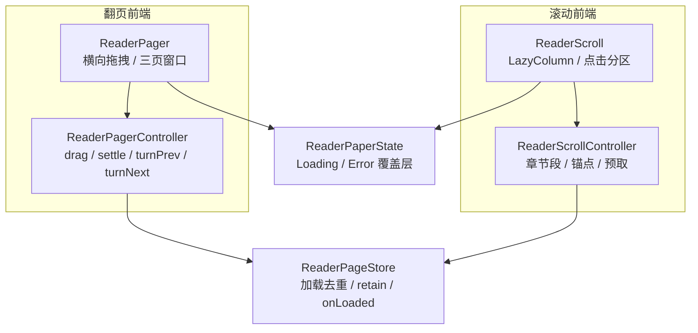
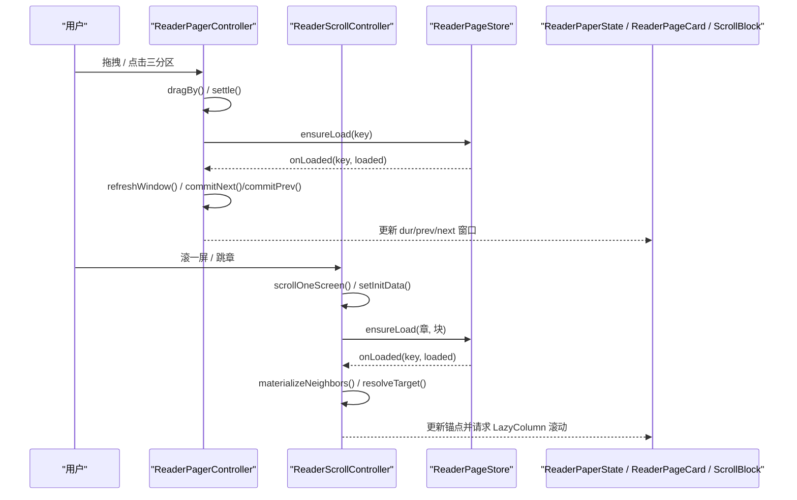
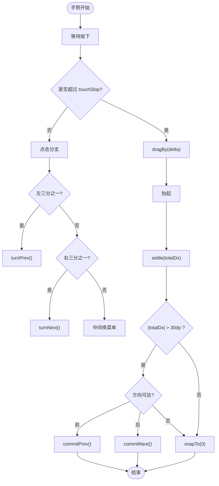
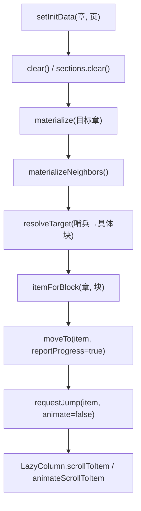
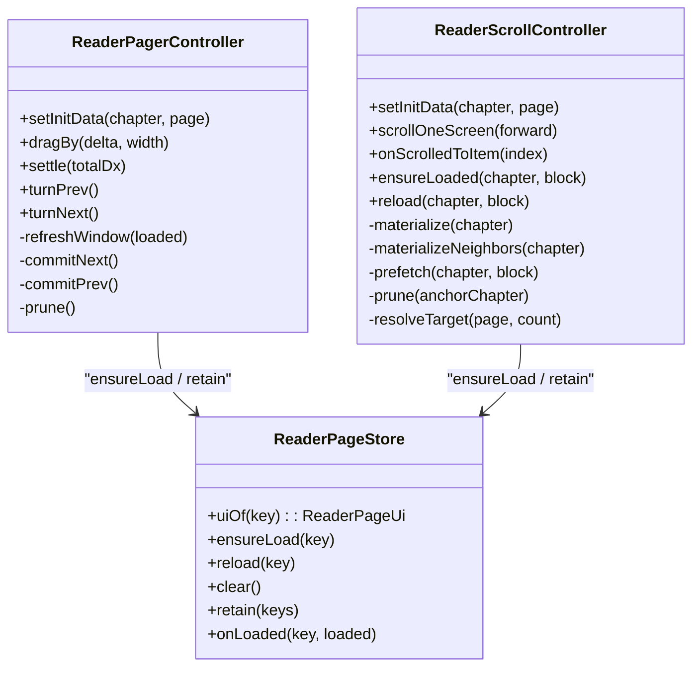
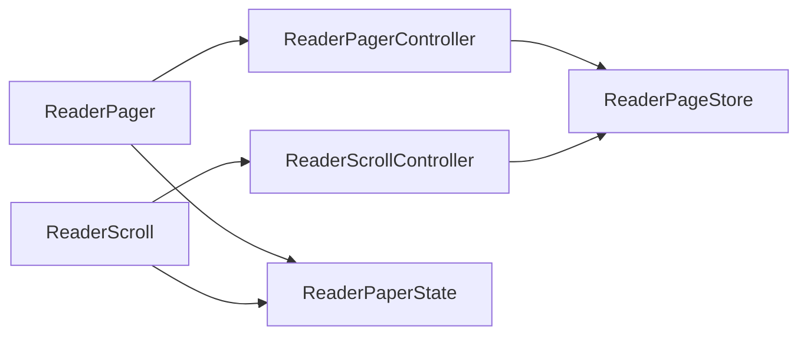

# 导航控制机制

<cite>
**本文引用的文件**   
- [ReaderPager.kt](file://module_book/src/main/java/com/ebook/book/reader/ReaderPager.kt)
- [ReaderPaperState.kt](file://module_book/src/main/java/com/ebook/book/reader/ReaderPaperState.kt)
- [ReaderScrollController.kt](file://module_book/src/main/java/com/ebook/book/reader/ReaderScrollController.kt)
- [ReaderScroll.kt](file://module_book/src/main/java/com/ebook/book/reader/ReaderScroll.kt)
- [ReaderPageStore.kt](file://module_book/src/main/java/com/ebook/book/reader/ReaderPageStore.kt)
</cite>

## 目录
1. [引言](#引言)
2. [项目结构](#项目结构)
3. [核心组件](#核心组件)
4. [架构总览](#架构总览)
5. [详细组件分析](#详细组件分析)
6. [依赖关系分析](#依赖关系分析)
7. [性能与行为特征](#性能与行为特征)
8. [常见问题与排障](#常见问题与排障)
9. [结论](#结论)

## 引言
本文件聚焦阅读器导航控制机制，围绕两种并列的前端实现展开：翻页模式（基于 ReaderPager）与滚动模式（基于 ReaderScrollController）。两者共享同一加载仓库与页面状态模型，但在几何、手势、边界和回弹策略上各自独立。文档将解释翻页状态机、手势识别与边界检测、惯性滚动与位置同步、以及可配置项与常见问题定位方法。

## 项目结构
导航控制相关代码集中在 module_book 的 reader 包中，按职责拆分为控制器、UI 容器、状态覆盖层与加载仓库：
- ReaderPager.kt：翻页容器与三页窗口控制器，负责横向拖拽、阈值判定、动画与窗口收敛。
- ReaderScrollController.kt：跨章连续列表控制器，负责章节段物化、锚点、预取与内存裁剪。
- ReaderScroll.kt：滚动模式 UI 容器，封装 LazyColumn、点击分区、视口尺寸回调与常驻位置行。
- ReaderPaperState.kt：统一的“纸面态”覆盖层，承载加载中与失败重试两态。
- ReaderPageStore.kt：加载去重、任务取消、保留集裁剪与 Loaded 回调分发。

图表来源
- [ReaderPager.kt:1-200](file://module_book/src/main/java/com/ebook/book/reader/ReaderPager.kt#L1-L200)
- [ReaderScrollController.kt:1-200](file://module_book/src/main/java/com/ebook/book/reader/ReaderScrollController.kt#L1-L200)
- [ReaderScroll.kt:1-200](file://module_book/src/main/java/com/ebook/book/reader/ReaderScroll.kt#L1-L200)
- [ReaderPaperState.kt:1-123](file://module_book/src/main/java/com/ebook/book/reader/ReaderPaperState.kt#L1-L123)
- [ReaderPageStore.kt:1-98](file://module_book/src/main/java/com/ebook/book/reader/ReaderPageStore.kt#L1-L98)

章节来源
- [ReaderPager.kt:1-200](file://module_book/src/main/java/com/ebook/book/reader/ReaderPager.kt#L1-L200)
- [ReaderScrollController.kt:1-200](file://module_book/src/main/java/com/ebook/book/reader/ReaderScrollController.kt#L1-L200)
- [ReaderScroll.kt:1-200](file://module_book/src/main/java/com/ebook/book/reader/ReaderScroll.kt#L1-L200)
- [ReaderPaperState.kt:1-123](file://module_book/src/main/java/com/ebook/book/reader/ReaderPaperState.kt#L1-L123)
- [ReaderPageStore.kt:1-98](file://module_book/src/main/java/com/ebook/book/reader/ReaderPageStore.kt#L1-L98)

## 核心组件
- ReaderPageKey：以（章节索引，页码）为标识的页面键；在翻页模式中用于三页窗口，在滚动模式中作为块号。
- ReaderPageUi：页面渲染状态的密封接口，包含 Loading、Error、Loaded 三种形态。
- ReaderPaperState：统一的加载/失败覆盖层，避免翻页与滚动两套 UI 不一致。
- ReaderPageStore：加载仓库，提供 ensureLoad、reload、clear、retain 与 onLoaded 回调。
- ReaderPagerController：三页窗口控制器，管理 durKey/prevKey/nextKey、drag 位移、settle 收尾动画、turnPrev/turnNext 程序化翻页及窗口收敛。
- ReaderScrollController：滚动控制器，维护章节段 sections、锚点 anchorItem、jump 落点、物化 neighbors、预取 prefetch、内存 prune 与哨兵解析。

章节来源
- [ReaderPager.kt:1-200](file://module_book/src/main/java/com/ebook/book/reader/ReaderPager.kt#L1-L200)
- [ReaderPaperState.kt:1-123](file://module_book/src/main/java/com/ebook/book/reader/ReaderPaperState.kt#L1-L123)
- [ReaderPageStore.kt:1-98](file://module_book/src/main/java/com/ebook/book/reader/ReaderPageStore.kt#L1-L98)
- [ReaderScrollController.kt:1-200](file://module_book/src/main/java/com/ebook/book/reader/ReaderScrollController.kt#L1-L200)

## 架构总览
翻页与滚动两条路径最终都落到同一组页面状态与加载仓库。差异在于：
- 翻页：横向三页窗口 + 水平 drag + 阈值判定成败 + 窗口裁剪到三个键。
- 滚动：纵向跨章 item 列表 + LazyColumn 惯性滚动 + 章节段惰性物化 + 按章半径裁剪。

图表来源
- [ReaderPager.kt:201-560](file://module_book/src/main/java/com/ebook/book/reader/ReaderPager.kt#L201-L560)
- [ReaderScrollController.kt:201-399](file://module_book/src/main/java/com/ebook/book/reader/ReaderScrollController.kt#L201-L399)
- [ReaderPageStore.kt:1-98](file://module_book/src/main/java/com/ebook/book/reader/ReaderPageStore.kt#L1-L98)

## 详细组件分析

### 翻页模式（ReaderPager 与 ReaderPagerController）
- 三页窗口：当前页（dur）、上一页（prev）、下一页（next），z 序为 next < dur < prev。
- 手势流程：
  - 按下后记录起始坐标；超过 touchSlop 进入拖动；拖动期间消费事件并调用 dragBy(delta)。
  - 抬起时计算 totalDx，若未移动则视为点击，左右三分之一区域触发 turnPrev/turnNext，中间区域唤菜单。
  - 拖动超过 30dp 阈值且方向可达则翻页成功，否则回弹至 0。
- 状态机要点：
  - isMoving 防止并发动画；settle 先驱动 Animatable.drag 再提交 commitPrev/commitNext。
  - commitNext/commitPrev 把目标页提升为 durKey，随后 refreshWindow 计算新的 prevKey/nextKey；若目标页尚未 Loaded，则按“来路页留作相邻方向、未知方向收敛为 null”的规则保持窗口不变量。
  - 每次提交后调用 prune() 只保留 dur/prev/next 三个键，避免跨章累积。
- 边界检测与回弹：
  - 当 prevKey 或 nextKey 为 null 时，对应方向不可翻；toast 提示无上一页/下一页。
  - dragBy 内部用 widthPx 钳制位移范围，保证不会滑出有效窗口。
  - settle 根据 totalDx 方向与阈值决定是否 animateTo(widthPx/-widthPx) 或回到 0。

图表来源
- [ReaderPager.kt:201-560](file://module_book/src/main/java/com/ebook/book/reader/ReaderPager.kt#L201-L560)

章节来源
- [ReaderPager.kt:1-200](file://module_book/src/main/java/com/ebook/book/reader/ReaderPager.kt#L1-L200)
- [ReaderPager.kt:201-560](file://module_book/src/main/java/com/ebook/book/reader/ReaderPager.kt#L201-L560)

### 滚动模式（ReaderScrollController 与 ReaderScroll）
- 列表模型：
  - 章节段 ChapterSection = 标题项 + blockCount 个正文块。
  - 列表按章节顺序扁平拼接，跨章不需要切换逻辑。
  - 未排版落定时，章节仅占一个占位块，避免断链。
- 锚点与滚动落点：
  - anchorItem 保存语义值（章, 块），不保存扁平序号，以避免上方插入导致偏移。
  - jump 携带 itemIndex、animate、token；token 自增确保同一落点可重复触发。
  - LazyColumn 通过稳定 key 保锚定，组合变化时视觉位置不变。
- 物化与预取：
  - materialize(chapterIndex) 插入章节段并探测第 0 块；materializeNeighbors 预热相邻两章。
  - prefetch 对锚点前后若干块发起 ensureLoad，平滑体验但非唯一来源。
  - ensureLoaded 由每个块自行触发，兜底 fling 跳过中间块的场景。
- 进度与位置同步：
  - onScrolledToItem 接收 firstVisibleItemIndex，换算为 (章, 块) 后 moveTo；标题项 ↔ 第 0 块不算阅读推进。
  - setInitData 清理状态、物化目标章与邻居、解析哨兵落点、立即 requestJump。
- 惯性滚动与速度：
  - 竖向滚动完全交给 LazyColumn 的内置惯性（fling），外部 pointerInput 只区分点击与拖拽，不消费纵向 drag，从而获得系统级流畅惯性。

图表来源
- [ReaderScrollController.kt:201-399](file://module_book/src/main/java/com/ebook/book/reader/ReaderScrollController.kt#L201-L399)
- [ReaderScroll.kt:1-200](file://module_book/src/main/java/com/ebook/book/reader/ReaderScroll.kt#L1-L200)

章节来源
- [ReaderScrollController.kt:1-200](file://module_book/src/main/java/com/ebook/book/reader/ReaderScrollController.kt#L1-L200)
- [ReaderScrollController.kt:201-399](file://module_book/src/main/java/com/ebook/book/reader/ReaderScrollController.kt#L201-L399)
- [ReaderScroll.kt:1-200](file://module_book/src/main/java/com/ebook/book/reader/ReaderScroll.kt#L1-L200)

### 页面状态覆盖层（ReaderPaperState）
- 统一绘制 Loading 与 Error 两态，Loaded 分支为空操作（正文由调用方绘制）。
- 配色使用传入 textColor 派生透明度，避免与深浅色主题冲突。
- Error 态提供胶囊样式的重试按钮，点击回调交由上层 reload。

章节来源
- [ReaderPaperState.kt:1-123](file://module_book/src/main/java/com/ebook/book/reader/ReaderPaperState.kt#L1-L123)

### 加载仓库（ReaderPageStore）
- 去重：jobs 登记在途任务，pages 缓存已就绪状态；ensureLoad 对已 Loaded 短路，避免快速回翻闪转圈。
- 生命周期：clear 取消全部 job 并清空 pages；retain 剔除不在保留集的 key 及其 job。
- 回调：onLoaded 由前端决定如何重算几何；翻页模式检查 key == durKey，滚动模式检查章节是否仍在物化范围内。

图表来源
- [ReaderPageStore.kt:1-98](file://module_book/src/main/java/com/ebook/book/reader/ReaderPageStore.kt#L1-L98)
- [ReaderPager.kt:1-200](file://module_book/src/main/java/com/ebook/book/reader/ReaderPager.kt#L1-L200)
- [ReaderScrollController.kt:1-200](file://module_book/src/main/java/com/ebook/book/reader/ReaderScrollController.kt#L1-L200)

章节来源
- [ReaderPageStore.kt:1-98](file://module_book/src/main/java/com/ebook/book/reader/ReaderPageStore.kt#L1-L98)

## 依赖关系分析
- 耦合度：
  - ReaderPagerController 与 ReaderScrollController 均依赖 ReaderPageStore，但不直接互相引用，耦合低。
  - UI 层 ReaderPager / ReaderScroll 分别持有控制器实例，并通过 ReaderPaperState 共用加载/失败覆盖层。
- 外部依赖：
  - Compose 手势 API（awaitEachGesture、pointerInput）、Animatable、LazyColumn、WindowInsets。
  - 数据库/事件口径 DBCode.BookContentView.DUR_PAGE_INDEX_BEGIN/END 作为哨兵页码。
- 循环依赖：
  - ReaderScrollController 中将 store 声明在属性之后以避免初始化顺序问题，避免循环依赖。

图表来源
- [ReaderPager.kt:1-200](file://module_book/src/main/java/com/ebook/book/reader/ReaderPager.kt#L1-L200)
- [ReaderScroll.kt:1-200](file://module_book/src/main/java/com/ebook/book/reader/ReaderScroll.kt#L1-L200)
- [ReaderPageStore.kt:1-98](file://module_book/src/main/java/com/ebook/book/reader/ReaderPageStore.kt#L1-L98)

章节来源
- [ReaderPager.kt:1-200](file://module_book/src/main/java/com/ebook/book/reader/ReaderPager.kt#L1-L200)
- [ReaderScroll.kt:1-200](file://module_book/src/main/java/com/ebook/book/reader/ReaderScroll.kt#L1-L200)
- [ReaderPageStore.kt:1-98](file://module_book/src/main/java/com/ebook/book/reader/ReaderPageStore.kt#L1-L98)

## 性能与行为特征
- 翻页模式：
  - 布局期 offset 读取 drag，避免动画期间重组；仅触发重布局。
  - 始终 prune 到三页窗口，限制内存占用。
  - 30dp 阈值判定降低误触；isMoving 防并发。
- 滚动模式：
  - LazyColumn 自带惯性滚动与 fling，无需手写阻尼计算。
  - 章节段惰性物化与相邻章预热减少首屏卡顿。
  - 预取邻域块提升连续性；按章半径 retain 避免同章回滚闪转圈。
  - 通过稳定 key 与 LazyColumn 锚定机制，保证上方插入 item 时视觉位置稳定。
- 加载仓库：
  - 已 Loaded 页面不重复抓取，避免网络/DB 浪费与整章重排。
  - retain 统一清理策略，两端按需传入不同半径单位（翻页=3个键；滚动=±2 章）。

章节来源
- [ReaderPager.kt:201-560](file://module_book/src/main/java/com/ebook/book/reader/ReaderPager.kt#L201-L560)
- [ReaderScrollController.kt:201-399](file://module_book/src/main/java/com/ebook/book/reader/ReaderScrollController.kt#L201-L399)
- [ReaderPageStore.kt:1-98](file://module_book/src/main/java/com/ebook/book/reader/ReaderPageStore.kt#L1-L98)

## 常见问题与排障
- 翻页后无法返回上一页
  - 现象：翻到下一页后 prevKey 为 null，回翻无效。
  - 原因：目标页尚未 Loaded 时 commitNext 采用“来路页留作上一页、去向收敛为 null”的收敛规则，需等该页加载完成后再刷新窗口。
  - 处理：触发本页 ensureLoad；或在回翻后再翻一次以重新构建窗口。
  - 参考：[ReaderPager.kt:201-560](file://module_book/src/main/java/com/ebook/book/reader/ReaderPager.kt#L201-L560)
- 滚动模式下首屏停留在加载态
  - 现象：冷启动恢复或跳章后长时间显示 Loading。
  - 原因：哨兵页码需在块数落定后解析成具体块；解析前 anchor 暂记章首，需补发对应块的加载。
  - 处理：确保 setInitData 正确调用 materialize 与 materializeNeighbors，并在 onLoaded 中 resolveTarget 后 requestJump。
  - 参考：[ReaderScrollController.kt:201-399](file://module_book/src/main/java/com/ebook/book/reader/ReaderScrollController.kt#L201-L399)
- 快速回翻出现闪烁转圈
  - 现象：来回翻页时短暂显示 Loading 再变回正文。
  - 原因：旧实现可能因状态竞态重复抓取；新实现通过 ensureLoad 对已 Loaded 短路避免。
  - 处理：确认未绕过 ensureLoad 的直接赋值；必要时调用 clear 重置。
  - 参考：[ReaderPageStore.kt:1-98](file://module_book/src/main/java/com/ebook/book/reader/ReaderPageStore.kt#L1-L98)
- 滚动列表位置跳动
  - 现象：章节展开时画面跳变。
  - 原因：item key 不稳定或重复。
  - 处理：使用 controller.itemKey(flatIndex)，确保全局唯一且不包含扁平序号。
  - 参考：[ReaderScrollController.kt:201-399](file://module_book/src/main/java/com/ebook/book/reader/ReaderScrollController.kt#L201-L399)
- 点击分区无效或误触发滚动
  - 现象：点击左右分区没翻页，或点击被当作滚动。
  - 原因：touchSlop 区分了点击与拖拽；纵向 drag 必须不消费，否则与 LazyColumn 抢事件。
  - 处理：仅在 moved=false 时处理点击；纵向移动直接 return。
  - 参考：[ReaderScroll.kt:1-200](file://module_book/src/main/java/com/ebook/book/reader/ReaderScroll.kt#L1-L200)

## 结论
翻页与滚动两种导航模式通过 ReaderPagerController 与 ReaderScrollController 并行实现，共享 ReaderPageStore 与 ReaderPaperState，既保证了行为一致，又保留了各自在几何、手势与内存管理上的优势。翻页模式强调三页窗口与手势阈值判定；滚动模式强调惰性物化、惯性滚动与稳定锚定。二者均以明确的边界检测、收敛规则与 retain 策略保障稳定性与性能。