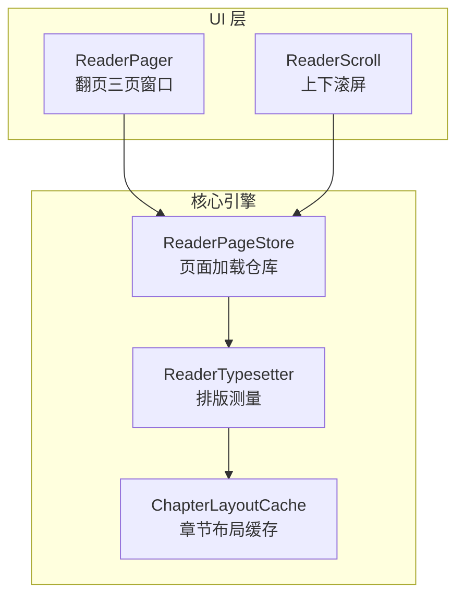
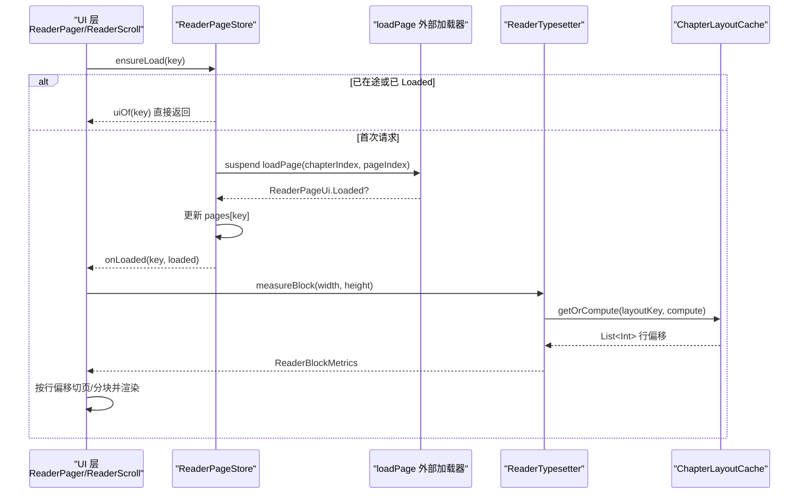
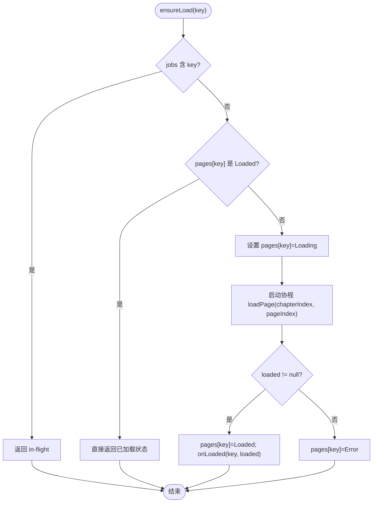
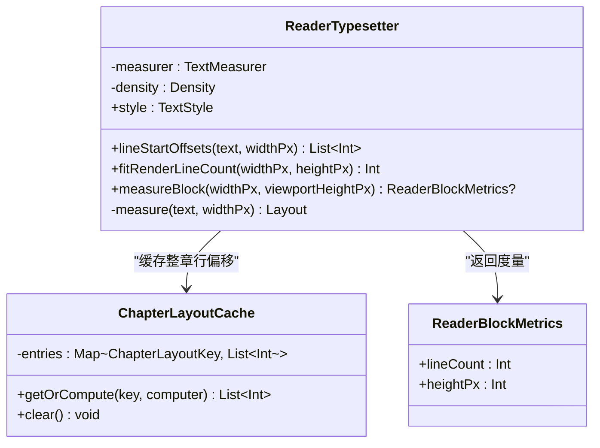
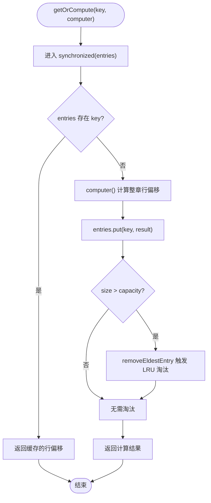
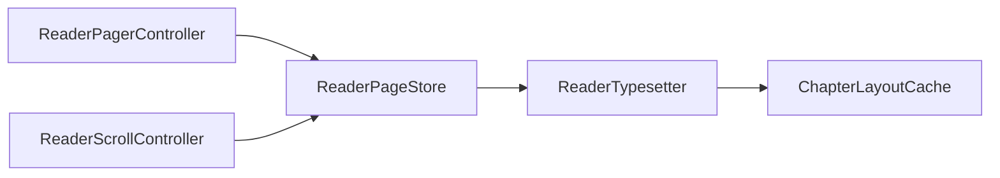

# 阅读器核心引擎

<cite>
**本文引用的文件**   
- [ReaderPageStore.kt](file://module_book/src/main/java/com/ebook/book/reader/ReaderPageStore.kt)
- [ReaderTypesetter.kt](file://module_book/src/main/java/com/ebook/book/reader/ReaderTypesetter.kt)
- [ChapterLayoutCache.kt](file://module_book/src/main/java/com/ebook/book/reader/ChapterLayoutCache.kt)
- [ReaderPager.kt](file://module_book/src/main/java/com/ebook/book/reader/ReaderPager.kt)
- [ReaderScroll.kt](file://module_book/src/main/java/com/ebook/book/reader/ReaderScroll.kt)
- [ReaderPageStoreTest.kt](file://module_book/src/test/java/com/ebook/book/reader/ReaderPageStoreTest.kt)
- [ChapterLayoutCacheTest.kt](file://module_book/src/test/java/com/ebook/book/reader/ChapterLayoutCacheTest.kt)
</cite>

## 目录
1. [引言](#引言)
2. [项目结构](#项目结构)
3. [核心组件](#核心组件)
4. [架构总览](#架构总览)
5. [详细组件分析](#详细组件分析)
6. [依赖关系分析](#依赖关系分析)
7. [性能考量](#性能考量)
8. [故障排查指南](#故障排查指南)
9. [结论](#结论)
10. [附录：扩展与配置](#附录扩展与配置)

## 引言
本技术文档聚焦阅读器的核心引擎，围绕三个关键实现展开：页面存储仓库 ReaderPageStore、排版测量器 ReaderTypesetter、章节布局缓存 ChapterLayoutCache。它们共同承担从章节内容到页面渲染的核心数据流，并在翻页与滚屏两种模式下复用同一套加载去重、状态管理和排版口径。

## 项目结构
阅读器核心逻辑位于 module_book 的 reader 包中：
- ReaderPageStore：页面加载仓库，负责页面状态、在途任务去重和内存裁剪。
- ReaderTypesetter：基于 Compose TextMeasurer 的正文排版与行高测量。
- ChapterLayoutCache：整章行偏移的 LRU 缓存，避免同章重复排版。
- ReaderPager / ReaderScroll：两种 UI 承载方式（翻页三页窗口、滚屏连续列表），均通过 ReaderPageStore 访问页面并触发重新计算几何。

**图表来源**
- [ReaderPager.kt:1-200](file://module_book/src/main/java/com/ebook/book/reader/ReaderPager.kt#L1-L200)
- [ReaderScroll.kt:1-200](file://module_book/src/main/java/com/ebook/book/reader/ReaderScroll.kt#L1-L200)
- [ReaderPageStore.kt:1-98](file://module_book/src/main/java/com/ebook/book/reader/ReaderPageStore.kt#L1-L98)
- [ReaderTypesetter.kt:1-175](file://module_book/src/main/java/com/ebook/book/reader/ReaderTypesetter.kt#L1-L175)
- [ChapterLayoutCache.kt:1-61](file://module_book/src/main/java/com/ebook/book/reader/ChapterLayoutCache.kt#L1-L61)

**章节来源**
- [ReaderPager.kt:1-200](file://module_book/src/main/java/com/ebook/book/reader/ReaderPager.kt#L1-L200)
- [ReaderScroll.kt:1-200](file://module_book/src/main/java/com/ebook/book/reader/ReaderScroll.kt#L1-L200)
- [ReaderPageStore.kt:1-98](file://module_book/src/main/java/com/ebook/book/reader/ReaderPageStore.kt#L1-L98)
- [ReaderTypesetter.kt:1-175](file://module_book/src/main/java/com/ebook/book/reader/ReaderTypesetter.kt#L1-L175)
- [ChapterLayoutCache.kt:1-61](file://module_book/src/main/java/com/ebook/book/reader/ChapterLayoutCache.kt#L1-L61)

## 核心组件
- ReaderPageStore：维护 ReaderPageKey → ReaderPageUi 的状态映射与在途 Job；提供 ensureLoad、reload、clear、retain 等方法；通过 onLoaded 回调通知前端进行几何重算。
- ReaderTypesetter：封装 TextStyle、TextMeasurer、Density；提供 lineStartOffsets、fitRenderLineCount、measureBlock；以探针文本测量行高，保证分页与渲染同源。
- ChapterLayoutCache：以 ChapterLayoutKey 为键缓存整章行偏移；使用 synchronizedMap + LinkedHashMap 实现线程安全 LRU；容量默认 5，覆盖当前章及前后各两章。

**章节来源**
- [ReaderPageStore.kt:1-98](file://module_book/src/main/java/com/ebook/book/reader/ReaderPageStore.kt#L1-L98)
- [ReaderTypesetter.kt:1-175](file://module_book/src/main/java/com/ebook/book/reader/ReaderTypesetter.kt#L1-L175)
- [ChapterLayoutCache.kt:1-61](file://module_book/src/main/java/com/ebook/book/reader/ChapterLayoutCache.kt#L1-L61)

## 架构总览
阅读器核心数据流如下：
1. UI 层（ReaderPager 或 ReaderScroll）根据当前阅读位置构造 ReaderPageKey。
2. 调用 ReaderPageStore.ensureLoad(key) 发起页面加载，若已在途或已 Loaded 则短路。
3. loadPage 返回 ReaderPageUi.Loaded 后，Store 更新状态并通过 onLoaded 通知 UI。
4. UI 使用 ReaderTypesetter 对正文进行排版测量，得到每行起始偏移与一屏可容纳行数。
5. 对于整章排版偏移，优先查询 ChapterLayoutCache；未命中时计算并写入缓存。
6. UI 根据排版结果渲染页面或滚动块；翻页/滚屏切换时由前端决定 retain 保留集。

**图表来源**
- [ReaderPageStore.kt:1-98](file://module_book/src/main/java/com/ebook/book/reader/ReaderPageStore.kt#L1-L98)
- [ReaderTypesetter.kt:1-175](file://module_book/src/main/java/com/ebook/book/reader/ReaderTypesetter.kt#L1-L175)
- [ChapterLayoutCache.kt:1-61](file://module_book/src/main/java/com/ebook/book/reader/ChapterLayoutCache.kt#L1-L61)

## 详细组件分析

### ReaderPageStore：页面存储机制
职责与关键点：
- 页面状态管理：Pages 保存 Loading/Error/Loaded 三种状态；uiOf 在未登记 key 时返回 Loading 兜底。
- 加载去重：jobs 记录在途 Job，ensureLoad 对相同 key 只发起一次网络/DB 请求；onLoaded 只在成功时触发。
- 竞态处理：完成时校验 myJob.isActive 且 jobs[key] === myJob，防止被 clear/reload/retain 取消的后继任务覆盖陈旧结果。
- 重试与清理：reload 取消旧 job 并重试；clear 取消全部在途任务并清空状态；retain 按前端提供的保留集裁剪内存。

**图表来源**
- [ReaderPageStore.kt:1-98](file://module_book/src/main/java/com/ebook/book/reader/ReaderPageStore.kt#L1-L98)

缓存策略与内存优化：
- 翻页模式：保留三页窗口的三个键（当前页、上一页、下一页），相邻方向缺失时使用哨兵页码指向相邻章首页/末页。
- 滚屏模式：保留锚点章 ±2 章的全部块，半径单位为“章”而非“块”，避免同章内回滚造成频繁重加载与 UI 闪烁。
- retain 仅移除不在保留集中的键，并取消对应在途 Job，防止内存累积。

**章节来源**
- [ReaderPageStore.kt:1-98](file://module_book/src/main/java/com/ebook/book/reader/ReaderPageStore.kt#L1-L98)
- [ReaderPageStoreTest.kt:1-156](file://module_book/src/test/java/com/ebook/book/reader/ReaderPageStoreTest.kt#L1-L156)

### ReaderTypesetter：类型设置器与排版算法
职责与关键点：
- 样式统一：readerBodyTextStyle 固定字号、行高、对齐与行高样式，确保测量端与渲染端一致，避免历史缺陷中“被裁掉的一行”。
- 行偏移获取：lineStartOffsets 使用 TextMeasurer.measure 获得布局，再提取每行的起始偏移；返回偏移而非子串，避免 \r\n 断行导致段落丢失。
- 一屏行数：fitRenderLineCount 通过 measureBlock 得到一屏能放下的行数，避免心算导致的像素级误差。
- 行高探针：probeText 由 60 行同字高的字符组成，结合 fitLines 精确计算视口可容纳行数与实测高度。

**图表来源**
- [ReaderTypesetter.kt:1-175](file://module_book/src/main/java/com/ebook/book/reader/ReaderTypesetter.kt#L1-L175)
- [ChapterLayoutCache.kt:1-61](file://module_book/src/main/java/com/ebook/book/reader/ChapterLayoutCache.kt#L1-L61)

复杂度与优化：
- lineStartOffsets 每次整章测量 O(章长)，同章 N 页即 N 次重排；通过 ChapterLayoutCache 将整章排版结果缓存，使翻页只需计算一次。
- probeText 固定长度 60 行，避免随屏幕尺寸变化而改变探针大小；ceil 向上取整保证底部越界行不被误判为可见。

**章节来源**
- [ReaderTypesetter.kt:1-175](file://module_book/src/main/java/com/ebook/book/reader/ReaderTypesetter.kt#L1-L175)
- [ChapterLayoutCache.kt:1-61](file://module_book/src/main/java/com/ebook/book/reader/ChapterLayoutCache.kt#L1-L61)

### ChapterLayoutCache：章节布局缓存
职责与关键点：
- 缓存键设计：ChapterLayoutKey 包含 contentRef、contentLength、fontSizeSp、widthPx；内容指纹用长度而非全量哈希，避免 O(章长) 哈希抵消缓存收益。
- LRU 淘汰：LinkedHashMap(true) 按访问顺序淘汰最久未使用项；capacity=5 覆盖“当前章 + 前后各两章”。
- 线程安全：synchronizedMap 包装 entries，getOrCompute 在锁内完成 check-then-act，防止并发预加载同时 miss 导致重复计算。

**图表来源**
- [ChapterLayoutCache.kt:1-61](file://module_book/src/main/java/com/ebook/book/reader/ChapterLayoutCache.kt#L1-L61)

失效策略与监控：
- 失效条件：字号、宽度、内容长度变化都会生成新 key，自动重算；无需显式失效入口。
- 监控建议：可在 getOrCompute 周围统计命中率、计算次数、缓存大小；由于缓存是 per-activity 实例，可按活动生命周期聚合指标。

**章节来源**
- [ChapterLayoutCache.kt:1-61](file://module_book/src/main/java/com/ebook/book/reader/ChapterLayoutCache.kt#L1-L61)
- [ChapterLayoutCacheTest.kt:1-60](file://module_book/src/test/java/com/ebook/book/reader/ChapterLayoutCacheTest.kt#L1-L60)

## 依赖关系分析
组件间耦合与协作：
- ReaderPagerController 与 ReaderScrollController 分别管理翻页与滚屏的前端几何，但共享 ReaderPageStore 的加载与状态。
- ReaderTypesetter 是排版事实源，供两端 UI 与控制器用于测量与分块。
- ChapterLayoutCache 作为纯函数式缓存，降低排版成本，不影响 UI 状态机。

**图表来源**
- [ReaderPager.kt:1-200](file://module_book/src/main/java/com/ebook/book/reader/ReaderPager.kt#L1-L200)
- [ReaderScroll.kt:1-200](file://module_book/src/main/java/com/ebook/book/reader/ReaderScroll.kt#L1-L200)
- [ReaderPageStore.kt:1-98](file://module_book/src/main/java/com/ebook/book/reader/ReaderPageStore.kt#L1-L98)
- [ReaderTypesetter.kt:1-175](file://module_book/src/main/java/com/ebook/book/reader/ReaderTypesetter.kt#L1-L175)
- [ChapterLayoutCache.kt:1-61](file://module_book/src/main/java/com/ebook/book/reader/ChapterLayoutCache.kt#L1-L61)

**章节来源**
- [ReaderPager.kt:1-200](file://module_book/src/main/java/com/ebook/book/reader/ReaderPager.kt#L1-L200)
- [ReaderScroll.kt:1-200](file://module_book/src/main/java/com/ebook/book/reader/ReaderScroll.kt#L1-L200)
- [ReaderPageStore.kt:1-98](file://module_book/src/main/java/com/ebook/book/reader/ReaderPageStore.kt#L1-L98)
- [ReaderTypesetter.kt:1-175](file://module_book/src/main/java/com/ebook/book/reader/ReaderTypesetter.kt#L1-L175)
- [ChapterLayoutCache.kt:1-61](file://module_book/src/main/java/com/ebook/book/reader/ChapterLayoutCache.kt#L1-L61)

## 性能考量
- 排版成本：lineStartOffsets 整章测量 O(章长)，同章翻页应依赖 ChapterLayoutCache 避免重复计算。
- 测量开销：TextMeasurer 默认无缓存，翻页时上一页/下一页并发加载，无缓存可避免跨线程内部状态问题。
- 行高精度：使用 ceil 与探针文本避免心算导致的像素漂移；25 行累计近 20px 的误差在精准测量下被消除。
- 内存控制：ReaderPageStore.retain 按翻页/滚屏的不同半径裁剪；ChapterLayoutCache.capacity=5 限制缓存体积。
- I/O 去重：ReaderPageStore.jobs 去重在途任务，避免重复 DB/网络请求；onLoaded 仅在成功时触发，减少无效重排。

[本节为通用性能指导，不直接分析具体代码文件]

## 故障排查指南
常见问题与定位要点：
- 正文缺行或接不上：检查是否共用 readerBodyTextStyle；若测量与渲染使用不同样式，可能导致分页与渲染不一致。
- 换页闪转圈：确认 ensureLoad 短路逻辑是否被错误绕过；已 Loaded 不应再次抓取；clear 应在跳章/换样式时调用。
- 内容刷新后错位：验证 ChapterLayoutKey 的 contentLength 是否正确反映新正文长度；否则旧行偏移会被复用。
- 内存增长：检查 retain 调用是否按前端几何传入正确保留集；翻页模式应为三页窗口，滚屏模式应为锚点章 ±2 章。
- 并发预加载重复计算：确认 ChapterLayoutCache.getOrCompute 在 synchronizedMap 锁内执行，避免并发 miss 导致重复计算。

**章节来源**
- [ReaderPageStoreTest.kt:1-156](file://module_book/src/test/java/com/ebook/book/reader/ReaderPageStoreTest.kt#L1-L156)
- [ChapterLayoutCacheTest.kt:1-60](file://module_book/src/test/java/com/ebook/book/reader/ChapterLayoutCacheTest.kt#L1-L60)
- [ReaderTypesetter.kt:1-175](file://module_book/src/main/java/com/ebook/book/reader/ReaderTypesetter.kt#L1-L175)

## 结论
ReaderPageStore、ReaderTypesetter 与 ChapterLayoutCache 构成阅读器核心引擎的主干：前者统一页面加载与状态管理，后者统一排版与测量口径，并通过缓存提升性能。翻页与滚屏两种 UI 模式通过同一套后端能力复用，减少了重复实现与竞态风险。开发者在扩展阅读功能时，应遵循“分页与渲染同源”、“内容指纹与样式变更触发重排”、“按需 retain 控制内存”的原则。

[本节为总结性内容，不直接分析具体代码文件]

## 附录：扩展与配置
扩展接口与建议：
- 自定义加载器：注入 loadPage(chapterIndex, pageIndex) 以适配本地或网络章节内容；失败时返回 null，Store 会置 Error 并提供 reload。
- 主题与字体：通过 rememberReaderTypesetter 传入 textSizeSp 与 lineHeight，确保与 ReaderPageCard 渲染一致。
- 缓存策略：可根据设备内存调整 ChapterLayoutCache.capacity；如需跨活动共享排版结果，可引入全局缓存并按 bookId 失效。
- 性能监控：建议在 getOrCompute 与 ensureLoad 周围埋点，统计缓存命中率、请求次数、页面状态分布与 retain 集合大小。

实际示例路径：
- 翻页模式初始化与进度回调：[ReaderPager.kt:1-200](file://module_book/src/main/java/com/ebook/book/reader/ReaderPager.kt#L1-L200)
- 滚屏模式视口尺寸上报与点击分区：[ReaderScroll.kt:1-200](file://module_book/src/main/java/com/ebook/book/reader/ReaderScroll.kt#L1-L200)
- 排版样式与探针文本：[ReaderTypesetter.kt:1-175](file://module_book/src/main/java/com/ebook/book/reader/ReaderTypesetter.kt#L1-L175)
- 缓存键与 LRU 行为：[ChapterLayoutCache.kt:1-61](file://module_book/src/main/java/com/ebook/book/reader/ChapterLayoutCache.kt#L1-L61)

**章节来源**
- [ReaderPager.kt:1-200](file://module_book/src/main/java/com/ebook/book/reader/ReaderPager.kt#L1-L200)
- [ReaderScroll.kt:1-200](file://module_book/src/main/java/com/ebook/book/reader/ReaderScroll.kt#L1-L200)
- [ReaderTypesetter.kt:1-175](file://module_book/src/main/java/com/ebook/book/reader/ReaderTypesetter.kt#L1-L175)
- [ChapterLayoutCache.kt:1-61](file://module_book/src/main/java/com/ebook/book/reader/ChapterLayoutCache.kt#L1-L61)