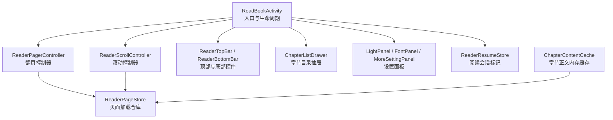
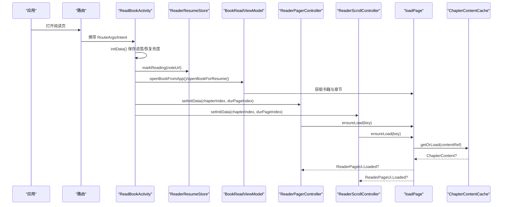
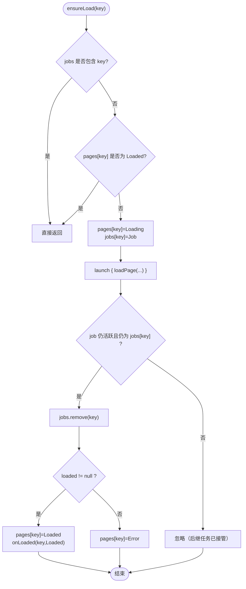
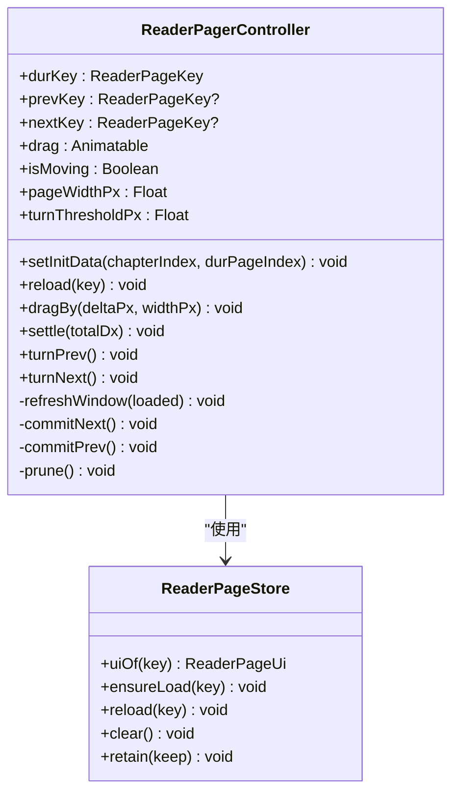
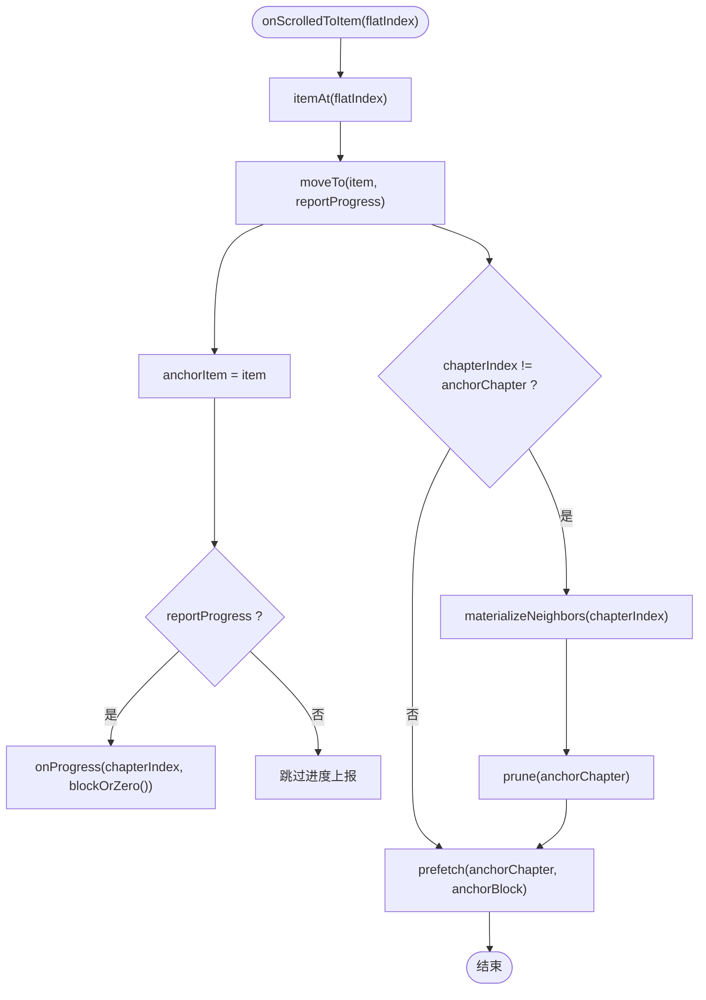
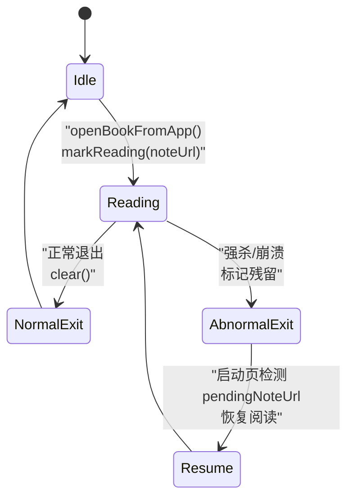
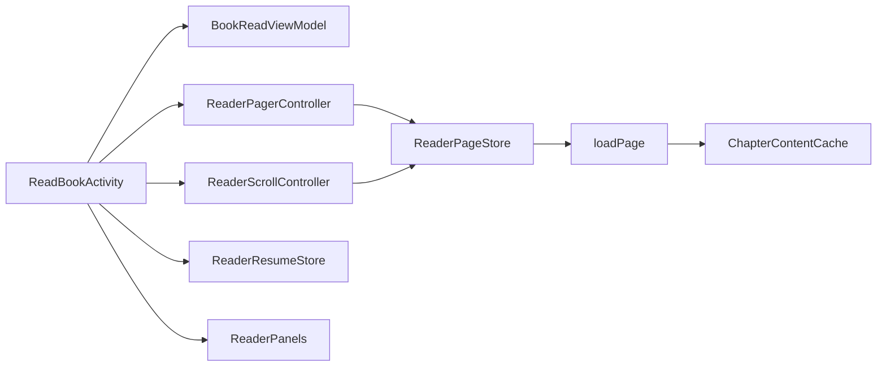

# 阅读界面（ReadBookActivity）

<cite>
**本文引用的文件**
- [ReadBookActivity.kt](file://module_book/src/main/java/com/ebook/book/ReadBookActivity.kt)
- [ReaderPageStore.kt](file://module_book/src/main/java/com/ebook/book/reader/ReaderPageStore.kt)
- [ReaderPager.kt](file://module_book/src/main/java/com/ebook/book/reader/ReaderPager.kt)
- [ReaderScrollController.kt](file://module_book/src/main/java/com/ebook/book/reader/ReaderScrollController.kt)
- [ReaderPanels.kt](file://module_book/src/main/java/com/ebook/book/reader/ReaderPanels.kt)
- [ReaderResumeStore.kt](file://lib_book_common/src/main/java/com/ebook/common/store/ReaderResumeStore.kt)
- [ChapterContentCache.kt](file://lib_book_common/src/main/java/com/ebook/common/store/ChapterContentCache.kt)
</cite>

## 目录
1. [简介](#简介)
2. [项目结构](#项目结构)
3. [核心组件](#核心组件)
4. [架构总览](#架构总览)
5. [详细组件分析](#详细组件分析)
6. [依赖关系分析](#依赖关系分析)
7. [性能与扩展点](#性能与扩展点)
8. [故障排查指南](#故障排查指南)
9. [结论](#结论)

## 简介
本文件面向 ReadBookActivity 阅读界面，系统化说明其核心架构与实现：阅读器状态管理、翻页控制机制（翻页模式与滚动模式）、章节目录显示与阅读设置面板、页面存储与内容缓存、阅读恢复机制（异常退出恢复与跨进程数据同步），以及可配置项与扩展接口。目标是帮助开发者快速理解并安全地扩展阅读功能。

## 项目结构
ReadBookActivity 是 Compose 版阅读页入口，承担以下职责：
- 处理三种打开书籍的入口（应用内跳转、应用外文本打开、启动页恢复）。
- 维护阅读会话标记、亮度恢复、正文尺寸测量、排版上下文。
- 组合两种阅读模式的前端：ReaderPager（翻页）和 ReaderScroll（滚动）。
- 管理 UI 面板：顶部栏、底部栏、章节目录抽屉、亮度面板、字体面板、更多设置面板。
- 协调进度保存、章节下载、来源切换等上层业务。

图表来源
- [ReadBookActivity.kt:1-200](file://module_book/src/main/java/com/ebook/book/ReadBookActivity.kt#L1-L200)
- [ReaderPager.kt:1-200](file://module_book/src/main/java/com/ebook/book/reader/ReaderPager.kt#L1-L200)
- [ReaderScrollController.kt:1-200](file://module_book/src/main/java/com/ebook/book/reader/ReaderScrollController.kt#L1-L200)
- [ReaderPageStore.kt:1-98](file://module_book/src/main/java/com/ebook/book/reader/ReaderPageStore.kt#L1-L98)
- [ReaderPanels.kt:209-216](file://module_book/src/main/java/com/ebook/book/reader/ReaderPanels.kt#L209-L216)
- [ReaderPanels.kt:375-383](file://module_book/src/main/java/com/ebook/book/reader/ReaderPanels.kt#L375-L383)
- [ReaderPanels.kt:750-757](file://module_book/src/main/java/com/ebook/book/reader/ReaderPanels.kt#L750-L757)
- [ReaderPanels.kt:1310-1315](file://module_book/src/main/java/com/ebook/book/reader/ReaderPanels.kt#L1310-L1315)
- [ReaderPanels.kt:1525-1533](file://module_book/src/main/java/com/ebook/book/reader/ReaderPanels.kt#L1525-L1533)
- [ReaderPanels.kt:1715-1723](file://module_book/src/main/java/com/ebook/book/reader/ReaderPanels.kt#L1715-L1723)
- [ReaderResumeStore.kt:1-68](file://lib_book_common/src/main/java/com/ebook/common/store/ReaderResumeStore.kt#L1-L68)
- [ChapterContentCache.kt:1-63](file://lib_book_common/src/main/java/com/ebook/common/store/ChapterContentCache.kt#L1-L63)

章节来源
- [ReadBookActivity.kt:1-200](file://module_book/src/main/java/com/ebook/book/ReadBookActivity.kt#L1-L200)

## 核心组件
- ReadBookActivity：阅读页宿主，负责入口分发、会话标记、亮度恢复、尺寸测量、排版上下文、UI 面板组合与交互转发。
- ReaderPageStore：页面加载仓库，按 ReaderPageKey 去重加载，统一处理 Loading/Error/Loaded 三态、重试、清理与保留集裁剪。
- ReaderPagerController：翻页模式前端，实现三页窗口状态机、手势拖拽、阈值判定、动画与窗口收敛。
- ReaderScrollController：滚动模式前端，维护跨章连续列表、锚点与跳位、惰性物化相邻章、预取与按章距裁剪。
- ReaderPanels：顶部栏、底部栏、章节目录抽屉、亮度面板、字体面板、更多设置面板等 UI 组件。
- ReaderResumeStore：阅读会话标记（SP），用于异常退出后由启动页恢复阅读。
- ChapterContentCache：章节正文 LRU 内存缓存，容量为当前章及前后各一章，避免重复 IO。

章节来源
- [ReaderPageStore.kt:1-98](file://module_book/src/main/java/com/ebook/book/reader/ReaderPageStore.kt#L1-L98)
- [ReaderPager.kt:1-200](file://module_book/src/main/java/com/ebook/book/reader/ReaderPager.kt#L1-L200)
- [ReaderScrollController.kt:1-200](file://module_book/src/main/java/com/ebook/book/reader/ReaderScrollController.kt#L1-L200)
- [ReaderPanels.kt:209-216](file://module_book/src/main/java/com/ebook/book/reader/ReaderPanels.kt#L209-L216)
- [ReaderPanels.kt:375-383](file://module_book/src/main/java/com/ebook/book/reader/ReaderPanels.kt#L375-L383)
- [ReaderPanels.kt:750-757](file://module_book/src/main/java/com/ebook/book/reader/ReaderPanels.kt#L750-L757)
- [ReaderPanels.kt:1310-1315](file://module_book/src/main/java/com/ebook/book/reader/ReaderPanels.kt#L1310-L1315)
- [ReaderPanels.kt:1525-1533](file://module_book/src/main/java/com/ebook/book/reader/ReaderPanels.kt#L1525-L1533)
- [ReaderPanels.kt:1715-1723](file://module_book/src/main/java/com/ebook/book/reader/ReaderPanels.kt#L1715-L1723)
- [ReaderResumeStore.kt:1-68](file://lib_book_common/src/main/java/com/ebook/common/store/ReaderResumeStore.kt#L1-L68)
- [ChapterContentCache.kt:1-63](file://lib_book_common/src/main/java/com/ebook/common/store/ChapterContentCache.kt#L1-L63)

## 架构总览
阅读器的整体流程从 Activity 进入开始，先保存一次进度并恢复亮度；随后根据入口类型加载书籍实体，并标记“正在阅读”。阅读界面组合两个并列的前端控制器：翻页控制器与滚动控制器，二者共享同一个页面加载仓库与 loadPage 能力。UI 层由顶部栏、底部栏、章节目录抽屉与各类设置面板组成。阅读恢复通过 ReaderResumeStore 在进程异常时记录上次阅读的书籍 noteUrl，启动页据此决定是否直接恢复阅读。

图表来源
- [ReadBookActivity.kt:1-200](file://module_book/src/main/java/com/ebook/book/ReadBookActivity.kt#L1-L200)
- [ReaderPager.kt:1-200](file://module_book/src/main/java/com/ebook/book/reader/ReaderPager.kt#L1-L200)
- [ReaderScrollController.kt:1-200](file://module_book/src/main/java/com/ebook/book/reader/ReaderScrollController.kt#L1-L200)
- [ReaderPageStore.kt:1-98](file://module_book/src/main/java/com/ebook/book/reader/ReaderPageStore.kt#L1-L98)
- [ChapterContentCache.kt:1-63](file://lib_book_common/src/main/java/com/ebook/common/store/ChapterContentCache.kt#L1-L63)
- [ReaderResumeStore.kt:1-68](file://lib_book_common/src/main/java/com/ebook/common/store/ReaderResumeStore.kt#L1-L68)

## 详细组件分析

### ReadBookActivity：阅读页宿主与状态管理
- 入口与初始化
  - initData() 中主动保存一次进度，防止异常退出丢失；同时恢复已持久化的手动亮度。
  - openBookFromApp() 通过 BitIntentDataManager 取出书架实体，设置 viewModel.bookShelf，调用 checkInShelf()，并通过 ReaderResumeStore.markReading(noteUrl) 标记阅读会话进行中。
- 尺寸与排版
  - onBodyMeasured(widthPx, heightPx) 更新 readerContentWidthPx 与 readerBodyHeightPx，作为分页与每屏行数测算依据。
  - readerTypesetter 持有排版上下文（测量器、正文样式、密度），rePaginate 落定后供控制器使用，保证字号变化与分页逻辑同步。
- 控制器持有
  - pagerController 与 scrollController 只可能非空其一，以决定当前翻页方式。音量键事件由 Activity.onKeyUp 转发到对应控制器。
- UI 组合
  - 顶部栏、底部栏、章节目录抽屉、亮度面板、字体面板、更多设置面板均在此组合或回调。
  - 配色分两层：正文用阅读背景主题，不随深浅色切换；chrome 层继承全局主题，随外观模式变化。

章节来源
- [ReadBookActivity.kt:1-200](file://module_book/src/main/java/com/ebook/book/ReadBookActivity.kt#L1-L200)

### ReaderPageStore：页面存储与竞态处理
- 数据结构
  - pages：ReaderPageKey → ReaderPageUi 映射，表示某一页的渲染状态（Loading/Error/Loaded）。
  - jobs：ReaderPageKey → Job 登记，用于去重在途任务。
- 关键方法
  - uiOf(key)：返回指定 key 的渲染状态，未登记按 Loading 兜底。
  - ensureLoad(key)：若已在 jobs 则跳过；若已 Loaded 也短路，避免快速回翻闪 Loading 与多余 IO。
  - reload(key)：取消旧 job 并重新确保加载。
  - clear()：跳转/换页模式时取消全部在途任务并清空状态。
  - retain(keep)：仅保留 keep 集合中的键，其余从 pages 与 jobs 移除并取消对应任务，防止内存累积。
- 竞态策略
  - 以 ReaderPageKey 去重，成功回调 onLoaded 由前端判断相关性（翻页模式判 key==durKey，滚动模式判锚点章是否在已物化章段内），因此翻页/滚动途中提交的在途任务会归属新窗口，无需时间戳过期校验。

图表来源
- [ReaderPageStore.kt:1-98](file://module_book/src/main/java/com/ebook/book/reader/ReaderPageStore.kt#L1-L98)

章节来源
- [ReaderPageStore.kt:1-98](file://module_book/src/main/java/com/ebook/book/reader/ReaderPageStore.kt#L1-L98)

### ReaderPagerController：翻页控制器
- 窗口模型
  - 当前页（durKey）、上一页（prevKey）、下一页（nextKey）构成三页窗口。
  - drag 为横向位移（px），负值向后翻，正值向前翻；isMoving 锁定动画期手势与程序化翻页。
- 关键行为
  - setInitData(chapterIndex, durPageIndex)：清除仓库、收敛窗口到目标章节页，立即回调进度。
  - refreshWindow(loaded)：根据 loaded 计算 prevKey/nextKey，并对相邻页 ensureLoad。
  - dragBy(deltaPx, widthPx)：限制拖拽范围在 [-width, width]。
  - settle(totalDx)：抬起后超过阈值（30dp）翻页成功，否则回弹。
  - turnPrev()/turnNext()：程序化翻页（点击三分区或音量键）。
  - commitNext()/commitPrev()：提交翻页，目标页非 Loaded 时按收敛规则保留来路页方向，避免自指与死页。
  - prune()：将仓库裁至三页窗口键集合，防止连续跨章累积。

图表来源
- [ReaderPager.kt:1-200](file://module_book/src/main/java/com/ebook/book/reader/ReaderPager.kt#L1-L200)
- [ReaderPager.kt:201-560](file://module_book/src/main/java/com/ebook/book/reader/ReaderPager.kt#L201-L560)
- [ReaderPageStore.kt:1-98](file://module_book/src/main/java/com/ebook/book/reader/ReaderPageStore.kt#L1-L98)

章节来源
- [ReaderPager.kt:1-200](file://module_book/src/main/java/com/ebook/book/reader/ReaderPager.kt#L1-L200)
- [ReaderPager.kt:201-560](file://module_book/src/main/java/com/ebook/book/reader/ReaderPager.kt#L201-L560)

### ReaderScrollController：滚动控制器
- 列表模型
  - ScrollItem：Title（章标题项）与 Block（正文块项）。
  - ChapterSection：一章在列表中的段（1 个标题 + blockCount 个块），blockCount=0 表示排版未落定时占 1 个占位块。
  - sections：惰性物化章段，保持升序且连续。
- 锚点与跳跃
  - anchorItem 存语义值 (章, 块)，避免上方插入导致扁平序号平移。
  - jump/scrollOneScreen/setInitData 提供跳位与滚一屏，LazyColumn 通过 itemKey 稳定锚定位置。
- 加载与预取
  - materialize/chapterNeighbors：进入某章即物化相邻两章，跨章不需切章动作。
  - prefetch：锚点邻域 ±2 块预取，平滑滚动体验。
  - prune：按锚点章 ±2 章裁剪正文保留集，单位是章而非块，避免同章回滚丢块重载闪烁。
- 进度口径
  - 与翻页模式共用 onProgress(chapterIndex, pageIndex)，使 dur_chapter_page 口径一致，换翻页方式不必改 schema。

图表来源
- [ReaderScrollController.kt:1-200](file://module_book/src/main/java/com/ebook/book/reader/ReaderScrollController.kt#L1-L200)
- [ReaderScrollController.kt:201-399](file://module_book/src/main/java/com/ebook/book/reader/ReaderScrollController.kt#L201-L399)

章节来源
- [ReaderScrollController.kt:1-200](file://module_book/src/main/java/com/ebook/book/reader/ReaderScrollController.kt#L1-L200)
- [ReaderScrollController.kt:201-399](file://module_book/src/main/java/com/ebook/book/reader/ReaderScrollController.kt#L201-L399)

### 阅读界面 UI 组件层次结构
- 顶部栏（ReaderTopBar）
  - 显示书名/副标题、本地书标识，提供返回、下载、刷新、切换来源、评论等入口。
- 底部栏（ReaderBottomBar）
  - 显示章节总数、滑块进度、当前激活面板、前进/后退章节按钮，支持滑条拖动与暂停回调。
- 章节目录抽屉（ChapterListDrawer）
  - 展示章节目录列表，支持倒序开关、点击跳转，关闭时销毁 AnimatedVisibility 内部状态。
- 亮度面板（LightPanel / LightPanelContent）
  - 支持跟随系统/手动亮度，滑条与持久化共用 light 单一事实源，勾选“跟随系统”恢复系统亮度。
- 字体面板（FontPanel）
  - 镜像 ReadBookControl 的 textKindIndex 与背景档位，变更写回单例并持久化。
- 更多设置面板（MoreSettingPanel）
  - 控制按键翻页、点击翻页、翻页模式索引等选项。

章节来源
- [ReaderPanels.kt:209-216](file://module_book/src/main/java/com/ebook/book/reader/ReaderPanels.kt#L209-L216)
- [ReaderPanels.kt:375-383](file://module_book/src/main/java/com/ebook/book/reader/ReaderPanels.kt#L375-L383)
- [ReaderPanels.kt:750-757](file://module_book/src/main/java/com/ebook/book/reader/ReaderPanels.kt#L750-L757)
- [ReaderPanels.kt:1310-1315](file://module_book/src/main/java/com/ebook/book/reader/ReaderPanels.kt#L1310-L1315)
- [ReaderPanels.kt:1525-1533](file://module_book/src/main/java/com/ebook/book/reader/ReaderPanels.kt#L1525-L1533)
- [ReaderPanels.kt:1715-1723](file://module_book/src/main/java/com/ebook/book/reader/ReaderPanels.kt#L1715-L1723)

### 阅读恢复机制：位置保存、异常退出恢复与跨进程同步
- 阅读会话标记
  - ReaderResumeStore 使用独立 SP 文件记录 last_reading_note_url，仅在“成功打开一本书”时写入，正常退出时清除。
  - 写入采用同步 commit，确保进程异常终止时标记已落盘；读取方为启动页，据此决定是否恢复阅读界面。
- 异常退出恢复
  - ReadBookActivity.openBookFromApp() 在进入阅读前调用 ReaderResumeStore.markReading(bookShelf.noteUrl)。
  - 启动页若检测到 pendingNoteUrl 不为空，可通过 TheRouter 携带 RouteArgs.RESUME_NOTE_URL 跨进程恢复。
- 与阅读进度的区别
  - 该标记不是“阅读进度”，进度唯一事实源是 book_shelf.dur_chapter(_page)；标记仅承担“要不要恢复”的开关。

图表来源
- [ReaderResumeStore.kt:1-68](file://lib_book_common/src/main/java/com/ebook/common/store/ReaderResumeStore.kt#L1-L68)
- [ReadBookActivity.kt:1-200](file://module_book/src/main/java/com/ebook/book/ReadBookActivity.kt#L1-L200)

章节来源
- [ReaderResumeStore.kt:1-68](file://lib_book_common/src/main/java/com/ebook/common/store/ReaderResumeStore.kt#L1-L68)
- [ReadBookActivity.kt:1-200](file://module_book/src/main/java/com/ebook/book/ReadBookActivity.kt#L1-L200)

### 页面内容与缓存：ReaderPageCard、ReaderTypesetter 与 ChapterContentCache
- ReaderPageCard
  - 三态互斥（Loading/Error/Loaded），正文骨架常驻，页码行固定高度，确保 Loading/Loaded 间正文区高度恒定，避免多算一行溢出。
  - 正文样式与分页测量必须一致（readerBodyTextStyle），避免“切几行”与“画几行”错位。
- ReaderTypesetter
  - 提供排版上下文（测量器、正文样式、密度），由 Activity.rePaginate 落定，供控制器分页。
- ChapterContentCache
  - LRU 内存缓存，容量默认 3（当前章 + 前后各一章），键为 content_ref，避免重复 IO。
  - invalidateBook(bookId) 通过 BookStore.cacheMarker 派生片段剔除整书缓存，适配删书/换源/强制刷新场景。

章节来源
- [ReaderPager.kt:201-560](file://module_book/src/main/java/com/ebook/book/reader/ReaderPager.kt#L201-L560)
- [ChapterContentCache.kt:1-63](file://lib_book_common/src/main/java/com/ebook/common/store/ChapterContentCache.kt#L1-L63)

## 依赖关系分析
- 低耦合高内聚
  - ReaderPageStore 封装加载去重与三态，ReaderPagerController 与 ReaderScrollController 分别专注几何与交互，减少重复实现。
  - UI 面板与控制器解耦，通过回调传递用户操作。
- 外部依赖
  - BookRepository/BookImportRepository：提供书籍实体、章节数据。
  - ReaderResumeStore：跨进程会话标记。
  - ChapterContentCache：章节正文内存缓存。
  - 路由与事件：TheRouter、RouteArgs、DBCode 等。

图表来源
- [ReadBookActivity.kt:1-200](file://module_book/src/main/java/com/ebook/book/ReadBookActivity.kt#L1-L200)
- [ReaderPager.kt:1-200](file://module_book/src/main/java/com/ebook/book/reader/ReaderPager.kt#L1-L200)
- [ReaderScrollController.kt:1-200](file://module_book/src/main/java/com/ebook/book/reader/ReaderScrollController.kt#L1-L200)
- [ReaderPageStore.kt:1-98](file://module_book/src/main/java/com/ebook/book/reader/ReaderPageStore.kt#L1-L98)
- [ChapterContentCache.kt:1-63](file://lib_book_common/src/main/java/com/ebook/common/store/ChapterContentCache.kt#L1-L63)
- [ReaderPanels.kt:209-216](file://module_book/src/main/java/com/ebook/book/reader/ReaderPanels.kt#L209-L216)

章节来源
- [ReadBookActivity.kt:1-200](file://module_book/src/main/java/com/ebook/book/ReadBookActivity.kt#L1-L200)
- [ReaderPageStore.kt:1-98](file://module_book/src/main/java/com/ebook/book/reader/ReaderPageStore.kt#L1-L98)

## 性能与扩展点
- 性能要点
  - 页面加载去重与 Loaded 短路：避免快速回翻重复 IO 与整章重排。
  - 章节正文 LRU 缓存：默认容量 3，覆盖上下章，显著降低磁盘与解码开销。
  - 滚动模式惰性物化与预取：相邻章预热、锚点邻域 ±2 块预取，提升滚动流畅度。
  - 布局期偏移读取 drag：翻页动画期间零重组，参考 Compose 性能优化经验。
- 扩展接口
  - loadPage(chapterIndex, pageIndex)：可扩展网络/本地内容读取与分页逻辑。
  - chapterSize()/chapterTitle(index)：可扩展章节元数据来源。
  - onProgress(chapterIndex, pageIndex)：可扩展进度上报（如云端同步、统计埋点）。
  - 面板回调：Download/Refresh/SwitchSource/Comment 等均可扩展业务。
  - 阅读模式切换：可在 Activity 层维护 pagerController/scrollController 的非空状态，切换时 clear 仓库并 rePaginate。

[本节为通用指导，不直接分析具体文件]

## 故障排查指南
- 常见问题与定位
  - 翻页后卡住或无法返回
    - 检查 ReaderPagerController.commitNext()/commitPrev() 收敛规则：目标页非 Loaded 时需保留来路方向，避免自指与死页。
    - 确认 ReaderPageStore.ensureLoad 的 jobs 注销条件：需比对 myJob 与 isActive，防止误删后继任务。
  - 滚动模式回滚闪烁
    - 检查 ReaderScrollController.prune 保留半径单位：必须是章而非块，避免同章内回滚丢块重加载。
    - 确认 LazyColumn itemKey 稳定且唯一，避免锚定失效。
  - 异常退出未恢复
    - 确认 ReaderResumeStore.markReading 在 openBookFromApp() 中调用，且使用同步 commit。
    - 正常退出路径必须调用 ReaderResumeStore.clear()。
  - 正文溢出到页码行
    - 检查 ReaderPageCard 正文区高度与页码行高度一致性，确保 Loading/Loaded 占位相同。
    - 确认正文样式与分页测量一致（readerBodyTextStyle）。
- 建议调试手段
  - 打印 onLoaded 回调的 key 与 durKey/blockIndex，验证相关性判断。
  - 观察 chapters 物化顺序与 prune 后的保留集，确认内存边界合理。
  - 在 loadPage 中添加耗时日志，评估 ChapterContentCache 命中率。

章节来源
- [ReaderPager.kt:201-560](file://module_book/src/main/java/com/ebook/book/reader/ReaderPager.kt#L201-L560)
- [ReaderPageStore.kt:1-98](file://module_book/src/main/java/com/ebook/book/reader/ReaderPageStore.kt#L1-L98)
- [ReaderScrollController.kt:201-399](file://module_book/src/main/java/com/ebook/book/reader/ReaderScrollController.kt#L201-L399)
- [ReaderResumeStore.kt:1-68](file://lib_book_common/src/main/java/com/ebook/common/store/ReaderResumeStore.kt#L1-L68)
- [ReaderPager.kt:201-560](file://module_book/src/main/java/com/ebook/book/reader/ReaderPager.kt#L201-L560)

## 结论
ReadBookActivity 阅读界面以 ReaderPageStore 为中心，解耦了翻页与滚动两种模式的几何与交互，并通过 ReaderResumeStore 与 ChapterContentCache 提供可靠的异常恢复与高性能内容供给。UI 面板与控制器之间通过回调通信，便于扩展与定制。开发者在扩充分页逻辑、内容来源、面板功能时，应遵循现有去重、收敛与保留策略，以保证稳定性与性能。

[本节为总结性内容，不直接分析具体文件]