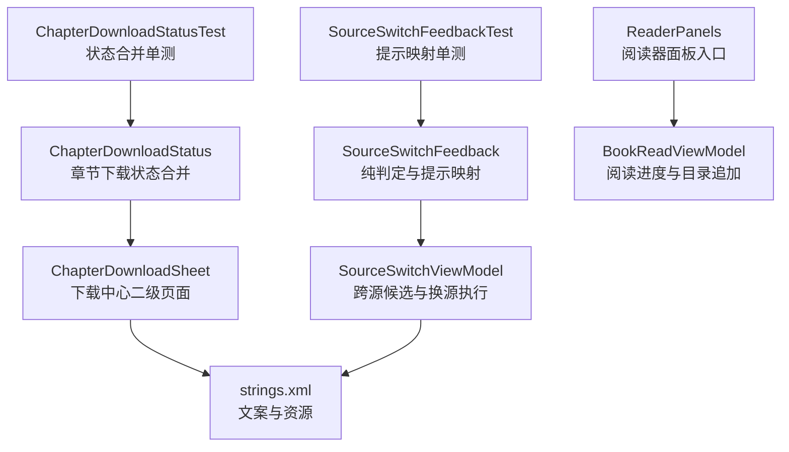
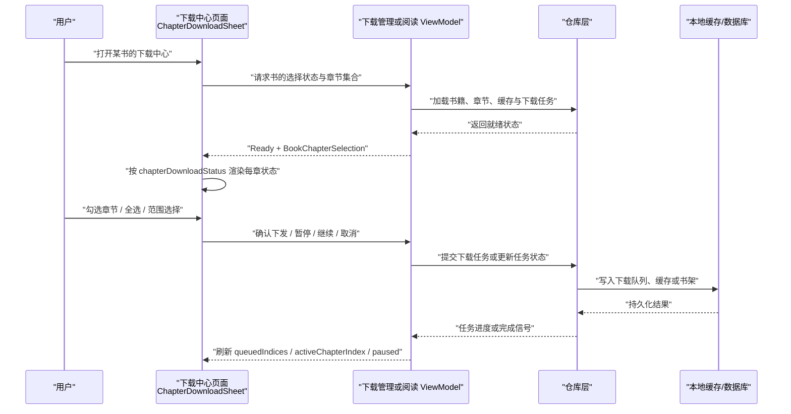
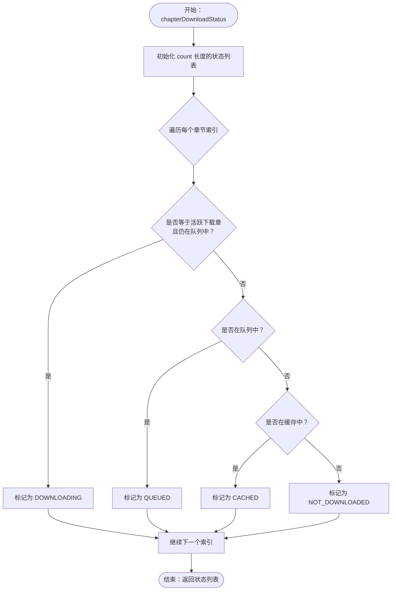
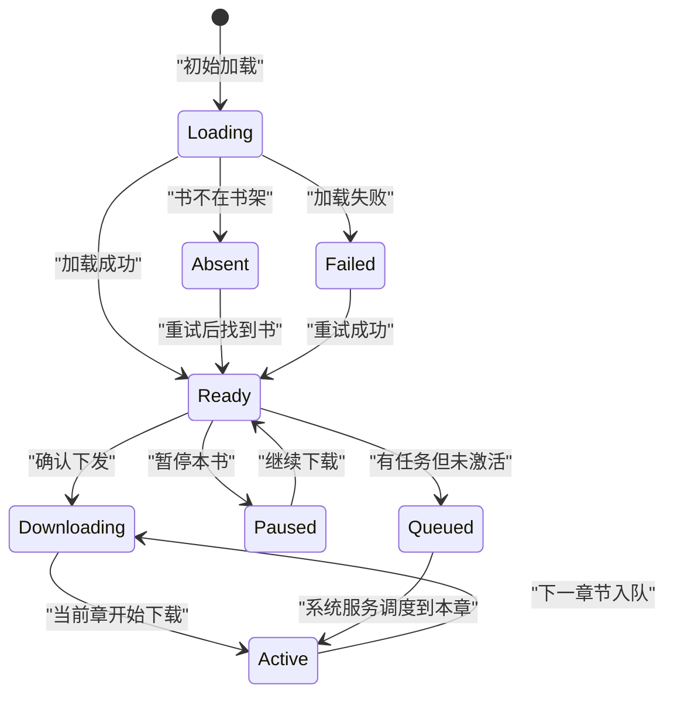
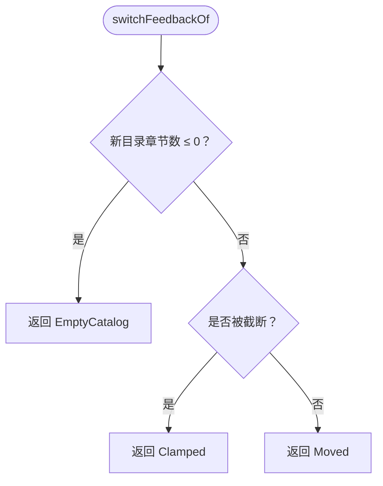
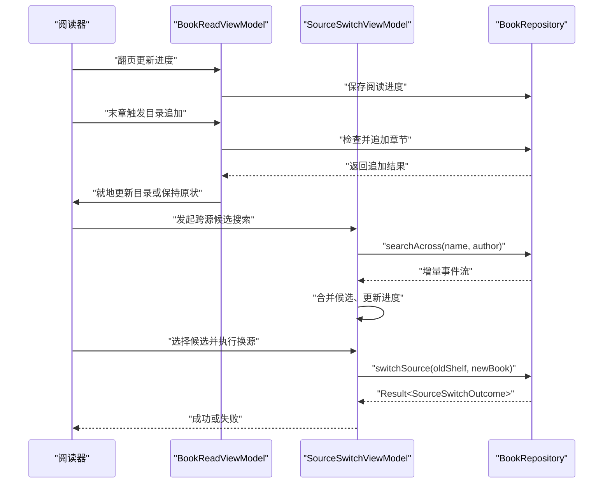
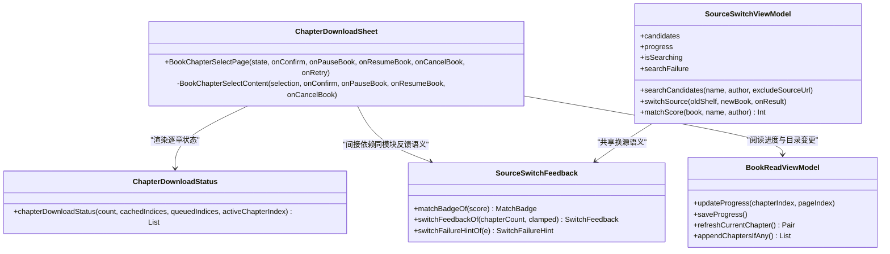

# 高级功能特性

<cite>
**本文引用的文件**   
- [ChapterDownloadStatus.kt](file://module_book/src/main/java/com/ebook/book/reader/ChapterDownloadStatus.kt)
- [ChapterDownloadSheet.kt](file://module_book/src/main/java/com/ebook/book/reader/ChapterDownloadSheet.kt)
- [SourceSwitchFeedback.kt](file://module_book/src/main/java/com/ebook/book/reader/SourceSwitchFeedback.kt)
- [ReaderPanels.kt](file://module_book/src/main/java/com/ebook/book/reader/ReaderPanels.kt)
- [BookReadViewModel.kt](file://module_book/src/main/java/com/ebook/book/mvvm/viewmodel/BookReadViewModel.kt)
- [SourceSwitchViewModel.kt](file://module_book/src/main/java/com/ebook/book/mvvm/viewmodel/SourceSwitchViewModel.kt)
- [strings.xml](file://module_book/src/main/res/values/strings.xml)
- [ChapterDownloadStatusTest.kt](file://module_book/src/test/java/com/ebook/book/reader/ChapterDownloadStatusTest.kt)
- [SourceSwitchFeedbackTest.kt](file://module_book/src/test/java/com/ebook/book/reader/SourceSwitchFeedbackTest.kt)
</cite>

## 目录
1. [引言](#引言)
2. [项目结构](#项目结构)
3. [核心组件](#核心组件)
4. [架构总览](#架构总览)
5. [详细组件分析](#详细组件分析)
6. [依赖关系分析](#依赖关系分析)
7. [性能与可扩展性](#性能与可扩展性)
8. [故障排查指南](#故障排查指南)
9. [结论](#结论)
10. [附录：使用示例与最佳实践](#附录使用示例与最佳实践)

## 引言
本文聚焦阅读器的高级功能，围绕三个紧密耦合的模块展开：
- 章节下载状态管理（ChapterDownloadStatus）：把缓存、队列与当前下载章三方信息合并为逐章展示状态。
- 下载进度显示界面（ChapterDownloadSheet）：提供批量选章、软上限确认、范围选择、快速滚动和书级暂停/继续/取消操作。
- 书源切换反馈机制（SourceSwitchFeedback）：将匹配分数、换源现场和异常类型映射为用户可读提示，保证用户决策不被误导。

这些能力既独立可测，又通过 ViewModel 与仓库层协同，共同服务于阅读器的状态同步、事件处理与异常恢复。

## 项目结构
与高级功能直接相关的代码集中在 `module_book` 的阅读器和 MVVM 层：
- 阅读 UI 与面板：`module_book/.../reader`
- 阅读相关 ViewModel：`module_book/.../mvvm/viewmodel`
- 文案资源：`module_book/.../res/values/strings.xml`
- 单元测试：`module_book/.../test/java/.../reader`

**图表来源**
- [ChapterDownloadStatus.kt:1-26](file://module_book/src/main/java/com/ebook/book/reader/ChapterDownloadStatus.kt#L1-L26)
- [ChapterDownloadSheet.kt:1-200](file://module_book/src/main/java/com/ebook/book/reader/ChapterDownloadSheet.kt#L1-L200)
- [SourceSwitchFeedback.kt:1-113](file://module_book/src/main/java/com/ebook/book/reader/SourceSwitchFeedback.kt#L1-L113)
- [SourceSwitchViewModel.kt:1-200](file://module_book/src/main/java/com/ebook/book/mvvm/viewmodel/SourceSwitchViewModel.kt#L1-L200)
- [ReaderPanels.kt:1-200](file://module_book/src/main/java/com/ebook/book/reader/ReaderPanels.kt#L1-L200)
- [BookReadViewModel.kt:1-151](file://module_book/src/main/java/com/ebook/book/mvvm/viewmodel/BookReadViewModel.kt#L1-L151)
- [strings.xml:63-67](file://module_book/src/main/res/values/strings.xml#L63-L67)
- [strings.xml:212-240](file://module_book/src/main/res/values/strings.xml#L212-L240)

**分节来源**
- [ChapterDownloadStatus.kt:1-26](file://module_book/src/main/java/com/ebook/book/reader/ChapterDownloadStatus.kt#L1-L26)
- [ChapterDownloadSheet.kt:1-200](file://module_book/src/main/java/com/ebook/book/reader/ChapterDownloadSheet.kt#L1-L200)
- [SourceSwitchFeedback.kt:1-113](file://module_book/src/main/java/com/ebook/book/reader/SourceSwitchFeedback.kt#L1-L113)
- [SourceSwitchViewModel.kt:1-200](file://module_book/src/main/java/com/ebook/book/mvvm/viewmodel/SourceSwitchViewModel.kt#L1-L200)
- [ReaderPanels.kt:1-200](file://module_book/src/main/java/com/ebook/book/reader/ReaderPanels.kt#L1-L200)
- [BookReadViewModel.kt:1-151](file://module_book/src/main/java/com/ebook/book/mvvm/viewmodel/BookReadViewModel.kt#L1-L151)
- [strings.xml:63-67](file://module_book/src/main/res/values/strings.xml#L63-L67)
- [strings.xml:212-240](file://module_book/src/main/res/values/strings.xml#L212-L240)

## 核心组件
- 章节下载状态合并函数负责计算每章是“未下载、已缓存、待下载、下载中”四种状态之一，并明确优先级：下载中 > 待下载 > 已缓存 > 未下载。
- 下载中心二级页面负责展示章节列表、勾选集合、书级动作、快速滚动条和浮出勾选面板；它复用原选章页的三态逻辑，但强调“勾中即强制刷新重下”。
- 书源切换反馈模块把匹配分数、新目录长度、是否被截断和异常类型映射为枚举提示，避免 Compose 页面直接写业务分支，从而可用纯 JVM 单测锁定语义。

**分节来源**
- [ChapterDownloadStatus.kt:1-26](file://module_book/src/main/java/com/ebook/book/reader/ChapterDownloadStatus.kt#L1-L26)
- [ChapterDownloadSheet.kt:201-488](file://module_book/src/main/java/com/ebook/book/reader/ChapterDownloadSheet.kt#L201-L488)
- [SourceSwitchFeedback.kt:1-113](file://module_book/src/main/java/com/ebook/book/reader/SourceSwitchFeedback.kt#L1-L113)

## 架构总览
高级功能在运行时分为三层：
- 表现层：Compose 面板与页面，负责交互、动画、布局与文案呈现。
- 视图模型层：`SourceSwitchViewModel` 聚合候选搜索结果并执行换源；`BookReadViewModel` 负责阅读进度与目录追加。
- 仓库与数据层：由外部仓库实现下载、缓存、书架与网络解析；本组文档不直接分析仓库源码，只引用其契约和异常类型。

**图表来源**
- [ChapterDownloadSheet.kt:201-488](file://module_book/src/main/java/com/ebook/book/reader/ChapterDownloadSheet.kt#L201-L488)
- [ChapterDownloadStatus.kt:1-26](file://module_book/src/main/java/com/ebook/book/reader/ChapterDownloadStatus.kt#L1-L26)
- [BookReadViewModel.kt:1-151](file://module_book/src/main/java/com/ebook/book/mvvm/viewmodel/BookReadViewModel.kt#L1-L151)

## 详细组件分析

### 章节下载状态管理：ChapterDownloadStatus
该模块的核心是一个纯函数，输入包括章节总数、已缓存索引集合、排队索引集合和当前正在下载的章节索引，输出是与章节一一对应的状态列表。

关键语义：
- 如果某个索引既是活跃下载章又在队列中，则显示“下载中”，避免用户在二级页面误以为它只是普通排队项。
- 如果活跃下载章不在队列中，属于中间态不一致，不应出现幽灵“下载中”，而是退回到普通队列或未下载分支。
- 已缓存且又被加入队列时，优先显示“待下载”，让用户知道勾选会触发强制刷新重下。
- 空目录和越界索引不会崩溃，而是按边界值安全处理。

**图表来源**
- [ChapterDownloadStatus.kt:1-26](file://module_book/src/main/java/com/ebook/book/reader/ChapterDownloadStatus.kt#L1-L26)

时间复杂度与空间复杂度：
- 时间复杂度为 O(n)，n 为章节数；每次调用都会生成完整状态列表。
- 空间复杂度为 O(n)，用于保存结果列表。
- 由于状态仅用于展示，实际 UI 渲染仍受 LazyColumn 虚拟化和分页限制，整体视觉体验不会因 n 变大而线性退化。

单测覆盖重点：
- 无任何事实时全部为未下载。
- 缓存命中章标记为已缓存。
- 队列与缓存并行时队列态优先。
- 当前下载章在队列内标记为下载中。
- 活跃章不在队列时按普通队列态处理。
- 空目录与越界输入不崩溃。

**分节来源**
- [ChapterDownloadStatus.kt:1-26](file://module_book/src/main/java/com/ebook/book/reader/ChapterDownloadStatus.kt#L1-L26)
- [ChapterDownloadStatusTest.kt:1-97](file://module_book/src/test/java/com/ebook/book/reader/ChapterDownloadStatusTest.kt#L1-L97)

### 下载进度显示界面：ChapterDownloadSheet
ChapterDownloadSheet 不是简单列表，而是一个包含四层语义的复合界面：
1. 顶层四态渲染：加载中、书不在架、加载失败、就绪。
2. 书头区域：封面、书名、状态胶囊行（总章数、已选数、进行态）、书级动作列。
3. 章节平铺列表：每章显示名称、勾选框和下载状态。
4. 右下浮动操作面板：全选、仅未缓存、范围选择、清除选择，配合 FAB 展开收起。

#### 主要 UI 行为
- 加载态使用旋转指示器而非纯文字，因为“正在加载”本身没有进度反馈。
- 书不在架和加载失败共享 EmptyState，但失败态额外提供“重试”动作，避免只说“请重试”却无落点。
- 已选数量以 InfoChip 形式显示在主操作旁；预演小字说明按下主操作时会跳过已在队列中的章节。
- 超过软上限（例如 500 章）时弹出二次确认对话框，而不是静默下发。
- 范围选择确定后替换当前勾选集合，并滚动到范围起点，便于用户核对即将下载的章节。
- 快速滚动条根据面板展开与否动态调整底部让位高度，避免轨道落在不可见区域。

**图表来源**
- [ChapterDownloadSheet.kt:201-488](file://module_book/src/main/java/com/ebook/book/reader/ChapterDownloadSheet.kt#L201-L488)

#### 批量操作设计要点
- “全选”适合长目录一键准备下载。
- “仅未缓存”区分了本地已有内容和仍需网络获取的内容。
- “范围选择”用于精确控制起止章节，但不直接下发，避免一次性改变下发口径。
- “清除选择”重置本次勾选集合，不影响书级下载状态。
- 面板收起后不会自动隐藏，因为它是用户主动展开的控制台；代价是必须动态测量面板高度，并在列表底部和快速滚动条上预留空间。

#### 错误提示与可访问性
- 加载失败提供图标、标题和重试按钮，遵循统一词汇表。
- 书不在架使用搜索关闭图标，标题说明该书不在书架。
- 勾选面板工具按钮采用 44dp 圆位加下方标签，整体触摸区域大于圆形图标，兼顾高密度排版与可操作性。

**分节来源**
- [ChapterDownloadSheet.kt:201-488](file://module_book/src/main/java/com/ebook/book/reader/ChapterDownloadSheet.kt#L201-L488)
- [ChapterDownloadSheet.kt:489-700](file://module_book/src/main/java/com/ebook/book/reader/ChapterDownloadSheet.kt#L489-L700)
- [strings.xml:63-67](file://module_book/src/main/res/values/strings.xml#L63-L67)

### 书源切换反馈机制：SourceSwitchFeedback
SourceSwitchFeedback 把三类容易写错的业务判断从 UI 中剥离出来：
1. 匹配分数 → 标签档：完全匹配、部分匹配、仅作者匹配。
2. 换源现场 → 反馈句：正常跳转、落到最后一章、新源目录为空。
3. 异常类型 → 提示档：目标书源失效、目标已在书架、通用失败、整轮搜索失败。

#### 判定顺序的重要性
- 先判断新目录是否为空，再判断是否被截断。若顺序颠倒，会把“新源一章都解不出来”的错误场景误报为“已跳到第 N 章”。
- 目标已在书架上的异常必须单独一档，否则兜底文案会误导用户去另选一本，而正确做法是去读书架上已有的那本。
- 整轮搜索失败的提示不能套用“书架未受影响”的话术，因为此时可能连候选聚合都失败了。

**图表来源**
- [SourceSwitchFeedback.kt:1-113](file://module_book/src/main/java/com/ebook/book/reader/SourceSwitchFeedback.kt#L1-L113)

#### 为什么返回值用枚举而不是字符串资源 ID
- 枚举可在纯 JVM 单测中直接断言，不需要 Robolectric。
- UI 侧用穷尽式 when 匹配枚举，漏掉任意一档会导致编译失败，从而保证枚举与文案一一对应。
- 匹配分数用区间比较，新增分数档时更可能落入相邻档，而不是错误地落入最弱档。

**分节来源**
- [SourceSwitchFeedback.kt:1-113](file://module_book/src/main/java/com/ebook/book/reader/SourceSwitchFeedback.kt#L1-L113)
- [SourceSwitchFeedbackTest.kt:1-91](file://module_book/src/test/java/com/ebook/book/reader/SourceSwitchFeedbackTest.kt#L1-L91)
- [strings.xml:212-240](file://module_book/src/main/res/values/strings.xml#L212-L240)

### 与核心阅读器的集成方式
#### 状态同步
- 阅读进度通过 `BookReadViewModel.updateProgress` 和 `saveProgress` 与书架条目同步；末章翻页时还会尝试追加目录。
- 下载中心页面的“进行中”“已暂停”“排队中”等状态来自 ViewModel 传入的选择状态，再由 `chapterDownloadStatus` 转为逐章状态。
- 换源成功后，`SourceSwitchOutcome` 携带旧进度和新目录长度，UI 据此决定显示“已跳到第 N 章”还是“已落到最后一章”。

#### 事件处理
- 换源候选搜索采用增量流，逐个书源返回结果；`SourceSwitchViewModel` 边收边并，避免等待所有书源导致整页阻塞。
- 一轮搜索结束时以“全部完成”事件为准，而不是简单计数相等，防止内部协程取消导致进度永远差一格。
- 下载中心的主操作确认后，由上层 ViewModel 决定是否进入二次确认、是否剔除已在队列中的章节，以及是否触发暂停、继续或取消。

#### 异常恢复
- 换源失败不走 ViewModel 的 Toast 通道，因为该 ViewModel 未被宿主绑定收集；失败经 Result 交回 UI，由 SourceSwitchSheet 内联提示。
- 阅读进度保存失败、章节加载失败、目录追加失败等路径应保留日志和用户可见的降级状态，而不是静默丢弃。

**图表来源**
- [BookReadViewModel.kt:1-151](file://module_book/src/main/java/com/ebook/book/mvvm/viewmodel/BookReadViewModel.kt#L1-L151)
- [SourceSwitchViewModel.kt:1-200](file://module_book/src/main/java/com/ebook/book/mvvm/viewmodel/SourceSwitchViewModel.kt#L1-L200)

**分节来源**
- [BookReadViewModel.kt:1-151](file://module_book/src/main/java/com/ebook/book/mvvm/viewmodel/BookReadViewModel.kt#L1-L151)
- [SourceSwitchViewModel.kt:201-318](file://module_book/src/main/java/com/ebook/book/mvvm/viewmodel/SourceSwitchViewModel.kt#L201-L318)
- [ReaderPanels.kt:1-200](file://module_book/src/main/java/com/ebook/book/reader/ReaderPanels.kt#L1-L200)

## 依赖关系分析
- ChapterDownloadStatus 是纯函数模块，不依赖 Android 框架，仅暴露状态合并逻辑。
- ChapterDownloadSheet 依赖 Compose UI、Material3、章节选择状态和 strings 资源。
- SourceSwitchFeedback 依赖仓库与书源分析层抛出的特定异常类型，但自身不持有 Android 上下文。
- SourceSwitchViewModel 依赖 BookSourceManager 和 BookRepository，并通过 StateFlow 向 UI 暴露候选、进度、搜索失败和运行状态。
- ReaderPanels 提供阅读器 chrome 层入口，其中下载入口统一带强制刷新语义，避免菜单中出现重复的“强制刷新缓存”选项。

**图表来源**
- [ChapterDownloadStatus.kt:1-26](file://module_book/src/main/java/com/ebook/book/reader/ChapterDownloadStatus.kt#L1-L26)
- [ChapterDownloadSheet.kt:1-200](file://module_book/src/main/java/com/ebook/book/reader/ChapterDownloadSheet.kt#L1-L200)
- [SourceSwitchFeedback.kt:1-113](file://module_book/src/main/java/com/ebook/book/reader/SourceSwitchFeedback.kt#L1-L113)
- [SourceSwitchViewModel.kt:1-200](file://module_book/src/main/java/com/ebook/book/mvvm/viewmodel/SourceSwitchViewModel.kt#L1-L200)
- [BookReadViewModel.kt:1-151](file://module_book/src/main/java/com/ebook/book/mvvm/viewmodel/BookReadViewModel.kt#L1-L151)

**分节来源**
- [ChapterDownloadStatus.kt:1-26](file://module_book/src/main/java/com/ebook/book/reader/ChapterDownloadStatus.kt#L1-L26)
- [ChapterDownloadSheet.kt:1-200](file://module_book/src/main/java/com/ebook/book/reader/ChapterDownloadSheet.kt#L1-L200)
- [SourceSwitchFeedback.kt:1-113](file://module_book/src/main/java/com/ebook/book/reader/SourceSwitchFeedback.kt#L1-L113)
- [SourceSwitchViewModel.kt:1-200](file://module_book/src/main/java/com/ebook/book/mvvm/viewmodel/SourceSwitchViewModel.kt#L1-L200)
- [BookReadViewModel.kt:1-151](file://module_book/src/main/java/com/ebook/book/mvvm/viewmodel/BookReadViewModel.kt#L1-L151)
- [ReaderPanels.kt:1-200](file://module_book/src/main/java/com/ebook/book/reader/ReaderPanels.kt#L1-L200)

## 性能与可扩展性
### 性能特征
- 章节状态合并为 O(n)，但 UI 层使用 LazyColumn，只有可视区域参与渲染。
- 下载中心一级页和二级页共用章节选择语义，减少重复逻辑。
- 换源候选搜索采用增量流，避免等待所有书源；排序稳定，同分者次序可复现。
- 目录追加使用单飞标志，防止并发多次触发同一轮目录检查。

### 可扩展接口建议
- 对 ChapterDownloadStatus：如需扩展更多下载阶段（如校验中、压缩中），应在枚举中新增档位，并同步更新合并函数的分支和 UI 穷尽式 when。
- 对 ChapterDownloadSheet：批量操作可作为配置对象注入，例如支持“仅未缓存 + 指定范围”组合策略；软上限阈值也可通过设置项或远程开关控制。
- 对 SourceSwitchFeedback：新增匹配维度时应同时扩展 matchScore 和 matchBadgeOf，并确保测试覆盖新增区间。
- 对 SourceSwitchViewModel：候选过滤规则、排序键和进度展示可抽象为策略，以便不同书源聚合策略复用。

[本节为通用指导，不直接分析具体文件]

## 故障排查指南
### 下载中心状态错位
现象：已缓存章节显示为待下载，或下载中章节消失。
排查要点：
- 检查 queuedIndices 与 activeChapterIndex 是否一致。
- 确认 forceRefresh 重下场景下，已缓存章节入队后会显示为待下载。
- 验证空目录和越界索引是否被安全处理。

参考依据：
- [ChapterDownloadStatus.kt:1-26](file://module_book/src/main/java/com/ebook/book/reader/ChapterDownloadStatus.kt#L1-L26)
- [ChapterDownloadStatusTest.kt:1-97](file://module_book/src/test/java/com/ebook/book/reader/ChapterDownloadStatusTest.kt#L1-L97)

### 下载中心无法下拉或末章被遮挡
现象：长目录末尾章节被 FAB 或勾选面板遮挡。
排查要点：
- 确认列表底部 padding 包含 BottomOverlayReserve 和 panelHeight。
- 确认快速滚动条底部偏移包含 FabZoneHeight 和展开时的 panelHeight。
- 确认面板展开后未自动收起，因此需要长期让位。

参考依据：
- [ChapterDownloadSheet.kt:201-488](file://module_book/src/main/java/com/ebook/book/reader/ChapterDownloadSheet.kt#L201-L488)
- [ChapterDownloadSheet.kt:489-700](file://module_book/src/main/java/com/ebook/book/reader/ChapterDownloadSheet.kt#L489-L700)

### 换源提示误导用户
现象：新源目录为空却提示“已跳到第 N 章”，或目标已在书架却提示“换个源再试”。
排查要点：
- 确认 switchFeedbackOf 先判目录为空，再判是否截断。
- 确认 switchFailureHintOf 对 BookAlreadyOnShelfException 单独处理。
- 确认 UI 对枚举进行穷尽式 when，避免遗漏新档位。

参考依据：
- [SourceSwitchFeedback.kt:1-113](file://module_book/src/main/java/com/ebook/book/reader/SourceSwitchFeedback.kt#L1-L113)
- [SourceSwitchFeedbackTest.kt:1-91](file://module_book/src/test/java/com/ebook/book/reader/SourceSwitchFeedbackTest.kt#L1-L91)

### 换源候选一直转圈
现象：候选搜索完成后进度条不消失。
排查要点：
- 确认 AllFinished 事件会 finishRound，而不是仅靠 Finished 计数相等。
- 确认 searchJob 在新轮次开始时取消上一轮。
- 确认搜索失败时 isSearching 会被设为 false，并把异常放入 searchFailure。

参考依据：
- [SourceSwitchViewModel.kt:201-318](file://module_book/src/main/java/com/ebook/book/mvvm/viewmodel/SourceSwitchViewModel.kt#L201-L318)

### 阅读进度未持久化
现象：退出阅读器后进度丢失。
排查要点：
- 确认 updateProgress 更新了 bookShelf 的 durChapter 和 durChapterPage。
- 确认 saveProgress 调用了 bookRepository.saveProgress。
- 确认 appendChaptersIfAny 只在主线程调用，避免并发覆盖。

参考依据：
- [BookReadViewModel.kt:1-151](file://module_book/src/main/java/com/ebook/book/mvvm/viewmodel/BookReadViewModel.kt#L1-L151)

**分节来源**
- [ChapterDownloadStatus.kt:1-26](file://module_book/src/main/java/com/ebook/book/reader/ChapterDownloadStatus.kt#L1-L26)
- [ChapterDownloadStatusTest.kt:1-97](file://module_book/src/test/java/com/ebook/book/reader/ChapterDownloadStatusTest.kt#L1-L97)
- [ChapterDownloadSheet.kt:201-700](file://module_book/src/main/java/com/ebook/book/reader/ChapterDownloadSheet.kt#L201-L700)
- [SourceSwitchFeedback.kt:1-113](file://module_book/src/main/java/com/ebook/book/reader/SourceSwitchFeedback.kt#L1-L113)
- [SourceSwitchFeedbackTest.kt:1-91](file://module_book/src/test/java/com/ebook/book/reader/SourceSwitchFeedbackTest.kt#L1-L91)
- [SourceSwitchViewModel.kt:201-318](file://module_book/src/main/java/com/ebook/book/mvvm/viewmodel/SourceSwitchViewModel.kt#L201-L318)
- [BookReadViewModel.kt:1-151](file://module_book/src/main/java/com/ebook/book/mvvm/viewmodel/BookReadViewModel.kt#L1-L151)

## 结论
这三个高级功能共同构成了阅读器“可观测、可控制、可恢复”的体验闭环：
- ChapterDownloadStatus 提供准确、稳定的章节下载状态语义。
- ChapterDownloadSheet 把复杂批量操作拆解为直观的组合动作，并用二次确认和预演文案降低误操作风险。
- SourceSwitchFeedback 把易错的提示逻辑抽成纯函数，用枚举和穷尽式 when 锁住用户可见语义。
它们通过 ViewModel 与仓库层协作，确保状态同步、事件处理和异常恢复在长时间运行的阅读场景中保持稳定。

[本节为总结性内容，不直接分析具体文件]

## 附录：使用示例与最佳实践

### 使用示例
- 从阅读器进入下载中心：
  - 在阅读器面板中点击下载入口，跳转到下载中心二级页面。
  - 页面加载成功后显示章节列表、状态胶囊和右侧书级动作。
  - 点击 FAB 展开勾选面板，执行全选、仅未缓存、范围选择或清除选择。
  - 点击主操作前，系统会根据有效下发数和软上限决定是否弹出确认对话框。
- 执行换源：
  - 打开换源面板，输入书名与作者后开始跨源搜索。
  - 观察候选列表和“已收到 X/Y 个书源的结果”进度。
  - 选择候选后执行换源，UI 根据 SourceSwitchOutcome 显示跳转结果或可疑结果。
  - 若失败，面板内联显示原因，并给出下一步动作。

**分节来源**
- [ReaderPanels.kt:1-200](file://module_book/src/main/java/com/ebook/book/reader/ReaderPanels.kt#L1-L200)
- [ChapterDownloadSheet.kt:201-700](file://module_book/src/main/java/com/ebook/book/reader/ChapterDownloadSheet.kt#L201-L700)
- [SourceSwitchViewModel.kt:1-318](file://module_book/src/main/java/com/ebook/book/mvvm/viewmodel/SourceSwitchViewModel.kt#L1-L318)
- [SourceSwitchFeedback.kt:1-113](file://module_book/src/main/java/com/ebook/book/reader/SourceSwitchFeedback.kt#L1-L113)

### 最佳实践建议
- 不要把业务判定逻辑写进 Compose UI：像 SourceSwitchFeedback 一样，把评分、反馈和异常映射抽成纯函数。
- 对重要语义增加纯 JVM 单测：ChapterDownloadStatus 和 SourceSwitchFeedback 的单测覆盖了关键分支，避免 UI 重构破坏用户体验。
- 对异步流程使用显式完成条件：换源候选搜索以 AllFinished 作为一轮结束判据，避免内部取消导致的进度卡死。
- 对用户可见文案保持一致性：下载中心和换源面板分别使用统一的失败、重试、提示文案，避免同义词分散维护成本。
- 对批量操作提供预演和确认：下载中心对软上限和“全在队列”的场景分别给出提示，减少破坏性操作的意外发生。

[本节为通用指导，不直接分析具体文件]