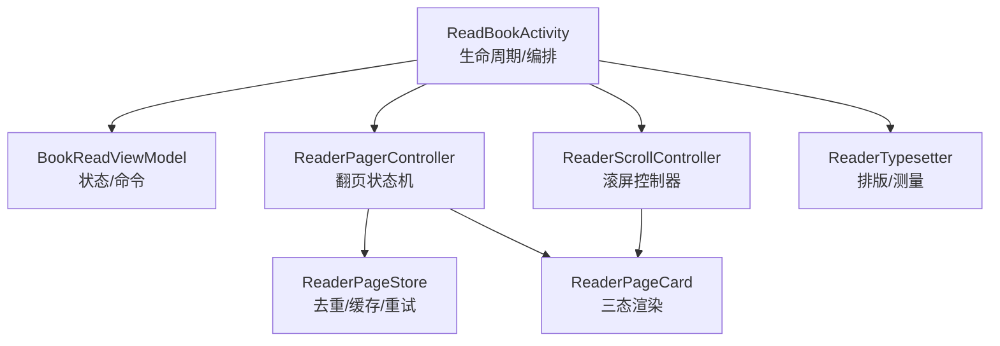
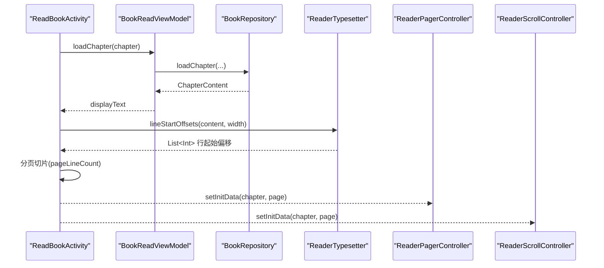
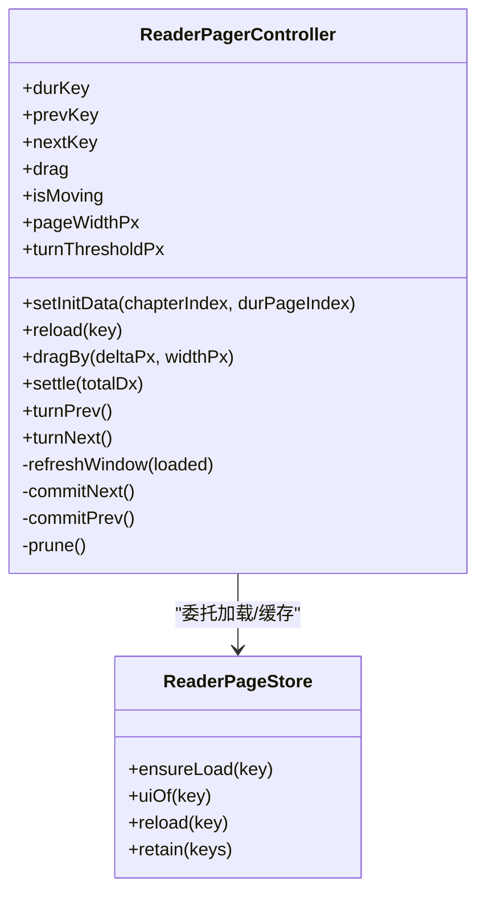
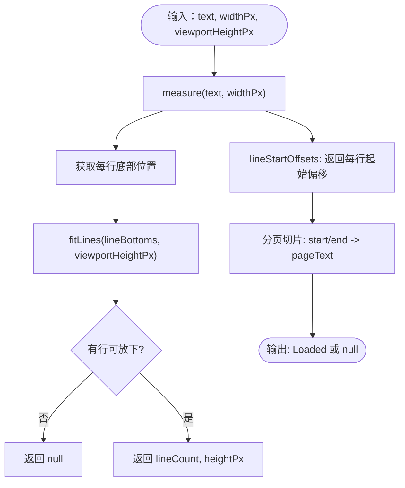
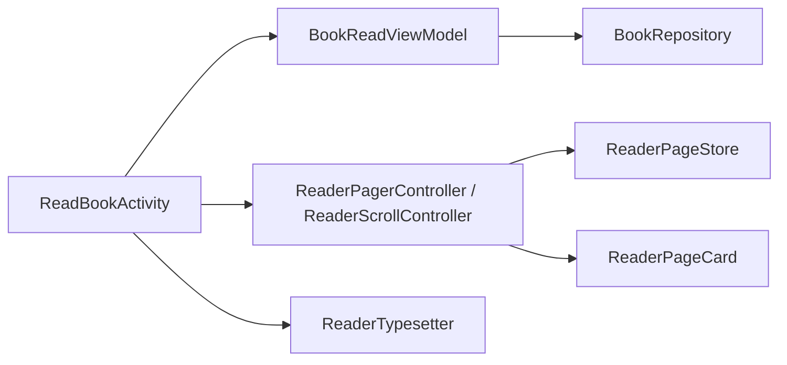

# Activity 生命周期管理

<cite>
**本文引用的文件**   
- [ReadBookActivity.kt](file://module_book/src/main/java/com/ebook/book/ReadBookActivity.kt)
- [BookReadViewModel.kt](file://module_book/src/main/java/com/ebook/book/mvvm/viewmodel/BookReadViewModel.kt)
- [ReaderPager.kt](file://module_book/src/main/java/com/ebook/book/reader/ReaderPager.kt)
- [ReaderScroll.kt](file://module_book/src/main/java/com/ebook/book/reader/ReaderScroll.kt)
- [ReaderTypesetter.kt](file://module_book/src/main/java/com/ebook/book/reader/ReaderTypesetter.kt)
</cite>

## 目录
1. [简介](#简介)
2. [项目结构](#项目结构)
3. [核心组件](#核心组件)
4. [架构总览](#架构总览)
5. [详细组件分析](#详细组件分析)
6. [依赖关系分析](#依赖关系分析)
7. [性能考量](#性能考量)
8. [故障排查指南](#故障排查指南)
9. [结论](#结论)
10. [附录：扩展与最佳实践](#附录扩展与最佳实践)

## 简介
本章节聚焦阅读页的 Activity 生命周期管理与 Compose 版阅读页的整体架构。重点说明 ReadBookActivity 如何组织翻页与滚屏两种模式、配色分层策略（正文层 vs chrome 层）、ReaderPager 与 ReaderScroll 的切换机制、ReaderTypesetter 的重排逻辑、loadPage 的数据加载链路（DB 缓存 → 网络请求 → 存库 → StaticLayout/Compose 重分行）、阅读设置实时调整与 rePaginate 触发机制、UI 面板集成（章节目录、设置、亮度调节）以及与 ViewModel 的状态协作与错误处理。

## 项目结构
- Activity 入口与编排：ReadBookActivity（组合页面、控制器挂载、手势拦截、状态栏主题、进度保存）
- ViewModel：BookReadViewModel（书架归属检查、进度读写、章节正文读取、刷新与追加目录）
- 渲染容器：ReaderPager（左右翻页三页窗口）、ReaderScroll（上下滚屏连续列表）
- 排版引擎：ReaderTypesetter（字号/行高/对齐，测量并计算每屏行数与块高）
- 页面卡片：ReaderPageCard（Loading/Error/Loaded 三态与页码行占位契约）

**图示来源**
- [ReadBookActivity.kt:145-431](file://module_book/src/main/java/com/ebook/book/ReadBookActivity.kt#L145-L431)
- [BookReadViewModel.kt:15-140](file://module_book/src/main/java/com/ebook/book/mvvm/viewmodel/BookReadViewModel.kt#L15-L140)
- [ReaderPager.kt:110-323](file://module_book/src/main/java/com/ebook/book/reader/ReaderPager.kt#L110-L323)
- [ReaderScroll.kt:72-233](file://module_book/src/main/java/com/ebook/book/reader/ReaderScroll.kt#L72-L233)
- [ReaderTypesetter.kt:18-175](file://module_book/src/main/java/com/ebook/book/reader/ReaderTypesetter.kt#L18-L175)

**章节来源**
- [ReadBookActivity.kt:86-97](file://module_book/src/main/java/com/ebook/book/ReadBookActivity.kt#L86-L97)
- [ReadBookActivity.kt:423-431](file://module_book/src/main/java/com/ebook/book/ReadBookActivity.kt#L423-L431)

## 核心组件
- ReadBookActivity：负责 Activity 生命周期钩子（onPause 保存进度）、键盘事件拦截（音量键）、Composable 编排（菜单/面板/控制器挂载）、正文尺寸测量回调、重分页与落点换算。
- BookReadViewModel：持有 bookShelf、pageLineCount、nextInShelfEvent；提供 updateProgress/saveProgress/loadChapter/refreshCurrentChapter/appendChaptersIfAny 等能力。
- ReaderPagerController：实现三页窗口状态机（prev/dur/next），封装手势拖拽、阈值判定、动画与提交翻页；通过 ReaderPageStore 进行加载去重与任务管理。
- ReaderScrollController：维护跨章连续列表项、块级加载、滚动位置上报与跳转（animate/scrollTo）。
- ReaderTypesetter：基于 Compose TextMeasurer 提供 lineStartOffsets、fitRenderLineCount、measureBlock 与 readerBodyTextStyle，保证“切行=渲染”同源。
- ReaderPageCard：三态 UI（Loading/Error/Loaded），固定页码行高度以稳定正文区测量高度。

**章节来源**
- [BookReadViewModel.kt:15-140](file://module_book/src/main/java/com/ebook/book/mvvm/viewmodel/BookReadViewModel.kt#L15-L140)
- [ReaderPager.kt:61-109](file://module_book/src/main/java/com/ebook/book/reader/ReaderPager.kt#L61-L109)
- [ReaderTypesetter.kt:18-175](file://module_book/src/main/java/com/ebook/book/reader/ReaderTypesetter.kt#L18-L175)
- [ReaderPager.kt:481-654](file://module_book/src/main/java/com/ebook/book/reader/ReaderPager.kt#L481-L654)

## 架构总览
- 配色分层：正文层使用「阅读背景主题」的四档纸张色（不随深浅色切换），chrome 层（顶/底栏、目录抽屉、面板、弹窗）继承全局主题（随外观主题深浅变化）。
- 翻页方式：turnMode 由设置决定，页面级镜像 turnModeIndex；根据模式将控制器挂到 Activity.pagerController 或 scrollController，音量键据此分发。
- 排版统一：ReaderTypesetter 在组合期记住，样式变化时通过 LaunchedEffect(typesetter) 触发 rePaginate，确保“测量=渲染”。
- 数据加载：loadPage 统一走 BookRepository.loadChapter（本地书/网络书同路径），先取内容文本，再按当前 typesetter 计算行起始偏移，分页切片后返回 Loaded。
- 设置联动：字体大小、行高、对齐变化会重组 typesetter，从而触发 rePaginate；亮度调节通过 applyReaderBrightness 应用；点击翻页开关即时生效（clickTurnEnabled 镜像）。

**图示来源**
- [ReadBookActivity.kt:308-377](file://module_book/src/main/java/com/ebook/book/ReadBookActivity.kt#L308-L377)
- [BookReadViewModel.kt:65-83](file://module_book/src/main/java/com/ebook/book/mvvm/viewmodel/BookReadViewModel.kt#L65-L83)
- [ReaderTypesetter.kt:53-85](file://module_book/src/main/java/com/ebook/book/reader/ReaderTypesetter.kt#L53-L85)
- [ReaderPager.kt:163-171](file://module_book/src/main/java/com/ebook/book/reader/ReaderPager.kt#L163-L171)
- [ReaderScroll.kt:98-105](file://module_book/src/main/java/com/ebook/book/reader/ReaderScroll.kt#L98-L105)

## 详细组件分析

### ReadBookActivity：生命周期与编排
- 生命周期
  - initData：进入即保存一次进度（防异常退出丢失），恢复手动亮度（applyReaderBrightness）。
  - onPause：再次保存进度。
  - BackHandler：优先关闭目录/菜单/加架确认，未加入书架退出前弹确认，否则 finish。
- 控制器挂载
  - DisposableEffect(turnModeIndex)：根据 turnModeIndex 选择将 pagerController 或 scrollController 挂到 Activity，二者互斥非空。
- 正文测量与重分页
  - onBodyMeasured：更新 readerContentWidthPx/readerBodyHeightPx。
  - rePaginate：用 typesetter.measureBlock 实测 lineCount 与 heightPx，写入 readerTypesetter/pageLineCount/readerBlockHeightPx/lastLineCount；startFromCurrent 控制是否同时 setInitData 两个控制器。
- 模式切换落点换算
  - convertPageIndex：按行号换算，避免两种模式视口差异导致错位。
- 数据加载
  - loadPage：取正文→按类型器求行偏移→分页切片→返回 Loaded；捕获 BookSourceNotFoundException 经 viewModel.reportFailure 提示用户。
- 手势与音量键
  - onKeyDown/onKeyUp：拦截音量键并根据当前控制器分派翻页/滚一屏。
- 主题与状态栏
  - PageContent：不包额外 MaterialTheme，继承 AppTheme；LaunchedEffect(bgVersion, menuVisible, panel) 动态设置状态栏颜色（菜单可见时跟随 chrome surface，否则纸张色）。

**章节来源**
- [ReadBookActivity.kt:145-154](file://module_book/src/main/java/com/ebook/book/ReadBookActivity.kt#L145-L154)
- [ReadBookActivity.kt:251-290](file://module_book/src/main/java/com/ebook/book/ReadBookActivity.kt#L251-L290)
- [ReadBookActivity.kt:308-416](file://module_book/src/main/java/com/ebook/book/ReadBookActivity.kt#L308-L416)
- [ReadBookActivity.kt:418-431](file://module_book/src/main/java/com/ebook/book/ReadBookActivity.kt#L418-L431)
- [ReadBookActivity.kt:604-626](file://module_book/src/main/java/com/ebook/book/ReadBookActivity.kt#L604-L626)
- [ReadBookActivity.kt:690-701](file://module_book/src/main/java/com/ebook/book/ReadBookActivity.kt#L690-L701)

### ReaderPager：翻页模式
- 三页窗口状态机：prev/dur/next 三个 key，drag 位移驱动动画，settle 依据阈值完成翻页或回弹。
- 窗口收敛：当目标页非 Loaded 时保留来路页作为相邻方向、未知方向置 null，避免自指与死页。
- 加载仓库：ReaderPageStore 负责 ensureLoad/reload/uiOf/retain，避免重复加载与任务泄漏。
- 手势：左右三分区点击可翻页（受 canClickTurn 控制），中间点击唤菜单；拖拽超过阈值则翻页。

**图示来源**
- [ReaderPager.kt:110-323](file://module_book/src/main/java/com/ebook/book/reader/ReaderPager.kt#L110-L323)

**章节来源**
- [ReaderPager.kt:61-109](file://module_book/src/main/java/com/ebook/book/reader/ReaderPager.kt#L61-L109)
- [ReaderPager.kt:335-438](file://module_book/src/main/java/com/ebook/book/reader/ReaderPager.kt#L335-L438)
- [ReaderPager.kt:481-654](file://module_book/src/main/java/com/ebook/book/reader/ReaderPager.kt#L481-L654)

### ReaderScroll：滚屏模式
- 连续列表：item 包含“章标题 + 正文块”，跨章无缝衔接；blockHeightPx 由排版实测给出，确保块间精确拼接。
- 滚动交互：仅处理点击分区（左右三分区滚一屏），竖向滚动交给 LazyColumn；首次可见项上报位置给控制器用于进度与锚点。
- 首屏与落点：jump 支持 animate/scrollTo；排版未落定时显示占位块，避免空白。

**章节来源**
- [ReaderScroll.kt:53-71](file://module_book/src/main/java/com/ebook/book/reader/ReaderScroll.kt#L53-L71)
- [ReaderScroll.kt:72-233](file://module_book/src/main/java/com/ebook/book/reader/ReaderScroll.kt#L72-L233)
- [ReaderScroll.kt:235-373](file://module_book/src/main/java/com/ebook/book/reader/ReaderScroll.kt#L235-L373)

### ReaderTypesetter：排版与测量
- 唯一样式源：readerBodyTextStyle 统一字号/行高/对齐/leading，保证切行与渲染一致。
- 关键方法：
  - lineStartOffsets：整章测量，返回每行起始偏移（避免 CRLF 被吞导致段落错乱）。
  - fitRenderLineCount：按视口高度求能放下多少行。
  - measureBlock：一次测量得出 lineCount 与 heightPx（块高）。
  - rememberReaderTypesetter：组合期记住 measurer/density/style，样式变化时重建。

**图示来源**
- [ReaderTypesetter.kt:53-85](file://module_book/src/main/java/com/ebook/book/reader/ReaderTypesetter.kt#L53-L85)
- [ReaderTypesetter.kt:126-175](file://module_book/src/main/java/com/ebook/book/reader/ReaderTypesetter.kt#L126-L175)

**章节来源**
- [ReaderTypesetter.kt:18-175](file://module_book/src/main/java/com/ebook/book/reader/ReaderTypesetter.kt#L18-L175)

### 数据加载链路：loadPage
- 步骤：
  1. 从 BookRepository.loadChapter 取正文（本地/网络统一路径）。
  2. 按当前 typesetter 计算行起始偏移（lineStartOffsets）。
  3. 按 pageLineCount 切片为页文本（substring from/to，保留段落分隔符）。
  4. 构建 ReaderPageUi.Loaded（title/chapterIndex/durPageIndex/pageAll/text）。
- 失败处理：
  - BookSourceNotFoundException：经 viewModel.reportFailure 上报用户可见提示。
  - 其他异常：记录日志并返回 null（控制器置错误态，提供重试按钮）。

**章节来源**
- [ReadBookActivity.kt:308-377](file://module_book/src/main/java/com/ebook/book/ReadBookActivity.kt#L308-L377)
- [BookReadViewModel.kt:65-83](file://module_book/src/main/java/com/ebook/book/mvvm/viewmodel/BookReadViewModel.kt#L65-L83)

### 阅读设置与 rePaginate
- 字体大小/行高/对齐：改变 textSizeSp/lineHeight 会重组 typesetter，LaunchedEffect(typesetter) 自动触发 rePaginate。
- 点击翻页开关：clickTurnEnabled 镜像同步，无需等待面板重组。
- 亮度调节：applyReaderBrightness 在 initData 恢复；亮度面板直接应用。
- rePaginate：以 typesetter.measureBlock 重新测算 lineCount/heightPx，必要时 setInitData 两个控制器；模式切换时使用 lastLineCount 与 convertPageIndex 做落点换算。

**章节来源**
- [ReadBookActivity.kt:251-290](file://module_book/src/main/java/com/ebook/book/ReadBookActivity.kt#L251-L290)
- [ReadBookActivity.kt:659-688](file://module_book/src/main/java/com/ebook/book/ReadBookActivity.kt#L659-L688)
- [ReadBookActivity.kt:470-483](file://module_book/src/main/java/com/ebook/book/ReadBookActivity.kt#L470-L483)

### UI 面板与手势集成
- 菜单栏：顶部/底部栏使用 AnimatedVisibility，点击空白关闭；状态栏颜色随菜单/面板状态切换。
- 章节目录：ChapterListDrawer 由 panel == CHAPTER 控制可见；BackHandler 优先关闭目录。
- 设置/字体/亮度：MoreSettingPanel/FontPanel/LightPanel 通过 panel 状态管理；字体/背景变化通过版本号触发重组与状态栏更新。
- 手势拦截：音量键在 Activity.onKeyDown/onKeyUp 中消费并转发到当前控制器；点击分区在 ReaderPager/ReaderScroll 内部处理。

**章节来源**
- [ReadBookActivity.kt:613-626](file://module_book/src/main/java/com/ebook/book/ReadBookActivity.kt#L613-L626)
- [ReadBookActivity.kt:723-901](file://module_book/src/main/java/com/ebook/book/ReadBookActivity.kt#L723-L901)
- [ReadBookActivity.kt:383-416](file://module_book/src/main/java/com/ebook/book/ReadBookActivity.kt#L383-L416)

### 与 ViewModel 的协作
- 状态观察：nextInShelfEvent 收集书架归属检查结果；chapterTitle/sliderValue 由活动本地状态承载并按 VM 回调更新。
- 命令通道：reportFailure 经 BaseViewModel 的命令通道在主线程消费，避免在 Activity 内手写 Toast。
- 进度持久化：updateProgress 写 durChapter/durChapterPage；saveProgress 异步落库。
- 章节操作：refreshCurrentChapter 删除缓存并重载；appendChaptersIfAny 追加目录后就地更新 chapterList 并触发 rePaginate。

**章节来源**
- [BookReadViewModel.kt:15-140](file://module_book/src/main/java/com/ebook/book/mvvm/viewmodel/BookReadViewModel.kt#L15-L140)
- [ReadBookActivity.kt:527-542](file://module_book/src/main/java/com/ebook/book/ReadBookActivity.kt#L527-L542)
- [ReadBookActivity.kt:361-376](file://module_book/src/main/java/com/ebook/book/ReadBookActivity.kt#L361-L376)

## 依赖关系分析
- 低耦合：Activity 仅通过接口式回调（loadPage/onProgress）与控制器解耦；控制器通过 ReaderPageStore 屏蔽加载细节。
- 同源排版：ReaderTypesetter 同时服务于 ReaderPageCard 与 ReaderScroll，避免两套引擎导致的行数不一致。
- 单向数据流：VM 持有书架与进度，Activity 仅负责 UI 编排与事件转发；Repository 负责 IO。

**图示来源**
- [ReadBookActivity.kt:544-591](file://module_book/src/main/java/com/ebook/book/ReadBookActivity.kt#L544-L591)
- [ReaderPager.kt:149-151](file://module_book/src/main/java/com/ebook/book/reader/ReaderPager.kt#L149-L151)
- [ReaderTypesetter.kt:117-123](file://module_book/src/main/java/com/ebook/book/reader/ReaderTypesetter.kt#L117-L123)
- [BookReadViewModel.kt:15-140](file://module_book/src/main/java/com/ebook/book/mvvm/viewmodel/BookReadViewModel.kt#L15-L140)

**章节来源**
- [ReadBookActivity.kt:544-591](file://module_book/src/main/java/com/ebook/book/ReadBookActivity.kt#L544-L591)
- [ReaderPager.kt:149-151](file://module_book/src/main/java/com/ebook/book/reader/ReaderPager.kt#L149-L151)
- [ReaderTypesetter.kt:117-123](file://module_book/src/main/java/com/ebook/book/reader/ReaderTypesetter.kt#L117-L123)
- [BookReadViewModel.kt:15-140](file://module_book/src/main/java/com/ebook/book/mvvm/viewmodel/BookReadViewModel.kt#L15-L140)

## 性能考量
- 排版测量成本：lineStartOffsets 对整章 O(N)，超长章节可能放大 N×CPU 开销；当前在同章翻页通过 ChapterLayoutCache 缓存 lineStartOffsets，减少重复重排。
- 布局稳定性：ReaderPageCard 固定页码行高度，避免 Loading/Loaded 高度变化导致行数测算漂移。
- 滚动性能：ReaderScroll 仅在 LazyColumn 视口回报尺寸，避免 item 自身回报造成自我收缩循环。
- 动画与手势：ReaderPagerController 在 isMoving 期间锁定手势与程序化翻页，避免并发动画。

[本节为通用性能建议，无特定文件分析]

## 故障排查指南
- 书源失效：loadPage 捕获 BookSourceNotFoundException 并通过 reportFailure 提示用户“书源已失效，请重新导入或换源”；若静默降级会导致页面永远空白。
- 正文少段/接不上：确认“切行与渲染同源”（readerBodyTextStyle 一致）；避免使用平台度量估算行数，改用 typesetter.measureBlock。
- 页数错位/跳页：检查 pageLineCount 是否正确、convertPageIndex 是否在模式切换时被调用；确认 ReaderPageCard 页码行高度恒定。
- 菜单/面板遮挡：确认状态栏颜色在菜单可见时切换为 chrome surface；面板返回键由 BackHandler 顺序消费。
- 进度丢失：确保 onPause/initData 调用 saveProgress；外部打开文本导入流程完成后需 checkInShelf。

**章节来源**
- [ReadBookActivity.kt:361-376](file://module_book/src/main/java/com/ebook/book/ReadBookActivity.kt#L361-L376)
- [ReaderTypesetter.kt:126-146](file://module_book/src/main/java/com/ebook/book/reader/ReaderTypesetter.kt#L126-L146)
- [ReadBookActivity.kt:149-154](file://module_book/src/main/java/com/ebook/book/ReadBookActivity.kt#L149-L154)
- [ReadBookActivity.kt:613-626](file://module_book/src/main/java/com/ebook/book/ReadBookActivity.kt#L613-L626)

## 结论
ReadBookActivity 通过 Compose 编排实现了翻页与滚屏两种阅读模式的统一接入，借助 ReaderTypesetter 确保排版与渲染同源，配合 ReaderPageCard 的稳定占位契约保障分页正确性。数据加载链路清晰（DB/网络→排版→切片→渲染），设置变更通过 typesetter 重组触发 rePaginate，保证用户体验一致性。与 ViewModel 的协作遵循状态观察与命令通道模式，错误处理覆盖书源失效等关键路径。整体架构清晰、可维护性强，便于扩展新的阅读设置与自定义渲染逻辑。

[本节为总结性内容，无特定文件分析]

## 附录：扩展与最佳实践
- 新增阅读设置
  - 在 ReadBookActivity/PageContent 中增加状态变量与版本计数器（如 textKindVersion/bgVersion），并在面板回调中递增版本号触发重组。
  - 如需影响排版，修改 textSizeSp/lineHeight 后由 LaunchedEffect(typesetter) 自动触发 rePaginate。
  - 示例参考：字体/背景变化 → 版本号递增 → 重组 → rePaginate。
- 自定义页面渲染逻辑
  - 保持 ReaderPageCard 的三态契约（Loading/Error/Loaded）与页码行高度恒定；确保样式与 typesetter 一致。
  - 如需自定义块渲染，复用 readerBodyTextStyle 并遵循块高由排版实测的原则。
- 章节切换边界处理
  - 末章追加目录：syncAtTailChapter 在末章回调中触发 appendChaptersIfAny，成功后 rePaginate 并更新标题与滑条。
  - 换源：整体替换 viewModel.bookShelf，重置 isAdd，rePaginate 后 gotoPage 目标章首页。
- 与 ViewModel 协作
  - 使用 nextInShelfEvent 监听书架归属结果；updateProgress/saveProgress 保持进度一致；reportFailure 统一上报错误。
  - 避免在 Activity 中手写提示文案，统一走命令通道。

**章节来源**
- [ReadBookActivity.kt:527-542](file://module_book/src/main/java/com/ebook/book/ReadBookActivity.kt#L527-L542)
- [ReadBookActivity.kt:933-978](file://module_book/src/main/java/com/ebook/book/ReadBookActivity.kt#L933-L978)
- [BookReadViewModel.kt:85-112](file://module_book/src/main/java/com/ebook/book/mvvm/viewmodel/BookReadViewModel.kt#L85-L112)