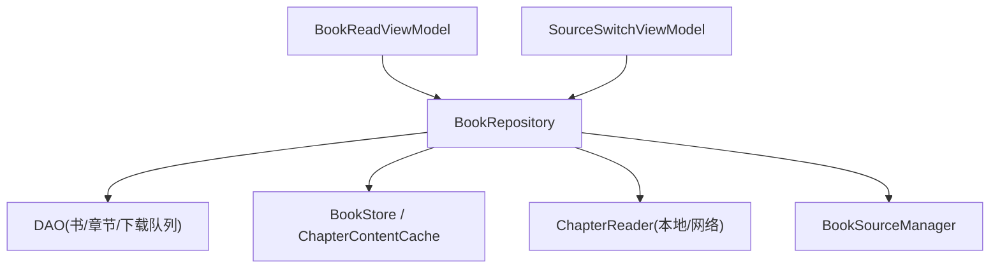
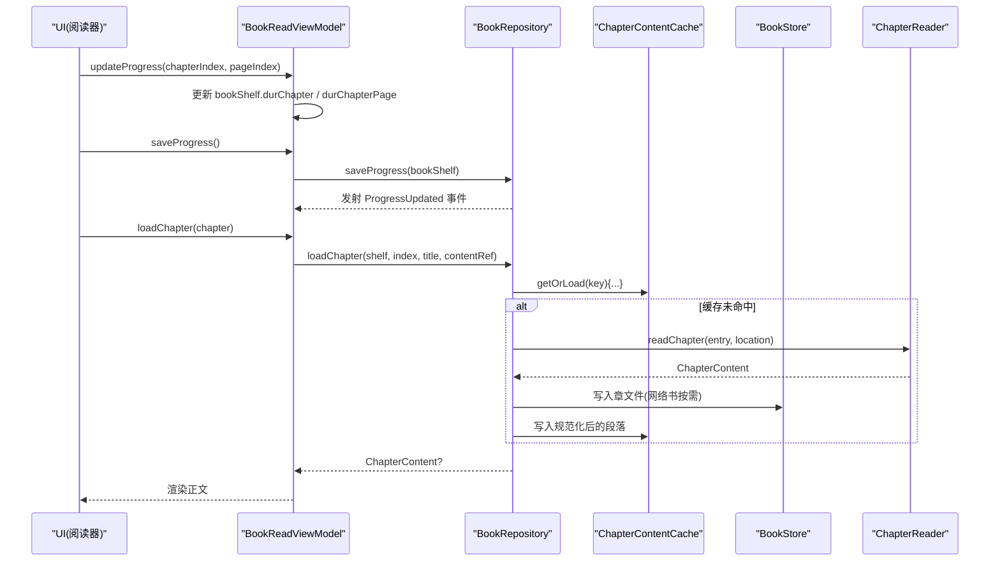
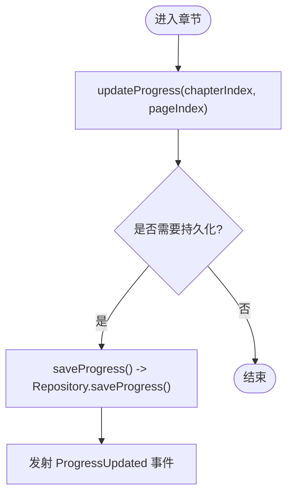
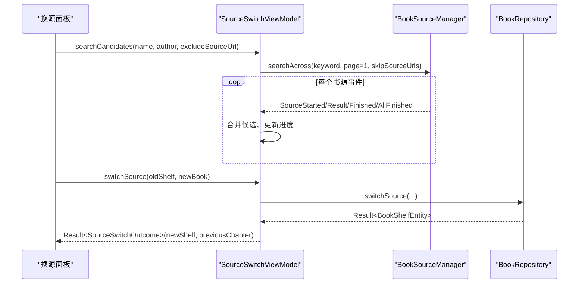
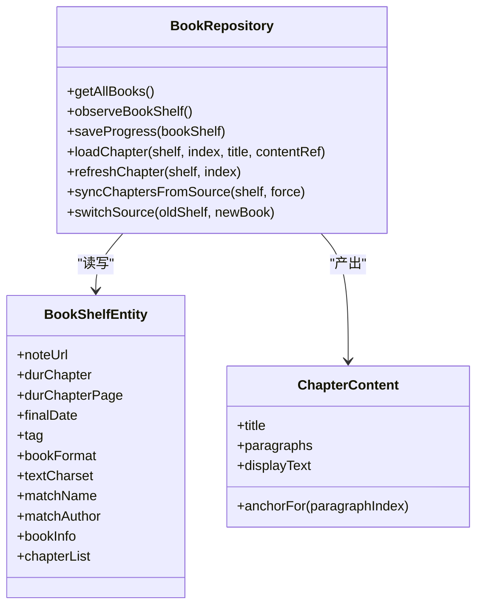
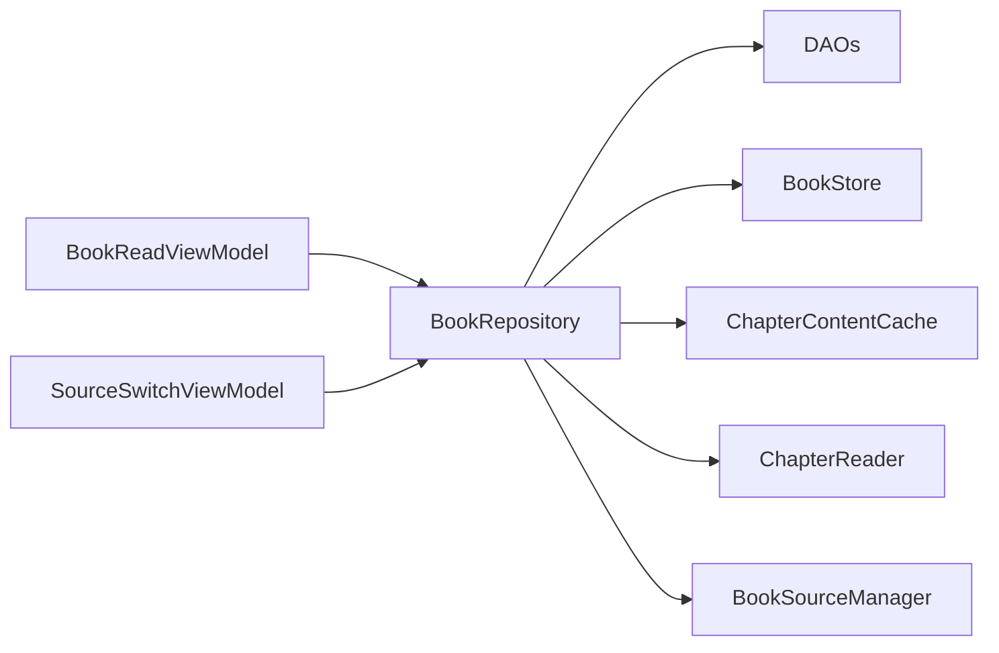

# ViewModel 状态管理

<cite>
**本文引用的文件**
- [BookReadViewModel.kt](file://module_book/src/main/java/com/ebook/book/mvvm/viewmodel/BookReadViewModel.kt)
- [SourceSwitchViewModel.kt](file://module_book/src/main/java/com/ebook/book/mvvm/viewmodel/SourceSwitchViewModel.kt)
- [BookRepository.kt](file://lib_book_common/src/main/java/com/ebook/common/repository/BookRepository.kt)
- [Contracts.kt](file://lib_book_common/src/main/java/com/ebook/common/analyze/local/Contracts.kt)
- [BookShelfEntity.kt](file://lib_ebook_db/src/main/java/com/ebook/db/entity/BookShelfEntity.kt)
- [SourceSwitchViewModelTest.kt](file://module_book/src/test/java/com/ebook/book/mvvm/viewmodel/SourceSwitchViewModelTest.kt)
</cite>

## 目录
1. [简介](#简介)
2. [项目结构](#项目结构)
3. [核心组件](#核心组件)
4. [架构总览](#架构总览)
5. [详细组件分析](#详细组件分析)
6. [依赖关系分析](#依赖关系分析)
7. [性能考虑](#性能考虑)
8. [故障排查指南](#故障排查指南)
9. [结论](#结论)
10. [附录：扩展与自定义示例](#附录扩展与自定义示例)

## 简介
本文件聚焦阅读模块的 ViewModel 状态管理，围绕两个关键类展开：
- BookReadViewModel：负责书籍信息持有、进度管理、章节内容加载、书架操作、目录追加等。
- SourceSwitchViewModel：负责“阅读中换源”的候选搜索、匹配排序、进度展示与失败处理，以及执行换源事务后的结果回传。

目标读者既包括需要深入理解代码实现的技术人员，也包括希望快速掌握阅读状态流转的非技术读者。

## 项目结构
- 业务页面与活动位于 module_book（如 ReadBookActivity、SourceSwitchSheet）。
- ViewModel 位于 module_book 的 mvvm/viewmodel 包下。
- 数据访问与领域逻辑集中在 lib_book_common 的 repository 层（BookRepository）。
- 领域模型与通用类型在 lib_book_common 的 analyze/local 与 lib_ebook_db 的 entity 中定义（如 ChapterContent、BookShelfEntity）。

图表来源
- [BookReadViewModel.kt:15-83](file://module_book/src/main/java/com/ebook/book/mvvm/viewmodel/BookReadViewModel.kt#L15-L83)
- [SourceSwitchViewModel.kt:50-177](file://module_book/src/main/java/com/ebook/book/mvvm/viewmodel/SourceSwitchViewModel.kt#L50-L177)
- [BookRepository.kt:51-74](file://lib_book_common/src/main/java/com/ebook/common/repository/BookRepository.kt#L51-L74)

章节来源
- [BookReadViewModel.kt:15-139](file://module_book/src/main/java/com/ebook/book/mvvm/viewmodel/BookReadViewModel.kt#L15-L139)
- [SourceSwitchViewModel.kt:22-177](file://module_book/src/main/java/com/ebook/book/mvvm/viewmodel/SourceSwitchViewModel.kt#L22-L177)
- [BookRepository.kt:38-74](file://lib_book_common/src/main/java/com/ebook/common/repository/BookRepository.kt#L38-L74)

## 核心组件
- BookReadViewModel
  - 职责：持有当前书架条目（bookShelf），维护阅读进度（durChapter/durChapterPage）、提供统一章节读取、刷新章节缓存、检查并添加到书架、追加新章等。
  - 关键方法：updateProgress、saveProgress、loadChapter、refreshCurrentChapter、checkInShelf、addToShelf、appendChaptersIfAny。
- SourceSwitchViewModel
  - 职责：聚合多书源候选搜索、按匹配度排序、展示进度与失败原因；执行换源并将结果与上下文交回 UI。
  - 关键方法：searchCandidates、switchSource、matchScore、onEvent、finishRound。

章节来源
- [BookReadViewModel.kt:15-139](file://module_book/src/main/java/com/ebook/book/mvvm/viewmodel/BookReadViewModel.kt#L15-L139)
- [SourceSwitchViewModel.kt:22-177](file://module_book/src/main/java/com/ebook/book/mvvm/viewmodel/SourceSwitchViewModel.kt#L22-L177)

## 架构总览
MVVM + Repository 模式：
- View（Compose/Activity）订阅 ViewModel 暴露的状态流或调用命令方法。
- ViewModel 仅编排业务动作，委托给 Repository 完成跨进程/线程的 I/O、数据库写入与事件发布。
- Repository 封装统一的章节读取管线、换源事务、目录同步、内容存储与内存缓存失效。

图表来源
- [BookReadViewModel.kt:25-71](file://module_book/src/main/java/com/ebook/book/mvvm/viewmodel/BookReadViewModel.kt#L25-L71)
- [BookRepository.kt:455-475](file://lib_book_common/src/main/java/com/ebook/common/repository/BookRepository.kt#L455-L475)
- [Contracts.kt:67-78](file://lib_book_common/src/main/java/com/ebook/common/analyze/local/Contracts.kt#L67-L78)

## 详细组件分析

### BookReadViewModel 分析
- 书籍信息持有
  - 字段 bookShelf 承载当前书架条目（包含 chapterList、durChapter、durChapterPage 等）。
- 进度管理
  - updateProgress：更新 durChapter 与 durChapterPage。
  - saveProgress：异步持久化，通过 Repository.saveProgress 落库并触发进度事件。
- 统一章节读取
  - loadChapter：将本地书与网络书的读取收敛到同一接口，内部经 BookRepository.loadChapter 路由到对应 ChapterReader，并在缓存前进行段落规范化。
- 刷新当前章节
  - refreshCurrentChapter：仅对网络书生效，删除章文件并失效内存缓存，返回 (chapterIndex, pageIndex) 供 UI 重新加载。
- 书架操作
  - checkInShelf：查询是否已在书架（getBookByUrl），并通过 nextInShelfEvent 通知 UI。
  - addToShelf：调用仓库 addToShelf，成功后回调 addSuccess。
- 目录追加
  - appendChaptersIfAny：限频后重抓目录，仅在“可追加”时就地合并新章列表，返回新增章节以便 UI 增量渲染。

图表来源
- [BookReadViewModel.kt:25-38](file://module_book/src/main/java/com/ebook/book/mvvm/viewmodel/BookReadViewModel.kt#L25-L38)
- [BookRepository.kt:135-140](file://lib_book_common/src/main/java/com/ebook/common/repository/BookRepository.kt#L135-L140)

章节来源
- [BookReadViewModel.kt:15-139](file://module_book/src/main/java/com/ebook/book/mvvm/viewmodel/BookReadViewModel.kt#L15-L139)
- [BookRepository.kt:135-140](file://lib_book_common/src/main/java/com/ebook/common/repository/BookRepository.kt#L135-L140)

### SourceSwitchViewModel 分析
- 候选搜索与状态跟踪
  - searchCandidates：发起跨源聚合搜索，排除当前书源；维护 candidates、progress、isSearching、searchFailure 四个状态流。
  - onEvent：根据 AggregateSearchEvent 分支更新集合与进度，AllFinished 作为收尾判据。
  - matchScore：五档打分（完全匹配、同名、包含、作者相同、其他），稳定排序保证 UI 行序可复现。
- 失败处理与用户反馈
  - 单源失败记录日志，不阻断整体流程；整条流出问题捕获异常并设置 searchFailure，由面板内联渲染提示。
- 执行换源
  - switchSource：调用 BookRepository.switchSource，将 Result 包装为 SourceSwitchOutcome（含新条目、旧进度、目录长度）交回 UI，用于提示“已跳到第X章”或“已落到最后一章”。

图表来源
- [SourceSwitchViewModel.kt:117-177](file://module_book/src/main/java/com/ebook/book/mvvm/viewmodel/SourceSwitchViewModel.kt#L117-L177)
- [BookRepository.kt:292-339](file://lib_book_common/src/main/java/com/ebook/common/repository/BookRepository.kt#L292-L339)

章节来源
- [SourceSwitchViewModel.kt:22-177](file://module_book/src/main/java/com/ebook/book/mvvm/viewmodel/SourceSwitchViewModel.kt#L22-L177)
- [SourceSwitchViewModelTest.kt:176-394](file://module_book/src/test/java/com/ebook/book/mvvm/viewmodel/SourceSwitchViewModelTest.kt#L176-L394)

### Repository 层交互模式
- 异步操作封装
  - 使用协程 withContext(Dispatchers.IO) 执行 IO 密集任务；Flow/SharedFlow 发布事件（如 progress、chapters updated）。
- 错误处理策略
  - 章节读取：空段落视为缺失，不落缓存；书源缺失抛 BookSourceNotFoundException，VM 侧统一处置。
  - 目录同步：限频窗口、分叉、追加、失败四类结果，静默路径用结果对象表达而非抛出。
  - 换源事务：解析阶段失败与事务内失败区分，成功才发 Removed/Added 事件。
- 状态同步机制
  - 进度保存后发射 ProgressUpdated；目录追加后发射 ChaptersUpdated；换源后先移除旧条目再添加新条目，避免 UI 短暂重复。

图表来源
- [BookRepository.kt:81-146](file://lib_book_common/src/main/java/com/ebook/common/repository/BookRepository.kt#L81-L146)
- [BookRepository.kt:455-490](file://lib_book_common/src/main/java/com/ebook/common/repository/BookRepository.kt#L455-L490)
- [BookShelfEntity.kt:14-75](file://lib_ebook_db/src/main/java/com/ebook/db/entity/BookShelfEntity.kt#L14-L75)
- [Contracts.kt:67-78](file://lib_book_common/src/main/java/com/ebook/common/analyze/local/Contracts.kt#L67-L78)

章节来源
- [BookRepository.kt:38-74](file://lib_book_common/src/main/java/com/ebook/common/repository/BookRepository.kt#L38-L74)
- [BookRepository.kt:135-146](file://lib_book_common/src/main/java/com/ebook/common/repository/BookRepository.kt#L135-L146)
- [BookRepository.kt:292-339](file://lib_book_common/src/main/java/com/ebook/common/repository/BookRepository.kt#L292-L339)
- [BookRepository.kt:455-490](file://lib_book_common/src/main/java/com/ebook/common/repository/BookRepository.kt#L455-L490)
- [BookRepository.kt:512-599](file://lib_book_common/src/main/java/com/ebook/common/repository/BookRepository.kt#L512-L599)

## 依赖关系分析
- BookReadViewModel 依赖 BookRepository 完成所有持久化与数据读取；依赖 SharedFlow 发出书架事件（nextInShelfEvent）。
- SourceSwitchViewModel 依赖 BookSourceManager 获取聚合搜索结果，依赖 BookRepository 执行换源事务。
- BookRepository 组合 DAO、BookStore、ChapterContentCache、ChapterReader、WriteTransactionRunner，形成统一的数据与存储访问面。

图表来源
- [BookReadViewModel.kt:15-83](file://module_book/src/main/java/com/ebook/book/mvvm/viewmodel/BookReadViewModel.kt#L15-L83)
- [SourceSwitchViewModel.kt:50-177](file://module_book/src/main/java/com/ebook/book/mvvm/viewmodel/SourceSwitchViewModel.kt#L50-L177)
- [BookRepository.kt:51-74](file://lib_book_common/src/main/java/com/ebook/common/repository/BookRepository.kt#L51-L74)

章节来源
- [BookReadViewModel.kt:15-83](file://module_book/src/main/java/com/ebook/book/mvvm/viewmodel/BookReadViewModel.kt#L15-L83)
- [SourceSwitchViewModel.kt:50-177](file://module_book/src/main/java/com/ebook/book/mvvm/viewmodel/SourceSwitchViewModel.kt#L50-L177)
- [BookRepository.kt:51-74](file://lib_book_common/src/main/java/com/ebook/common/repository/BookRepository.kt#L51-L74)

## 性能考虑
- 进度保存采用协程异步落库，避免阻塞 UI。
- 章节内容通过 ChapterContentCache 缓存，减少重复 I/O；仅在网络书刷新时删除章文件并失效缓存。
- 目录同步具备限频窗口，避免频繁请求；只在“可追加”时写库，且无需失效已有缓存。
- 换源事务将解析放在事务外，缩短 Room 写事务时间，降低全库写入阻塞风险。

[本节为通用指导，不涉及具体文件分析]

## 故障排查指南
- 进度未持久化
  - 检查 BookReadViewModel.updateProgress 是否正确更新 durChapter/durChapterPage；确认 saveProgress 是否被调用并进入 viewModelScope.launch。
  - 参考：[BookReadViewModel.kt:25-38](file://module_book/src/main/java/com/ebook/book/mvvm/viewmodel/BookReadViewModel.kt#L25-L38)
- 章节内容为空
  - 检查 loadChapter 返回值是否为 null（空段落被视为缺失）；确认 ChapterReader 是否正确读取，ChapterContentCache 是否命中。
  - 参考：[BookRepository.kt:455-475](file://lib_book_common/src/main/java/com/ebook/common/repository/BookRepository.kt#L455-L475)
- 刷新章节无效
  - 确认当前书不是本地书（本地书不刷新）；检查 refreshChapter 是否调用了 deleteChapter 与 invalidateBook。
  - 参考：[BookRepository.kt:477-490](file://lib_book_common/src/main/java/com/ebook/common/repository/BookRepository.kt#L477-L490)
- 换源候选为空或加载态不消失
  - 检查 searchCandidates 是否传入正确的 excludeSourceUrl；确认 AllFinished 是否到达；若整条流异常，查看 searchFailure。
  - 参考：[SourceSwitchViewModel.kt:117-147](file://module_book/src/main/java/com/ebook/book/mvvm/viewmodel/SourceSwitchViewModel.kt#L117-L147)
- 换源失败提示不显示
  - 本 VM 的命令通道无人收集，失败必须通过 StateFlow 输出并由面板内联渲染；确保 onResult 正确处理 Result.failure。
  - 参考：[SourceSwitchViewModel.kt:149-177](file://module_book/src/main/java/com/ebook/book/mvvm/viewmodel/SourceSwitchViewModel.kt#L149-L177)

章节来源
- [BookReadViewModel.kt:25-83](file://module_book/src/main/java/com/ebook/book/mvvm/viewmodel/BookReadViewModel.kt#L25-L83)
- [BookRepository.kt:455-490](file://lib_book_common/src/main/java/com/ebook/common/repository/BookRepository.kt#L455-L490)
- [SourceSwitchViewModel.kt:117-177](file://module_book/src/main/java/com/ebook/book/mvvm/viewmodel/SourceSwitchViewModel.kt#L117-L177)

## 结论
- BookReadViewModel 以简洁的 API 抽象了阅读过程中的进度、加载与书架操作，配合 Repository 的统一读取与缓存策略，保证了本地书与网络书的一致性体验。
- SourceSwitchViewModel 通过增量聚合搜索、稳定排序与严格的失败处理，为用户提供可靠的“阅读中换源”能力，并以结构化结果（SourceSwitchOutcome）向 UI 传递必要的上下文。
- Repository 层承担了异步封装、错误处理与状态同步的职责，确保 ViewModel 保持薄而专注。

[本节为总结性内容，不涉及具体文件分析]

## 附录：扩展与自定义示例
- 扩展新的阅读设置
  - 在 BookReadViewModel 中添加新配置字段（如 pageLineCount），并在 UI 层通过 Compose mutableStateOf 绑定；必要时在 saveProgress 中将设置随书架实体持久化。
  - 参考：[BookReadViewModel.kt:22-23](file://module_book/src/main/java/com/ebook/book/mvvm/viewmodel/BookReadViewModel.kt#L22-L23)
- 自定义章节加载逻辑
  - 在 BookRepository.loadChapter 中扩展 ChapterReader 的路由与缓存策略；确保规范化逻辑仍在入缓存之前执行。
  - 参考：[BookRepository.kt:455-475](file://lib_book_common/src/main/java/com/ebook/common/repository/BookRepository.kt#L455-L475)
- 处理书源切换的错误场景
  - 在 SourceSwitchViewModel.switchSource 中捕获并分类异常（如 BookSourceNotFoundException、BookAlreadyOnShelfException），将失败原因交由 UI 面板内联提示。
  - 参考：[SourceSwitchViewModel.kt:149-177](file://module_book/src/main/java/com/ebook/book/mvvm/viewmodel/SourceSwitchViewModel.kt#L149-L177)
  - 单元测试覆盖行为断言，确保排序、去重、进度收尾与结果回传符合预期。
  - 参考：[SourceSwitchViewModelTest.kt:176-394](file://module_book/src/test/java/com/ebook/book/mvvm/viewmodel/SourceSwitchViewModelTest.kt#L176-L394)

章节来源
- [BookReadViewModel.kt:22-23](file://module_book/src/main/java/com/ebook/book/mvvm/viewmodel/BookReadViewModel.kt#L22-L23)
- [BookRepository.kt:455-475](file://lib_book_common/src/main/java/com/ebook/common/repository/BookRepository.kt#L455-L475)
- [SourceSwitchViewModel.kt:149-177](file://module_book/src/main/java/com/ebook/book/mvvm/viewmodel/SourceSwitchViewModel.kt#L149-L177)
- [SourceSwitchViewModelTest.kt:176-394](file://module_book/src/test/java/com/ebook/book/mvvm/viewmodel/SourceSwitchViewModelTest.kt#L176-L394)