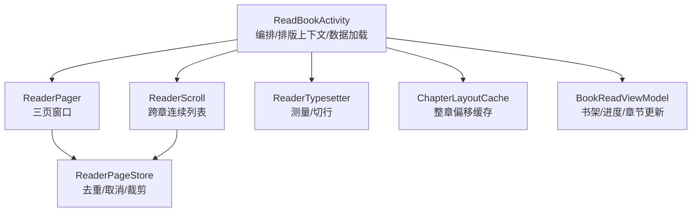
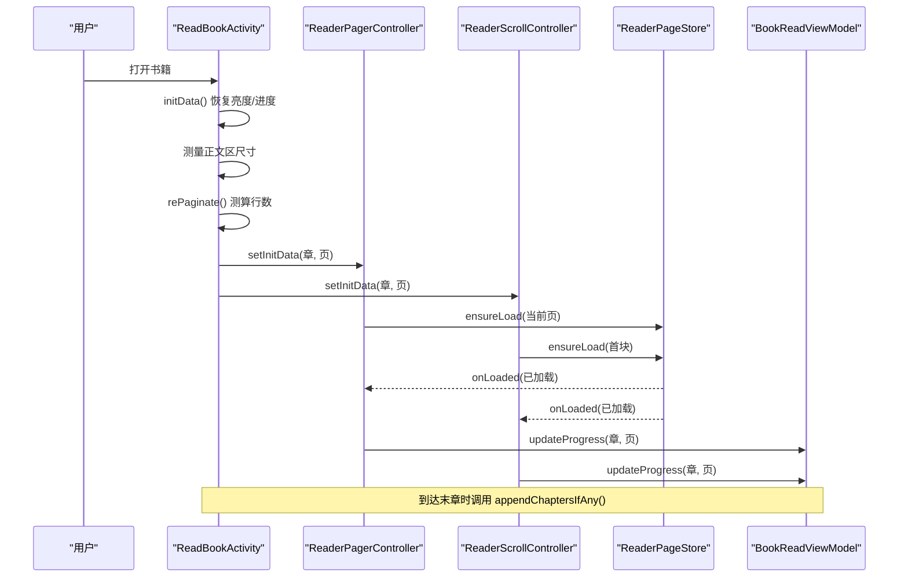
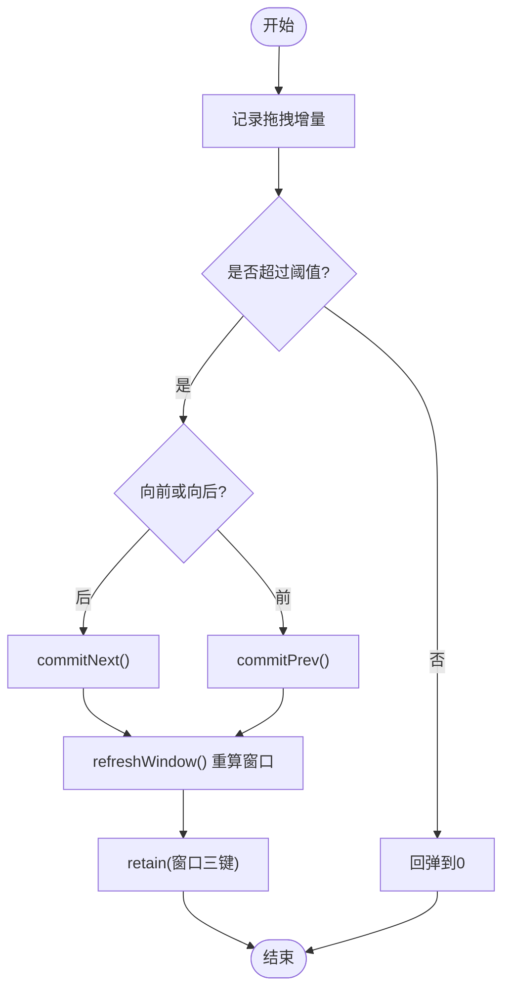
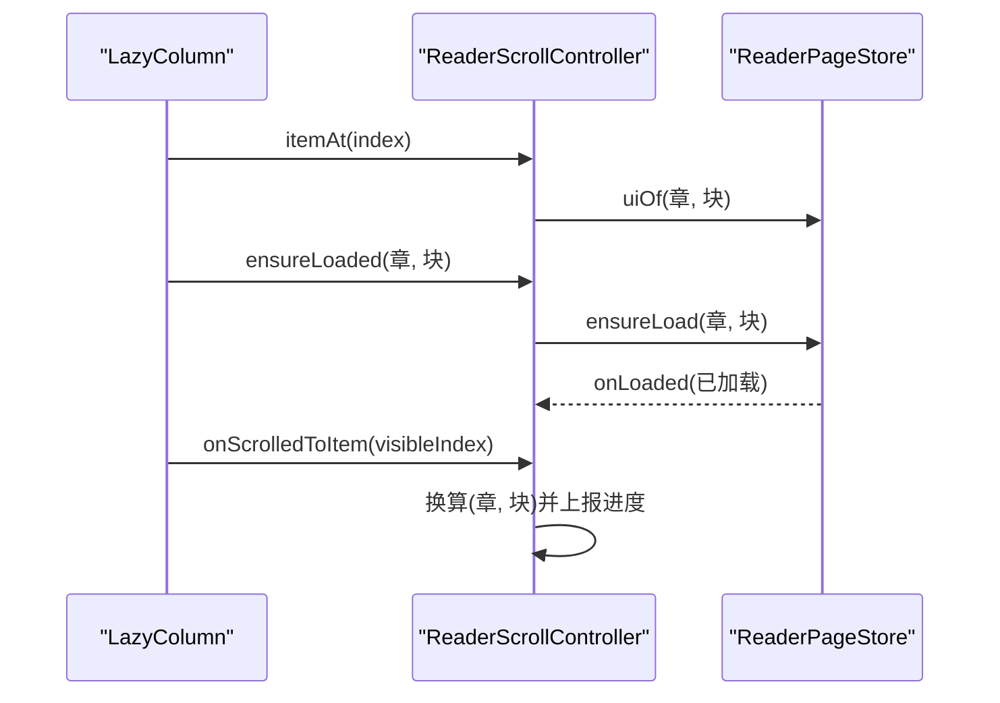
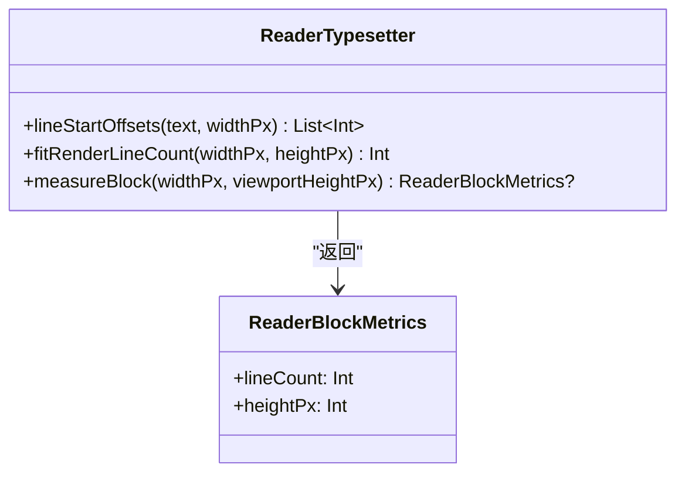
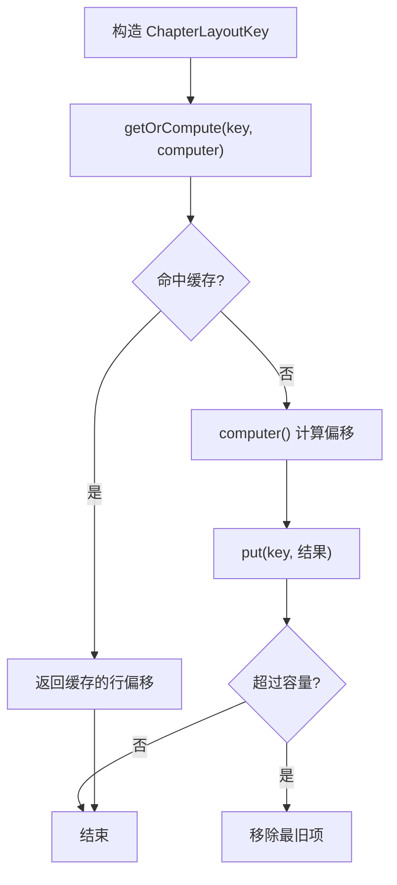
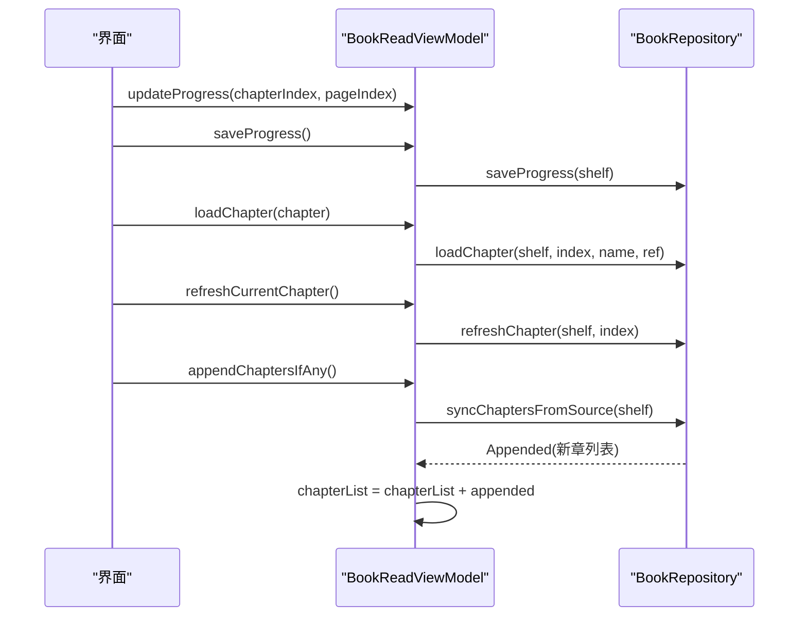
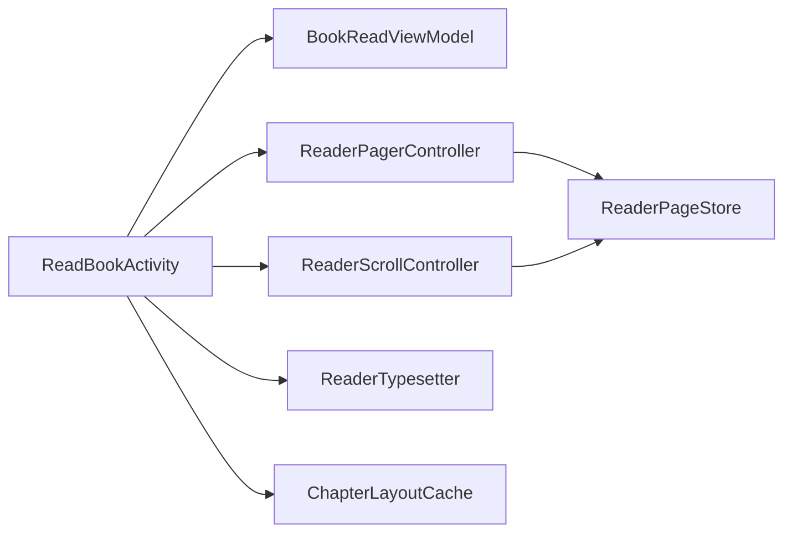

# 书籍阅读模块 (module_book)

<cite>
**本文引用的文件列表**
- [ReadBookActivity.kt](file://module_book/src/main/java/com/ebook/book/ReadBookActivity.kt)
- [ReaderPager.kt](file://module_book/src/main/java/com/ebook/book/reader/ReaderPager.kt)
- [ReaderScroll.kt](file://module_book/src/main/java/com/ebook/book/reader/ReaderScroll.kt)
- [ReaderTypesetter.kt](file://module_book/src/main/java/com/ebook/book/reader/ReaderTypesetter.kt)
- [ChapterLayoutCache.kt](file://module_book/src/main/java/com/ebook/book/reader/ChapterLayoutCache.kt)
- [ReaderPageStore.kt](file://module_book/src/main/java/com/ebook/book/reader/ReaderPageStore.kt)
- [BookReadViewModel.kt](file://module_book/src/main/java/com/ebook/book/mvvm/viewmodel/BookReadViewModel.kt)
- [ReaderScrollController.kt](file://module_book/src/main/java/com/ebook/book/reader/ReaderScrollController.kt)
</cite>

## 目录
1. [简介](#简介)
2. [项目结构](#项目结构)
3. [核心组件](#核心组件)
4. [架构总览](#架构总览)
5. [详细组件分析](#详细组件分析)
6. [依赖关系分析](#依赖关系分析)
7. [性能考量](#性能考量)
8. [故障排查指南](#故障排查指南)
9. [结论](#结论)
10. [附录](#附录)

## 简介
本模块实现书籍阅读的核心能力：两种翻页模式（分页与滚屏）、正文排版、章节缓存、进度同步、设置面板与亮度调节等。整体采用 Compose UI + MVVM，控制器层继承全局主题，正文层使用独立的“阅读背景主题”，确保四档纸张色不受深浅色切换影响。

## 项目结构
- 入口与编排：ReadBookActivity 负责页面组装、排版上下文落定、数据加载流程、音量键处理与进度保存。
- 翻页容器：ReaderPager（三页窗口）与 ReaderScroll（跨章连续列表）。
- 排版与缓存：ReaderTypesetter（测量与切行）、ChapterLayoutCache（整章偏移缓存）。
- 状态与仓库：ReaderPageStore（去重、取消、裁剪），BookReadViewModel（书架实体、进度、章节更新）。
- 滚动控制：ReaderScrollController（滚屏模式的项序列、锚点、预取）。

图表来源
- [ReadBookActivity.kt:251-377](file://module_book/src/main/java/com/ebook/book/ReadBookActivity.kt#L251-L377)
- [ReaderPager.kt:110-323](file://module_book/src/main/java/com/ebook/book/reader/ReaderPager.kt#L110-L323)
- [ReaderScroll.kt:72-233](file://module_book/src/main/java/com/ebook/book/reader/ReaderScroll.kt#L72-L233)
- [ReaderTypesetter.kt:29-175](file://module_book/src/main/java/com/ebook/book/reader/ReaderTypesetter.kt#L29-L175)
- [ChapterLayoutCache.kt:38-61](file://module_book/src/main/java/com/ebook/book/reader/ChapterLayoutCache.kt#L38-L61)
- [ReaderPageStore.kt:29-98](file://module_book/src/main/java/com/ebook/book/reader/ReaderPageStore.kt#L29-L98)
- [BookReadViewModel.kt:15-140](file://module_book/src/main/java/com/ebook/book/mvvm/viewmodel/BookReadViewModel.kt#L15-L140)

章节来源
- [ReadBookActivity.kt:86-154](file://module_book/src/main/java/com/ebook/book/ReadBookActivity.kt#L86-L154)

## 核心组件
- 阅读器容器与控制器
  - ReaderPagerController：维护 dur/prev/next 三页窗口、手势拖拽与动画、提交翻页时的窗口收敛与内存裁剪。
  - ReaderScrollController：提供跨章连续的项序列、锚点与预取，保证 LazyColumn key 稳定且唯一。
- 排版与分页
  - ReaderTypesetter：以 Compose TextMeasurer 测量断行，返回每行起始偏移；提供 fitRenderLineCount 与 measureBlock 两套口径。
  - ChapterLayoutCache：按 contentRef+contentLength+fontSizeSp+widthPx 作为键缓存整章偏移，避免同章多次重排。
- 数据加载与状态
  - ReaderPageStore：以 ReaderPageKey 为键去重、在途任务取消、成功回调触发几何重算、retain 裁剪保留集。
  - BookReadViewModel：管理 BookShelfEntity、进度更新、章节追加与刷新、章节列表查询。

章节来源
- [ReaderPager.kt:61-323](file://module_book/src/main/java/com/ebook/book/reader/ReaderPager.kt#L61-L323)
- [ReaderScroll.kt:53-233](file://module_book/src/main/java/com/ebook/book/reader/ReaderScroll.kt#L53-L233)
- [ReaderTypesetter.kt:18-175](file://module_book/src/main/java/com/ebook/book/reader/ReaderTypesetter.kt#L18-L175)
- [ChapterLayoutCache.kt:5-61](file://module_book/src/main/java/com/ebook/book/reader/ChapterLayoutCache.kt#L5-L61)
- [ReaderPageStore.kt:9-98](file://module_book/src/main/java/com/ebook/book/reader/ReaderPageStore.kt#L9-L98)
- [BookReadViewModel.kt:15-140](file://module_book/src/main/java/com/ebook/book/mvvm/viewmodel/BookReadViewModel.kt#L15-L140)

## 架构总览
- 分层架构
  - 正文层：使用 ReadBookControl 提供的纸张色与正文字号/行高，不参与深浅色切换。
  - 控制器层（顶/底栏、目录抽屉、亮度/字体/设置面板、弹窗）：继承全局主题，随外观模式变化。
- 数据流
  - 进入阅读页 → 恢复亮度与进度 → 测量正文区尺寸 → rePaginate 计算行数 → 初始化控制器 → 加载当前页 → 根据 onProgress 更新菜单标题与滑条 → 到达末章时静默检查目录追加。

图表来源
- [ReadBookActivity.kt:251-377](file://module_book/src/main/java/com/ebook/book/ReadBookActivity.kt#L251-L377)
- [ReaderPager.kt:149-192](file://module_book/src/main/java/com/ebook/book/reader/ReaderPager.kt#L149-L192)
- [ReaderScroll.kt:180-206](file://module_book/src/main/java/com/ebook/book/reader/ReaderScroll.kt#L180-L206)
- [ReaderPageStore.kt:47-77](file://module_book/src/main/java/com/ebook/book/reader/ReaderPageStore.kt#L47-L77)
- [BookReadViewModel.kt:25-112](file://module_book/src/main/java/com/ebook/book/mvvm/viewmodel/BookReadViewModel.kt#L25-L112)

## 详细组件分析

### 翻页模式：ReaderPager（分页）
- 三页窗口模型：当前页居中，下一页在下层，上一页在上层；drag 为横向位移，超过阈值则翻页。
- 窗口收敛：提交翻页时若目标页非 Loaded，保留来路页为相邻方向，未知方向收敛为 null，避免自指导致空转。
- 内存裁剪：仅保留 dur/prev/next 三个键对应的状态与在途任务，防止累积。
- 手势与动画：awaitEachGesture 处理点击与拖拽，settle 完成动画并判定成败。

图表来源
- [ReaderPager.kt:194-323](file://module_book/src/main/java/com/ebook/book/reader/ReaderPager.kt#L194-L323)

章节来源
- [ReaderPager.kt:61-323](file://module_book/src/main/java/com/ebook/book/reader/ReaderPager.kt#L61-L323)

### 滚屏模式：ReaderScroll（上下滚屏）
- 跨章连续列表：LazyColumn 的 item 由 ReaderScrollController 给出「章段 = 标题项 + 块项」，章界只有一个标题项，无需额外链接。
- 视口高度与块高：块高取自 ReaderTypesetter.measureBlock 实测值，确保无缝拼接。
- 预取策略：可见项通过 LaunchedEffect(item) 触发 ensureLoaded，解决 fling 跳过中间块的问题。
- 位置上报：firstVisibleItemIndex 变化时上报给控制器，控制器按语义值判断是否同一屏，避免插入平移误判。

图表来源
- [ReaderScroll.kt:85-206](file://module_book/src/main/java/com/ebook/book/reader/ReaderScroll.kt#L85-L206)
- [ReaderPageStore.kt:47-77](file://module_book/src/main/java/com/ebook/book/reader/ReaderPageStore.kt#L47-L77)

章节来源
- [ReaderScroll.kt:53-233](file://module_book/src/main/java/com/ebook/book/reader/ReaderScroll.kt#L53-L233)

### 排版算法：ReaderTypesetter
- 单一样式源：readerBodyTextStyle 同时用于渲染与测量，避免两套引擎造成多行被裁掉的隐患。
- 行偏移：lineStartOffsets 返回每行在原文中的起始偏移，避免段落分隔符丢失导致的折行错乱。
- 块度量：measureBlock 同时给出放得下的行数与这几行的实测总高，供分页与滚屏共用。

图表来源
- [ReaderTypesetter.kt:29-175](file://module_book/src/main/java/com/ebook/book/reader/ReaderTypesetter.kt#L29-L175)

章节来源
- [ReaderTypesetter.kt:18-175](file://module_book/src/main/java/com/ebook/book/reader/ReaderTypesetter.kt#L18-L175)

### 缓存策略：ChapterLayoutCache
- 缓存键：contentRef + contentLength + fontSizeSp + widthPx，确保内容变化、字号或宽度变化时自动失效。
- 并发安全：使用 Collections.synchronizedMap 包装 LinkedHashMap，并在 getOrCompute 内同步执行 check-then-act。
- 容量限制：默认容量覆盖“当前章 + 前后各两章”的两屏余量。

图表来源
- [ChapterLayoutCache.kt:18-61](file://module_book/src/main/java/com/ebook/book/reader/ChapterLayoutCache.kt#L18-L61)

章节来源
- [ChapterLayoutCache.kt:5-61](file://module_book/src/main/java/com/ebook/book/reader/ChapterLayoutCache.kt#L5-L61)

### 状态管理与数据加载：BookReadViewModel
- 进度管理：updateProgress 写入 durChapter/durChapterPage；saveProgress 持久化。
- 章节读取：loadChapter 统一本地与网络书路径；refreshCurrentChapter 删除章文件并失效内存缓存。
- 目录追加：appendChaptersIfAny 单飞限频，追加成功后就地更新 chapterList，返回新章以便宿主重分页。

图表来源
- [BookReadViewModel.kt:25-112](file://module_book/src/main/java/com/ebook/book/mvvm/viewmodel/BookReadViewModel.kt#L25-L112)

章节来源
- [BookReadViewModel.kt:15-140](file://module_book/src/main/java/com/ebook/book/mvvm/viewmodel/BookReadViewModel.kt#L15-L140)

### 阅读界面分层架构
- 正文层：使用 ReadBookControl 的纸张色与正文字号/行高，不参与深浅色切换。
- 控制器层：顶/底栏、目录抽屉、亮度/字体/设置面板、弹窗继承全局主题，随外观模式变化。
- 状态栏颜色：当菜单或目录可见时，使用 chrome 表面色；收起菜单后回到纸张色。

章节来源
- [ReadBookActivity.kt:423-626](file://module_book/src/main/java/com/ebook/book/ReadBookActivity.kt#L423-L626)

### UI 组件：章节目录、设置面板、亮度调节
- 章节目录：ChapterListDrawer，左侧滑入，自绘覆盖层，返回键由 BackHandler 收口。
- 设置面板：MoreSettingPanel，切换点击翻页开关与翻页方式，切换时按行号换算落点。
- 亮度调节：LightPanel，结合 applyReaderBrightness 恢复与应用屏幕亮度。

章节来源
- [ReadBookActivity.kt:776-980](file://module_book/src/main/java/com/ebook/book/ReadBookActivity.kt#L776-L980)

## 依赖关系分析
- ReadBookActivity 依赖 BookReadViewModel 进行数据与状态管理，依赖 ReaderPager/ReaderScroll 进行渲染。
- ReaderPagerController/ReaderScrollController 共享 ReaderPageStore 进行加载去重与任务管理。
- ReaderTypesetter 提供排版测量，ChapterLayoutCache 缓存整章偏移，降低重复开销。

图表来源
- [ReadBookActivity.kt:251-377](file://module_book/src/main/java/com/ebook/book/ReadBookActivity.kt#L251-L377)
- [ReaderPager.kt:149-323](file://module_book/src/main/java/com/ebook/book/reader/ReaderPager.kt#L149-L323)
- [ReaderScroll.kt:85-206](file://module_book/src/main/java/com/ebook/book/reader/ReaderScroll.kt#L85-L206)
- [ReaderTypesetter.kt:29-175](file://module_book/src/main/java/com/ebook/book/reader/ReaderTypesetter.kt#L29-L175)
- [ChapterLayoutCache.kt:38-61](file://module_book/src/main/java/com/ebook/book/reader/ChapterLayoutCache.kt#L38-L61)

章节来源
- [ReadBookActivity.kt:251-377](file://module_book/src/main/java/com/ebook/book/ReadBookActivity.kt#L251-L377)

## 性能考量
- 排版与分页同源：ReaderTypesetter 同时用于测量与渲染，避免多套引擎造成的行数差异。
- 整章偏移缓存：ChapterLayoutCache 避免同章多次重排，键包含内容长度与字号宽度，确保正确失效。
- 列表预取：滚屏模式下对可见块触发 ensureLoaded，减少 fling 过程中的空白闪烁。
- 内存裁剪：ReaderPageStore.retain 仅保留必要状态与在途任务，防止内存累积。

## 故障排查指南
- 书源失效：loadPage 捕获 BookSourceNotFoundException，经 reportFailure 提示用户“书源已失效，请重新导入或换源”。
- 页面永远加载不出来：常见于解析失败或排版未就绪，保持错误态并通过重试按钮触发 reload。
- 进度丢失：确保 onPause 时调用 saveProgress；冷启动恢复亮度与进度。

章节来源
- [ReadBookActivity.kt:308-377](file://module_book/src/main/java/com/ebook/book/ReadBookActivity.kt#L308-L377)
- [ReaderPageStore.kt:73-84](file://module_book/src/main/java/com/ebook/book/reader/ReaderPageStore.kt#L73-L84)

## 结论
本模块通过统一的排版引擎、双模式翻页容器、可靠的加载仓库与缓存机制，实现了稳定高效的阅读体验。分层主题确保正文与控制器视觉一致性，MVVM 状态管理保障数据流清晰可追踪。扩展阅读设置、自定义排版规则与处理章节切换均可基于现有接口平滑实现。

## 附录
- 扩展阅读设置：在 MoreSettingPanel 中新增选项，并通过 ReadBookControl 同步配置；重组后由 LaunchedEffect(typesetter) 驱动重分页。
- 自定义排版规则：替换 readerBodyTextStyle 的样式参数（字号、行高、对齐），并确保与渲染一致。
- 章节切换逻辑：通过 gotoPage 统一路由到当前模式的控制器，传入目标章与哨兵页码，避免直接调用特定控制器导致静默失效。