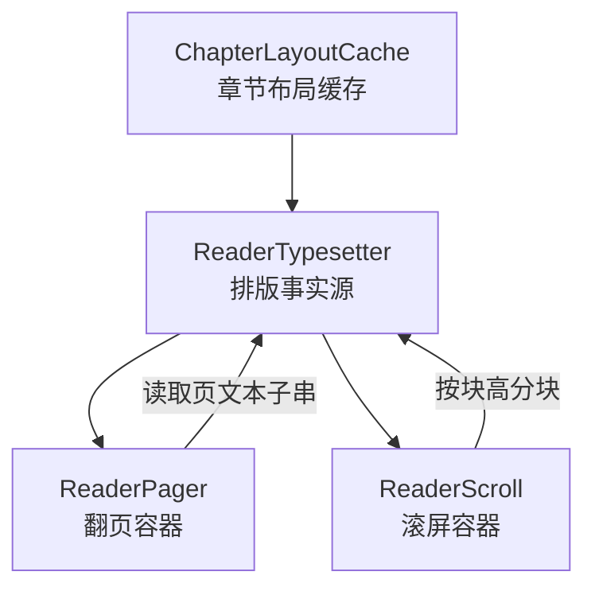
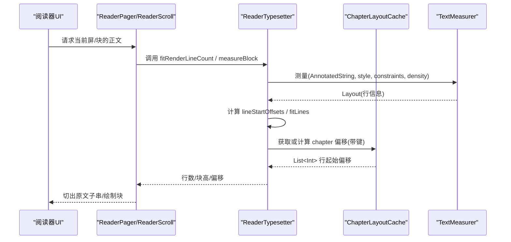
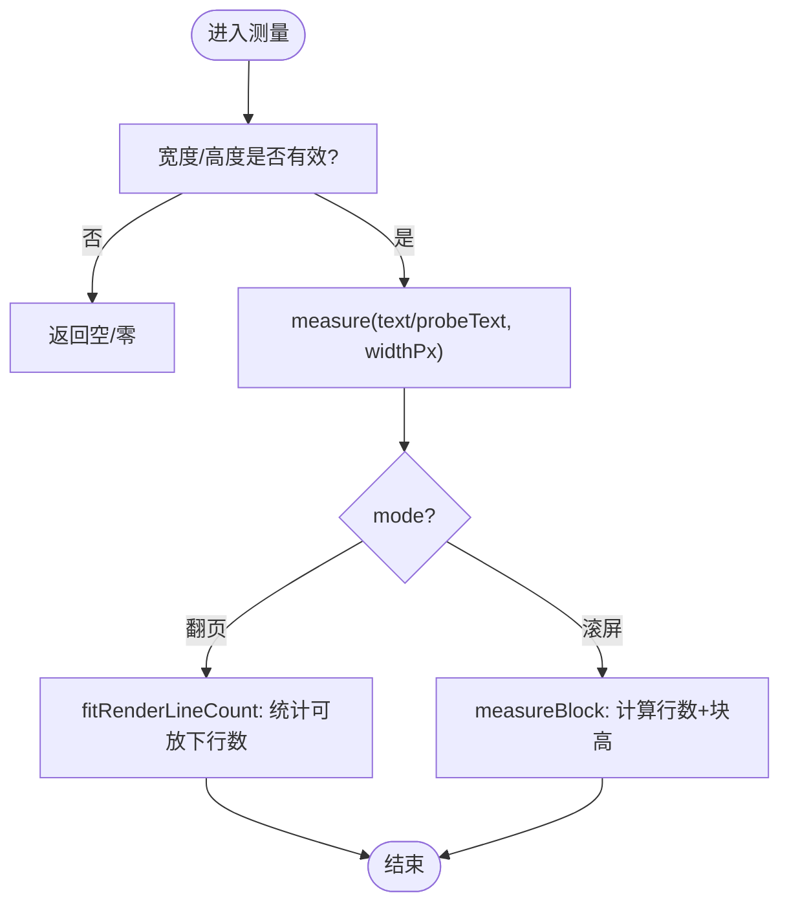
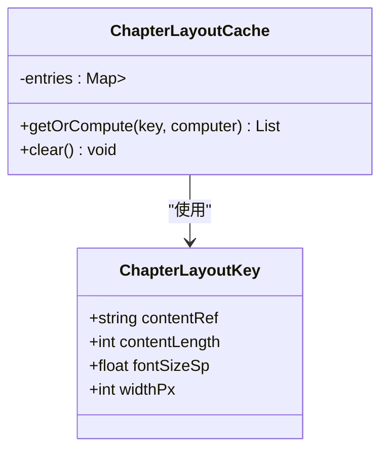
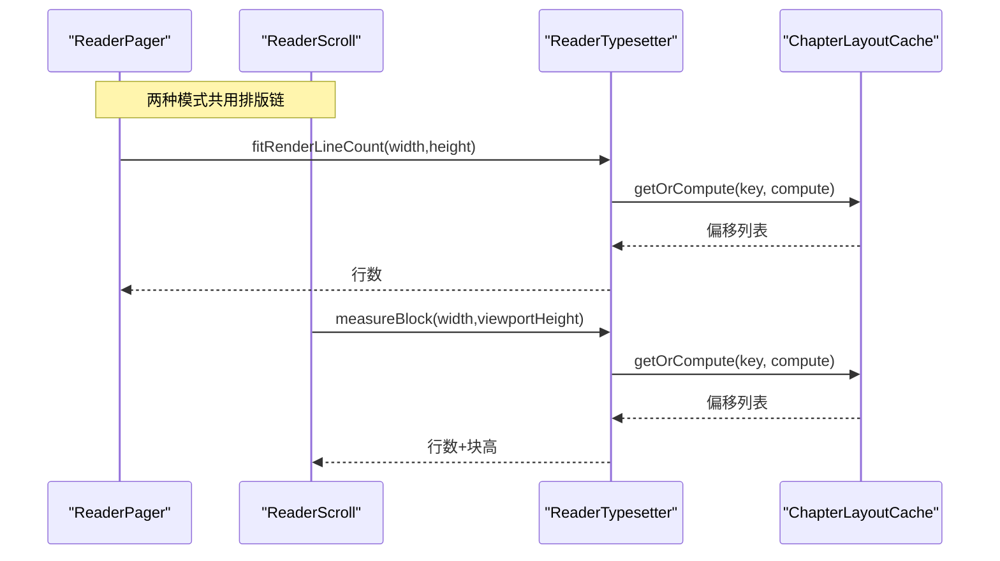
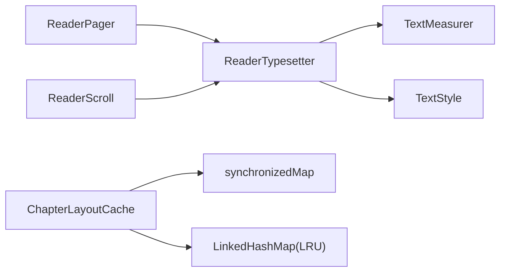

# 排版引擎与布局缓存

<cite>
**本文引用的文件**
- [ReaderTypesetter.kt](file://module_book/src/main/java/com/ebook/book/reader/ReaderTypesetter.kt)
- [ChapterLayoutCache.kt](file://module_book/src/main/java/com/ebook/book/reader/ChapterLayoutCache.kt)
- [ChapterLayoutCacheTest.kt](file://module_book/src/test/java/com/ebook/book/reader/ChapterLayoutCacheTest.kt)
- [ReaderBlockMetricsTest.kt](file://module_book/src/test/java/com/ebook/book/reader/ReaderBlockMetricsTest.kt)
- [ReaderPager.kt](file://module_book/src/main/java/com/ebook/book/reader/ReaderPager.kt)
- [ReaderScroll.kt](file://module_book/src/main/java/com/ebook/book/reader/ReaderScroll.kt)
- [2026-09-13-reader-scroll-mode-design.md](file://docs/superpowers/specs/2026-09-13-reader-scroll-mode-design.md)
</cite>

## 目录
1. [简介](#简介)
2. [项目结构](#项目结构)
3. [核心组件](#核心组件)
4. [架构总览](#架构总览)
5. [详细组件分析](#详细组件分析)
6. [依赖关系分析](#依赖关系分析)
7. [性能考量](#性能考量)
8. [故障排查指南](#故障排查指南)
9. [结论](#结论)
10. [附录](#附录)

## 简介
本文件聚焦阅读器的排版引擎与章节布局缓存：以 ReaderTypesetter 作为分页样式的事实源，统一管理字号、行高、对齐；以 TextMeasurer 为测量器，通过 Compose 的断行结果计算每行的起始偏移（lineStartOffsets）；区分 fitRenderLineCount（翻页模式，获取行数）与 measureBlock（滚屏模式，获取精确块高）两种测量方式；并详解 ChapterLayoutCache 的缓存策略（ChapterLayoutKey 构成、为何使用内容长度而非全量哈希、LRU 容量管理）、并发安全（synchronizedMap + getOrCompute 的锁保护），以及超长章节的性能优化思路。

## 项目结构
与排版和布局缓存直接相关的代码集中在 module_book 的 reader 包中：
- 排版引擎：ReaderTypesetter.kt
- 布局缓存：ChapterLayoutCache.kt
- 翻页容器与状态机：ReaderPager.kt
- 滚屏容器与控制器：ReaderScroll.kt
- 设计规格参考：2026-09-13-reader-scroll-mode-design.md
- 相关单测：ChapterLayoutCacheTest.kt、ReaderBlockMetricsTest.kt

图示来源
- [ReaderTypesetter.kt:18-175](file://module_book/src/main/java/com/ebook/book/reader/ReaderTypesetter.kt#L18-L175)
- [ChapterLayoutCache.kt:1-61](file://module_book/src/main/java/com/ebook/book/reader/ChapterLayoutCache.kt#L1-L61)
- [ReaderPager.kt:61-100](file://module_book/src/main/java/com/ebook/book/reader/ReaderPager.kt#L61-L100)
- [ReaderScroll.kt:53-70](file://module_book/src/main/java/com/ebook/book/reader/ReaderScroll.kt#L53-L70)

章节来源
- [ReaderTypesetter.kt:18-175](file://module_book/src/main/java/com/ebook/book/reader/ReaderTypesetter.kt#L18-L175)
- [ChapterLayoutCache.kt:1-61](file://module_book/src/main/java/com/ebook/book/reader/ChapterLayoutCache.kt#L1-L61)
- [ReaderPager.kt:61-100](file://module_book/src/main/java/com/ebook/book/reader/ReaderPager.kt#L61-L100)
- [ReaderScroll.kt:53-70](file://module_book/src/main/java/com/ebook/book/reader/ReaderScroll.kt#L53-L70)

## 核心组件
- ReaderTypesetter：分页样式与测量的单一事实源。封装 TextStyle（字号、行高、对齐）、TextMeasurer、Density，提供 lineStartOffsets、fitRenderLineCount、measureBlock 等方法。
- ChapterLayoutCache：章节“整章排版偏移”的内存缓存，键由 contentRef、contentLength、fontSizeSp、widthPx 组成，采用 LRU 淘汰，并发安全。
- ReaderPager / ReaderScroll：分别承载翻页与滚屏两种阅读模式，统一依赖排版结果进行切页/分块。

章节来源
- [ReaderTypesetter.kt:18-175](file://module_book/src/main/java/com/ebook/book/reader/ReaderTypesetter.kt#L18-L175)
- [ChapterLayoutCache.kt:1-61](file://module_book/src/main/java/com/ebook/book/reader/ChapterLayoutCache.kt#L1-L61)
- [ReaderPager.kt:61-100](file://module_book/src/main/java/com/ebook/book/reader/ReaderPager.kt#L61-L100)
- [ReaderScroll.kt:53-70](file://module_book/src/main/java/com/ebook/book/reader/ReaderScroll.kt#L53-L70)

## 架构总览
排版与渲染必须同源：分页切行与页面实际渲染都基于同一份 TextStyle 与 TextMeasurer，避免“分行行数 ≠ 渲染行数”导致的页面错行或内容丢失。

图示来源
- [ReaderTypesetter.kt:53-92](file://module_book/src/main/java/com/ebook/book/reader/ReaderTypesetter.kt#L53-L92)
- [ChapterLayoutCache.kt:38-53](file://module_book/src/main/java/com/ebook/book/reader/ChapterLayoutCache.kt#L38-L53)
- [ReaderPager.kt:61-100](file://module_book/src/main/java/com/ebook/book/reader/ReaderPager.kt#L61-L100)
- [ReaderScroll.kt:53-70](file://module_book/src/main/java/com/ebook/book/reader/ReaderScroll.kt#L53-L70)

## 详细组件分析

### ReaderTypesetter：分页样式与测量
- 样式统一管理：通过 readerBodyTextStyle 固定 fontSize、lineHeight、textAlign、lineHeightStyle，确保渲染与测量一致。
- 测量机制：
  - lineStartOffsets：对整章文本用 TextMeasurer 测量，返回每行的起始偏移列表。仅返回偏移不拼接子串，以避免 Compose 断行吞掉换行符导致段落错位。
  - fitRenderLineCount：用于翻页模式，回答“视口高度能放下多少行”。
  - measureBlock：用于滚屏模式，返回“能放下的行数及这几行的实测总高”，块高取最后一行的底部位置（向上取整），保证块间无缝拼接。
- 探针文本：使用固定数量的同字高行组成的 probeText，配合 fitLines 得到稳定一致的度量。

图示来源
- [ReaderTypesetter.kt:53-92](file://module_book/src/main/java/com/ebook/book/reader/ReaderTypesetter.kt#L53-L92)
- [ReaderTypesetter.kt:167-175](file://module_book/src/main/java/com/ebook/book/reader/ReaderTypesetter.kt#L167-L175)

章节来源
- [ReaderTypesetter.kt:18-175](file://module_book/src/main/java/com/ebook/book/reader/ReaderTypesetter.kt#L18-L175)
- [ReaderBlockMetricsTest.kt:1-37](file://module_book/src/test/java/com/ebook/book/reader/ReaderBlockMetricsTest.kt#L1-L37)

### 两种测量方式的差异
- fitRenderLineCount（翻页模式）：只关心“一屏能容纳几行”，用于将章节文本按行数切成多页。
- measureBlock（滚屏模式）：不仅关心“能放下几行”，还返回这几行的“实测总高”，用于纵向连续滚动时，确保块与块之间精确拼接，不出现重叠或间隙。

章节来源
- [ReaderTypesetter.kt:59-85](file://module_book/src/main/java/com/ebook/book/reader/ReaderTypesetter.kt#L59-L85)
- [ReaderScroll.kt:53-70](file://module_book/src/main/java/com/ebook/book/reader/ReaderScroll.kt#L53-L70)

### ChapterLayoutCache：缓存策略与并发安全
- 键设计 ChapterLayoutKey：
  - contentRef：章节定位符（本地路径或网络URL）。
  - contentLength：正文长度，用作“重解析后失效”的轻量指纹（避免 O(N) 全量哈希）。
  - fontSizeSp：字号，改变字号需重新排版。
  - widthPx：正文区宽度，改变宽度需重新排版。
- 为什么用长度而非全量哈希：每次翻页都会构造键，若用全量哈希会抵消缓存收益；长度不等必重排，等长异文概率极低且影响范围有限。
- LRU 容量管理：内部 LinkedHashMap 配置 true=accessOrder，并在 removeEldestEntry 中实现 LRU 淘汰；默认容量约覆盖“当前章±两章”的两屏余量。
- 并发安全：getOrCompute 在 synchronized(entries) 内执行 check-then-act，避免并发预加载同时 miss 重复计算；底层使用 Collections.synchronizedMap 包装，所有访问经同步 map 的锁保护。

图示来源
- [ChapterLayoutCache.kt:5-23](file://module_book/src/main/java/com/ebook/book/reader/ChapterLayoutCache.kt#L5-L23)
- [ChapterLayoutCache.kt:38-53](file://module_book/src/main/java/com/ebook/book/reader/ChapterLayoutCache.kt#L38-L53)

章节来源
- [ChapterLayoutCache.kt:1-61](file://module_book/src/main/java/com/ebook/book/reader/ChapterLayoutCache.kt#L1-L61)
- [ChapterLayoutCacheTest.kt:1-60](file://module_book/src/test/java/com/ebook/book/reader/ChapterLayoutCacheTest.kt#L1-L60)

### 与翻页/滚屏容器的协作
- 翻页模式（ReaderPager）：通过 ReaderTypesetter 获取每页所需的行数与原文子串边界，三页窗口状态机负责前后页加载与滑动动画。
- 滚屏模式（ReaderScroll）：通过 ReaderTypesetter.measureBlock 获得“行数+块高”，LazyColumn 按块高精确拼接项，跨章连续滚动，章界仅保留标题项。

图示来源
- [ReaderPager.kt:61-100](file://module_book/src/main/java/com/ebook/book/reader/ReaderPager.kt#L61-L100)
- [ReaderScroll.kt:53-70](file://module_book/src/main/java/com/ebook/book/reader/ReaderScroll.kt#L53-L70)
- [ReaderTypesetter.kt:53-92](file://module_book/src/main/java/com/ebook/book/reader/ReaderTypesetter.kt#L53-L92)
- [ChapterLayoutCache.kt:38-53](file://module_book/src/main/java/com/ebook/book/reader/ChapterLayoutCache.kt#L38-L53)

## 依赖关系分析
- ReaderTypesetter 依赖 Compose 的 TextMeasurer/Density/TextStyle，提供测量能力。
- ChapterLayoutCache 依赖 Java Collections 的同步映射与 LinkedHashMap 的 LRU 行为。
- ReaderPager/ReaderScroll 依赖 ReaderTypesetter 提供的测量结果，进行分页/分块。
- 测试文件验证关键行为：fitLines 的块高计算、缓存的失效与容量管理。

图示来源
- [ReaderTypesetter.kt:87-92](file://module_book/src/main/java/com/ebook/book/reader/ReaderTypesetter.kt#L87-L92)
- [ChapterLayoutCache.kt:38-45](file://module_book/src/main/java/com/ebook/book/reader/ChapterLayoutCache.kt#L38-L45)
- [ReaderPager.kt:61-100](file://module_book/src/main/java/com/ebook/book/reader/ReaderPager.kt#L61-L100)
- [ReaderScroll.kt:53-70](file://module_book/src/main/java/com/ebook/book/reader/ReaderScroll.kt#L53-L70)

章节来源
- [ReaderTypesetter.kt:87-92](file://module_book/src/main/java/com/ebook/book/reader/ReaderTypesetter.kt#L87-L92)
- [ChapterLayoutCache.kt:38-45](file://module_book/src/main/java/com/ebook/book/reader/ChapterLayoutCache.kt#L38-L45)
- [ReaderPager.kt:61-100](file://module_book/src/main/java/com/ebook/book/reader/ReaderPager.kt#L61-L100)
- [ReaderScroll.kt:53-70](file://module_book/src/main/java/com/ebook/book/reader/ReaderScroll.kt#L53-L70)

## 性能考量
- 整章测量复杂度：lineStartOffsets 为 O(章长)，且每页调用一次，同章 N 页即 N 次整章重排。ChapterLayoutCache 显著降低重复计算，使同章翻页只重排一次。
- 块高计算：measureBlock 使用探针文本与 fitLines，避免心算行高带来的累积误差，保证滚屏模式块间无缝拼接。
- 缓存容量：默认容量约覆盖“当前章±两章”，兼顾热章命中率与内存占用。
- 并发安全：getOrCompute 在同步块内完成 check-then-act，避免并发预加载重复计算。
- 超长章节优化建议：
  - 在调用侧按（章节，字号）粒度缓存 lineStartOffsets，减少频繁整章重排。
  - 合理调整 ChapterLayoutCache 容量，结合用户阅读习惯预热相邻章节。
  - 对极长章节可考虑分段测量与按需回填，但需谨慎保持行偏移一致性。

[本节为通用指导，无需具体文件引用]

## 故障排查指南
- 现象：翻页与滚屏出现“被裁掉的一行”或“上下页接不上”。
  - 检查是否使用了统一的 readerBodyTextStyle，确保测量与渲染口径一致。
  - 确认 lineStartOffsets 仅返回偏移而不拼接子串，避免换行符丢失导致段落合并。
- 现象：强刷后页数不变但内容错位。
  - 检查 ChapterLayoutKey 的 contentLength 是否正确更新，确保重解析后触发重排。
- 现象：缓存未生效或重复计算。
  - 确认 getOrCompute 在同步块内执行，避免并发下重复计算。
  - 核对 key 的四个字段是否与预期一致（contentRef、contentLength、fontSizeSp、widthPx）。
- 现象：滚屏块间出现重叠或间隙。
  - 检查 measureBlock 返回的块高是否为最后一行的实测底部（向上取整），避免心算行高。

章节来源
- [ReaderTypesetter.kt:18-92](file://module_book/src/main/java/com/ebook/book/reader/ReaderTypesetter.kt#L18-L92)
- [ChapterLayoutCache.kt:5-23](file://module_book/src/main/java/com/ebook/book/reader/ChapterLayoutCache.kt#L5-L23)
- [ChapterLayoutCache.kt:38-53](file://module_book/src/main/java/com/ebook/book/reader/ChapterLayoutCache.kt#L38-L53)
- [ReaderBlockMetricsTest.kt:1-37](file://module_book/src/test/java/com/ebook/book/reader/ReaderBlockMetricsTest.kt#L1-L37)

## 结论
ReaderTypesetter 作为排版样式与测量的唯一事实源，保证了分页与渲染的一致性；ChapterLayoutCache 通过合理的键设计与 LRU 容量管理，在保证线程安全的前提下显著降低重复排版开销。fitRenderLineCount 与 measureBlock 分别服务于翻页与滚屏两种模式，前者关注行数，后者关注行数与精确块高。通过上述机制，系统能够在不同屏幕尺寸与字体设置下稳定工作，并为超长章节提供了可扩展的性能优化空间。

[本节为总结性内容，无需具体文件引用]

## 附录

### 如何扩展新的排版样式
- 在 readerBodyTextStyle 中新增样式字段（如字体、字重、对齐方式），确保测量与渲染使用同一份 TextStyle。
- 若引入新样式维度，需在 ChapterLayoutKey 中增加相应字段以触发失效重排。
- 验证线：通过单元测试覆盖新样式下的 fitRenderLineCount 与 measureBlock 行为。

章节来源
- [ReaderTypesetter.kt:126-146](file://module_book/src/main/java/com/ebook/book/reader/ReaderTypesetter.kt#L126-L146)
- [ChapterLayoutCache.kt:5-23](file://module_book/src/main/java/com/ebook/book/reader/ChapterLayoutCache.kt#L5-L23)

### 自定义缓存失效策略
- 修改 ChapterLayoutKey 的构成要素，例如加入 contentHash 以替代 contentLength，提高失效精度（代价是计算开销上升）。
- 调整 ChapterLayoutCache 的 DEFAULT_CAPACITY，以适应不同的阅读场景（如更长的连续阅读偏好）。
- 如需按书剔除缓存，可在上层提供 clearForBook(contentRefPrefix) 方法，但需谨慎避免误删。

章节来源
- [ChapterLayoutCache.kt:5-23](file://module_book/src/main/java/com/ebook/book/reader/ChapterLayoutCache.kt#L5-L23)
- [ChapterLayoutCache.kt:38-61](file://module_book/src/main/java/com/ebook/book/reader/ChapterLayoutCache.kt#L38-L61)

### 处理超长章节的性能优化
- 在调用侧缓存 lineStartOffsets，按（章节，字号）粒度缓存，避免每页整章重排。
- 使用 ChapterLayoutCache 减少同章翻页的重排次数。
- 对极长章节可考虑分页测量（按区块测量）与增量更新，但需保证行偏移一致性。
- 监控缓存命中率与内存占用，动态调整容量阈值。

章节来源
- [ReaderTypesetter.kt:35-57](file://module_book/src/main/java/com/ebook/book/reader/ReaderTypesetter.kt#L35-L57)
- [ChapterLayoutCache.kt:25-37](file://module_book/src/main/java/com/ebook/book/reader/ChapterLayoutCache.kt#L25-L37)