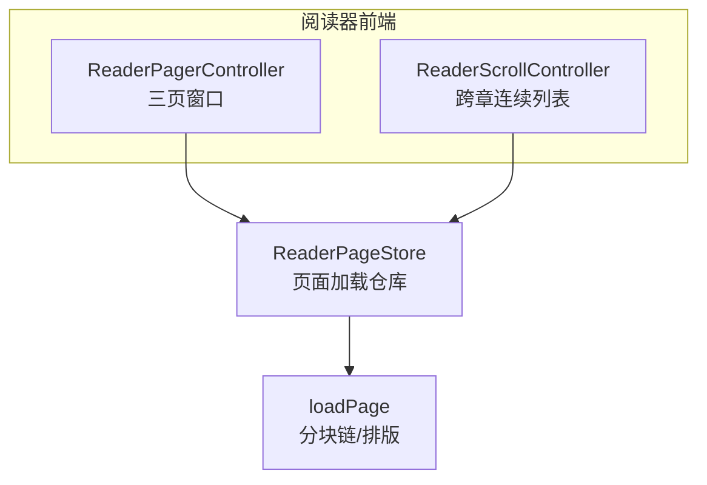
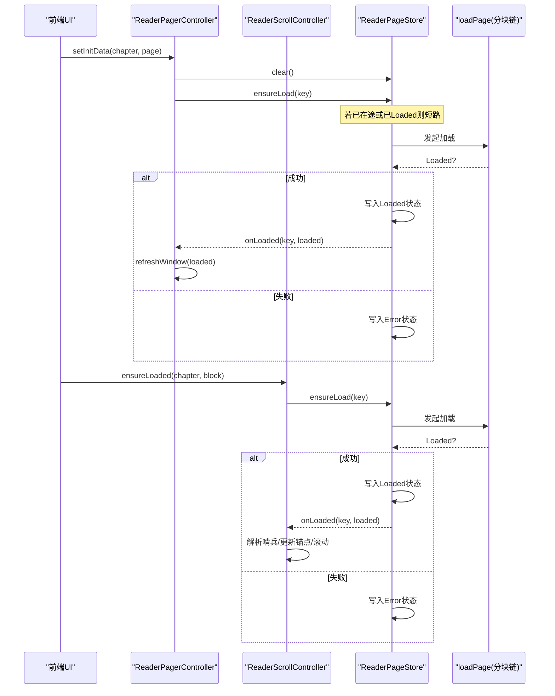
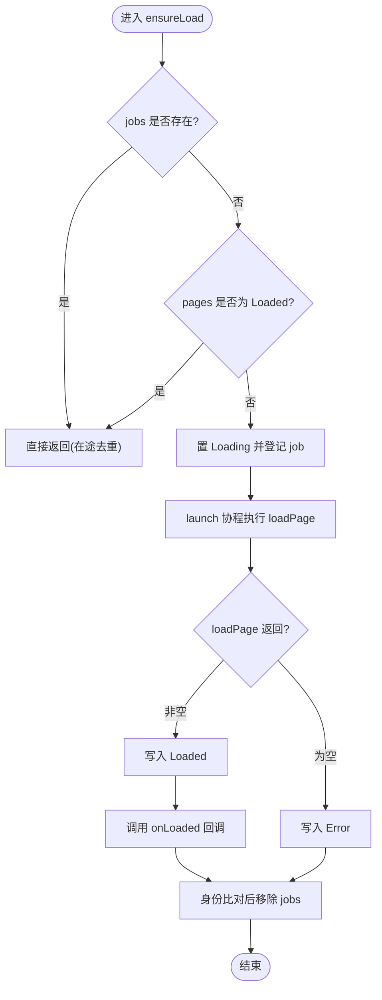
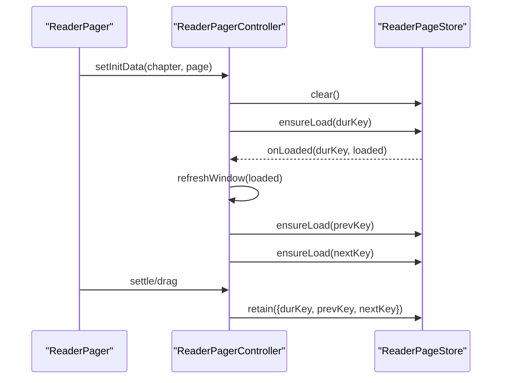
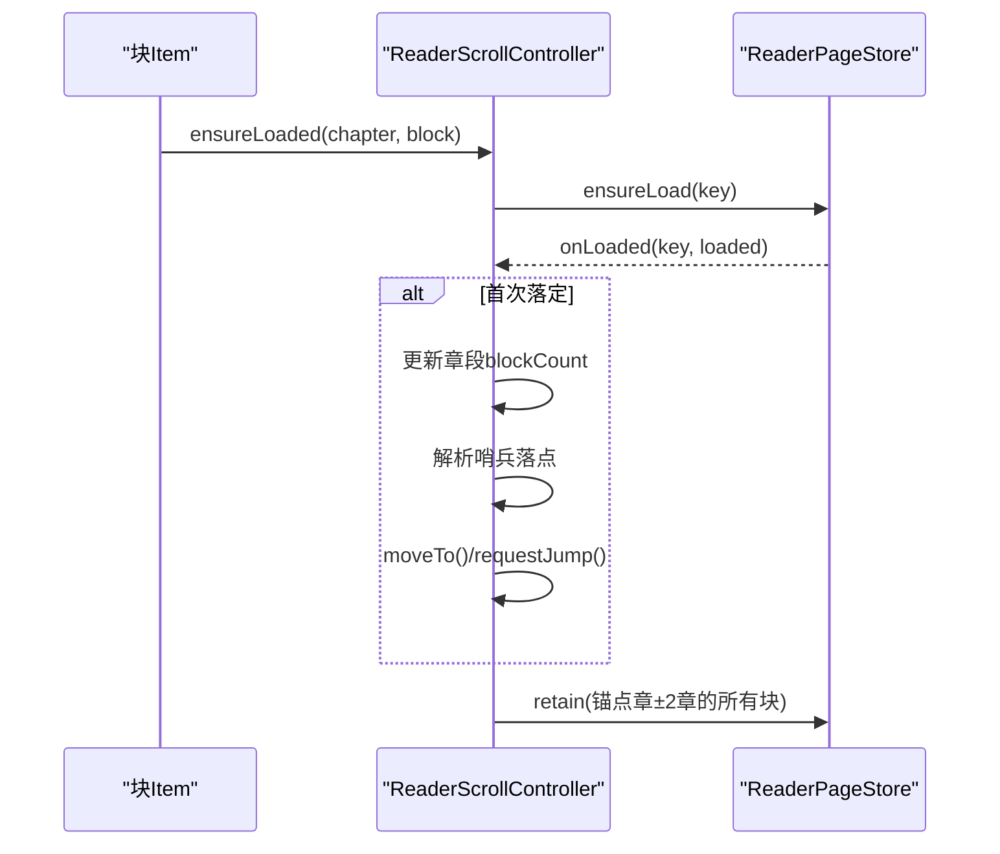
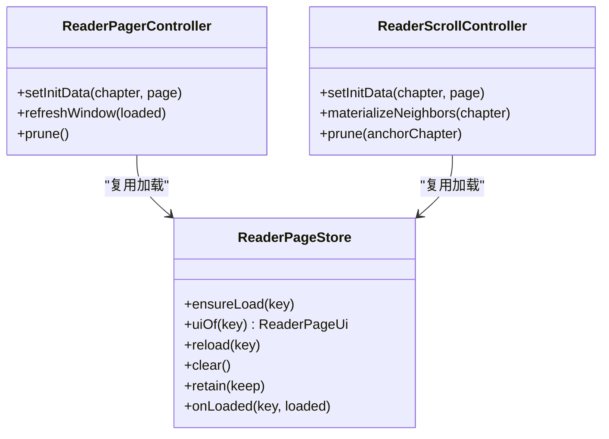

# ReaderPageStore（页面加载仓库）

<cite>
**本文引用的文件**
- [ReaderPageStore.kt](file://module_book/src/main/java/com/ebook/book/reader/ReaderPageStore.kt)
- [ReaderPager.kt](file://module_book/src/main/java/com/ebook/book/reader/ReaderPager.kt)
- [ReaderScrollController.kt](file://module_book/src/main/java/com/ebook/book/reader/ReaderScrollController.kt)
- [ReaderPageStoreTest.kt](file://module_book/src/test/java/com/ebook/book/reader/ReaderPageStoreTest.kt)
- [2026-09-13-reader-scroll-mode-design.md](file://docs/superpowers/specs/2026-09-13-reader-scroll-mode-design.md)
- [0037-reader-turn-mode.md](file://docs/adr/0037-reader-turn-mode.md)
</cite>

## 目录
1. [简介](#简介)
2. [项目结构](#项目结构)
3. [核心组件](#核心组件)
4. [架构总览](#架构总览)
5. [详细组件分析](#详细组件分析)
6. [依赖关系分析](#依赖关系分析)
7. [性能考量](#性能考量)
8. [故障排查指南](#故障排查指南)
9. [结论](#结论)
10. [附录](#附录)

## 简介
ReaderPageStore 是阅读器的“页面加载仓库”，负责将“翻页模式”和“滚屏模式”共同复用的页面加载抽象收敛到一处：提供统一的键值映射、在途任务去重、三态渲染状态以及资源裁剪策略。它屏蔽了两种前端几何差异，让调用方只关心“某页的渲染状态是什么”以及“如何请求下一页/下一块”。

- 统一抽象：以 ReaderPageKey（章索引 + 页/块号）为键，维护 ReaderPageUi（Loading / Error / Loaded）三态。
- 异步加载：通过 loadPage 协程函数完成实际加载；ensureLoad 实现去重与状态推进；onLoaded 回调用于前端窗口/锚点重算。
- 资源回收：retain 按两端不同的几何半径裁剪保留集；clear 跳转时取消全部在途并清空状态；reload 失败重试。
- 并发安全：基于 Job 登记与身份比对，避免中途取消/替换导致的孤儿任务覆盖；结合 isActive 双重保护。

**章节来源**
- [ReaderPageStore.kt:9-98](file://module_book/src/main/java/com/ebook/book/reader/ReaderPageStore.kt#L9-L98)

## 项目结构
ReaderPageStore 位于 module_book 的 reader 包中，被两个前端控制器复用：
- 翻页模式：ReaderPagerController（三页窗口 + 横向拖拽）
- 滚屏模式：ReaderScrollController（跨章连续列表）

**图示来源**
- [ReaderPager.kt:110-175](file://module_book/src/main/java/com/ebook/book/reader/ReaderPager.kt#L110-L175)
- [ReaderScrollController.kt:89-147](file://module_book/src/main/java/com/ebook/book/reader/ReaderScrollController.kt#L89-L147)
- [ReaderPageStore.kt:29-98](file://module_book/src/main/java/com/ebook/book/reader/ReaderPageStore.kt#L29-L98)

**章节来源**
- [ReaderPager.kt:68-175](file://module_book/src/main/java/com/ebook/book/reader/ReaderPager.kt#L68-L175)
- [ReaderScrollController.kt:89-147](file://module_book/src/main/java/com/ebook/book/reader/ReaderScrollController.kt#L89-L147)
- [ReaderPageStore.kt:29-98](file://module_book/src/main/java/com/ebook/book/reader/ReaderPageStore.kt#L29-L98)

## 核心组件
- ReaderPageKey：页面标识，包含 chapterIndex 与 pageIndex（滚屏模式下即为 blockIndex）。
- ReaderPageUi：三态接口 Loading/Error/Loaded，Loaded 携带章节标题、页码、总页数与正文子串。
- ReaderPageStore：加载仓库，维护 pages 与 jobs 两表，提供 ensureLoad/uiOf/reload/clear/retain/onLoaded。

关键职责边界
- 仓库不持有几何信息，仅回答“这一屏的内容是什么状态”。
- 前端各自负责几何与可视范围计算，并在合适时机调用 retain 裁剪。
- 加载逻辑由外部传入的 loadPage 协程实现，支持任意数据源与缓存策略。

**章节来源**
- [ReaderPager.kt:68-87](file://module_book/src/main/java/com/ebook/book/reader/ReaderPager.kt#L68-L87)
- [ReaderPageStore.kt:29-98](file://module_book/src/main/java/com/ebook/book/reader/ReaderPageStore.kt#L29-L98)

## 架构总览
ReaderPageStore 作为中间层，解耦前端几何与后端加载：
- 翻页模式通过 ReaderPagerController 管理三页窗口，调用 store.ensureLoad 触发加载，并在 onLoaded 中根据 key == durKey 进行窗口刷新。
- 滚屏模式通过 ReaderScrollController 管理跨章连续列表，在 onLoaded 中解析哨兵落点并更新锚点与滚动位置。
- 两者共用同一份 loadPage 分块链与 ChapterLayoutCache，确保分页与渲染同源。

**图示来源**
- [ReaderPager.kt:149-192](file://module_book/src/main/java/com/ebook/book/reader/ReaderPager.kt#L149-L192)
- [ReaderScrollController.kt:125-147](file://module_book/src/main/java/com/ebook/book/reader/ReaderScrollController.kt#L125-L147)
- [ReaderPageStore.kt:47-71](file://module_book/src/main/java/com/ebook/book/reader/ReaderPageStore.kt#L47-L71)

## 详细组件分析

### ReaderPageStore：异步加载与去重
- ensureLoad(key)
  - 在途去重：jobs 中存在则直接返回。
  - 已加载短路：pages[key] 为 Loaded 则不再重抓，避免快速回翻闪转圈。
  - 状态推进：先置 Loading，启动协程执行 loadPage；完成后根据结果写 Loaded 或 Error。
  - 身份保护：仅在当前协程仍活跃且仍是该 key 的登记任务时才注销 jobs，防止后继任务被误删成孤儿。
  - 回调通知：成功时调用 onLoaded(key, loaded)，由前端判断是否与自己相关并重算几何。
- uiOf(key)
  - 查询渲染状态；未登记则兜底返回 Loading。
- reload(key)
  - 取消旧任务并重新 ensureLoad；错误态可被再次尝试。
- clear()
  - 跳转/换装点：取消所有在途任务并清空 pages/jobs，确保 Loaded 短路失效。
- retain(keep)
  - 清理保留集之外的页面状态与在途任务，防止内存累积。
  - 翻页模式：保留三页窗口的三个键。
  - 滚屏模式：保留锚点章 ±2 章的全部块，避免同章内回滚丢块导致重复加载。

**图示来源**
- [ReaderPageStore.kt:47-71](file://module_book/src/main/java/com/ebook/book/reader/ReaderPageStore.kt#L47-L71)

**章节来源**
- [ReaderPageStore.kt:47-98](file://module_book/src/main/java/com/ebook/book/reader/ReaderPageStore.kt#L47-L98)

### 翻页模式集成：ReaderPagerController
- 使用 ReaderPageStore 统一管理三页窗口的前/中/后页加载与状态。
- onLoaded 回调中检查 key 是否等于当前 durKey，若是则调用 refreshWindow 重算前后页窗口。
- commitNext/commitPrev 在目标页尚未 Loaded 时采取“来路页留作相邻方向、去向收敛为 null”的收敛规则，避免自指与死锁。
- prune 将仓库裁至三页窗口键集合，保证翻页过程中不会跨章无限累积。

**图示来源**
- [ReaderPager.kt:149-192](file://module_book/src/main/java/com/ebook/book/reader/ReaderPager.kt#L149-L192)
- [ReaderPager.kt:281-323](file://module_book/src/main/java/com/ebook/book/reader/ReaderPager.kt#L281-L323)

**章节来源**
- [ReaderPager.kt:110-323](file://module_book/src/main/java/com/ebook/book/reader/ReaderPager.kt#L110-L323)

### 滚屏模式集成：ReaderScrollController
- 列表按“章段”（标题项 + 块项）惰性物化，进入某章即物化相邻两章，使章界处无感切换。
- onLoaded 中首次落定时更新章段的 blockCount，并解析哨兵落点（BEGIN/END）为具体块号，移动锚点并请求 Jump。
- ensureLoaded 由块 item 自行调用，兜底预取不足的情况；重复调用会被 ensureLoad 短路或去重。
- prune 按“章距”裁剪保留集：仅保留锚点章 ±2 章的所有块，避免同章内回滚丢块导致的重复加载与闪烁。

**图示来源**
- [ReaderScrollController.kt:125-147](file://module_book/src/main/java/com/ebook/book/reader/ReaderScrollController.kt#L125-L147)
- [ReaderScrollController.kt:324-369](file://module_book/src/main/java/com/ebook/book/reader/ReaderScrollController.kt#L324-L369)

**章节来源**
- [ReaderScrollController.kt:89-397](file://module_book/src/main/java/com/ebook/book/reader/ReaderScrollController.kt#L89-L397)

### 三态渲染状态与 UI 契约
- Loading：显示加载中骨架与提示，占位高度恒定，避免布局抖动。
- Error：显示错误图标与重试按钮，重试走 store.reload(key)。
- Loaded：正文文本来自分块链切出的连续子串，页码行固定高度，保证三态下正文区高度一致。

注意：Loading/Error 态的占位高度必须与 Loaded 态一致，否则会导致“切几行”与“画几行”不一致，造成溢出或被裁剪的问题。

**章节来源**
- [ReaderPager.kt:505-654](file://module_book/src/main/java/com/ebook/book/reader/ReaderPager.kt#L505-L654)

### 扩展与并发处理示例指引
以下说明以“路径引用”形式给出，避免直接粘贴代码：
- 扩展新的加载策略
  - 在应用层实现新的 loadPage 协程函数，封装网络/本地/缓存读取逻辑，并返回 ReaderPageUi.Loaded 或 null（失败）。
  - 将该函数注入 ReaderPageStore 构造参数，即可被翻页与滚屏共用。
  - 参考路径：[ReaderPageStore.kt:29-32](file://module_book/src/main/java/com/ebook/book/reader/ReaderPageStore.kt#L29-L32)
- 处理并发请求冲突
  - ensureLoad 的 jobs 登记与身份比对可避免重复请求与覆盖；必要时在 loadPage 内部加幂等键（如 URL+页码），防止极端竞态。
  - 参考路径：[ReaderPageStore.kt:56-66](file://module_book/src/main/java/com/ebook/book/reader/ReaderPageStore.kt#L56-L66)
- 自定义缓存策略
  - 在 loadPage 内部接入 ChapterLayoutCache 或其他缓存层；命中时直接返回 Loaded，未命中再发起网络/IO。
  - 参考路径：[ReaderPager.kt:26-35](file://module_book/src/main/java/com/ebook/book/reader/ReaderPager.kt#L26-L35)

**章节来源**
- [ReaderPageStore.kt:29-66](file://module_book/src/main/java/com/ebook/book/reader/ReaderPageStore.kt#L29-L66)
- [ReaderPager.kt:26-35](file://module_book/src/main/java/com/ebook/book/reader/ReaderPager.kt#L26-L35)

### 与 Coroutines 的集成要点
- 作用域管理：store 持有外部传入的 CoroutineScope，所有加载任务在该作用域内执行，便于统一生命周期控制。
- 任务取消传播：clear 会取消所有 jobs；retain 也会取消不在保留集中的在途任务，避免无用负载。
- 异常处理：loadPage 抛出异常或返回 null 时统一转为 Error 态；上层可根据业务需要捕获并上报。
- 回调线程：onLoaded 在协程上下文中执行，通常应切换到主线程进行 UI 操作（由调用方保证）。

**章节来源**
- [ReaderPageStore.kt:4-8](file://module_book/src/main/java/com/ebook/book/reader/ReaderPageStore.kt#L4-L8)
- [ReaderPageStore.kt:73-84](file://module_book/src/main/java/com/ebook/book/reader/ReaderPageStore.kt#L73-L84)

## 依赖关系分析
- ReaderPageStore 依赖：
  - CoroutineScope：承载任务生命周期。
  - loadPage：加载抽象，交由上层实现，屏蔽数据源差异。
- 被 ReaderPagerController 与 ReaderScrollController 复用，分别负责不同几何下的保留集与窗口/锚点重算。

**图示来源**
- [ReaderPageStore.kt:29-98](file://module_book/src/main/java/com/ebook/book/reader/ReaderPageStore.kt#L29-L98)
- [ReaderPager.kt:110-192](file://module_book/src/main/java/com/ebook/book/reader/ReaderPager.kt#L110-L192)
- [ReaderScrollController.kt:89-147](file://module_book/src/main/java/com/ebook/book/reader/ReaderScrollController.kt#L89-L147)

**章节来源**
- [ReaderPageStore.kt:29-98](file://module_book/src/main/java/com/ebook/book/reader/ReaderPageStore.kt#L29-L98)
- [ReaderPager.kt:110-192](file://module_book/src/main/java/com/ebook/book/reader/ReaderPager.kt#L110-L192)
- [ReaderScrollController.kt:89-147](file://module_book/src/main/java/com/ebook/book/reader/ReaderScrollController.kt#L89-L147)

## 性能考量
- 去重与短路：ensureLoad 对在途与已 Loaded 的状态短路，避免重复 IO/网络与整章重排。
- 保留集裁剪：
  - 翻页模式：仅保留三页窗口键，避免跨章累积。
  - 滚屏模式：按“章距”裁剪，避免同章内回滚丢块导致的重复加载与闪烁。
- 预取优化：滚屏模式会在锚点附近预取若干块，提升滚动平滑度。
- 测量一致性：块高取自排版实测，避免心算带来的像素误差累积。

[本节为通用指导，无需具体文件分析]

## 故障排查指南
常见问题与定位建议：
- 页面一直 Loading
  - 检查 ensureLoad 是否被正确调用；确认 jobs 是否登记；查看 loadPage 是否卡住或返回 null。
  - 参考路径：[ReaderPageStore.kt:47-71](file://module_book/src/main/java/com/ebook/book/reader/ReaderPageStore.kt#L47-L71)
- 快速回翻出现转圈闪烁
  - 确认 Loaded 短路生效；若仍闪烁，检查是否有 clear/reload 打断。
  - 参考路径：[ReaderPageStore.kt:49-55](file://module_book/src/main/java/com/ebook/book/reader/ReaderPageStore.kt#L49-L55)
- 跳转后页面状态错乱
  - 确认 setInitData 调用了 clear；检查 onLoaded 回调中的相关性判断（翻页 key==durKey，滚屏章段存在性）。
  - 参考路径：[ReaderPager.kt:163-171](file://module_book/src/main/java/com/ebook/book/reader/ReaderPager.kt#L163-L171)
  - 参考路径：[ReaderScrollController.kt:125-147](file://module_book/src/main/java/com/ebook/book/reader/ReaderScrollController.kt#L125-L147)
- 内存占用过高
  - 检查 retain 是否按几何半径裁剪；翻页应为三页窗口，滚屏应为锚点章 ±2 章。
  - 参考路径：[ReaderPageStore.kt:86-97](file://module_book/src/main/java/com/ebook/book/reader/ReaderPageStore.kt#L86-L97)
  - 参考路径：[ReaderScrollController.kt:350-369](file://module_book/src/main/java/com/ebook/book/reader/ReaderScrollController.kt#L350-L369)

**章节来源**
- [ReaderPageStore.kt:47-97](file://module_book/src/main/java/com/ebook/book/reader/ReaderPageStore.kt#L47-L97)
- [ReaderPager.kt:163-171](file://module_book/src/main/java/com/ebook/book/reader/ReaderPager.kt#L163-L171)
- [ReaderScrollController.kt:125-147](file://module_book/src/main/java/com/ebook/book/reader/ReaderScrollController.kt#L125-L147)
- [ReaderScrollController.kt:350-369](file://module_book/src/main/java/com/ebook/book/reader/ReaderScrollController.kt#L350-L369)

## 结论
ReaderPageStore 以最小耦合实现了翻页与滚屏模式的共享加载能力：通过键级去重、三态状态机、回调机制与资源裁剪策略，既保证了两种模式的体验一致性，又避免了重复实现与维护成本。其设计遵循“分页与渲染同源”的既有契约，并通过 Coroutines 的协程作用域与任务取消机制，提供了健壮的并发处理能力。对于后续扩展，只需实现新的 loadPage 与合适的 retain 策略，即可无缝接入现有体系。

[本节为总结，无需具体文件分析]

## 附录
- 测试用例验证要点（JVM 单测）
  - 在途页不重复发请求
  - 已加载的页不重抓
  - 加载失败置错误态且 reload 会重发
  - retain 清掉保留集之外的页并取消其在途任务
  - clear 之后同一页会重新发请求
  - onLoaded 只在成功时回调一次
  - 参考路径：[ReaderPageStoreTest.kt:20-116](file://module_book/src/test/java/com/ebook/book/reader/ReaderPageStoreTest.kt#L20-L116)

**章节来源**
- [ReaderPageStoreTest.kt:20-116](file://module_book/src/test/java/com/ebook/book/reader/ReaderPageStoreTest.kt#L20-L116)