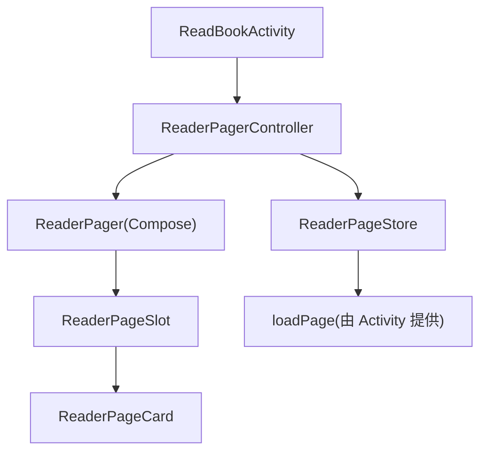
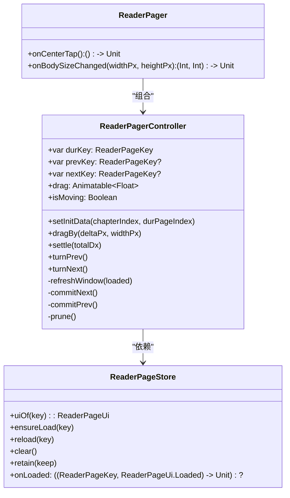

# ReaderPagerController（三页窗口状态机）

<cite>
**本文引用的文件**
- [ReaderPager.kt](file://module_book/src/main/java/com/ebook/book/reader/ReaderPager.kt)
- [ReaderPageStore.kt](file://module_book/src/main/java/com/ebook/book/reader/ReaderPageStore.kt)
- [ReaderPagerControllerTest.kt](file://module_book/src/test/java/com/ebook/book/reader/ReaderPagerControllerTest.kt)
- [2026-09-13-reader-scroll-mode-design.md](file://docs/superpowers/specs/2026-09-13-reader-scroll-mode-design.md)
- [ReadBookActivity.kt](file://module_book/src/main/java/com/ebook/book/ReadBookActivity.kt)
</cite>

## 目录
1. [简介](#简介)
2. [项目结构](#项目结构)
3. [核心组件](#核心组件)
4. [架构总览](#架构总览)
5. [详细组件分析](#详细组件分析)
6. [依赖关系分析](#依赖关系分析)
7. [性能与并发特性](#性能与并发特性)
8. [故障排查指南](#故障排查指南)
9. [结论](#结论)
10. [附录：扩展与实践](#附录扩展与实践)

## 简介
ReaderPagerController 是阅读器的“三页窗口”翻页控制器，封装了当前页、上一页、下一页的标识管理与生命周期，配合 Compose 手势完成拖拽动画、阈值判定与程序化翻页。它与 ReaderPageStore 协作实现加载去重、在途任务取消、完成回调触发窗口重算等关键行为，并通过 prune() 将仓库裁到三页窗口，避免内存泄漏和重复请求。

该控制器严格遵循“窗口三键互不相同、未知方向收敛为 null、来路页保留为相邻方向”的不变量，确保即使目标页仍在加载或失败，用户也能安全回退并重试。

## 项目结构
- 控制器与 UI 容器位于 module_book 的阅读模块 reader 包中：
  - ReaderPager.kt：包含 ReaderPagerController、ReaderPager、ReaderPageSlot、ReaderPageCard 等
  - ReaderPageStore.kt：共享的页面加载仓库，负责去重、重试、清理
  - ReadBookActivity.kt：集成控制器与排版器，提供 loadPage 与进度回调
  - ReaderPagerControllerTest.kt：覆盖三页窗口状态机的关键用例



图示来源
- [ReadBookActivity.kt:86-120](file://module_book/src/main/java/com/ebook/book/ReadBookActivity.kt#L86-L120)
- [ReaderPager.kt:110-151](file://module_book/src/main/java/com/ebook/book/reader/ReaderPager.kt#L110-L151)
- [ReaderPageStore.kt:29-97](file://module_book/src/main/java/com/ebook/book/reader/ReaderPageStore.kt#L29-L97)

章节来源
- [ReaderPager.kt:61-151](file://module_book/src/main/java/com/ebook/book/reader/ReaderPager.kt#L61-L151)
- [ReaderPageStore.kt:9-28](file://module_book/src/main/java/com/ebook/book/reader/ReaderPageStore.kt#L9-L28)
- [ReadBookActivity.kt:86-120](file://module_book/src/main/java/com/ebook/book/ReadBookActivity.kt#L86-L120)

## 核心组件
- ReaderPageKey：页标识（章节索引 + 页码），含哨兵值用于章首/章末请求
- ReaderPageUi：单页渲染状态的密封类型（Loading/Error/Loaded）
- ReaderPagerController：三页窗口状态机与手势/动画编排
- ReaderPageStore：页面加载仓库（去重、重试、保留集裁剪）
- ReaderPager/ReaderPageSlot/ReaderPageCard：Compose 容器与渲染

章节来源
- [ReaderPager.kt:61-151](file://module_book/src/main/java/com/ebook/book/reader/ReaderPager.kt#L61-L151)
- [ReaderPageStore.kt:29-97](file://module_book/src/main/java/com/ebook/book/reader/ReaderPageStore.kt#L29-L97)

## 架构总览
三页窗口模型：
- 当前页（durKey）正常显示；下一页（nextKey）绘制在当前页之下；上一页（prevKey）绘制在当前页之上
- 拖拽位移 drag 为横向 px：负值=向后翻（当前页左移），正值=向前翻（上一页滑入）
- 提交翻页时若目标页非 Loaded，则采用收敛规则：来路页保留为相邻方向，未知方向设为 null
- prune() 将仓库仅保留 durKey、prevKey、nextKey 三个键对应的页面状态

```mermaid
sequenceDiagram
    participant U as "用户"
    participant P as "ReaderPager"
    participant C as "ReaderPagerController"
    participant S as "ReaderPageStore"
    participant L as "loadPage"

    U->>P: 手势开始 (awaitEachGesture)
    P->>C: dragBy(delta, widthPx)
    Note over C: isMoving? 否; 计算可拖范围并 snapTo
    U->>P: 手势抬起 (totalDx)
    P->>C: settle(totalDx)
    C->>C: 判断 toPrev/toNext/成功阈值
    alt 成功且方向可达
        C->>C: commitNext()/commitPrev()
        C->>S: ensureLoad(prevKey/nextKey)
        C->>C: refreshWindow(loaded)
        C->>S: retain({durKey, prevKey, nextKey})
    else 未达阈值或不可达
        C->>C: 回弹到 0
    end
    C-->>P: onProgress(chapterIndex, pageIndex)
```

图示来源
- [ReaderPager.kt:335-438](file://module_book/src/main/java/com/ebook/book/reader/ReaderPager.kt#L335-L438)
- [ReaderPager.kt:194-323](file://module_book/src/main/java/com/ebook/book/reader/ReaderPager.kt#L194-L323)
- [ReaderPageStore.kt:47-97](file://module_book/src/main/java/com/ebook/book/reader/ReaderPageStore.kt#L47-L97)

## 详细组件分析

### 三页窗口状态机与标识管理
- durKey：当前页标识，初始化为指定章节的哨兵页码（BEGIN/END），由加载结果解析为具体页码
- prevKey：上一页标识，可能为 null（书首页无上一页）
- nextKey：下一页标识，可能为 null（书末页无下一页）
- 窗口收敛规则：
  - 当目标页非 Loaded（仍在加载或失败）时，不能只跳过重算；否则会出现自指导致翻页空转
  - 来路页保留为相邻方向，未知方向收敛为 null
  - 保持三条不变量：三键互不相同、不得双方向同时为空、未知方向收敛为 null

章节来源
- [ReaderPager.kt:90-109](file://module_book/src/main/java/com/ebook/book/reader/ReaderPager.kt#L90-L109)
- [ReaderPager.kt:269-323](file://module_book/src/main/java/com/ebook/book/reader/ReaderPager.kt#L269-L323)

### 拖拽位移动画与手势处理
- drag：Animatable<Float>，记录横向位移（px）；布局期通过 offset 读取以触发重布局而非重组
- dragBy(deltaPx, widthPx)：
  - 若 isMoving 为真则忽略（防止并发动画）
  - 根据 prevKey/nextKey 是否存在限制拖拽边界（-widthPx ~ widthPx）
  - 使用 snapTo 立即更新位移
- settle(totalDx)：
  - 手势抬起后依据 totalDx 方向与大小决定是否翻页
  - 超过 turnThresholdPx（30dp 换算）即视为翻页成功，调用 commitNext/commitPrev
  - 否则回弹到 0
- 手势事件在 ReaderPager 的 pointerInput 中处理，区分点击与拖动，点击左右三分区走 turnPrev/turnNext，中间区域唤菜单

章节来源
- [ReaderPager.kt:194-235](file://module_book/src/main/java/com/ebook/book/reader/ReaderPager.kt#L194-L235)
- [ReaderPager.kt:335-438](file://module_book/src/main/java/com/ebook/book/reader/ReaderPager.kt#L335-L438)

### 程序化翻页与动画锁
- turnPrev()/turnNext()：
  - 若 isMoving 为真则忽略（防并发）
  - 若对应方向 key 为 null 则提示“没有上一/下一页”
  - 驱动 drag 动画至 ±pageWidthPx，随后提交翻页并复位 drag 与 isMoving
- isMoving：
  - 动画期间锁定手势与程序化翻页，避免并发动画造成状态错乱
  - settle/turnPrev/turnNext 内部设置 isMoving=true，动画结束后重置

章节来源
- [ReaderPager.kt:237-267](file://module_book/src/main/java/com/ebook/book/reader/ReaderPager.kt#L237-L267)

### 窗口收敛与 prune()
- commitNext()/commitPrev()：
  - 将目标页提升为 durKey
  - 若目标页已 Loaded，则调用 refreshWindow 重算前后页
  - 若目标页未 Loaded，则保留来路页为相邻方向，另一方向收敛为 null
  - 调用 prune() 裁减仓库到三页窗口
  - 上报 onProgress(chapterIndex, pageIndex)
- refreshWindow(loaded)：
  - 根据 loaded.chapterIndex/pageIndex/pageAll 推算 prevKey/nextKey
  - 对每个新 key 调用 ensureLoad 发起加载
- prune()：
  - 仅保留 {durKey, prevKey, nextKey} 对应的页面状态
  - 移除不在窗口内的键及其在途任务，防止内存累积

章节来源
- [ReaderPager.kt:176-192](file://module_book/src/main/java/com/ebook/book/reader/ReaderPager.kt#L176-L192)
- [ReaderPager.kt:281-323](file://module_book/src/main/java/com/ebook/book/reader/ReaderPager.kt#L281-L323)

### setInitData 初始化流程
- 清空仓库（store.clear()），取消全部在途任务
- 重置 prevKey/nextKey 为 null，设置 durKey 为指定章节的哨兵页码
- 重置 drag 为 0
- 调用 store.ensureLoad(durKey) 发起加载
- 立即回调 onProgress(chapterIndex, durPageIndex) 驱动菜单标题与章节滑条

章节来源
- [ReaderPager.kt:159-171](file://module_book/src/main/java/com/ebook/book/reader/ReaderPager.kt#L159-L171)

### settle 收尾动画
- 依据 totalDx 的正负判断前进/后退方向
- 若达到阈值则执行翻页并提交；否则回弹到 0
- 动画完成后将 drag 复位为 0，释放 isMoving

章节来源
- [ReaderPager.kt:209-235](file://module_book/src/main/java/com/ebook/book/reader/ReaderPager.kt#L209-L235)

### 与 ReaderPageStore 的协作
- 加载去重：ensureLoad(key) 会检查 jobs 与 pages，已在进行或已 Loaded 则不重复请求
- 在途任务取消：clear() 取消所有 job 并清空 pages；retain() 清理保留集外的任务
- 完成回调：onLoaded(key, loaded) 仅在 key == durKey 时触发窗口重算，避免翻页途中过时回调干扰
- 重试：reload(key) 取消旧 job 并重新 ensureLoad

章节来源
- [ReaderPageStore.kt:47-97](file://module_book/src/main/java/com/ebook/book/reader/ReaderPageStore.kt#L47-L97)
- [ReaderPager.kt:149-151](file://module_book/src/main/java/com/ebook/book/reader/ReaderPager.kt#L149-L151)

## 依赖关系分析
- ReaderPagerController 依赖：
  - CoroutineScope：用于协程动画与加载
  - Context：用于 Toast 提示
  - chapterSize/chapterTitle/loadPage/onProgress：外部注入的业务能力
  - ReaderPageStore：加载仓库
- ReaderPageStore 依赖：
  - loadPage：实际的页面内容加载函数（由 ReadBookActivity 提供）
- Compose 层：
  - ReaderPager 提供手势输入与布局偏移
  - ReaderPageSlot/ReaderPageCard 负责渲染 Loading/Error/Loaded 三态



图示来源
- [ReaderPager.kt:110-151](file://module_book/src/main/java/com/ebook/book/reader/ReaderPager.kt#L110-L151)
- [ReaderPageStore.kt:29-97](file://module_book/src/main/java/com/ebook/book/reader/ReaderPageStore.kt#L29-L97)
- [ReaderPager.kt:335-438](file://module_book/src/main/java/com/ebook/book/reader/ReaderPager.kt#L335-L438)

章节来源
- [ReaderPager.kt:110-151](file://module_book/src/main/java/com/ebook/book/reader/ReaderPager.kt#L110-L151)
- [ReaderPageStore.kt:29-97](file://module_book/src/main/java/com/ebook/book/reader/ReaderPageStore.kt#L29-L97)

## 性能与并发特性
- 加载去重：ensureLoad 对同一 key 的去重避免重复网络/数据库请求
- 已 Loaded 短路：已就绪页面不会因窗口重算而重新加载，避免回翻闪烁
- 在途任务身份比对：完成时校验 myJob.isActive 与 jobs[key] === myJob，防止后继任务被误删
- 保留集裁剪：prune() 及时清理窗口外状态，防止内存泄漏
- 动画锁：isMoving 防止手势与程序化翻页并发，保证状态一致

章节来源
- [ReaderPageStore.kt:47-97](file://module_book/src/main/java/com/ebook/book/reader/ReaderPageStore.kt#L47-L97)
- [ReaderPager.kt:133-135](file://module_book/src/main/java/com/ebook/book/reader/ReaderPager.kt#L133-L135)

## 故障排查指南
- 现象：翻页后停留在失败页，无法回退
  - 检查是否实现了收敛规则：来路页应保留为相邻方向，未知方向收敛为 null
  - 确认 prune() 在提交后调用，避免仓库膨胀
- 现象：快速回翻时页面闪烁加载态
  - 确认 ensureLoad 对已 Loaded 页面短路，避免重复请求
  - 检查 refreshWindow 是否正确调用 ensureLoad(prevKey/nextKey)
- 现象：手势无响应或动画卡住
  - 检查 isMoving 是否在动画结束后正确复位
  - 确认 dragBy/settle 未因 isMoving 被错误拦截
- 现象：跨章翻页异常
  - 确认哨兵页码语义：BEGIN→章首页，END→章末页
  - 检查 refreshWindow 在章首/章末是否正确指向相邻章

章节来源
- [ReaderPager.kt:269-323](file://module_book/src/main/java/com/ebook/book/reader/ReaderPager.kt#L269-L323)
- [ReaderPageStore.kt:47-97](file://module_book/src/main/java/com/ebook/book/reader/ReaderPageStore.kt#L47-L97)

## 结论
ReaderPagerController 以三页窗口为核心，通过严谨的状态机与收敛规则，确保翻页过程稳定可靠。结合 ReaderPageStore 的加载去重与任务管理，实现了高性能、低内存占用的阅读体验。其设计兼容两种翻页模式（左右翻页与上下滚屏），为后续扩展提供了良好基础。

## 附录：扩展与实践

### 自定义手势示例
以下示例展示如何在 ReaderPager 基础上扩展新的手势交互（如双击跳转章首/章尾）：

```kotlin
// 伪代码示例，实际实现需嵌入 ReaderPager.pointerInput 块
LaunchedEffect(controller) {
    awaitEachGesture {
        val down = awaitFirstDown(requireUnconsumed = true)
        val firstUp = awaitPointerEvent()
        if (firstUp.changes.all { it.isConsumed }) return@awaitEachGesture
        // 检测双击
        val secondDown = awaitFirstDown(requireUnconsumed = false)
        if (secondDown != null && secondDown.pressed) {
            // 跳转到章首或章尾
            if (controller.durKey.pageIndex == 0) {
                controller.setInitData(controller.durKey.chapterIndex, DBCode.BookContentView.DUR_PAGE_INDEX_BEGIN)
            } else {
                controller.setInitData(controller.durKey.chapterIndex, DBCode.BookContentView.DUR_PAGE_INDEX_END)
            }
        }
    }
}
```

### 章节切换时的进度同步
- 在 setInitData 后立即回调 onProgress(chapterIndex, durPageIndex)，驱动菜单标题与章节滑条
- 翻页提交时也调用 onProgress(chapterIndex, pageIndex)，确保进度始终最新

章节来源
- [ReaderPager.kt:159-171](file://module_book/src/main/java/com/ebook/book/reader/ReaderPager.kt#L159-L171)
- [ReaderPager.kt:281-323](file://module_book/src/main/java/com/ebook/book/reader/ReaderPager.kt#L281-L323)

### 扩展新的翻页交互方式
- 可在 ReaderPager 中添加新的 pointerInput 分支，处理特定手势（如长按、滑动圈选等）
- 通过调用 turnPrev/turnNext 或直接操作 drag/settle 实现动画效果
- 注意保持 isMoving 锁的一致性，避免与新手势冲突

章节来源
- [ReaderPager.kt:335-438](file://module_book/src/main/java/com/ebook/book/reader/ReaderPager.kt#L335-L438)

### 测试验证
- ReaderPagerControllerTest 覆盖了七种关键场景：
  - 正常翻页窗口重算
  - 翻到失败页时收敛规则
  - 失败页上仍可回退并重试
  - 失败页上向后翻不空转
  - 翻向仍在加载的页时来路页保留
  - 窗口重算不重抓已加载页
  - 动画锁与状态复位

章节来源
- [ReaderPagerControllerTest.kt:42-196](file://module_book/src/test/java/com/ebook/book/reader/ReaderPagerControllerTest.kt#L42-L196)