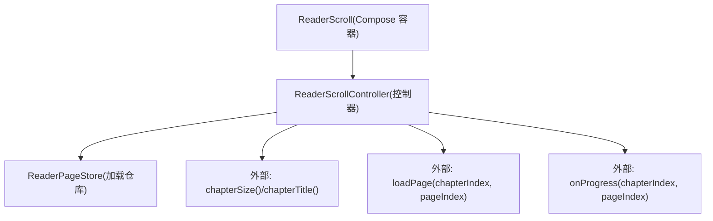
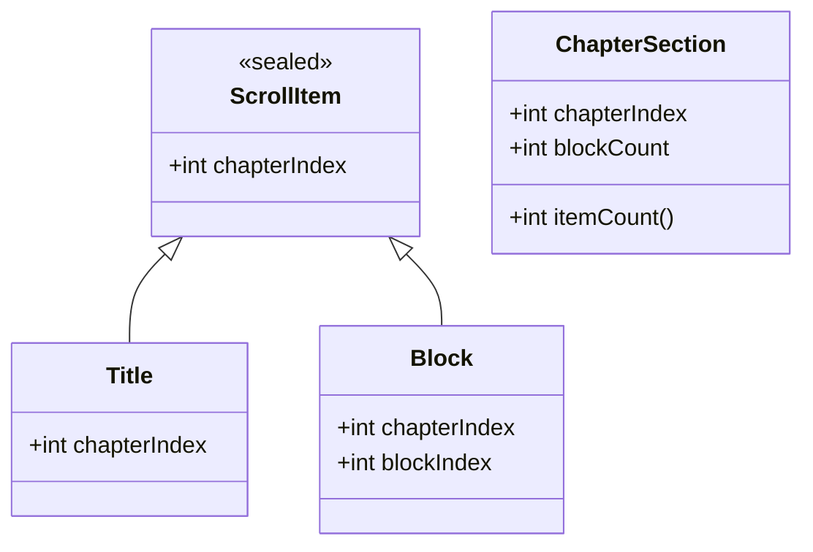
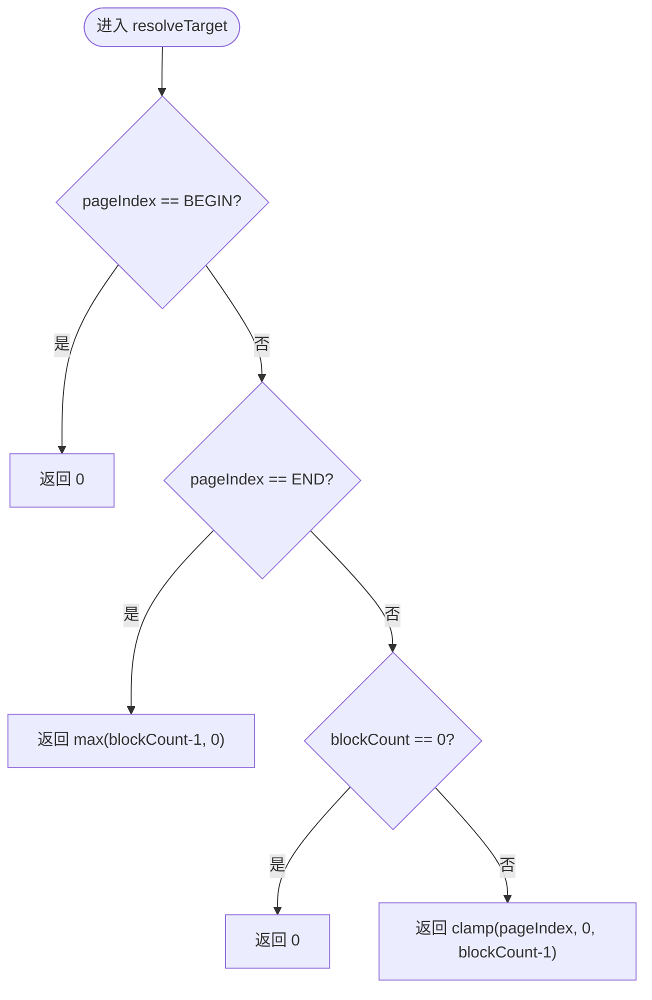
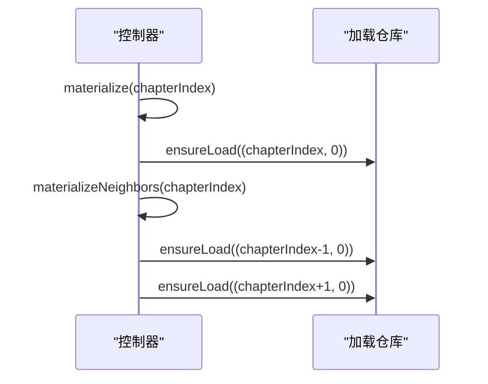
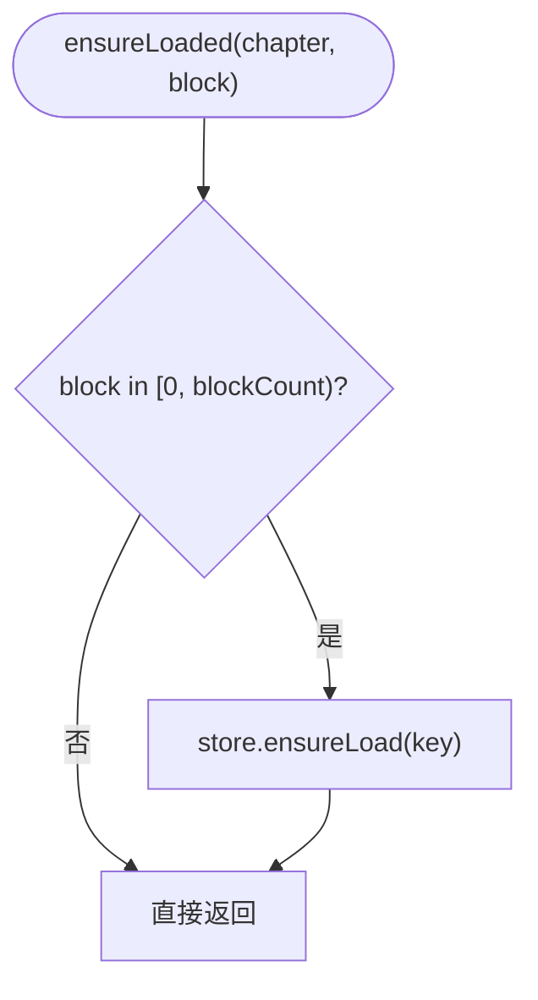
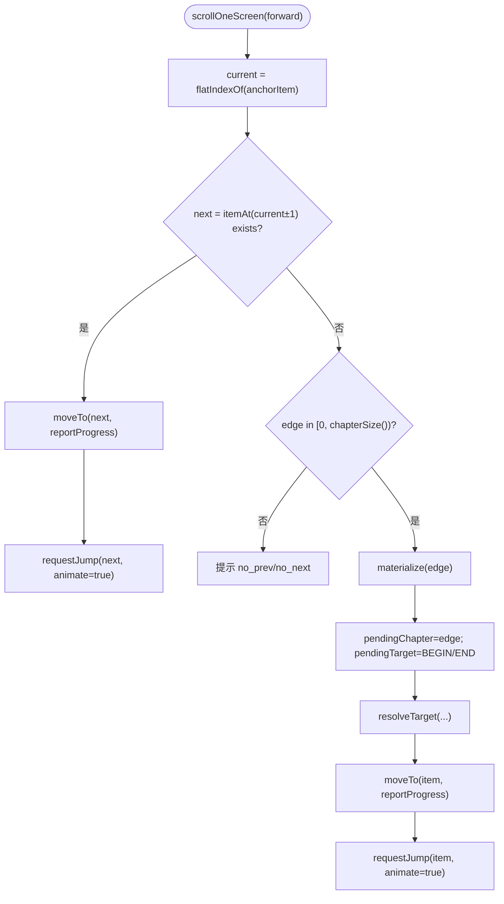
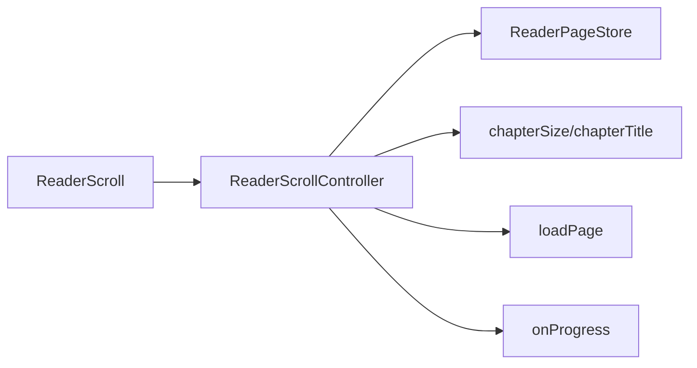

# ReaderScrollController（跨章连续列表控制器）

<cite>
**本文引用的文件**   
- [ReaderScrollController.kt](file://module_book/src/main/java/com/ebook/book/reader/ReaderScrollController.kt)
- [ReaderScroll.kt](file://module_book/src/main/java/com/ebook/book/reader/ReaderScroll.kt)
- [ReaderPageStore.kt](file://module_book/src/main/java/com/ebook/book/reader/ReaderPageStore.kt)
- [ReaderScrollControllerTest.kt](file://module_book/src/test/java/com/ebook/book/reader/ReaderScrollControllerTest.kt)
- [ReaderScrollSeamlessTest.kt](file://module_book/src/test/java/com/ebook/book/reader/ReaderScrollSeamlessTest.kt)
- [ReaderScrollFakes.kt](file://module_book/src/test/java/com/ebook/book/reader/ReaderScrollFakes.kt)
- [2026-09-13-reader-scroll-mode-design.md](file://docs/superpowers/specs/2026-09-13-reader-scroll-mode-design.md)
</cite>

## 目录
1. [简介](#简介)
2. [项目结构](#项目结构)
3. [核心组件](#核心组件)
4. [架构总览](#架构总览)
5. [关键组件详解](#关键组件详解)
6. [依赖关系分析](#依赖关系分析)
7. [性能与内存策略](#性能与内存策略)
8. [故障排查](#故障排查)
9. [结论](#结论)
10. [附录：扩展与自定义示例](#附录：扩展与自定义示例)

## 简介
ReaderScrollController 是阅读器的“上下滚屏模式”的控制器，负责在整本书范围内维护一条**跨章连续列表**，将“章节标题项”和“正文块项”无缝串联，并处理滚动落点、预取、懒加载、锚点解析与进度上报。其核心设计围绕以下目标：
- 跨章连续：本章末块的下一项就是下一章标题，滚动经过标题即进入下一章，无需显式“切章”。
- 惰性物化：只有进入某章时才物化它及其相邻两章，确保跨章滚动时排版已就绪。
- 锚点语义化：锚点存 (章, 块) 而非扁平序号，避免上方插入 item 导致进度偏移。
- 哨兵解析：支持 BEGIN/END 等哨兵页码，待块数落定后再解析到具体块号。
- 平滑体验：预取邻域块 + 懒加载兜底，保证 fling 或跨章时不出现大量加载态闪烁。
- 内存可控：按“章距”裁剪正文保留集，避免跨章累积导致的内存膨胀。

## 项目结构
该功能位于 book 模块的 reader 子包，由三个核心文件构成：
- ReaderScrollController.kt：控制列表模型、锚点、物化、预取、裁剪与滚动命令。
- ReaderScroll.kt：Compose 容器与渲染，提供 LazyColumn 列表、点击分区滚一屏、位置行常驻等 UI 行为。
- ReaderPageStore.kt：共享的加载仓库，统一去重、三态管理、retain 清理与 onLoaded 回调。



**图示来源**
- [ReaderScroll.kt:73-233](file://module_book/src/main/java/com/ebook/book/reader/ReaderScroll.kt#L73-L233)
- [ReaderScrollController.kt:89-397](file://module_book/src/main/java/com/ebook/book/reader/ReaderScrollController.kt#L89-L397)
- [ReaderPageStore.kt:29-98](file://module_book/src/main/java/com/ebook/book/reader/ReaderPageStore.kt#L29-L98)

**章节来源**
- [ReaderScrollController.kt:14-88](file://module_book/src/main/java/com/ebook/book/reader/ReaderScrollController.kt#L14-L88)
- [ReaderScroll.kt:53-233](file://module_book/src/main/java/com/ebook/book/reader/ReaderScroll.kt#L53-L233)
- [ReaderPageStore.kt:9-28](file://module_book/src/main/java/com/ebook/book/reader/ReaderPageStore.kt#L9-L28)

## 核心组件
- ScrollItem：密封接口，区分两种项：
  - Title：章标题项，作为一章入口，等价于该章第 0 块。
  - Block：正文块项，高为一屏（排版实测值），块间精确拼接。
- ChapterSection：一章在列表中的段，包含 1 个标题项 + blockCount 个块项；blockCount 为 0 表示尚未排版，占 1 个占位项。
- ReaderScrollController：控制器，持有 sections、anchorItem、jump、pendingTarget/pendingChapter、store 等状态，暴露 setInitData、onScrolledToItem、scrollOneScreen、ensureLoaded、reload 等方法。
- ReaderPageStore：加载仓库，负责 ensureLoad/reload/clear/retain 以及 onLoaded 回调，供翻页与滚屏共用。

**章节来源**
- [ReaderScrollController.kt:21-49](file://module_book/src/main/java/com/ebook/book/reader/ReaderScrollController.kt#L21-L49)
- [ReaderScrollController.kt:89-154](file://module_book/src/main/java/com/ebook/book/reader/ReaderScrollController.kt#L89-L154)
- [ReaderPageStore.kt:29-98](file://module_book/src/main/java/com/ebook/book/reader/ReaderPageStore.kt#L29-L98)

## 架构总览
从 UI 到数据再到控制的调用链如下：

```mermaid
sequenceDiagram
    participant U as "用户"
    participant V as "ReaderScroll(Compose)"
    participant C as "ReaderScrollController"
    participant S as "ReaderPageStore"
    participant L as "loadPage(外部)"

    U->>V: 点击左/右三分区 / 按键
    V->>C: scrollOneScreen(forward)
    C->>C: flatIndexOf(anchorItem)
    alt 有下一项
        C->>C: moveTo(next, reportProgress)
        C->>C: requestJump(next, animate=true)
    else 列表尽头且存在相邻章
        C->>C: materialize(edge)
        C->>S: ensureLoad(相邻章第0块)
        C->>C: pendingChapter=pedge; pendingTarget=BEGIN/END
        C->>C: resolveTarget(pendingTarget, blockCountOf(edge))
        C->>C: moveTo(item, reportProgress)
        C->>C: requestJump(item, animate=true)
    end

    Note over V,C: 容器 LaunchedEffect(jump) 驱动 scrollTo/animateScrollToItem
```

**图示来源**
- [ReaderScroll.kt:98-111](file://module_book/src/main/java/com/ebook/book/reader/ReaderScroll.kt#L98-L111)
- [ReaderScrollController.kt:275-302](file://module_book/src/main/java/com/ebook/book/reader/ReaderScrollController.kt#L275-L302)
- [ReaderScrollController.kt:324-336](file://module_book/src/main/java/com/ebook/book/reader/ReaderScrollController.kt#L324-L336)
- [ReaderScrollController.kt:382-388](file://module_book/src/main/java/com/ebook/book/reader/ReaderScrollController.kt#L382-L388)

**章节来源**
- [ReaderScrollController.kt:275-302](file://module_book/src/main/java/com/ebook/book/reader/ReaderScrollController.kt#L275-L302)
- [ReaderScroll.kt:98-111](file://module_book/src/main/java/com/ebook/book/reader/ReaderScroll.kt#L98-L111)

## 关键组件详解

### 跨章连续列表模型：ChapterSection 与 ScrollItem
- 列表以“章段”为单位组织：每个章段 = 1 个标题项 + N 个块项。
- 标题项是该章入口，进度口径上等同于该章第 0 块（anchorBlock 取 0）。
- 块项高度为排版实测值，保证块与块精确拼接无间隙。
- 当 blockCount == 0（未排版完成）时，该章段只占 1 个占位项，列表不断开。



**图示来源**
- [ReaderScrollController.kt:21-49](file://module_book/src/main/java/com/ebook/book/reader/ReaderScrollController.kt#L21-L49)

**章节来源**
- [ReaderScrollController.kt:21-49](file://module_book/src/main/java/com/ebook/book/reader/ReaderScrollController.kt#L21-L49)

### 锚点系统与哨兵解析
- anchorItem 存储语义值 (章, 块)，而非扁平序号。原因是相邻章展开会在当前可见项之上插入多项，若用序号做锚点会导致进度整体平移。
- pendingTarget 保存尚未解析的目标页码（可能为 BEGIN/END），直到所属章的块数落定才解析为具体块号，并通过 store.ensureLoad 补发加载。
- resolveTarget 逻辑：
  - BEGIN → 首块
  - END → 末块（至少 0）
  - 块数未知 → 先落到 0
  - 其余越界页码钳到 [0, blockCount-1]



**图示来源**
- [ReaderScrollController.kt:382-388](file://module_book/src/main/java/com/ebook/book/reader/ReaderScrollController.kt#L382-L388)

**章节来源**
- [ReaderScrollController.kt:121-146](file://module_book/src/main/java/com/ebook/book/reader/ReaderScrollController.kt#L121-L146)
- [ReaderScrollController.kt:382-388](file://module_book/src/main/java/com/ebook/book/reader/ReaderScrollController.kt#L382-L388)

### 惰性物化与相邻章预取：materialize 与 materializeNeighbors
- materialize(chapterIndex)：插入章段（保持升序），并探取该章第 0 块；探测结果回出的 pageAll 即为该章块数。
- materializeNeighbors(chapterIndex)：进入某章即同时物化相邻两章，确保跨章滚动时无需等待排版。
- 边界保护：若相邻章不存在（全书首/末），不会请求无效章节。



**图示来源**
- [ReaderScrollController.kt:324-336](file://module_book/src/main/java/com/ebook/book/reader/ReaderScrollController.kt#L324-L336)

**章节来源**
- [ReaderScrollController.kt:324-336](file://module_book/src/main/java/com/ebook/book/reader/ReaderScrollController.kt#L324-L336)

### 懒加载兜底：ensureLoaded
- 块组合时自请求加载，防止 fling 跳过中间块导致一路加载态。
- 重复调用空操作：已 Loaded 被短路，在途 job 登记去重。
- 越界块号不发请求，避免无效负载。



**图示来源**
- [ReaderScrollController.kt:258-261](file://module_book/src/main/java/com/ebook/book/reader/ReaderScrollController.kt#L258-L261)
- [ReaderPageStore.kt:47-71](file://module_book/src/main/java/com/ebook/book/reader/ReaderPageStore.kt#L47-L71)

**章节来源**
- [ReaderScrollController.kt:248-261](file://module_book/src/main/java/com/ebook/book/reader/ReaderScrollController.kt#L248-L261)
- [ReaderPageStore.kt:47-71](file://module_book/src/main/java/com/ebook/book/reader/ReaderPageStore.kt#L47-L71)

### 预取优化：prefetch
- 对锚点邻域 ±PREFETCH 块发起 ensureLoad，命中 ChapterLayoutCache 后很便宜。
- 仅作为平滑优化，不替代 ensureLoaded 兜底。

**章节来源**
- [ReaderScrollController.kt:338-348](file://module_book/src/main/java/com/ebook/book/reader/ReaderScrollController.kt#L338-L348)

### 内存管理：prune 按章距裁剪
- 只保留锚点章 ±RETAIN_CHAPTERS 的块，超出范围则从 store 中移除。
- 单位必须是“章”而不是“块”，否则同章内回滚会丢块导致闪烁。
- 章段本身不裁，保证列表始终连续，往回滚不必重新排版。

**章节来源**
- [ReaderScrollController.kt:350-369](file://module_book/src/main/java/com/ebook/book/reader/ReaderScrollController.kt#L350-L369)
- [ReaderPageStore.kt:86-98](file://module_book/src/main/java/com/ebook/book/reader/ReaderPageStore.kt#L86-L98)

### 滚一屏实现：scrollOneScreen
- “下一屏”即下一项，可能是下一章标题项；标题矮于一屏，滚过去自然露出标题加下一章首块。
- 走到列表尽头且没有相邻章（全书首/末）提示“没有上一页/下一页”。
- 若还有相邻章但尚未物化：先 materialize，记录 pendingChapter/pendingTarget，解析并跳转。



**图示来源**
- [ReaderScrollController.kt:275-302](file://module_book/src/main/java/com/ebook/book/reader/ReaderScrollController.kt#L275-L302)

**章节来源**
- [ReaderScrollController.kt:275-302](file://module_book/src/main/java/com/ebook/book/reader/ReaderScrollController.kt#L275-L302)

### 列表渲染与 key 唯一性约束
- LazyColumn items(count=itemCount, key={controller.itemKey(it)})，key 由 (章, 块) 生成，不含扁平序号，保证全局唯一且稳定。
- 若 key 重复或含序号，LazyColumn 锚定失效，画面静默跳变。
- 单次上方插入不得超过约 100 项（平台 key→index 映射窗口限制），超长章需分批插入。

**章节来源**
- [ReaderScrollController.kt:197-207](file://module_book/src/main/java/com/ebook/book/reader/ReaderScrollController.kt#L197-L207)
- [ReaderScroll.kt:180-205](file://module_book/src/main/java/com/ebook/book/reader/ReaderScroll.kt#L180-L205)
- [ReaderScrollController.kt:67-81](file://module_book/src/main/java/com/ebook/book/reader/ReaderScrollController.kt#L67-L81)

## 依赖关系分析
- ReaderScrollController 依赖：
  - CoroutineScope：用于协程任务生命周期。
  - Context：用于错误提示。
  - chapterSize/chapterTitle：外部提供的章节元数据。
  - loadPage：外部提供的分块加载函数（与翻页模式共用）。
  - onProgress：进度上报回调（与翻页模式共用）。
- ReaderScrollController 使用 ReaderPageStore 进行加载去重、三态管理与 retain 清理。
- ReaderScroll 通过 Controller 暴露的状态驱动 LazyColumn 渲染与滚动。



**图示来源**
- [ReaderScrollController.kt:89-154](file://module_book/src/main/java/com/ebook/book/reader/ReaderScrollController.kt#L89-L154)
- [ReaderScroll.kt:73-111](file://module_book/src/main/java/com/ebook/book/reader/ReaderScroll.kt#L73-L111)

**章节来源**
- [ReaderScrollController.kt:89-154](file://module_book/src/main/java/com/ebook/book/reader/ReaderScrollController.kt#L89-L154)
- [ReaderScroll.kt:73-111](file://module_book/src/main/java/com/ebook/book/reader/ReaderScroll.kt#L73-L111)

## 性能与内存策略
- 惰性物化：进入某章即物化相邻两章，跨章滚动无需等待排版。
- 预取邻域：prefetch 半径为 2 块，减少 fling 时的加载态闪烁。
- 懒加载兜底：ensureLoaded 保证所有组合上的块都会请求，避免漏抓。
- 内存裁剪：prune 按章距 ±2 保留正文，远章释放，避免无限累积。
- 键锚定：itemKey 全局唯一且不含序号，保障 LazyColumn 锚定稳定。
- 平台限制：单次上方插入不超过约 100 项，超长章需分批插入。

[本节为通用性能讨论，无需特定文件引用]

## 故障排查
- 列表空白或加载态长时间不消失：
  - 检查 ensureLoaded 是否被调用（组合时自请求），以及 store.ensureLoad 的去重逻辑。
  - 确认 loadPage 是否正确返回 pageAll 与文本，失败会置 Error。
- 滚动位置跳动或丢失：
  - 检查 itemKey 是否全局唯一且不含扁平序号。
  - 检查 anchorItem 是否为语义值（章, 块），而非序号。
- 跨章卡顿：
  - 确认 materializeNeighbors 已执行，相邻章已被物化。
  - 检查 pendingTarget 解析流程，块数落定后应补报进度并跳转。
- 内存过高：
  - 确认 prune 按章距裁剪生效，远章正文被释放。
  - 检查 store.retain 调用是否按预期传入保留集。

**章节来源**
- [ReaderScrollController.kt:248-261](file://module_book/src/main/java/com/ebook/book/reader/ReaderScrollController.kt#L248-L261)
- [ReaderScrollController.kt:324-336](file://module_book/src/main/java/com/ebook/book/reader/ReaderScrollController.kt#L324-L336)
- [ReaderScrollController.kt:350-369](file://module_book/src/main/java/com/ebook/book/reader/ReaderScrollController.kt#L350-L369)
- [ReaderPageStore.kt:47-98](file://module_book/src/main/java/com/ebook/book/reader/ReaderPageStore.kt#L47-L98)

## 结论
ReaderScrollController 通过“章段 + 标题/块项”的模型实现了跨章连续列表，利用惰性物化、哨兵解析、懒加载与邻域预取，保证了跨章滚动的流畅性与一致性；按章距裁剪正文维持了内存上限。配合 ReaderScroll 的 Compose 渲染与 ReaderPageStore 的加载仓库，形成了完整、可复用、可测试的滚屏解决方案。

[本节为总结，无需特定文件引用]

## 附录：扩展与自定义示例

### 自定义滚动行为
- 在 ReaderScroll 中拦截点击分区，调用 controller.scrollOneScreen(forward) 实现自定义滚动。
- 如需自定义动画时长或缓动，可在 LaunchedEffect(jump) 中替换 animateScrollToItem 的行为。

参考路径
- [ReaderScroll.kt:125-147](file://module_book/src/main/java/com/ebook/book/reader/ReaderScroll.kt#L125-L147)
- [ReaderScroll.kt:98-111](file://module_book/src/main/java/com/ebook/book/reader/ReaderScroll.kt#L98-L111)

### 处理章节展开时的布局变化
- 当相邻章展开时，LazyColumn 会因 key 锚定保住视觉位置；控制器通过 anchorItem 语义值避免进度偏移。
- 若需要额外补偿（例如顶部插入过多项导致锚定窗口超限），可分批插入并多次刷新。

参考路径
- [ReaderScrollController.kt:67-81](file://module_book/src/main/java/com/ebook/book/reader/ReaderScrollController.kt#L67-L81)
- [ReaderScrollController.kt:197-207](file://module_book/src/main/java/com/ebook/book/reader/ReaderScrollController.kt#L197-L207)

### 扩展新的内容加载策略
- 替换 loadPage 参数，接入本地缓存或网络策略；确保返回的 pageAll 正确反映该章块数。
- 在 ReaderPageStore 中，ensureLoad 已具备 job 去重与三态管理，可直接复用。

参考路径
- [ReaderScrollController.kt:89-147](file://module_book/src/main/java/com/ebook/book/reader/ReaderScrollController.kt#L89-L147)
- [ReaderPageStore.kt:47-98](file://module_book/src/main/java/com/ebook/book/reader/ReaderPageStore.kt#L47-L98)

### 测试用例参考
- 块总数在首个加载结果到达前为 0，随后落定。
- 进入一章即物化相邻两章。
- 整本书首末不物化不存在的相邻章。
- 章界处的 item 顺序是本章末块直接接下一章标题。
- 扁平序号与章块双向映射，标题项算该章第 0 块。
- 锚点上方插入 item 时阅读位置与进度都不动。
- 末块下一屏跨过标题项落到下一章章首。
- 首块上一屏落到上一章末块。
- 标题项与该章首块之间来回滚不重复写进度。
- 整本书末尾再下一屏不推进也不发跳转。
- 章末哨兵在块数落定后解析成末块并补报进度。
- 越界落点钳到章内。
- 进度按章内块号经与翻页模式同一个回调上报。
- 块总数不因某块加载失败而改变。
- 往返滚动不重复请求已加载过的块。
- 块自请求兜住预取覆盖不到的块且不重复抓。
- 保留集按章距裁剪，远章正文被清而近章留着。
- 某章探测失败只让该章停在错误占位，相邻章照常物化。
- item key 全局唯一。

参考路径
- [ReaderScrollControllerTest.kt:30-398](file://module_book/src/test/java/com/ebook/book/reader/ReaderScrollControllerTest.kt#L30-L398)
- [ReaderScrollSeamlessTest.kt:57-130](file://module_book/src/test/java/com/ebook/book/reader/ReaderScrollSeamlessTest.kt#L57-L130)
- [ReaderScrollFakes.kt:17-44](file://module_book/src/test/java/com/ebook/book/reader/ReaderScrollFakes.kt#L17-L44)