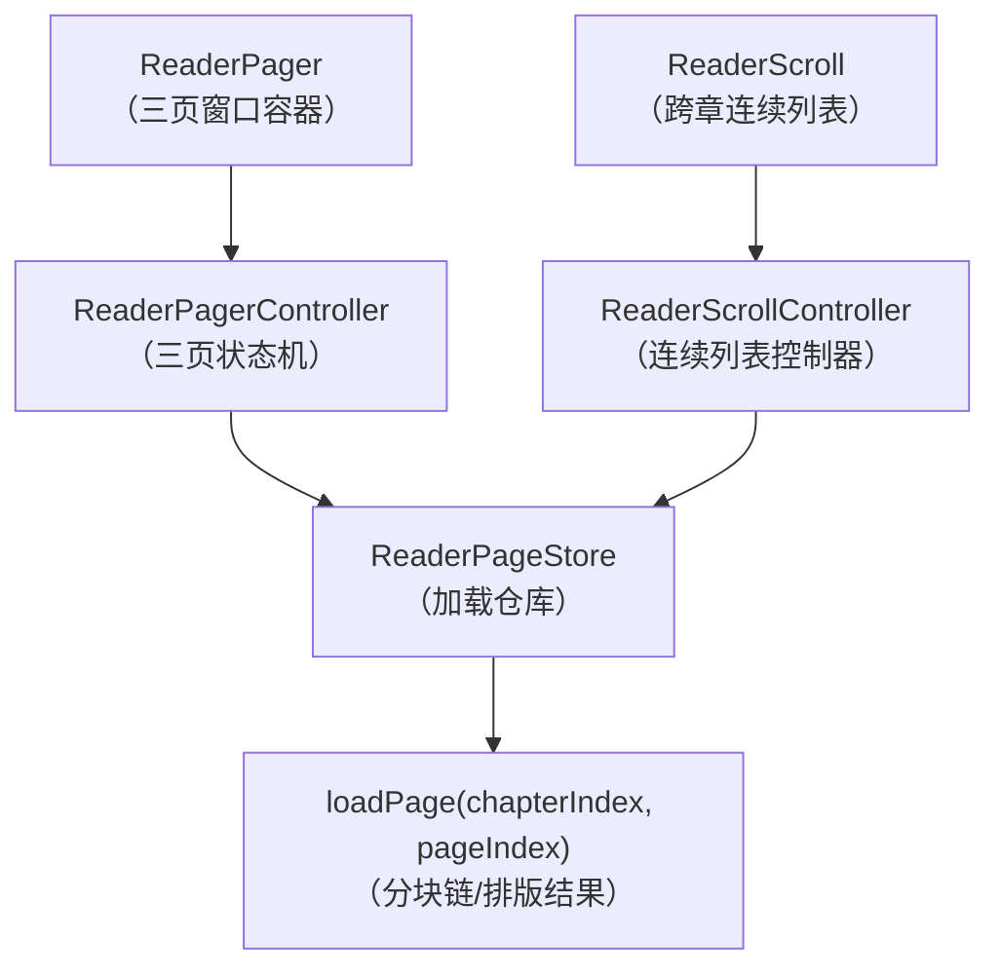
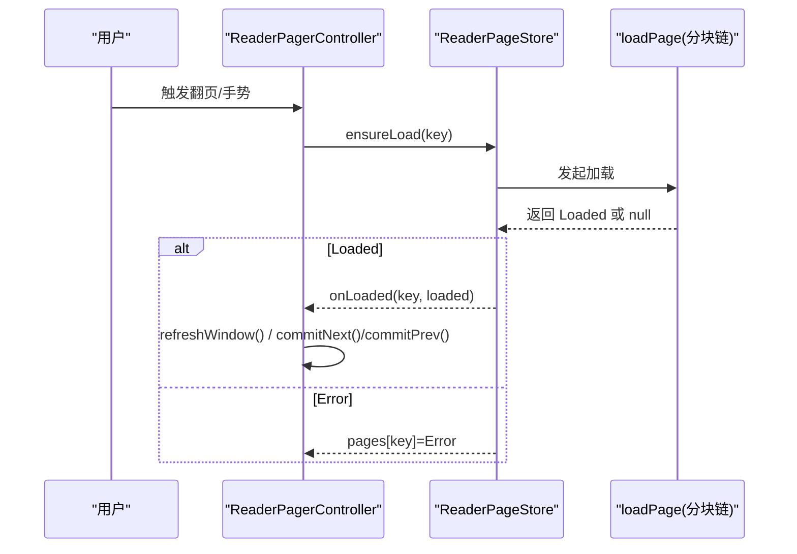
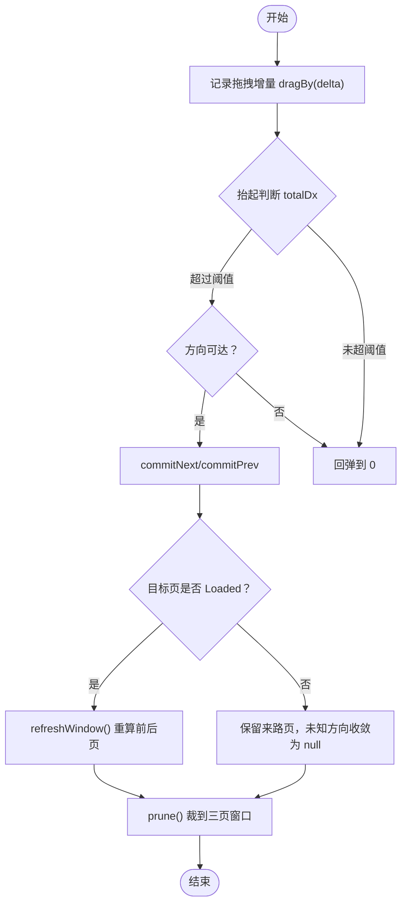
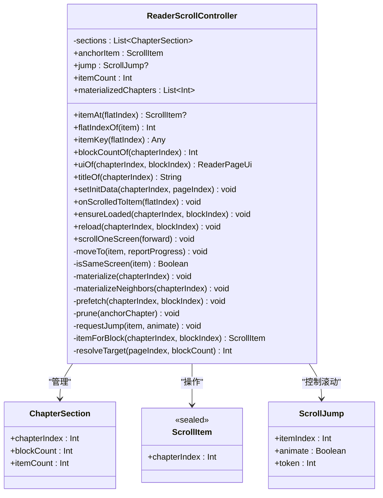
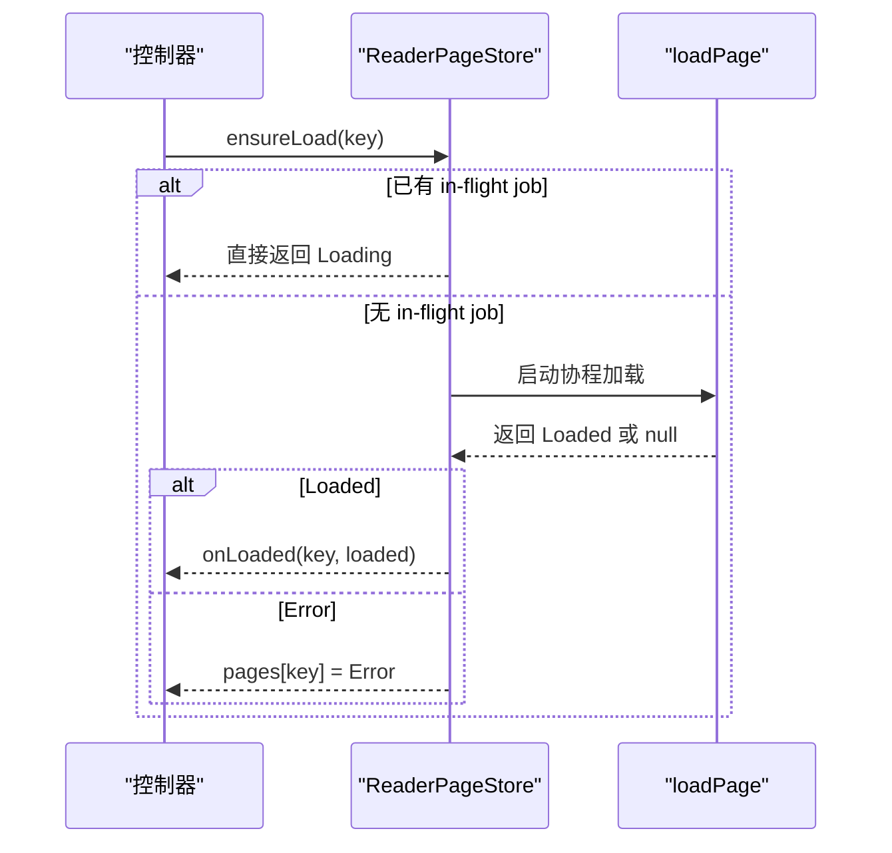
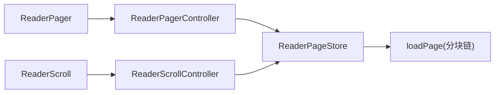

# 翻页引擎（ReaderPager & ReaderScroll）

<cite>
**本文引用的文件**
- [ReaderPager.kt](file://module_book/src/main/java/com/ebook/book/reader/ReaderPager.kt)
- [ReaderScroll.kt](file://module_book/src/main/java/com/ebook/book/reader/ReaderScroll.kt)
- [ReaderScrollController.kt](file://module_book/src/main/java/com/ebook/book/reader/ReaderScrollController.kt)
- [ReaderPageStore.kt](file://module_book/src/main/java/com/ebook/book/reader/ReaderPageStore.kt)
- [ReaderPagerControllerTest.kt](file://module_book/src/test/java/com/ebook/book/reader/ReaderPagerControllerTest.kt)
- [ReaderScrollControllerTest.kt](file://module_book/src/test/java/com/ebook/book/reader/ReaderScrollControllerTest.kt)
- [2026-09-13-reader-scroll-mode-design.md](file://docs/superpowers/specs/2026-09-13-reader-scroll-mode-design.md)
</cite>

## 目录
1. [引言](#引言)
2. [项目结构](#项目结构)
3. [核心组件](#核心组件)
4. [架构总览](#架构总览)
5. [详细组件分析](#详细组件分析)
6. [依赖关系分析](#依赖关系分析)
7. [性能考量](#性能考量)
8. [故障排查指南](#故障排查指南)
9. [结论](#结论)
10. [附录：实践与扩展](#附录实践与扩展)

## 引言
本文件聚焦阅读器的“翻页引擎”，系统说明两种翻页容器的实现原理与差异：左右翻页的 ReaderPager（三页窗口 + 横向拖拽）与上下滚屏的 ReaderScroll（跨章连续列表）。重点解释：
- ReaderPagerController 的三页窗口状态机、拖拽阈值、commitNext/commitPrev 收敛规则
- ReaderScrollController 的跨章连续列表模型、锚点定位、滚动位置同步策略
- ReaderPageStore 的加载仓库：去重、取消在途任务、按 key 完成回调
- 两种模式共同约束：稳定的 item key、全局唯一键空间、单次插入不超过 100 项的平台限制
- 如何自定义手势、处理章节切换进度同步、扩展新的翻页模式

## 项目结构
翻页引擎位于 module_book 的 reader 包，由三个核心文件构成：
- ReaderPager.kt：左右翻页容器与控制器（三页窗口、手势、动画、收敛）
- ReaderScroll.kt：上下滚屏容器（LazyColumn 跨章列表、位置行、点击分区）
- ReaderScrollController.kt：滚屏控制器（章段物化、锚点、预取、裁剪）
- ReaderPageStore.kt：加载仓库（去重、取消、完成回调分发）

**图示来源**
- [ReaderPager.kt:110-323](file://module_book/src/main/java/com/ebook/book/reader/ReaderPager.kt#L110-L323)
- [ReaderScroll.kt:72-233](file://module_book/src/main/java/com/ebook/book/reader/ReaderScroll.kt#L72-L233)
- [ReaderScrollController.kt:89-397](file://module_book/src/main/java/com/ebook/book/reader/ReaderScrollController.kt#L89-L397)
- [ReaderPageStore.kt:29-98](file://module_book/src/main/java/com/ebook/book/reader/ReaderPageStore.kt#L29-L98)

**章节来源**
- [ReaderPager.kt:61-323](file://module_book/src/main/java/com/ebook/book/reader/ReaderPager.kt#L61-L323)
- [ReaderScroll.kt:53-233](file://module_book/src/main/java/com/ebook/book/reader/ReaderScroll.kt#L53-L233)
- [ReaderScrollController.kt:14-397](file://module_book/src/main/java/com/ebook/book/reader/ReaderScrollController.kt#L14-L397)
- [ReaderPageStore.kt:9-98](file://module_book/src/main/java/com/ebook/book/reader/ReaderPageStore.kt#L9-L98)

## 核心组件
- ReaderPageKey：页面标识（chapterIndex, pageIndex），pageIndex 与 DB 对齐，包含哨兵值用于“章节首页/末页”请求。
- ReaderPageUi：单页渲染状态（Loading/Error/Loaded），Loaded 包含章节标题、页码、总页数、正文文本。
- ReaderPagerController：三页窗口状态机，维护 durKey/prevKey/nextKey、拖拽动画、翻页阈值、窗口收敛。
- ReaderScrollController：跨章连续列表控制器，维护已物化章段、锚点、跳转、预取、裁剪。
- ReaderPageStore：统一加载仓库，负责去重、取消在途任务、完成回调分发、保留集裁剪。

**章节来源**
- [ReaderPager.kt:61-117](file://module_book/src/main/java/com/ebook/book/reader/ReaderPager.kt#L61-L117)
- [ReaderScrollController.kt:14-57](file://module_book/src/main/java/com/ebook/book/reader/ReaderScrollController.kt#L14-L57)
- [ReaderPageStore.kt:9-31](file://module_book/src/main/java/com/ebook/book/reader/ReaderPageStore.kt#L9-L31)

## 架构总览
两种翻页模式共享同一加载链路（loadPage → ReaderPageStore），但在 UI 几何上分离：
- 翻页模式：三页窗口 + 横向拖拽，提交时根据目标页是否 Loaded 决定窗口收敛。
- 滚屏模式：跨章连续 LazyColumn，以“章段 = 标题项 + 块项”组织，锚点存语义值避免序号平移影响进度。

**图示来源**
- [ReaderPager.kt:149-192](file://module_book/src/main/java/com/ebook/book/reader/ReaderPager.kt#L149-L192)
- [ReaderPageStore.kt:47-70](file://module_book/src/main/java/com/ebook/book/reader/ReaderPageStore.kt#L47-L70)

## 详细组件分析

### ReaderPagerController：三页窗口状态机
- 窗口模型：当前页（dur）、上一页（prev）、下一页（next），z 序为 next < dur < prev；drag 为横向位移（px），负值向后翻、正值向前翻。
- 手势与阈值：awaitEachGesture 收集横向位移，超过 30dp 成功阈值则执行翻页动画并调用 commitNext/commitPrev；否则回弹。
- 收敛规则：当目标页非 Loaded（仍在途或失败）时，不能只跳过重算；必须保留来路页作为相邻方向，未知方向收敛为 null，确保三键互异且不会双方向同时为空。
- 程序化翻页：turnPrev/turnNext 驱动动画并提交窗口变更；setInitData 清理在途任务并收敛到指定章节页。

**图示来源**
- [ReaderPager.kt:194-323](file://module_book/src/main/java/com/ebook/book/reader/ReaderPager.kt#L194-L323)

**章节来源**
- [ReaderPager.kt:110-323](file://module_book/src/main/java/com/ebook/book/reader/ReaderPager.kt#L110-L323)
- [ReaderPagerControllerTest.kt:20-100](file://module_book/src/test/java/com/ebook/book/reader/ReaderPagerControllerTest.kt#L20-L100)

### ReaderScrollController：跨章连续列表
- 列表模型：按“章段”组织，每段包含 1 个标题项 + N 个块项；进入某章即物化相邻两章，避免章界等待排版。
- 锚点机制：anchorItem 存储语义值（章+块），扁平序号会随上方插入平移，因此用稳定 key（itemKey）让 LazyColumn 保位。
- 滚动同步：onScrolledToItem 上报 firstVisibleItemIndex，控制器换算成 (章, 块) 后移动锚点并决定是否上报进度。
- 预取与裁剪：prefetch 对锚点邻域块进行平滑预取；prune 按“章距 ±2”裁剪正文保留集，防止内存累积。
- 哨兵解析：pendingTarget 保存初始落点（BEGIN/END），待块数落定后解析为具体块号并补发加载。

**图示来源**
- [ReaderScrollController.kt:14-397](file://module_book/src/main/java/com/ebook/book/reader/ReaderScrollController.kt#L14-L397)

**章节来源**
- [ReaderScrollController.kt:14-397](file://module_book/src/main/java/com/ebook/book/reader/ReaderScrollController.kt#L14-L397)
- [ReaderScrollControllerTest.kt:18-100](file://module_book/src/test/java/com/ebook/book/reader/ReaderScrollControllerTest.kt#L18-L100)

### ReaderPageStore：加载仓库
- 去重：按 ReaderPageKey 登记 in-flight job，已 Loaded 的页不重复请求。
- 取消：clear 取消全部在途任务并清空状态；retain 清理保留集之外的页面状态与在途任务。
- 完成回调：onLoaded 仅对有效前端生效（翻页模式判 key == durKey；滚屏模式判该章是否仍在已物化章段中）。
- 重试：reload 取消旧 job 并重新发起加载。

**图示来源**
- [ReaderPageStore.kt:47-77](file://module_book/src/main/java/com/ebook/book/reader/ReaderPageStore.kt#L47-L77)

**章节来源**
- [ReaderPageStore.kt:9-98](file://module_book/src/main/java/com/ebook/book/reader/ReaderPageStore.kt#L9-L98)

### ReaderPager：三页窗口容器
- 层级 z 序：下一页（底）→ 当前页 → 上一页（顶），与原 FrameLayout addView 顺序一致。
- 布局期偏移：通过 offset { ... } 读取 drag 状态，动画期间只触发重布局不重组。
- 点击分区：左右三分区点击触发 turnPrev/turnNext，中间区域唤出菜单。
- 尺寸测量：LaunchedEffect 写入 pageWidthPx 与 turnThresholdPx，供手势判定使用。

**章节来源**
- [ReaderPager.kt:325-480](file://module_book/src/main/java/com/ebook/book/reader/ReaderPager.kt#L325-L480)

### ReaderScroll：跨章连续列表
- 列表组织：LazyColumn items(count, key)，key 由 controller.itemKey 生成，保证稳定与全局唯一。
- 视口尺寸：仅在 LazyColumn 上回报一次 onSizeChanged，避免块自报导致循环收缩。
- 点击分区：区分“点”与“滚”，竖向滚动交给 LazyColumn 自身，避免手势冲突。
- 位置行：常驻在滚动区之外，高度与翻页模式页码行一致，保持进度节奏统一。

**章节来源**
- [ReaderScroll.kt:53-233](file://module_book/src/main/java/com/ebook/book/reader/ReaderScroll.kt#L53-L233)

## 依赖关系分析
- ReaderPagerController 与 ReaderScrollController 都依赖 ReaderPageStore，共享 loadPage 与去重逻辑。
- ReaderPager 依赖 ReaderPagerController 提供窗口状态与手势处理。
- ReaderScroll 依赖 ReaderScrollController 提供列表模型与锚点控制。
- 两者均通过 ReaderPageStore 的 onLoaded 回调进行几何重算或锚点解析。

**图示来源**
- [ReaderPager.kt:110-323](file://module_book/src/main/java/com/ebook/book/reader/ReaderPager.kt#L110-L323)
- [ReaderScroll.kt:72-233](file://module_book/src/main/java/com/ebook/book/reader/ReaderScroll.kt#L72-L233)
- [ReaderScrollController.kt:89-397](file://module_book/src/main/java/com/ebook/book/reader/ReaderScrollController.kt#L89-L397)
- [ReaderPageStore.kt:29-98](file://module_book/src/main/java/com/ebook/book/reader/ReaderPageStore.kt#L29-L98)

**章节来源**
- [ReaderPager.kt:110-323](file://module_book/src/main/java/com/ebook/book/reader/ReaderPager.kt#L110-L323)
- [ReaderScrollController.kt:89-397](file://module_book/src/main/java/com/ebook/book/reader/ReaderScrollController.kt#L89-L397)
- [ReaderPageStore.kt:29-98](file://module_book/src/main/java/com/ebook/book/reader/ReaderPageStore.kt#L29-L98)

## 性能考量
- 去重与取消：ReaderPageStore 通过 jobs 登记与 isActive 检查避免重复请求与孤儿任务。
- 预取优化：ReaderScrollController 对锚点邻域块进行预取，提升滑动流畅性。
- 裁剪策略：翻页模式按三页窗口裁剪；滚屏模式按“章距 ±2”裁剪，避免同章内回滚丢失已加载块。
- 布局期偏移：ReaderPager 使用布局期 offset 读取 drag，减少重组开销。
- 平台限制：LazyColumn 单次上方插入不得超过约 100 项，超长章需分批插入以避免锚定失败。

**章节来源**
- [ReaderPageStore.kt:47-98](file://module_book/src/main/java/com/ebook/book/reader/ReaderPageStore.kt#L47-L98)
- [ReaderScrollController.kt:338-369](file://module_book/src/main/java/com/ebook/book/reader/ReaderScrollController.kt#L338-L369)
- [ReaderPager.kt:462-479](file://module_book/src/main/java/com/ebook/book/reader/ReaderPager.kt#L462-L479)

## 故障排查指南
- 翻页空转：若 nextKey 停在当前页，检查 commitNext/commitPrev 的收敛逻辑，确保三键互异。
- 进度错乱：滚屏模式下 anchorItem 应存语义值，避免扁平序号平移导致进度写偏。
- 加载态卡死：确认 ReaderPageStore.ensureLoad 的去重与 cancel 逻辑，以及 onLoaded 回调是否正确触发。
- 锚定失败：LazyColumn 单次插入超过 100 项会导致 key→index 映射失效，需分批插入或调整列表结构。
- 手势冲突：ReaderScroll 不消费竖向 drag，避免与 LazyColumn 自身滚动冲突。

**章节来源**
- [ReaderPager.kt:269-323](file://module_book/src/main/java/com/ebook/book/reader/ReaderPager.kt#L269-L323)
- [ReaderScrollController.kt:67-80](file://module_book/src/main/java/com/ebook/book/reader/ReaderScrollController.kt#L67-L80)
- [ReaderPageStore.kt:47-98](file://module_book/src/main/java/com/ebook/book/reader/ReaderPageStore.kt#L47-L98)

## 结论
ReaderPager 与 ReaderScroll 通过共享加载仓库实现了统一的翻页体验：前者强调三页窗口的几何收敛与手势阈值，后者强调跨章连续列表的锚点与预取。两者在性能、可维护性与用户体验上各有侧重，但都遵循稳定的 key 约定与统一的进度口径。实际使用中可根据设备与用户偏好选择合适模式，并通过 ReaderPageStore 的统一接口扩展新能力。

## 附录：实践与扩展

### 自定义翻页手势
- 翻页模式：在 ReaderPager 的 pointerInput 中监听横向滑动，结合 dragBy/settle 实现自定义阈值或阻尼。
- 滚屏模式：在 ReaderScroll 的 pointerInput 中区分点击与滚动，调用 scrollOneScreen 实现自定义跳转。

**章节来源**
- [ReaderPager.kt:359-400](file://module_book/src/main/java/com/ebook/book/reader/ReaderPager.kt#L359-L400)
- [ReaderScroll.kt:113-147](file://module_book/src/main/java/com/ebook/book/reader/ReaderScroll.kt#L113-L147)

### 章节切换时的进度同步
- 翻页模式：setInitData 清理在途任务并调用 onProgress 报告初始进度；refreshWindow 确保前后页可用。
- 滚屏模式：setInitData 物化相邻章并解析哨兵落点；onScrolledToItem 按语义值判断是否上报进度。

**章节来源**
- [ReaderPager.kt:163-171](file://module_book/src/main/java/com/ebook/book/reader/ReaderPager.kt#L163-L171)
- [ReaderScrollController.kt:220-235](file://module_book/src/main/java/com/ebook/book/reader/ReaderScrollController.kt#L220-L235)

### 扩展新的翻页模式
- 复用 ReaderPageStore：新容器只需实现自己的几何逻辑（如网格翻页、混合滚动等）。
- 遵循 key 约定：确保 item key 稳定且全局唯一，避免 LazyColumn 锚定失败。
- 统一进度上报：通过相同的 onProgress 接口保持进度口径一致。

**章节来源**
- [ReaderPageStore.kt:9-31](file://module_book/src/main/java/com/ebook/book/reader/ReaderPageStore.kt#L9-L31)
- [ReaderScrollController.kt:197-207](file://module_book/src/main/java/com/ebook/book/reader/ReaderScrollController.kt#L197-L207)

### 共同约束
- 稳定的 item key：LazyColumn 靠 key 保位，重复 key 会导致静默跳变。
- 全局唯一的键空间：不同章/块的 key 不得冲突。
- 单次插入不超过 100 项：平台 key→index 映射窗口有限，超限会锚定失败。

**章节来源**
- [ReaderScrollController.kt:67-80](file://module_book/src/main/java/com/ebook/book/reader/ReaderScrollController.kt#L67-L80)
- [2026-09-13-reader-scroll-mode-design.md:1-10](file://docs/superpowers/specs/2026-09-13-reader-scroll-mode-design.md#L1-L10)