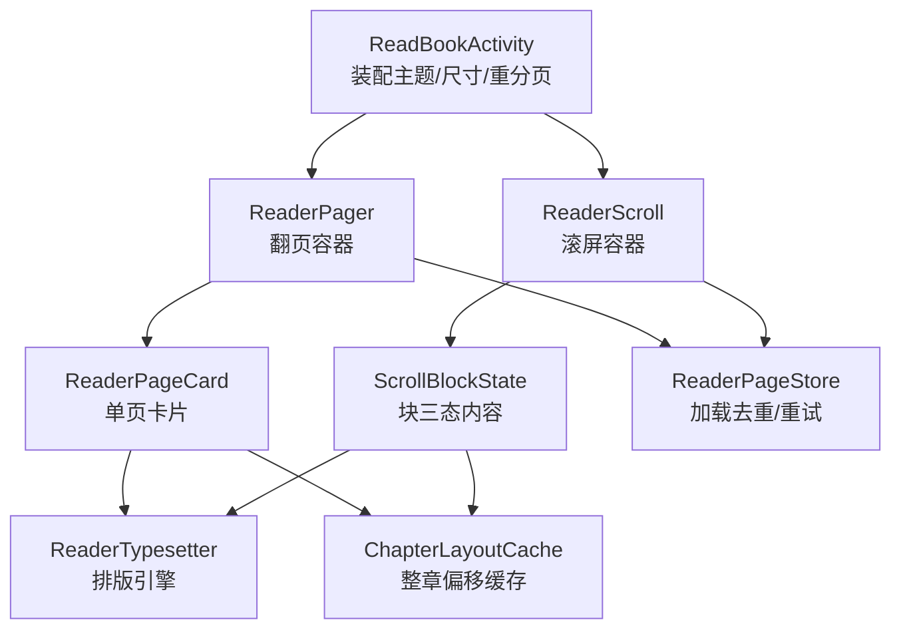
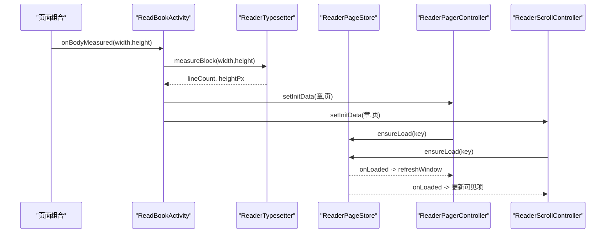
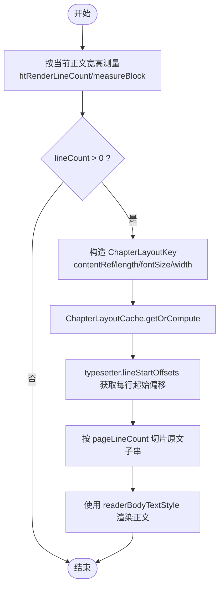
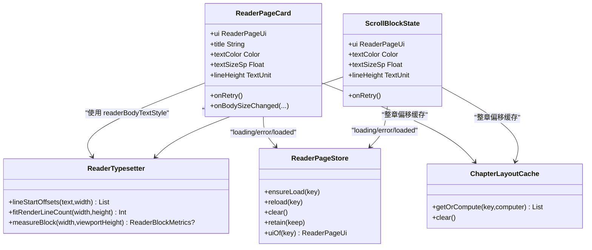

# 阅读器UI组件（ReaderPageCard 与 ScrollBlock）

<cite>
**本文引用的文件**
- [ReaderTypesetter.kt](file://module_book/src/main/java/com/ebook/book/reader/ReaderTypesetter.kt)
- [ReaderPager.kt](file://module_book/src/main/java/com/ebook/book/reader/ReaderPager.kt)
- [ReaderScroll.kt](file://module_book/src/main/java/com/ebook/book/reader/ReaderScroll.kt)
- [ReadBookActivity.kt](file://module_book/src/main/java/com/ebook/book/ReadBookActivity.kt)
- [ReaderPageStore.kt](file://module_book/src/main/java/com/ebook/book/reader/ReaderPageStore.kt)
- [ChapterLayoutCache.kt](file://module_book/src/main/java/com/ebook/book/reader/ChapterLayoutCache.kt)
</cite>

## 目录
1. [简介](#简介)
2. [项目结构](#项目结构)
3. [核心组件](#核心组件)
4. [架构总览](#架构总览)
5. [详细组件分析](#详细组件分析)
6. [依赖关系分析](#依赖关系分析)
7. [性能考量](#性能考量)
8. [故障排查指南](#故障排查指南)
9. [结论](#结论)
10. [附录：扩展指南](#附录扩展指南)

## 简介
本文件聚焦阅读器UI组件 ReaderPageCard 与 ScrollBlockState 的设计与实现，解释以下关键点：
- Loading/Error/Loaded 三态互斥渲染的契约与职责边界
- 正文区高度与页面状态无关的占位契约，及其对“每页行数”测算的影响
- 阅读背景主题配色体系（正文层与chrome层分离）
- ReaderPageTokens 中 pageNumberRowHeight 固定高度的必要性
- readerBodyTextStyle 样式一致性要求（分页测量与实际绘制必须使用同一份文本样式）
- 点击分区处理（左右三分区翻页/滚屏、中间区域唤出菜单）
- 重试机制的实现细节（错误态样式、交互反馈、网络异常恢复策略）
- Compose 性能优化要点（offset 在布局期读取 drag 状态、onSizeChanged 仅视口级别调用）

## 项目结构
阅读器界面由两个并列的承载容器组成：
- 翻页模式：ReaderPager + ReaderPageCard
- 滚屏模式：ReaderScroll + ScrollBlockState

两者共用排版引擎 ReaderTypesetter、加载仓库 ReaderPageStore、以及章节排版缓存 ChapterLayoutCache。ReadBookActivity 负责装配主题、尺寸测量、重分页与控制器调度。

图表来源
- [ReadBookActivity.kt:459-765](file://module_book/src/main/java/com/ebook/book/ReadBookActivity.kt#L459-L765)
- [ReaderPager.kt:335-479](file://module_book/src/main/java/com/ebook/book/reader/ReaderPager.kt#L335-L479)
- [ReaderScroll.kt:72-233](file://module_book/src/main/java/com/ebook/book/reader/ReaderScroll.kt#L72-L233)
- [ReaderTypesetter.kt:29-175](file://module_book/src/main/java/com/ebook/book/reader/ReaderTypesetter.kt#L29-L175)
- [ReaderPageStore.kt:29-98](file://module_book/src/main/java/com/ebook/book/reader/ReaderPageStore.kt#L29-L98)
- [ChapterLayoutCache.kt:18-61](file://module_book/src/main/java/com/ebook/book/reader/ChapterLayoutCache.kt#L18-L61)

章节来源
- [ReadBookActivity.kt:459-765](file://module_book/src/main/java/com/ebook/book/ReadBookActivity.kt#L459-L765)
- [ReaderPager.kt:335-479](file://module_book/src/main/java/com/ebook/book/reader/ReaderPager.kt#L335-L479)
- [ReaderScroll.kt:72-233](file://module_book/src/main/java/com/ebook/book/reader/ReaderScroll.kt#L72-L233)

## 核心组件
- ReaderTypesetter：分页与渲染的唯一样式源，提供行偏移列表、可视行数测算、块度量。确保“切几行=画几行”。
- ReaderPageCard：翻页模式下的单页卡片，承载标题、正文、页码行与覆盖态（Loading/Error）。
- ScrollBlockState：滚屏模式下块的三态内容，遵循与 ReaderPageCard 一致的占位与样式契约。
- ReaderPagerController / ReaderScrollController：分别管理三页窗口与连续列表的状态机。
- ReaderPageStore：跨两种模式的加载去重、重试、内存裁剪。
- ChapterLayoutCache：按章节+字号+宽度缓存整章行偏移，避免重复重排。

章节来源
- [ReaderTypesetter.kt:29-175](file://module_book/src/main/java/com/ebook/book/reader/ReaderTypesetter.kt#L29-L175)
- [ReaderPager.kt:481-654](file://module_book/src/main/java/com/ebook/book/reader/ReaderPager.kt#L481-L654)
- [ReaderScroll.kt:256-373](file://module_book/src/main/java/com/ebook/book/reader/ReaderScroll.kt#L256-L373)
- [ReaderPageStore.kt:29-98](file://module_book/src/main/java/com/ebook/book/reader/ReaderPageStore.kt#L29-L98)
- [ChapterLayoutCache.kt:18-61](file://module_book/src/main/java/com/ebook/book/reader/ChapterLayoutCache.kt#L18-L61)

## 架构总览
阅读器通过 ReadBookActivity 统一装配主题与排版上下文，并在首屏完成正文区测量后计算每屏行数，再驱动两个控制器初始化。两种模式共享同一条分块链：先由 ReaderTypesetter 给出“一屏能放下多少行”，再由 loadPage 取出对应原文子串进行渲染。

图表来源
- [ReadBookActivity.kt:251-273](file://module_book/src/main/java/com/ebook/book/ReadBookActivity.kt#L251-L273)
- [ReaderTypesetter.kt:75-85](file://module_book/src/main/java/com/ebook/book/reader/ReaderTypesetter.kt#L75-L85)
- [ReaderPager.kt:163-192](file://module_book/src/main/java/com/ebook/book/reader/ReaderPager.kt#L163-L192)
- [ReaderScroll.kt:98-111](file://module_book/src/main/java/com/ebook/book/reader/ReaderScroll.kt#L98-L111)
- [ReaderPageStore.kt:47-77](file://module_book/src/main/java/com/ebook/book/reader/ReaderPageStore.kt#L47-L77)

## 详细组件分析

### 三态互斥渲染与占位契约
- 三态定义：ReaderPageUi.Loading / Error / Loaded。任一时刻只渲染一种状态，Loading 与 Error 以覆盖层叠加在正文骨架之上。
- 正文区高度与页面状态无关：
  - 翻页模式：正文区为带 weight 的 Text，底部固定高度的页码行。Loading/Error 时正文区仍参与布局测量，保证首帧即可测算每页行数，避免“加载完才能测量、测量后才能分页”的死锁。
  - 滚屏模式：每个块的高度由 ReaderTypesetter.measureBlock 给出的实测高度 blockHeightPx 决定，Loading/Error 块同样占满一屏高，滚动位置不会因某块加载失败而塌陷。
- 占位契约的意义：每页行数基于“正文区高度”测算；若 Loading/Error 态改变了可用高度，就会多算一行，导致正文溢出到页码行或被后续覆盖层遮挡。

章节来源
- [ReaderPager.kt:505-654](file://module_book/src/main/java/com/ebook/book/reader/ReaderPager.kt#L505-L654)
- [ReaderScroll.kt:149-207](file://module_book/src/main/java/com/ebook/book/reader/ReaderScroll.kt#L149-L207)
- [ReaderScroll.kt:266-288](file://module_book/src/main/java/com/ebook/book/reader/ReaderScroll.kt#L266-L288)

### 阅读背景主题的配色体系
- 两层配色：
  - 正文层：由 ReadBookControl 提供的纸张色与文字色，不随深浅色切换。ReaderPageCard 与 ScrollBlockState 中的 Loading/Error 配色均基于 textColor 派生透明度，属于“阅读背景主题”层。
  - chrome层：顶栏/底栏/抽屉/面板等继承全局主题，随外观主题模式变化。
- 效果：无论用户选择何种纸张色，Loading/Error 提示始终可读且不与 MaterialTheme 语义色冲突。

章节来源
- [ReadBookActivity.kt:468-483](file://module_book/src/main/java/com/ebook/book/ReadBookActivity.kt#L468-L483)
- [ReaderPager.kt:587-647](file://module_book/src/main/java/com/ebook/book/reader/ReaderPager.kt#L587-L647)
- [ReaderScroll.kt:302-373](file://module_book/src/main/java/com/ebook/book/reader/ReaderScroll.kt#L302-L373)

### ReaderPageTokens.pageNumberRowHeight 的作用机制
- 固定高度常量：pageNumberRowHeight 是页码行的常驻高度，用于在 Loading/Error 态保持与 Loaded 态一致的正文区可用高度。
- 为什么不能由内容撑开：Compose 中空 Text 会塌陷高度，若 Loading/Error 没有固定页码行高度，正文区高度会虚高，据此测算出的每页行数偏多，最终 Loaded 态正文溢出到页码行并被盖住。
- 影响范围：该常量同时被翻页模式的 ReaderPageCard 与滚屏模式的位置指示行使用，确保两种模式的位置指示节奏一致。

章节来源
- [ReaderPager.kt:481-491](file://module_book/src/main/java/com/ebook/book/reader/ReaderPager.kt#L481-L491)
- [ReaderPager.kt:566-585](file://module_book/src/main/java/com/ebook/book/reader/ReaderPager.kt#L566-L585)
- [ReaderScroll.kt:209-231](file://module_book/src/main/java/com/ebook/book/reader/ReaderScroll.kt#L209-L231)

### readerBodyTextStyle 样式一致性要求
- 唯一样式源：readerBodyTextStyle 是“分页测量”和“正文渲染”共用的 TextStyle，包含 fontSize、lineHeight、textAlign 与 lineHeightStyle。
- 历史问题：若分页用平台 StaticLayout、渲染用 Compose Text，两套引擎对“一行装得下几个字”的判定不一致，会导致多出来的行被裁剪掉，读者看到的内容出现“断档”。
- 强制约束：任何一处修改字号或行高，都必须通过 rememberReaderTypesetter 重新装配 typesetter，并触发 rePaginate，确保“切几行=画几行”。

章节来源
- [ReaderTypesetter.kt:117-146](file://module_book/src/main/java/com/ebook/book/reader/ReaderTypesetter.kt#L117-L146)
- [ReaderPager.kt:543-565](file://module_book/src/main/java/com/ebook/book/reader/ReaderPager.kt#L543-L565)
- [ReaderScroll.kt:309-317](file://module_book/src/main/java/com/ebook/book/reader/ReaderScroll.kt#L309-L317)
- [ReadBookActivity.kt:659-664](file://module_book/src/main/java/com/ebook/book/ReadBookActivity.kt#L659-L664)

### 点击分区处理
- 翻页模式（ReaderPager）：
  - 左右三分区：左三分之一向前翻页，右三分之一向后翻页（受 canClickTurn 控制）。
  - 中间三分之一：触发 onCenterTap，显示菜单。
  - 手势识别：awaitEachGesture 区分点击与拖拽，超过 touchSlop 视为拖拽进入翻页动画流程。
- 滚屏模式（ReaderScroll）：
  - 左右三分区：左三分之一回滚一屏，右三分之一前进一屏（受 canClickTurn 控制）。
  - 中间三分之一：触发 onCenterTap，显示菜单。
  - 不接管竖向 drag：把滚动交给 LazyColumn 自身，避免手势冲突。

章节来源
- [ReaderPager.kt:362-400](file://module_book/src/main/java/com/ebook/book/reader/ReaderPager.kt#L362-L400)
- [ReaderScroll.kt:121-147](file://module_book/src/main/java/com/ebook/book/reader/ReaderScroll.kt#L121-L147)

### 重试机制的实现
- 错误态展示：
  - 翻页模式：ReaderPageCard.Error 显示图标、失败文案与胶囊状“重试”按钮，配色基于 textColor 派生。
  - 滚屏模式：ScrollBlockState.Error 同样显示图标、失败文案与“重试”按钮，块高固定，避免滚动塌陷。
- 交互反馈：
  - 重试按钮回调 onRetry，分别映射到 ReaderPagerController.reload(key) 与 ReaderScrollController.reload(章,块)。
  - ReaderPageStore.reload 取消在途任务后重新 ensureLoad，避免重复请求。
- 网络异常恢复策略：
  - ensureLoad 内部以 key 去重，已 Loaded 的页不再重复抓取；失败则置 Error，等待用户主动重试。
  - 跳转/换源时 clear 清空全部在途任务与状态，防止陈旧结果污染新窗口。
  - 书源失效路径（BookSourceNotFoundException）会报告失败消息，引导用户重新导入或换源。

章节来源
- [ReaderPager.kt:608-647](file://module_book/src/main/java/com/ebook/book/reader/ReaderPager.kt#L608-L647)
- [ReaderScroll.kt:336-373](file://module_book/src/main/java/com/ebook/book/reader/ReaderScroll.kt#L336-L373)
- [ReaderPageStore.kt:47-84](file://module_book/src/main/java/com/ebook/book/reader/ReaderPageStore.kt#L47-L84)
- [ReadBookActivity.kt:308-377](file://module_book/src/main/java/com/ebook/book/ReadBookActivity.kt#L308-L377)

### 分页与渲染的同源契约（流程图）

图表来源
- [ReaderTypesetter.kt:53-85](file://module_book/src/main/java/com/ebook/book/reader/ReaderTypesetter.kt#L53-L85)
- [ChapterLayoutCache.kt:47-53](file://module_book/src/main/java/com/ebook/book/reader/ChapterLayoutCache.kt#L47-L53)
- [ReadBookActivity.kt:320-354](file://module_book/src/main/java/com/ebook/book/ReadBookActivity.kt#L320-L354)

## 依赖关系分析
- ReaderPageCard 与 ScrollBlockState 都依赖：
  - readerBodyTextStyle（样式一致性）
  - ReaderPageTokens.pageNumberRowHeight（占位高度）
  - ReaderPageStore（加载状态与重试）
  - ChapterLayoutCache（整章偏移缓存）
- ReadBookActivity 作为装配点，持有 readerTypesetter、pageLineCount、readerContentWidthPx、readerBodyHeightPx，并在尺寸测量后触发 rePaginate。
- 两种控制器（Pager/Scroll）各自维护几何与手势，但共享 ReaderPageStore 的加载逻辑。

图表来源
- [ReaderTypesetter.kt:29-175](file://module_book/src/main/java/com/ebook/book/reader/ReaderTypesetter.kt#L29-L175)
- [ReaderPager.kt:505-654](file://module_book/src/main/java/com/ebook/book/reader/ReaderPager.kt#L505-L654)
- [ReaderScroll.kt:256-373](file://module_book/src/main/java/com/ebook/book/reader/ReaderScroll.kt#L256-L373)
- [ReaderPageStore.kt:29-98](file://module_book/src/main/java/com/ebook/book/reader/ReaderPageStore.kt#L29-L98)
- [ChapterLayoutCache.kt:18-61](file://module_book/src/main/java/com/ebook/book/reader/ChapterLayoutCache.kt#L18-L61)

章节来源
- [ReaderPager.kt:505-654](file://module_book/src/main/java/com/ebook/book/reader/ReaderPager.kt#L505-L654)
- [ReaderScroll.kt:256-373](file://module_book/src/main/java/com/ebook/book/reader/ReaderScroll.kt#L256-L373)
- [ReaderPageStore.kt:29-98](file://module_book/src/main/java/com/ebook/book/reader/ReaderPageStore.kt#L29-L98)
- [ChapterLayoutCache.kt:18-61](file://module_book/src/main/java/com/ebook/book/reader/ChapterLayoutCache.kt#L18-L61)

## 性能考量
- offset 在布局期读取 drag 状态：
  - ReaderPager 的 ReaderPageSlot 使用 Modifier.offset { IntOffset(offsetX().roundToInt(), 0) }，在布局阶段读取 controller.drag.value，动画期间只触发重布局不重组，避免不必要的 recomposition。
- onSizeChanged 仅在视口级别调用：
  - 翻页模式：ReaderPager 在顶层 BoxWithConstraints 中测量 widthPx，并通过 ReaderPageSlot 的 onBodySizeChanged 上报正文区尺寸；仅当前页需要测量，避免三页重复回调。
  - 滚屏模式：LazyColumn 的 onSizeChanged 回报视口宽高供 rePaginate 测算行数，块自身不回调，避免“块高反哺视口”导致的自我收缩死循环。
- 整章排版缓存：
  - ChapterLayoutCache 以 (contentRef, contentLength, fontSizeSp, widthPx) 为键缓存整章行偏移，同章翻页只重排一次，降低 CPU 开销。
- 加载去重与内存裁剪：
  - ReaderPageStore 以 key 去重，避免并发预加载重复请求；retain 保留集之外清理状态与任务，防止内存累积。

章节来源
- [ReaderPager.kt:447-479](file://module_book/src/main/java/com/ebook/book/reader/ReaderPager.kt#L447-L479)
- [ReaderPager.kt:347-437](file://module_book/src/main/java/com/ebook/book/reader/ReaderPager.kt#L347-L437)
- [ReaderScroll.kt:154-163](file://module_book/src/main/java/com/ebook/book/reader/ReaderScroll.kt#L154-L163)
- [ChapterLayoutCache.kt:38-61](file://module_book/src/main/java/com/ebook/book/reader/ChapterLayoutCache.kt#L38-L61)
- [ReaderPageStore.kt:86-98](file://module_book/src/main/java/com/ebook/book/reader/ReaderPageStore.kt#L86-L98)

## 故障排查指南
- 正文“少了一段”或“上下页接不上”：
  - 检查是否使用了两份文本样式（分页与渲染必须同源），确认 readerBodyTextStyle 是唯一样式源。
  - 确认 rePaginate 在字体/段距变更后触发，保证 pageLineCount 与新样式同步。
- 正文溢出到页码行：
  - 检查 pageNumberRowHeight 是否固定，Loading/Error 态是否保持了与 Loaded 相同的正文区高度。
- 滚动过程中块高不稳定：
  - 确认 blockHeightPx 来自 ReaderTypesetter.measureBlock，而不是心算的行高×行数。
- 重试无效或重复请求：
  - 检查 ReaderPageStore.ensureLoad 的去重逻辑，确认错误态未误触短路；确认 retain 保留了必要键，避免过早清理。
- 书源失效无提示：
  - 确认 BookSourceNotFoundException 路径调用了 reportFailure，并展示“请重新导入或换源”的用户提示。

章节来源
- [ReaderTypesetter.kt:126-146](file://module_book/src/main/java/com/ebook/book/reader/ReaderTypesetter.kt#L126-L146)
- [ReadBookActivity.kt:251-273](file://module_book/src/main/java/com/ebook/book/ReadBookActivity.kt#L251-L273)
- [ReaderPager.kt:566-585](file://module_book/src/main/java/com/ebook/book/reader/ReaderPager.kt#L566-L585)
- [ReaderScroll.kt:149-163](file://module_book/src/main/java/com/ebook/book/reader/ReaderScroll.kt#L149-L163)
- [ReaderPageStore.kt:47-84](file://module_book/src/main/java/com/ebook/book/reader/ReaderPageStore.kt#L47-L84)
- [ReadBookActivity.kt:361-376](file://module_book/src/main/java/com/ebook/book/ReadBookActivity.kt#L361-L376)

## 结论
ReaderPageCard 与 ScrollBlockState 通过严格的占位契约与同源排版引擎，确保“切几行=画几行”，从而避免正文丢失与错位。pageNumberRowHeight 固定高度保证了三态下正文区可用高度一致；readerBodyTextStyle 确保分页与渲染行为一致。点击分区与重试机制提供了直观的用户交互与稳健的错误恢复。Composed 层面的性能优化（布局期 offset、视口级 onSizeChanged、整章缓存、加载去重）保障了流畅的阅读体验。

## 附录：扩展指南
- 扩展新的渲染状态：
  - 在 ReaderPageUi 新增 sealed 子类（例如 Offline），并在 ReaderPageCard 与 ScrollBlockState 的 when 分支中补齐三态渲染逻辑。
  - 若新状态改变正文区高度，需同步调整占位契约（如增加固定高度的占位条），确保 pageLineCount 测算不受影响。
- 定制主题配色：
  - 通过 ReadBookControl 调整 textColor 与 textBackground，正文层自动适配；Loading/Error 的配色基于 textColor 派生，无需额外硬编码。
  - 如需自定义字体/行高，通过 rememberReaderTypesetter 传入新的 textSizeSp 与 lineHeight，并重触发 rePaginate。
- 添加新的用户交互：
  - 在 ReaderPager 与 ReaderScroll 的 pointerInput 中增加点击区域判断，委托给控制器方法（如 scrollOneScreen、turnPrev/Next）。
  - 若新增长按手势，注意与拖拽/滚动事件冲突，使用 touchSlop 区分点击与移动。
- 性能优化建议：
  - 优先使用布局期计算（offset、size）减少重组次数。
  - 将昂贵计算（整章排版）放入 ChapterLayoutCache，并以稳定键（contentRef/length/fontSize/width）保证命中。
  - 使用 ReaderPageStore 的 retain 控制保留集，避免内存泄漏。

章节来源
- [ReaderPager.kt:362-400](file://module_book/src/main/java/com/ebook/book/reader/ReaderPager.kt#L362-L400)
- [ReaderScroll.kt:121-147](file://module_book/src/main/java/com/ebook/book/reader/ReaderScroll.kt#L121-L147)
- [ReaderTypesetter.kt:117-146](file://module_book/src/main/java/com/ebook/book/reader/ReaderTypesetter.kt#L117-L146)
- [ChapterLayoutCache.kt:47-53](file://module_book/src/main/java/com/ebook/book/reader/ChapterLayoutCache.kt#L47-L53)
- [ReaderPageStore.kt:86-98](file://module_book/src/main/java/com/ebook/book/reader/ReaderPageStore.kt#L86-L98)