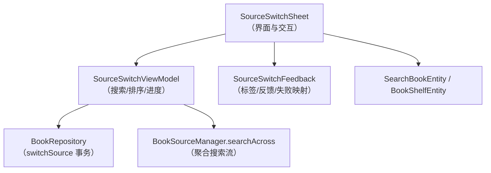
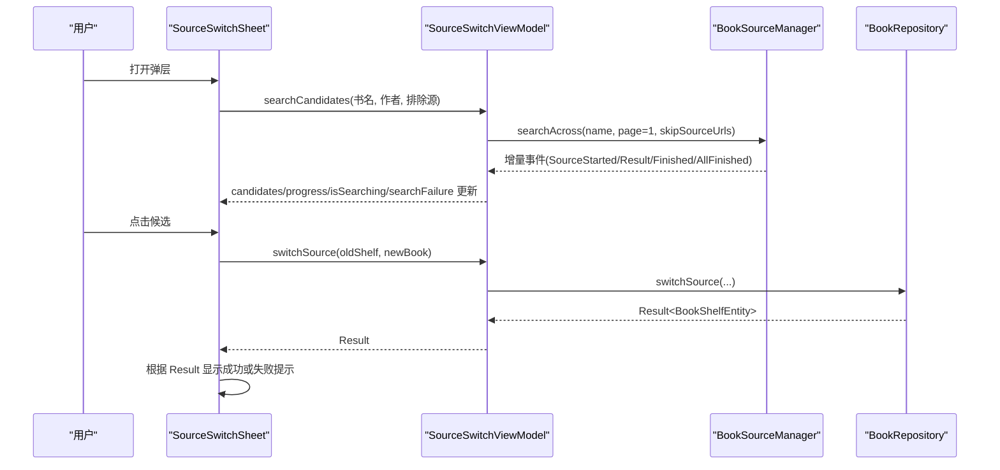
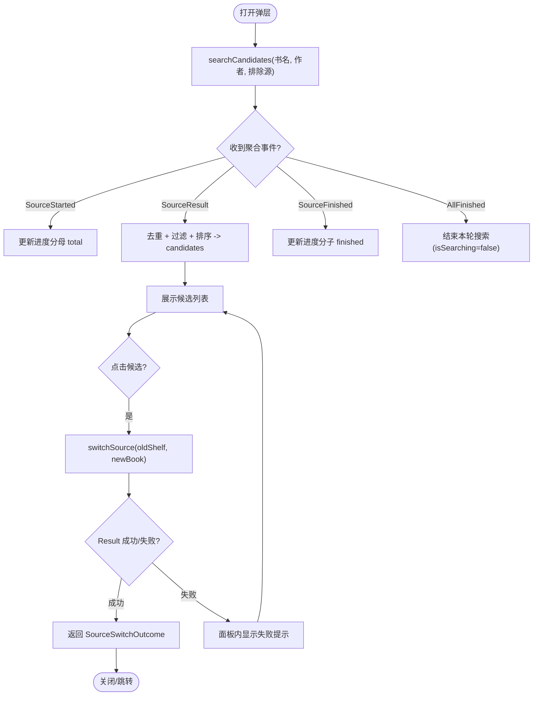
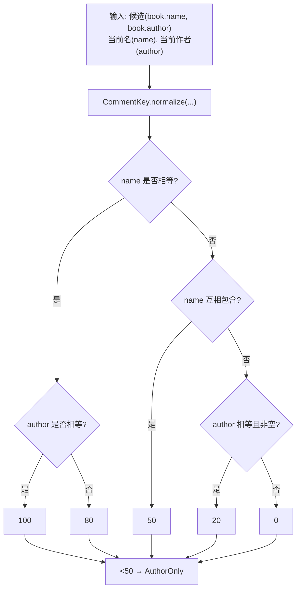
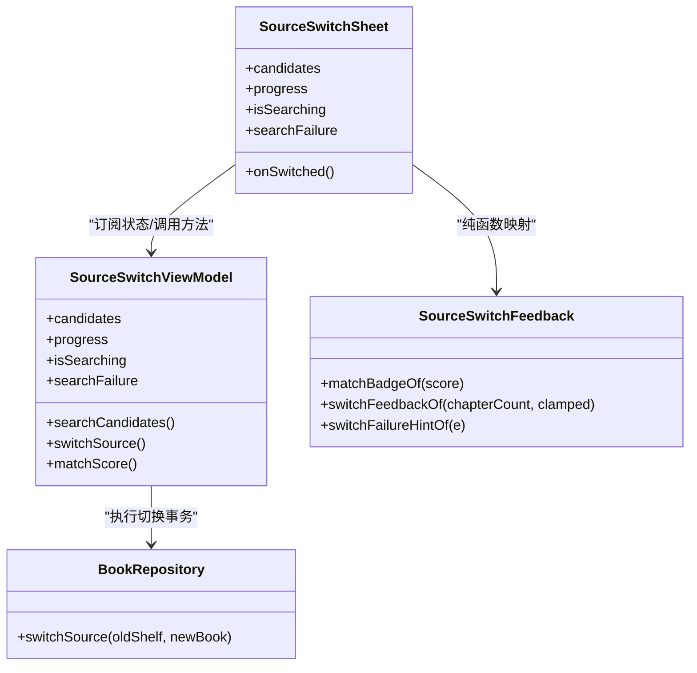

# 书源切换弹层

<cite>
**本文引用的文件**
- [SourceSwitchSheet.kt](file://module_book/src/main/java/com/ebook/book/reader/SourceSwitchSheet.kt)
- [SourceSwitchViewModel.kt](file://module_book/src/main/java/com/ebook/book/mvvm/viewmodel/SourceSwitchViewModel.kt)
- [SourceSwitchFeedback.kt](file://module_book/src/main/java/com/ebook/book/reader/SourceSwitchFeedback.kt)
- [SearchBookEntity.kt](file://lib_ebook_db/src/main/java/com/ebook/db/entity/SearchBookEntity.kt)
- [BookShelfEntity.kt](file://lib_ebook_db/src/main/java/com/ebook/db/entity/BookShelfEntity.kt)
- [BookRepository.kt](file://lib_book_common/src/main/java/com/ebook/common/repository/BookRepository.kt)
- [strings.xml](file://module_book/src/main/res/values/strings.xml)
</cite>

## 目录
1. [简介](#简介)
2. [项目结构](#项目结构)
3. [核心组件](#核心组件)
4. [架构总览](#架构总览)
5. [详细组件分析](#详细组件分析)
6. [依赖关系分析](#依赖关系分析)
7. [性能考量](#性能考量)
8. [故障排查指南](#故障排查指南)
9. [结论](#结论)
10. [附录：扩展与优化示例](#附录：扩展与优化示例)

## 简介
本文件聚焦“阅读中换源”的 SourceSwitchSheet 弹层，系统化阐述其搜索-候选-切换三阶段流程、匹配度标签计算与排序规则、错误提示策略、进度指示器实现，以及与阅读进度的衔接机制。内容基于仓库内实际源码与测试约束进行说明，便于开发与维护人员准确理解并安全扩展。

## 项目结构
SourceSwitchSheet 所在模块为 module_book（阅读器相关），状态与业务编排由同模块的 SourceSwitchViewModel 负责；匹配度标签与失败提示等纯函数逻辑被抽离到 SourceSwitchFeedback 中；数据实体位于 lib_ebook_db；换源事务在 lib_book_common 的 BookRepository 中完成。

**图示来源**
- [SourceSwitchSheet.kt:69-192](file://module_book/src/main/java/com/ebook/book/reader/SourceSwitchSheet.kt#L69-L192)
- [SourceSwitchViewModel.kt:117-237](file://module_book/src/main/java/com/ebook/book/mvvm/viewmodel/SourceSwitchViewModel.kt#L117-L237)
- [BookRepository.kt:292-302](file://lib_book_common/src/main/java/com/ebook/common/repository/BookRepository.kt#L292-L302)
- [SourceSwitchFeedback.kt:19-113](file://module_book/src/main/java/com/ebook/book/reader/SourceSwitchFeedback.kt#L19-L113)

**章节来源**
- [SourceSwitchSheet.kt:69-192](file://module_book/src/main/java/com/ebook/book/reader/SourceSwitchSheet.kt#L69-L192)
- [SourceSwitchViewModel.kt:117-237](file://module_book/src/main/java/com/ebook/book/mvvm/viewmodel/SourceSwitchViewModel.kt#L117-L237)
- [BookRepository.kt:292-302](file://lib_book_common/src/main/java/com/ebook/common/repository/BookRepository.kt#L292-L302)
- [SourceSwitchFeedback.kt:19-113](file://module_book/src/main/java/com/ebook/book/reader/SourceSwitchFeedback.kt#L19-L113)

## 核心组件
- SourceSwitchSheet：ModalBottomSheet 形式的弹层，负责“打开即搜、候选展示、点击切换、失败提示、进度条”。
- SourceSwitchViewModel：封装跨源聚合搜索、候选合并与排序、进度追踪、切换入口调用。
- SourceSwitchFeedback：纯函数映射表，将分数→标签、成功现场→反馈句、异常→提示档。
- 数据模型：SearchBookEntity（搜索结果项）、BookShelfEntity（书架条目）。
- BookRepository：提供 switchSource 事务，处理目标源解析、去重、写库与事件。

**章节来源**
- [SourceSwitchSheet.kt:69-192](file://module_book/src/main/java/com/ebook/book/reader/SourceSwitchSheet.kt#L69-L192)
- [SourceSwitchViewModel.kt:50-237](file://module_book/src/main/java/com/ebook/book/mvvm/viewmodel/SourceSwitchViewModel.kt#L50-L237)
- [SourceSwitchFeedback.kt:19-113](file://module_book/src/main/java/com/ebook/book/reader/SourceSwitchFeedback.kt#L19-L113)
- [SearchBookEntity.kt:6-25](file://lib_ebook_db/src/main/java/com/ebook/db/entity/SearchBookEntity.kt#L6-L25)
- [BookShelfEntity.kt:11-43](file://lib_ebook_db/src/main/java/com/ebook/db/entity/BookShelfEntity.kt#L11-L43)
- [BookRepository.kt:292-302](file://lib_book_common/src/main/java/com/ebook/common/repository/BookRepository.kt#L292-L302)

## 架构总览
SourceSwitchSheet 通过 ViewModel 暴露的 Flow 订阅候选、进度与失败状态；打开时立即发起一轮仅第 1 页的跨源搜索，排除当前书源；候选按匹配度降序呈现；用户点击后执行 switchSource 事务，成功后返回包含新条目与旧进度的结果，用于阅读器衔接。

**图示来源**
- [SourceSwitchSheet.kt:86-187](file://module_book/src/main/java/com/ebook/book/reader/SourceSwitchSheet.kt#L86-L187)
- [SourceSwitchViewModel.kt:117-177](file://module_book/src/main/java/com/ebook/book/mvvm/viewmodel/SourceSwitchViewModel.kt#L117-L177)
- [BookRepository.kt:292-302](file://lib_book_common/src/main/java/com/ebook/common/repository/BookRepository.kt#L292-L302)

## 详细组件分析

### 搜索-候选-切换三阶段流程
- 打开即搜索：进入弹层即调用 searchCandidates，参数为书名、作者与当前书所属源的 URL（用于排除）。只搜第 1 页，避免放大第三方站点请求量。
- 候选列表展示：聚合搜索以事件流形式到达，VM 侧 mergeCandidates 对每个源的结果进行去重与过滤，按 matchScore 降序排列，UI 实时渲染。
- 选源切换执行：用户点击候选后，调用 switchSource 执行事务；成功则返回 SourceSwitchOutcome（含新条目与旧章序号），失败则在面板内显示对应提示并保持弹层以便继续选择。

**图示来源**
- [SourceSwitchSheet.kt:86-187](file://module_book/src/main/java/com/ebook/book/reader/SourceSwitchSheet.kt#L86-L187)
- [SourceSwitchViewModel.kt:117-237](file://module_book/src/main/java/com/ebook/book/mvvm/viewmodel/SourceSwitchViewModel.kt#L117-L237)

**章节来源**
- [SourceSwitchSheet.kt:86-187](file://module_book/src/main/java/com/ebook/book/reader/SourceSwitchSheet.kt#L86-L187)
- [SourceSwitchViewModel.kt:117-237](file://module_book/src/main/java/com/ebook/book/mvvm/viewmodel/SourceSwitchViewModel.kt#L117-L237)

### 匹配度标签计算逻辑
- 五档评分：完全匹配（书名+作者均相等）100 分；书名相同 80 分；书名互相包含 50 分；仅作者相同 20 分；其他 0 分。
- 归一化比较：使用 CommentKey.normalize 后再比对，消除全角空格、繁简混排、书名号等差异。
- 作者非空约束：只有两边归一化后作者均非空才计“作者相同”，避免未知作者泛滥。
- 标签映射：matchBadgeOf(score) 采用区间判断，>=100 为“完全匹配”，>=50 为“部分匹配”，否则“仅作者匹配”。

**图示来源**
- [SourceSwitchViewModel.kt:253-269](file://module_book/src/main/java/com/ebook/book/mvvm/viewmodel/SourceSwitchViewModel.kt#L253-L269)
- [SourceSwitchFeedback.kt:39-43](file://module_book/src/main/java/com/ebook/book/reader/SourceSwitchFeedback.kt#L39-L43)

**章节来源**
- [SourceSwitchViewModel.kt:253-269](file://module_book/src/main/java/com/ebook/book/mvvm/viewmodel/SourceSwitchViewModel.kt#L253-L269)
- [SourceSwitchFeedback.kt:39-43](file://module_book/src/main/java/com/ebook/book/reader/SourceSwitchFeedback.kt#L39-L43)

### 候选列表排序与去重
- 排序规则：每次合并都按整份列表重新按 matchScore 降序排序，保证高分候选能插到队首；稳定排序确保同分者次序可复现。
- 去重机制：以 noteUrl 为键全局去重，避免 Compose key 重复导致的异常；同名不同源的候选保留，因为它们是“换哪个源”的备选。

**章节来源**
- [SourceSwitchViewModel.kt:211-219](file://module_book/src/main/java/com/ebook/book/mvvm/viewmodel/SourceSwitchViewModel.kt#L211-L219)
- [SourceSwitchSheet.kt:226-247](file://module_book/src/main/java/com/ebook/book/reader/SourceSwitchSheet.kt#L226-L247)

### 切换过程中的错误处理与提示
- 目标源失效：BookSourceNotFoundException → 提示“目标书源已失效，请另选一本”。
- 已在书架上：BookAlreadyOnShelfException → 提示“这本书已在书架上，直接去读那一本即可”。
- 网络/解析/写库失败：兜底提示“换源失败，书架上的书未受影响，可换个源再试”。
- 搜索整流出错：searchFailure 携带异常，提示“跨源搜索失败，可关闭面板后重试”。
- 面板行为：失败不关闭弹层，保留候选供用户另选；成功才交由宿主处理。

**章节来源**
- [SourceSwitchFeedback.kt:72-113](file://module_book/src/main/java/com/ebook/book/reader/SourceSwitchFeedback.kt#L72-L113)
- [strings.xml:200-228](file://module_book/src/main/res/values/strings.xml#L200-L228)
- [SourceSwitchSheet.kt:97-106](file://module_book/src/main/java/com/ebook/book/reader/SourceSwitchSheet.kt#L97-L106)

### 进度指示器的实现
- 线性进度条：使用 LinearProgressIndicator，比例来自 CandidateProgress.fraction。
- 统计口径：total 为本轮参与聚合的书源数（收到 SourceStarted 登记），finished 为已结束源数（收到 SourceFinished 登记）；AllFinished 时一次性收尾，isSearching 置 false。
- UI 行为：当还有源未完成时显示进度行；结束后自动收起，不会出现永远差一格的情况。

**章节来源**
- [SourceSwitchSheet.kt:133-136](file://module_book/src/main/java/com/ebook/book/reader/SourceSwitchSheet.kt#L133-L136)
- [SourceSwitchSheet.kt:201-224](file://module_book/src/main/java/com/ebook/book/reader/SourceSwitchSheet.kt#L201-L224)
- [SourceSwitchViewModel.kt:65-81](file://module_book/src/main/java/com/ebook/book/mvvm/viewmodel/SourceSwitchViewModel.kt#L65-L81)
- [SourceSwitchViewModel.kt:221-237](file://module_book/src/main/java/com/ebook/book/mvvm/viewmodel/SourceSwitchViewModel.kt#L221-L237)

### 与阅读进度的衔接机制
- 成功结果：switchSource 返回的新条目包含 durChapter（已映射后的章序号，0 基），同时携带 previousChapter（旧源中的章序号，0 基）。
- 衔接文案：根据 chapterCount 与 clamped 决定提示——目录为空时提示“暂时翻不出正文”；旧进度超出新目录长度时提示“落到最后一章”；否则提示“跳到第 X 章”。
- 实现要点：chapterCount 取新条目内存字段 chapterList.size，无需再查库；clamped 由 previousChapter > chapterCount - 1 判定。

**章节来源**
- [SourceSwitchViewModel.kt:149-177](file://module_book/src/main/java/com/ebook/book/mvvm/viewmodel/SourceSwitchViewModel.kt#L149-L177)
- [SourceSwitchViewModel.kt:288-318](file://module_book/src/main/java/com/ebook/book/mvvm/viewmodel/SourceSwitchViewModel.kt#L288-L318)
- [SourceSwitchFeedback.kt:45-70](file://module_book/src/main/java/com/ebook/book/reader/SourceSwitchFeedback.kt#L45-L70)

## 依赖关系分析
- SourceSwitchSheet 依赖 SourceSwitchViewModel 提供的 Flow 状态与回调；依赖 SourceSwitchFeedback 的纯函数进行标签与提示映射。
- SourceSwitchViewModel 依赖 BookSourceManager 进行跨源搜索，依赖 BookRepository 执行切换事务。
- BookRepository 内部依赖 DAO、BookStore、ChapterReader 等完成写库与清理。

**图示来源**
- [SourceSwitchSheet.kt:69-192](file://module_book/src/main/java/com/ebook/book/reader/SourceSwitchSheet.kt#L69-L192)
- [SourceSwitchViewModel.kt:50-237](file://module_book/src/main/java/com/ebook/book/mvvm/viewmodel/SourceSwitchViewModel.kt#L50-L237)
- [SourceSwitchFeedback.kt:19-113](file://module_book/src/main/java/com/ebook/book/reader/SourceSwitchFeedback.kt#L19-L113)
- [BookRepository.kt:292-302](file://lib_book_common/src/main/java/com/ebook/common/repository/BookRepository.kt#L292-L302)

**章节来源**
- [SourceSwitchSheet.kt:69-192](file://module_book/src/main/java/com/ebook/book/reader/SourceSwitchSheet.kt#L69-L192)
- [SourceSwitchViewModel.kt:50-237](file://module_book/src/main/java/com/ebook/book/mvvm/viewmodel/SourceSwitchViewModel.kt#L50-L237)
- [SourceSwitchFeedback.kt:19-113](file://module_book/src/main/java/com/ebook/book/reader/SourceSwitchFeedback.kt#L19-L113)
- [BookRepository.kt:292-302](file://lib_book_common/src/main/java/com/ebook/common/repository/BookRepository.kt#L292-L302)

## 性能考量
- 搜索范围控制：仅搜索第 1 页，避免过多第三方请求；并发上限由 searchAcross 管理，保持礼貌度。
- 去重与排序：按 noteUrl 去重减少冗余；每次合并都整体排序保证“最像的那本”始终靠前，稳定排序提升可复现性。
- 进度收敛：AllFinished 作为本轮结束判据，避免因某源内部协程取消导致 Finished 计数不一致而卡住进度。
- UI 响应：pendingUrl 闸门防止并发切换造成事务交错；失败不关弹层减少重复操作。

[本节为通用指导，不直接分析具体文件]

## 故障排查指南
- 目标书源失效：检查 BookSourceNotFoundException 触发路径，确认目标 tag 有效；提示“目标书源已失效，请另选一本”。
- 已在书架上：检查 BookAlreadyOnShelfException，避免 REPLACE 已有进度；提示“这本书已在书架上，直接去读那一本即可”。
- 搜索失败：关注 searchFailure 流，整条聚合流异常才会出现；提示“跨源搜索失败，可关闭面板后重试”。
- 网络/解析/写库失败：兜底提示“换源失败，书架上的书未受影响，可换个源再试”；日志定位根因。
- 进度不消失：确认 AllFinished 是否到达；若某源被取消可能不发 Finished，finishRound 会补齐 doneSources 并收尾。

**章节来源**
- [SourceSwitchFeedback.kt:72-113](file://module_book/src/main/java/com/ebook/book/reader/SourceSwitchFeedback.kt#L72-L113)
- [strings.xml:200-228](file://module_book/src/main/res/values/strings.xml#L200-L228)
- [SourceSwitchSheet.kt:97-106](file://module_book/src/main/java/com/ebook/book/reader/SourceSwitchSheet.kt#L97-L106)
- [SourceSwitchViewModel.kt:221-237](file://module_book/src/main/java/com/ebook/book/mvvm/viewmodel/SourceSwitchViewModel.kt#L221-L237)

## 结论
SourceSwitchSheet 以“打开即搜、候选降序、点击切换”为核心流程，配合精确的匹配度打分与稳定的排序、去重机制，保证用户在多书源环境下快速找到合适来源；错误处理与进度指示提供了清晰的用户反馈；与阅读进度的衔接通过 SourceSwitchOutcome 统一封装，使提示文案与跳转逻辑一致可靠。整体设计遵循 MVVM 与模块化约定，便于扩展与维护。

[本节为总结性内容，不直接分析具体文件]

## 附录：扩展与优化示例

### 如何扩展匹配算法
- 在 matchScore 中新增评分分支，例如引入标题相似度、关键词命中权重等；保持归一化比较与作者非空约束。
- 同步调整 matchBadgeOf 的区间映射，避免新分数落入弱标签档导致误导。
- 建议为新增分支补充单元测试，覆盖边界值与相邻档位落点。

**章节来源**
- [SourceSwitchViewModel.kt:253-269](file://module_book/src/main/java/com/ebook/book/mvvm/viewmodel/SourceSwitchViewModel.kt#L253-L269)
- [SourceSwitchFeedback.kt:39-43](file://module_book/src/main/java/com/ebook/book/reader/SourceSwitchFeedback.kt#L39-L43)

### 如何新增错误类型
- 定义新的异常类型或在 switchFailureHintOf 中增加分支，将其映射到合适的 SwitchFailureHint。
- 在 strings.xml 中补充对应提示文案，并在 SourceSwitchSheet 中穷尽 when 分支以保证编译期覆盖。
- 建议在测试中覆盖该异常类型的提示映射，避免文案漂移。

**章节来源**
- [SourceSwitchFeedback.kt:72-113](file://module_book/src/main/java/com/ebook/book/reader/SourceSwitchFeedback.kt#L72-L113)
- [strings.xml:200-228](file://module_book/src/main/res/values/strings.xml#L200-L228)
- [SourceSwitchSheet.kt:97-106](file://module_book/src/main/java/com/ebook/book/reader/SourceSwitchSheet.kt#L97-L106)

### 如何优化搜索性能
- 限制搜索页数（当前为第 1 页），避免放大第三方站点压力。
- 利用 noteUrl 去重减少重复项，降低排序开销。
- 合理设置并发上限（由 searchAcross 管理），保持对第三方站点的礼貌度。
- 在 mergeCandidates 中尽早过滤低分项，减少后续排序成本。

**章节来源**
- [SourceSwitchViewModel.kt:117-129](file://module_book/src/main/java/com/ebook/book/mvvm/viewmodel/SourceSwitchViewModel.kt#L117-L129)
- [SourceSwitchViewModel.kt:211-219](file://module_book/src/main/java/com/ebook/book/mvvm/viewmodel/SourceSwitchViewModel.kt#L211-L219)