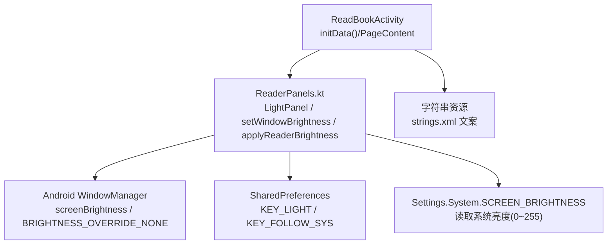
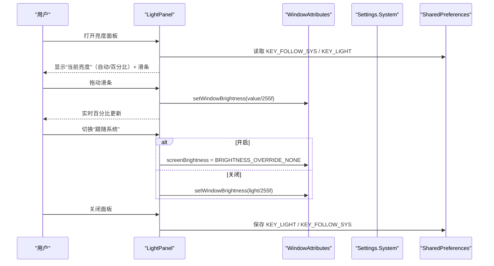
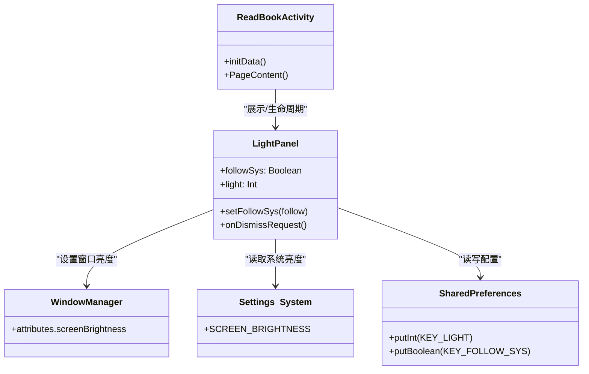

# 亮度调节面板

<cite>
**本文引用的文件**
- [ReaderPanels.kt](file://module_book/src/main/java/com/ebook/book/reader/ReaderPanels.kt)
- [ReadBookActivity.kt](file://module_book/src/main/java/com/ebook/book/ReadBookActivity.kt)
- [strings.xml](file://module_book/src/main/res/values/strings.xml)
</cite>

## 目录
1. [简介](#简介)
2. [项目结构](#项目结构)
3. [核心组件](#核心组件)
4. [架构总览](#架构总览)
5. [详细组件分析](#详细组件分析)
6. [依赖关系分析](#依赖关系分析)
7. [性能与实时性](#性能与实时性)
8. [故障排查](#故障排查)
9. [结论](#结论)
10. [附录：扩展指南](#附录：扩展指南)

## 简介
本章节聚焦阅读器的“亮度调节面板”（LightPanel），围绕以下目标展开：
- 双模式设计：跟随系统亮度 vs 手动亮度调节。
- 窗口亮度控制机制：WindowManager.LayoutParams.screenBrightness 的设置方式、0~255 亮度值换算为 0~1 浮点的逻辑。
- 跟随系统开关的实现：BRIGHTNESS_OVERRIDE_NONE 的使用，立即应用或恢复系统亮度的时机。
- 数值显示实时性：拖动滑条时百分比实时更新；跟随系统时显示“自动”。
- 持久化存储策略：SharedPreferences 的键名约定、读写时机。
- 面板与 Activity 生命周期的绑定：进入阅读器恢复手动亮度、关闭面板时保存配置。
- 扩展建议：如何扩展亮度档位、添加亮度记忆、处理系统亮度权限问题。

## 项目结构
亮度面板位于阅读器的 Compose UI 层，与底栏入口联动，由 ReadBookActivity 编排生命周期与状态：
- ReaderPanels.kt：实现 LightPanel、亮度滑条、跟随系统开关、SP 读写、窗口亮度设置/恢复等全部逻辑。
- ReadBookActivity.kt：在 initData() 中调用 applyReaderBrightness() 恢复上次手动亮度；提供 panel 切换并承载 LightPanel。
- strings.xml：面板文案（当前亮度、自动、百分比格式、跟随系统说明等）。

图表来源
- [ReadBookActivity.kt:149-154](file://module_book/src/main/java/com/ebook/book/ReadBookActivity.kt#L149-L154)
- [ReadBookActivity.kt:904-909](file://module_book/src/main/java/com/ebook/book/ReadBookActivity.kt#L904-L909)
- [ReaderPanels.kt:1303-1412](file://module_book/src/main/java/com/ebook/book/reader/ReaderPanels.kt#L1303-L1412)
- [ReaderPanels.kt:1414-1456](file://module_book/src/main/java/com/ebook/book/reader/ReaderPanels.kt#L1414-L1456)
- [strings.xml:82-102](file://module_book/src/main/res/values/strings.xml#L82-L102)

小节来源
- [ReadBookActivity.kt:149-154](file://module_book/src/main/java/com/ebook/book/ReadBookActivity.kt#L149-L154)
- [ReadBookActivity.kt:904-909](file://module_book/src/main/java/com/ebook/book/ReadBookActivity.kt#L904-L909)
- [ReaderPanels.kt:1303-1412](file://module_book/src/main/java/com/ebook/book/reader/ReaderPanels.kt#L1303-L1412)
- [ReaderPanels.kt:1414-1456](file://module_book/src/main/java/com/ebook/book/reader/ReaderPanels.kt#L1414-L1456)
- [strings.xml:82-102](file://module_book/src/main/res/values/strings.xml#L82-L102)

## 核心组件
- LightPanel（亮度面板）：ModalBottomSheet 形式的底部面板，包含“当前亮度”行、滑条（0~255）、跟随系统开关。
- 滑条 ReaderSlider：自绘滑条，拖动实时回调 onValueChange，抬手触发 onValueChangeFinished（亮度面板用于即时写窗口亮度）。
- 窗口亮度工具：setWindowBrightness(activity, value) 将 0~255 转为 0~1 写入 window attributes；applyReaderBrightness(activity) 在进入阅读器时恢复上次手动亮度。
- 系统亮度读取：getSystemBrightness(context) 读取 Settings.System.SCREEN_BRIGHTNESS（0~255），异常兜底为 0。
- 持久化：LIGHT_SP_NAME="CONFIG"，KEY_LIGHT="light"，KEY_FOLLOW_SYS="is_follow_sys"；面板关闭时保存 light 与 followSys。

小节来源
- [ReaderPanels.kt:1303-1412](file://module_book/src/main/java/com/ebook/book/reader/ReaderPanels.kt#L1303-L1412)
- [ReaderPanels.kt:1414-1456](file://module_book/src/main/java/com/ebook/book/reader/ReaderPanels.kt#L1414-L1456)

## 架构总览
亮度面板采用“组合式 UI + 本地状态 + 系统 API + SP 持久化”的轻量架构：
- UI 层：LightPanel 持有 followSys 与 light 两个状态，驱动滑条、文本、开关。
- 控制层：setFollowSys(follow) 统一入口，勾选恢复系统亮度，取消勾选立即应用当前 light。
- 系统层：通过 Window.attributes.screenBrightness 设置窗口亮度，使用 BRIGHTNESS_OVERRIDE_NONE 表示跟随系统。
- 持久化：面板关闭时写回 SP；应用启动时在 ReadBookActivity.initData() 中恢复手动亮度。

图表来源
- [ReaderPanels.kt:1303-1412](file://module_book/src/main/java/com/ebook/book/reader/ReaderPanels.kt#L1303-L1412)
- [ReaderPanels.kt:1419-1439](file://module_book/src/main/java/com/ebook/book/reader/ReaderPanels.kt#L1419-L1439)

## 详细组件分析

### LightPanel 双模式设计
- 跟随系统：followSys=true 时，面板显示“自动”，滑条禁用（enabled=false），实际窗口亮度设为 BRIGHTNESS_OVERRIDE_NONE。
- 手动调节：followSys=false 时，滑条启用，0~255 范围，拖动时立即通过 setWindowBrightness 应用到窗口。
- 切换入口唯一：setFollowSys(follow) 同时维护状态与窗口亮度，避免“开关与窗口不一致”的问题。

小节来源
- [ReaderPanels.kt:1303-1412](file://module_book/src/main/java/com/ebook/book/reader/ReaderPanels.kt#L1303-L1412)

### 窗口亮度控制机制
- 设置窗口亮度：setWindowBrightness(activity, value) 将 0~255 转换为 0~1 浮点写入 Window.attributes.screenBrightness。
- 跟随系统：BRIGHTNESS_OVERRIDE_NONE 表示交由系统管理亮度，不覆盖系统设定。
- 读取系统亮度：getSystemBrightness(context) 从 Settings.System.SCREEN_BRIGHTNESS 读取 0~255 的值，异常时返回 0。

小节来源
- [ReaderPanels.kt:1419-1439](file://module_book/src/main/java/com/ebook/book/reader/ReaderPanels.kt#L1419-L1439)

### 跟随系统开关的实现与时机
- 开启“跟随系统”：立即把 window.screenBrightness 设置为 BRIGHTNESS_OVERRIDE_NONE，立刻生效。
- 关闭“跟随系统”：立即应用当前 light 值到窗口，避免“关开关后屏幕仍保持原状，需再拖滑条才生效”的错位。
- 面板关闭：保存 KEY_LIGHT 与 KEY_FOLLOW_SYS 到 SharedPreferences。

小节来源
- [ReaderPanels.kt:1303-1412](file://module_book/src/main/java/com/ebook/book/reader/ReaderPanels.kt#L1303-L1412)

### 数值显示的实时性
- 拖动滑条：onValueChange 回调内更新 local light 变量并立即写窗口亮度，UI 重组显示新的百分比。
- 跟随系统：显示“自动”，颜色弱化为次要色，明确表达不可调。
- 百分比格式化：使用字符串资源 reader_brightness_percent_format 显示 %d%%。

小节来源
- [ReaderPanels.kt:1349-1394](file://module_book/src/main/java/com/ebook/book/reader/ReaderPanels.kt#L1349-L1394)
- [strings.xml:82-102](file://module_book/src/main/res/values/strings.xml#L82-L102)

### 持久化存储策略
- 存储位置：SharedPreferences，文件名 LIGHT_SP_NAME="CONFIG"。
- 键名约定：
  - KEY_LIGHT="light"：记录上一次手动亮度（0~255）。
  - KEY_FOLLOW_SYS="is_follow_sys"：是否跟随系统。
- 读时机：面板初始化时读取，作为初始状态；应用启动时 ReadBookActivity.initData() 调用 applyReaderBrightness 恢复手动亮度。
- 写时机：面板关闭时一次性保存 KEY_LIGHT 与 KEY_FOLLOW_SYS。

小节来源
- [ReaderPanels.kt:1414-1456](file://module_book/src/main/java/com/ebook/book/reader/ReaderPanels.kt#L1414-L1456)
- [ReadBookActivity.kt:149-154](file://module_book/src/main/java/com/ebook/book/ReadBookActivity.kt#L149-L154)

### 面板与 Activity 生命周期的绑定
- 进入阅读器：ReadBookActivity.initData() 调用 applyReaderBrightness(this)，若上次未跟随系统则恢复手动亮度。
- 面板展示：ReadBookActivity.PageContent() 根据 panel 状态渲染 LightPanel，传入 activity 供面板操作窗口亮度。
- 退出/关闭：LightPanel.onDismissRequest 保存 SP，回到 NONE 隐藏面板。

小节来源
- [ReadBookActivity.kt:149-154](file://module_book/src/main/java/com/ebook/book/ReadBookActivity.kt#L149-L154)
- [ReadBookActivity.kt:904-909](file://module_book/src/main/java/com/ebook/book/ReadBookActivity.kt#L904-L909)
- [ReaderPanels.kt:1325-1333](file://module_book/src/main/java/com/ebook/book/reader/ReaderPanels.kt#L1325-L1333)

## 依赖关系分析
- LightPanel 依赖 AndroidX Compose UI（状态、动画、控件）。
- 依赖 Android WindowManager 与 Settings.System 获取/设置亮度。
- 依赖 SharedPreferences 持久化配置。
- 依赖 ReadBookActivity 的生命周期钩子进行恢复与展示。

图表来源
- [ReaderPanels.kt:1303-1412](file://module_book/src/main/java/com/ebook/book/reader/ReaderPanels.kt#L1303-L1412)
- [ReaderPanels.kt:1414-1456](file://module_book/src/main/java/com/ebook/book/reader/ReaderPanels.kt#L1414-L1456)
- [ReadBookActivity.kt:149-154](file://module_book/src/main/java/com/ebook/book/ReadBookActivity.kt#L149-L154)

小节来源
- [ReaderPanels.kt:1303-1412](file://module_book/src/main/java/com/ebook/book/reader/ReaderPanels.kt#L1303-L1412)
- [ReaderPanels.kt:1414-1456](file://module_book/src/main/java/com/ebook/book/reader/ReaderPanels.kt#L1414-L1456)
- [ReadBookActivity.kt:149-154](file://module_book/src/main/java/com/ebook/book/ReadBookActivity.kt#L149-L154)

## 性能与实时性
- 滑条拖动实时性：onValueChange 直接写窗口亮度，无额外节流；对于亮度调节而言这是合理选择，因为亮度变化开销较小且能提升跟手体验。
- 数值刷新：light 为 Compose 状态，拖动时每次更新都会触发重组以显示新百分比，符合预期。
- 面板关闭写入 SP：仅在 onDismissRequest 时写一次，避免频繁 IO。
- 首帧恢复：ReadBookActivity.initData() 中恢复手动亮度，保证冷启动一致体验。

[本节为通用性能讨论，不直接分析具体代码片段]

## 故障排查
- 跟随系统无效：确认 setFollowSys(true) 已将 window.screenBrightness 设为 BRIGHTNESS_OVERRIDE_NONE。
- 手动亮度不生效：检查 setWindowBrightness(value/255f) 是否正确赋值，以及是否在面板关闭时保存了 KEY_LIGHT。
- 系统亮度读取失败：getSystemBrightness 捕获 SettingNotFoundException 并返回 0，属正常兜底。
- 权限问题：本项目未申请系统亮度相关运行时权限；若未来需要修改系统全局亮度（非窗口级），需按 Android 规范申请对应权限并在 Manifest 声明。

小节来源
- [ReaderPanels.kt:1419-1439](file://module_book/src/main/java/com/ebook/book/reader/ReaderPanels.kt#L1419-L1439)
- [ReaderPanels.kt:1303-1412](file://module_book/src/main/java/com/ebook/book/reader/ReaderPanels.kt#L1303-L1412)

## 结论
亮度面板通过简洁的双模式设计（跟随系统/手动调节），结合窗口级亮度控制与 SP 持久化，实现了稳定、可预期的阅读体验。其关键优势包括：
- 立即反馈：拖动滑条即时应用，开关切换即时生效。
- 状态一致：遵循单一事实源（local state），避免 UI 与窗口状态漂移。
- 生命周期友好：进入阅读器恢复上次手动亮度，关闭面板保存配置。
- 易扩展：基于 0~255 映射与 SP 键约定，便于扩展档位与记忆功能。

[本节为总结，不直接分析具体代码片段]

## 附录：扩展指南

### 扩展亮度档位
- 方案一：固定档位选择器
  - 在 LightPanel 中新增一组 RadioButton 选项，预设若干亮度值（如 30、60、100、150、200）。
  - 选择档位后调用 setWindowBrightness(activity, selectedValue)。
  - 在 SP 中新增键 KEY_PRESET_INDEX 记录选中档位。
- 方案二：保留滑条但增加“快速步进”按钮
  - 在滑条两侧增加“+/-”按钮，步进步长可配置（如 ±10）。
  - 点击后更新 light 并调用 setWindowBrightness。

示例路径参考
- [ReaderPanels.kt:1303-1412](file://module_book/src/main/java/com/ebook/book/reader/ReaderPanels.kt#L1303-L1412)
- [ReaderPanels.kt:1414-1456](file://module_book/src/main/java/com/ebook/book/reader/ReaderPanels.kt#L1414-L1456)

### 添加亮度记忆功能
- 记忆最近一次手动亮度：已在 SP 中实现 KEY_LIGHT，面板关闭时保存，应用启动时恢复。
- 增强记忆维度：可按书籍 tag/URL 记录独立亮度，新增键如 KEY_LIGHT_BY_BOOK_{bookKey}。
- 切换书源或书籍时，优先读取该书的专属亮度；若无则回退到通用 KEY_LIGHT。

示例路径参考
- [ReaderPanels.kt:1414-1456](file://module_book/src/main/java/com/ebook/book/reader/ReaderPanels.kt#L1414-L1456)
- [ReadBookActivity.kt:149-154](file://module_book/src/main/java/com/ebook/book/ReadBookActivity.kt#L149-L154)

### 处理系统亮度权限问题
- 当前实现仅设置当前窗口亮度，无需运行时权限。
- 若未来需要读取或修改系统全局亮度（Settings.System.SCREEN_BRIGHTNESS），需在清单中声明相应权限，并在运行时请求授权。
- 建议在 getSystemBrightness 与 setSystemBrightness 周围加入权限检查与提示，确保用户体验。

示例路径参考
- [ReaderPanels.kt:1419-1439](file://module_book/src/main/java/com/ebook/book/reader/ReaderPanels.kt#L1419-L1439)