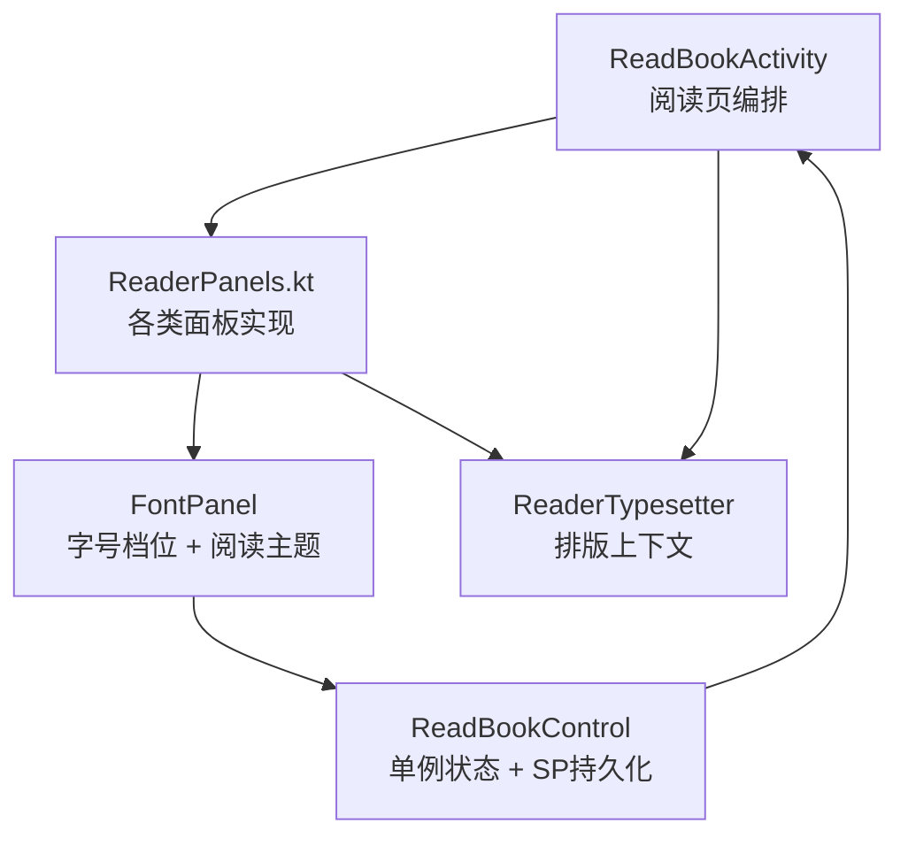
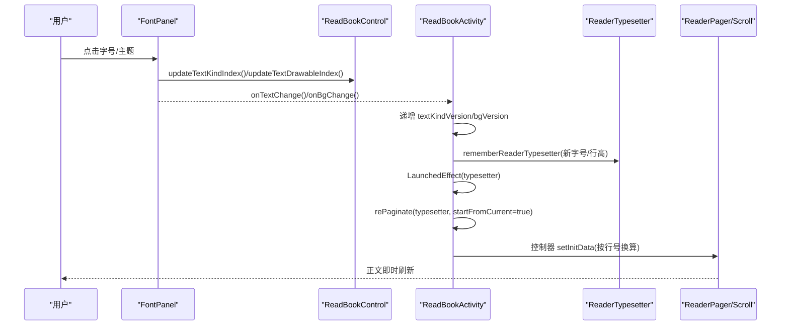
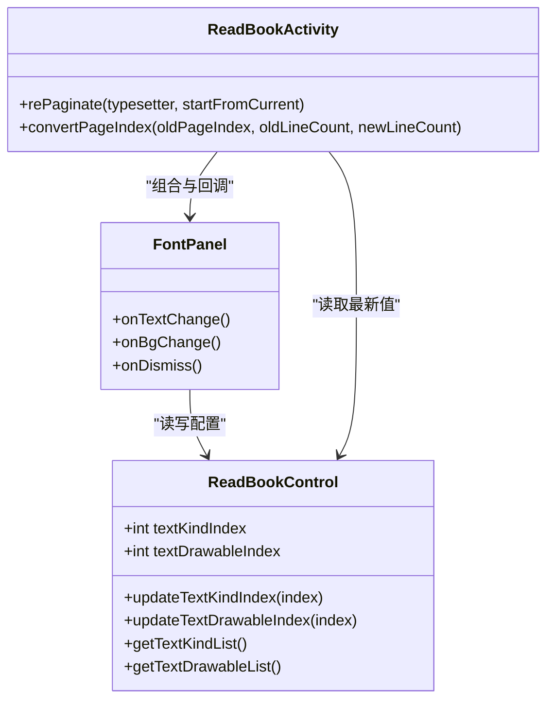

# 字体调节面板

<cite>
**本文引用的文件**
- [ReaderPanels.kt](file://module_book/src/main/java/com/ebook/book/reader/ReaderPanels.kt)
- [ReadBookControl.kt](file://module_book/src/main/java/com/ebook/book/view/ReadBookControl.kt)
- [ReadBookActivity.kt](file://module_book/src/main/java/com/ebook/book/ReadBookActivity.kt)
- [strings.xml](file://module_book/src/main/res/values/strings.xml)
</cite>

## 目录
1. [简介](#简介)
2. [项目结构](#项目结构)
3. [核心组件](#核心组件)
4. [架构总览](#架构总览)
5. [详细组件分析](#详细组件分析)
6. [依赖关系分析](#依赖关系分析)
7. [性能考量](#性能考量)
8. [故障排查指南](#故障排查指南)
9. [结论](#结论)
10. [附录：扩展与优化示例](#附录扩展与优化示例)

## 简介
本章节聚焦阅读器的“字体调节面板”（FontPanel），围绕两组设置进行完整说明：
- 字号档位选择：采用 8 档等宽数字胶囊，替代原有的 A-/数值/A+ 四件套。
- 阅读主题选择：以“背景纸片 + 正文预览字 + 主题名”的色卡形式呈现，选中态使用主色描边。

同时说明字体变更如何即时生效、默认字号恢复逻辑、以及字体设置与系统字体的优先级关系。最后给出新增字体档位、扩展主题类型、优化切换性能的实践指引。

## 项目结构
字体调节面板位于阅读器 chrome 层的面板集合中，由 ReadBookActivity 作为入口组织各面板；面板内数据来源于单例 ReadBookControl，并在用户操作后触发重分页。

图表来源
- [ReaderPanels.kt:1458-1558](file://module_book/src/main/java/com/ebook/book/reader/ReaderPanels.kt#L1458-L1558)
- [ReadBookControl.kt:1-157](file://module_book/src/main/java/com/ebook/book/view/ReadBookControl.kt#L1-L157)
- [ReadBookActivity.kt:459-664](file://module_book/src/main/java/com/ebook/book/ReadBookActivity.kt#L459-L664)

章节来源
- [ReaderPanels.kt:1458-1558](file://module_book/src/main/java/com/ebook/book/reader/ReaderPanels.kt#L1458-L1558)
- [ReadBookControl.kt:1-157](file://module_book/src/main/java/com/ebook/book/view/ReadBookControl.kt#L1-L157)
- [ReadBookActivity.kt:459-664](file://module_book/src/main/java/com/ebook/book/ReadBookActivity.kt#L459-L664)

## 核心组件
- FontPanel：字号档位与阅读主题的选择面板，提供本地镜像状态并同步写回 ReadBookControl。
- ReadBookControl：内存缓存 + SP 持久化的单例，维护当前字号、段距、主题颜色、翻页方式等配置。
- ReadBookActivity：组合页面布局与面板，监听 typesetter 变化触发重分页，保证样式变更后立即生效。

章节来源
- [ReaderPanels.kt:1458-1558](file://module_book/src/main/java/com/ebook/book/reader/ReaderPanels.kt#L1458-L1558)
- [ReadBookControl.kt:1-157](file://module_book/src/main/java/com/ebook/book/view/ReadBookControl.kt#L1-L157)
- [ReadBookActivity.kt:459-664](file://module_book/src/main/java/com/ebook/book/ReadBookActivity.kt#L459-L664)

## 架构总览
字体调节面板的工作流如下：用户在 FontPanel 中选择字号或主题 → 更新 ReadBookControl 对应索引 → 回调通知 ReadBookActivity → Activity 通过版本号驱动重组并读取新的 typesetter → LaunchedEffect(typesetter) 触发 rePaginate → 重新测算行数并分页 → 正文立即刷新。

图表来源
- [ReaderPanels.kt:1475-1558](file://module_book/src/main/java/com/ebook/book/reader/ReaderPanels.kt#L1475-L1558)
- [ReadBookControl.kt:119-133](file://module_book/src/main/java/com/ebook/book/view/ReadBookControl.kt#L119-L133)
- [ReadBookActivity.kt:468-483](file://module_book/src/main/java/com/ebook/book/ReadBookActivity.kt#L468-L483)
- [ReadBookActivity.kt:659-664](file://module_book/src/main/java/com/ebook/book/ReadBookActivity.kt#L659-L664)

## 详细组件分析

### 字号档位：8 档等宽数字胶囊设计
- 设计动机：
  - 原实现为“A-/数值/A+”四件套，存在“默认按钮与步进按钮混在同一行”的语义层级混乱问题，且需要多次点击才能跨档调整。
  - 改为 8 档等宽数字胶囊一排，既展示全量可选值又支持直达选择，恢复默认动作降级到标题行右侧次级位置。
- 每档尺寸：
  - 字号与段距由 ReadBookControl 中的 TextKind 列表定义，共 8 档，包含字号 sp 与段距 px（例如 14sp/6.5dp 段距 至 30sp/21dp 段距）。
- 交互细节：
  - 每个胶囊固定高度 34dp，选中态使用主色底与 onPrimary 文字，未选中态使用 surfaceVariant。
  - 点击后调用 ReadBookControl.updateTextKindIndex(index)，并通过 onTextChange 回调通知 Activity 递增版本号触发重组与重分页。

章节来源
- [ReaderPanels.kt:1458-1558](file://module_book/src/main/java/com/ebook/book/reader/ReaderPanels.kt#L1458-L1558)
- [ReadBookControl.kt:31-41](file://module_book/src/main/java/com/ebook/book/view/ReadBookControl.kt#L31-L41)
- [strings.xml:45-46](file://module_book/src/main/res/values/strings.xml#L45-L46)

### 阅读主题：可视化预览与选中态
- 可视化预览：
  - 每个主题色卡以“背景纸片 + 正文预览字 + 主题名”的形式呈现。预览字取自主题自身配色（TextDrawable.textColor），画在纸上，属于阅读背景主题层。
  - 名称来自字符串资源（theme_paper/theme_sepia/theme_green/theme_dark），便于多语言与可读性。
- 选中态描边：
  - 选中时 2dp 主色描边 + 主题名转主色；未选中时 1dp outlineVariant 弱描边，确保近白色主题仍有可辨边界。
  - 描边颜色使用当前调板的 outlineVariant，避免深色面板上夜间色卡整块融进背景的问题。
- 交互细节：
  - 点击色卡后调用 ReadBookControl.updateTextDrawableIndex(index)，并通过 onBgChange 回调通知 Activity 递增 bgVersion，进而刷新状态栏颜色与正文背景。

章节来源
- [ReaderPanels.kt:1592-1645](file://module_book/src/main/java/com/ebook/book/reader/ReaderPanels.kt#L1592-L1645)
- [ReadBookControl.kt:43-49](file://module_book/src/main/java/com/ebook/book/view/ReadBookControl.kt#L43-L49)
- [strings.xml:96-101](file://module_book/src/main/res/values/strings.xml#L96-L101)

### 即时生效机制：单例状态与重分页
- 单例状态：
  - ReadBookControl 持有 textKindIndex/textDrawableIndex 等属性，并提供 updateTextKindIndex/updateTextDrawableIndex 方法写入内存并落盘 SP。
- 触发重组与重分页：
  - FontPanel 在更新 ReadBookControl 后回调 onTextChange/onBgChange，ReadBookActivity 递增版本号（textKindVersion/bgVersion）触发重组。
  - 重组时根据新字号/行高创建新的 ReaderTypesetter，LaunchedEffect(typesetter) 捕获变化并调用 rePaginate，完成“测算行数→切分章节→渲染”。
- 模式切换时的落点换算：
  - 换模式（左右翻页/上下滚屏）会改变 pageLineCount，Activity 通过 convertPageIndex 按行号换算落点，确保两种模式下读者所处位置一致。

章节来源
- [ReadBookControl.kt:72-113](file://module_book/src/main/java/com/ebook/book/view/ReadBookControl.kt#L72-L113)
- [ReadBookActivity.kt:468-483](file://module_book/src/main/java/com/ebook/book/ReadBookActivity.kt#L468-L483)
- [ReadBookActivity.kt:659-664](file://module_book/src/main/java/com/ebook/book/ReadBookActivity.kt#L659-L664)
- [ReadBookActivity.kt:275-290](file://module_book/src/main/java/com/ebook/book/ReadBookActivity.kt#L275-L290)

### 默认字号恢复逻辑：已处于默认档时禁用恢复按钮
- 恢复按钮：
  - 位于字体面板标题行右侧，调用 ReadBookControl.updateTextKindIndex(DEFAULT_TEXT) 并同步本地状态与回调。
- 禁用条件：
  - enabled = (textKindIndex != DEFAULT_TEXT)。当已处于默认档时按钮不可用，避免“点了没反应”的错觉。
- 默认值：
  - DEFAULT_TEXT 为 2，对应 8 档列表的第 3 档（索引从 0 开始）。

章节来源
- [ReaderPanels.kt:1495-1510](file://module_book/src/main/java/com/ebook/book/reader/ReaderPanels.kt#L1495-L1510)
- [ReadBookControl.kt:15-18](file://module_book/src/main/java/com/ebook/book/view/ReadBookControl.kt#L15-L18)

### 字体设置与系统字体的优先级关系
- 应用内阅读字号：
  - 由 ReadBookControl.textSize/sp 决定，经过 readerTextPaint 使用 TypedValue.applyDimension(sp, density) 换算 px，确保与 Compose 正文一致。
- 系统字体缩放：
  - 字号存储为 sp，随系统字体缩放比例影响最终 px 大小；因此系统字体缩放仍会影响阅读字号，但阅读主题背景色不受深浅色切换影响。
- 优先级：
  - 阅读背景主题（纸张色）由 ReadBookControl 显式提供，不随外观主题深浅色切换；chrome 层（面板/顶栏/底栏）则继承全局主题，随深浅色解析。

章节来源
- [ReadBookActivity.kt:433-454](file://module_book/src/main/java/com/ebook/book/ReadBookActivity.kt#L433-L454)
- [ReadBookActivity.kt:423-430](file://module_book/src/main/java/com/ebook/book/ReadBookActivity.kt#L423-L430)

## 依赖关系分析
- FontPanel 依赖 ReadBookControl 提供的 TextKind/TextDrawable 列表与更新接口。
- ReadBookActivity 组合面板，并通过版本号与 typesetter 的变化驱动重组与重分页。
- strings.xml 提供面板文案与主题名称，保证国际化与一致性。

图表来源
- [ReadBookControl.kt:72-157](file://module_book/src/main/java/com/ebook/book/view/ReadBookControl.kt#L72-L157)
- [ReaderPanels.kt:1475-1558](file://module_book/src/main/java/com/ebook/book/reader/ReaderPanels.kt#L1475-L1558)
- [ReadBookActivity.kt:251-290](file://module_book/src/main/java/com/ebook/book/ReadBookActivity.kt#L251-L290)

章节来源
- [ReadBookControl.kt:72-157](file://module_book/src/main/java/com/ebook/book/view/ReadBookControl.kt#L72-L157)
- [ReaderPanels.kt:1475-1558](file://module_book/src/main/java/com/ebook/book/reader/ReaderPanels.kt#L1475-L1558)
- [ReadBookActivity.kt:251-290](file://module_book/src/main/java/com/ebook/book/ReadBookActivity.kt#L251-L290)

## 性能考量
- 字号变更代价：
  - 每次字号变化都会触发全文重组与重分页，因此采用离散步进（点选）而非滑条拖动，避免频繁回调导致卡顿。
- 测量与缓存：
  - ReaderTypesetter.lineStartOffsets 会对整章内容做 O(N) 测量，配合 ChapterLayoutCache 按“章节+字号+宽度”粒度缓存偏移，减少重复计算。
- 面板 UI 优化：
  - 面板内部使用本地状态镜像 ReadBookControl，减少不必要的重组；持久化走 SPUtil 异步写入，避免阻塞 UI。
- 主题切换：
  - 主题色卡仅更新背景与前景色，不涉及文本度量，因此对重分页的影响较小；但仍需刷新状态栏颜色与正文背景。

章节来源
- [ReaderPanels.kt:1458-1472](file://module_book/src/main/java/com/ebook/book/reader/ReaderPanels.kt#L1458-L1472)
- [ReadBookActivity.kt:468-483](file://module_book/src/main/java/com/ebook/book/ReadBookActivity.kt#L468-L483)

## 故障排查指南
- 字体变更后未生效：
  - 检查是否调用了 onTextChange/onBgChange 并递增版本号；确认 RePaginate 被 LaunchedEffect(typesetter) 触发。
- 默认按钮无效：
  - 确认当前 textKindIndex 是否为 DEFAULT_TEXT；若已是默认档，按钮应禁用。
- 主题色卡显示异常：
  - 检查 TextDrawable 的背景与前景颜色是否正确；确认描边使用 outlineVariant 而非主题自身前景色。

章节来源
- [ReaderPanels.kt:1495-1510](file://module_book/src/main/java/com/ebook/book/reader/ReaderPanels.kt#L1495-L1510)
- [ReaderPanels.kt:1592-1645](file://module_book/src/main/java/com/ebook/book/reader/ReaderPanels.kt#L1592-L1645)
- [ReadBookActivity.kt:659-664](file://module_book/src/main/java/com/ebook/book/ReadBookActivity.kt#L659-L664)

## 结论
字体调节面板通过 8 档等宽数字胶囊与“背景纸片 + 正文预览字”的主题色卡，提供了直观、高效的阅读体验。单例状态与版本号驱动的重组机制确保了字体变更的即时生效，而默认恢复按钮的禁用逻辑提升了交互确定性。未来可通过新增档位、扩展主题类型与优化缓存策略进一步提升性能与可维护性。

## 附录：扩展与优化示例

### 新增字体档位
- 步骤：
  - 在 ReadBookControl.textKindList 中添加新的 TextKind（包含字号 sp 与段距 px）。
  - 保持 DEFAULT_TEXT 不变，确保升级兼容。
  - 无需改动面板布局，8 档会自动等宽排布。
- 注意事项：
  - 新增档位应遵循渐进式字号增长，避免跳跃过大影响阅读连续性。
  - 如需调整默认档，修改 DEFAULT_TEXT 并考虑老用户迁移。

章节来源
- [ReadBookControl.kt:31-41](file://module_book/src/main/java/com/ebook/book/view/ReadBookControl.kt#L31-L41)
- [ReaderPanels.kt:1514-1532](file://module_book/src/main/java/com/ebook/book/reader/ReaderPanels.kt#L1514-L1532)

### 扩展主题类型
- 步骤：
  - 在 ReadBookControl.textDrawableList 中添加新的 TextDrawable（包含前景色、背景色、字符串资源）。
  - 在 strings.xml 中补充主题名称资源。
  - 色卡将自动渲染为“背景纸片 + 预览字 + 主题名”。
- 注意事项：
  - 预览字颜色应与背景对比度足够，确保可读性。
  - 描边使用 outlineVariant，避免深色/浅色面板下视觉融合问题。

章节来源
- [ReadBookControl.kt:43-49](file://module_book/src/main/java/com/ebook/book/view/ReadBookControl.kt#L43-L49)
- [strings.xml:96-101](file://module_book/src/main/res/values/strings.xml#L96-L101)
- [ReaderPanels.kt:1592-1645](file://module_book/src/main/java/com/ebook/book/reader/ReaderPanels.kt#L1592-L1645)

### 优化字体切换性能
- 措施：
  - 使用 ChapterLayoutCache 按“章节+字号+宽度”缓存 lineStartOffsets，减少重复测量。
  - 在面板中使用本地状态镜像 ReadBookControl，避免频繁重组。
  - 持久化操作使用 SPUtil 异步写入，避免阻塞 UI。
- 验证：
  - 观察字体切换后的重分页次数与耗时，确保无抖动或卡顿。

章节来源
- [ReadBookActivity.kt:320-333](file://module_book/src/main/java/com/ebook/book/ReadBookActivity.kt#L320-L333)
- [ReaderPanels.kt:1480-1487](file://module_book/src/main/java/com/ebook/book/reader/ReaderPanels.kt#L1480-L1487)