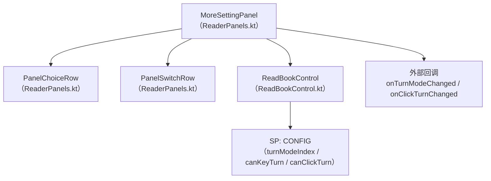
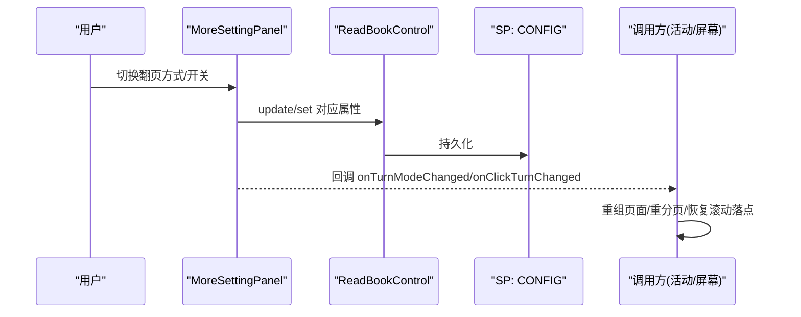
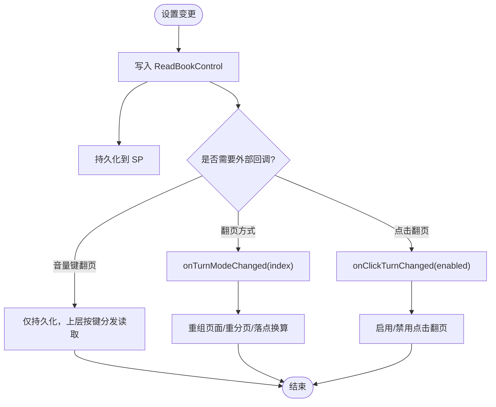
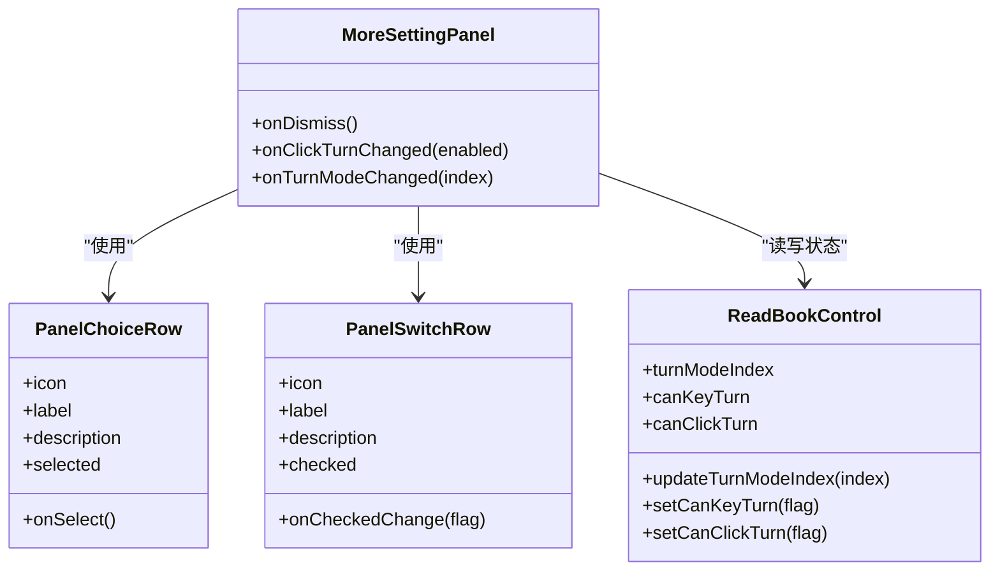

# 更多设置面板

<cite>
**本文引用的文件**
- [ReaderPanels.kt](file://module_book/src/main/java/com/ebook/book/reader/ReaderPanels.kt)
- [ReadBookControl.kt](file://module_book/src/main/java/com/ebook/book/view/ReadBookControl.kt)
- [ReaderTurnModeRowRenderTest.kt](file://module_book/src/test/java/com/ebook/book/reader/ReaderTurnModeRowRenderTest.kt)
- [2026-09-13-reader-scroll-mode-design.md](file://docs/superpowers/specs/2026-09-13-reader-scroll-mode-design.md)
</cite>

## 目录
1. [简介](#简介)
2. [项目结构](#项目结构)
3. [核心组件](#核心组件)
4. [架构总览](#架构总览)
5. [详细组件分析](#详细组件分析)
6. [依赖关系分析](#依赖关系分析)
7. [性能考量](#性能考量)
8. [故障排查指南](#故障排查指南)
9. [结论](#结论)
10. [附录：新增设置项与扩充分组卡片](#附录新增设置项与扩充分组卡片)

## 简介
本文聚焦“更多设置面板”（MoreSettingPanel），系统化说明其两类设置分组：
- 翻页方式选择（互斥单选）：左右翻页 vs 上下滚屏
- 按键翻页开关（独立开关）：音量键翻页、点击翻页

同时解释 PanelChoiceRow 与 PanelSwitchRow 的统一设计规范，阐述设置变更的即时生效机制（ReadBookControl 状态同步与外部回调重分页），并给出如何扩充分组卡片、新增设置项与校验设置的实践指引。最后梳理设置面板与其他面板（亮度、字体、目录等）的协作关系。

## 项目结构
- 阅读器 UI 面板集中位于 module_book 的 reader 包中，MoreSettingPanel 及其行组件 PanelChoiceRow、PanelSwitchRow 均在 ReaderPanels.kt 内实现。
- 设置状态由 ReadBookControl 单例管理，负责内存缓存与 SharedPreferences 持久化。
- 设计规格与实现决策见 specs/2026-09-13-reader-scroll-mode-design.md；渲染回归测试见 ReaderTurnModeRowRenderTest.kt。

图表来源
- [ReaderPanels.kt:1663-1754](file://module_book/src/main/java/com/ebook/book/reader/ReaderPanels.kt#L1663-L1754)
- [ReadBookControl.kt:15-157](file://module_book/src/main/java/com/ebook/book/view/ReadBookControl.kt#L15-L157)

章节来源
- [ReaderPanels.kt:128-183](file://module_book/src/main/java/com/ebook/book/reader/ReaderPanels.kt#L128-L183)
- [ReadBookControl.kt:51-157](file://module_book/src/main/java/com/ebook/book/view/ReadBookControl.kt#L51-L157)
- [2026-09-13-reader-scroll-mode-design.md:13-57](file://docs/superpowers/specs/2026-09-13-reader-scroll-mode-design.md#L13-L57)

## 核心组件
- MoreSettingPanel：承载“翻页方式选择”和“按键翻页开关”两个分组卡片，提供 onDismiss、onClickTurnChanged、onTurnModeChanged 回调。
- PanelChoiceRow：36dp 彩色图标块 + 标题/说明 + RadioButton 尾部控件，用于互斥二选一场景（翻页方式）。
- PanelSwitchRow：36dp 彩色图标块 + 标题/说明 + Switch 尾部控件，用于独立开/关场景（音量键翻页、点击翻页）。
- ReadBookControl：统一持有 turnModeIndex、canKeyTurn、canClickTurn，读写 SP，并提供更新方法。

章节来源
- [ReaderPanels.kt:1180-1287](file://module_book/src/main/java/com/ebook/book/reader/ReaderPanels.kt#L1180-L1287)
- [ReaderPanels.kt:1663-1754](file://module_book/src/main/java/com/ebook/book/reader/ReaderPanels.kt#L1663-L1754)
- [ReadBookControl.kt:51-157](file://module_book/src/main/java/com/ebook/book/view/ReadBookControl.kt#L51-L157)

## 架构总览
MoreSettingPanel 通过 Compose 状态镜像 ReadBookControl 的值，用户交互时立即写入 ReadBookControl 并通过回调通知上层进行重分页或状态刷新。翻页方式属于全局设置（按应用维度持久化），按键翻页开关为独立的布尔开关，三者均持久化到同一 SP 文件。

图表来源
- [ReaderPanels.kt:1663-1754](file://module_book/src/main/java/com/ebook/book/reader/ReaderPanels.kt#L1663-L1754)
- [ReadBookControl.kt:95-157](file://module_book/src/main/java/com/ebook/book/view/ReadBookControl.kt#L95-L157)

## 详细组件分析

### 翻页方式选择（互斥单选）
- 两种模式：
  - 左右翻页：三页窗口 + 横向拖拽，适合习惯“一页一翻”的用户，尤其在看漫画、图文混排或需要清晰分屏的场景。
  - 上下滚屏：整章屏块的竖向连续滚动，适合长文阅读、快速浏览、手指自然滚动的阅读习惯。
- 视觉语言：PanelChoiceRow 使用 36dp 彩色图标块 + 标题/说明 + RadioButton，选中态不可再次点击，确保互斥语义明确。
- 数据流：选择某一项后，立即写入 ReadBookControl.turnModeIndex，并触发 onTurnModeChanged(index)，由上层完成重分页与落点换算。

章节来源
- [ReaderPanels.kt:1233-1287](file://module_book/src/main/java/com/ebook/book/reader/ReaderPanels.kt#L1233-L1287)
- [ReaderPanels.kt:1663-1754](file://module_book/src/main/java/com/ebook/book/reader/ReaderPanels.kt#L1663-L1754)
- [ReadBookControl.kt:51-93](file://module_book/src/main/java/com/ebook/book/view/ReadBookControl.kt#L51-L93)
- [2026-09-13-reader-scroll-mode-design.md:58-78](file://docs/superpowers/specs/2026-09-13-reader-scroll-mode-design.md#L58-L78)

### 按键翻页开关（独立开关）
- 音量键翻页：控制是否允许通过音量上/下键翻页（在翻页模式下是上一页/下一页；在滚屏模式下是上滚/下滚一屏）。
- 点击翻页：控制正文左右两侧点击是否翻页（中间区域唤出菜单），在滚屏模式下点击左右侧会滚动一屏。
- 行为：每个开关独立控制，互不影响；写入 ReadBookControl 后立即持久化，无需外部回调也能保持状态一致。

章节来源
- [ReaderPanels.kt:1180-1231](file://module_book/src/main/java/com/ebook/book/reader/ReaderPanels.kt#L1180-L1231)
- [ReaderPanels.kt:1663-1754](file://module_book/src/main/java/com/ebook/book/reader/ReaderPanels.kt#L1663-L1754)
- [ReadBookControl.kt:135-143](file://module_book/src/main/java/com/ebook/book/view/ReadBookControl.kt#L135-L143)
- [2026-09-13-reader-scroll-mode-design.md:237-249](file://docs/superpowers/specs/2026-09-13-reader-scroll-mode-design.md#L237-L249)

### 统一设计规范：PanelChoiceRow 与 PanelSwitchRow
- 图标块：36dp 圆角色块，承载 20dp 图标，颜色来自 colorScheme 容器色，保证深浅主题自适应。
- 标题与说明：标题为主文案，说明用于交代作用范围（如“按音量键翻页”“轻触正文两侧翻页”），提升可理解性。
- 尾部控件：PanelChoiceRow 使用 RadioButton 表达互斥选择；PanelSwitchRow 使用 Switch 表达独立开关。
- 整行可点：除已选中行外，点击任意位置均可触发切换，保证触摸目标充足且状态同步。
- 分割线缩进：以 switchDividerIndent = switchRowPadding + iconBox + iconGap 对齐，避免与通用列表分割线混淆。

章节来源
- [ReaderPanels.kt:142-161](file://module_book/src/main/java/com/ebook/book/reader/ReaderPanels.kt#L142-L161)
- [ReaderPanels.kt:1180-1287](file://module_book/src/main/java/com/ebook/book/reader/ReaderPanels.kt#L1180-L1287)

### 设置变更的即时生效机制
- 翻页方式：写入 ReadBookControl.turnModeIndex → 回调 onTurnModeChanged(index) → 上层重组页面并按新视口重新分页，必要时按行号换算落点，保证切换后读者仍在相近位置。
- 点击翻页开关：写入 ReadBookControl.canClickTurn → 回调 onClickTurnChanged(enabled) → 上层根据当前模式禁用/启用点击翻页逻辑。
- 音量键翻页：写入 ReadBookControl.canKeyTurn → 上层按键分发逻辑读取该状态决定是否翻页。

图表来源
- [ReaderPanels.kt:1663-1754](file://module_book/src/main/java/com/ebook/book/reader/ReaderPanels.kt#L1663-L1754)
- [ReadBookControl.kt:95-157](file://module_book/src/main/java/com/ebook/book/view/ReadBookControl.kt#L95-L157)
- [2026-09-13-reader-scroll-mode-design.md:183-199](file://docs/superpowers/specs/2026-09-13-reader-scroll-mode-design.md#L183-L199)

## 依赖关系分析
- MoreSettingPanel 依赖 PanelChoiceRow、PanelSwitchRow 以及 ReadBookControl。
- ReadBookControl 依赖 SPUtil 进行持久化，并提供统一的更新接口。
- 测试用例 ReaderTurnModeRowRenderTest 直接渲染 PanelChoiceRow 以验证颜色随调板变化。

图表来源
- [ReaderPanels.kt:1180-1287](file://module_book/src/main/java/com/ebook/book/reader/ReaderPanels.kt#L1180-L1287)
- [ReaderPanels.kt:1663-1754](file://module_book/src/main/java/com/ebook/book/reader/ReaderPanels.kt#L1663-L1754)
- [ReadBookControl.kt:51-157](file://module_book/src/main/java/com/ebook/book/view/ReadBookControl.kt#L51-L157)

章节来源
- [ReaderTurnModeRowRenderTest.kt:25-85](file://module_book/src/test/java/com/ebook/book/reader/ReaderTurnModeRowRenderTest.kt#L25-L85)

## 性能考量
- 设置面板使用 ModalBottomSheet，关闭时持久化配置，避免频繁 I/O。
- ReadBookControl 采用内存缓存 + SP 持久化的策略，减少重复读取。
- 翻页方式切换后，按新视口重新计算 pageLineCount 再换算落点，避免在回调中立刻重算导致尺寸未就绪的问题。

章节来源
- [ReadBookControl.kt:9-15](file://module_book/src/main/java/com/ebook/book/view/ReadBookControl.kt#L9-L15)
- [2026-09-13-reader-scroll-mode-design.md:183-199](file://docs/superpowers/specs/2026-09-13-reader-scroll-mode-design.md#L183-L199)

## 故障排查指南
- 切换翻页方式无效：确认已调用 onTurnModeChanged 并触发上层重组；检查 ReadBookControl.updateTurnModeIndex 是否被调用。
- 点击翻页不生效：检查 canClickTurn 是否被正确设置；确认上层点击分发逻辑是否正确读取该状态。
- 音量键翻页不生效：检查 canKeyTurn 是否开启；确认上层 onKeyDown/onKeyUp 是否将按键事件分发给控制器。
- 颜色主题异常：PanelChoiceRow 的图标块底色应来自 colorScheme 容器色；可用 ReaderTurnModeRowRenderTest 的探针色断言验证。

章节来源
- [ReaderTurnModeRowRenderTest.kt:69-115](file://module_book/src/test/java/com/ebook/book/reader/ReaderTurnModeRowRenderTest.kt#L69-L115)
- [ReaderPanels.kt:1663-1754](file://module_book/src/main/java/com/ebook/book/reader/ReaderPanels.kt#L1663-L1754)
- [ReadBookControl.kt:135-149](file://module_book/src/main/java/com/ebook/book/view/ReadBookControl.kt#L135-L149)

## 结论
MoreSettingPanel 以统一的视觉语言与清晰的交互模型，提供了翻页方式选择与按键翻页开关两大能力。通过 ReadBookControl 的单例状态管理与即时回调机制，设置变更能够迅速反映到阅读器行为与界面布局上，保证用户体验的一致性与流畅性。

## 附录：新增设置项与扩充分组卡片
- 新增设置项步骤：
  - 在 ReadBookControl 中添加新的属性与更新方法（含越界保护与持久化）。
  - 在 MoreSettingPanel 中新增对应的 PanelChoiceRow 或 PanelSwitchRow，并绑定回调。
  - 如需分组卡片，复用 CommonCard 并在内部追加行项，注意分割线缩进与间距保持一致。
- 验证设置合法性：
  - 对索引类设置（如翻页方式）做越界判断，越界回落到默认值。
  - 对布尔类设置（如开关）直接写入，确保状态与持久化一致。
- 与其他面板协调：
  - 设置变更后，调用上层回调以触发重分页或状态刷新。
  - 与亮度、字体面板共用相同的卡片与行组件语言，保持整体风格一致。

章节来源
- [ReadBookControl.kt:95-157](file://module_book/src/main/java/com/ebook/book/view/ReadBookControl.kt#L95-L157)
- [ReaderPanels.kt:1663-1754](file://module_book/src/main/java/com/ebook/book/reader/ReaderPanels.kt#L1663-L1754)
- [2026-09-13-reader-scroll-mode-design.md:201-235](file://docs/superpowers/specs/2026-09-13-reader-scroll-mode-design.md#L201-L235)