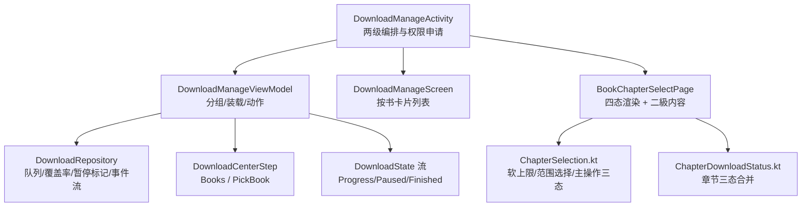
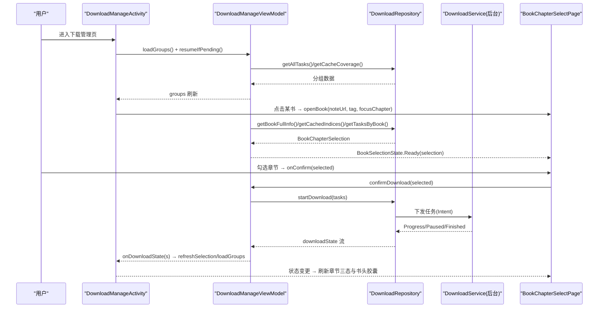
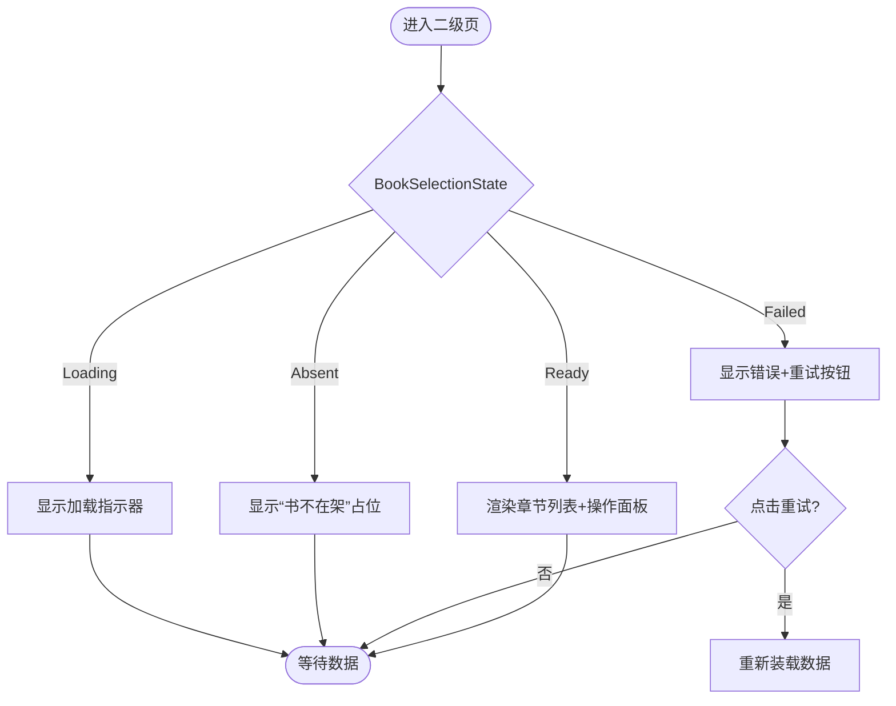
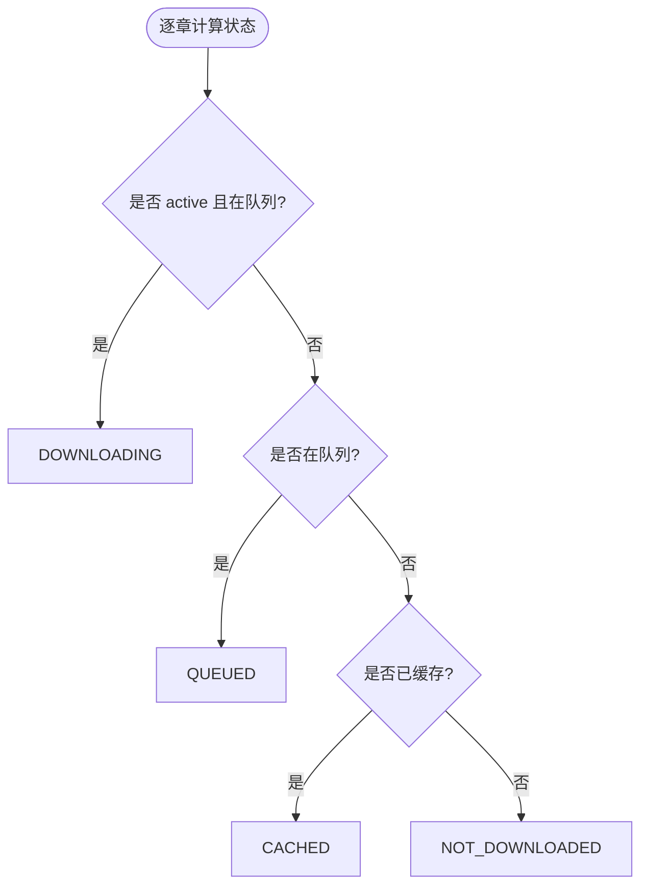
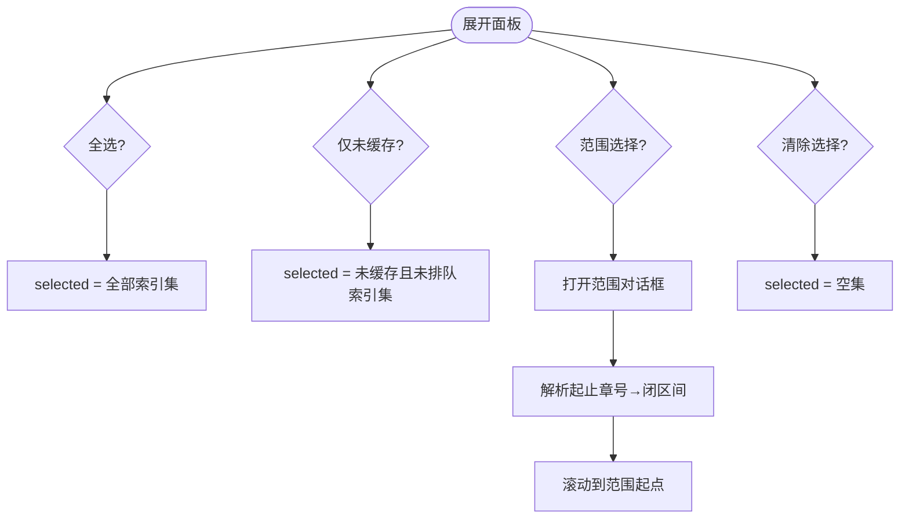
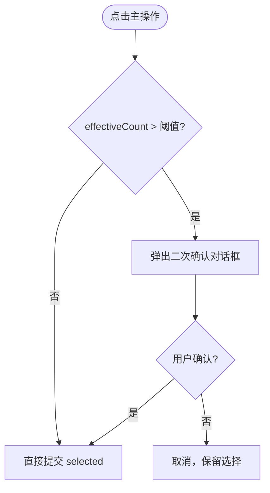
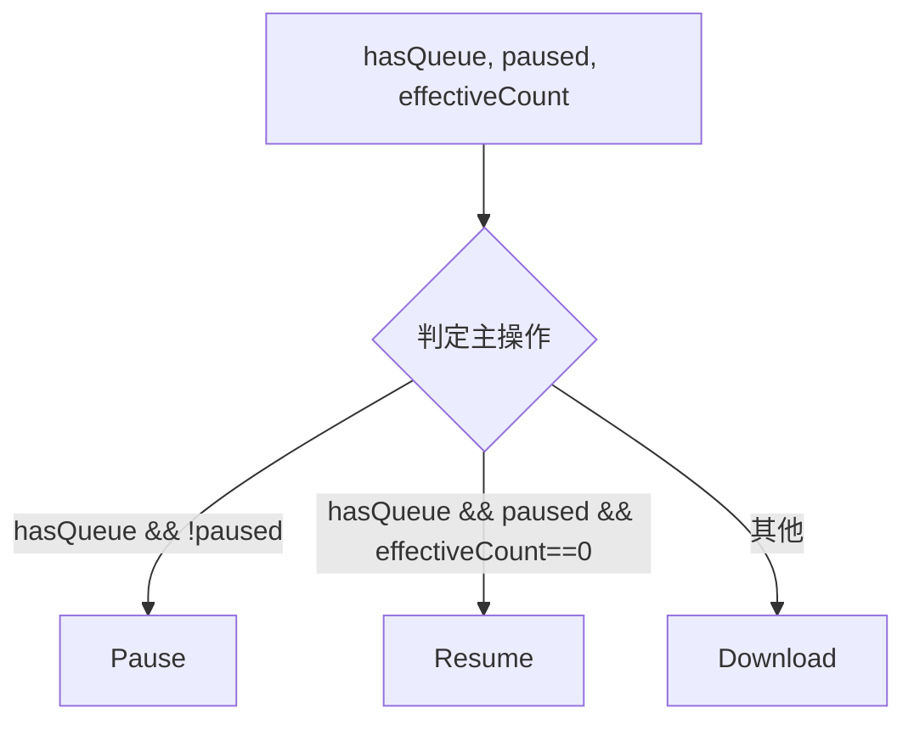
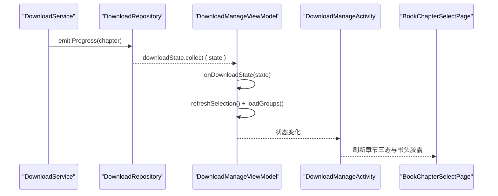
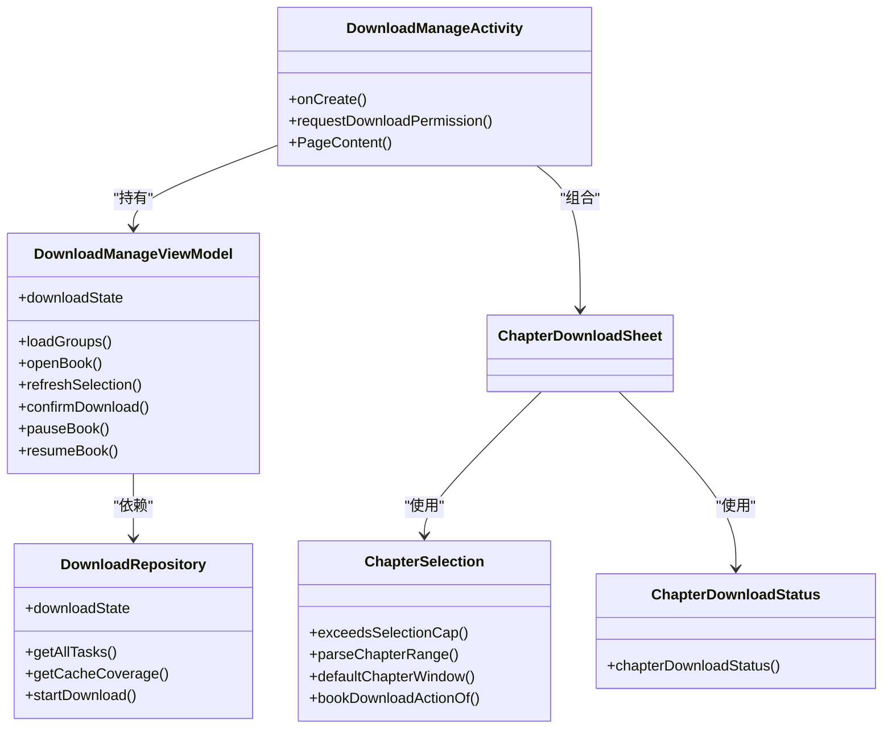

# 章节下载管理页

<cite>
**本文引用的文件**
- [DownloadManageActivity.kt](file://module_book/src/main/java/com/ebook/book/DownloadManageActivity.kt)
- [ChapterDownloadSheet.kt](file://module_book/src/main/java/com/ebook/book/reader/ChapterDownloadSheet.kt)
- [ChapterSelection.kt](file://module_book/src/main/java/com/ebook/book/reader/ChapterSelection.kt)
- [ChapterDownloadStatus.kt](file://module_book/src/main/java/com/ebook/book/reader/ChapterDownloadStatus.kt)
- [DownloadManageViewModel.kt](file://module_book/src/main/java/com/ebook/book/mvvm/viewmodel/DownloadManageViewModel.kt)
- [DownloadRepository.kt](file://module_book/src/main/java/com/ebook/book/repository/DownloadRepository.kt)
</cite>

## 目录
1. [简介](#简介)
2. [项目结构](#项目结构)
3. [核心组件](#核心组件)
4. [架构总览](#架构总览)
5. [详细组件分析](#详细组件分析)
6. [依赖关系分析](#依赖关系分析)
7. [性能考量](#性能考量)
8. [故障排查指南](#故障排查指南)
9. [结论](#结论)

## 简介
本章节聚焦“章节下载管理页”的完整实现与交互设计，覆盖二级选章页 BookChapterSelectPage 的四态渲染、章节列表三态显示、批量勾选工具、软上限保护、书头操作列三态切换，以及与阅读进度的同步机制。文档同时给出扩展点：如何新增下载状态类型、如何新增批量操作工具、如何处理下载队列管理与进度同步。

## 项目结构
下载管理页由两级页面组成：一级按书任务列表（DownloadManageScreen），二级为某书的全章节“状态 + 选章”整屏页（BookChapterSelectPage）。ViewModel 负责数据聚合与状态流转发，Repository 负责数据库与服务事件通道。

图表来源
- [DownloadManageActivity.kt:149-239](file://module_book/src/main/java/com/ebook/book/DownloadManageActivity.kt#L149-L239)
- [DownloadManageViewModel.kt:55-106](file://module_book/src/main/java/com/ebook/book/mvvm/viewmodel/DownloadManageViewModel.kt#L55-L106)
- [DownloadManageViewModel.kt:168-198](file://module_book/src/main/java/com/ebook/book/mvvm/viewmodel/DownloadManageViewModel.kt#L168-L198)
- [ChapterDownloadSheet.kt:152-180](file://module_book/src/main/java/com/ebook/book/reader/ChapterDownloadSheet.kt#L152-L180)
- [ChapterSelection.kt:17-21](file://module_book/src/main/java/com/ebook/book/reader/ChapterSelection.kt#L17-L21)
- [ChapterDownloadStatus.kt:1-26](file://module_book/src/main/java/com/ebook/book/reader/ChapterDownloadStatus.kt#L1-L26)

章节来源
- [DownloadManageActivity.kt:103-139](file://module_book/src/main/java/com/ebook/book/DownloadManageActivity.kt#L103-L139)
- [DownloadManageActivity.kt:149-239](file://module_book/src/main/java/com/ebook/book/DownloadManageActivity.kt#L149-L239)
- [DownloadManageViewModel.kt:121-155](file://module_book/src/main/java/com/ebook/book/mvvm/viewmodel/DownloadManageViewModel.kt#L121-L155)

## 核心组件
- DownloadManageActivity：入口 Activity，承载两级页面切换、返回语义、通知权限申请、打开二级直达逻辑。
- DownloadManageViewModel：聚合下载分组、处理服务状态流、执行下载控制动作、装载二级选章数据。
- BookChapterSelectPage：二级页四态渲染（加载中/书不在架/失败/就绪）并组合章节列表与操作面板。
- ChapterSelection.kt：纯逻辑——软上限、范围选择、默认窗口、书头主操作三态判定。
- ChapterDownloadStatus.kt：章节三态合并（已缓存/待下载/下载中）。
- DownloadRepository：下载任务 CRUD、覆盖率计算、暂停标记、下载状态事件流。

章节来源
- [DownloadManageActivity.kt:149-239](file://module_book/src/main/java/com/ebook/book/DownloadManageActivity.kt#L149-L239)
- [DownloadManageViewModel.kt:121-155](file://module_book/src/main/java/com/ebook/book/mvvm/viewmodel/DownloadManageViewModel.kt#L121-L155)
- [ChapterDownloadSheet.kt:152-180](file://module_book/src/main/java/com/ebook/book/reader/ChapterDownloadSheet.kt#L152-L180)
- [ChapterSelection.kt:70-99](file://module_book/src/main/java/com/ebook/book/reader/ChapterSelection.kt#L70-L99)
- [ChapterDownloadStatus.kt:1-26](file://module_book/src/main/java/com/ebook/book/reader/ChapterDownloadStatus.kt#L1-L26)
- [DownloadRepository.kt:44-61](file://module_book/src/main/java/com/ebook/book/repository/DownloadRepository.kt#L44-L61)

## 架构总览
下载管理采用 MVVM + Flow 响应式架构：Activity 持有 ViewModel，ViewModel 通过 Repository 查询数据库与服务事件流，UI 以 Compose 状态驱动渲染。二级页在“就绪”态下渲染章节列表与操作面板；其余三态使用居中占位视图。

图表来源
- [DownloadManageActivity.kt:166-186](file://module_book/src/main/java/com/ebook/book/DownloadManageActivity.kt#L166-L186)
- [DownloadManageViewModel.kt:290-362](file://module_book/src/main/java/com/ebook/book/mvvm/viewmodel/DownloadManageViewModel.kt#L290-L362)
- [DownloadManageViewModel.kt:400-429](file://module_book/src/main/java/com/ebook/book/mvvm/viewmodel/DownloadManageViewModel.kt#L400-L429)
- [DownloadRepository.kt:55-61](file://module_book/src/main/java/com/ebook/book/repository/DownloadRepository.kt#L55-L61)

## 详细组件分析

### BookChapterSelectPage 四态渲染
- 加载中：展示加载指示器，无文案或弱化提示，避免“正在加载”文字带来的进度歧义。
- 书不在架：展示弱化图标与说明文案，适合从一级入口进入但该书已被移除书架的场景。
- 失败：展示错误图标与文案，并提供重试按钮，避免用户找不到重试入口。
- 就绪：渲染章节列表与操作面板，复用章节三态与软上限逻辑。

图表来源
- [ChapterDownloadSheet.kt:152-180](file://module_book/src/main/java/com/ebook/book/reader/ChapterDownloadSheet.kt#L152-L180)
- [ChapterDownloadSheet.kt:187-229](file://module_book/src/main/java/com/ebook/book/reader/ChapterDownloadSheet.kt#L187-L229)

章节来源
- [ChapterDownloadSheet.kt:152-180](file://module_book/src/main/java/com/ebook/book/reader/ChapterDownloadSheet.kt#L152-L180)

### 章节列表三态显示
- 已缓存：表示本地已有可离线读取的内容，标签为“已缓存”。
- 待下载：表示未缓存且未入队，标签为空（或待下载标识，视 UI 配置）。
- 下载中：当前活跃下载的章节，若同时在队列内则高亮为“下载中”，否则降级为普通队列/未下载。

图表来源
- [ChapterDownloadStatus.kt:6-26](file://module_book/src/main/java/com/ebook/book/reader/ChapterDownloadStatus.kt#L6-L26)

章节来源
- [ChapterDownloadSheet.kt:267-274](file://module_book/src/main/java/com/ebook/book/reader/ChapterDownloadSheet.kt#L267-L274)
- [ChapterDownloadStatus.kt:1-26](file://module_book/src/main/java/com/ebook/book/reader/ChapterDownloadStatus.kt#L1-L26)

### 批量勾选功能
四个工具按钮位于右下浮窗：
- 全选：选中全部章节索引。
- 仅未缓存：选中既未缓存又未排队的章节。
- 范围选择：输入起止章号，解析为闭区间索引并滚动到起点，便于预览与微调。
- 清除选择：清空当前勾选集合。

图表来源
- [ChapterDownloadSheet.kt:573-625](file://module_book/src/main/java/com/ebook/book/reader/ChapterDownloadSheet.kt#L573-L625)
- [ChapterDownloadSheet.kt:822-883](file://module_book/src/main/java/com/ebook/book/reader/ChapterDownloadSheet.kt#L822-L883)
- [ChapterSelection.kt:31-37](file://module_book/src/main/java/com/ebook/book/reader/ChapterSelection.kt#L31-L37)

章节来源
- [ChapterDownloadSheet.kt:245-552](file://module_book/src/main/java/com/ebook/book/reader/ChapterDownloadSheet.kt#L245-L552)
- [ChapterSelection.kt:31-37](file://module_book/src/main/java/com/ebook/book/reader/ChapterSelection.kt#L31-L37)

### 软上限保护机制
- 单次下载软上限为固定常量（超过阈值触发二次确认）。
- 当有效下发数超过阈值时，弹出确认对话框；确认后继续下发。
- 该保护用于防止误选导致大量请求与资源占用。

图表来源
- [ChapterSelection.kt:17-21](file://module_book/src/main/java/com/ebook/book/reader/ChapterSelection.kt#L17-L21)
- [ChapterDownloadSheet.kt:513-536](file://module_book/src/main/java/com/ebook/book/reader/ChapterDownloadSheet.kt#L513-L536)

章节来源
- [ChapterSelection.kt:17-21](file://module_book/src/main/java/com/ebook/book/reader/ChapterSelection.kt#L17-L21)
- [ChapterDownloadSheet.kt:513-536](file://module_book/src/main/java/com/ebook/book/reader/ChapterDownloadSheet.kt#L513-L536)

### 书头操作列三态切换
书头右侧两枚按钮：上为“取消本书”（破坏性，需活动层二次确认），下为主操作三态切换：
- 下载：无活跃任务或未暂停且有可下发量时显示。
- 暂停：有任务在跑且未暂停时显示。
- 继续：已暂停且没有新的可下发勾选时显示。

可用性规则：
- “下载”需要 effectiveCount > 0。
- “暂停/继续”与本次勾选无关，只要有队列即可操作。

图表来源
- [ChapterSelection.kt:70-99](file://module_book/src/main/java/com/ebook/book/reader/ChapterSelection.kt#L70-L99)
- [ChapterDownloadSheet.kt:718-749](file://module_book/src/main/java/com/ebook/book/reader/ChapterDownloadSheet.kt#L718-L749)

章节来源
- [ChapterSelection.kt:70-99](file://module_book/src/main/java/com/ebook/book/reader/ChapterSelection.kt#L70-L99)
- [ChapterDownloadSheet.kt:718-749](file://module_book/src/main/java/com/ebook/book/reader/ChapterDownloadSheet.kt#L718-L749)

### 下载管理与阅读进度的同步机制
- 打开页面时若队列有任务，自动续跑（resumeIfPending），对齐原弹窗行为。
- 服务每推进一章，通过 DownloadState.Progress 推送，ViewModel 记录活跃章节并刷新二级与一级分组。
- 暂停/完成时收起“正在下载”断言，保证一级卡片与二级徽章口径一致。
- 二级页在每次状态变化时调用 refreshSelection 与 loadGroups，确保章节三态与书级胶囊即时更新。

图表来源
- [DownloadManageActivity.kt:166-186](file://module_book/src/main/java/com/ebook/book/DownloadManageActivity.kt#L166-L186)
- [DownloadManageViewModel.kt:204-209](file://module_book/src/main/java/com/ebook/book/mvvm/viewmodel/DownloadManageViewModel.kt#L204-L209)
- [DownloadManageViewModel.kt:298-304](file://module_book/src/main/java/com/ebook/book/mvvm/viewmodel/DownloadManageViewModel.kt#L298-L304)

章节来源
- [DownloadManageActivity.kt:166-186](file://module_book/src/main/java/com/ebook/book/DownloadManageActivity.kt#L166-L186)
- [DownloadManageViewModel.kt:204-209](file://module_book/src/main/java/com/ebook/book/mvvm/viewmodel/DownloadManageViewModel.kt#L204-L209)
- [DownloadManageViewModel.kt:298-304](file://module_book/src/main/java/com/ebook/book/mvvm/viewmodel/DownloadManageViewModel.kt#L298-L304)

## 依赖关系分析
- Activity 依赖 ViewModel 进行状态编排与导航。
- ViewModel 依赖 Repository 获取数据与下发命令；Repository 注入 DAO 与 BookStore。
- 二级页依赖纯逻辑模块（ChapterSelection.kt、ChapterDownloadStatus.kt）提供稳定判定与状态合并。
- 服务状态通过 SharedFlow 单向流向 UI，避免反向耦合。

图表来源
- [DownloadManageActivity.kt:149-239](file://module_book/src/main/java/com/ebook/book/DownloadManageActivity.kt#L149-L239)
- [DownloadManageViewModel.kt:121-155](file://module_book/src/main/java/com/ebook/book/mvvm/viewmodel/DownloadManageViewModel.kt#L121-L155)
- [ChapterSelection.kt:17-21](file://module_book/src/main/java/com/ebook/book/reader/ChapterSelection.kt#L17-L21)
- [ChapterDownloadStatus.kt:1-26](file://module_book/src/main/java/com/ebook/book/reader/ChapterDownloadStatus.kt#L1-L26)

章节来源
- [DownloadManageViewModel.kt:121-155](file://module_book/src/main/java/com/ebook/book/mvvm/viewmodel/DownloadManageViewModel.kt#L121-L155)
- [DownloadRepository.kt:44-61](file://module_book/src/main/java/com/ebook/book/repository/DownloadRepository.kt#L44-L61)

## 性能考量
- 二级列表使用 LazyColumn，key 为稳定索引，避免重排抖动。
- 快速滚动条适配长目录，提升定位效率。
- 勾选薄纱与指示条仅在勾中行绘制，减少渲染层分配。
- 分组数据与章节状态按需刷新，避免全量重算。
- 进度事件使用 replay=1 的 SharedFlow，晚开页面也能对齐当前进度。

[本节为通用指导，不直接分析具体文件]

## 故障排查指南
- 页面卡在“加载中”：检查 loadSelection 是否抛出异常并被捕获为 Failed；查看 reportFailure 日志与重试入口。
- 章节状态不更新：确认 onDownloadState 是否正确记录活跃章节，并调用 refreshSelection/loadGroups。
- 无法启动下载：检查前台服务配额限制与权限申请结果，必要时提示用户。
- 范围选择无效：核对 parseChapterRange 返回值与 total 边界，确保输入合法。

章节来源
- [DownloadManageViewModel.kt:312-362](file://module_book/src/main/java/com/ebook/book/mvvm/viewmodel/DownloadManageViewModel.kt#L312-L362)
- [DownloadManageActivity.kt:127-139](file://module_book/src/main/java/com/ebook/book/DownloadManageActivity.kt#L127-L139)
- [ChapterSelection.kt:31-37](file://module_book/src/main/java/com/ebook/book/reader/ChapterSelection.kt#L31-L37)

## 结论
章节下载管理页通过清晰的四级状态、三态章节标识、完善的批量选择工具与软上限保护，提供了稳定、直观、可操作的下载体验。配合服务状态流与阅读进度同步，用户在二级页能实时感知下载动态并高效管理任务。扩展新状态或批量操作时，应遵循现有纯逻辑与状态合并约定，确保 UI 与后端的一致性。