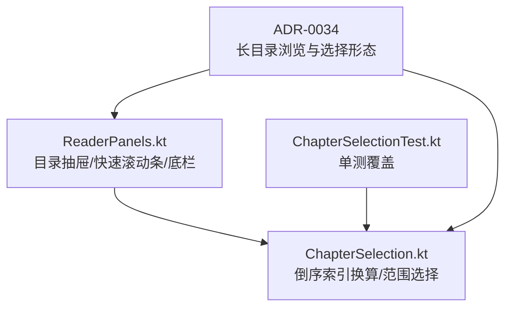
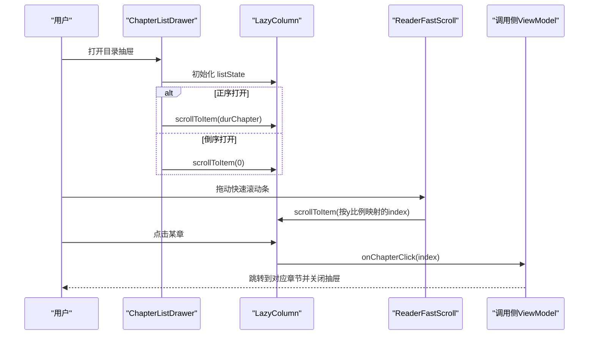
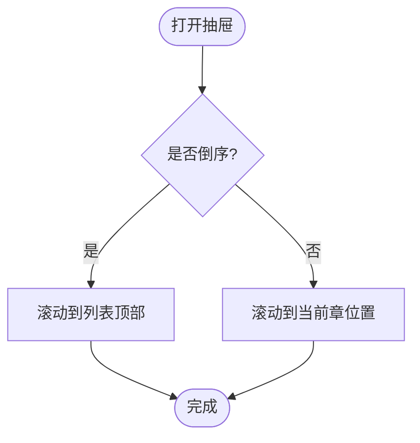
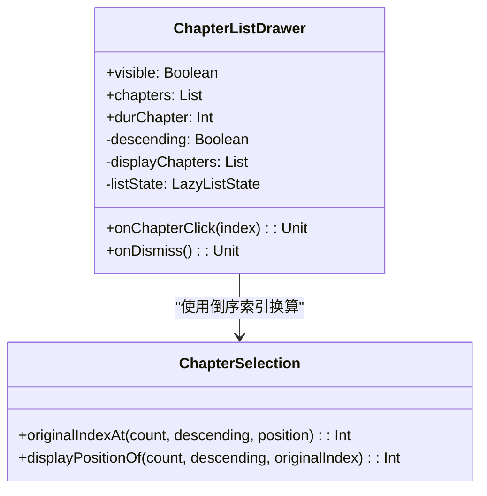
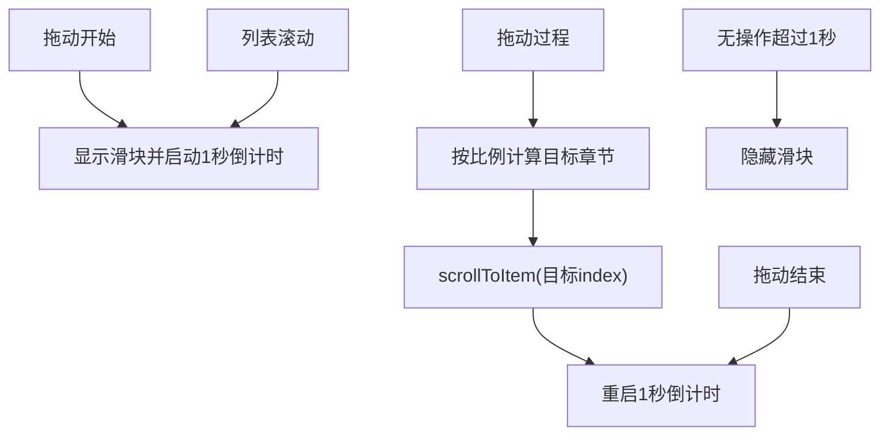
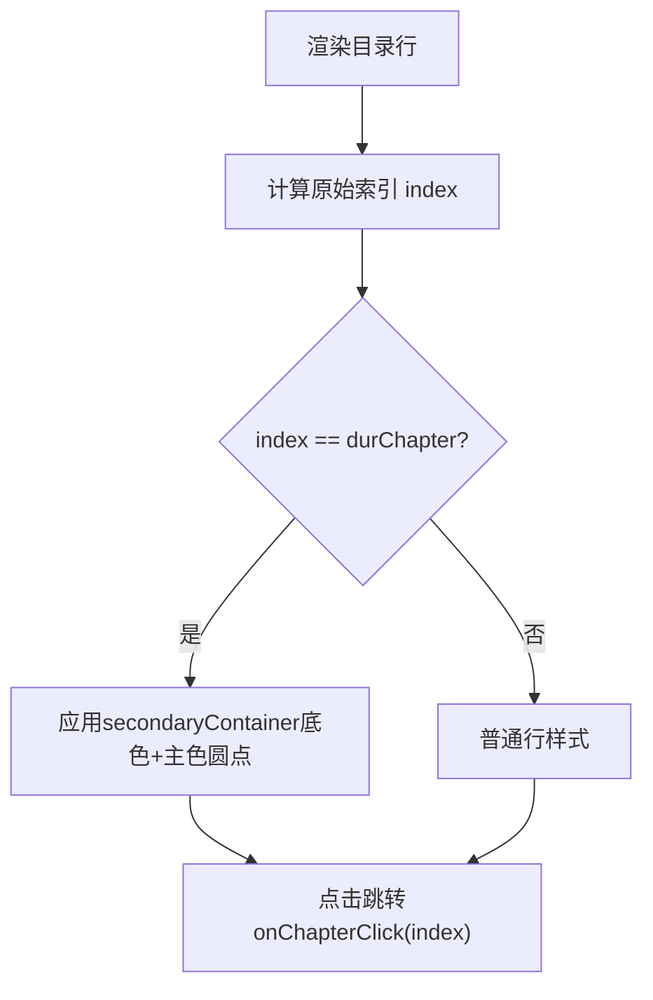
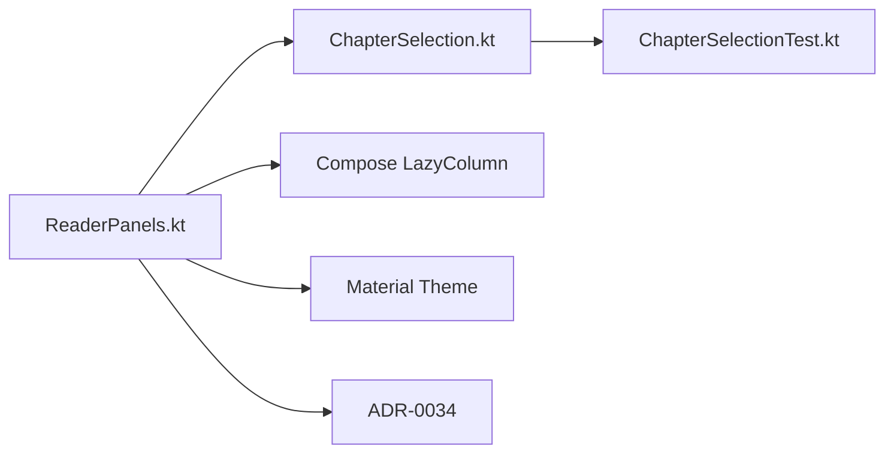

# 章节目录抽屉

<cite>
**本文引用的文件**
- [ReaderPanels.kt](file://module_book/src/main/java/com/ebook/book/reader/ReaderPanels.kt)
- [ChapterSelection.kt](file://module_book/src/main/java/com/ebook/book/reader/ChapterSelection.kt)
- [ChapterSelectionTest.kt](file://module_book/src/test/java/com/ebook/book/reader/ChapterSelectionTest.kt)
- [0034-long-catalog-browse-and-select.md](file://docs/adr/0034-long-catalog-browse-and-select.md)
</cite>

## 目录
1. [简介](#简介)
2. [项目结构](#项目结构)
3. [核心组件](#核心组件)
4. [架构总览](#架构总览)
5. [详细组件分析](#详细组件分析)
6. [依赖关系分析](#依赖关系分析)
7. [性能考量](#性能考量)
8. [故障排查指南](#故障排查指南)
9. [结论](#结论)
10. [附录](#附录)

## 简介
本章节文档围绕“章节目录抽屉”展开，系统性说明左侧滑入的 ChapterListDrawer 设计、倒序切换逻辑、快速滚动条 ReaderFastScroll 的工作原理、当前章节高亮机制、长目录渲染优化策略，以及抽屉与阅读进度的双向同步。目标读者既包括需要快速上手的开发者，也包括希望理解交互设计的非技术读者。

## 项目结构
章节目录相关能力集中在 module_book 的 reader 包中：
- 界面与交互实现位于 ReaderPanels.kt（包含目录抽屉、快速滚动条、底栏等）
- 纯逻辑（倒序索引换算、范围选择等）位于 ChapterSelection.kt
- 针对纯逻辑的单测位于 ChapterSelectionTest.kt
- 相关设计与决策记录在 docs/adr/0034-long-catalog-browse-and-select.md

**图表来源**
- [ReaderPanels.kt:743-962](file://module_book/src/main/java/com/ebook/book/reader/ReaderPanels.kt#L743-L962)
- [ChapterSelection.kt:101-117](file://module_book/src/main/java/com/ebook/book/reader/ChapterSelection.kt#L101-L117)
- [0034-long-catalog-browse-and-select.md:1-43](file://docs/adr/0034-long-catalog-browse-and-select.md#L1-L43)

**章节来源**
- [ReaderPanels.kt:743-962](file://module_book/src/main/java/com/ebook/book/reader/ReaderPanels.kt#L743-L962)
- [ChapterSelection.kt:101-117](file://module_book/src/main/java/com/ebook/book/reader/ChapterSelection.kt#L101-L117)
- [0034-long-catalog-browse-and-select.md:1-43](file://docs/adr/0034-long-catalog-browse-and-select.md#L1-L43)

## 核心组件
- 章节目录抽屉 ChapterListDrawer：左侧滑入的全高列表，不遮挡正文；支持正序/倒序切换、回到当前章、右侧快速滚动条。
- 快速滚动条 ReaderFastScroll：右侧可拖动手柄，按 y 比例定位章节；拖动或滚动时显示，1 秒无操作自动隐藏。
- 目录行 ChapterRow：当前章节整行 secondaryContainer 底色 + 主色圆点标记，序号列固定宽度便于对齐。
- 纯逻辑工具 ChapterSelection：originalIndexAt/displayPositionOf 提供 O(1) 的正/倒序索引换算，供 UI 层使用。

**章节来源**
- [ReaderPanels.kt:743-962](file://module_book/src/main/java/com/ebook/book/reader/ReaderPanels.kt#L743-L962)
- [ReaderPanels.kt:1045-1150](file://module_book/src/main/java/com/ebook/book/reader/ReaderPanels.kt#L1045-L1150)
- [ReaderPanels.kt:964-1029](file://module_book/src/main/java/com/ebook/book/reader/ReaderPanels.kt#L964-L1029)
- [ChapterSelection.kt:101-117](file://module_book/src/main/java/com/ebook/book/reader/ChapterSelection.kt#L101-L117)

## 架构总览
目录抽屉由 Compose 组合函数构成，通过 LazyColumn 懒加载展示章节，配合快速滚动条实现长目录高效定位；倒序切换通过 asReversed() 视图反转且 O(1)，结合 remember 避免每帧重建导致身份变化；当前章节高亮与跳转通过原始索引计算与 onChapterClick 回调完成；与阅读进度的双向同步由调用侧管理 durChapter 状态，并在打开抽屉时根据顺序进行定位。

**图表来源**
- [ReaderPanels.kt:768-773](file://module_book/src/main/java/com/ebook/book/reader/ReaderPanels.kt#L768-L773)
- [ReaderPanels.kt:900-918](file://module_book/src/main/java/com/ebook/book/reader/ReaderPanels.kt#L900-L918)
- [ReaderPanels.kt:935-949](file://module_book/src/main/java/com/ebook/book/reader/ReaderPanels.kt#L935-L949)
- [ReaderPanels.kt:1070-1075](file://module_book/src/main/java/com/ebook/book/reader/ReaderPanels.kt#L1070-L1075)

## 详细组件分析

### ChapterListDrawer：左侧滑入与全高列表设计
- 设计动机：相比底部弹窗，左侧全高列表更利于长目录浏览，不遮挡正文，符合阅读器目录浏览习惯。
- 打开行为：正序打开定位到当前章，倒序打开停在顶部（最新章节在顶），标题栏提供关闭按钮与“回到当前章”一次性动作。
- 顺序切换：仅本次会话有效，状态声明在 AnimatedVisibility 之外，关抽屉不丢、退出阅读器自然回正序；切换顺序不做滚动，保持列表进度百分比不变。
- 视觉语义：右侧大圆角、surfaceContainerLow 底色；当前章节整行 secondaryContainer 底色 + 主色圆点标记；序号列固定宽度对齐。

**图表来源**
- [ReaderPanels.kt:768-773](file://module_book/src/main/java/com/ebook/book/reader/ReaderPanels.kt#L768-L773)

**章节来源**
- [ReaderPanels.kt:743-962](file://module_book/src/main/java/com/ebook/book/reader/ReaderPanels.kt#L743-L962)
- [0034-long-catalog-browse-and-select.md:1-43](file://docs/adr/0034-long-catalog-browse-and-select.md#L1-L43)

### 倒序切换的实现逻辑
- 数据源：displayChapters = chapters.asReversed()（descending=true）或 chapters（descending=false）。
- 视图反转：asReversed() 为 O(1) 的视图反转，无需拷贝数据；必须 remember 以避免重组创建新实例导致 item provider 身份变化。
- 打开定位：visible=true 时，若 descending 则 scrollToItem(0)，否则 scrollToItem(durChapter)。
- 切换保持进度：切换顺序不主动滚动，listState 停留在原 index，体现“保持进度百分比而非章节”的语义。
- 原始索引：列表项通过 originalIndexAt 计算真实 index，用于高亮与跳转；显示章号也基于原始 index。

**图表来源**
- [ReaderPanels.kt:759-773](file://module_book/src/main/java/com/ebook/book/reader/ReaderPanels.kt#L759-L773)
- [ChapterSelection.kt:101-117](file://module_book/src/main/java/com/ebook/book/reader/ChapterSelection.kt#L101-L117)

**章节来源**
- [ReaderPanels.kt:759-773](file://module_book/src/main/java/com/ebook/book/reader/ReaderPanels.kt#L759-L773)
- [ChapterSelection.kt:101-117](file://module_book/src/main/java/com/ebook/book/reader/ChapterSelection.kt#L101-L117)
- [ChapterSelectionTest.kt:70-99](file://module_book/src/test/java/com/ebook/book/reader/ChapterSelectionTest.kt#L70-L99)

### ReaderFastScroll：快速滚动条工作原理
- 触发时机：拖动开始、拖动过程、拖动结束、取消、列表滚动进行中均显示滑块。
- 自动隐藏：每次操作重启 1 秒倒计时，无操作后隐藏。
- 定位算法：按 y 比例映射到章节索引，clamp 到有效范围后 scrollToItem。
- 滑块尺寸：高度按可视条目占比换算，下限 28dp 保证可点；顶端位置随首可见项比例同步。
- 视觉：轨道常显弱化，滑块仅在操作期间出现，贴右缘居中于轨道。

**图表来源**
- [ReaderPanels.kt:1060-1075](file://module_book/src/main/java/com/ebook/book/reader/ReaderPanels.kt#L1060-L1075)
- [ReaderPanels.kt:1078-1083](file://module_book/src/main/java/com/ebook/book/reader/ReaderPanels.kt#L1078-L1083)
- [ReaderPanels.kt:1115-1125](file://module_book/src/main/java/com/ebook/book/reader/ReaderPanels.kt#L1115-L1125)

**章节来源**
- [ReaderPanels.kt:1045-1150](file://module_book/src/main/java/com/ebook/book/reader/ReaderPanels.kt#L1045-L1150)

### 当前章节高亮机制
- 高亮样式：当前章节整行 secondaryContainer 底色 + 主色圆点标记；序号列固定宽度便于对齐。
- 判断依据：isCurrent = (index == durChapter)，其中 index 为原始索引，不受倒序影响。
- 性能考虑：只有当前章行构建 clip 与背景层，非当前行透明背景避免额外渲染层。

**图表来源**
- [ReaderPanels.kt:935-949](file://module_book/src/main/java/com/ebook/book/reader/ReaderPanels.kt#L935-L949)
- [ReaderPanels.kt:964-1029](file://module_book/src/main/java/com/ebook/book/reader/ReaderPanels.kt#L964-L1029)

**章节来源**
- [ReaderPanels.kt:935-949](file://module_book/src/main/java/com/ebook/book/reader/ReaderPanels.kt#L935-L949)
- [ReaderPanels.kt:964-1029](file://module_book/src/main/java/com/ebook/book/reader/ReaderPanels.kt#L964-L1029)

### 长目录性能优化策略
- asReversed() O(1) 视图反转：避免拷贝数据，仅改变视图顺序。
- remember 缓存 displayChapters：防止重组创建新实例导致 LazyColumn item provider 身份变化。
- LazyColumn 懒加载：仅渲染可见项，提升长列表滚动性能。
- 无 key 策略：列表项不带 key，依赖默认 index key，避免跨滚动保留状态的额外开销。
- 条件渲染：只有当前章行构建 clip 与背景层，减少渲染层数量。

**章节来源**
- [ReaderPanels.kt:759-773](file://module_book/src/main/java/com/ebook/book/reader/ReaderPanels.kt#L759-L773)
- [ReaderPanels.kt:927-950](file://module_book/src/main/java/com/ebook/book/reader/ReaderPanels.kt#L927-L950)
- [ReaderPanels.kt:964-1029](file://module_book/src/main/java/com/ebook/book/reader/ReaderPanels.kt#L964-L1029)

### 代码示例路径
- 章节跳转实现：[ReaderPanels.kt:935-949](file://module_book/src/main/java/com/ebook/book/reader/ReaderPanels.kt#L935-L949)
- 倒序索引换算：[ChapterSelection.kt:101-117](file://module_book/src/main/java/com/ebook/book/reader/ChapterSelection.kt#L101-L117)
- 快速滚动条定位：[ReaderPanels.kt:1070-1075](file://module_book/src/main/java/com/ebook/book/reader/ReaderPanels.kt#L1070-L1075)
- 打开定位逻辑：[ReaderPanels.kt:768-773](file://module_book/src/main/java/com/ebook/book/reader/ReaderPanels.kt#L768-L773)

### 如何扩展排序选项
- 当前实现为二态（正序/倒序），可通过以下方式扩展：
  - 将 descending 改为枚举类型（如 Ascending、Descending、Custom）
  - 在 UI 层增加更多排序选项（如按时间、按字数等）
  - 保持 originalIndexAt/displayPositionOf 的逆运算关系
  - 确保切换时不主动滚动，保持进度百分比不变

**章节来源**
- [ReaderPanels.kt:755-773](file://module_book/src/main/java/com/ebook/book/reader/ReaderPanels.kt#L755-L773)
- [ChapterSelection.kt:101-117](file://module_book/src/main/java/com/ebook/book/reader/ChapterSelection.kt#L101-L117)

### 如何优化大量章节的渲染性能
- 使用 asReversed() 而非手动反转数据
- 用 remember 缓存 displayChapters
- 利用 LazyColumn 的懒加载特性
- 避免不必要的 key 指定
- 条件渲染当前章节的高亮样式
- 使用 derivedStateOf 优化频繁更新的派生状态

**章节来源**
- [ReaderPanels.kt:759-773](file://module_book/src/main/java/com/ebook/book/reader/ReaderPanels.kt#L759-L773)
- [ReaderPanels.kt:1088-1096](file://module_book/src/main/java/com/ebook/book/reader/ReaderPanels.kt#L1088-L1096)

## 依赖关系分析
目录抽屉与相关组件的依赖关系如下：

**图表来源**
- [ReaderPanels.kt:743-962](file://module_book/src/main/java/com/ebook/book/reader/ReaderPanels.kt#L743-L962)
- [ChapterSelection.kt:101-117](file://module_book/src/main/java/com/ebook/book/reader/ChapterSelection.kt#L101-L117)
- [ChapterSelectionTest.kt:70-99](file://module_book/src/test/java/com/ebook/book/reader/ChapterSelectionTest.kt#L70-L99)
- [0034-long-catalog-browse-and-select.md:1-43](file://docs/adr/0034-long-catalog-browse-and-select.md#L1-L43)

**章节来源**
- [ReaderPanels.kt:743-962](file://module_book/src/main/java/com/ebook/book/reader/ReaderPanels.kt#L743-L962)
- [ChapterSelection.kt:101-117](file://module_book/src/main/java/com/ebook/book/reader/ChapterSelection.kt#L101-L117)
- [ChapterSelectionTest.kt:70-99](file://module_book/src/test/java/com/ebook/book/reader/ChapterSelectionTest.kt#L70-L99)

## 性能考量
- 视图反转：asReversed() 为 O(1) 操作，避免数据拷贝
- 懒加载：LazyColumn 仅渲染可见项，适合数千章场景
- 状态缓存：remember 避免重复计算和重建
- 条件渲染：只在必要时创建渲染层（当前章节高亮）
- 派生状态：使用 derivedStateOf 减少重组频率
- 手势处理：快速滚动条的手势处理采用 efficient 的方式，避免不必要的 recomposition

## 故障排查指南
- 倒序切换失效：检查 descending 状态是否在 AnimatedVisibility 外部声明
- 章节跳转错误：确认 originalIndexAt 与 displayPositionOf 的逆运算关系
- 快速滚动条不工作：检查 boxHeightPx 是否正确获取，itemCount 是否为正数
- 当前章节高亮异常：确认 isCurrent 判断使用的是原始索引
- 性能问题：检查是否有不必要的 key 指定或频繁的重组

**章节来源**
- [ReaderPanels.kt:755-773](file://module_book/src/main/java/com/ebook/book/reader/ReaderPanels.kt#L755-L773)
- [ChapterSelection.kt:101-117](file://module_book/src/main/java/com/ebook/book/reader/ChapterSelection.kt#L101-L117)
- [ReaderPanels.kt:1070-1075](file://module_book/src/main/java/com/ebook/book/reader/ReaderPanels.kt#L1070-L1075)

## 结论
章节目录抽屉通过左侧滑入的全高列表设计，提供了优于底部弹窗的长目录浏览体验。倒序切换逻辑简洁高效，快速滚动条实现了精确的章节定位，当前章节高亮机制清晰直观。通过 asReversed() O(1) 视图反转和 LazyColumn 懒加载，实现了优秀的性能表现。该实现遵循了 ADR-0034 的设计决策，确保了用户体验的一致性和可维护性。

## 附录
- 相关设计文档：[ADR-0034 长目录的浏览与选择形态](file://docs/adr/0034-long-catalog-browse-and-select.md)
- 单元测试覆盖：[ChapterSelectionTest.kt](file://module_book/src/test/java/com/ebook/book/reader/ChapterSelectionTest.kt)
- 核心实现：[ReaderPanels.kt](file://module_book/src/main/java/com/ebook/book/reader/ReaderPanels.kt)
- 纯逻辑实现：[ChapterSelection.kt](file://module_book/src/main/java/com/ebook/book/reader/ChapterSelection.kt)