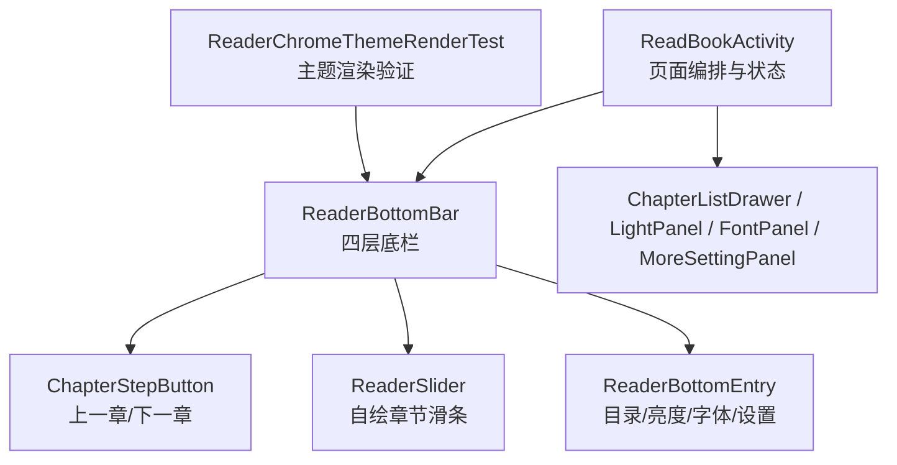
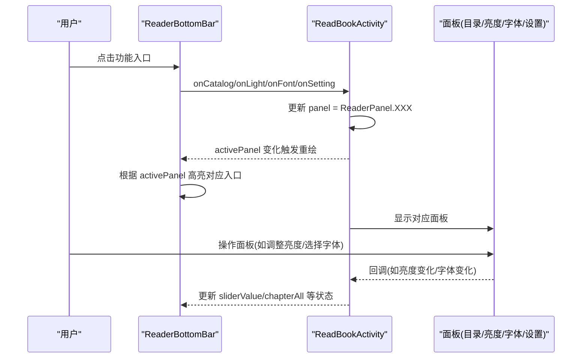
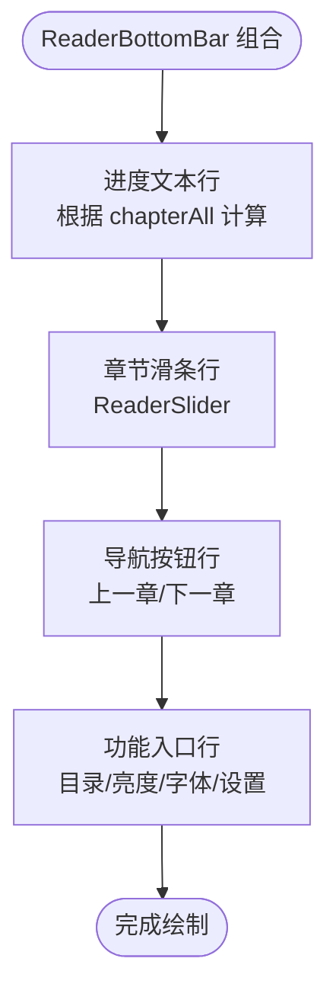
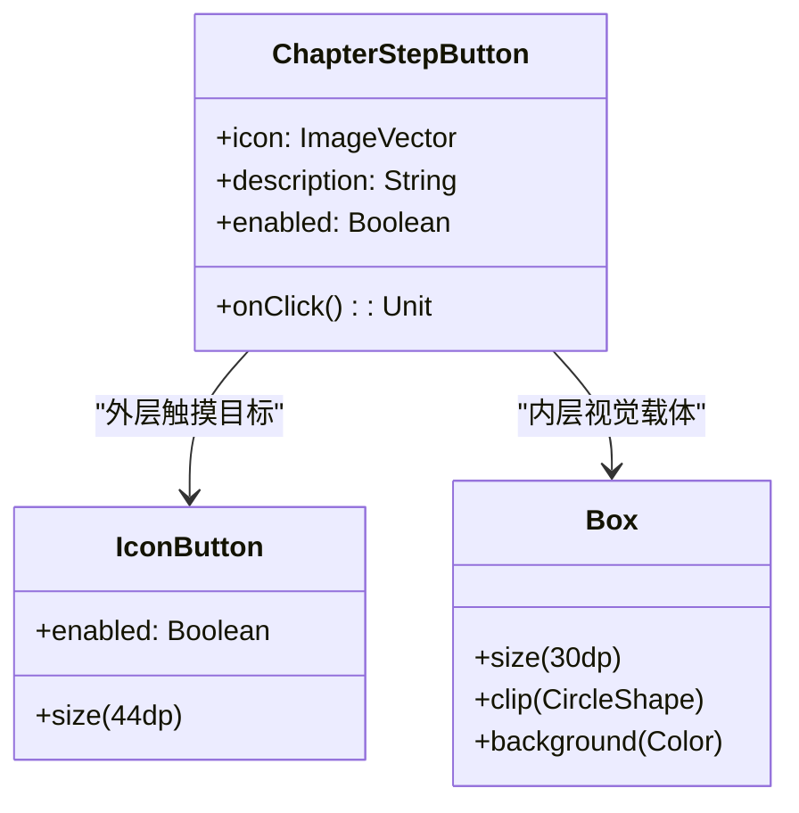
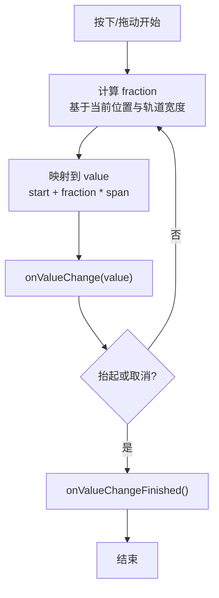
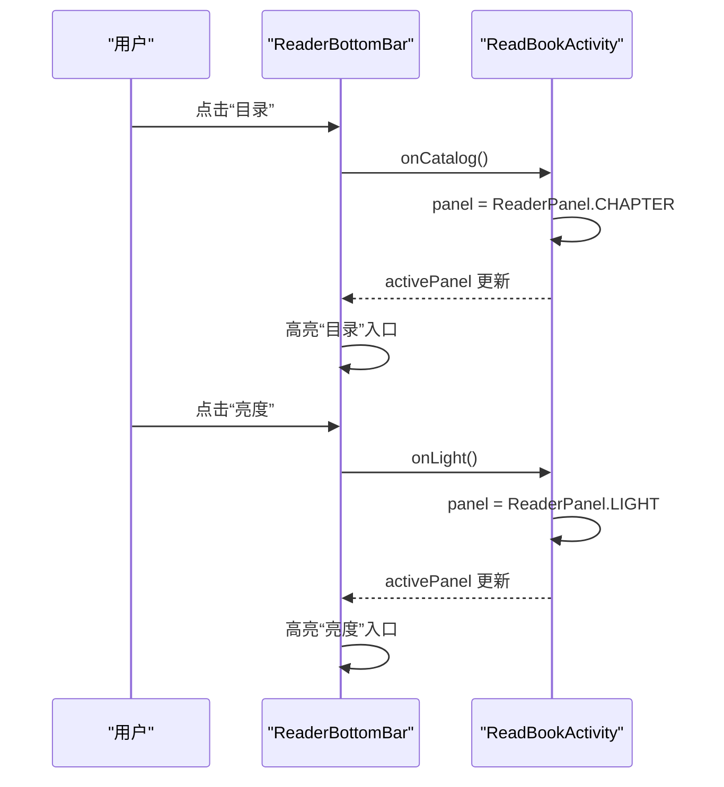
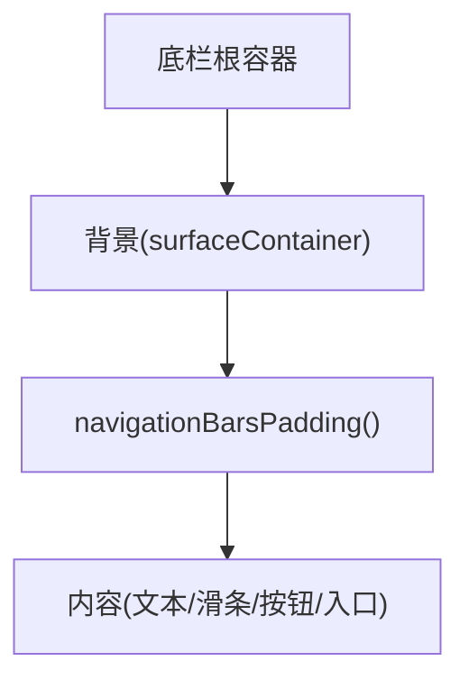
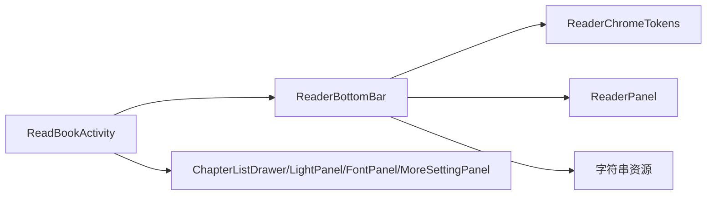

# 阅读器底栏组件

<cite>
**本文引用的文件**
- [ReaderPanels.kt](file://module_book/src/main/java/com/ebook/book/reader/ReaderPanels.kt)
- [ReadBookActivity.kt](file://module_book/src/main/java/com/ebook/book/ReadBookActivity.kt)
- [ReaderChromeThemeRenderTest.kt](file://module_book/src/test/java/com/ebook/book/reader/ReaderChromeThemeRenderTest.kt)
</cite>

## 目录
1. [简介](#简介)
2. [项目结构](#项目结构)
3. [核心组件](#核心组件)
4. [架构总览](#架构总览)
5. [详细组件分析](#详细组件分析)
6. [依赖关系分析](#依赖关系分析)
7. [性能考量](#性能考量)
8. [故障排查指南](#故障排查指南)
9. [结论](#结论)
10. [附录](#附录)

## 简介
本文件聚焦“阅读器底栏”这一交互与展示的关键区域，系统性拆解 ReaderBottomBar 的四层结构设计（进度文本行、章节滑条行、导航按钮行、功能入口行），并深入解释：
- ChapterStepButton 的触摸目标优化与两层包裹带来的点击反馈；
- ReaderSlider 自绘滑条的实现原理与替代 Material3 Slider 的原因、手势处理与值映射算法；
- 四功能入口（目录/亮度/字体/设置）的选中态高亮机制与 activePanel 状态管理；
- navigationBarsPadding 的正确使用方式，避免底部按钮被系统手势条遮挡；
- 扩展新入口、自定义滑条样式、处理边界状态（如没有章节）的具体做法。

## 项目结构
底栏相关 UI 集中在 reader 包的组合式界面文件中，由阅读页 Activity 编排并驱动状态。关键位置：
- 阅读器面板与底栏定义位于 reader 包中的组合文件；
- 阅读页主布局与状态编排位于 ReadBookActivity 中；
- 主题渲染回归测试覆盖顶栏与底栏颜色随深浅色切换的行为。

图示来源
- [ReadBookActivity.kt:423-997](file://module_book/src/main/java/com/ebook/book/ReadBookActivity.kt#L423-L997)
- [ReaderPanels.kt:370-481](file://module_book/src/main/java/com/ebook/book/reader/ReaderPanels.kt#L370-L481)

章节来源
- [ReadBookActivity.kt:423-997](file://module_book/src/main/java/com/ebook/book/ReadBookActivity.kt#L423-L997)
- [ReaderPanels.kt:370-481](file://module_book/src/main/java/com/ebook/book/reader/ReaderPanels.kt#L370-L481)
- [ReaderChromeThemeRenderTest.kt:84-123](file://module_book/src/test/java/com/ebook/book/reader/ReaderChromeThemeRenderTest.kt#L84-L123)

## 核心组件
- ReaderBottomBar：底栏容器，组织进度文本、章节滑条、上一章/下一章、功能入口四行，统一背景与导航栏避让。
- ChapterStepButton：上一章/下一章按钮，提供 44dp 触摸目标与 30dp 圆形色块承载图标，禁用态通过透明度表达。
- ReaderSlider：自绘紧凑滑条，用于章节进度与亮度调节，包含轨道、填充段、旋钮、按下光晕与无障碍信息。
- ReaderBottomEntry：四功能入口项，支持选中态胶囊底色高亮，通过 activePanel 与 ReaderPanel 枚举联动。

章节来源
- [ReaderPanels.kt:370-481](file://module_book/src/main/java/com/ebook/book/reader/ReaderPanels.kt#L370-L481)
- [ReaderPanels.kt:489-519](file://module_book/src/main/java/com/ebook/book/reader/ReaderPanels.kt#L489-L519)
- [ReaderPanels.kt:585-717](file://module_book/src/main/java/com/ebook/book/reader/ReaderPanels.kt#L585-L717)
- [ReaderPanels.kt:531-568](file://module_book/src/main/java/com/ebook/book/reader/ReaderPanels.kt#L531-L568)

## 架构总览
底栏与面板的状态由阅读页 Activity 集中管理：
- 页面级 panel 状态控制当前打开的面板（目录/亮度/字体/设置/换源），底栏据此高亮对应入口；
- 滑条值 sliderValue 与章节总数 chapterAll 决定进度文本与滑条范围；
- 上一章/下一章使能状态由 sliderValue 与 chapterAll 推导；
- 面板关闭后 panel 回到 NONE，底栏恢复未选中态。

图示来源
- [ReadBookActivity.kt:839-877](file://module_book/src/main/java/com/ebook/book/ReadBookActivity.kt#L839-L877)
- [ReaderPanels.kt:370-481](file://module_book/src/main/java/com/ebook/book/reader/ReaderPanels.kt#L370-L481)

## 详细组件分析

### ReaderBottomBar 四层结构
- 第一层：进度文本行
  - 显示“第 N 章 · 共 M 章”，当无章节时显示“无章节”，避免“第 1 章 · 共 0 章”的矛盾文案。
- 第二层：章节滑条行
  - 使用自绘 ReaderSlider，范围从 1 到 chapterAll（至少为 1），拖动实时回调，抬手取整跳章。
- 第三层：导航按钮行
  - 上一章/下一章按钮启用状态由 sliderValue 与 chapterAll 推导，首末章禁用相应按钮。
- 第四层：功能入口行
  - 四个入口等宽分配，选中态以 secondaryContainer 胶囊底色 + onSecondaryContainer 前景高亮，未选中透明底。

图示来源
- [ReaderPanels.kt:370-481](file://module_book/src/main/java/com/ebook/book/reader/ReaderPanels.kt#L370-L481)

章节来源
- [ReaderPanels.kt:370-481](file://module_book/src/main/java/com/ebook/book/reader/ReaderPanels.kt#L370-L481)

### ChapterStepButton 触摸目标优化
- 外层 IconButton 尺寸 44dp，满足最小可点击尺寸要求；
- 内层 Box 尺寸 30dp，圆形色块承载图标，提供“这是个按钮”的可点性暗示；
- 禁用态整体淡出（透明度降低），比原先“文字变灰”更明确；
- 两层包裹的优势：
  - 外层负责触摸目标与语义；
  - 内层负责视觉反馈与禁用态表现，二者解耦，便于独立调整。

图示来源
- [ReaderPanels.kt:489-519](file://module_book/src/main/java/com/ebook/book/reader/ReaderPanels.kt#L489-L519)

章节来源
- [ReaderPanels.kt:489-519](file://module_book/src/main/java/com/ebook/book/reader/ReaderPanels.kt#L489-L519)

### ReaderSlider 自绘滑条实现原理
- 替代 Material3 Slider 的原因：
  - 新版滑条竖条手柄在紧凑行中与文字/图标抢视线；
  - 取值处于最小端时会露出端点圆点，读起来像控件异常；
  - 自绘版本采用经典形态：4dp 轨道 + 圆旋钮 + 按下放大与光晕，视觉更克制。
- 手势处理逻辑：
  - 监听按下与拖动事件，实时更新 value；
  - 抬起或取消时调用 onValueChangeFinished（用于取整跳章）。
- 值映射算法：
  - 固定用静止态旋钮直径作为锚点计算位置，不随按下放大尺寸变化，避免数值抖动；
  - fraction = (value - start) / span，travelPx = trackWidth - mapThumbPx；
  - 位置 xPx 映射回 value：start + ((xPx - mapThumbPx/2)/travelPx).coerceIn(0f, 1f) * span。

图示来源
- [ReaderPanels.kt:585-717](file://module_book/src/main/java/com/ebook/book/reader/ReaderPanels.kt#L585-L717)

章节来源
- [ReaderPanels.kt:585-717](file://module_book/src/main/java/com/ebook/book/reader/ReaderPanels.kt#L585-L717)

### 四功能入口选中态高亮与 activePanel 状态管理
- 入口项使用 ReaderBottomEntry，传入 active 标志；
- active 由 activePanel == ReaderPanel.XXX 决定；
- 选中态以 secondaryContainer 胶囊底色 + onSecondaryContainer 前景高亮；
- 未选中保持透明底，避免四个入口同时“亮”。

图示来源
- [ReadBookActivity.kt:839-877](file://module_book/src/main/java/com/ebook/book/ReadBookActivity.kt#L839-L877)
- [ReaderPanels.kt:446-479](file://module_book/src/main/java/com/ebook/book/reader/ReaderPanels.kt#L446-L479)

章节来源
- [ReadBookActivity.kt:839-877](file://module_book/src/main/java/com/ebook/book/ReadBookActivity.kt#L839-L877)
- [ReaderPanels.kt:446-479](file://module_book/src/main/java/com/ebook/book/reader/ReaderPanels.kt#L446-L479)

### navigationBarsPadding 的正确使用方式
- 底栏贴屏底，需自行避让系统手势条/导航栏；
- padding 写在 background 内层：背景延伸到导航栏后面，内容上移避让；
- 错误用法示例（概念）：若将 padding 放在外层或内容区之外，可能导致内容被压缩而非避让，造成按钮被遮挡或高度异常。

图示来源
- [ReaderPanels.kt:397-403](file://module_book/src/main/java/com/ebook/book/reader/ReaderPanels.kt#L397-L403)

章节来源
- [ReaderPanels.kt:397-403](file://module_book/src/main/java/com/ebook/book/reader/ReaderPanels.kt#L397-L403)

## 依赖关系分析
- ReaderBottomBar 依赖：
  - ReaderChromeTokens（设计常量：轨道厚度、滑条尺寸、旋钮大小等）；
  - ReaderPanel 枚举（统一管理面板显隐与高亮）；
  - 资源字符串（进度格式、无章节提示、入口文案等）。
- ReadBookActivity 依赖：
  - 页面级 panel/sliderValue/chapterAll 状态；
  - 控制器回调（跳转章节、刷新、换源等）；
  - 面板组件（目录抽屉、亮度、字体、设置）。

图示来源
- [ReaderPanels.kt:142-183](file://module_book/src/main/java/com/ebook/book/reader/ReaderPanels.kt#L142-L183)
- [ReaderPanels.kt:128-134](file://module_book/src/main/java/com/ebook/book/reader/ReaderPanels.kt#L128-L134)
- [ReadBookActivity.kt:839-980](file://module_book/src/main/java/com/ebook/book/ReadBookActivity.kt#L839-L980)

章节来源
- [ReaderPanels.kt:128-183](file://module_book/src/main/java/com/ebook/book/reader/ReaderPanels.kt#L128-L183)
- [ReadBookActivity.kt:839-980](file://module_book/src/main/java/com/ebook/book/ReadBookActivity.kt#L839-L980)

## 性能考量
- 滑条值映射与动画：
  - 使用 animateDpAsState 与 animateFloatAsState 对旋钮尺寸与光晕透明度进行平滑过渡；
  - 单章书 range 两端相同的情况通过 coerceAtLeast 防止除零导致 NaN。
- 列表滚动与快速滚动条：
  - 使用 derivedStateOf 缓存派生值，减少重组频率；
  - 快速滚动条自动隐藏计时器在每次操作时重启，保证“1秒无操作才隐藏”。
- 主题渲染：
  - 顶栏与底栏颜色来自 colorScheme.surfaceContainer，通过测试断言确保深浅色正确切换。

章节来源
- [ReaderPanels.kt:621-717](file://module_book/src/main/java/com/ebook/book/reader/ReaderPanels.kt#L621-L717)
- [ReaderPanels.kt:1088-1148](file://module_book/src/main/java/com/ebook/book/reader/ReaderPanels.kt#L1088-L1148)
- [ReaderChromeThemeRenderTest.kt:84-123](file://module_book/src/test/java/com/ebook/book/reader/ReaderChromeThemeRenderTest.kt#L84-L123)

## 故障排查指南
- 问题：底部按钮被系统手势条遮挡
  - 检查是否正确使用 navigationBarsPadding，并确保 padding 位于 background 内层；
  - 确认底栏背景延伸至导航栏后面，内容区上移避让。
- 问题：滑条值抖动或定位不准
  - 检查是否以静止态旋钮直径作为映射基准；
  - 确认 travelPx 与 fraction 计算未越界；
  - 检查单章书情况下的 range 处理。
- 问题：功能入口选中态不一致
  - 检查 activePanel 是否正确更新；
  - 确认 ReaderBottomEntry 的 active 标志与 ReaderPanel 匹配；
  - 验证面板关闭后 panel 重置为 NONE。
- 问题：无章节时的文案异常
  - 检查 chapterAll <= 0 分支是否返回“无章节”；
  - 确认进度文本格式化逻辑与边界值处理。

章节来源
- [ReaderPanels.kt:370-481](file://module_book/src/main/java/com/ebook/book/reader/ReaderPanels.kt#L370-L481)
- [ReaderPanels.kt:585-717](file://module_book/src/main/java/com/ebook/book/reader/ReaderPanels.kt#L585-L717)
- [ReadBookActivity.kt:839-877](file://module_book/src/main/java/com/ebook/book/ReadBookActivity.kt#L839-L877)

## 结论
ReaderBottomBar 通过四层结构清晰组织阅读器的核心交互：进度反馈、章节跳转、功能入口。ChapterStepButton 通过双层包裹提升触摸目标与反馈；ReaderSlider 自绘实现兼顾紧凑性与可用性；activePanel 统一管理面板状态，确保入口高亮一致。navigationBarsPadding 的正确使用避免了系统手势条遮挡。整体设计在视觉、交互与可访问性之间取得平衡，并为扩展新功能入口提供了清晰的接入点。

## 附录

### 如何添加新的功能入口
- 在 ReaderBottomBar 的功能入口行中添加一个新的 ReaderBottomEntry；
- 在 ReadBookActivity 中新增对应的 panel 分支与回调；
- 确保 activePanel 状态与新入口联动，并在面板关闭时重置。

章节来源
- [ReaderPanels.kt:446-479](file://module_book/src/main/java/com/ebook/book/reader/ReaderPanels.kt#L446-L479)
- [ReadBookActivity.kt:905-980](file://module_book/src/main/java/com/ebook/book/ReadBookActivity.kt#L905-L980)

### 如何自定义滑条样式
- 调整 ReaderChromeTokens 中的滑条相关常量（轨道厚度、旋钮尺寸、光晕大小）；
- 修改 ReaderSlider 的颜色与形状（轨道颜色、旋钮颜色、圆角等）；
- 确保手势处理逻辑与值映射算法保持一致。

章节来源
- [ReaderPanels.kt:142-183](file://module_book/src/main/java/com/ebook/book/reader/ReaderPanels.kt#L142-L183)
- [ReaderPanels.kt:585-717](file://module_book/src/main/java/com/ebook/book/reader/ReaderPanels.kt#L585-L717)

### 如何处理边界状态（如没有章节）
- 在 ReaderBottomBar 中检查 chapterAll <= 0，显示“无章节”；
- 滑条范围设置为 1..max(1, chapterAll)，避免无效范围；
- 上一章/下一章按钮在无章节时禁用。

章节来源
- [ReaderPanels.kt:370-481](file://module_book/src/main/java/com/ebook/book/reader/ReaderPanels.kt#L370-L481)