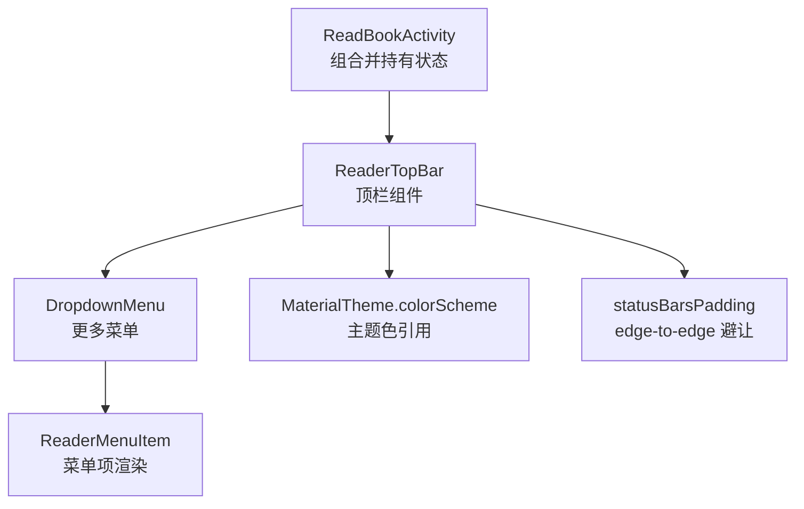
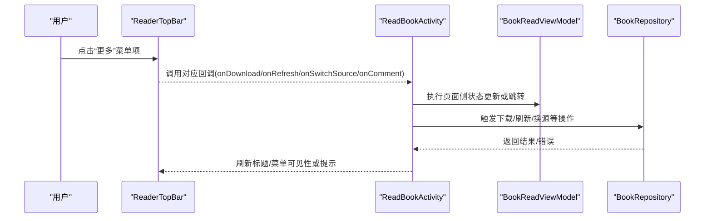
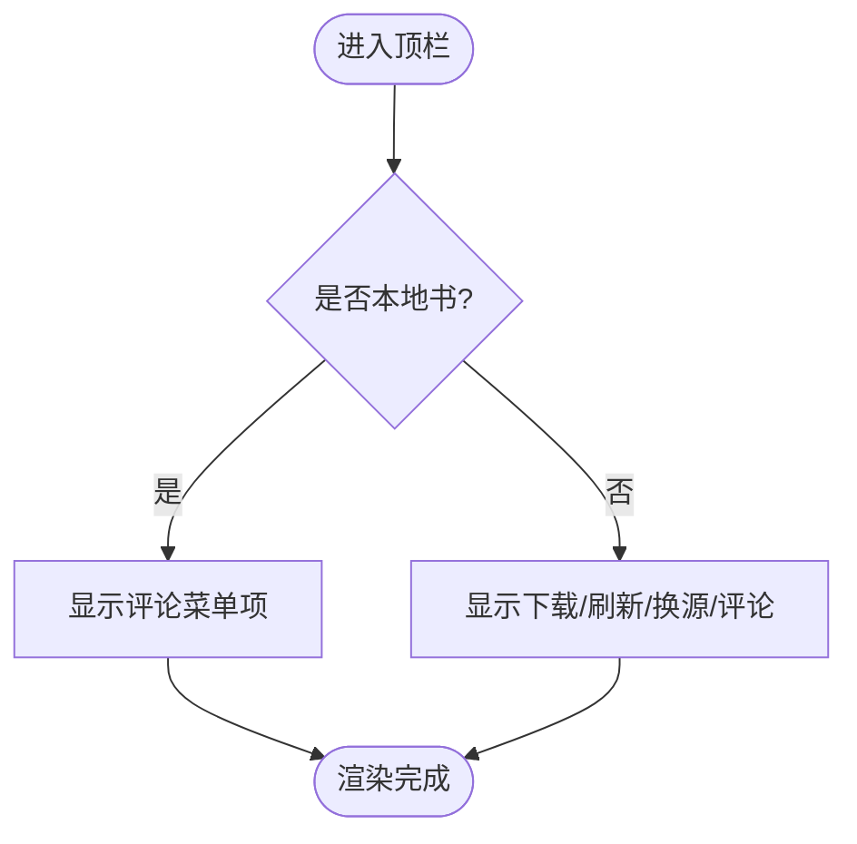
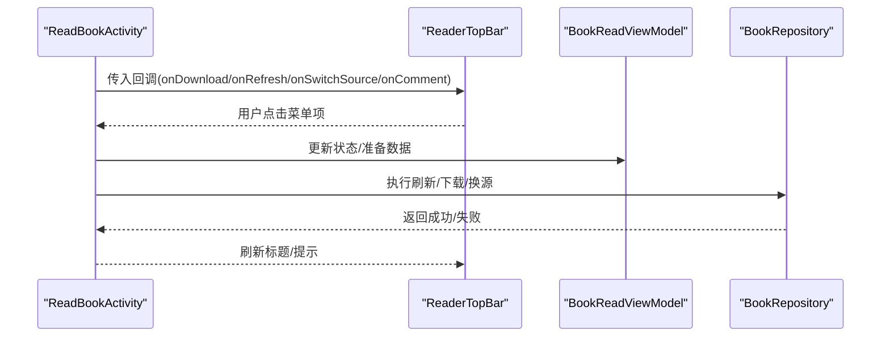
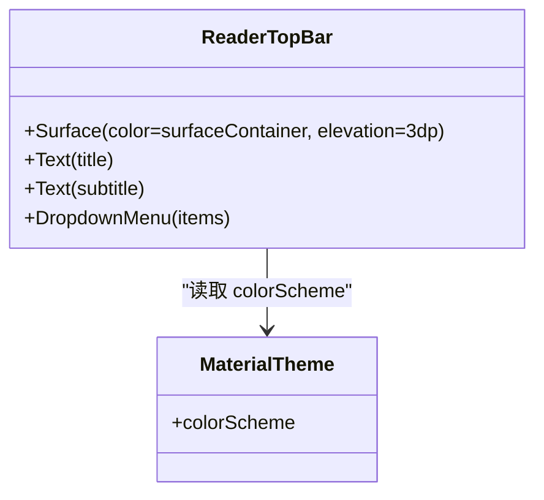
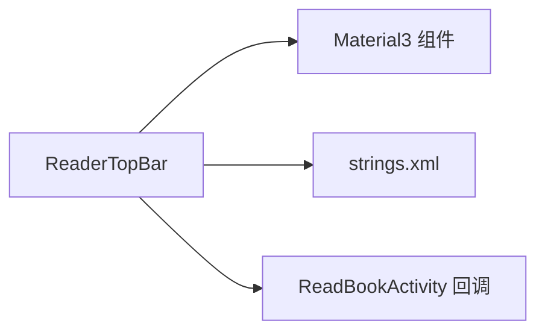

# 阅读器顶栏组件

<cite>
**本文引用的文件**
- [ReaderPanels.kt](file://module_book/src/main/java/com/ebook/book/reader/ReaderPanels.kt)
- [ReadBookActivity.kt](file://module_book/src/main/java/com/ebook/book/ReadBookActivity.kt)
- [0032-reader-top-bar-menu-by-book-type-and-single-chapter-refresh.md](file://docs/adr/0032-reader-top-bar-menu-by-book-type-and-single-chapter-refresh.md)
- [strings.xml](file://module_book/src/main/res/values/strings.xml)
- [ReaderChromeThemeRenderTest.kt](file://module_book/src/test/java/com/ebook/book/reader/ReaderChromeThemeRenderTest.kt)
</cite>

## 目录
1. [简介](#简介)
2. [项目结构](#项目结构)
3. [核心组件](#核心组件)
4. [架构总览](#架构总览)
5. [详细组件分析](#详细组件分析)
6. [依赖关系分析](#依赖关系分析)
7. [性能与可访问性](#性能与可访问性)
8. [故障排查指南](#故障排查指南)
9. [结论](#结论)
10. [附录：扩展指南](#附录：扩展指南)

## 简介
本文聚焦于阅读器的“顶栏”组件 ReaderTopBar，系统性说明其设计理念、实现要点与扩展方式。顶栏采用 surfaceContainer 底色加 3dp 下沿投影，使菜单层浮在正文之上；标题区采用双级信息（当前章节标题 + 书名副标题），以替代传统单行标题；“更多”菜单根据书籍类型动态显示：本地书仅评论入口，网络书显示下载、刷新、换源、评论四项；在 edge-to-edge 场景下通过 statusBarsPadding 正确避让状态栏，避免内容被压缩或被系统遮挡。此外，文档还阐述顶栏如何与整体主题系统集成，以及与 ReadBookActivity 的状态同步机制。

## 项目结构
阅读器 UI 由 Compose 实现，顶栏位于 module_book 的 reader 包内，与底栏、抽屉、面板等共用同一套 chrome 层设计常量与主题语义。顶栏作为组合函数被 ReadBookActivity 组合进页面布局中，并通过回调将用户操作转发给 ViewModel/Repository。

图表来源
- [ReadBookActivity.kt:783-794](file://module_book/src/main/java/com/ebook/book/ReadBookActivity.kt#L783-L794)
- [ReaderPanels.kt:207-323](file://module_book/src/main/java/com/ebook/book/reader/ReaderPanels.kt#L207-L323)

章节来源
- [ReadBookActivity.kt:778-794](file://module_book/src/main/java/com/ebook/book/ReadBookActivity.kt#L778-L794)
- [ReaderPanels.kt:128-323](file://module_book/src/main/java/com/ebook/book/reader/ReaderPanels.kt#L128-L323)

## 核心组件
- ReaderTopBar：顶栏主组件，包含返回按钮、双级标题、更多菜单；使用 Surface 承载背景与阴影；内部维护 DropdownMenu 展开状态。
- ReaderMenuItem：菜单项渲染单元，统一图标+文案风格。
- 设计常量 ReaderChromeTokens：集中定义顶/底栏高度、圆角、滑条尺寸等 chrome 层专属常量。

关键职责与行为
- 视觉：surfaceContainer 底色 + 3dp 下沿投影，形成“浮层”效果。
- 标题：title 为当前章节标题，subtitle 为书名；当 subtitle 为空时不显示副标题。
- 菜单：根据 isLocalBook 动态显示不同菜单项集合。
- 边距：statusBarsPadding 写在固定高度外层，避免内容被系统 insets 压缩。

章节来源
- [ReaderPanels.kt:128-183](file://module_book/src/main/java/com/ebook/book/reader/ReaderPanels.kt#L128-L183)
- [ReaderPanels.kt:207-323](file://module_book/src/main/java/com/ebook/book/reader/ReaderPanels.kt#L207-L323)

## 架构总览
顶栏是阅读器 chrome 层的入口之一，负责展示上下文（章节与书名）并提供操作入口。它通过回调将事件上抛给 ReadBookActivity，再由 Activity 调用 ViewModel/Repository 完成业务逻辑（如下载、刷新、换源、评论）。

图表来源
- [ReadBookActivity.kt:783-810](file://module_book/src/main/java/com/ebook/book/ReadBookActivity.kt#L783-L810)
- [ReaderPanels.kt:269-319](file://module_book/src/main/java/com/ebook/book/reader/ReaderPanels.kt#L269-L319)

## 详细组件分析

### ReaderTopBar 设计与实现
- 外观与层级
  - 使用 Surface 包裹，color 取自 MaterialTheme.colorScheme.surfaceContainer，shadowElevation=3dp，形成“浮在正文之上”的菜单层。
  - 标题居中：左右操作区各占固定宽度，中央 Column 以 weight 填充并以居中对齐，确保标题真正居中。
- 双级标题
  - 顶层 title 显示当前章节标题，限制一行省略；当 subtitle 非空时，第二层 labelSmall 显示书名，帮助读者快速确认“哪本书的哪一章”。
  - 选择该布局的原因：阅读器关注的是“我在读哪本书的哪一章”，两级信息同屏可减少返回详情页确认的成本。
- “更多”菜单动态显示
  - 本地书（tag 为本地标记）：仅显示“评论”。
  - 网络书：显示“下载”、“刷新”、“换源”、“评论”。
  - 决策依据来自书籍类型而非打开路径，保证从外部应用分享的网络书也能获得完整菜单能力。
- edge-to-edge 适配
  - statusBarsPadding 放置在固定高度 Row 的外层，让背景延伸到状态栏后方，同时内容整体下移，避免状态栏遮挡返回键与标题。
- 交互细节
  - 返回按钮调用 onBack。
  - 更多按钮触发 DropdownMenu 展开，菜单项点击后关闭并执行回调。

图表来源
- [ReaderPanels.kt:277-319](file://module_book/src/main/java/com/ebook/book/reader/ReaderPanels.kt#L277-L319)

章节来源
- [ReaderPanels.kt:185-323](file://module_book/src/main/java/com/ebook/book/reader/ReaderPanels.kt#L185-L323)
- [0032-reader-top-bar-menu-by-book-type-and-single-chapter-refresh.md:1-26](file://docs/adr/0032-reader-top-bar-menu-by-book-type-and-single-chapter-refresh.md#L1-L26)

### 与 ReadBookActivity 的状态同步
- 顶栏在 ReadBookActivity 中被组合，传入 title、subtitle、isLocalBook 以及各类回调。
- 返回箭头退出阅读器前会判断是否已加入书架，未加入则弹出确认对话框。
- “更多”菜单的回调由 Activity 接收，再交由 ViewModel/Repository 处理下载、刷新、换源等操作。
- 刷新当前章节：删除缓存并就地重载，保持阅读位置；失败时走既有的加载失败呈现与重试入口。

图表来源
- [ReadBookActivity.kt:783-810](file://module_book/src/main/java/com/ebook/book/ReadBookActivity.kt#L783-L810)

章节来源
- [ReadBookActivity.kt:778-810](file://module_book/src/main/java/com/ebook/book/ReadBookActivity.kt#L778-L810)
- [ReaderPanels.kt:269-319](file://module_book/src/main/java/com/ebook/book/reader/ReaderPanels.kt#L269-L319)

### 主题集成与深浅色适配
- 顶栏颜色全部来自 MaterialTheme.colorScheme 的角色色（onSurface、onSurfaceVariant、surfaceContainer 等），不硬编码颜色。
- 测试覆盖：通过自定义探针色断言顶栏与底栏随调板翻转，防止角色色被写回常量导致暗色模式下出现亮白块。

图表来源
- [ReaderPanels.kt:219-323](file://module_book/src/main/java/com/ebook/book/reader/ReaderPanels.kt#L219-L323)
- [ReaderChromeThemeRenderTest.kt:84-100](file://module_book/src/test/java/com/ebook/book/reader/ReaderChromeThemeRenderTest.kt#L84-L100)

章节来源
- [ReaderChromeThemeRenderTest.kt:23-40](file://module_book/src/test/java/com/ebook/book/reader/ReaderChromeThemeRenderTest.kt#L23-L40)
- [ReaderChromeThemeRenderTest.kt:84-100](file://module_book/src/test/java/com/ebook/book/reader/ReaderChromeThemeRenderTest.kt#L84-L100)

## 依赖关系分析
- 组件依赖
  - ReaderTopBar 依赖 Material3 组件（Surface、IconButton、DropdownMenu、Text）、Compose 动画与修饰符（statusBarsPadding）。
  - 字符串资源来自 module_book 的 strings.xml，便于国际化与统一维护。
- 外部依赖
  - ReadBookActivity 提供回调与页面级状态，ReaderTopBar 仅消费这些回调，不反向依赖 Activity，降低耦合。
  - 菜单项文案统一使用 stringResource，避免硬编码文本。

图表来源
- [ReaderPanels.kt:207-323](file://module_book/src/main/java/com/ebook/book/reader/ReaderPanels.kt#L207-L323)
- [strings.xml:4-4](file://module_book/src/main/res/values/strings.xml#L4-L4)
- [strings.xml:33-34](file://module_book/src/main/res/values/strings.xml#L33-L34)
- [strings.xml:206-207](file://module_book/src/main/res/values/strings.xml#L206-L207)

章节来源
- [ReaderPanels.kt:207-323](file://module_book/src/main/java/com/ebook/book/reader/ReaderPanels.kt#L207-L323)
- [strings.xml:4-4](file://module_book/src/main/res/values/strings.xml#L4-L4)
- [strings.xml:33-34](file://module_book/src/main/res/values/strings.xml#L33-L34)
- [strings.xml:206-207](file://module_book/src/main/res/values/strings.xml#L206-L207)

## 性能与可访问性
- 性能
  - 菜单项数量少且仅在需要时展开，开销可控。
  - 标题与副标题均限制为一行并省略，避免重排版。
  - 使用 derivedStateOf 与 remember 减少不必要的重组（其他面板中有类似模式，顶栏遵循相同原则）。
- 可访问性
  - 按钮与菜单项具备 contentDescription 语义，便于读屏识别。
  - 进度与滑块在其他组件中使用 ProgressBarRangeInfo 表达；顶栏通过文本与图标传达操作意图。

[本节为通用指导，不涉及具体文件分析]

## 故障排查指南
- 顶栏内容被状态栏遮挡
  - 检查是否在固定高度外层应用了 statusBarsPadding；若放在内层，可能导致内容被压缩或与状态栏重叠。
  - 参考实现：将 padding 应用于固定高度的外层容器。
- 菜单项显示异常
  - 确认 isLocalBook 参数是否正确设置；本地书应只显示评论，网络书显示下载/刷新/换源/评论。
  - 核对字符串资源是否存在（download、refresh、switch_source、comment）。
- 主题颜色不正确
  - 确保所有颜色来自 MaterialTheme.colorScheme；避免硬编码颜色导致暗色模式下反常。
  - 可通过渲染测试断言探针色验证。

章节来源
- [ReaderPanels.kt:224-230](file://module_book/src/main/java/com/ebook/book/reader/ReaderPanels.kt#L224-L230)
- [ReaderPanels.kt:277-319](file://module_book/src/main/java/com/ebook/book/reader/ReaderPanels.kt#L277-L319)
- [strings.xml:4-4](file://module_book/src/main/res/values/strings.xml#L4-L4)
- [strings.xml:33-34](file://module_book/src/main/res/values/strings.xml#L33-L34)
- [strings.xml:206-207](file://module_book/src/main/res/values/strings.xml#L206-L207)
- [ReaderChromeThemeRenderTest.kt:84-100](file://module_book/src/test/java/com/ebook/book/reader/ReaderChromeThemeRenderTest.kt#L84-L100)

## 结论
ReaderTopBar 通过 surfaceContainer 底色与 3dp 投影实现了清晰的“浮层”视觉效果；双级标题提升了信息密度与可读性；按书籍类型动态裁剪菜单，避免了无意义的无效入口；edge-to-edge 下的 statusBarsPadding 正确使用保障了在不同系统环境下的稳定性。配合 ReadBookActivity 的回调机制与主题系统集成，顶栏成为阅读器 chrome 层的关键入口，兼具美观与可维护性。

[本节为总结性内容，不涉及具体文件分析]

## 附录：扩展指南

### 如何扩展顶栏按钮
- 在 ReaderTopBar 中新增一个 IconButton，并定义 onClick 回调；将回调暴露给调用方（ReadBookActivity）。
- 如果需要新菜单项，可在 DropdownMenu 中添加 ReaderMenuItem，并确保字符串资源存在。

参考路径
- [ReaderPanels.kt:238-244](file://module_book/src/main/java/com/ebook/book/reader/ReaderPanels.kt#L238-L244)
- [ReaderPanels.kt:269-319](file://module_book/src/main/java/com/ebook/book/reader/ReaderPanels.kt#L269-L319)

### 如何添加新的菜单项
- 新增字符串资源（如 R.string.xxx）。
- 在 DropdownMenu 中增加 ReaderMenuItem，绑定到 onXxx 回调。
- 若该菜单项仅对网络书有效，请在 isLocalBook 分支内添加；若对两类书都有效，请放在公共区域。

参考路径
- [strings.xml:33-34](file://module_book/src/main/res/values/strings.xml#L33-L34)
- [ReaderPanels.kt:277-319](file://module_book/src/main/java/com/ebook/book/reader/ReaderPanels.kt#L277-L319)

### 如何处理不同书籍类型的差异化显示
- 使用 isLocalBook 判据区分本地书与网络书。
- 本地书仅显示评论；网络书显示下载、刷新、换源、评论。
- 如需新增差异化逻辑，应在相应分支内扩展，避免影响另一类书的体验。

参考路径
- [ReaderPanels.kt:277-319](file://module_book/src/main/java/com/ebook/book/reader/ReaderPanels.kt#L277-L319)
- [0032-reader-top-bar-menu-by-book-type-and-single-chapter-refresh.md:7-12](file://docs/adr/0032-reader-top-bar-menu-by-book-type-and-single-chapter-refresh.md#L7-L12)

### 与 ReadBookActivity 的状态同步
- 顶栏回调由 ReadBookActivity 接收并处理；确保回调实现幂等与安全，避免重复触发。
- 刷新当前章节应保留阅读位置，并在失败时走既有失败流程。

参考路径
- [ReadBookActivity.kt:783-810](file://module_book/src/main/java/com/ebook/book/ReadBookActivity.kt#L783-L810)
- [ReaderPanels.kt:269-319](file://module_book/src/main/java/com/ebook/book/reader/ReaderPanels.kt#L269-L319)