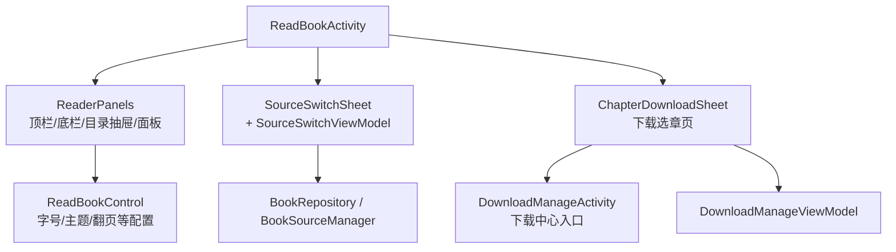
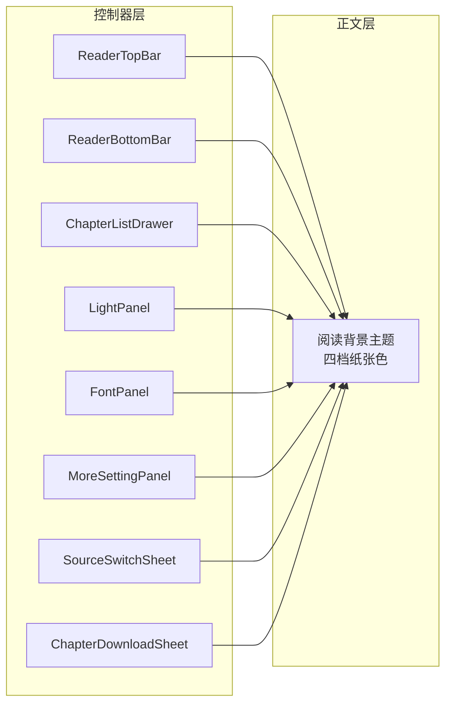
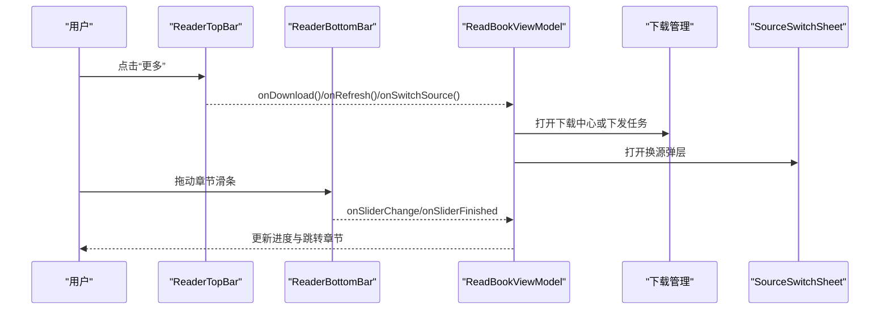
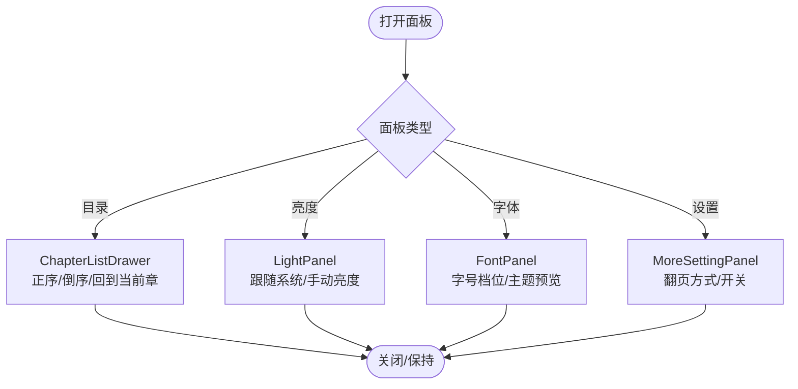
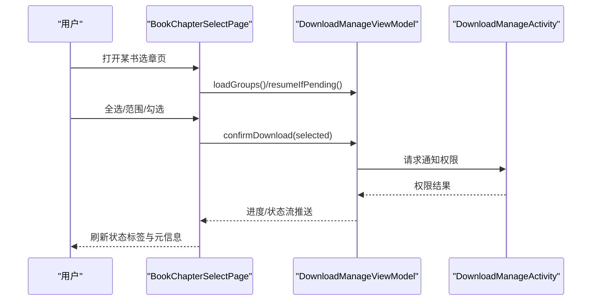
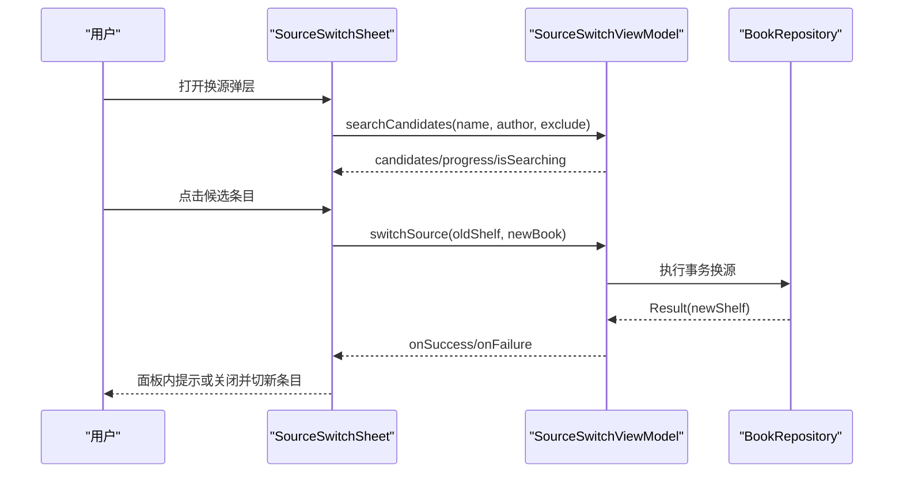
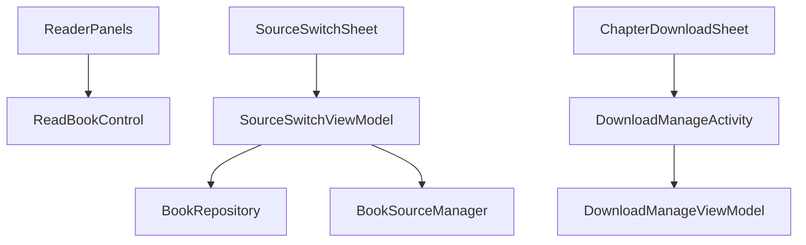

# 阅读界面组件

<cite>
**本文引用的文件**
- [ReaderPanels.kt](file://module_book/src/main/java/com/ebook/book/reader/ReaderPanels.kt)
- [SourceSwitchSheet.kt](file://module_book/src/main/java/com/ebook/book/reader/SourceSwitchSheet.kt)
- [SourceSwitchViewModel.kt](file://module_book/src/main/java/com/ebook/book/mvvm/viewmodel/SourceSwitchViewModel.kt)
- [ChapterDownloadSheet.kt](file://module_book/src/main/java/com/ebook/book/reader/ChapterDownloadSheet.kt)
- [DownloadManageActivity.kt](file://module_book/src/main/java/com/ebook/book/DownloadManageActivity.kt)
- [ReadBookControl.kt](file://module_book/src/main/java/com/ebook/book/view/ReadBookControl.kt)
</cite>

## 目录
1. [简介](#简介)
2. [项目结构](#项目结构)
3. [核心组件](#核心组件)
4. [架构总览](#架构总览)
5. [详细组件分析](#详细组件分析)
6. [依赖关系分析](#依赖关系分析)
7. [性能考量](#性能考量)
8. [故障排查指南](#故障排查指南)
9. [结论](#结论)

## 简介
本文件聚焦“阅读界面组件”的分层与交互设计：正文层使用“阅读背景主题”（四档纸张色，不随深浅色切换），控制器层（顶栏、底栏、面板、弹窗）继承全局主题，随系统外观深浅变化。重点说明 ReaderTopBar、ReaderBottomBar、ReaderPanel（章节目录抽屉、字体调节、亮度调节、更多设置）、ChapterDownloadSheet（下载管理）与 SourceSwitchSheet（书源切换）的功能与交互；并给出扩展面板、扩展下载管理与处理书源切换反馈的实践指引。最后总结组件间通过 ViewModel 共享状态、事件总线传递操作指令的通信机制。

## 项目结构
阅读界面相关代码集中在 module_book 的 reader 包与页面 Activity：
- 阅读器 chrome 与面板：ReaderPanels.kt
- 书源切换弹层：SourceSwitchSheet.kt + SourceSwitchViewModel.kt
- 下载中心两级页：ChapterDownloadSheet.kt + DownloadManageActivity.kt
- 阅读控制单例（字号/主题/翻页等）：ReadBookControl.kt

图示来源
- [ReaderPanels.kt:207-480](file://module_book/src/main/java/com/ebook/book/reader/ReaderPanels.kt#L207-L480)
- [SourceSwitchSheet.kt:68-192](file://module_book/src/main/java/com/ebook/book/reader/SourceSwitchSheet.kt#L68-L192)
- [SourceSwitchViewModel.kt:117-177](file://module_book/src/main/java/com/ebook/book/mvvm/viewmodel/SourceSwitchViewModel.kt#L117-L177)
- [ChapterDownloadSheet.kt:152-552](file://module_book/src/main/java/com/ebook/book/reader/ChapterDownloadSheet.kt#L152-L552)
- [DownloadManageActivity.kt:72-239](file://module_book/src/main/java/com/ebook/book/DownloadManageActivity.kt#L72-L239)

章节来源
- [ReaderPanels.kt:128-183](file://module_book/src/main/java/com/ebook/book/reader/ReaderPanels.kt#L128-L183)
- [SourceSwitchSheet.kt:48-66](file://module_book/src/main/java/com/ebook/book/reader/SourceSwitchSheet.kt#L48-L66)
- [ChapterDownloadSheet.kt:138-151](file://module_book/src/main/java/com/ebook/book/reader/ChapterDownloadSheet.kt#L138-L151)

## 核心组件
- 顶栏 ReaderTopBar：返回、章节标题/副标题、“更多”菜单（下载/刷新/换源/评论）。
- 底栏 ReaderBottomBar：进度文本、上一章/下一章按钮、章节滑条、四大入口（目录/亮度/字体/设置）。
- 面板系统：
  - 章节目录抽屉 ChapterListDrawer：左侧滑出，支持正序/倒序、快速滚动、回到当前章。
  - 亮度面板 LightPanel：跟随系统/手动亮度，实时百分比显示，持久化到 SP。
  - 字体面板 FontPanel：字号档位选择、阅读主题四档纸色预览。
  - 更多设置 MoreSettingPanel：翻页方式、按键/点击翻页开关。
- 下载管理 ChapterDownloadSheet：二级页按书展示章节列表，勾选/范围选择/批量下发，状态标签（缓存/排队/下载中）。
- 书源切换 SourceSwitchSheet：打开即搜索候选、进度条、匹配度标签、提交换源并反馈结果。

章节来源
- [ReaderPanels.kt:207-480](file://module_book/src/main/java/com/ebook/book/reader/ReaderPanels.kt#L207-L480)
- [ReaderPanels.kt:743-962](file://module_book/src/main/java/com/ebook/book/reader/ReaderPanels.kt#L743-L962)
- [ReaderPanels.kt:1303-1456](file://module_book/src/main/java/com/ebook/book/reader/ReaderPanels.kt#L1303-L1456)
- [ReaderPanels.kt:1473-1754](file://module_book/src/main/java/com/ebook/book/reader/ReaderPanels.kt#L1473-L1754)
- [ChapterDownloadSheet.kt:152-552](file://module_book/src/main/java/com/ebook/book/reader/ChapterDownloadSheet.kt#L152-L552)
- [SourceSwitchSheet.kt:68-192](file://module_book/src/main/java/com/ebook/book/reader/SourceSwitchSheet.kt#L68-L192)

## 架构总览
阅读界面采用“控制器层 + 正文层”分层：
- 正文层：使用 ReadBookControl 管理的阅读背景主题（四档纸张色），不受深浅主题影响。
- 控制器层：顶/底栏、面板、弹窗统一继承全局主题，随深浅模式变化。

图示来源
- [ReaderPanels.kt:207-480](file://module_book/src/main/java/com/ebook/book/reader/ReaderPanels.kt#L207-L480)
- [ReaderPanels.kt:1303-1456](file://module_book/src/main/java/com/ebook/book/reader/ReaderPanels.kt#L1303-L1456)
- [ReaderPanels.kt:1473-1754](file://module_book/src/main/java/com/ebook/book/reader/ReaderPanels.kt#L1473-L1754)
- [SourceSwitchSheet.kt:48-66](file://module_book/src/main/java/com/ebook/book/reader/SourceSwitchSheet.kt#L48-L66)

## 详细组件分析

### ReaderTopBar 与 ReaderBottomBar
- 顶栏：
  - 返回按钮、章节标题与书名副标题居中显示。
  - “更多”菜单根据书籍类型显隐：非本地书显示下载/刷新/换源，通用显示评论。
- 底栏：
  - 进度文本、自定义滑条（ReaderSlider）实现章节快进/快退。
  - 上一章/下一章圆形按钮，首末章禁用态明确。
  - 四个功能入口（目录/亮度/字体/设置）以胶囊高亮当前激活面板。

图示来源
- [ReaderPanels.kt:207-323](file://module_book/src/main/java/com/ebook/book/reader/ReaderPanels.kt#L207-L323)
- [ReaderPanels.kt:370-480](file://module_book/src/main/java/com/ebook/book/reader/ReaderPanels.kt#L370-L480)
- [ReaderPanels.kt:585-717](file://module_book/src/main/java/com/ebook/book/reader/ReaderPanels.kt#L585-L717)

章节来源
- [ReaderPanels.kt:207-323](file://module_book/src/main/java/com/ebook/book/reader/ReaderPanels.kt#L207-L323)
- [ReaderPanels.kt:370-480](file://module_book/src/main/java/com/ebook/book/reader/ReaderPanels.kt#L370-L480)
- [ReaderPanels.kt:585-717](file://module_book/src/main/java/com/ebook/book/reader/ReaderPanels.kt#L585-L717)

### ReaderPanel 面板系统
- 章节目录抽屉 ChapterListDrawer：
  - 左侧滑入，顶部书名与关闭按钮，工具行含章节总数、顺序切换（仅会话有效）、回到当前章。
  - 列表支持快速滚动条，当前章整行高亮。
- 亮度面板 LightPanel：
  - 数值行显示自动/百分比；滑条两端图标锚定方向语义；“跟随系统”开关即时生效。
  - 关闭时持久化到 SP；进入阅读器恢复手动亮度。
- 字体面板 FontPanel：
  - 字号档位以等宽数字胶囊呈现；阅读主题四档纸色以“底色纸片+预览字”展示。
  - 变更同步写 ReadBookControl 并回调外部重分页/刷新。
- 更多设置 MoreSettingPanel：
  - 翻页方式单选卡片（翻页/滚屏）；按键翻页/点击翻页开关行。
  - 选项即时写入 ReadBookControl 并回调通知。

图示来源
- [ReaderPanels.kt:743-962](file://module_book/src/main/java/com/ebook/book/reader/ReaderPanels.kt#L743-L962)
- [ReaderPanels.kt:1303-1456](file://module_book/src/main/java/com/ebook/book/reader/ReaderPanels.kt#L1303-L1456)
- [ReaderPanels.kt:1473-1754](file://module_book/src/main/java/com/ebook/book/reader/ReaderPanels.kt#L1473-L1754)

章节来源
- [ReaderPanels.kt:743-962](file://module_book/src/main/java/com/ebook/book/reader/ReaderPanels.kt#L743-L962)
- [ReaderPanels.kt:1303-1456](file://module_book/src/main/java/com/ebook/book/reader/ReaderPanels.kt#L1303-L1456)
- [ReaderPanels.kt:1473-1754](file://module_book/src/main/java/com/ebook/book/reader/ReaderPanels.kt#L1473-L1754)

### ChapterDownloadSheet 下载管理
- 二级页按书维度展示章节列表，每章显示状态标签（已缓存/排队中/下载中）。
- 支持全选、仅未缓存、范围选择、清除选择；主 FAB 展开勾选面板。
- 书头右侧提供取消本书、下载/暂停/继续三态主操作；超限软上限二次确认。
- 列表底部让位右下控件区与面板实测高度，避免遮挡末章。

图示来源
- [ChapterDownloadSheet.kt:152-552](file://module_book/src/main/java/com/ebook/book/reader/ChapterDownloadSheet.kt#L152-L552)
- [DownloadManageActivity.kt:122-239](file://module_book/src/main/java/com/ebook/book/DownloadManageActivity.kt#L122-L239)

章节来源
- [ChapterDownloadSheet.kt:152-552](file://module_book/src/main/java/com/ebook/book/reader/ChapterDownloadSheet.kt#L152-L552)
- [DownloadManageActivity.kt:122-239](file://module_book/src/main/java/com/ebook/book/DownloadManageActivity.kt#L122-L239)

### SourceSwitchSheet 书源切换
- 打开即基于当前书的书名/作者跨源聚合搜索，排除当前所属源。
- 候选列表按匹配度排序，显示匹配度标签（完全/部分/仅作者）。
- 提交换源：锁定单笔并发，失败在面板内提示并保留弹层供另选；成功将结果交宿主处理。
- 进度行展示各源完成比例，AllFinished 作为本轮结束判据。

图示来源
- [SourceSwitchSheet.kt:68-192](file://module_book/src/main/java/com/ebook/book/reader/SourceSwitchSheet.kt#L68-L192)
- [SourceSwitchViewModel.kt:117-177](file://module_book/src/main/java/com/ebook/book/mvvm/viewmodel/SourceSwitchViewModel.kt#L117-L177)

章节来源
- [SourceSwitchSheet.kt:68-192](file://module_book/src/main/java/com/ebook/book/reader/SourceSwitchSheet.kt#L68-L192)
- [SourceSwitchViewModel.kt:117-177](file://module_book/src/main/java/com/ebook/book/mvvm/viewmodel/SourceSwitchViewModel.kt#L117-L177)

### 添加新的设置面板（实践指引）
- 在 ReaderPanel 枚举新增面板类型，并在 ReaderBottomBar 的入口区域增加对应按钮与 activePanel 高亮逻辑。
- 新建 Composable 面板函数，复用 PanelSwitchRow/PanelChoiceRow/SheetHeader/CommonCard 等共享样式。
- 面板状态与持久化：
  - 读/写 ReadBookControl 的相应属性（如字号/主题/翻页模式）。
  - 必要时读写 SP 键值，遵循现有命名约定与迁移策略。
- 从 ReaderBottomBar 的 onXxx 回调触发面板显示，由宿主组合体负责状态持有与面板显隐。

章节来源
- [ReaderPanels.kt:128-183](file://module_book/src/main/java/com/ebook/book/reader/ReaderPanels.kt#L128-L183)
- [ReaderPanels.kt:370-480](file://module_book/src/main/java/com/ebook/book/reader/ReaderPanels.kt#L370-L480)
- [ReaderPanels.kt:1303-1456](file://module_book/src/main/java/com/ebook/book/reader/ReaderPanels.kt#L1303-L1456)
- [ReaderPanels.kt:1473-1754](file://module_book/src/main/java/com/ebook/book/reader/ReaderPanels.kt#L1473-L1754)
- [ReadBookControl.kt](file://module_book/src/main/java/com/ebook/book/view/ReadBookControl.kt)

### 扩展下载管理功能（实践指引）
- 在 BookChapterSelectPage 中接入新的筛选工具或动作：
  - 在 DownloadActionPanel 增加按钮，绑定 onSelectXxx 回调。
  - 若涉及书级操作，移至 BookHeaderActions，保持坐标恒定。
- 状态与进度：
  - 通过 DownloadManageViewModel 的状态流（downloadState/groups/step）驱动 UI 刷新。
  - 确认下载前进行权限申请（POST_NOTIFICATIONS），失败仍允许重试。
- 大选中保护：
  - 超过软上限时弹出二次确认对话框，确认后才会下发。

章节来源
- [ChapterDownloadSheet.kt:245-552](file://module_book/src/main/java/com/ebook/book/reader/ChapterDownloadSheet.kt#L245-L552)
- [DownloadManageActivity.kt:122-239](file://module_book/src/main/java/com/ebook/book/DownloadManageActivity.kt#L122-L239)

### 处理书源切换的用户反馈（实践指引）
- 面板内联提示：
  - 搜索失败、目标无效、已在书架等错误由 SourceSwitchSheet 渲染错误文案，不关闭弹层以便用户继续操作。
- 换源结果：
  - 成功时返回 SourceSwitchOutcome，宿主据此提示“已跳到第 X 章/落到最后一章”。
  - 失败时保留弹层并提示原因，用户可另选一本。
- 并发与进度：
  - pendingUrl 保证一次只允许一笔换源；进度行使用 CandidateProgress 表达“已完成/总数”。

章节来源
- [SourceSwitchSheet.kt:90-192](file://module_book/src/main/java/com/ebook/book/reader/SourceSwitchSheet.kt#L90-L192)
- [SourceSwitchViewModel.kt:150-177](file://module_book/src/main/java/com/ebook/book/mvvm/viewmodel/SourceSwitchViewModel.kt#L150-L177)

## 依赖关系分析
- 控制器层（ReaderTopBar/ReaderBottomBar/面板）通过宿主 Activity/Composable 持有状态，调用 ViewModel 或仓库接口。
- SourceSwitchSheet 依赖 SourceSwitchViewModel，后者聚合多源搜索结果并执行换源事务。
- ChapterDownloadSheet 与 DownloadManageActivity 协作，前者负责二级页展示与交互，后者负责一级列表与直达流程。
- 所有面板与 chrome 共享 ReadBookControl 的配置（字号/主题/翻页模式等）。

图示来源
- [SourceSwitchViewModel.kt:51-54](file://module_book/src/main/java/com/ebook/book/mvvm/viewmodel/SourceSwitchViewModel.kt#L51-L54)
- [SourceSwitchSheet.kt:68-192](file://module_book/src/main/java/com/ebook/book/reader/SourceSwitchSheet.kt#L68-L192)
- [ChapterDownloadSheet.kt:152-552](file://module_book/src/main/java/com/ebook/book/reader/ChapterDownloadSheet.kt#L152-L552)
- [DownloadManageActivity.kt:72-239](file://module_book/src/main/java/com/ebook/book/DownloadManageActivity.kt#L72-L239)
- [ReaderPanels.kt:1473-1754](file://module_book/src/main/java/com/ebook/book/reader/ReaderPanels.kt#L1473-L1754)

章节来源
- [SourceSwitchViewModel.kt:51-54](file://module_book/src/main/java/com/ebook/book/mvvm/viewmodel/SourceSwitchViewModel.kt#L51-L54)
- [SourceSwitchSheet.kt:68-192](file://module_book/src/main/java/com/ebook/book/reader/SourceSwitchSheet.kt#L68-L192)
- [ChapterDownloadSheet.kt:152-552](file://module_book/src/main/java/com/ebook/book/reader/ChapterDownloadSheet.kt#L152-L552)
- [DownloadManageActivity.kt:72-239](file://module_book/src/main/java/com/ebook/book/DownloadManageActivity.kt#L72-L239)
- [ReaderPanels.kt:1473-1754](file://module_book/src/main/java/com/ebook/book/reader/ReaderPanels.kt#L1473-L1754)

## 性能考量
- 长目录体验：
  - 章节目录与下载章节列表均使用 LazyColumn，结合 ReaderFastScroll 实现快速定位。
  - 列表项无 key 或稳定 key 策略确保翻转顺序时不丢失位置。
- 自定义滑条 ReaderSlider：
  - 固定静止态旋钮直径作为映射基准，避免按下放大导致取值抖动。
- 面板状态与重组：
  - 面板内局部状态（如 descending、selected）使用 remember 管理，减少不必要重组。
  - 进度与候选数据经 StateFlow 增量合并，避免阻塞等待全部源返回。

章节来源
- [ReaderPanels.kt:585-717](file://module_book/src/main/java/com/ebook/book/reader/ReaderPanels.kt#L585-L717)
- [ReaderPanels.kt:743-962](file://module_book/src/main/java/com/ebook/book/reader/ReaderPanels.kt#L743-L962)
- [ChapterDownloadSheet.kt:245-552](file://module_book/src/main/java/com/ebook/book/reader/ChapterDownloadSheet.kt#L245-L552)
- [SourceSwitchViewModel.kt:182-237](file://module_book/src/main/java/com/ebook/book/mvvm/viewmodel/SourceSwitchViewModel.kt#L182-L237)

## 故障排查指南
- 面板异常：
  - 检查 ReaderPanel 枚举是否包含新面板类型，以及 ReaderBottomBar 是否注册入口与 activePanel 高亮。
  - 面板内状态是否与 ReadBookControl 同步，必要时检查 SP 键值与读取默认值。
- 下载问题：
  - 确认通知权限请求与权限回调；队列任务是否在冷启动续跑。
  - 检查二级页状态（Loading/Absent/Failed/Ready）与状态流推送是否生效。
- 书源切换：
  - 候选搜索是否被取消（新一轮搜索会取消旧 Job），失败是否落入 searchFailure。
  - 换源失败时面板是否保留并提供错误提示，成功是否返回 SourceSwitchOutcome。

章节来源
- [ReaderPanels.kt:128-183](file://module_book/src/main/java/com/ebook/book/reader/ReaderPanels.kt#L128-L183)
- [ReaderPanels.kt:1303-1456](file://module_book/src/main/java/com/ebook/book/reader/ReaderPanels.kt#L1303-L1456)
- [ChapterDownloadSheet.kt:152-229](file://module_book/src/main/java/com/ebook/book/reader/ChapterDownloadSheet.kt#L152-L229)
- [DownloadManageActivity.kt:122-239](file://module_book/src/main/java/com/ebook/book/DownloadManageActivity.kt#L122-L239)
- [SourceSwitchSheet.kt:90-192](file://module_book/src/main/java/com/ebook/book/reader/SourceSwitchSheet.kt#L90-L192)
- [SourceSwitchViewModel.kt:117-177](file://module_book/src/main/java/com/ebook/book/mvvm/viewmodel/SourceSwitchViewModel.kt#L117-L177)

## 结论
阅读界面通过清晰的“控制器层 + 正文层”分层，实现了主题隔离与一致的交互体验。顶/底栏与面板系统提供丰富的阅读控制能力；下载管理与书源切换分别以独立弹层/活动承载复杂业务。组件间通过 ViewModel 共享状态、事件流驱动刷新，保证状态一致性与可扩展性。新增面板或功能时，遵循既有共享样式与状态管理模式，即可无缝融入现有体系。