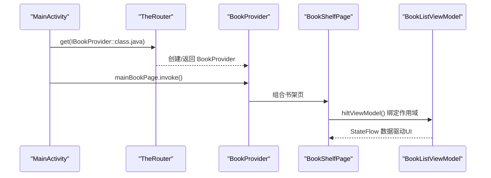
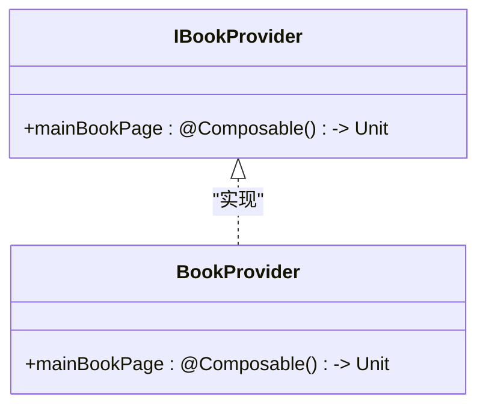
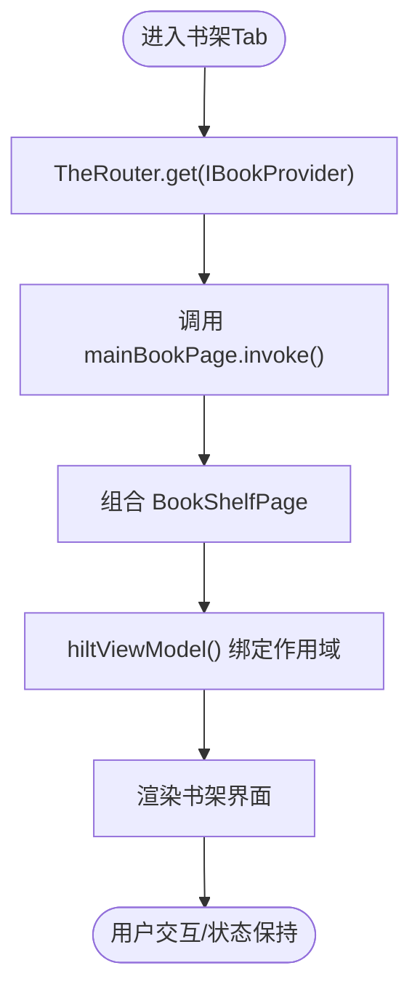
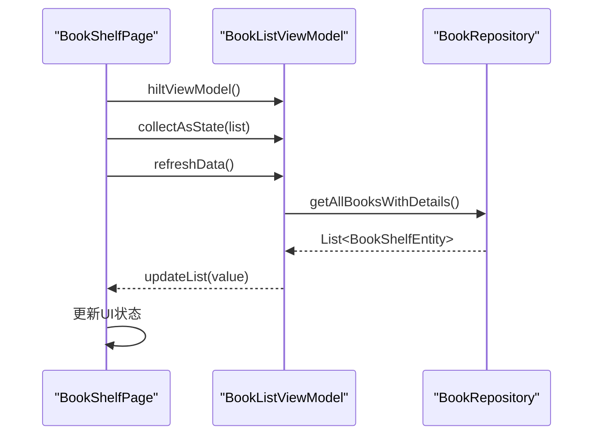
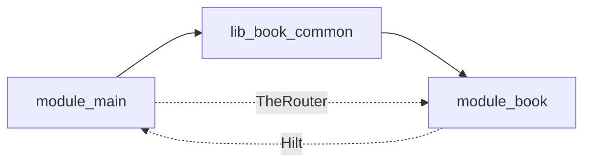

# IBookProvider（书架模块）

<cite>
**本文引用的文件**
- [IBookProvider.kt](file://lib_book_common/src/main/java/com/ebook/common/provider/IBookProvider.kt)
- [BookProvider.kt](file://module_book/src/main/java/com/ebook/book/provider/BookProvider.kt)
- [MainActivity.kt](file://module_main/src/main/java/com/ebook/main/MainActivity.kt)
- [BookShelfPage.kt](file://module_book/src/main/java/com/ebook/book/page/BookShelfPage.kt)
- [BookListViewModel.kt](file://module_book/src/main/java/com/ebook/book/mvvm/viewmodel/BookListViewModel.kt)
</cite>

## 目录
1. [简介](#简介)
2. [项目结构定位](#项目结构定位)
3. [核心组件](#核心组件)
4. [架构总览](#架构总览)
5. [详细组件分析](#详细组件分析)
6. [依赖关系分析](#依赖关系分析)
7. [性能与状态保持](#性能与状态保持)
8. [故障排查指南](#故障排查指南)
9. [结论](#结论)
10. [附录：新增书架相关 Provider 的步骤](#附录新增书架相关-provider-的步骤)

## 简介
IBookProvider 是书架模块对外暴露的页面级服务接口，用于在宿主模块（module_main）中通过 TheRouter 动态获取并组合书架主页面 Composable。它遵循“跨模块通信通过 Provider 接口 + @ServiceProvider 注册 + NavHost 直接组合”的统一约定，使功能模块与宿主解耦、可独立运行或集成构建。

## 项目结构定位
- 接口定义位于共享库 lib_book_common 的 provider 包，供所有模块引用。
- 实现类位于业务模块 module_book 的 provider 包，使用 @ServiceProvider 注解向 TheRouter 注册。
- 宿主 module_main 的 MainActivity 在 NavHost 中通过 TheRouter.get() 获取该 Provider，并调用其 mainBookPage 属性进行组合。

```mermaid
graph TB
    A["module_main<br/>MainActivity"] -->|TheRouter.get(IBookProvider)| B["module_book<br/>BookProvider"]
    B --> C["module_book<br/>BookShelfPage"]
    C --> D["module_book<br/>BookListViewModel"]
```

**图表来源**
- [MainActivity.kt:175-197](file://module_main/src/main/java/com/ebook/main/MainActivity.kt#L175-L197)
- [BookProvider.kt:8-15](file://module_book/src/main/java/com/ebook/book/provider/BookProvider.kt#L8-L15)
- [BookShelfPage.kt:76-177](file://module_book/src/main/java/com/ebook/book/page/BookShelfPage.kt#L76-L177)
- [BookListViewModel.kt:27-68](file://module_book/src/main/java/com/ebook/book/mvvm/viewmodel/BookListViewModel.kt#L27-L68)

**章节来源**
- [IBookProvider.kt:1-13](file://lib_book_common/src/main/java/com/ebook/common/provider/IBookProvider.kt#L1-L13)
- [BookProvider.kt:1-15](file://module_book/src/main/java/com/ebook/book/provider/BookProvider.kt#L1-L15)
- [MainActivity.kt:175-197](file://module_main/src/main/java/com/ebook/main/MainActivity.kt#L175-L197)

## 核心组件
- IBookProvider：声明 mainBookPage 为 Composable 函数类型，作为跨模块页面能力契约。
- BookProvider：实现 IBookProvider，将 mainBookPage 指向书架页 BookShelfPage，并通过 @ServiceProvider 注册到 TheRouter。
- BookShelfPage：书架页 Composable，负责 UI 渲染、下拉刷新、导入与下载入口、列表展示等。
- BookListViewModel：提供书架数据流、事件收集、刷新逻辑；由 Hilt 管理生命周期与作用域。
- MainActivity（module_main）：作为三个 Tab 的宿主容器，NavHost 中按路由组合各 Provider 暴露的 Composable。

**章节来源**
- [IBookProvider.kt:5-13](file://lib_book_common/src/main/java/com/ebook/common/provider/IBookProvider.kt#L5-L13)
- [BookProvider.kt:8-15](file://module_book/src/main/java/com/ebook/book/provider/BookProvider.kt#L8-L15)
- [BookShelfPage.kt:66-177](file://module_book/src/main/java/com/ebook/book/page/BookShelfPage.kt#L66-L177)
- [BookListViewModel.kt:16-68](file://module_book/src/main/java/com/ebook/book/mvvm/viewmodel/BookListViewModel.kt#L16-L68)
- [MainActivity.kt:139-197](file://module_main/src/main/java/com/ebook/main/MainActivity.kt#L139-L197)

## 架构总览
IBookProvider 是跨模块通信的关键枢纽：
- 接口定义在共享库，避免模块间强耦合。
- 实现类通过 @ServiceProvider 由 TheRouter 管理实例化与查找。
- 宿主通过 TheRouter.get() 获取 Provider，再调用 mainBookPage 进行组合，无需知道具体实现类。
- 页面状态通过 Compose 的 hiltViewModel() 绑定到当前 NavBackStackEntry，切 Tab 时保留状态，退出返回栈时销毁。



**图表来源**
- [MainActivity.kt:185-193](file://module_main/src/main/java/com/ebook/main/MainActivity.kt#L185-L193)
- [BookProvider.kt:8-15](file://module_book/src/main/java/com/ebook/book/provider/BookProvider.kt#L8-L15)
- [BookShelfPage.kt:76-89](file://module_book/src/main/java/com/ebook/book/page/BookShelfPage.kt#L76-L89)
- [BookListViewModel.kt:27-68](file://module_book/src/main/java/com/ebook/book/mvvm/viewmodel/BookListViewModel.kt#L27-L68)

## 详细组件分析

### IBookProvider 接口
- 职责：暴露书架主页面 Composable 能力，供宿主直接组合。
- 设计要点：
  - 返回类型为 @Composable () -> Unit，确保宿主以 Compose 方式组合。
  - 注释明确 ViewModel 作用域绑定到调用处的 NavBackStackEntry，由 hiltViewModel 默认行为保证。

**章节来源**
- [IBookProvider.kt:5-13](file://lib_book_common/src/main/java/com/ebook/common/provider/IBookProvider.kt#L5-L13)

### BookProvider 实现类
- 职责：实现 IBookProvider，将 mainBookPage 指向 BookShelfPage。
- 注册机制：使用 @ServiceProvider 注解，由 TheRouter 在服务提供者容器中注册该类，运行时可通过 TheRouter.get() 获取实例。
- 组合方式：mainBookPage 是一个无参 Composable lambda，宿主调用 invoke() 即组合书架页。



**图表来源**
- [IBookProvider.kt:11-13](file://lib_book_common/src/main/java/com/ebook/common/provider/IBookProvider.kt#L11-L13)
- [BookProvider.kt:8-15](file://module_book/src/main/java/com/ebook/book/provider/BookProvider.kt#L8-L15)

**章节来源**
- [BookProvider.kt:8-15](file://module_book/src/main/java/com/ebook/book/provider/BookProvider.kt#L8-L15)

### MainActivity 中的组合流程
- 宿主在 NavHost 中为每个 Tab 注册路由，并在 composable 块内通过 TheRouter.get() 获取对应 Provider。
- 对书架 Tab，调用 IBookProvider.mainBookPage.invoke() 完成组合。
- ViewModel 作用域由 hiltViewModel() 自动绑定到当前 NavBackStackEntry，实现状态保持与生命周期管理。



**图表来源**
- [MainActivity.kt:185-193](file://module_main/src/main/java/com/ebook/main/MainActivity.kt#L185-L193)
- [BookShelfPage.kt:76-89](file://module_book/src/main/java/com/ebook/book/page/BookShelfPage.kt#L76-L89)

**章节来源**
- [MainActivity.kt:175-197](file://module_main/src/main/java/com/ebook/main/MainActivity.kt#L175-L197)

### BookShelfPage 与 BookListViewModel
- BookShelfPage：
  - 使用 hiltViewModel() 获取 BookListViewModel，绑定到当前组合作用域。
  - 通过 collectAsState 订阅 ViewModel 的数据流，驱动 UI 更新。
  - 处理下拉刷新、导入本地书、跳转详情页等操作。
- BookListViewModel：
  - 继承 BaseRefreshViewModel，封装刷新逻辑。
  - 收集书架变化事件（添加、删除、进度更新、目录变更），统一触发 refreshData。
  - 通过 repository 获取书架数据，更新列表状态。



**图表来源**
- [BookShelfPage.kt:76-104](file://module_book/src/main/java/com/ebook/book/page/BookShelfPage.kt#L76-L104)
- [BookListViewModel.kt:36-68](file://module_book/src/main/java/com/ebook/book/mvvm/viewmodel/BookListViewModel.kt#L36-L68)

**章节来源**
- [BookShelfPage.kt:66-177](file://module_book/src/main/java/com/ebook/book/page/BookShelfPage.kt#L66-L177)
- [BookListViewModel.kt:16-68](file://module_book/src/main/java/com/ebook/book/mvvm/viewmodel/BookListViewModel.kt#L16-L68)

## 依赖关系分析
- 模块依赖方向：module_main → lib_book_common（接口）→ module_book（实现）。
- 运行时依赖：TheRouter 负责 Provider 的发现与实例化；Hilt 负责 ViewModel 的作用域注入。
- 解耦优势：宿主不感知具体实现类，仅依赖接口；功能模块可独立开发测试，集成时通过 TheRouter 装配。



**图表来源**
- [MainActivity.kt:185-193](file://module_main/src/main/java/com/ebook/main/MainActivity.kt#L185-L193)
- [BookProvider.kt:8-15](file://module_book/src/main/java/com/ebook/book/provider/BookProvider.kt#L8-L15)

**章节来源**
- [IBookProvider.kt:1-13](file://lib_book_common/src/main/java/com/ebook/common/provider/IBookProvider.kt#L1-L13)
- [BookProvider.kt:1-15](file://module_book/src/main/java/com/ebook/book/provider/BookProvider.kt#L1-L15)
- [MainActivity.kt:175-197](file://module_main/src/main/java/com/ebook/main/MainActivity.kt#L175-L197)

## 性能与状态保持
- 状态保持：通过 NavHost 的 popUpTo/saveState/restoreState 配置，切换 Tab 时保留页面状态；ViewModel 随 NavBackStackEntry 生命周期管理，避免重复加载。
- 性能优化：
  - 列表使用 LazyColumn，仅渲染可见项。
  - 数据流通过 StateFlow 收集，避免内存泄漏。
  - 刷新逻辑幂等，支持手动下拉与事件驱动刷新。

**章节来源**
- [MainActivity.kt:160-168](file://module_main/src/main/java/com/ebook/main/MainActivity.kt#L160-L168)
- [BookShelfPage.kt:146-174](file://module_book/src/main/java/com/ebook/book/page/BookShelfPage.kt#L146-L174)
- [BookListViewModel.kt:36-68](file://module_book/src/main/java/com/ebook/book/mvvm/viewmodel/BookListViewModel.kt#L36-L68)

## 故障排查指南
- 问题：书架页不显示或白屏
  - 检查 BookProvider 是否正确标注 @ServiceProvider
  - 确认 TheRouter.get(IBookProvider) 是否返回非空
  - 验证 BookShelfPage 是否被正确组合
- 问题：数据不刷新
  - 检查 BookListViewModel.refreshData() 是否被调用
  - 确认 BookRepository 数据源是否正常
  - 查看日志输出是否有异常捕获
- 问题：状态丢失
  - 检查 NavHost 配置是否启用 saveState/restoreState
  - 确认 ViewModel 作用域是否绑定到 NavBackStackEntry

**章节来源**
- [BookProvider.kt:8-15](file://module_book/src/main/java/com/ebook/book/provider/BookProvider.kt#L8-L15)
- [MainActivity.kt:185-193](file://module_main/src/main/java/com/ebook/main/MainActivity.kt#L185-L193)
- [BookListViewModel.kt:54-68](file://module_book/src/main/java/com/ebook/book/mvvm/viewmodel/BookListViewModel.kt#L54-L68)

## 结论
IBookProvider 通过简洁的接口设计与 TheRouter + Hilt 的组合模式，实现了书架模块与宿主的松耦合集成。它提供了清晰的跨模块通信边界，支持独立开发与集成构建，同时保证了页面状态的正确管理与性能优化。

## 附录：新增书架相关 Provider 的步骤
1. 在 lib_book_common 中定义新的 Provider 接口，声明需要暴露的 Composable 能力。
2. 在 module_book 中实现该接口，使用 @ServiceProvider 注解注册。
3. 在宿主 module_main 的 MainActivity 中，通过 TheRouter.get() 获取新 Provider 并组合对应页面。
4. 为新页面编写 Composable 与 ViewModel，使用 hiltViewModel() 绑定作用域。
5. 在 NavHost 中注册新路由，确保状态保存与恢复配置正确。
6. 测试独立模式与集成模式的兼容性，验证 TheRouter 路由解析正常。

**章节来源**
- [IBookProvider.kt:5-13](file://lib_book_common/src/main/java/com/ebook/common/provider/IBookProvider.kt#L5-L13)
- [BookProvider.kt:8-15](file://module_book/src/main/java/com/ebook/book/provider/BookProvider.kt#L8-L15)
- [MainActivity.kt:185-193](file://module_main/src/main/java/com/ebook/main/MainActivity.kt#L185-L193)