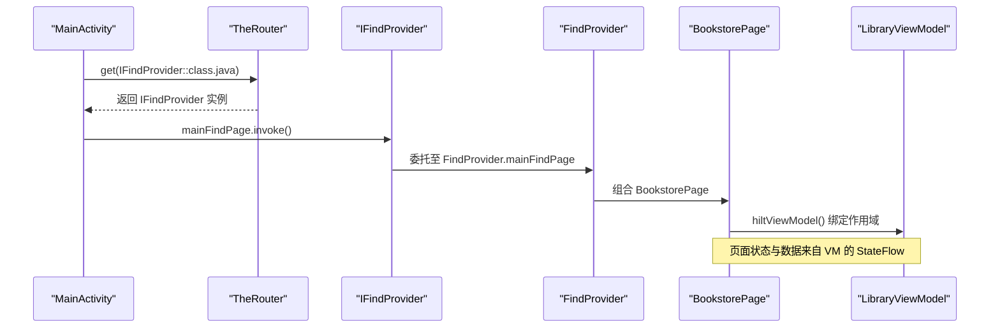
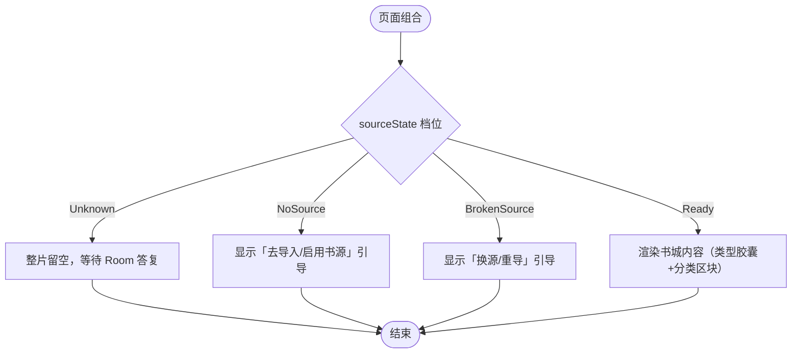
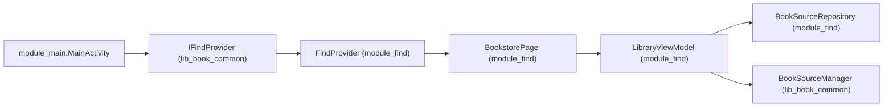

# IFindProvider（书城模块）

<cite>
**本文引用的文件**
- [IFindProvider.kt](file://lib_book_common/src/main/java/com/ebook/common/provider/IFindProvider.kt)
- [FindProvider.kt](file://module_find/src/main/java/com/ebook/find/provider/FindProvider.kt)
- [MainActivity.kt](file://module_main/src/main/java/com/ebook/main/MainActivity.kt)
- [BookstorePage.kt](file://module_find/src/main/java/com/ebook/find/page/BookstorePage.kt)
- [LibraryViewModel.kt](file://module_find/src/main/java/com/ebook/find/mvvm/viewmodel/LibraryViewModel.kt)
- [IBookProvider.kt](file://lib_book_common/src/main/java/com/ebook/common/provider/IBookProvider.kt)
- [IMeProvider.kt](file://lib_book_common/src/main/java/com/ebook/common/provider/IMeProvider.kt)
- [BookProvider.kt](file://module_book/src/main/java/com/ebook/book/provider/BookProvider.kt)
</cite>

## 目录
1. [简介](#简介)
2. [项目结构定位](#项目结构定位)
3. [核心组件](#核心组件)
4. [架构总览](#架构总览)
5. [详细组件分析](#详细组件分析)
6. [依赖关系分析](#依赖关系分析)
7. [性能与行为要点](#性能与行为要点)
8. [故障排查指南](#故障排查指南)
9. [结论](#结论)
10. [附录：实现新 Provider 的示例路径](#附录实现新-provider的示例路径)

## 简介
IFindProvider 是书城模块对外暴露的跨模块通信契约，用于在宿主 module_main 中以 TheRouter SPI 机制动态获取书城页面并直接组合 Compose UI。该模式与书架、个人中心保持一致：各业务模块只暴露“返回 Composable 的函数”，由宿主统一装配到 NavHost；页面 ViewModel 通过 hiltViewModel 绑定到调用处的 NavBackStackEntry，从而获得正确的生命周期与作用域。

## 项目结构定位
- 契约定义位于共享层 lib_book_common/provider/IFindProvider.kt
- 具体实现位于书城模块 module_find/provider/FindProvider.kt，并通过 TheRouter 的 @ServiceProvider 注册
- 宿主 module_main 在 MainActivity.kt 中通过 TheRouter.get(IFindProvider::class.java) 取回 Provider 并组合 mainFindPage
- 书城页面 BookstorePage.kt 使用 LibraryViewModel.kt 作为数据与状态中心，遵循 MVVM + Coroutines Flow

```mermaid
graph TB
    A["module_main<br/>MainActivity"] -->|TheRouter.get(IFindProvider)| B["IFindProvider 接口<br/>lib_book_common"]
    B --> C["FindProvider 实现<br/>module_find"]
    C --> D["BookstorePage<br/>module_find"]
    D --> E["LibraryViewModel<br/>module_find"]
```

图示来源
- [MainActivity.kt:184-195](file://module_main/src/main/java/com/ebook/main/MainActivity.kt#L184-L195)
- [IFindProvider.kt:5-13](file://lib_book_common/src/main/java/com/ebook/common/provider/IFindProvider.kt#L5-L13)
- [FindProvider.kt:8-18](file://module_find/src/main/java/com/ebook/find/provider/FindProvider.kt#L8-L18)
- [BookstorePage.kt:84-139](file://module_find/src/main/java/com/ebook/find/page/BookstorePage.kt#L84-L139)
- [LibraryViewModel.kt:102-167](file://module_find/src/main/java/com/ebook/find/mvvm/viewmodel/LibraryViewModel.kt#L102-L167)

章节来源
- [IFindProvider.kt:5-13](file://lib_book_common/src/main/java/com/ebook/common/provider/IFindProvider.kt#L5-L13)
- [FindProvider.kt:8-18](file://module_find/src/main/java/com/ebook/find/provider/FindProvider.kt#L8-L18)
- [MainActivity.kt:184-195](file://module_main/src/main/java/com/ebook/main/MainActivity.kt#L184-L195)

## 核心组件
- IFindProvider：定义 mainFindPage 属性，类型为无参 Composable 工厂，供宿主直接组合
- FindProvider：实现 IFindProvider，将 mainFindPage 指向 BookstorePage，并使用 @ServiceProvider 注册到 TheRouter 服务容器
- MainActivity：在底部 Tab 的 NavGraph 中为“书城”路由注册 composable，并在其中通过 TheRouter.get(IFindProvider::class.java) 获取 Provider 并调用 mainFindPage
- BookstorePage：书城主界面，使用 hiltViewModel() 绑定 LibraryViewModel 的状态流，处理刷新、书源切换与内容渲染
- LibraryViewModel：负责书源默认源订阅、书库数据加载策略、错误态判定（Unknown/Ready/NoSource/BrokenSource）

章节来源
- [IFindProvider.kt:5-13](file://lib_book_common/src/main/java/com/ebook/common/provider/IFindProvider.kt#L5-L13)
- [FindProvider.kt:8-18](file://module_find/src/main/java/com/ebook/find/provider/FindProvider.kt#L8-L18)
- [BookstorePage.kt:84-139](file://module_find/src/main/java/com/ebook/find/page/BookstorePage.kt#L84-L139)
- [LibraryViewModel.kt:102-167](file://module_find/src/main/java/com/ebook/find/mvvm/viewmodel/LibraryViewModel.kt#L102-L167)

## 架构总览
跨模块通信采用“接口契约 + TheRouter 服务提供者”的模式：
- 契约在共享库定义（IFindProvider），保证宿主与业务模块解耦
- 业务模块提供实现（FindProvider），并以 @ServiceProvider 注册
- 宿主在运行时通过 TheRouter.get(接口类) 解析到具体实现，避免编译期耦合
- 页面以 Composable 形式暴露，宿主 NavHost 直接组合，ViewModel 作用域由 hiltViewModel 自动绑定到当前 NavBackStackEntry



图示来源
- [MainActivity.kt:184-195](file://module_main/src/main/java/com/ebook/main/MainActivity.kt#L184-L195)
- [FindProvider.kt:8-18](file://module_find/src/main/java/com/ebook/find/provider/FindProvider.kt#L8-L18)
- [BookstorePage.kt:84-139](file://module_find/src/main/java/com/ebook/find/page/BookstorePage.kt#L84-L139)
- [LibraryViewModel.kt:102-167](file://module_find/src/main/java/com/ebook/find/mvvm/viewmodel/LibraryViewModel.kt#L102-L167)

## 详细组件分析

### IFindProvider 接口设计
- 目的：暴露书城主入口的 Composable 工厂，使宿主无需感知具体实现即可组合书城页面
- 约束：仅暴露一个属性 mainFindPage，类型为无参 Composable 工厂，便于在 NavHost 中直接 invoke
- 约定：页面 ViewModel 作用域绑定调用处的 NavBackStackEntry（hiltViewModel 默认行为），切 Tab 时保留状态、退出时销毁

章节来源
- [IFindProvider.kt:5-13](file://lib_book_common/src/main/java/com/ebook/common/provider/IFindProvider.kt#L5-L13)

### FindProvider 实现与注册
- 职责：实现 IFindProvider，将 mainFindPage 指向 BookstorePage
- 注册方式：使用 @ServiceProvider 注解，交由 TheRouter 在构建期扫描注册，运行时可通过 TheRouter.get(接口类) 获取
- 注意事项：每次组合都会创建新的页面实例，确保 ViewModel 与 NavBackStackEntry 正确绑定

章节来源
- [FindProvider.kt:8-18](file://module_find/src/main/java/com/ebook/find/provider/FindProvider.kt#L8-L18)

### MainActivity 中的组合方式
- 路由位置：在 MainScreen 的 NavHost 中为“书城”路由注册 composable
- 获取 Provider：通过 TheRouter.get(IFindProvider::class.java) 获取实现，若为空则安全调用链保护
- 组合页面：调用 mainFindPage.invoke()，将书城页面嵌入宿主导航图
- 作用域绑定：由于 BookstorePage 内部使用 hiltViewModel()，因此 ViewModel 的生命周期与当前 Tab 的回退栈项一致

章节来源
- [MainActivity.kt:184-195](file://module_main/src/main/java/com/ebook/main/MainActivity.kt#L184-L195)

### BookstorePage 与 LibraryViewModel 的数据绑定
- 页面职责：展示书城顶部工具栏、书源切换胶囊、分类与书籍列表，处理下拉刷新与空态引导
- ViewModel 职责：
  - currentSource：订阅默认书源（Room 查询），首帧为 null，表示 Unknown 占位
  - sources：可用书源候选（启用中的源）
  - sourceState：综合 currentSource 与解析可用性推导出的页面档位（Unknown/Ready/NoSource/BrokenSource）
  - list/bookTypeList：书库与分类入口数据流
- 状态驱动：页面根据 sourceState 决定渲染书库内容或引导文案，避免误报“无源”或“已失效”



图示来源
- [LibraryViewModel.kt:159-167](file://module_find/src/main/java/com/ebook/find/mvvm/viewmodel/LibraryViewModel.kt#L159-L167)
- [BookstorePage.kt:263-356](file://module_find/src/main/java/com/ebook/find/page/BookstorePage.kt#L263-L356)

章节来源
- [BookstorePage.kt:84-139](file://module_find/src/main/java/com/ebook/find/page/BookstorePage.kt#L84-L139)
- [LibraryViewModel.kt:102-167](file://module_find/src/main/java/com/ebook/find/mvvm/viewmodel/LibraryViewModel.kt#L102-L167)

### 与书架模块相同的跨模块通信模式
- 书架模块通过 IBookProvider 暴露 mainBookPage，实现为 BookProvider，并由 @ServiceProvider 注册
- 宿主 MainActivity 同样通过 TheRouter.get(IBookProvider::class.java) 获取并组合书架页面
- 该模式与 IFindProvider 完全一致，体现统一的跨模块通信规范

章节来源
- [IBookProvider.kt:5-13](file://lib_book_common/src/main/java/com/ebook/common/provider/IBookProvider.kt#L5-L13)
- [BookProvider.kt:8-15](file://module_book/src/main/java/com/ebook/book/provider/BookProvider.kt#L8-L15)
- [MainActivity.kt:184-195](file://module_main/src/main/java/com/ebook/main/MainActivity.kt#L184-L195)

## 依赖关系分析
- 宿主 module_main 依赖共享库 lib_book_common 中的 Provider 接口
- 业务模块 module_find 依赖共享库 lib_book_common 的接口定义，并实现对应 Provider
- 运行时通过 TheRouter 将接口与实现解耦，避免编译期强依赖
- ViewModel 通过 Hilt 注入仓库与管理器，数据流经 StateFlow 驱动 UI



图示来源
- [MainActivity.kt:184-195](file://module_main/src/main/java/com/ebook/main/MainActivity.kt#L184-L195)
- [FindProvider.kt:8-18](file://module_find/src/main/java/com/ebook/find/provider/FindProvider.kt#L8-L18)
- [BookstorePage.kt:84-139](file://module_find/src/main/java/com/ebook/find/page/BookstorePage.kt#L84-L139)
- [LibraryViewModel.kt:102-167](file://module_find/src/main/java/com/ebook/find/mvvm/viewmodel/LibraryViewModel.kt#L102-L167)

章节来源
- [MainActivity.kt:184-195](file://module_main/src/main/java/com/ebook/main/MainActivity.kt#L184-L195)
- [FindProvider.kt:8-18](file://module_find/src/main/java/com/ebook/find/provider/FindProvider.kt#L8-L18)
- [BookstorePage.kt:84-139](file://module_find/src/main/java/com/ebook/find/page/BookstorePage.kt#L84-L139)
- [LibraryViewModel.kt:102-167](file://module_find/src/main/java/com/ebook/find/mvvm/viewmodel/LibraryViewModel.kt#L102-L167)

## 性能与行为要点
- 首帧占位：未知状态（Unknown）下整片留空，避免误导用户
- 缓存策略：书库加载采用 SWR 策略，首次进页秒开，过期后静默重抓；下拉刷新强制网络
- 作用域绑定：hiltViewModel 绑定到 NavBackStackEntry，Tab 切换保留状态，退出销毁
- 空态分支穷尽：页面按 sourceState 严格分支，新增档位需同步更新分支，防止静默错误

章节来源
- [LibraryViewModel.kt:159-167](file://module_find/src/main/java/com/ebook/find/mvvm/viewmodel/LibraryViewModel.kt#L159-L167)
- [BookstorePage.kt:263-356](file://module_find/src/main/java/com/ebook/find/page/BookstorePage.kt#L263-L356)

## 故障排查指南
- 路由丢失：独立模式下跨模块路由不生效，需在测试宿主上挂同名占位路由，否则 TheRouter 找不到路由仅记录日志
- 空数据问题：若 sourceState 未落到 Ready，检查 defaultSource 是否从 Room 返回、是否有可用书源、以及解析器是否可用
- 作用域异常：确保页面通过 hiltViewModel 绑定，否则命令通道与覆盖层可能失效
- 崩溃与空指针：TheRouter.get 返回空时需安全调用；Provider 实现必须用 @ServiceProvider 注册

章节来源
- [MainActivity.kt:184-195](file://module_main/src/main/java/com/ebook/main/MainActivity.kt#L184-L195)
- [FindProvider.kt:8-18](file://module_find/src/main/java/com/ebook/find/provider/FindProvider.kt#L8-L18)
- [LibraryViewModel.kt:159-167](file://module_find/src/main/java/com/ebook/find/mvvm/viewmodel/LibraryViewModel.kt#L159-L167)

## 结论
IFindProvider 以最小接口暴露书城主页面，结合 TheRouter 的服务提供者机制与 Compose 的直接组合能力，实现了宿主与业务模块之间的松耦合通信。配合 LibraryViewModel 的状态驱动与 MVVM 分层，书城模块具备清晰的职责边界、可维护性与可扩展性。该模式与书架、个人中心一致，便于团队统一规范与扩展。

## 附录：实现新 Provider 的示例路径
- 定义接口：参考 IFindProvider.kt 的写法，在共享库中声明返回 Composable 的属性
- 实现 Provider：在业务模块中实现接口，并将 Composable 指向页面函数，使用 @ServiceProvider 注册
- 宿主组合：在 MainActivity 的 NavHost 中通过 TheRouter.get(接口类) 获取并组合页面
- 页面与 ViewModel：页面使用 hiltViewModel 绑定 ViewModel，状态通过 StateFlow 驱动 UI

章节来源
- [IFindProvider.kt:5-13](file://lib_book_common/src/main/java/com/ebook/common/provider/IFindProvider.kt#L5-L13)
- [FindProvider.kt:8-18](file://module_find/src/main/java/com/ebook/find/provider/FindProvider.kt#L8-L18)
- [MainActivity.kt:184-195](file://module_main/src/main/java/com/ebook/main/MainActivity.kt#L184-L195)
- [BookstorePage.kt:84-139](file://module_find/src/main/java/com/ebook/find/page/BookstorePage.kt#L84-L139)
- [LibraryViewModel.kt:102-167](file://module_find/src/main/java/com/ebook/find/mvvm/viewmodel/LibraryViewModel.kt#L102-L167)