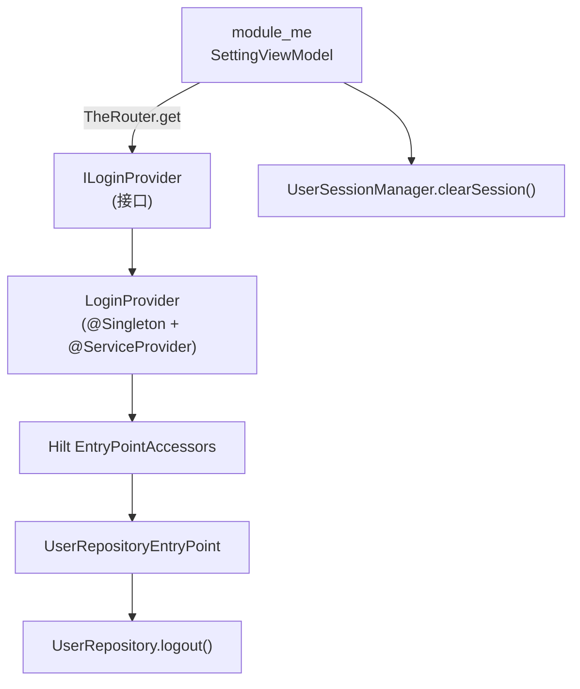
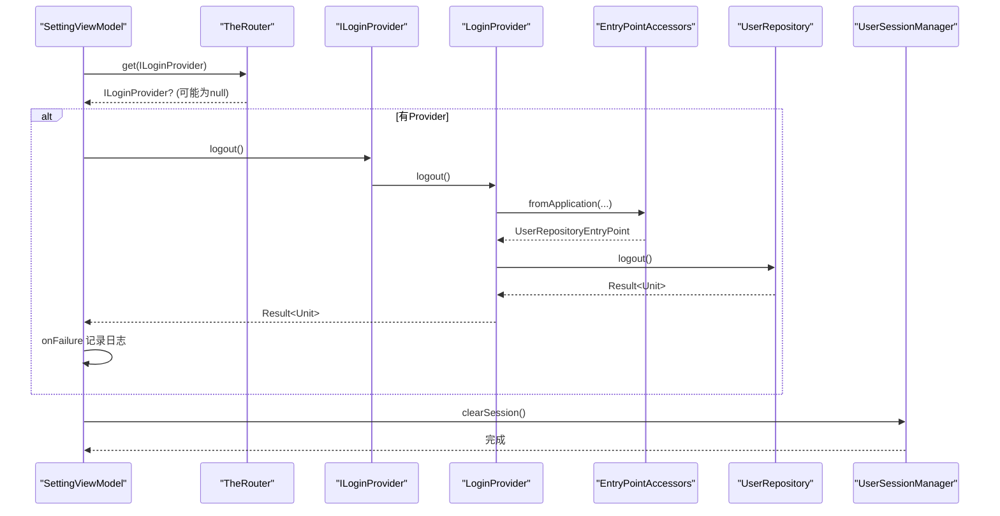
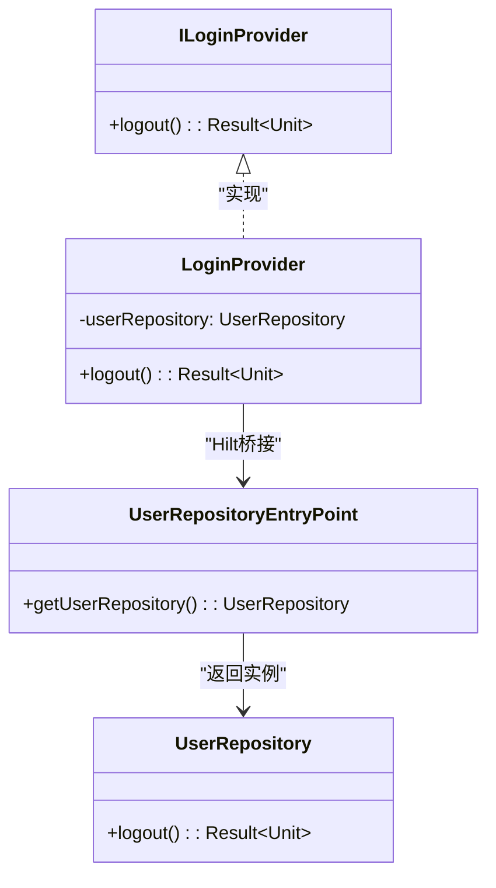
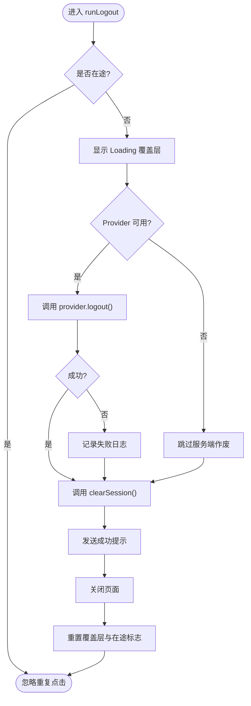
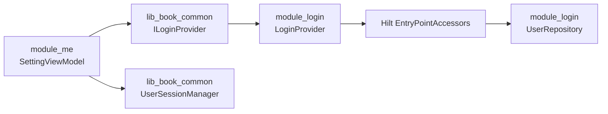

# ILoginProvider（登录模块）

<cite>
**本文引用的文件**
- [ILoginProvider.kt](file://lib_book_common/src/main/java/com/ebook/common/provider/ILoginProvider.kt)
- [LoginProvider.kt](file://module_login/src/main/java/com/ebook/login/provider/LoginProvider.kt)
- [UserRepository.kt](file://module_login/src/main/java/com/ebook/login/repository/UserRepository.kt)
- [SettingViewModel.kt](file://module_me/src/main/java/com/ebook/me/mvvm/viewmodel/SettingViewModel.kt)
- [UserSessionManager.kt](file://lib_book_common/src/main/java/com/ebook/common/domain/UserSessionManager.kt)
- [AndroidUserSessionManager.kt](file://lib_book_common/src/main/java/com/ebook/common/domain/AndroidUserSessionManager.kt)
- [0019-logout-capability-ownership.md](file://docs/adr/0019-logout-capability-ownership.md)
</cite>

## 目录
1. [简介](#简介)
2. [项目结构与定位](#项目结构与定位)
3. [核心组件](#核心组件)
4. [架构总览](#架构总览)
5. [详细组件分析](#详细组件分析)
6. [依赖关系分析](#依赖关系分析)
7. [性能与可靠性考虑](#性能与可靠性考虑)
8. [故障排查指南](#故障排查指南)
9. [结论](#结论)
10. [附录：实现示例与最佳实践](#附录：实现示例与最佳实践)

## 简介
ILoginProvider 是登录域对外暴露的跨模块能力接口，定义在共享库 lib_book_common 中，由 module_login 提供具体实现 LoginProvider。其职责聚焦于“服务端会话作废”，通过 TheRouter 的服务提供者机制被其他模块（如 module_me）调用。本地会话清理统一收口到 UserSessionManager.clearSession()，确保多份镜像状态一致失效。独立运行（isModule=true）时，module_login 不在依赖图中，ILoginProvider 可能为 null；此时登出仅执行本地清理，不影响用户体验。

## 项目结构与定位
- 接口契约：位于 lib_book_common，供所有功能模块引用，避免模块间直接耦合。
- 服务提供者：LoginProvider 使用 @Singleton 与 @ServiceProvider 注册到 TheRouter 容器。
- Hilt 桥接：TheRouter 创建的 Provider 非 Hilt 管理，通过 EntryPointAccessors 从 Hilt 图获取 UserRepository。
- 调用方：module_me 的设置页通过 TheRouter.get(ILoginProvider::class.java) 获取 provider，编排“先作废服务端、再清本地”的流程。

图表来源
- [SettingViewModel.kt:295-343](file://module_me/src/main/java/com/ebook/me/mvvm/viewmodel/SettingViewModel.kt#L295-L343)
- [ILoginProvider.kt:3-19](file://lib_book_common/src/main/java/com/ebook/common/provider/ILoginProvider.kt#L3-L19)
- [LoginProvider.kt:11-35](file://module_login/src/main/java/com/ebook/login/provider/LoginProvider.kt#L11-L35)
- [UserRepository.kt:86-94](file://module_login/src/main/java/com/ebook/login/repository/UserRepository.kt#L86-L94)

章节来源
- [ILoginProvider.kt:3-19](file://lib_book_common/src/main/java/com/ebook/common/provider/ILoginProvider.kt#L3-L19)
- [LoginProvider.kt:11-35](file://module_login/src/main/java/com/ebook/login/provider/LoginProvider.kt#L11-L35)
- [UserRepository.kt:86-94](file://module_login/src/main/java/com/ebook/login/repository/UserRepository.kt#L86-L94)
- [SettingViewModel.kt:295-343](file://module_me/src/main/java/com/ebook/me/mvvm/viewmodel/SettingViewModel.kt#L295-L343)

## 核心组件
- ILoginProvider：只暴露 logout(): Result<Unit>，语义明确为“服务端会话作废”。
- LoginProvider：实现 ILoginProvider，内部通过 TheRouter 注解注册，并借助 Hilt EntryPointAccessors 取得 UserRepository。
- UserRepository：封装认证相关网络请求，logout() 调用数据源完成服务端会话作废。
- UserSessionManager：本地会话管理的唯一入口，clearSession() 负责三处镜像一次性失效。
- SettingViewModel：调用方编排登出流程，保证顺序与容错，并在独立运行时降级为本地清理。

章节来源
- [ILoginProvider.kt:3-19](file://lib_book_common/src/main/java/com/ebook/common/provider/ILoginProvider.kt#L3-L19)
- [LoginProvider.kt:11-35](file://module_login/src/main/java/com/ebook/login/provider/LoginProvider.kt#L11-L35)
- [UserRepository.kt:57-62](file://module_login/src/main/java/com/ebook/login/repository/UserRepository.kt#L57-L62)
- [UserSessionManager.kt:44-47](file://lib_book_common/src/main/java/com/ebook/common/domain/UserSessionManager.kt#L44-L47)
- [AndroidUserSessionManager.kt:100-133](file://lib_book_common/src/main/java/com/ebook/common/domain/AndroidUserSessionManager.kt#L100-L133)
- [SettingViewModel.kt:295-343](file://module_me/src/main/java/com/ebook/me/mvvm/viewmodel/SettingViewModel.kt#L295-L343)

## 架构总览
登录模块通过“跨模块 Provider 接口 + Hilt 桥接”的方式，将服务端会话作废能力解耦到登录域，同时保持调用方的简洁与鲁棒性。

图表来源
- [SettingViewModel.kt:295-343](file://module_me/src/main/java/com/ebook/me/mvvm/viewmodel/SettingViewModel.kt#L295-L343)
- [LoginProvider.kt:11-35](file://module_login/src/main/java/com/ebook/login/provider/LoginProvider.kt#L11-L35)
- [UserRepository.kt:86-94](file://module_login/src/main/java/com/ebook/login/repository/UserRepository.kt#L86-L94)
- [UserSessionManager.kt:44-47](file://lib_book_common/src/main/java/com/ebook/common/domain/UserSessionManager.kt#L44-L47)

## 详细组件分析

### ILoginProvider 接口
- 设计目标：只暴露服务端侧登出，不重复本地会话清理逻辑。
- 方法签名：suspend fun logout(): Result<Unit>，失败返回异常由调用方决定是否提示。
- 独立运行兼容：当 module_login 未参与构建时，Provider 不可用，调用方需允许空实现，仅执行本地清理。

章节来源
- [ILoginProvider.kt:3-19](file://lib_book_common/src/main/java/com/ebook/common/provider/ILoginProvider.kt#L3-L19)

### LoginProvider 实现
- 注解注册：@Singleton 与 @ServiceProvider，交由 TheRouter 创建与管理生命周期。
- Hilt 桥接：构造期通过 EntryPointAccessors.fromApplication(context, UserRepositoryEntryPoint::class.java) 获取 UserRepository。
- 职责单一：logout() 委托给 UserRepository.logout()，不做本地清理。

图表来源
- [ILoginProvider.kt:3-19](file://lib_book_common/src/main/java/com/ebook/common/provider/ILoginProvider.kt#L3-L19)
- [LoginProvider.kt:11-35](file://module_login/src/main/java/com/ebook/login/provider/LoginProvider.kt#L11-L35)
- [UserRepository.kt:86-94](file://module_login/src/main/java/com/ebook/login/repository/UserRepository.kt#L86-L94)

章节来源
- [LoginProvider.kt:11-35](file://module_login/src/main/java/com/ebook/login/provider/LoginProvider.kt#L11-L35)
- [UserRepository.kt:86-94](file://module_login/src/main/java/com/ebook/login/repository/UserRepository.kt#L86-L94)

### 调用方编排：SettingViewModel.runLogout
- 取 Provider：通过 TheRouter.get(ILoginProvider::class.java)，独立运行时可能为 null。
- 错误处理：provider?.logout()?.onFailure { ... } 仅记录日志，不阻塞后续本地清理。
- 本地清理：无条件调用 userSessionManager.clearSession()，确保三处镜像一致失效。
- UI 收尾：sendToast 成功后 sendFinish，确保命令通道消费顺序正确。

图表来源
- [SettingViewModel.kt:295-343](file://module_me/src/main/java/com/ebook/me/mvvm/viewmodel/SettingViewModel.kt#L295-L343)

章节来源
- [SettingViewModel.kt:295-343](file://module_me/src/main/java/com/ebook/me/mvvm/viewmodel/SettingViewModel.kt#L295-L343)

### 本地会话清理：UserSessionManager.clearSession
- 职责：用户会话的三处镜像一次性失效——内存态、user_session SP、spUtils 兼容键、ProfileRepository 进程内身份流。
- 幂等与安全：清除后 TokenHolder 清空，防止旧 token 被继续使用。
- 调用约定：所有会话失效点（登出、刷新失败）统一走此单点，禁止调用方自行补调 ProfileRepository 清理。

章节来源
- [UserSessionManager.kt:44-47](file://lib_book_common/src/main/java/com/ebook/common/domain/UserSessionManager.kt#L44-L47)
- [AndroidUserSessionManager.kt:100-133](file://lib_book_common/src/main/java/com/ebook/common/domain/AndroidUserSessionManager.kt#L100-L133)

## 依赖关系分析
- 模块边界：module_me 不直接依赖 module_login，通过 ILoginProvider 抽象进行跨模块通信。
- 服务发现：TheRouter 负责 Provider 解析与注入；Hilt 负责业务仓库的生命周期与依赖装配。
- 桥接点：EntryPointAccessors 作为 TheRouter 与 Hilt 的连接器，避免在 Provider 中引入 Hilt 注解。

图表来源
- [SettingViewModel.kt:295-343](file://module_me/src/main/java/com/ebook/me/mvvm/viewmodel/SettingViewModel.kt#L295-L343)
- [LoginProvider.kt:11-35](file://module_login/src/main/java/com/ebook/login/provider/LoginProvider.kt#L11-L35)
- [UserRepository.kt:86-94](file://module_login/src/main/java/com/ebook/login/repository/UserRepository.kt#L86-L94)
- [UserSessionManager.kt:44-47](file://lib_book_common/src/main/java/com/ebook/common/domain/UserSessionManager.kt#L44-L47)

章节来源
- [SettingViewModel.kt:295-343](file://module_me/src/main/java/com/ebook/me/mvvm/viewmodel/SettingViewModel.kt#L295-L343)
- [LoginProvider.kt:11-35](file://module_login/src/main/java/com/ebook/login/provider/LoginProvider.kt#L11-L35)
- [UserRepository.kt:86-94](file://module_login/src/main/java/com/ebook/login/repository/UserRepository.kt#L86-L94)
- [UserSessionManager.kt:44-47](file://lib_book_common/src/main/java/com/ebook/common/domain/UserSessionManager.kt#L44-L47)

## 性能与可靠性考虑
- 协程作用域：登出流程在 viewModelScope 内执行，避免旋转屏幕导致的作用域取消问题。
- 并发保护：在途标志 logoutInProgress 防止重复触发。
- 失败容忍：服务端登出失败不阻塞本地清理，保证用户体验不受后端影响。
- 资源释放：finally 块复位覆盖层与在途标志，确保 UI 状态一致性。

章节来源
- [SettingViewModel.kt:295-343](file://module_me/src/main/java/com/ebook/me/mvvm/viewmodel/SettingViewModel.kt#L295-L343)

## 故障排查指南
- 现象：点击退出登录后仍显示登录态
  - 检查是否调用了 userSessionManager.clearSession()，确认三处镜像已清空。
  - 查看日志中是否有服务端登出失败的警告，确认不影响本地清理。
- 现象：独立模式下无法调用 logout
  - 这是预期行为，Provider 为空时仅执行本地清理。
- 现象：改密成功后未自动清会话
  - 改密路径由服务端使全部 token 失效，客户端应直接调用 clearSession()。

章节来源
- [AndroidUserSessionManager.kt:100-133](file://lib_book_common/src/main/java/com/ebook/common/domain/AndroidUserSessionManager.kt#L100-L133)
- [0019-logout-capability-ownership.md:1-48](file://docs/adr/0019-logout-capability-ownership.md#L1-L48)

## 结论
ILoginProvider 以最小化接口暴露了登录域的核心能力——服务端会话作废，并通过 TheRouter 与 Hilt 桥接实现了跨模块解耦。调用方只需遵循“先作废服务端、再清本地”的两行固定写法，即可在集成与独立两种运行形态下保持一致体验。本地会话清理集中在 UserSessionManager.clearSession()，避免了多处分散清理带来的不一致风险。

## 附录：实现示例与最佳实践

### 如何新增一个登录相关的 Provider
- 在 lib_book_common 定义接口（若尚未存在），保持无 Android 依赖。
- 在对应功能模块实现接口，并使用 @Singleton + @ServiceProvider 注册到 TheRouter。
- 若需要 Hilt 中的对象，通过 EntryPointAccessors 从 Application 图中获取，而非在 Provider 中直接注入。
- 接口方法尽量单一职责，例如仅暴露 logout()，不包含 login() 等零调用方方法。

参考路径
- [ILoginProvider.kt:3-19](file://lib_book_common/src/main/java/com/ebook/common/provider/ILoginProvider.kt#L3-L19)
- [LoginProvider.kt:11-35](file://module_login/src/main/java/com/ebook/login/provider/LoginProvider.kt#L11-L35)

### 如何处理会话失效场景
- 服务端登出失败：记录日志并继续本地清理，保证用户能顺利退出。
- 刷新失败：由网络层全局处置，最终调用 clearSession() 清会话、提示并跳转登录。
- 改密成功：服务端已失效全部凭证，客户端直接调用 clearSession()。

参考路径
- [SettingViewModel.kt:295-343](file://module_me/src/main/java/com/ebook/me/mvvm/viewmodel/SettingViewModel.kt#L295-L343)
- [UserSessionManager.kt:44-47](file://lib_book_common/src/main/java/com/ebook/common/domain/UserSessionManager.kt#L44-L47)
- [0019-logout-capability-ownership.md:1-48](file://docs/adr/0019-logout-capability-ownership.md#L1-L48)

### 与 Hilt 依赖注入桥接的使用方式
- 在 Provider 构造期通过 EntryPointAccessors.fromApplication(context, XxxEntryPoint::class.java) 获取所需依赖。
- 定义对应的 EntryPoint 接口，安装到 SingletonComponent，并暴露需要的工厂方法。
- 注意：Provider 本身由 TheRouter 创建，不应直接使用 @Inject 构造。

参考路径
- [LoginProvider.kt:11-35](file://module_login/src/main/java/com/ebook/login/provider/LoginProvider.kt#L11-L35)
- [UserRepository.kt:86-94](file://module_login/src/main/java/com/ebook/login/repository/UserRepository.kt#L86-L94)