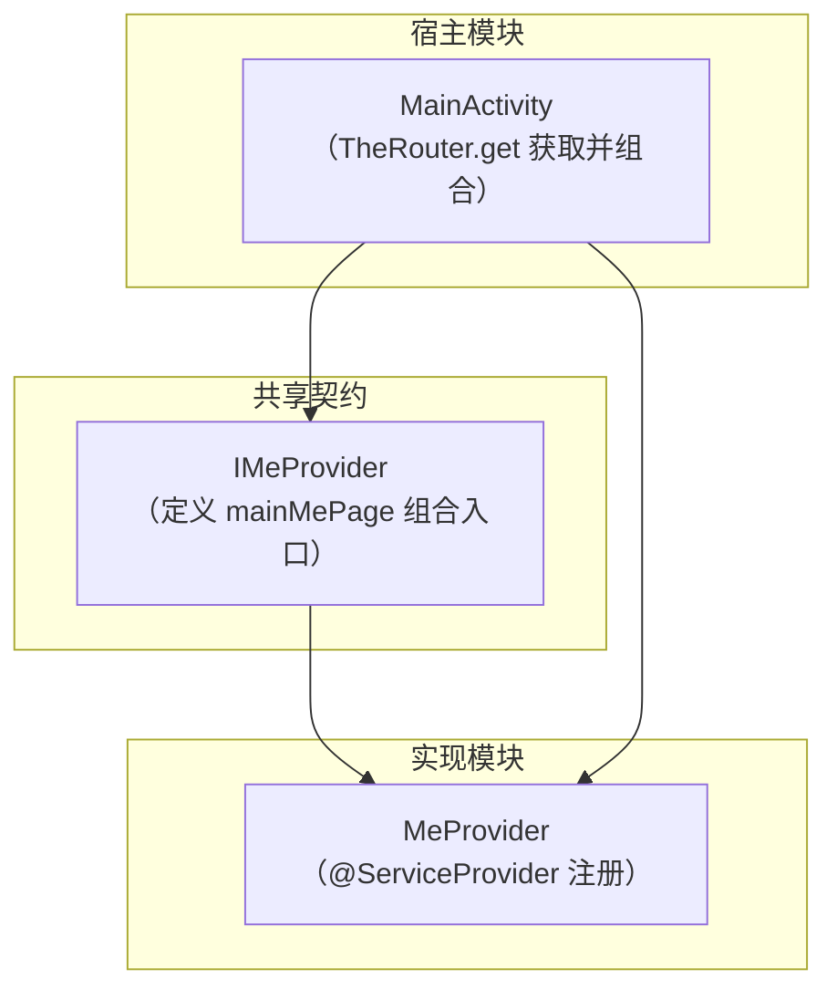
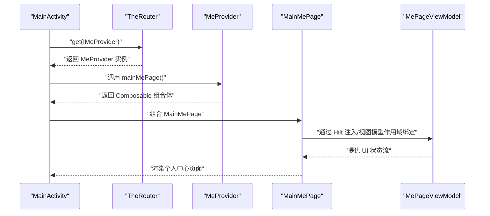
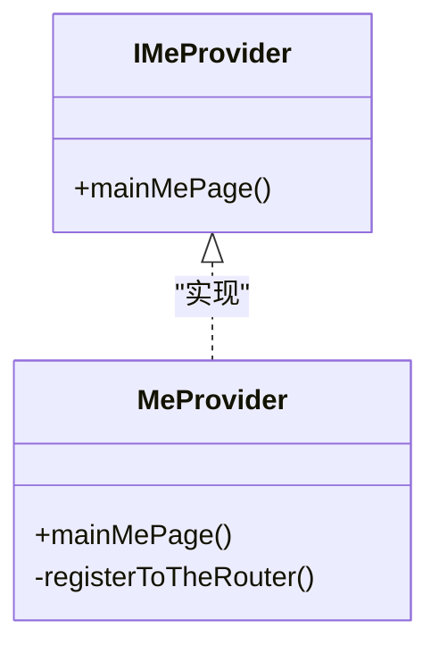
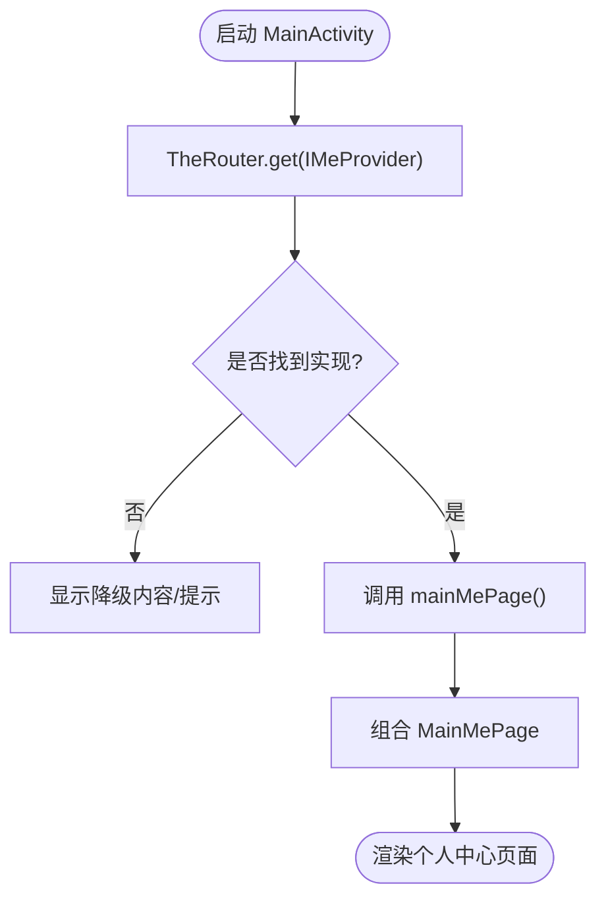
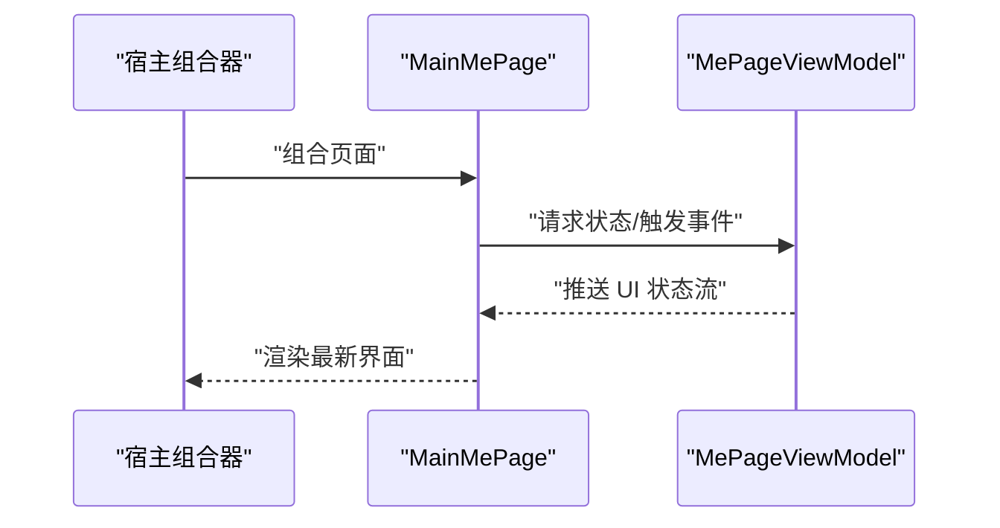
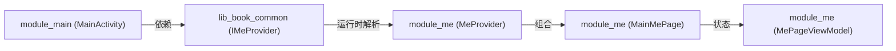

# IMeProvider（个人中心模块）

<cite>
**本文引用的文件**
- [lib_book_common/src/main/java/com/ebook/common/provider/IMeProvider.kt](file://lib_book_common/src/main/java/com/ebook/common/provider/IMeProvider.kt)
- [module_me/src/main/java/com/ebook/me/provider/MeProvider.kt](file://module_me/src/main/java/com/ebook/me/provider/MeProvider.kt)
- [module_main/src/main/java/com/ebook/main/MainActivity.kt](file://module_main/src/main/java/com/ebook/main/MainActivity.kt)
- [module_me/src/main/java/com/ebook/me/mvvm/module_me/src/main/java/com/ebook/me/mvvm/viewmodel/MePageViewModel.kt](file://module_me/src/main/java/com/ebook/me/mvvm/module_me/src/main/java/com/ebook/me/mvvm/viewmodel/MePageViewModel.kt)
- [module_me/src/main/java/com/ebook/me/page/MainMePage.kt](file://module_me/src/main/java/com/ebook/me/page/MainMePage.kt)
</cite>

## 目录
1. [简介](#简介)
2. [项目结构中的位置](#项目结构中的位置)
3. [核心组件](#核心组件)
4. [架构总览](#架构总览)
5. [详细组件分析](#详细组件分析)
6. [依赖关系分析](#依赖关系分析)
7. [性能与可维护性](#性能与可维护性)
8. [故障排查指南](#故障排查指南)
9. [结论](#结论)
10. [附录：新增个人中心相关 Provider 的步骤](#附录新增个人中心相关-provider的步骤)

## 简介
本文件聚焦于个人中心模块的跨模块通信机制，围绕 IMeProvider 接口、MeProvider 实现、TheRouter 服务发现与组合、以及 ViewModel 作用域绑定进行系统性说明。该模式在仓库中用于将“跨模块页面”以 Composable 函数形式暴露给宿主模块直接组合，从而避免模块间强耦合，同时复用 Hilt 依赖注入与统一的 MVVM 基类约定。

## 项目结构中的位置
- 接口定义位于共享库 lib_book_common 的 provider 包下，作为跨模块契约。
- 实现位于业务模块 module_me 的 provider 包下，通过 TheRouter 的服务提供者注解注册到容器。
- 宿主模块 module_main 的 MainActivity 负责通过 TheRouter.get() 获取并调用该 Provider，进而组合出主 Tab 页面。

**图表来源**
- [lib_book_common/src/main/java/com/ebook/common/provider/IMeProvider.kt](file://lib_book_common/src/main/java/com/ebook/common/provider/IMeProvider.kt)
- [module_me/src/main/java/com/ebook/me/provider/MeProvider.kt](file://module_me/src/main/java/com/ebook/me/provider/MeProvider.kt)
- [module_main/src/main/java/com/ebook/main/MainActivity.kt](file://module_main/src/main/java/com/ebook/main/MainActivity.kt)

**章节来源**
- [lib_book_common/src/main/java/com/ebook/common/provider/IMeProvider.kt](file://lib_book_common/src/main/java/com/ebook/common/provider/IMeProvider.kt)
- [module_me/src/main/java/com/ebook/me/provider/MeProvider.kt](file://module_me/src/main/java/com/ebook/me/provider/MeProvider.kt)
- [module_main/src/main/java/com/ebook/main/MainActivity.kt](file://module_main/src/main/java/com/ebook/main/MainActivity.kt)

## 核心组件
- IMeProvider：跨模块契约，暴露主“我的”页的组合入口（mainMePage）。
- MeProvider：实现 IMeProvider，使用 @ServiceProvider 注解注册到 TheRouter 服务容器。
- MainActivity：应用主入口，通过 TheRouter.get() 按契约获取 Provider 并组合页面。
- MePageViewModel：个人中心页面的 ViewModel，负责状态与业务逻辑，遵循 MVVM 与 Hilt 注入。
- MainMePage：Compose 页面实现，由 Provider 暴露供宿主组合。

**章节来源**
- [lib_book_common/src/main/java/com/ebook/common/provider/IMeProvider.kt](file://lib_book_common/src/main/java/com/ebook/common/provider/IMeProvider.kt)
- [module_me/src/main/java/com/ebook/me/provider/MeProvider.kt](file://module_me/src/main/java/com/ebook/me/provider/MeProvider.kt)
- [module_main/src/main/java/com/ebook/main/MainActivity.kt](file://module_main/src/main/java/com/ebook/main/MainActivity.kt)
- [module_me/src/main/java/com/ebook/me/mvvm/module_me/src/main/java/com/ebook/me/mvvm/viewmodel/MePageViewModel.kt](file://module_me/src/main/java/com/ebook/me/mvvm/module_me/src/main/java/com/ebook/me/mvvm/viewmodel/MePageViewModel.kt)
- [module_me/src/main/java/com/ebook/me/page/MainMePage.kt](file://module_me/src/main/java/com/ebook/me/page/MainMePage.kt)

## 架构总览
以下序列图展示了宿主如何从 TheRouter 获取 Provider 并组合个人页面的完整流程：

**图表来源**
- [module_main/src/main/java/com/ebook/main/MainActivity.kt](file://module_main/src/main/java/com/ebook/main/MainActivity.kt)
- [module_me/src/main/java/com/ebook/me/provider/MeProvider.kt](file://module_me/src/main/java/com/ebook/me/provider/MeProvider.kt)
- [module_me/src/main/java/com/ebook/me/page/MainMePage.kt](file://module_me/src/main/java/com/ebook/me/page/MainMePage.kt)
- [module_me/src/main/java/com/ebook/me/mvvm/module_me/src/main/java/com/ebook/me/mvvm/viewmodel/MePageViewModel.kt](file://module_me/src/main/java/com/ebook/me/mvvm/module_me/src/main/java/com/ebook/me/mvvm/viewmodel/MePageViewModel.kt)

## 详细组件分析

### IMeProvider 接口
- 职责：定义跨模块可见的个人中心组合入口，方法名固定为 mainMePage，返回类型为 Composable 函数。
- 设计动机：让宿主模块（module_main）仅依赖契约，不感知具体实现模块；实现由 TheRouter 在服务容器中解析。
- 约束：方法签名稳定，便于宿主统一调用；不包含业务细节，保持高内聚低耦合。

**章节来源**
- [lib_book_common/src/main/java/com/ebook/common/provider/IMeProvider.kt](file://lib_book_common/src/main/java/com/ebook/common/provider/IMeProvider.kt)

### MeProvider 实现与服务注册
- 职责：实现 IMeProvider 的 mainMePage，内部组合 MainMePage 并处理可能的参数传递或路由上下文。
- 服务注册：使用 @ServiceProvider 注解声明自身为 TheRouter 的服务提供者，使宿主可通过契约类型检索。
- 生命周期：由 TheRouter 管理实例化与生命周期；宿主侧无需关心创建细节。
- 扩展点：如需新增个人中心子功能，可在 Provider 层增加新的组合方法或路由桥接。

**图表来源**
- [lib_book_common/src/main/java/com/ebook/common/provider/IMeProvider.kt](file://lib_book_common/src/main/java/com/ebook/common/provider/IMeProvider.kt)
- [module_me/src/main/java/com/ebook/me/provider/MeProvider.kt](file://module_me/src/main/java/com/ebook/me/provider/MeProvider.kt)

**章节来源**
- [module_me/src/main/java/com/ebook/me/provider/MeProvider.kt](file://module_me/src/main/java/com/ebook/me/provider/MeProvider.kt)

### MainActivity 中的组合与导航
- 获取 Provider：通过 TheRouter.get(IMeProvider::class) 获取已注册的实现。
- 组合页面：调用 mainMePage() 得到 Composable，并在宿主的 NavHost 或根布局中组合。
- 导航策略：主 Tab 页采用 Provider 暴露的 Composable 直接组合，而非传统 Activity 跳转；如需进入个人中心内的子页面，可在 Provider 或页面层处理路由参数与导航栈。
- 容错：当 TheRouter 未找到对应 Provider 时，应给出降级展示或提示，避免空指针崩溃。

**图表来源**
- [module_main/src/main/java/com/ebook/main/MainActivity.kt](file://module_main/src/main/java/com/ebook/main/MainActivity.kt)
- [module_me/src/main/java/com/ebook/me/provider/MeProvider.kt](file://module_me/src/main/java/com/ebook/me/provider/MeProvider.kt)

**章节来源**
- [module_main/src/main/java/com/ebook/main/MainActivity.kt](file://module_main/src/main/java/com/ebook/main/MainActivity.kt)

### 个人中心页面与 ViewModel 作用域
- MainMePage：Compose 页面实现，负责 UI 结构与用户交互，接收来自 ViewModel 的状态流。
- MePageViewModel：继承基类 ViewModel，通过 Hilt 注入领域依赖（如仓库、管理器），提供 UI 状态与命令通道；在 Compose 中以 viewModels() 或自定义作用域绑定，确保与页面生命周期一致。
- 状态管理：使用 StateFlow/SharedFlow 等响应式数据流，避免内存泄漏；UI 只读状态，命令单向流动。
- 组合方式：Provider 暴露的 Composable 在宿主中组合，ViewModel 作用域由宿主或页面级容器决定，保证每次组合拥有独立实例。

**图表来源**
- [module_me/src/main/java/com/ebook/me/page/MainMePage.kt](file://module_me/src/main/java/com/ebook/me/page/MainMePage.kt)
- [module_me/src/main/java/com/ebook/me/mvvm/module_me/src/main/java/com/ebook/me/mvvm/viewmodel/MePageViewModel.kt](file://module_me/src/main/java/com/ebook/me/mvvm/module_me/src/main/java/com/ebook/me/mvvm/viewmodel/MePageViewModel.kt)

**章节来源**
- [module_me/src/main/java/com/ebook/me/page/MainMePage.kt](file://module_me/src/main/java/com/ebook/me/page/MainMePage.kt)
- [module_me/src/main/java/com/ebook/me/mvvm/module_me/src/main/java/com/ebook/me/mvvm/viewmodel/MePageViewModel.kt](file://module_me/src/main/java/com/ebook/me/mvvm/module_me/src/main/java/com/ebook/me/mvvm/viewmodel/MePageViewModel.kt)

## 依赖关系分析
- 契约解耦：module_main 仅依赖 IMeProvider（位于 lib_book_common），不感知 module_me 的具体实现。
- 服务发现：TheRouter 在运行时根据注解装配实现，模块间无编译期强依赖。
- MVVM/Hilt：ViewModel 通过 Hilt 注入业务依赖，页面组合与状态管理清晰分层。
- 扩展性：新增个人中心功能只需实现新 Provider 或通过现有 Provider 扩展组合逻辑，不影响宿主。

**图表来源**
- [module_main/src/main/java/com/ebook/main/MainActivity.kt](file://module_main/src/main/java/com/ebook/main/MainActivity.kt)
- [lib_book_common/src/main/java/com/ebook/common/provider/IMeProvider.kt](file://lib_book_common/src/main/java/com/ebook/common/provider/IMeProvider.kt)
- [module_me/src/main/java/com/ebook/me/provider/MeProvider.kt](file://module_me/src/main/java/com/ebook/me/provider/MeProvider.kt)
- [module_me/src/main/java/com/ebook/me/page/MainMePage.kt](file://module_me/src/main/java/com/ebook/me/page/MainMePage.kt)
- [module_me/src/main/java/com/ebook/me/mvvm/module_me/src/main/java/com/ebook/me/mvvm/viewmodel/MePageViewModel.kt](file://module_me/src/main/java/com/ebook/me/mvvm/module_me/src/main/java/com/ebook/me/mvvm/viewmodel/MePageViewModel.kt)

**章节来源**
- [module_main/src/main/java/com/ebook/main/MainActivity.kt](file://module_main/src/main/java/com/ebook/main/MainActivity.kt)
- [lib_book_common/src/main/java/com/ebook/common/provider/IMeProvider.kt](file://lib_book_common/src/main/java/com/ebook/common/provider/IMeProvider.kt)
- [module_me/src/main/java/com/ebook/me/provider/MeProvider.kt](file://module_me/src/main/java/com/ebook/me/provider/MeProvider.kt)
- [module_me/src/main/java/com/ebook/me/page/MainMePage.kt](file://module_me/src/main/java/com/ebook/me/page/MainMePage.kt)
- [module_me/src/main/java/com/ebook/me/mvvm/module_me/src/main/java/com/ebook/me/mvvm/viewmodel/MePageViewModel.kt](file://module_me/src/main/java/com/ebook/me/mvvm/module_me/src/main/java/com/ebook/me/mvvm/viewmodel/MePageViewModel.kt)

## 性能与可维护性
- 按需加载：TheRouter 仅在需要时解析实现，减少启动开销。
- 组合优化：Composable 尽量幂等，状态集中由 ViewModel 管理，避免重复计算。
- 作用域安全：ViewModel 与页面生命周期绑定，防止内存泄漏与状态错乱。
- 可扩展：新增功能通过 Provider 扩展或新增 Provider，保持宿主与实现解耦。

[本节为通用指导，不直接分析具体文件]

## 故障排查指南
- 症状：主页“我的”标签空白或崩溃
  - 检查 TheRouter 是否成功解析 IMeProvider 的实现（确认 @ServiceProvider 注解与路径正确）
  - 确认宿主调用 mainMePage() 前后存在有效的组合上下文（NavHost/根布局）
  - 检查 ViewModel 注入失败（Hilt 配置缺失导致 null 引用）
- 症状：个人中心页面不更新
  - 检查 ViewModel 状态流是否正确推送（StateFlow/SharedFlow 未发射）
  - 检查页面组合是否重复创建导致状态丢失（作用域设置）
- 症状：跨模块路由无效
  - 核对 TheRouter 的 routeMap 是否回写（修改 @Route/@ServiceProvider 后需二次构建）
  - 确认独立运行模式下占位路由是否存在（避免静默丢失）

**章节来源**
- [module_main/src/main/java/com/ebook/main/MainActivity.kt](file://module_main/src/main/java/com/ebook/main/MainActivity.kt)
- [module_me/src/main/java/com/ebook/me/provider/MeProvider.kt](file://module_me/src/main/java/com/ebook/me/provider/MeProvider.kt)
- [module_me/src/main/java/com/ebook/me/page/MainMePage.kt](file://module_me/src/main/java/com/ebook/me/page/MainMePage.kt)
- [module_me/src/main/java/com/ebook/me/mvvm/module_me/src/main/java/com/ebook/me/mvvm/viewmodel/MePageViewModel.kt](file://module_me/src/main/java/com/ebook/me/mvvm/module_me/src/main/java/com/ebook/me/mvvm/viewmodel/MePageViewModel.kt)

## 结论
IMeProvider 作为跨模块契约，结合 TheRouter 的服务发现机制，实现了个人中心模块与宿主模块之间的松耦合集成。MeProvider 通过注解注册到容器，宿主通过契约类型获取并组合页面；ViewModel 负责状态与业务逻辑，借助 Hilt 完成依赖注入。该模式具备高扩展性与可维护性，适用于多模块架构下的页面与能力共享。

[本节为总结性内容，不直接分析具体文件]

## 附录：新增个人中心相关 Provider 的步骤
- 步骤一：在 lib_book_common 的 provider 包中定义新接口（例如 ISettingsProvider），暴露组合入口（如 settingsPage）。
- 步骤二：在 module_me 中实现该接口（SettingsProvider），并使用 @ServiceProvider 注解注册到 TheRouter。
- 步骤三：在 module_main 的 MainActivity 中通过 TheRouter.get(ISettingsProvider::class) 获取实现并组合页面。
- 步骤四：在 module_me 中新增 Compose 页面与 ViewModel，使用 Hilt 注入业务依赖，并通过状态流驱动 UI。
- 步骤五：在独立运行模式下，若涉及跨模块路由，需在测试/调试源集添加占位路由，确保 TheRouter 能解析。
- 步骤六：验证构建与运行，确认页面正常组合、状态更新与导航行为符合预期。

[本节为操作指南，不直接分析具体文件]