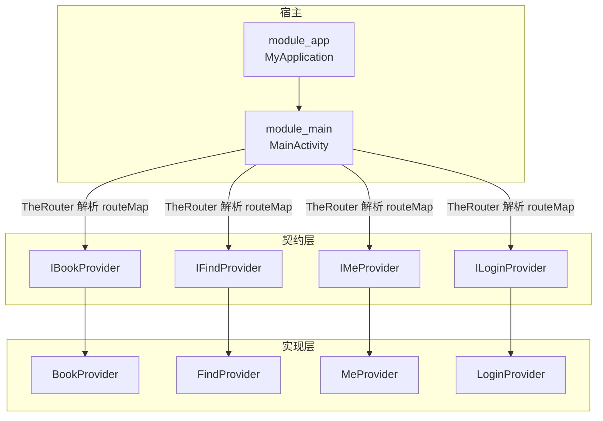
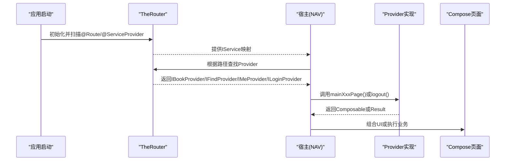
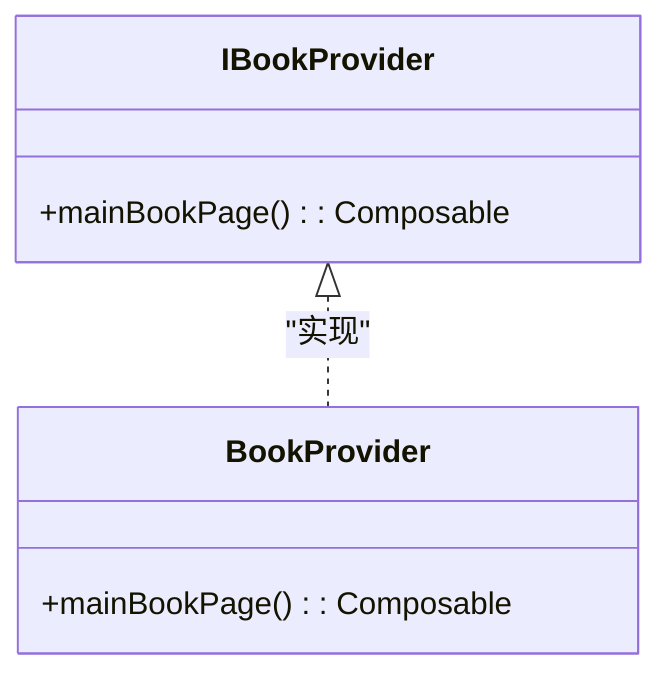
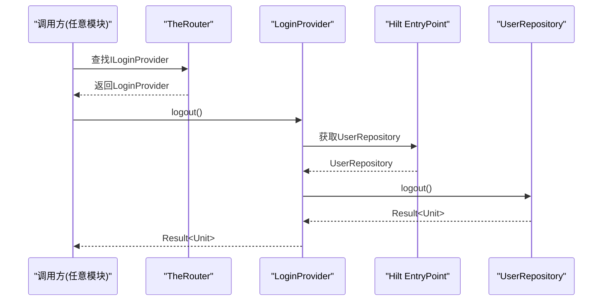
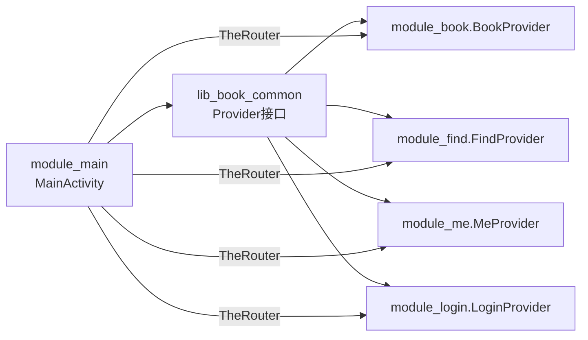

# Provider接口体系

<cite>
**本文引用的文件**
- [IBookProvider.kt](file://lib_book_common/src/main/java/com/ebook/common/provider/IBookProvider.kt)
- [IFindProvider.kt](file://lib_book_common/src/main/java/com/ebook/common/provider/IFindProvider.kt)
- [IMeProvider.kt](file://lib_book_common/src/main/java/com/ebook/common/provider/IMeProvider.kt)
- [ILoginProvider.kt](file://lib_book_common/src/main/java/com/ebook/common/provider/ILoginProvider.kt)
- [BookProvider.kt](file://module_book/src/main/java/com/ebook/book/provider/BookProvider.kt)
- [FindProvider.kt](file://module_find/src/main/java/com/ebook/find/provider/FindProvider.kt)
- [MeProvider.kt](file://module_me/src/main/java/com/ebook/me/provider/MeProvider.kt)
- [LoginProvider.kt](file://module_login/src/main/java/com/ebook/login/provider/LoginProvider.kt)
- [MainActivity.kt](file://module_main/src/main/java/com/ebook/main/MainActivity.kt)
- [MyApplication.kt](file://module_app/src/main/java/com/ebook/MyApplication.kt)
- [routeMap.json（主模块）](file://module_main/src/main/assets/therouter/routeMap.json)
- [routeMap.json（书城模块）](file://module_find/src/main/assets/therouter/routeMap.json)
- [routeMap.json（登录模块）](file://module_login/src/main/assets/therouter/routeMap.json)
- [UserRepositoryEntryPoint.kt](file://module_login/src/main/java/com/ebook/login/repository/UserRepositoryEntryPoint.kt)
</cite>

## 目录
1. [引言](#引言)
2. [项目结构](#项目结构)
3. [核心组件](#核心组件)
4. [架构总览](#架构总览)
5. [详细组件分析](#详细组件分析)
6. [依赖关系分析](#依赖关系分析)
7. [性能与可靠性](#性能与可靠性)
8. [故障排查指南](#故障排查指南)
9. [结论](#结论)
10. [附录：如何新增一个Provider接口](#附录如何新增一个provider接口)

## 引言
本文件系统化梳理跨模块通信的 Provider 模式设计，围绕 IBookProvider、IFindProvider、IMeProvider、ILoginProvider 的职责边界，解释其与 TheRouter 路由机制的结合方式、Compose 页面在模块间的传递、以及 Hilt 依赖注入在 Provider 中的接入策略。同时给出生命周期管理、错误处理与性能优化的实践建议，并说明测试替代方案的设计要点。

## 项目结构
- 接口定义集中在共享库 lib_book_common 的 provider 包，作为跨模块契约；实现位于各自业务模块（module_book、module_find、module_me、module_login）。
- 宿主 module_main 通过 TheRouter 获取 Provider，并将返回的 Composable 直接组合进 NavHost，避免 Activity/Fragment 级别的强耦合。
- 服务类由 TheRouter 的 @ServiceProvider 注册，Hilt 不直接创建这些 Provider，但 Provider 内部可通过 EntryPointAccessors 桥接到 Hilt 图。

图表来源
- [MainActivity.kt:1-200](file://module_main/src/main/java/com/ebook/main/MainActivity.kt#L1-L200)
- [MyApplication.kt:1-200](file://module_app/src/main/java/com/ebook/MyApplication.kt#L1-L200)
- [IBookProvider.kt:1-14](file://lib_book_common/src/main/java/com/ebook/common/provider/IBookProvider.kt#L1-L14)
- [IFindProvider.kt:1-14](file://lib_book_common/src/main/java/com/ebook/common/provider/IFindProvider.kt#L1-L14)
- [IMeProvider.kt:1-14](file://lib_book_common/src/main/java/com/ebook/common/provider/IMeProvider.kt#L1-L14)
- [ILoginProvider.kt:1-20](file://lib_book_common/src/main/java/com/ebook/common/provider/ILoginProvider.kt#L1-L20)
- [BookProvider.kt:1-16](file://module_book/src/main/java/com/ebook/book/provider/BookProvider.kt#L1-L16)
- [FindProvider.kt:1-20](file://module_find/src/main/java/com/ebook/find/provider/FindProvider.kt#L1-L20)
- [MeProvider.kt:1-21](file://module_me/src/main/java/com/ebook/me/provider/MeProvider.kt#L1-L21)
- [LoginProvider.kt:1-36](file://module_login/src/main/java/com/ebook/login/provider/LoginProvider.kt#L1-L36)

章节来源
- [IBookProvider.kt:1-14](file://lib_book_common/src/main/java/com/ebook/common/provider/IBookProvider.kt#L1-L14)
- [IFindProvider.kt:1-14](file://lib_book_common/src/main/java/com/ebook/common/provider/IFindProvider.kt#L1-L14)
- [IMeProvider.kt:1-14](file://lib_book_common/src/main/java/com/ebook/common/provider/IMeProvider.kt#L1-L14)
- [ILoginProvider.kt:1-20](file://lib_book_common/src/main/java/com/ebook/common/provider/ILoginProvider.kt#L1-L20)
- [BookProvider.kt:1-16](file://module_book/src/main/java/com/ebook/book/provider/BookProvider.kt#L1-L16)
- [FindProvider.kt:1-20](file://module_find/src/main/java/com/ebook/find/provider/FindProvider.kt#L1-L20)
- [MeProvider.kt:1-21](file://module_me/src/main/java/com/ebook/me/provider/MeProvider.kt#L1-L21)
- [LoginProvider.kt:1-36](file://module_login/src/main/java/com/ebook/login/provider/LoginProvider.kt#L1-L36)

## 核心组件
- IBookProvider：暴露书架主页 Composable，供宿主 NavHost 直接组合。
- IFindProvider：暴露书城主页 Composable，供宿主 NavHost 直接组合。
- IMeProvider：暴露个人中心主页 Composable，供宿主 NavHost 直接组合。
- ILoginProvider：暴露登录域跨模块能力（服务端登出），非 UI 能力，适合在需要时调用。

这些接口统一将“跨模块能力”抽象为函数式或轻量 SPI，避免直接依赖具体模块。

章节来源
- [IBookProvider.kt:1-14](file://lib_book_common/src/main/java/com/ebook/common/provider/IBookProvider.kt#L1-L14)
- [IFindProvider.kt:1-14](file://lib_book_common/src/main/java/com/ebook/common/provider/IFindProvider.kt#L1-L14)
- [IMeProvider.kt:1-14](file://lib_book_common/src/main/java/com/ebook/common/provider/IMeProvider.kt#L1-L14)
- [ILoginProvider.kt:1-20](file://lib_book_common/src/main/java/com/ebook/common/provider/ILoginProvider.kt#L1-L20)

## 架构总览
Provider 模式在本仓库中承担两个职责：
- 跨模块导航：以 Composable 形式暴露页面，由宿主经 TheRouter 解析 routeMap 后组合，实现“零耦合”的页面级集成。
- 跨模块能力：以 ILoginProvider 为代表的无 UI 能力，由业务侧按需调用。

TheRouter 负责发现与服务装配，Hilt 负责模块内的依赖注入。Provider 本身由 TheRouter 创建，内部如需 Hilt 能力则通过 EntryPointAccessors 桥接。

图表来源
- [MainActivity.kt:1-200](file://module_main/src/main/java/com/ebook/main/MainActivity.kt#L1-L200)
- [MyApplication.kt:1-200](file://module_app/src/main/java/com/ebook/MyApplication.kt#L1-L200)
- [BookProvider.kt:1-16](file://module_book/src/main/java/com/ebook/book/provider/BookProvider.kt#L1-L16)
- [FindProvider.kt:1-20](file://module_find/src/main/java/com/ebook/find/provider/FindProvider.kt#L1-L20)
- [MeProvider.kt:1-21](file://module_me/src/main/java/com/ebook/me/provider/MeProvider.kt#L1-L21)
- [LoginProvider.kt:1-36](file://module_login/src/main/java/com/ebook/login/provider/LoginProvider.kt#L1-L36)

## 详细组件分析

### IBookProvider / BookProvider
- 职责：对外暴露书架主界面 Composable，用于宿主 NavHost 直接组合。
- 关键点：
  - 页面以 lambda 形式暴露，每次组合创建新实例，ViewModel 作用域由 hiltViewModel 决定。
  - Provider 用 @ServiceProvider 注册，由 TheRouter 管理生命周期与查找。
  - 页面内 ViewModel 仍通过 Hilt 注入，实现“路由解耦 + 依赖注入”。

图表来源
- [IBookProvider.kt:1-14](file://lib_book_common/src/main/java/com/ebook/common/provider/IBookProvider.kt#L1-L14)
- [BookProvider.kt:1-16](file://module_book/src/main/java/com/ebook/book/provider/BookProvider.kt#L1-L16)

章节来源
- [IBookProvider.kt:1-14](file://lib_book_common/src/main/java/com/ebook/common/provider/IBookProvider.kt#L1-L14)
- [BookProvider.kt:1-16](file://module_book/src/main/java/com/ebook/book/provider/BookProvider.kt#L1-L16)

### IFindProvider / FindProvider
- 职责：对外暴露书城主界面 Composable。
- 关键点：与 IBookProvider 同构，体现统一的跨模块页面暴露约定。

章节来源
- [IFindProvider.kt:1-14](file://lib_book_common/src/main/java/com/ebook/common/provider/IFindProvider.kt#L1-L14)
- [FindProvider.kt:1-20](file://module_find/src/main/java/com/ebook/find/provider/FindProvider.kt#L1-L20)

### IMeProvider / MeProvider
- 职责：对外暴露个人中心主界面 Composable。
- 关键点：同样遵循“返回 Composable 供宿主组合”的统一约定。

章节来源
- [IMeProvider.kt:1-14](file://lib_book_common/src/main/java/com/ebook/common/provider/IMeProvider.kt#L1-L14)
- [MeProvider.kt:1-21](file://module_me/src/main/java/com/ebook/me/provider/MeProvider.kt#L1-L21)

### ILoginProvider / LoginProvider
- 职责：跨模块调用登录域的服务端登出能力（非本地会话清理）。
- 关键点：
  - 独立运行时无 module_login，调用方需允许空实现。
  - Provider 由 TheRouter 创建，内部通过 EntryPointAccessors 从 Hilt 图取 UserRepository 实例，实现“路由与注入解耦”。
  - 返回值使用 Result<Unit>，便于上层进行错误处理与提示。

图表来源
- [ILoginProvider.kt:1-20](file://lib_book_common/src/main/java/com/ebook/common/provider/ILoginProvider.kt#L1-L20)
- [LoginProvider.kt:1-36](file://module_login/src/main/java/com/ebook/login/provider/LoginProvider.kt#L1-L36)
- [UserRepositoryEntryPoint.kt:1-200](file://module_login/src/main/java/com/ebook/login/repository/UserRepositoryEntryPoint.kt#L1-L200)

章节来源
- [ILoginProvider.kt:1-20](file://lib_book_common/src/main/java/com/ebook/common/provider/ILoginProvider.kt#L1-L20)
- [LoginProvider.kt:1-36](file://module_login/src/main/java/com/ebook/login/provider/LoginProvider.kt#L1-L36)
- [UserRepositoryEntryPoint.kt:1-200](file://module_login/src/main/java/com/ebook/login/repository/UserRepositoryEntryPoint.kt#L1-L200)

### 与 TheRouter 的结合
- 各 Provider 均标注 @ServiceProvider，被 TheRouter 扫描并纳入服务表。
- 宿主通过 TheRouter 按路由键获取对应 Provider，再调用其方法或组合页面。
- 路由表以 JSON 资产形式声明（routeMap.json），由 TheRouter 构建期生成/回写。

章节来源
- [routeMap.json（主模块）:1-200](file://module_main/src/main/assets/therouter/routeMap.json#L1-L200)
- [routeMap.json（书城模块）:1-200](file://module_find/src/main/assets/therouter/routeMap.json#L1-L200)
- [routeMap.json（登录模块）:1-200](file://module_login/src/main/assets/therouter/routeMap.json#L1-L200)

### Composable 函数的跨模块传递
- 所有页面级 Provider 均返回 @Composable () -> Unit，而非 Fragment/Activity。
- 宿主 NavHost 直接组合该 lambda，实现“跨模块页面即插即用”，无需显式跳转逻辑。
- ViewModel 作用域绑定到调用处的 NavBackStackEntry，天然支持页面状态隔离。

章节来源
- [IBookProvider.kt:1-14](file://lib_book_common/src/main/java/com/ebook/common/provider/IBookProvider.kt#L1-L14)
- [IFindProvider.kt:1-14](file://lib_book_common/src/main/java/com/ebook/common/provider/IFindProvider.kt#L1-L14)
- [IMeProvider.kt:1-14](file://lib_book_common/src/main/java/com/ebook/common/provider/IMeProvider.kt#L1-L14)
- [BookProvider.kt:1-16](file://module_book/src/main/java/com/ebook/book/provider/BookProvider.kt#L1-L16)
- [FindProvider.kt:1-20](file://module_find/src/main/java/com/ebook/find/provider/FindProvider.kt#L1-L20)
- [MeProvider.kt:1-21](file://module_me/src/main/java/com/ebook/me/provider/MeProvider.kt#L1-L21)

### 依赖注入在 Provider 中的实现
- 页面级 Provider（书架/书城/我的）仅返回 Composable，依赖注入下沉到页面 ViewModel，由 Hilt 管理。
- 能力型 Provider（登录）需要访问模块内对象时，通过 EntryPointAccessors 从 Hilt 图中取出，避免 Provider 成为 Hilt 单例带来的耦合。

章节来源
- [LoginProvider.kt:1-36](file://module_login/src/main/java/com/ebook/login/provider/LoginProvider.kt#L1-L36)
- [UserRepositoryEntryPoint.kt:1-200](file://module_login/src/main/java/com/ebook/login/repository/UserRepositoryEntryPoint.kt#L1-L200)

## 依赖关系分析
- 契约层（lib_book_common）只包含接口，不包含任何模块实现，保证最小依赖面。
- 实现层各自模块依赖契约层，并通过 TheRouter 暴露。
- 宿主依赖契约层与 TheRouter，不依赖具体业务模块，从而实现松耦合。

图表来源
- [IBookProvider.kt:1-14](file://lib_book_common/src/main/java/com/ebook/common/provider/IBookProvider.kt#L1-L14)
- [IFindProvider.kt:1-14](file://lib_book_common/src/main/java/com/ebook/common/provider/IFindProvider.kt#L1-L14)
- [IMeProvider.kt:1-14](file://lib_book_common/src/main/java/com/ebook/common/provider/IMeProvider.kt#L1-L14)
- [ILoginProvider.kt:1-20](file://lib_book_common/src/main/java/com/ebook/common/provider/ILoginProvider.kt#L1-L20)
- [BookProvider.kt:1-16](file://module_book/src/main/java/com/ebook/book/provider/BookProvider.kt#L1-L16)
- [FindProvider.kt:1-20](file://module_find/src/main/java/com/ebook/find/provider/FindProvider.kt#L1-L20)
- [MeProvider.kt:1-21](file://module_me/src/main/java/com/ebook/me/provider/MeProvider.kt#L1-L21)
- [LoginProvider.kt:1-36](file://module_login/src/main/java/com/ebook/login/provider/LoginProvider.kt#L1-L36)
- [MainActivity.kt:1-200](file://module_main/src/main/java/com/ebook/main/MainActivity.kt#L1-L200)

章节来源
- [MainActivity.kt:1-200](file://module_main/src/main/java/com/ebook/main/MainActivity.kt#L1-L200)

## 性能与可靠性
- 页面组合开销：Provider 返回的是 Composable lambda，宿主按需组合，仅在导航时创建，避免不必要的实例化。
- 路由查找成本：TheRouter 基于 routeMap 索引，首次解析后缓存，日常调用开销低。
- 依赖注入桥接：LoginProvider 通过 EntryPointAccessors 懒取 Hilt 对象，避免在 Provider 构造期加载重型依赖。
- 可维护性：契约层稳定，扩展新页面只需新增 Provider 接口与实现，并在 routeMap 注册。

[本节为通用指导，不直接分析具体文件]

## 故障排查指南
- 独立模式下路由失效：若目标模块未编译进当前形态（isModule=true），TheRouter 找不到路由只会记录日志而不崩溃。需在独立宿主的 debug source set 添加占位路由以避免静默失败。
- 登录能力不可用：独立运行时 module_login 不在依赖图里，ILoginProvider 可能为空引用，调用方需做空实现兼容。
- 页面不显示：确认 routeMap 已正确生成且宿主能解析到对应 Provider；检查 Provider 是否标注 @ServiceProvider。
- Hilt 注入异常：确保页面 ViewModel 使用 @HiltViewModel，并由 hiltViewModel 获取；Provider 内部不要持有 Hilt 单例字段，应通过 EntryPointAccessors 获取。

章节来源
- [ILoginProvider.kt:1-20](file://lib_book_common/src/main/java/com/ebook/common/provider/ILoginProvider.kt#L1-L20)
- [LoginProvider.kt:1-36](file://module_login/src/main/java/com/ebook/login/provider/LoginProvider.kt#L1-L36)
- [routeMap.json（主模块）:1-200](file://module_main/src/main/assets/therouter/routeMap.json#L1-L200)

## 结论
本项目采用 Provider 模式实现了“页面级与服务能力级”的跨模块解耦：
- 页面级通过 Composable 暴露，宿主 NavHost 直接组合，配合 TheRouter 完成路由发现。
- 服务能力级通过 ILoginProvider 等 SPI 暴露，调用方无需感知具体模块实现。
- Hilt 专注于模块内依赖注入，Provider 作为跨模块边界保持轻量与稳定。
这种设计使模块可独立开发、独立测试、灵活替换，同时保持清晰的责任划分与良好的可扩展性。

## 附录：如何新增一个Provider接口
步骤概览（以新增“消息中心”为例）：
- 在 lib_book_common 的 provider 包新增接口 IMsgProvider，定义 mainMsgPage: @Composable () -> Unit。
- 在 module_msg 实现 MsgProvider，标注 @ServiceProvider，返回具体 Composable 页面。
- 在宿主 module_main 通过 TheRouter 查找 IMsgProvider 并组合页面。
- 如需要调用登录域能力，可在业务侧通过 ILoginProvider 调用 logout，或在页面 ViewModel 中通过 Hilt 注入相关依赖。
- 测试替代方案：
  - 单元测试：对业务逻辑使用 Mock/Stub（例如伪造 ILoginProvider.logout 返回成功）。
  - 页面级测试：可使用 Compose 测试框架组合 Provider 返回的 Composable，验证 UI 渲染与交互。
  - 独立调试：在独立模块中添加占位路由，避免 TheRouter 找不到服务导致静默失败。

章节来源
- [IBookProvider.kt:1-14](file://lib_book_common/src/main/java/com/ebook/common/provider/IBookProvider.kt#L1-L14)
- [IFindProvider.kt:1-14](file://lib_book_common/src/main/java/com/ebook/common/provider/IFindProvider.kt#L1-L14)
- [IMeProvider.kt:1-14](file://lib_book_common/src/main/java/com/ebook/common/provider/IMeProvider.kt#L1-L14)
- [ILoginProvider.kt:1-20](file://lib_book_common/src/main/java/com/ebook/common/provider/ILoginProvider.kt#L1-L20)
- [BookProvider.kt:1-16](file://module_book/src/main/java/com/ebook/book/provider/BookProvider.kt#L1-L16)
- [FindProvider.kt:1-20](file://module_find/src/main/java/com/ebook/find/provider/FindProvider.kt#L1-L20)
- [MeProvider.kt:1-21](file://module_me/src/main/java/com/ebook/me/provider/MeProvider.kt#L1-L21)
- [LoginProvider.kt:1-36](file://module_login/src/main/java/com/ebook/login/provider/LoginProvider.kt#L1-L36)