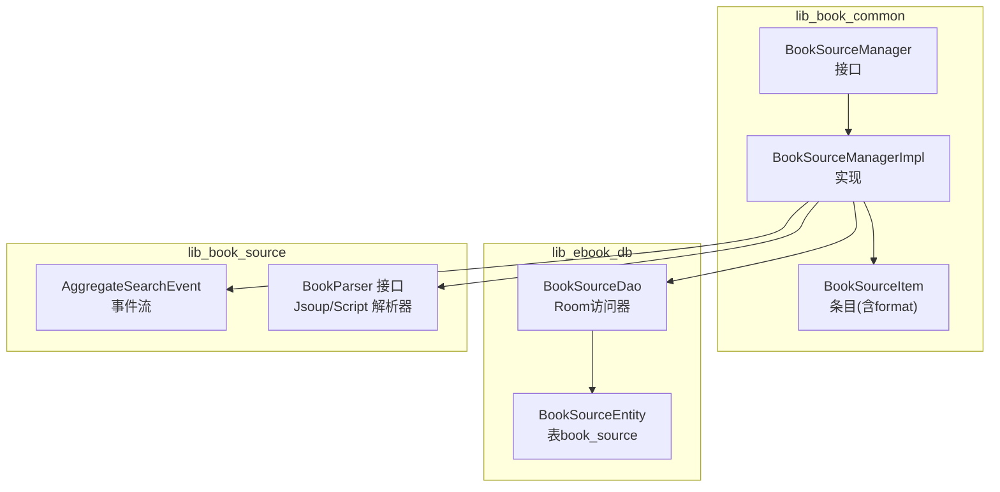
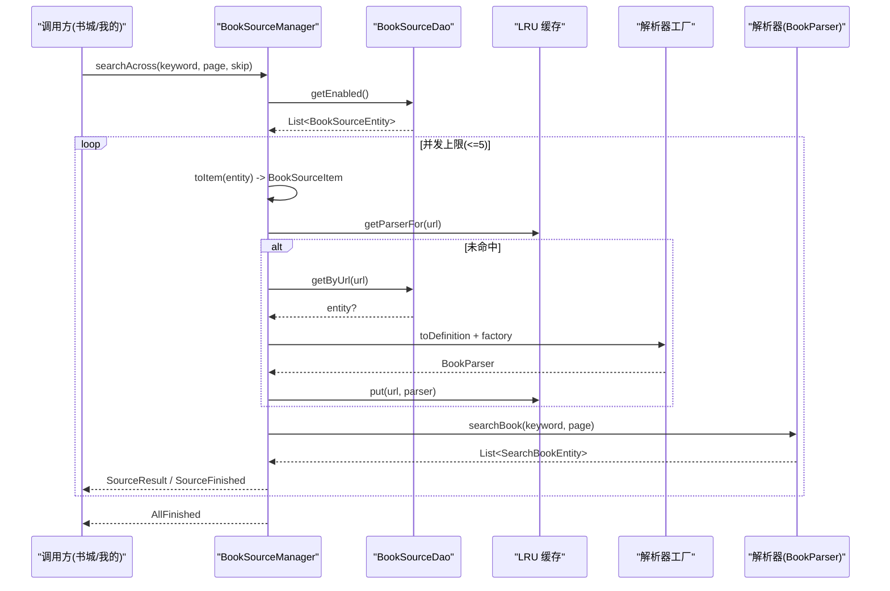
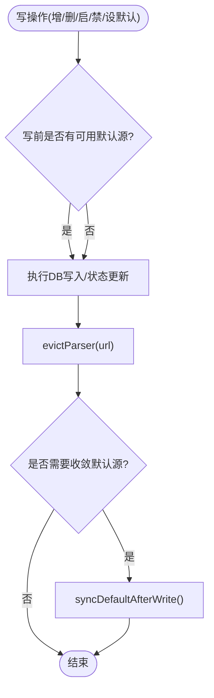
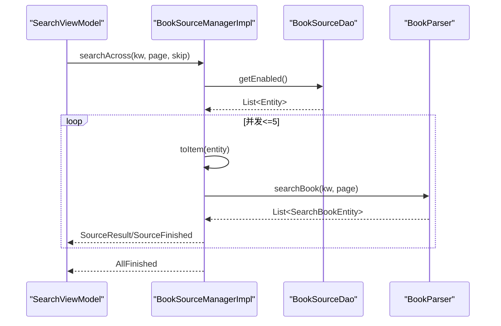
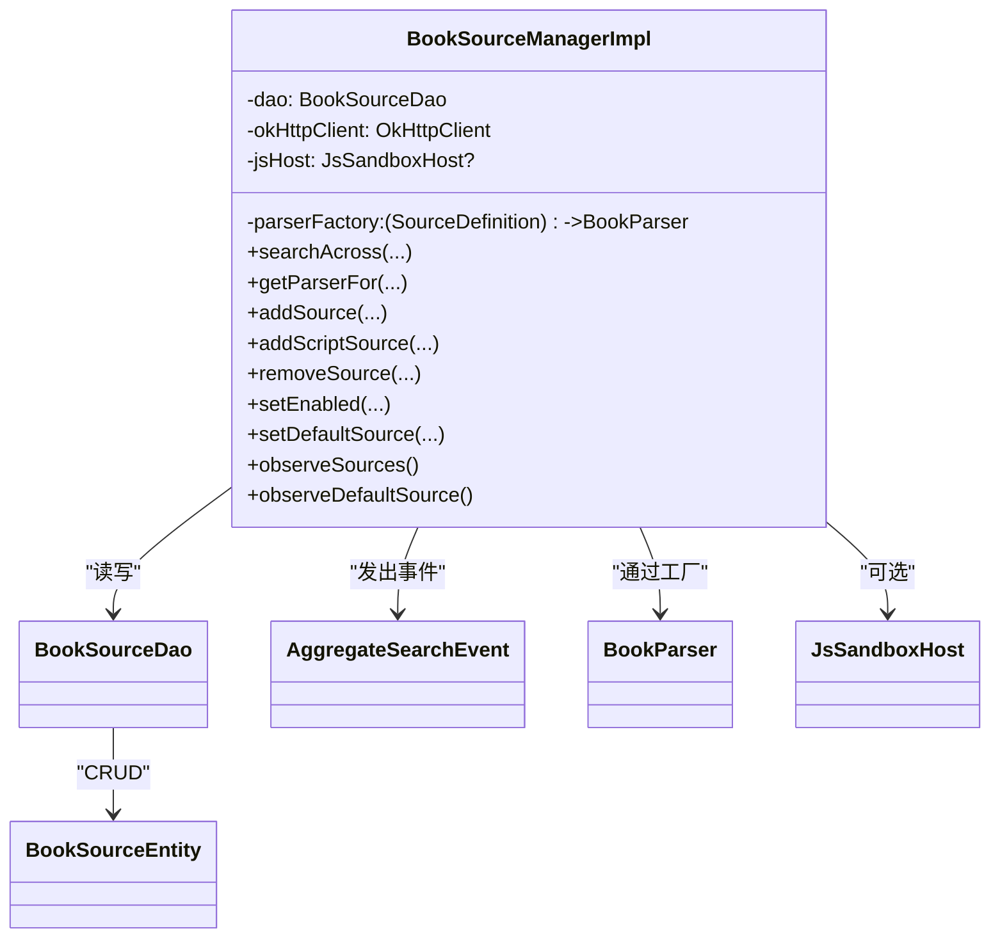

# 书源管理器

<cite>
**本文引用的文件**
- [BookSourceManager.kt](file://lib_book_common/src/main/java/com/ebook/common/analyze/source/BookSourceManager.kt)
- [BookSourceManagerImpl.kt](file://lib_book_common/src/main/java/com/ebook/common/analyze/source/BookSourceManagerImpl.kt)
- [BookSourceItem.kt](file://lib_book_common/src/main/java/com/ebook/common/analyze/source/BookSourceItem.kt)
- [BookSourceDao.kt](file://lib_ebook_db/src/main/java/com/ebook/db/dao/BookSourceDao.kt)
- [BookSourceEntity.kt](file://lib_ebook_db/src/main/java/com/ebook/db/entity/BookSourceEntity.kt)
- [AggregateSearchEvent.kt](file://lib_book_source/src/main/java/com/ebook/source/analyze/AggregateSearchEvent.kt)
- [BookSourceManagerImplTest.kt](file://lib_book_common/src/test/java/com/ebook/common/analyze/source/BookSourceManagerImplTest.kt)
</cite>

## 目录
1. [简介](#简介)
2. [项目结构](#项目结构)
3. [核心组件](#核心组件)
4. [架构总览](#架构总览)
5. [详细组件分析](#详细组件分析)
6. [依赖关系分析](#依赖关系分析)
7. [性能与并发](#性能与并发)
8. [故障排查指南](#故障排查指南)
9. [结论](#结论)
10. [附录](#附录)

## 简介
本文件围绕“书源管理器”进行系统化文档化，重点解释：
- BookSourceManager 接口的多书源共存设计与职责边界
- 规则类型化读面（仅原生规则）与默认源载体（格式中立）的分工机制
- 聚合搜索的实现原理、并发控制、失败处理
- 书源的增删改查、启用禁用状态管理、默认源选择算法
- LRU 缓存机制、数据库同步策略、事件通知系统
- 脚本书源与原生书源的区别、兼容性处理与迁移要点
- 扩展书源格式与自定义解析器的接入点

## 项目结构
书源管理相关代码横跨三个模块：
- lib_book_common：BookSourceManager 接口与实现，负责清单管理、默认源现算、聚合搜索编排、LRU 缓存
- lib_ebook_db：Room 实体 BookSourceEntity 与 DAO BookSourceDao，提供持久化与 Flow 观察
- lib_book_source：聚合搜索事件 AggregateSearchEvent，以及解析器后端（JsoupBookParser、ScriptBookParser）由 Manager 通过工厂装配

图表来源
- [BookSourceManager.kt:51-277](file://lib_book_common/src/main/java/com/ebook/common/analyze/source/BookSourceManager.kt#L51-L277)
- [BookSourceManagerImpl.kt:84-167](file://lib_book_common/src/main/java/com/ebook/common/analyze/source/BookSourceManagerImpl.kt#L84-L167)
- [BookSourceDao.kt:25-101](file://lib_ebook_db/src/main/java/com/ebook/db/dao/BookSourceDao.kt#L25-L101)
- [BookSourceEntity.kt:7-91](file://lib_ebook_db/src/main/java/com/ebook/db/entity/BookSourceEntity.kt#L7-L91)
- [AggregateSearchEvent.kt:5-75](file://lib_book_source/src/main/java/com/ebook/source/analyze/AggregateSearchEvent.kt#L5-L75)

章节来源
- [BookSourceManager.kt:51-277](file://lib_book_common/src/main/java/com/ebook/common/analyze/source/BookSourceManager.kt#L51-L277)
- [BookSourceManagerImpl.kt:84-167](file://lib_book_common/src/main/java/com/ebook/common/analyze/source/BookSourceManagerImpl.kt#L84-L167)
- [BookSourceDao.kt:25-101](file://lib_ebook_db/src/main/java/com/ebook/db/dao/BookSourceDao.kt#L25-L101)
- [BookSourceEntity.kt:7-91](file://lib_ebook_db/src/main/java/com/ebook/db/entity/BookSourceEntity.kt#L7-L91)
- [AggregateSearchEvent.kt:5-75](file://lib_book_source/src/main/java/com/ebook/source/analyze/AggregateSearchEvent.kt#L5-L75)

## 核心组件
- BookSourceManager：定义多书源管理的统一入口，包括规则类型化读面、默认源订阅、聚合搜索、增删改查、导入导出等
- BookSourceManagerImpl：具体实现，维护 Room 事实源、LRU 解析器缓存、默认源现算逻辑、聚合搜索编排
- BookSourceDao：Room DAO，提供全量/启用/按URL查询、Flow 观察、upsert、setEnabled、删除
- BookSourceEntity：book_source 表行模型，包含 url/name/rule_json/enabled/weight/group/format/addedAt
- AggregateSearchEvent：聚合搜索的事件流，描述单源开始、结果、失败、结束与全部完成
- BookSourceItem：面向管理页的条目，携带 format 出身标记与展示用 rule

章节来源
- [BookSourceManager.kt:51-277](file://lib_book_common/src/main/java/com/ebook/common/analyze/source/BookSourceManager.kt#L51-L277)
- [BookSourceManagerImpl.kt:84-868](file://lib_book_common/src/main/java/com/ebook/common/analyze/source/BookSourceManagerImpl.kt#L84-L868)
- [BookSourceDao.kt:25-101](file://lib_ebook_db/src/main/java/com/ebook/db/dao/BookSourceDao.kt#L25-L101)
- [BookSourceEntity.kt:7-91](file://lib_ebook_db/src/main/java/com/ebook/db/entity/BookSourceEntity.kt#L7-L91)
- [AggregateSearchEvent.kt:5-75](file://lib_book_source/src/main/java/com/ebook/source/analyze/AggregateSearchEvent.kt#L5-L75)
- [BookSourceItem.kt:6-49](file://lib_book_common/src/main/java/com/ebook/common/analyze/source/BookSourceItem.kt#L6-L49)

## 架构总览
书源管理器以 Room 为唯一事实源，不随包携带任何书源。所有读写经 BookSourceManager 暴露，业务侧不直调 DAO。默认源每次从 Room 行现算，SP 仅记忆用户上次主动选择的 URL；订阅面 observeDefaultSource 与写路径收敛共用同一函数，保证口径一致。

图表来源
- [BookSourceManagerImpl.kt:464-510](file://lib_book_common/src/main/java/com/ebook/common/analyze/source/BookSourceManagerImpl.kt#L464-L510)
- [BookSourceManagerImpl.kt:433-443](file://lib_book_common/src/main/java/com/ebook/common/analyze/source/BookSourceManagerImpl.kt#L433-L443)
- [BookSourceDao.kt:54-61](file://lib_ebook_db/src/main/java/com/ebook/db/dao/BookSourceDao.kt#L54-L61)
- [AggregateSearchEvent.kt:21-75](file://lib_book_source/src/main/java/com/ebook/source/analyze/AggregateSearchEvent.kt#L21-L75)

## 详细组件分析

### BookSourceManager 接口设计
- 多书源共存：一次可导入多个站点，每本书通过 tag 绑定归属源，解析一律“跟书走”
- 规则类型化读面：getAllSources/getEnabledSources/getSourceByUrl 只返回原生规则（BookSourceRule），脚本源不参与
- 默认源载体格式中立：observeDefaultSource 返回 SourceDefinition?，脚本源同样可成为默认源
- 管理面专用条目：observeSources 返回 BookSourceItem，带 format 区分原生/脚本，供管理页渲染
- 聚合搜索：searchAcross 对每条启用源并发解析，按事件流增量输出
- 增删改查：addSource/addScriptSource/removeSource/setEnabled/setDefaultSource，支持覆盖导入与状态切换
- 导入导出：importFromJson/exportToJson 纯函数，不落库

章节来源
- [BookSourceManager.kt:51-277](file://lib_book_common/src/main/java/com/ebook/common/analyze/source/BookSourceManager.kt#L51-L277)

### BookSourceManagerImpl 实现要点
- 默认源现算：defaultFromRows 从 Room 行筛选启用候选，优先 SP 命中的启用项，否则第一条启用项；无可用源返回 null
- 格式路由：toDefinition 按 format 列分派到 Native/Script 两种解析器；toRule 将非原生行挡下，确保规则类型化读面仅原生可见
- LRU 缓存：parserCache 容量有限（PARSER_CACHE_SIZE），getParserFor 在锁内查缓存/查库/构建并放入；写操作后 evictParser 失效对应 URL
- 聚合搜索：searchAcross 使用 flatMapMerge 限制并发（AGGREGATE_SEARCH_CONCURRENCY=5），单源异常收敛为 SourceFailed+SourceFinished，CancellationException 原样上抛
- 默认源收敛：setDefaultSource 会顺带启用目标源（保持“默认源永不为禁用态”不变式），写路径在必要时调用 syncDefaultAfterWrite 固化 SP 并重推订阅面
- 数据一致性：所有写路径成功后都 evictParser，避免缓存与规则不同步

图表来源
- [BookSourceManagerImpl.kt:525-557](file://lib_book_common/src/main/java/com/ebook/common/analyze/source/BookSourceManagerImpl.kt#L525-L557)
- [BookSourceManagerImpl.kt:590-637](file://lib_book_common/src/main/java/com/ebook/common/analyze/source/BookSourceManagerImpl.kt#L590-L637)
- [BookSourceManagerImpl.kt:723-739](file://lib_book_common/src/main/java/com/ebook/common/analyze/source/BookSourceManagerImpl.kt#L723-L739)
- [BookSourceManagerImpl.kt:756-778](file://lib_book_common/src/main/java/com/ebook/common/analyze/source/BookSourceManagerImpl.kt#L756-L778)
- [BookSourceManagerImpl.kt:790-793](file://lib_book_common/src/main/java/com/ebook/common/analyze/source/BookSourceManagerImpl.kt#L790-L793)

### 聚合搜索流程
- 并发控制：最多同时 5 条源请求第三方站点，降低风控风险
- 事件契约：SourceStarted → (SourceResult | SourceFailed) → SourceFinished；AllFinished 标志整轮结束
- 失败隔离：单源失败不影响其它源；取消信号原样上抛，避免旧轮次污染新结果
- 到底判定：调用方根据 noteUrl 去重判断是否还有新条目，hasMore 只是本源视角

图表来源
- [BookSourceManagerImpl.kt:464-510](file://lib_book_common/src/main/java/com/ebook/common/analyze/source/BookSourceManagerImpl.kt#L464-L510)
- [AggregateSearchEvent.kt:21-75](file://lib_book_source/src/main/java/com/ebook/source/analyze/AggregateSearchEvent.kt#L21-L75)

### 默认源选择算法
- 候选集：所有启用行（两种格式平等）
- 优先级：SP 命中的启用项优先；否则取第一条启用项；若无启用项则返回 null
- 收敛：写操作后若满足条件（写前无可用默认源或改写当前默认源），则 persistDefaultUrl 固化 SP 并推送 defaultUrlFlow，使 observeDefaultSource 重新组合得出正确结果

章节来源
- [BookSourceManagerImpl.kt:207-214](file://lib_book_common/src/main/java/com/ebook/common/analyze/source/BookSourceManagerImpl.kt#L207-L214)
- [BookSourceManagerImpl.kt:235-238](file://lib_book_common/src/main/java/com/ebook/common/analyze/source/BookSourceManagerImpl.kt#L235-L238)
- [BookSourceManagerImpl.kt:849-851](file://lib_book_common/src/main/java/com/ebook/common/analyze/source/BookSourceManagerImpl.kt#L849-L851)

### LRU 缓存机制
- 缓存键：sourceUrl
- 容量：PARSER_CACHE_SIZE（较小，因为同时活跃书籍数量有限）
- 线程安全：parserCacheMutex 串行化 getParserFor 的“查缓存→查库→构建→入缓存”
- 失效策略：所有可能改变解析结果的写操作（增/删/启用/禁用/设默认）成功后 evictParser 移除该 URL 对应缓存

章节来源
- [BookSourceManagerImpl.kt:147-160](file://lib_book_common/src/main/java/com/ebook/common/analyze/source/BookSourceManagerImpl.kt#L147-L160)
- [BookSourceManagerImpl.kt:181-193](file://lib_book_common/src/main/java/com/ebook/common/analyze/source/BookSourceManagerImpl.kt#L181-L193)
- [BookSourceManagerImpl.kt:433-443](file://lib_book_common/src/main/java/com/ebook/common/analyze/source/BookSourceManagerImpl.kt#L433-L443)
- [BookSourceManagerImpl.kt:817-819](file://lib_book_common/src/main/java/com/ebook/common/analyze/source/BookSourceManagerImpl.kt#L817-L819)

### 数据库同步与事件通知
- 唯一事实源：book_source 表；应用不随包携带书源，首启也不灌库
- Flow 观察：observeAll 提供实时列表变化，用于管理页渲染
- 默认源订阅：combine(defaultUrlFlow, observeAll()) 保证“换默认源”也能触发重新计算
- 事件驱动：聚合搜索通过 AggregateSearchEvent 增量输出，便于 UI 边收边渲染

章节来源
- [BookSourceDao.kt:27-61](file://lib_ebook_db/src/main/java/com/ebook/db/dao/BookSourceDao.kt#L27-L61)
- [BookSourceManagerImpl.kt:834-851](file://lib_book_common/src/main/java/com/ebook/common/analyze/source/BookSourceManagerImpl.kt#L834-L851)
- [AggregateSearchEvent.kt:5-75](file://lib_book_source/src/main/java/com/ebook/source/analyze/AggregateSearchEvent.kt#L5-L75)

### 书源增删改查与状态管理
- 新增/覆盖：addSource（原生）、addScriptSource（脚本，rawJson 原样存储，format=script）；覆盖导入保留 addedAt/weight/group（先读取旧行）
- 删除：removeSource；删除后若为当前默认源则收敛默认源
- 启用/禁用：setEnabled；禁用不参与聚合搜索与书城候选，但不切断已有归属；默认源永不为禁用态
- 设为默认：setDefaultSource；若目标禁用则自动启用；成功后失效对应 parser 缓存

章节来源
- [BookSourceManagerImpl.kt:525-557](file://lib_book_common/src/main/java/com/ebook/common/analyze/source/BookSourceManagerImpl.kt#L525-L557)
- [BookSourceManagerImpl.kt:590-637](file://lib_book_common/src/main/java/com/ebook/common/analyze/source/BookSourceManagerImpl.kt#L590-L637)
- [BookSourceManagerImpl.kt:671-690](file://lib_book_common/src/main/java/com/ebook/common/analyze/source/BookSourceManagerImpl.kt#L671-L690)
- [BookSourceManagerImpl.kt:723-739](file://lib_book_common/src/main/java/com/ebook/common/analyze/source/BookSourceManagerImpl.kt#L723-L739)
- [BookSourceManagerImpl.kt:756-778](file://lib_book_common/src/main/java/com/ebook/common/analyze/source/BookSourceManagerImpl.kt#L756-L778)

### 脚本书源与原生书源
- 区别：原生书源的 rule_json 是本仓 BookSourceRule 序列化；脚本书源 rawJson 是社区通用 JSON 原文，整块存储不翻译
- 兼容性：toRule 将非原生行挡下，规则类型化读面仅原生可见；默认源载体 SourceDefinition 格式中立，脚本行可成为默认源
- 解析器：getParserFor 对脚本行永不返回 null，构造期不解析，首次求值才装载规则（惰性）；坏 JSON 在求值期抛类型化异常
- 迁移：format 列小写 native/script；写侧显式取 .raw，避免枚举名大小写导致误判

章节来源
- [BookSourceManagerImpl.kt:277-310](file://lib_book_common/src/main/java/com/ebook/common/analyze/source/BookSourceManagerImpl.kt#L277-L310)
- [BookSourceManagerImpl.kt:330-364](file://lib_book_common/src/main/java/com/ebook/common/analyze/source/BookSourceManagerImpl.kt#L330-L364)
- [BookSourceManagerImpl.kt:433-443](file://lib_book_common/src/main/java/com/ebook/common/analyze/source/BookSourceManagerImpl.kt#L433-L443)
- [BookSourceEntity.kt:69-80](file://lib_ebook_db/src/main/java/com/ebook/db/entity/BookSourceEntity.kt#L69-L80)

### 扩展书源格式与自定义解析器
- 扩展点：parserFactory 将 SourceDefinition 分发到具体解析器（Native→JsoupBookParser，Script→ScriptBookParser）
- 如何接入新格式：
  - 定义新的 SourceDefinition 分支（密封类扩展）
  - 在 parserFactory 中为新分支创建对应的 BookParser 实现
  - 确保 toDefinition 对新格式路由正确
  - 如新格式需要管理页元数据，考虑是否在 toItem 中透出
- 冲突处理：同 URL 覆盖导入会 REPLACE 整行，需保留 addedAt/weight/group；写成功后 evictParser 失效缓存

章节来源
- [BookSourceManagerImpl.kt:109-118](file://lib_book_common/src/main/java/com/ebook/common/analyze/source/BookSourceManagerImpl.kt#L109-L118)
- [BookSourceManagerImpl.kt:354-364](file://lib_book_common/src/main/java/com/ebook/common/analyze/source/BookSourceManagerImpl.kt#L354-L364)
- [BookSourceManagerImpl.kt:525-557](file://lib_book_common/src/main/java/com/ebook/common/analyze/source/BookSourceManagerImpl.kt#L525-L557)

## 依赖关系分析
- 模块依赖方向：module_* → lib_book_common → lib_ebook_db / lib_book_source
- BookSourceManagerImpl 依赖：
  - BookSourceDao：Room 访问层
  - OkHttpClient(@Named("source"))：纯净客户端，不携带登录 token
  - JsSandboxHost?：可选的沙箱执行器，用于脚本源 JS 段求值
  - parserFactory：解析器工厂，按 SourceDefinition 分发
- 事件依赖：AggregateSearchEvent 由 Manager 发出，被上层 ViewModel 消费

图表来源
- [BookSourceManagerImpl.kt:84-118](file://lib_book_common/src/main/java/com/ebook/common/analyze/source/BookSourceManagerImpl.kt#L84-L118)
- [BookSourceDao.kt:25-101](file://lib_ebook_db/src/main/java/com/ebook/db/dao/BookSourceDao.kt#L25-L101)
- [AggregateSearchEvent.kt:21-75](file://lib_book_source/src/main/java/com/ebook/source/analyze/AggregateSearchEvent.kt#L21-L75)

章节来源
- [BookSourceManagerImpl.kt:84-167](file://lib_book_common/src/main/java/com/ebook/common/analyze/source/BookSourceManagerImpl.kt#L84-L167)
- [BookSourceDao.kt:25-101](file://lib_ebook_db/src/main/java/com/ebook/db/dao/BookSourceDao.kt#L25-L101)
- [AggregateSearchEvent.kt:21-75](file://lib_book_source/src/main/java/com/ebook/source/analyze/AggregateSearchEvent.kt#L21-L75)

## 性能与并发
- 聚合搜索并发上限：5，避免对第三方站点造成过大压力
- LRU 容量：较小，因同时活跃书籍数量有限；超过容量淘汰最久未用
- 线程模型：解析器内部已切 IO 调度；Manager 的 flow 不加 flowOn，保持在收集者调度器，便于测试确定性
- 缓存失效：写操作后 evictParser，避免解析器实例与规则不一致
- 取消传播：CancellationException 原样上抛，避免旧轮次污染新结果

章节来源
- [BookSourceManagerImpl.kt:147-160](file://lib_book_common/src/main/java/com/ebook/common/analyze/source/BookSourceManagerImpl.kt#L147-L160)
- [BookSourceManagerImpl.kt:181-193](file://lib_book_common/src/main/java/com/ebook/common/analyze/source/BookSourceManagerImpl.kt#L181-L193)
- [BookSourceManagerImpl.kt:464-510](file://lib_book_common/src/main/java/com/ebook/common/analyze/source/BookSourceManagerImpl.kt#L464-L510)
- [BookSourceManagerImpl.kt:817-819](file://lib_book_common/src/main/java/com/ebook/common/analyze/source/BookSourceManagerImpl.kt#L817-L819)

## 故障排查指南
- “聚合搜索一条源失败，其他源不受影响”：确认单源 catch 收敛为 SourceFailed+SourceFinished，CancellationException 原样上抛
- “默认源没有更新”：检查 write 路径是否调用 syncDefaultAfterWrite；确认 SP 记录与 Room 行为一致
- “改规则后解析没变化”：确认 evictParser 已调用；默认源与其他源共用 LRU，必须清对应 URL
- “脚本源在规则类型化读面不可见”：这是预期行为（toRule 挡下非原生行）；如需查看脚本源，走 observeSources
- “默认源为空”：当无任何启用行时 observeDefaultSource 发 null，页面应展示引导态

章节来源
- [BookSourceManagerImpl.kt:464-510](file://lib_book_common/src/main/java/com/ebook/common/analyze/source/BookSourceManagerImpl.kt#L464-L510)
- [BookSourceManagerImpl.kt:790-793](file://lib_book_common/src/main/java/com/ebook/common/analyze/source/BookSourceManagerImpl.kt#L790-L793)
- [BookSourceManagerImpl.kt:849-851](file://lib_book_common/src/main/java/com/ebook/common/analyze/source/BookSourceManagerImpl.kt#L849-L851)
- [BookSourceManagerImplTest.kt:44-77](file://lib_book_common/src/test/java/com/ebook/common/analyze/source/BookSourceManagerImplTest.kt#L44-L77)

## 结论
BookSourceManager 通过 Room 单一事实源、格式中立默认源、规则类型化读面与事件化聚合搜索，实现了多书源共存的可扩展、可观测、可维护体系。LRU 缓存与写后失效保障了解析器与规则的一致性；默认源现算与订阅面组合保证了 UI 始终看到最新状态。脚本源与原生源在同一张表中并存，通过 format 路由与惰性装载达成兼容与性能平衡。

## 附录
- 关键常量
  - 解析器缓存容量：PARSER_CACHE_SIZE
  - 聚合搜索并发上限：AGGREGATE_SEARCH_CONCURRENCY = 5
- 参考测试
  - BookSourceManagerImplTest 覆盖了默认源现算、缓存失效、聚合搜索编排、脚本源路由等行为

章节来源
- [BookSourceManagerImpl.kt:147-160](file://lib_book_common/src/main/java/com/ebook/common/analyze/source/BookSourceManagerImpl.kt#L147-L160)
- [BookSourceManagerImplTest.kt:44-77](file://lib_book_common/src/test/java/com/ebook/common/analyze/source/BookSourceManagerImplTest.kt#L44-L77)