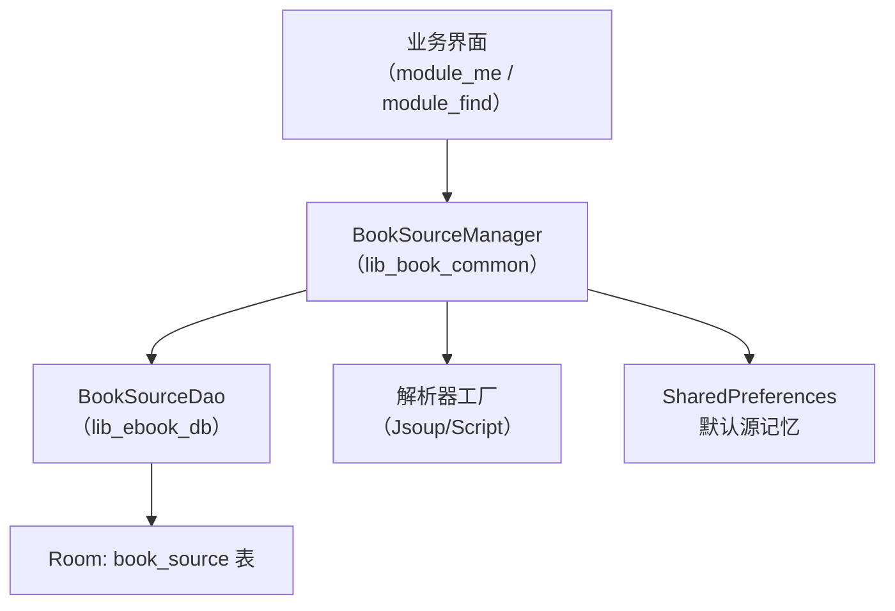
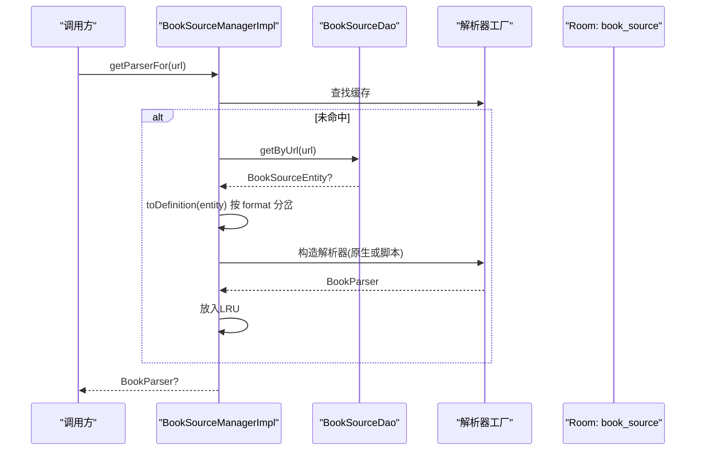
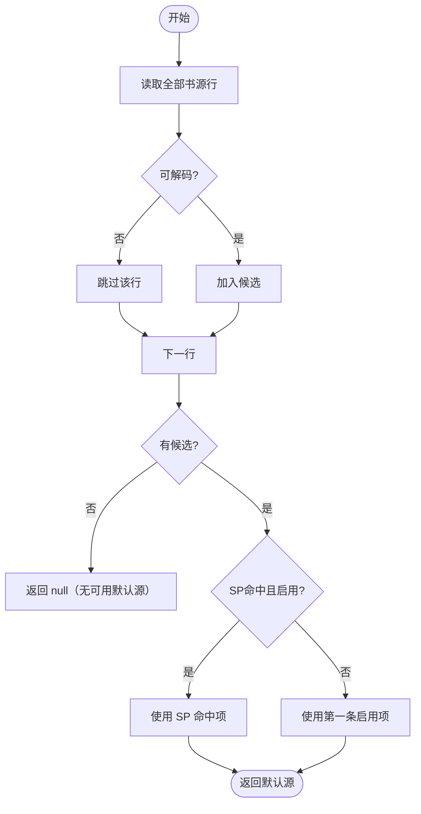
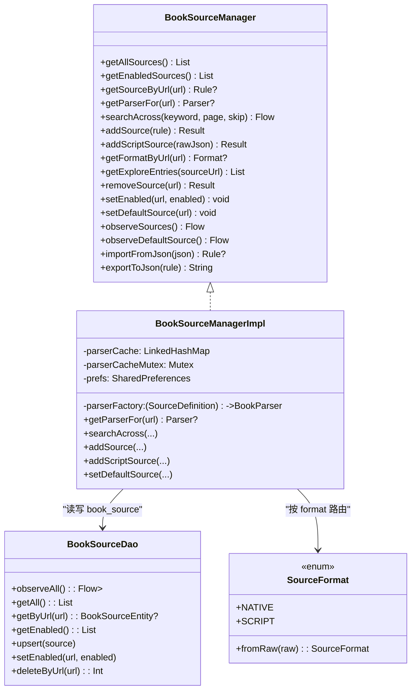

# 多书源管理

<cite>
**本文引用的文件**
- [BookSourceManager.kt](file://lib_book_common/src/main/java/com/ebook/common/analyze/source/BookSourceManager.kt)
- [BookSourceManagerImpl.kt](file://lib_book_common/src/main/java/com/ebook/common/analyze/source/BookSourceManagerImpl.kt)
- [BookSourceItem.kt](file://lib_book_common/src/main/java/com/ebook/common/analyze/source/BookSourceItem.kt)
- [SourceStorageJson.kt](file://lib_book_common/src/main/java/com/ebook/common/analyze/source/SourceStorageJson.kt)
- [BookSourceEntity.kt](file://lib_ebook_db/src/main/java/com/ebook/db/entity/BookSourceEntity.kt)
- [BookSourceDao.kt](file://lib_ebook_db/src/main/java/com/ebook/db/dao/BookSourceDao.kt)
- [SourceFormat.kt](file://lib_ebook_api/src/main/java/com/ebook/api/entity/SourceFormat.kt)
- [AppDatabase.kt](file://lib_ebook_db/src/main/java/com/ebook/db/AppDatabase.kt)
- [8.json](file://lib_ebook_db/schemas/com.ebook.db.AppDatabase/8.json)
- [BookSourceViewModel.kt](file://module_me/src/main/java/com/ebook/me/mvvm/viewmodel/BookSourceViewModel.kt)
- [BookSourceManageActivity.kt](file://module_me/src/main/java/com/ebook/me/view/BookSourceManageActivity.kt)
- [SearchViewModel.kt](file://module_find/src/main/java/com/ebook/find/mvvm/viewmodel/SearchViewModel.kt)
- [LibraryViewModel.kt](file://module_find/src/main/java/com/ebook/find/mvvm/viewmodel/LibraryViewModel.kt)
</cite>

## 目录
1. [简介](#简介)
2. [项目结构](#项目结构)
3. [核心组件](#核心组件)
4. [架构总览](#架构总览)
5. [详细组件分析](#详细组件分析)
6. [依赖关系分析](#依赖关系分析)
7. [性能考量](#性能考量)
8. [故障排查指南](#故障排查指南)
9. [结论](#结论)
10. [附录](#附录)

## 简介
本文件系统性说明“多书源管理”的设计与实现：以 BookSourceManager 为唯一入口，统一管理原生规则书源与脚本书源的共存、增删改查、启用禁用、默认源选择算法、解析器缓存、聚合搜索与订阅通知。同时覆盖 Room 表结构、数据迁移策略、跨模块可见性设计、SP 持久化机制与默认源现算逻辑，以及脚本行为何需要特殊处理的原因与实践。

## 项目结构
多书源管理横跨三个层次：
- 领域接口与实现：lib_book_common 中的 BookSourceManager 及实现类，负责统一的多书源管理与路由
- 数据层：lib_ebook_db 的 book_source 实体与 DAO，作为书源清单的唯一事实源
- 业务使用方：module_me（书源管理页）、module_find（书城/搜索）等通过 Manager 进行读写与订阅

图表来源
- [BookSourceManager.kt:10-50](file://lib_book_common/src/main/java/com/ebook/common/analyze/source/BookSourceManager.kt#L10-L50)
- [BookSourceManagerImpl.kt:84-119](file://lib_book_common/src/main/java/com/ebook/common/analyze/source/BookSourceManagerImpl.kt#L84-L119)
- [BookSourceDao.kt:25-101](file://lib_ebook_db/src/main/java/com/ebook/db/dao/BookSourceDao.kt#L25-L101)
- [AppDatabase.kt](file://lib_ebook_db/src/main/java/com/ebook/db/AppDatabase.kt)

章节来源
- [BookSourceManager.kt:10-50](file://lib_book_common/src/main/java/com/ebook/common/analyze/source/BookSourceManager.kt#L10-L50)
- [BookSourceDao.kt:25-101](file://lib_ebook_db/src/main/java/com/ebook/db/dao/BookSourceDao.kt#L25-L101)

## 核心组件
- BookSourceManager：多书源共存清单的唯一入口，定义规则类型化读面、条目订阅、默认源订阅、聚合搜索、导入导出等能力
- BookSourceManagerImpl：实现类，封装 Room 读写、LRU 解析器缓存、默认源现算与 SP 持久化、格式路由（原生/脚本）
- BookSourceItem：管理页面专用的“规则+format”条目，format 用于区分出身并指导渲染与导出入口
- SourceFormat：枚举 native/script，作为 format 列的路由键
- BookSourceEntity/BookSourceDao：book_source 表的实体与访问器，提供观察流与一次性查询
- AppDatabase/Schema：Room 数据库与 schema 文件，承载迁移与版本管理

章节来源
- [BookSourceManager.kt:51-277](file://lib_book_common/src/main/java/com/ebook/common/analyze/source/BookSourceManager.kt#L51-L277)
- [BookSourceManagerImpl.kt:84-868](file://lib_book_common/src/main/java/com/ebook/common/analyze/source/BookSourceManagerImpl.kt#L84-L868)
- [BookSourceItem.kt:6-49](file://lib_book_common/src/main/java/com/ebook/common/analyze/source/BookSourceItem.kt#L6-L49)
- [SourceFormat.kt:1-91](file://lib_ebook_api/src/main/java/com/ebook/api/entity/SourceFormat.kt#L1-L91)
- [BookSourceEntity.kt:7-91](file://lib_ebook_db/src/main/java/com/ebook/db/entity/BookSourceEntity.kt#L7-L91)
- [BookSourceDao.kt:25-101](file://lib_ebook_db/src/main/java/com/ebook/db/dao/BookSourceDao.kt#L25-L101)

## 架构总览
多书源管理的核心是“单一事实源 + 双后端求值”：
- 事实源：book_source 表只由用户导入产生，不存在内置源；所有读操作走 Room
- 求值后端：按 format 分岔，原生规则走 JsoupBookParser，脚本行走 ScriptBookParser
- 默认源：每次从 Room 现算（优先 SP 命中且启用的源，否则第一条启用源），不维护内存快照
- 缓存：解析器按 URL 进 LRU，写路径统一失效对应 URL 的缓存
- 订阅：observeSources 返回条目（含 format），observeDefaultSource 返回默认源定义（格式中立）

图表来源
- [BookSourceManagerImpl.kt:433-443](file://lib_book_common/src/main/java/com/ebook/common/analyze/source/BookSourceManagerImpl.kt#L433-L443)
- [BookSourceManagerImpl.kt:354-364](file://lib_book_common/src/main/java/com/ebook/common/analyze/source/BookSourceManagerImpl.kt#L354-L364)
- [BookSourceDao.kt:51-52](file://lib_ebook_db/src/main/java/com/ebook/db/dao/BookSourceDao.kt#L51-L52)

章节来源
- [BookSourceManagerImpl.kt:433-443](file://lib_book_common/src/main/java/com/ebook/common/analyze/source/BookSourceManagerImpl.kt#L433-L443)

## 详细组件分析

### BookSourceManager 接口设计
- 规则类型化读面：getAllSources/getEnabledSources/getSourceByUrl 仅对原生规则行有效，脚本行被挡下
- 条目订阅：observeSources 返回 BookSourceItem，带 format，供管理页渲染
- 默认源订阅：observeDefaultSource 返回 SourceDefinition（格式中立），无启用源时发 null
- 聚合搜索：searchAcross 并发上限 5，单源失败不影响整体流
- 导入导出：importFromJson/exportToJson 纯函数；addSource/addScriptSource 落库并可能提升默认源
- 状态管理：removeSource/setEnabled/setDefaultSource 均会失效对应 URL 的解析器缓存

章节来源
- [BookSourceManager.kt:51-277](file://lib_book_common/src/main/java/com/ebook/common/analyze/source/BookSourceManager.kt#L51-L277)

### BookSourceManagerImpl 实现要点
- 默认源现算：defaultFromRows 在条目面筛选启用行，先取 SP 命中项（需启用），否则取第一条启用行
- 解析器 LRU：容量小（常驻书籍数级），同一 URL 的解析器实例共享，写路径统一 evictParser
- 格式路由：toDefinition 按 format 分岔；toRule 将非原生行挡下；toItem 决定规则是否解码
- 聚合搜索：候选来自 enabled 行经 toItem 映射，单源异常收敛为 Failed+Finished
- 写入一致性：addSource/addScriptSource 保持 addedAt/weight/group 的保留策略，必要时提升默认源
- 默认源同步：setDefaultSource 若目标禁用则自动启用，随后 persistDefaultUrl 并 evictParser

章节来源
- [BookSourceManagerImpl.kt:207-214](file://lib_book_common/src/main/java/com/ebook/common/analyze/source/BookSourceManagerImpl.kt#L207-L214)
- [BookSourceManagerImpl.kt:277-310](file://lib_book_common/src/main/java/com/ebook/common/analyze/source/BookSourceManagerImpl.kt#L277-L310)
- [BookSourceManagerImpl.kt:330-364](file://lib_book_common/src/main/java/com/ebook/common/analyze/source/BookSourceManagerImpl.kt#L330-L364)
- [BookSourceManagerImpl.kt:464-510](file://lib_book_common/src/main/java/com/ebook/common/analyze/source/BookSourceManagerImpl.kt#L464-L510)
- [BookSourceManagerImpl.kt:525-637](file://lib_book_common/src/main/java/com/ebook/common/analyze/source/BookSourceManagerImpl.kt#L525-L637)
- [BookSourceManagerImpl.kt:756-778](file://lib_book_common/src/main/java/com/ebook/common/analyze/source/BookSourceManagerImpl.kt#L756-L778)

### BookSourceItem 元数据与 format 的作用
- BookSourceItem 由 rule + format 组成，format 标识该行是原生规则还是脚本
- 脚本行的 rule 是展示用空壳（仅含名称/地址/启用态/权重/分组），不参与解码
- 管理页必须先判 format 再渲染：脚本行没有可用规则、是否需要导出入口都由 format 决定
- 为什么不能把 format 塞进 BookSourceRule：规则用于社区交换，不应混入本机存储标记

章节来源
- [BookSourceItem.kt:6-49](file://lib_book_common/src/main/java/com/ebook/common/analyze/source/BookSourceItem.kt#L6-L49)
- [BookSourceManagerImpl.kt:277-310](file://lib_book_common/src/main/java/com/ebook/common/analyze/source/BookSourceManagerImpl.kt#L277-L310)

### 脚本行为何需要特殊处理
- 脚本 JSON 的顶层键与原生规则同名但形状不同（如 weight、headers），直接解会抛异常或得到空规则
- 因此 toRule 将非原生行挡下，避免脏数据污染规则类型化读面
- 脚本行在 observeSources 中仍可见（管理页需要能管理它），但其 rule 只是展示壳
- 求值链路不走 toRule，而是 toDefinition → 解析器工厂 → ScriptBookParser（惰性装载规则）

章节来源
- [BookSourceManagerImpl.kt:330-336](file://lib_book_common/src/main/java/com/ebook/common/analyze/source/BookSourceManagerImpl.kt#L330-L336)
- [BookSourceManagerImpl.kt:354-364](file://lib_book_common/src/main/java/com/ebook/common/analyze/source/BookSourceManagerImpl.kt#L354-L364)

### 书源增删改查与启用禁用
- 新增/覆盖：addSource（原生）、addScriptSource（脚本），REPLACE 语义，保留 addedAt/weight/group
- 删除：removeSource，返回受影响行数，若删除的是当前默认源则收敛默认源
- 启用/禁用：setEnabled 只更新 enabled 列；禁用不切断已有归属（已绑书仍可解析）
- 默认源设置：setDefaultSource 若目标禁用则自动启用，然后写 SP 并失效缓存

章节来源
- [BookSourceManagerImpl.kt:525-637](file://lib_book_common/src/main/java/com/ebook/common/analyze/source/BookSourceManagerImpl.kt#L525-L637)
- [BookSourceManagerImpl.kt:671-690](file://lib_book_common/src/main/java/com/ebook/common/analyze/source/BookSourceManagerImpl.kt#L671-L690)
- [BookSourceManagerImpl.kt:723-739](file://lib_book_common/src/main/java/com/ebook/common/analyze/source/BookSourceManagerImpl.kt#L723-L739)
- [BookSourceManagerImpl.kt:756-778](file://lib_book_common/src/main/java/com/ebook/common/analyze/source/BookSourceManagerImpl.kt#L756-L778)

### 默认源选择算法与 SP 持久化
- 现算逻辑：defaultFromRows 从全部行筛选可解码条目，优先 SP 命中且启用者，否则第一条启用者
- SP 持久化：persistDefaultUrl 写 KEY_CURRENT_SOURCE，并推送 defaultUrlFlow 给订阅面
- 写后收敛：syncDefaultAfterWrite 在 add/remove/setEnabled 等写路径触发，确保 SP 与 Room 一致
- 无可用源：任何 enabled 行都不存在时 observeDefaultSource 发 null，引导用户导入或启用

图表来源
- [BookSourceManagerImpl.kt:207-214](file://lib_book_common/src/main/java/com/ebook/common/analyze/source/BookSourceManagerImpl.kt#L207-L214)
- [BookSourceManagerImpl.kt:235-238](file://lib_book_common/src/main/java/com/ebook/common/analyze/source/BookSourceManagerImpl.kt#L235-L238)
- [BookSourceManagerImpl.kt:790-793](file://lib_book_common/src/main/java/com/ebook/common/analyze/source/BookSourceManagerImpl.kt#L790-L793)

章节来源
- [BookSourceManagerImpl.kt:207-214](file://lib_book_common/src/main/java/com/ebook/common/analyze/source/BookSourceManagerImpl.kt#L207-L214)
- [BookSourceManagerImpl.kt:235-238](file://lib_book_common/src/main/java/com/ebook/common/analyze/source/BookSourceManagerImpl.kt#L235-L238)

### 订阅通知系统
- observeSources：冷流，收集时才查 DAO，返回条目列表（含 format）
- observeDefaultSource：combine defaultUrlFlow 与 observeAll，任一变化即重推
- 聚合搜索：searchAcross 发出 Started/Result/Failed/Finished/AllFinished 事件流

章节来源
- [BookSourceManagerImpl.kt:834-851](file://lib_book_common/src/main/java/com/ebook/common/analyze/source/BookSourceManagerImpl.kt#L834-L851)
- [BookSourceManagerImpl.kt:464-510](file://lib_book_common/src/main/java/com/ebook/common/analyze/source/BookSourceManagerImpl.kt#L464-L510)

### 解析器缓存与冲突处理
- 缓存键：URL；容量固定（PARSER_CACHE_SIZE）；并发通过 Mutex 串行化
- 失效策略：所有写路径成功后 evictParser，包括格式翻转（native↔script）
- 冲突场景：同 URL 覆盖导入会 REPLACE 整行，缓存必须失效，否则拿到旧解析器实例
- 本地书短路：tag 为空或 LOCAL_TAG 时 getParserFor 直接返回 null

章节来源
- [BookSourceManagerImpl.kt:147-167](file://lib_book_common/src/main/java/com/ebook/common/analyze/source/BookSourceManagerImpl.kt#L147-L167)
- [BookSourceManagerImpl.kt:433-443](file://lib_book_common/src/main/java/com/ebook/common/analyze/source/BookSourceManagerImpl.kt#L433-L443)
- [BookSourceManagerImpl.kt:817-819](file://lib_book_common/src/main/java/com/ebook/common/analyze/source/BookSourceManagerImpl.kt#L817-L819)

### 扩展书源格式与自定义解析器
- 扩展点：parserFactory（SourceDefinition → BookParser）是唯一分岔点，新增格式只需在此处分支
- 路由键：format 列，读写一律取 SourceFormat.raw 避免大小写漂移
- 条目面：toItem 决定是否解码 rule_json，新增格式需考虑管理页可见性与 rule 合成策略
- 规则类型化读面：toRule 可将新格式挡下，避免误入规则专用链路

章节来源
- [BookSourceManagerImpl.kt:109-118](file://lib_book_common/src/main/java/com/ebook/common/analyze/source/BookSourceManagerImpl.kt#L109-L118)
- [BookSourceManagerImpl.kt:330-364](file://lib_book_common/src/main/java/com/ebook/common/analyze/source/BookSourceManagerImpl.kt#L330-L364)
- [SourceFormat.kt:14-34](file://lib_ebook_api/src/main/java/com/ebook/api/entity/SourceFormat.kt#L14-L34)

### Room 表结构与迁移策略
- book_source 表主键为 url（自然键），REPLACE 语义支持重复导入更新
- 字段包含 name/rule_json/enabled/weight/group_name/format/added_at
- 迁移：version+1，追加 MIGRATION_n_n+1，提交 Room 生成的 schema JSON，禁止 fallbackToDestructiveMigration
- 排序口径：weight ASC, added_at ASC, url ASC，保证列表稳定

章节来源
- [BookSourceEntity.kt:18-91](file://lib_ebook_db/src/main/java/com/ebook/db/entity/BookSourceEntity.kt#L18-L91)
- [BookSourceDao.kt:25-24](file://lib_ebook_db/src/main/java/com/ebook/db/dao/BookSourceDao.kt#L25-L24)
- [8.json:359-418](file://lib_ebook_db/schemas/com.ebook.db.AppDatabase/8.json#L359-L418)

### 跨模块可见性设计
- 解析器与内部工具需 public 暴露以便测试与跨模块使用（如 JsoupBookParser.rule、ChapterPageMatcher、ScriptBookParser）
- internal 仅在模块内可见，依赖方的 test source set 不是 friend module，故不可随意收窄
- 解析器测试必须与实现放在同一模块，以保证访问权限正确

章节来源
- [AGENTS.md](file://AGENTS.md)

## 依赖关系分析
- 业务模块 → BookSourceManager（lib_book_common）
- BookSourceManagerImpl → BookSourceDao（lib_ebook_db）、OkHttpClient（@Named("source")）、JsSandboxHost（可选）
- 解析器工厂 → JsoupBookParser（原生）、ScriptBookParser（脚本）
- 默认源订阅 → combine(defaultUrlFlow, observeAll)

图表来源
- [BookSourceManager.kt:51-277](file://lib_book_common/src/main/java/com/ebook/common/analyze/source/BookSourceManager.kt#L51-L277)
- [BookSourceManagerImpl.kt:84-119](file://lib_book_common/src/main/java/com/ebook/common/analyze/source/BookSourceManagerImpl.kt#L84-L119)
- [BookSourceDao.kt:25-101](file://lib_ebook_db/src/main/java/com/ebook/db/dao/BookSourceDao.kt#L25-L101)
- [SourceFormat.kt:14-34](file://lib_ebook_api/src/main/java/com/ebook/api/entity/SourceFormat.kt#L14-L34)

章节来源
- [BookSourceManager.kt:51-277](file://lib_book_common/src/main/java/com/ebook/common/analyze/source/BookSourceManager.kt#L51-L277)
- [BookSourceManagerImpl.kt:84-119](file://lib_book_common/src/main/java/com/ebook/common/analyze/source/BookSourceManagerImpl.kt#L84-L119)

## 性能考量
- 聚合搜索并发上限 5，避免对第三方站点造成风控压力
- 解析器 LRU 容量小（常驻书籍数级），减少内存占用与重建成本
- 观察流冷启动：collect 时才查库，避免无用开销
- 单源失败不中断聚合流，提高整体稳定性
- 默认源每次现算，避免内存快照与 Room 不一致的风险

章节来源
- [BookSourceManagerImpl.kt:147-167](file://lib_book_common/src/main/java/com/ebook/common/analyze/source/BookSourceManagerImpl.kt#L147-L167)
- [BookSourceManagerImpl.kt:464-510](file://lib_book_common/src/main/java/com/ebook/common/analyze/source/BookSourceManagerImpl.kt#L464-L510)

## 故障排查指南
- 默认源为空：检查是否有 enabled 行；observeDefaultSource 在无启用源时发 null
- 脚本行不可见：确认 observeSources 返回条目（含 format），不要误用 getSourceByUrl（它对脚本行返回 null）
- 解析器缓存陈旧：确认写路径调用了 evictParser；格式翻转也必须失效
- 聚合搜索某源失败：查看 SourceFailed 事件，单源失败不影响其他源
- 导入预览与落库不一致：确保使用 storageJson 同一实例，避免接受集分裂

章节来源
- [BookSourceManagerImpl.kt:207-214](file://lib_book_common/src/main/java/com/ebook/common/analyze/source/BookSourceManagerImpl.kt#L207-L214)
- [BookSourceManagerImpl.kt:433-443](file://lib_book_common/src/main/java/com/ebook/common/analyze/source/BookSourceManagerImpl.kt#L433-L443)
- [BookSourceManagerImpl.kt:491-510](file://lib_book_common/src/main/java/com/ebook/common/analyze/source/BookSourceManagerImpl.kt#L491-L510)
- [SourceStorageJson.kt:8-21](file://lib_book_common/src/main/java/com/ebook/common/analyze/source/SourceStorageJson.kt#L8-L21)

## 结论
多书源管理以 BookSourceManager 为核心，通过 Room 单一事实源、格式路由、LRU 解析器缓存与 SP 持久化，实现了原生规则与脚本书源的统一共存与灵活扩展。默认源采用现算策略，避免内存与持久化状态分裂；聚合搜索与订阅通知保障了高可用的用户体验。未来扩展新格式只需关注 parserFactory、toDefinition 与 toItem 三处，即可无缝接入现有体系。

## 附录
- 扩展示例路径参考：
  - 新增格式路由：[BookSourceManagerImpl.kt:354-364](file://lib_book_common/src/main/java/com/ebook/common/analyze/source/BookSourceManagerImpl.kt#L354-L364)
  - 解析器工厂装配：[BookSourceManagerImpl.kt:109-118](file://lib_book_common/src/main/java/com/ebook/common/analyze/source/BookSourceManagerImpl.kt#L109-L118)
  - 默认源现算与持久化：[BookSourceManagerImpl.kt:207-214](file://lib_book_common/src/main/java/com/ebook/common/analyze/source/BookSourceManagerImpl.kt#L207-L214), [BookSourceManagerImpl.kt:235-238](file://lib_book_common/src/main/java/com/ebook/common/analyze/source/BookSourceManagerImpl.kt#L235-L238)
  - 聚合搜索编排：[BookSourceManagerImpl.kt:464-510](file://lib_book_common/src/main/java/com/ebook/common/analyze/source/BookSourceManagerImpl.kt#L464-L510)
  - 表结构与迁移：[BookSourceEntity.kt:18-91](file://lib_ebook_db/src/main/java/com/ebook/db/entity/BookSourceEntity.kt#L18-L91), [8.json:359-418](file://lib_ebook_db/schemas/com.ebook.db.AppDatabase/8.json#L359-L418)