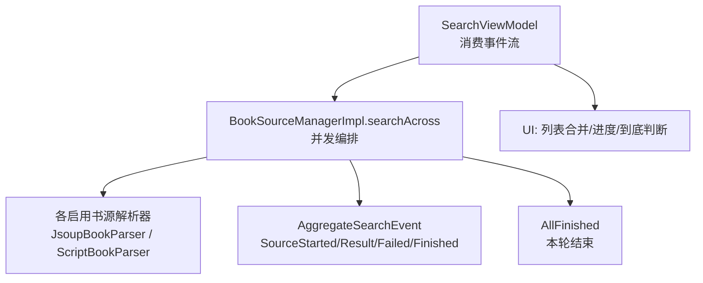
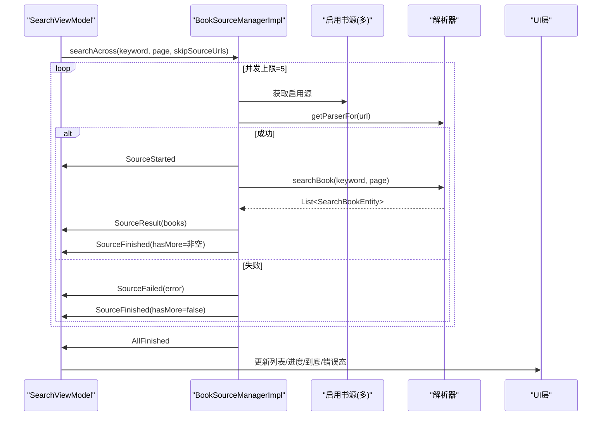
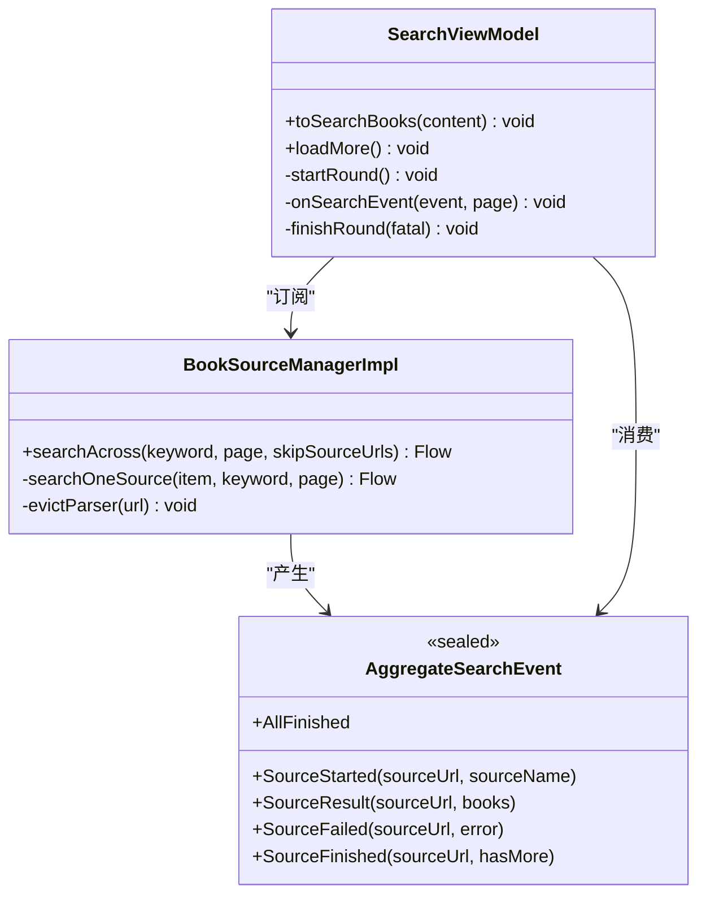
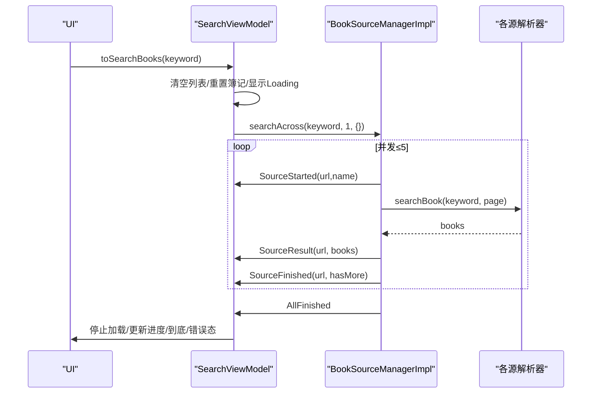
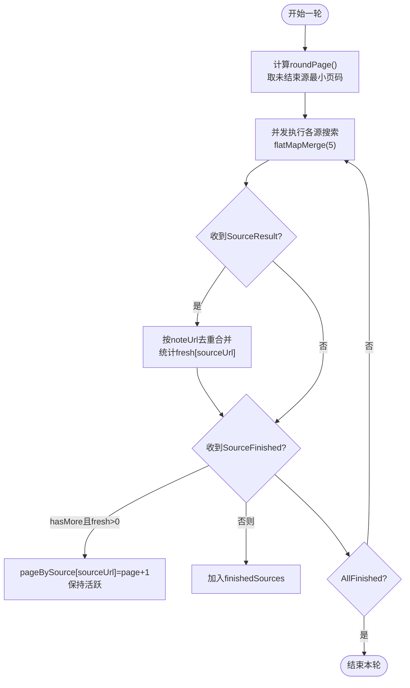
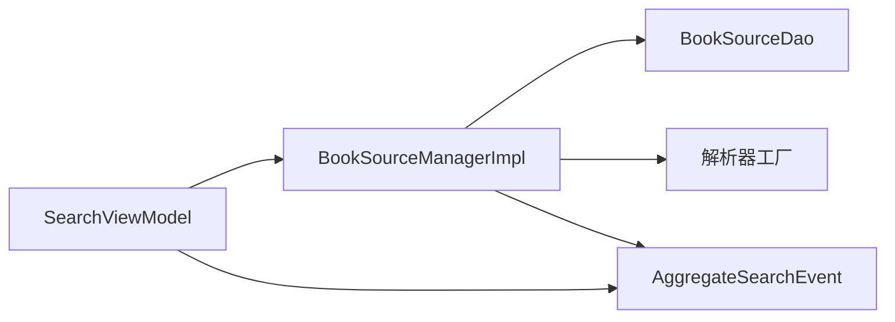

# 聚合搜索

<cite>
**本文引用的文件**
- [AggregateSearchEvent.kt](file://lib_book_source/src/main/java/com/ebook/source/analyze/AggregateSearchEvent.kt)
- [BookSourceManagerImpl.kt](file://lib_book_common/src/main/java/com/ebook/common/analyze/source/BookSourceManagerImpl.kt)
- [SearchViewModel.kt](file://module_find/src/main/java/com/ebook/find/mvvm/viewmodel/SearchViewModel.kt)
- [BookSourceManagerImplTest.kt](file://lib_book_common/src/test/java/com/ebook/common/analyze/source/BookSourceManagerImplTest.kt)
</cite>

## 目录
1. [简介](#简介)
2. [项目结构](#项目结构)
3. [核心组件](#核心组件)
4. [架构总览](#架构总览)
5. [详细组件分析](#详细组件分析)
6. [依赖关系分析](#依赖关系分析)
7. [性能考虑](#性能考虑)
8. [故障排查指南](#故障排查指南)
9. [结论](#结论)
10. [附录](#附录)

## 简介
本文围绕“聚合搜索”功能，系统性说明 searchAcross 的实现原理与事件流设计，覆盖并发控制（最大并发数 5）、失败处理（单源失败不影响整体、取消异常原样上抛）、分页推进机制、skipSourceUrls 的作用与去重策略、“到底”判据、以及 UI 侧如何监听搜索结果与优化体验。同时对比聚合搜索与单个书源搜索的差异，并给出性能优化建议。

## 项目结构
聚合搜索涉及三层：
- 事件定义层：AggregateSearchEvent 定义了按书源分批到达的增量事件模型（SourceStarted/SourceResult/SourceFailed/SourceFinished/AllFinished）。
- 编排层：BookSourceManagerImpl.searchAcross 负责并发调度、失败收敛、完成信号发出。
- 消费层：SearchViewModel 消费事件流，维护每轮簿记、全局去重、分页游标、进度与错误态。

图表来源
- [BookSourceManagerImpl.kt:464-510](file://lib_book_common/src/main/java/com/ebook/common/analyze/source/BookSourceManagerImpl.kt#L464-L510)
- [AggregateSearchEvent.kt:21-75](file://lib_book_source/src/main/java/com/ebook/source/analyze/AggregateSearchEvent.kt#L21-L75)
- [SearchViewModel.kt:261-375](file://module_find/src/main/java/com/ebook/find/mvvm/viewmodel/SearchViewModel.kt#L261-L375)

章节来源
- [BookSourceManagerImpl.kt:142-167](file://lib_book_common/src/main/java/com/ebook/common/analyze/source/BookSourceManagerImpl.kt#L142-L167)
- [AggregateSearchEvent.kt:1-75](file://lib_book_source/src/main/java/com/ebook/source/analyze/AggregateSearchEvent.kt#L1-L75)
- [SearchViewModel.kt:29-54](file://module_find/src/main/java/com/ebook/find/mvvm/viewmodel/SearchViewModel.kt#L29-L54)

## 核心组件
- AggregateSearchEvent：封装一次聚合搜索中“按书源分批到达”的事件语义，明确 Started/Result/Failed/Finished/AllFinished 的职责与顺序约束。
- BookSourceManagerImpl.searchAcross：将启用书源清单转换为 Flow，使用 flatMapMerge 限制并发上限（常量 AGGREGATE_SEARCH_CONCURRENCY = 5），对每条源执行 searchOneSource，并在末尾发射 AllFinished。
- SearchViewModel：实现一轮搜索的完整生命周期管理（开始、收集、合并结果、翻页推进、收尾、错误态），维护 per-source 游标、finishedSources、去重计数等。

章节来源
- [BookSourceManagerImpl.kt:464-510](file://lib_book_common/src/main/java/com/ebook/common/analyze/source/BookSourceManagerImpl.kt#L464-L510)
- [SearchViewModel.kt:261-375](file://module_find/src/main/java/com/ebook/find/mvvm/viewmodel/SearchViewModel.kt#L261-L375)
- [AggregateSearchEvent.kt:21-75](file://lib_book_source/src/main/java/com/ebook/source/analyze/AggregateSearchEvent.kt#L21-L75)

## 架构总览
聚合搜索以“事件流 + 并发编排”为核心，UI 通过 StateFlow/SharedFlow 消费实时状态与结果。

图表来源
- [BookSourceManagerImpl.kt:464-510](file://lib_book_common/src/main/java/com/ebook/common/analyze/source/BookSourceManagerImpl.kt#L464-L510)
- [SearchViewModel.kt:261-375](file://module_find/src/main/java/com/ebook/find/mvvm/viewmodel/SearchViewModel.kt#L261-L375)
- [AggregateSearchEvent.kt:21-75](file://lib_book_source/src/main/java/com/ebook/source/analyze/AggregateSearchEvent.kt#L21-L75)

## 详细组件分析

### 事件类型与流转
- SourceStarted：登记参与本轮的源，记录 sourceUrl 与 sourceName，供 UI 展示“已收到 X/Y 书源结果”。
- SourceResult：该源返回一页结果；空列表也合法，配合 Finished 表达“该页无新增，可能到底”。
- SourceFailed：仅影响该源，不终止聚合流；紧随其后必发 SourceFinished(hasMore=false)。
- SourceFinished：标志该源本轮结束；hasMore 是“本源视角”的下一页可能性，不足以单独判定“到底”，需结合去重后是否带来新条目。
- AllFinished：本轮聚合结束；即使某路协程被取消导致未发 Finished，AllFinished 仍会到达，作为“本轮结束”的唯一可靠判据。

章节来源
- [AggregateSearchEvent.kt:21-75](file://lib_book_source/src/main/java/com/ebook/source/analyze/AggregateSearchEvent.kt#L21-L75)

### 并发控制策略（最大并发数 5）
- 使用 flatMapMerge(AGGREGATE_SEARCH_CONCURRENCY) 限制同时运行的书源解析数量，避免对第三方站点同时发起过多请求触发风控。
- 每个源的解析在独立子流中进行，互不阻塞；UI 收到的事件交错，不能假定“一条源完成后才轮到下一条”。

章节来源
- [BookSourceManagerImpl.kt:142-167](file://lib_book_common/src/main/java/com/ebook/common/analyze/source/BookSourceManagerImpl.kt#L142-L167)
- [BookSourceManagerImpl.kt:464-476](file://lib_book_common/src/main/java/com/ebook/common/analyze/source/BookSourceManagerImpl.kt#L464-L476)

### 失败处理机制
- 单源失败只在该源范围内上报 SourceFailed，并立即发送 SourceFinished(hasMore=false)，确保 UI 进度正确递增。
- 网络异常（如远端 500/超时/DNS 失败）通常被解析器内部吞掉并返回空列表，表现为 SourceResult([])+SourceFinished(false)，而非 SourceFailed。
- 取消异常（CancellationException）在单源协程内原样上抛，由上层取消链路处理，避免旧轮次残留数据污染新一轮。

章节来源
- [BookSourceManagerImpl.kt:487-510](file://lib_book_common/src/main/java/com/ebook/common/analyze/source/BookSourceManagerImpl.kt#L487-L510)
- [AggregateSearchEvent.kt:40-74](file://lib_book_source/src/main/java/com/ebook/source/analyze/AggregateSearchEvent.kt#L40-L74)

### 分页推进机制与 skipSourceUrls
- 每轮开始时，计算当前页码 roundPage()：取所有未结束源的最小页码（默认第 1 页），保证同源游标一致。
- finishedSources 保存已到底的源 URL，下一轮通过 skipSourceUrls 排除这些源，不再重复请求。
- “到底”判据：不仅看 hasMore，还要看该页去重后是否带来新条目；若软 404（HTTP 200 但内容重复首页书目）导致 fresh=0，则将该源加入 finishedSources。
- 翻页时只对未结束的源继续翻下一页，所有源都结束时 stopLoadMore 并置“没有更多”。

章节来源
- [SearchViewModel.kt:130-167](file://module_find/src/main/java/com/ebook/find/mvvm/viewmodel/SearchViewModel.kt#L130-L167)
- [SearchViewModel.kt:261-375](file://module_find/src/main/java/com/ebook/find/mvvm/viewmodel/SearchViewModel.kt#L261-L375)
- [SearchViewModel.kt:377-386](file://module_find/src/main/java/com/ebook/find/mvvm/viewmodel/SearchViewModel.kt#L377-L386)

### 去重策略
- 全局按 noteUrl 去重：同一本书在不同源下可能具有相同 noteUrl，保留唯一实例以避免重复与 Compose key 冲突。
- 不按 name+author 去重：同名不同源的条目均保留，为后续“换源阅读”提供备选入口。
- 去重计数用于判断“到底”：若某页 fresh=0，即使 hasMore=true 也视为该源到底。

章节来源
- [SearchViewModel.kt:48-54](file://module_find/src/main/java/com/ebook/find/mvvm/viewmodel/SearchViewModel.kt#L48-L54)
- [SearchViewModel.kt:323-342](file://module_find/src/main/java/com/ebook/find/mvvm/viewmodel/SearchViewModel.kt#L323-L342)

### 取消异常的原样上抛
- 单源协程捕获 CancellationException 并直接抛出，确保被取消的协程不会继续执行到“正常结束”，从而避免旧轮次结果污染新一轮。
- ViewModel 在 startRound 中 catch CancellationException 并原样上抛，使整条收集链干净退出。

章节来源
- [BookSourceManagerImpl.kt:487-510](file://lib_book_common/src/main/java/com/ebook/common/analyze/source/BookSourceManagerImpl.kt#L487-L510)
- [SearchViewModel.kt:261-284](file://module_find/src/main/java/com/ebook/find/mvvm/viewmodel/SearchViewModel.kt#L261-L284)

### 与单个书源搜索的区别
- 单个书源搜索：一次性拿到该源的结果数组，简单直接；无法体现多源快慢差异，且一旦失败往往整批丢失。
- 聚合搜索：事件流驱动，边收边渲染；单源失败不影响其他源；支持多源并行与分页推进；最终结果由调用方统一去重合并。

章节来源
- [SearchViewModel.kt:29-54](file://module_find/src/main/java/com/ebook/find/mvvm/viewmodel/SearchViewModel.kt#L29-L54)

### 代码级类图（关键对象与关系）

图表来源
- [AggregateSearchEvent.kt:21-75](file://lib_book_source/src/main/java/com/ebook/source/analyze/AggregateSearchEvent.kt#L21-L75)
- [BookSourceManagerImpl.kt:464-510](file://lib_book_common/src/main/java/com/ebook/common/analyze/source/BookSourceManagerImpl.kt#L464-L510)
- [SearchViewModel.kt:261-375](file://module_find/src/main/java/com/ebook/find/mvvm/viewmodel/SearchViewModel.kt#L261-L375)

### 序列图：搜索一轮流程

图表来源
- [SearchViewModel.kt:212-226](file://module_find/src/main/java/com/ebook/find/mvvm/viewmodel/SearchViewModel.kt#L212-L226)
- [BookSourceManagerImpl.kt:464-476](file://lib_book_common/src/main/java/com/ebook/common/analyze/source/BookSourceManagerImpl.kt#L464-L476)

### 流程图：分页推进与“到底”判断

图表来源
- [SearchViewModel.kt:261-375](file://module_find/src/main/java/com/ebook/find/mvvm/viewmodel/SearchViewModel.kt#L261-L375)
- [SearchViewModel.kt:377-386](file://module_find/src/main/java/com/ebook/find/mvvm/viewmodel/SearchViewModel.kt#L377-L386)

## 依赖关系分析
- SearchViewModel 依赖 BookSourceManagerImpl 提供的 searchAcross Flow。
- BookSourceManagerImpl 依赖 DAO 获取启用书源，依赖解析器工厂创建具体解析器（原生/脚本）。
- 事件 AggregateSearchEvent 由 Manager 产生，被 VM 消费，形成单向数据流。

图表来源
- [BookSourceManagerImpl.kt:464-510](file://lib_book_common/src/main/java/com/ebook/common/analyze/source/BookSourceManagerImpl.kt#L464-L510)
- [SearchViewModel.kt:261-375](file://module_find/src/main/java/com/ebook/find/mvvm/viewmodel/SearchViewModel.kt#L261-L375)
- [AggregateSearchEvent.kt:21-75](file://lib_book_source/src/main/java/com/ebook/source/analyze/AggregateSearchEvent.kt#L21-L75)

章节来源
- [BookSourceManagerImpl.kt:464-510](file://lib_book_common/src/main/java/com/ebook/common/analyze/source/BookSourceManagerImpl.kt#L464-L510)
- [SearchViewModel.kt:261-375](file://module_find/src/main/java/com/ebook/find/mvvm/viewmodel/SearchViewModel.kt#L261-L375)

## 性能考虑
- 并发上限：AGGREGATE_SEARCH_CONCURRENCY = 5，平衡吞吐与风控；如需更高吞吐可评估站点容忍度与限流策略。
- 解析器缓存：LRU 容量较小（PARSER_CACHE_SIZE=3），适合“同时活跃书籍数”的场景；聚合搜索会临时访问全部启用源，超出容量的条目会被淘汰，代价仅为重建解析器实例。
- 去重成本：每次合并前构建 noteUrl 集合，时间复杂度 O(N)；合理控制单次结果大小与页面合并频率。
- 取消复用：重新搜索时先 cancel 上一轮 Job，避免多余计算与 UI 闪烁。

章节来源
- [BookSourceManagerImpl.kt:142-167](file://lib_book_common/src/main/java/com/ebook/common/analyze/source/BookSourceManagerImpl.kt#L142-L167)
- [SearchViewModel.kt:212-226](file://module_find/src/main/java/com/ebook/find/mvvm/viewmodel/SearchViewModel.kt#L212-L226)

## 故障排查指南
- 现象：进度条永远差一格
  - 原因：误用“Finished 计数 == Started 计数”作为结束判据；取消路径下可能不发 Finished。
  - 处置：以 AllFinished 作为本轮结束唯一判据。
- 现象：某源失败导致整批结果丢失
  - 原因：未使用事件流或错误吞掉了 SourceResult。
  - 处置：确认使用 searchAcross 事件流，并遵循“单源失败不外溢”的设计。
- 现象：翻页无效或“没有更多”提前出现
  - 原因：未正确统计 fresh[sourceUrl] 或未将 finishedSources 传入 skipSourceUrls。
  - 处置：检查 onSearchEvent 中 SourceFinished 分支与 finishRound 逻辑。
- 现象：旧关键词结果混入新列表
  - 原因：未在 startRound 之前清空列表或未取消上一轮 Job。
  - 处置：确保 toSearchBooks 中先 cancel aggregateJob，再清空列表并 beginRound。

章节来源
- [SearchViewModel.kt:212-226](file://module_find/src/main/java/com/ebook/find/mvvm/viewmodel/SearchViewModel.kt#L212-L226)
- [SearchViewModel.kt:261-375](file://module_find/src/main/java/com/ebook/find/mvvm/viewmodel/SearchViewModel.kt#L261-L375)
- [AggregateSearchEvent.kt:63-74](file://lib_book_source/src/main/java/com/ebook/source/analyze/AggregateSearchEvent.kt#L63-L74)

## 结论
聚合搜索通过事件流与并发编排实现了高可用、可扩展的多源搜索能力。其关键优势包括：
- 稳定可控的并发上限，降低风控风险。
- 单源失败隔离，提升整体鲁棒性。
- 事件驱动的渐进式渲染与实时进度反馈，改善用户体验。
- 基于 noteUrl 的全局去重与 per-source 分页游标，保证结果准确性与翻页正确性。
- 以 AllFinished 作为结束判据，兼容取消路径，避免 UI 卡死。

## 附录

### 如何使用事件流监听搜索结果与进度（示例路径）
- 订阅 searchAcross 并处理事件：
  - 参考：[SearchViewModel.kt:261-375](file://module_find/src/main/java/com/ebook/find/mvvm/viewmodel/SearchViewModel.kt#L261-L375)
- 合并结果并按 noteUrl 去重：
  - 参考：[SearchViewModel.kt:323-342](file://module_find/src/main/java/com/ebook/find/mvvm/viewmodel/SearchViewModel.kt#L323-L342)
- 进度显示：
  - 参考：[SearchViewModel.kt:388-394](file://module_find/src/main/java/com/ebook/find/mvvm/viewmodel/SearchViewModel.kt#L388-L394)

### 优化搜索性能的建议
- 调整并发上限（谨慎）：仅在评估站点风控后可提高 AGGREGATE_SEARCH_CONCURRENCY。
- 减少不必要请求：充分利用 skipSourceUrls 与 finishedSources，避免重复请求已到底的源。
- 批量合并与去重：控制单次合并的数据量，避免大列表频繁重组。
- 尽早取消旧轮：toSearchBooks 中先 cancel 上一轮 Job，减少资源占用。

章节来源
- [BookSourceManagerImpl.kt:142-167](file://lib_book_common/src/main/java/com/ebook/common/analyze/source/BookSourceManagerImpl.kt#L142-L167)
- [SearchViewModel.kt:212-226](file://module_find/src/main/java/com/ebook/find/mvvm/viewmodel/SearchViewModel.kt#L212-L226)
- [SearchViewModel.kt:377-386](file://module_find/src/main/java/com/ebook/find/mvvm/viewmodel/SearchViewModel.kt#L377-L386)