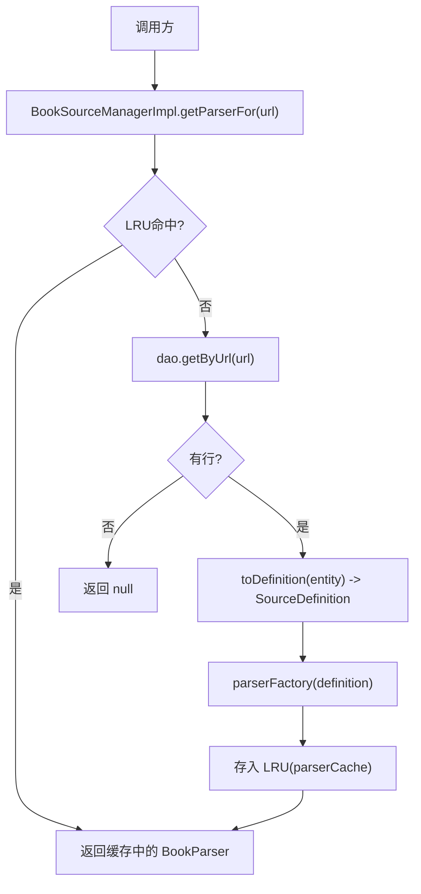
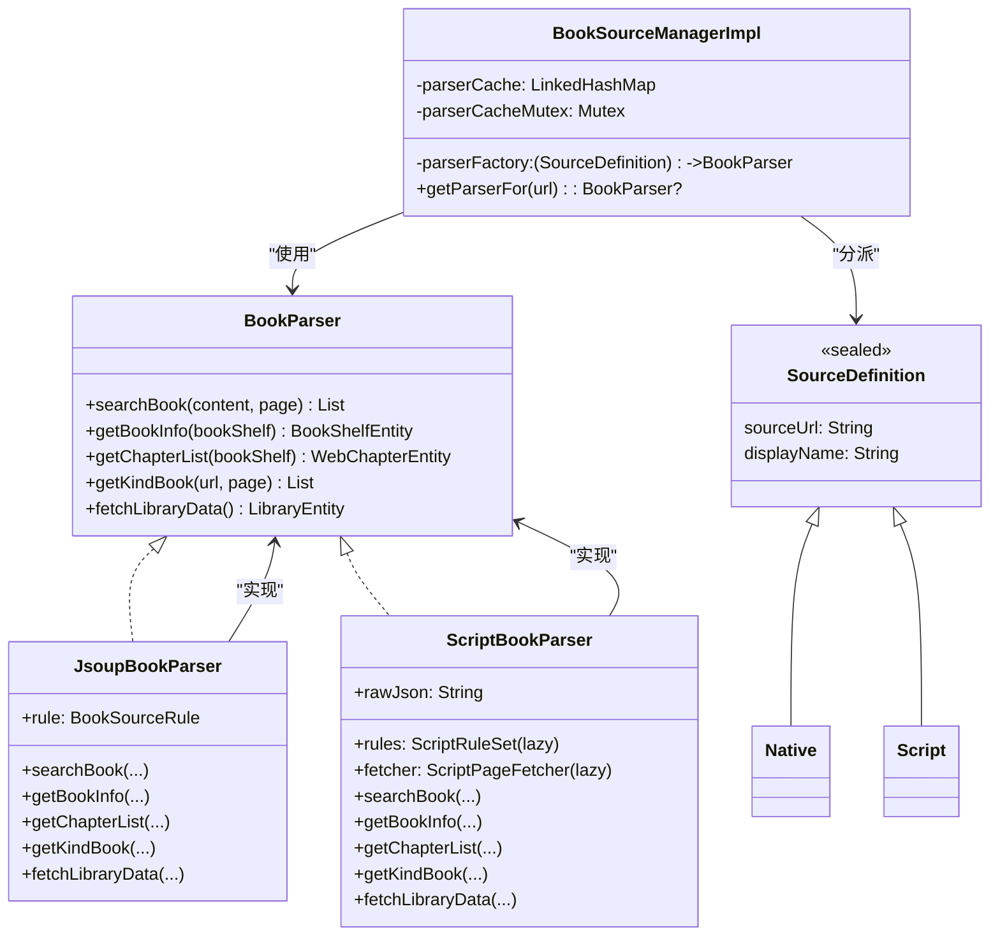
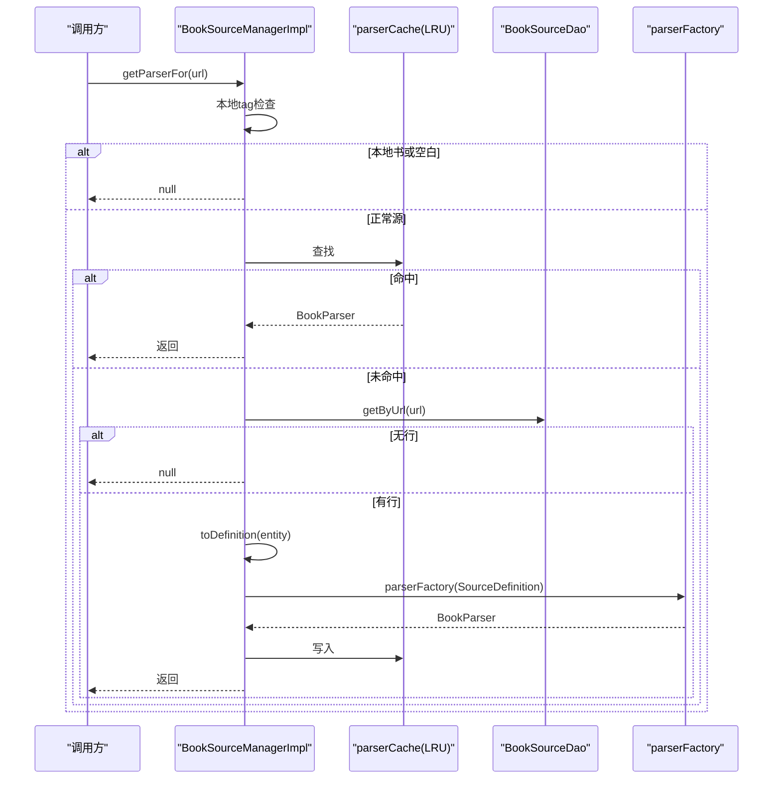
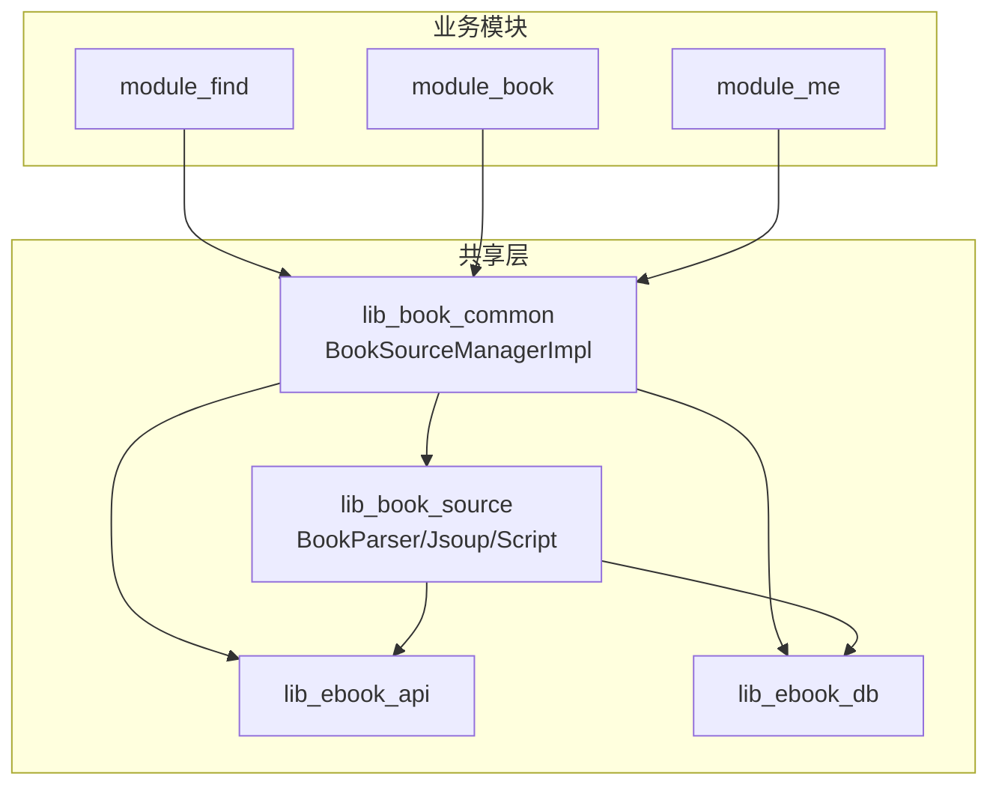

# 解析器工厂

<cite>
**本文引用的文件**
- [BookSourceManagerImpl.kt](file://lib_book_common/src/main/java/com/ebook/common/analyze/source/BookSourceManagerImpl.kt)
- [ScriptBookParser.kt](file://lib_book_source/src/main/java/com/ebook/source/analyze/ScriptBookParser.kt)
- [JsoupBookParser.kt](file://lib_book_source/src/main/java/com/ebook/source/analyze/JsoupBookParser.kt)
- [BookParser.kt](file://lib_book_source/src/main/java/com/ebook/source/analyze/BookParser.kt)
- [SourceFormat.kt](file://lib_ebook_api/src/main/java/com/ebook/api/entity/SourceFormat.kt)
- [JsSandboxHost.kt](file://lib_book_source/src/main/java/com/ebook/source/sandbox/JsSandboxHost.kt)
- [BookSourceManagerImplTest.kt](file://lib_book_common/src/test/java/com/ebook/common/analyze/source/BookSourceManagerImplTest.kt)
</cite>

## 目录
1. [引言](#引言)
2. [项目结构](#项目结构)
3. [核心组件](#核心组件)
4. [架构总览](#架构总览)
5. [详细组件分析](#详细组件分析)
6. [依赖关系分析](#依赖关系分析)
7. [性能考量](#性能考量)
8. [故障排查指南](#故障排查指南)
9. [结论](#结论)
10. [附录](#附录)

## 引言
本文围绕“解析器工厂”展开，系统性说明 BookSourceManagerImpl 中基于 SourceDefinition 的分派机制、原生规则与脚本书源的解析器构建差异、LRU 缓存的实现原理与并发安全、getParserFor 的调用流程与失效策略、以及 ScriptBookParser 的惰性加载与沙箱执行器的可选装配。同时给出扩展新解析器类型、测试工厂与监控命中率的方法建议。

## 项目结构
解析器工厂位于 lib_book_common 的 BookSourceManagerImpl，负责：
- 从 Room 读取书源行并路由为 SourceDefinition（Native 或 Script）
- 通过构造注入的 parserFactory 生产 BookParser 实例
- 维护按 URL 的 LRU 缓存，保证并发安全与失效一致性
- 将默认源与所有启用源统一纳入同一缓存体系

图示来源
- [BookSourceManagerImpl.kt:433-443](file://lib_book_common/src/main/java/com/ebook/common/analyze/source/BookSourceManagerImpl.kt#L433-L443)
- [BookSourceManagerImpl.kt:187-193](file://lib_book_common/src/main/java/com/ebook/common/analyze/source/BookSourceManagerImpl.kt#L187-L193)
- [BookSourceManagerImpl.kt:354-364](file://lib_book_common/src/main/java/com/ebook/common/analyze/source/BookSourceManagerImpl.kt#L354-L364)

章节来源
- [BookSourceManagerImpl.kt:85-119](file://lib_book_common/src/main/java/com/ebook/common/analyze/source/BookSourceManagerImpl.kt#L85-L119)
- [BookSourceManagerImpl.kt:142-167](file://lib_book_common/src/main/java/com/ebook/common/analyze/source/BookSourceManagerImpl.kt#L142-L167)
- [BookSourceManagerImpl.kt:181-193](file://lib_book_common/src/main/java/com/ebook/common/analyze/source/BookSourceManagerImpl.kt#L181-L193)
- [BookSourceManagerImpl.kt:354-364](file://lib_book_common/src/main/java/com/ebook/common/analyze/source/BookSourceManagerImpl.kt#L354-L364)
- [BookSourceManagerImpl.kt:433-443](file://lib_book_common/src/main/java/com/ebook/common/analyze/source/BookSourceManagerImpl.kt#L433-L443)

## 核心组件
- 解析器接口 BookParser：定义搜索、详情、目录、发现、书库数据等统一能力
- 解析器实现：
  - JsoupBookParser：基于 JSON 规则的原生解析器
  - ScriptBookParser：基于社区 JSON + JS 解释器的脚本解析器
- 分派入口 parserFactory：按 SourceDefinition 密封类分支创建对应解析器
- 缓存与并发控制：LinkedHashMap LRU + Mutex 串行化
- 默认源载体与格式路由：SourceDefinition.Native / SourceDefinition.Script，配合 SourceFormat 列值进行路由

章节来源
- [BookParser.kt:12-30](file://lib_book_source/src/main/java/com/ebook/source/analyze/BookParser.kt#L12-L30)
- [JsoupBookParser.kt:27-38](file://lib_book_source/src/main/java/com/ebook/source/analyze/JsoupBookParser.kt#L27-L38)
- [ScriptBookParser.kt:57-73](file://lib_book_source/src/main/java/com/ebook/source/analyze/ScriptBookParser.kt#L57-L73)
- [SourceFormat.kt:14-35](file://lib_ebook_api/src/main/java/com/ebook/api/entity/SourceFormat.kt#L14-L35)
- [SourceFormat.kt:62-91](file://lib_ebook_api/src/main/java/com/ebook/api/entity/SourceFormat.kt#L62-L91)

## 架构总览
解析器工厂以“单一入参 SourceDefinition”为中心，屏蔽了两种书源背后的差异，上层只需面向 BookParser 调用。

图示来源
- [BookParser.kt:12-30](file://lib_book_source/src/main/java/com/ebook/source/analyze/BookParser.kt#L12-L30)
- [JsoupBookParser.kt:27-38](file://lib_book_source/src/main/java/com/ebook/source/analyze/JsoupBookParser.kt#L27-L38)
- [ScriptBookParser.kt:57-73](file://lib_book_source/src/main/java/com/ebook/source/analyze/ScriptBookParser.kt#L57-L73)
- [SourceFormat.kt:62-91](file://lib_ebook_api/src/main/java/com/ebook/api/entity/SourceFormat.kt#L62-L91)
- [BookSourceManagerImpl.kt:85-119](file://lib_book_common/src/main/java/com/ebook/common/analyze/source/BookSourceManagerImpl.kt#L85-L119)

## 详细组件分析

### 解析器工厂与 SourceDefinition 分派
- 工厂签名：(SourceDefinition) -> BookParser，集中处理两种出身
  - Native：构造 JsoupBookParser(rule, okHttpClient)
  - Script：构造 ScriptBookParser(rawJson, okHttpClient, jsHost)，原始 JSON 原样传递
- 设计要点
  - 唯一入点是 toDefinition 对实体行进行 format 路由，再交给 parserFactory
  - 工厂参数仅用于可测性；测试可注入假工厂锁定真实后端是否被调用
  - 禁止在 Manager 的其他位置直接 new 解析器，避免绕过注入点导致“假绿”

章节来源
- [BookSourceManagerImpl.kt:85-119](file://lib_book_common/src/main/java/com/ebook/common/analyze/source/BookSourceManagerImpl.kt#L85-L119)
- [BookSourceManagerImpl.kt:354-364](file://lib_book_common/src/main/java/com/ebook/common/analyze/source/BookSourceManagerImpl.kt#L354-L364)

### 原生规则解析器：JsoupBookParser
- 构造参数
  - rule: BookSourceRule（公共可见，供跨模块的正文读取器使用）
  - okHttpClient: @Named("source") 纯净客户端，不携带用户 token
- 行为特征
  - 列表分页 URL 渲染由 ListPageUrl 统一处理（首页不带页码段）
  - 目录翻页支持选择器模式与模板模式，具备回环与零新增终止
  - 书库数据纯网络解析，失败按空区块计入，不中断整批

章节来源
- [JsoupBookParser.kt:27-38](file://lib_book_source/src/main/java/com/ebook/source/analyze/JsoupBookParser.kt#L27-L38)
- [JsoupBookParser.kt:244-281](file://lib_book_source/src/main/java/com/ebook/source/analyze/JsoupBookParser.kt#L244-L281)
- [JsoupBookParser.kt:364-436](file://lib_book_source/src/main/java/com/ebook/source/analyze/JsoupBookParser.kt#L364-L436)
- [JsoupBookParser.kt:205-234](file://lib_book_source/src/main/java/com/ebook/source/analyze/JsoupBookParser.kt#L205-L234)

### 脚本书源解析器：ScriptBookParser
- 构造参数
  - rawJson: 社区 JSON 原文（不落库翻译）
  - okHttpClient: 纯净客户端（生产必须传入）
  - jsHost: 可选装配的 JsSandboxHost，null 表示未装配沙箱，JS 段报“待执行”
- 惰性加载特性
  - rules 与 fetcher 均为 by lazy，首次求值才装载，确保 getParserFor 永不抛异常
  - 坏 JSON 的脚本行在首次求值时抛出类型化异常（消息含“脚本书源 JSON 无法解析”）
- 会话与外呼
  - 源级 CookieJar 随 parser 生命周期存在，不落盘
  - sandboxGateway 通过 GuardedNetwork 派生守门客户端，host 白名单来自规则导出
- 五面能力
  - searchBook/getBookInfo/getChapterList/getKindBook/fetchLibraryData 均对齐原生口径与终止策略

章节来源
- [ScriptBookParser.kt:57-73](file://lib_book_source/src/main/java/com/ebook/source/analyze/ScriptBookParser.kt#L57-L73)
- [ScriptBookParser.kt:72-78](file://lib_book_source/src/main/java/com/ebook/source/analyze/ScriptBookParser.kt#L72-L78)
- [ScriptBookParser.kt:86-117](file://lib_book_source/src/main/java/com/ebook/source/analyze/ScriptBookParser.kt#L86-L117)
- [ScriptBookParser.kt:183-199](file://lib_book_source/src/main/java/com/ebook/source/analyze/ScriptBookParser.kt#L183-L199)
- [ScriptBookParser.kt:291-346](file://lib_book_source/src/main/java/com/ebook/source/analyze/ScriptBookParser.kt#L291-L346)
- [ScriptBookParser.kt:363-380](file://lib_book_source/src/main/java/com/ebook/source/analyze/ScriptBookParser.kt#L363-L380)
- [ScriptBookParser.kt:417-433](file://lib_book_source/src/main/java/com/ebook/source/analyze/ScriptBookParser.kt#L417-L433)
- [ScriptBookParser.kt:460-467](file://lib_book_source/src/main/java/com/ebook/source/analyze/ScriptBookParser.kt#L460-L467)

### 沙箱执行器：JsSandboxHost（可选装配）
- 作用：主进程侧装配面，持有进程级长命客户端与任务级回调代理
- 关键方法
  - bridgeFor：为一次解析任务造桥，绑定 EvalContext、Guard、Transport、CookieJar、静态绑定等
  - call：挂载代理并执行一次 JS 调用
- 约束
  - 未装配（jsHost=null）时，JS 段报“待执行”，不影响不含 JS 的规则运行
  - 传输必须走带白名单的 GuardedNetwork，避免绕过私网拒绝与 host 白名单

章节来源
- [JsSandboxHost.kt:21-59](file://lib_book_source/src/main/java/com/ebook/source/sandbox/JsSandboxHost.kt#L21-L59)

### LRU 缓存机制与并发安全
- 数据结构
  - LinkedHashMap(accessOrder=true) 作为访问序 LRU，容量常量 PARSER_CACHE_SIZE=3
  - 重写 removeEldestEntry 实现淘汰最久未用条目
- 并发安全
  - 所有读写经 parserCacheMutex 保护，getParserFor 的“查缓存→查库→写缓存”整体加锁
  - evictParser 也加锁，避免并发竞态导致旧实例回灌
- 容量配置
  - 容量小但足够覆盖同时活跃的书源数量级；超限只重建解析器，不影响正确性
- 淘汰策略
  - 按访问时间顺序淘汰；聚合搜索会触发多次访问，提升热点命中率

章节来源
- [BookSourceManagerImpl.kt:147-167](file://lib_book_common/src/main/java/com/ebook/common/analyze/source/BookSourceManagerImpl.kt#L147-L167)
- [BookSourceManagerImpl.kt:181-193](file://lib_book_common/src/main/java/com/ebook/common/analyze/source/BookSourceManagerImpl.kt#L181-L193)
- [BookSourceManagerImpl.kt:433-443](file://lib_book_common/src/main/java/com/ebook/common/analyze/source/BookSourceManagerImpl.kt#L433-L443)
- [BookSourceManagerImpl.kt:817-819](file://lib_book_common/src/main/java/com/ebook/common/analyze/source/BookSourceManagerImpl.kt#L817-L819)

### getParserFor 调用流程与缓存失效
- 调用流程
  - 本地 tag（空白或 loc_book）短路返回 null
  - 加锁后查 LRU；命中则返回
  - 未命中则查库，toDefinition 生成 SourceDefinition，parserFactory 构建解析器，写入缓存并返回
- 缓存失效
  - 所有可能改变解析结果的写操作成功后调用 evictParser：addSource、addScriptSource、setEnabled、setDefaultSource、removeSource
  - 格式翻转（native↔script）也必须失效，避免 LRU 成为“第二个格式事实源”

图示来源
- [BookSourceManagerImpl.kt:433-443](file://lib_book_common/src/main/java/com/ebook/common/analyze/source/BookSourceManagerImpl.kt#L433-L443)
- [BookSourceManagerImpl.kt:354-364](file://lib_book_common/src/main/java/com/ebook/common/analyze/source/BookSourceManagerImpl.kt#L354-L364)
- [BookSourceManagerImpl.kt:817-819](file://lib_book_common/src/main/java/com/ebook/common/analyze/source/BookSourceManagerImpl.kt#L817-L819)

### 错误处理策略
- 规则解码失败（原生）：跳过该行并记日志，不阻断清单
- 脚本行坏 JSON：不在取 parser 时报错，首次求值抛类型化异常，消息可进 UI
- 聚合搜索单源失败：捕获异常并转为 SourceFailed，随后发 Finished，不中断其它源
- 取消异常（CancellationException）：在聚合单源处原样上抛，避免误判为失败

章节来源
- [BookSourceManagerImpl.kt:277-310](file://lib_book_common/src/main/java/com/ebook/common/analyze/source/BookSourceManagerImpl.kt#L277-L310)
- [BookSourceManagerImpl.kt:487-510](file://lib_book_common/src/main/java/com/ebook/common/analyze/source/BookSourceManagerImpl.kt#L487-L510)
- [ScriptBookParser.kt:41-55](file://lib_book_source/src/main/java/com/ebook/source/analyze/ScriptBookParser.kt#L41-L55)

### 扩展新解析器类型
- 步骤
  - 在 SourceFormat 或 SourceDefinition 增加新分支（保持密封类的编译器强制）
  - 在 parserFactory 中添加分支，返回新的 BookParser 实现
  - 若涉及格式列存储，确保读写都使用 SourceFormat.raw 保持一致性
  - 在 evictParser 的调用点覆盖该格式的写路径，避免缓存不一致
- 注意事项
  - 新增分支必须在所有 with-when 处穷举，编译期即可校验
  - 对不可用的后端（如测试环境）应显式抛断，避免静默兜住接线错误

章节来源
- [SourceFormat.kt:14-35](file://lib_ebook_api/src/main/java/com/ebook/api/entity/SourceFormat.kt#L14-L35)
- [SourceFormat.kt:62-91](file://lib_ebook_api/src/main/java/com/ebook/api/entity/SourceFormat.kt#L62-L91)
- [BookSourceManagerImpl.kt:85-119](file://lib_book_common/src/main/java/com/ebook/common/analyze/source/BookSourceManagerImpl.kt#L85-L119)
- [BookSourceManagerImpl.kt:817-819](file://lib_book_common/src/main/java/com/ebook/common/analyze/source/BookSourceManagerImpl.kt#L817-L819)

### 如何测试解析器工厂
- 注入假 parserFactory：仅服务原生规则的假工厂在 Script 分支抛断，确保用例限定真实后端调用范围
- 验证 LRU 行为：同 URL 重复获取相同实例；容量超限时淘汰最久未用；覆盖规则/启用状态/删除后旧实例失效
- 验证脚本行：getParserFor 返回真解析器而非 null；坏 JSON 在求值时报错；格式翻转后缓存被清理
- 参考用例
  - 同 URL 两次取到同一 parser 实例
  - LRU 容量为三，第四个源挤掉最久未用
  - 覆盖书源规则后旧 parser 实例被失效
  - 改启用状态后旧 parser 实例被失效
  - 删除书源后其 parser 缓存被清空
  - 脚本行经工厂诞生且原始 JSON 原样递出
  - 同 URL 改回原生格式后脚本 parser 不残留

章节来源
- [BookSourceManagerImplTest.kt:387-480](file://lib_book_common/src/test/java/com/ebook/common/analyze/source/BookSourceManagerImplTest.kt#L387-L480)
- [BookSourceManagerImplTest.kt:708-760](file://lib_book_common/src/test/java/com/ebook/common/analyze/source/BookSourceManagerImplTest.kt#L708-L760)
- [BookSourceManagerImplTest.kt:827-881](file://lib_book_common/src/test/java/com/ebook/common/analyze/source/BookSourceManagerImplTest.kt#L827-L881)
- [BookSourceManagerImplTest.kt:1026-1038](file://lib_book_common/src/test/java/com/ebook/common/analyze/source/BookSourceManagerImplTest.kt#L1026-L1038)

### 监控缓存命中率
- 建议方案
  - 在 parserFactory 前后记录命中/未命中事件，统计命中率
  - 在 evictParser 处记录失效原因（规则覆盖、启用状态变更、删除、格式翻转）
  - 结合应用埋点上报，观察不同场景下的命中率变化
- 指标含义
  - 高命中率：热点源复用率高，减少网络与解析开销
  - 低命中率：可能频繁切换源、规则覆盖频繁或容量过小

[本节为通用指导，不直接分析具体文件]

## 依赖关系分析
- 模块依赖方向
  - module_* → lib_book_common（BookSourceManagerImpl）→ lib_ebook_db（Room）、lib_ebook_api（实体）
  - lib_book_common → lib_book_source（BookParser 及其实现）
  - lib_book_source → lib_ebook_api（OkHttp 等）、lib_ebook_db（实体）
- 耦合与内聚
  - 解析器工厂通过 SourceDefinition 解耦两种后端，内聚于单一分派点
  - 缓存与并发集中在 Manager 层，解析器专注业务逻辑
  - 沙箱执行器通过可选装配降低运行时依赖

图示来源
- [BookSourceManagerImpl.kt:85-119](file://lib_book_common/src/main/java/com/ebook/common/analyze/source/BookSourceManagerImpl.kt#L85-L119)
- [JsoupBookParser.kt:27-38](file://lib_book_source/src/main/java/com/ebook/source/analyze/JsoupBookParser.kt#L27-L38)
- [ScriptBookParser.kt:57-73](file://lib_book_source/src/main/java/com/ebook/source/analyze/ScriptBookParser.kt#L57-L73)

章节来源
- [BookSourceManagerImpl.kt:85-119](file://lib_book_common/src/main/java/com/ebook/common/analyze/source/BookSourceManagerImpl.kt#L85-L119)
- [JsoupBookParser.kt:27-38](file://lib_book_source/src/main/java/com/ebook/source/analyze/JsoupBookParser.kt#L27-L38)
- [ScriptBookParser.kt:57-73](file://lib_book_source/src/main/java/com/ebook/source/analyze/ScriptBookParser.kt#L57-L73)

## 性能考量
- LRU 容量较小（3），适合多源但少书同时阅读的场景；超限重建成本低
- 解析器内部 IO 在各自实现中调度（Dispatchers.IO），Manager 只做编排
- 聚合搜索并发上限 5，避免对第三方站点造成风控压力
- 脚本解析器惰性装载，避免构造期成本；首请求才解析规则与建立资源

章节来源
- [BookSourceManagerImpl.kt:147-167](file://lib_book_common/src/main/java/com/ebook/common/analyze/source/BookSourceManagerImpl.kt#L147-L167)
- [ScriptBookParser.kt:72-78](file://lib_book_source/src/main/java/com/ebook/source/analyze/ScriptBookParser.kt#L72-L78)

## 故障排查指南
- 症状：改了书源规则但解析行为不变
  - 排查 evictParser 是否在所有写路径调用（addSource/addScriptSource/setEnabled/setDefaultSource/removeSource）
- 症状：脚本行管理页不可见
  - 确认 toItem 仅对原生行解 rule_json，脚本行由实体列合成展示
- 症状：默认源未更新
  - 检查 persistDefaultUrl 与 defaultUrlFlow 推送是否成对完成
- 症状：聚合搜索某源失败影响全局
  - 确认单源异常收敛为 Failed + Finished，取消异常原样上抛

章节来源
- [BookSourceManagerImpl.kt:525-557](file://lib_book_common/src/main/java/com/ebook/common/analyze/source/BookSourceManagerImpl.kt#L525-L557)
- [BookSourceManagerImpl.kt:590-637](file://lib_book_common/src/main/java/com/ebook/common/analyze/source/BookSourceManagerImpl.kt#L590-L637)
- [BookSourceManagerImpl.kt:723-739](file://lib_book_common/src/main/java/com/ebook/common/analyze/source/BookSourceManagerImpl.kt#L723-L739)
- [BookSourceManagerImpl.kt:756-778](file://lib_book_common/src/main/java/com/ebook/common/analyze/source/BookSourceManagerImpl.kt#L756-L778)
- [BookSourceManagerImpl.kt:671-690](file://lib_book_common/src/main/java/com/ebook/common/analyze/source/BookSourceManagerImpl.kt#L671-L690)
- [BookSourceManagerImpl.kt:487-510](file://lib_book_common/src/main/java/com/ebook/common/analyze/source/BookSourceManagerImpl.kt#L487-L510)

## 结论
解析器工厂通过 SourceDefinition 密封类实现了原生与脚本两类书源的统一接入，借助 LRU 缓存与 Mutex 保障了并发安全与一致性。getParserFor 的流程清晰、失效策略完备，脚本解析器的惰性加载与可选沙箱装配提升了可测性与兼容性。通过完善的测试用例与故障排查指引，可在扩展新解析器类型与维护现有功能时保持稳定与高效。

## 附录
- 关键常量
  - PARSER_CACHE_SIZE = 3
  - AGGREGATE_SEARCH_CONCURRENCY = 5
- 关键路径
  - toDefinition：format 路由的唯一分岔点
  - parserFactory：解析器构建的唯一注入点
  - evictParser：所有写路径后的缓存失效点

章节来源
- [BookSourceManagerImpl.kt:147-167](file://lib_book_common/src/main/java/com/ebook/common/analyze/source/BookSourceManagerImpl.kt#L147-L167)
- [BookSourceManagerImpl.kt:354-364](file://lib_book_common/src/main/java/com/ebook/common/analyze/source/BookSourceManagerImpl.kt#L354-L364)
- [BookSourceManagerImpl.kt:817-819](file://lib_book_common/src/main/java/com/ebook/common/analyze/source/BookSourceManagerImpl.kt#L817-L819)