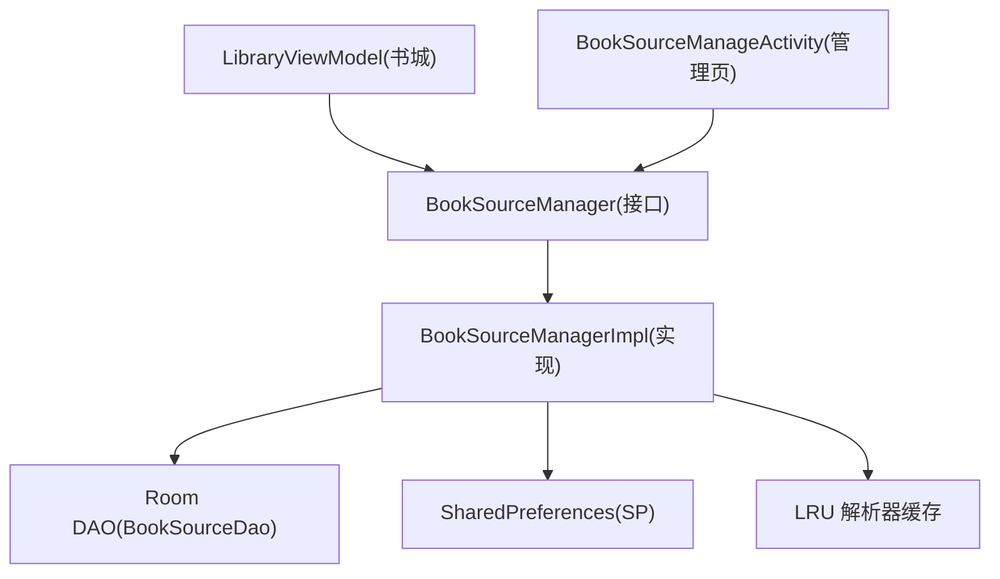
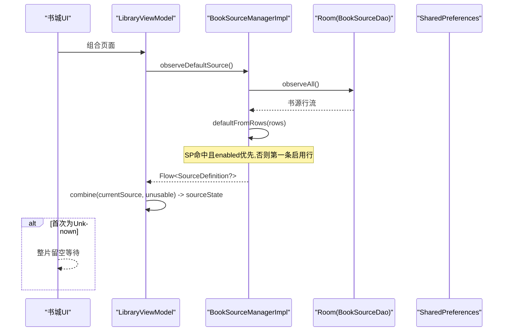
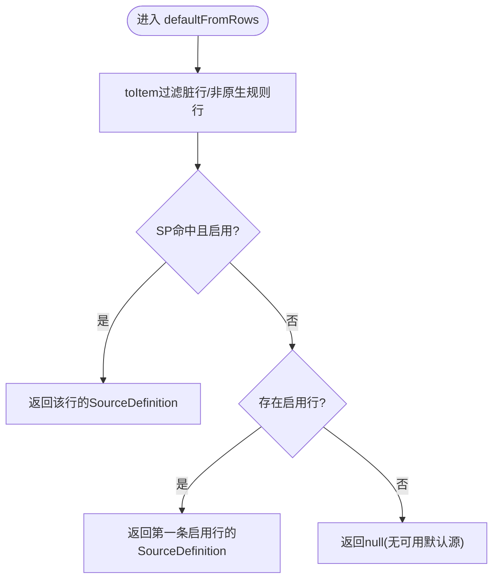
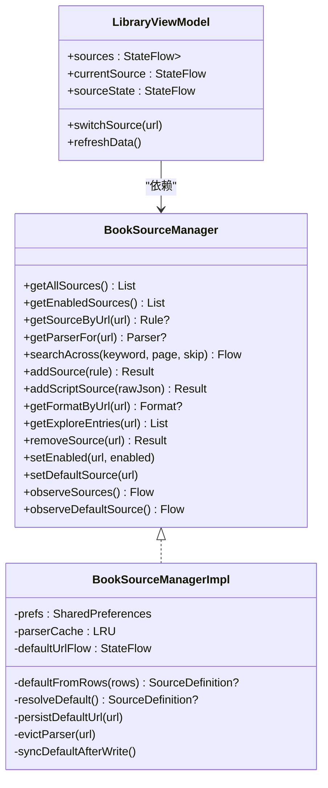

# 默认源选择

<cite>
**本文引用的文件**
- [BookSourceManager.kt](file://lib_book_common/src/main/java/com/ebook/common/analyze/source/BookSourceManager.kt)
- [BookSourceManagerImpl.kt](file://lib_book_common/src/main/java/com/ebook/common/analyze/source/BookSourceManagerImpl.kt)
- [LibraryViewModel.kt](file://module_find/src/main/java/com/ebook/find/mvvm/viewmodel/LibraryViewModel.kt)
- [BookSourceManageActivity.kt](file://module_me/src/main/java/com/ebook/me/view/BookSourceManageActivity.kt)
- [BookSourceManagerImplTest.kt](file://lib_book_common/src/test/java/com/ebook/common/analyze/source/BookSourceManagerImplTest.kt)
</cite>

## 目录
1. [简介](#简介)
2. [项目结构](#项目结构)
3. [核心组件](#核心组件)
4. [架构总览](#架构总览)
5. [详细组件分析](#详细组件分析)
6. [依赖关系分析](#依赖关系分析)
7. [性能考量](#性能考量)
8. [故障排查指南](#故障排查指南)
9. [结论](#结论)

## 简介
本文聚焦“默认源选择”机制，系统性说明默认源的现算逻辑、SP（SharedPreferences）优先匹配、启用源排序规则；订阅与响应式更新（Flow）、null 值处理；设置默认源的行为（自动启用禁用源、同步到 SP 与 Flow）；以及书城界面中的表现（引导态、回退策略、用户体验优化）。文档以代码为依据，配合流程图与时序图帮助理解。

## 项目结构
默认源相关能力集中在共享层与管理/业务层：
- 共享层：BookSourceManager 接口与 BookSourceManagerImpl 实现，负责默认源现算、SP 持久化、Flow 订阅与解析器缓存失效。
- 书城模块：LibraryViewModel 订阅默认源并驱动书库数据加载，定义首帧 Unknown、无源 NoSource、当前源不可用 BrokenSource 三档状态。
- 管理模块：BookSourceManageActivity 提供“设为默认”的入口，调用 Manager 的 setDefaultSource。
- 测试用例：覆盖零源起步、提升第一条启用源、禁用回落、脚本行参与默认源等关键行为。

图表来源
- [BookSourceManager.kt:10-265](file://lib_book_common/src/main/java/com/ebook/common/analyze/source/BookSourceManager.kt#L10-L265)
- [BookSourceManagerImpl.kt:195-238](file://lib_book_common/src/main/java/com/ebook/common/analyze/source/BookSourceManagerImpl.kt#L195-L238)
- [LibraryViewModel.kt:102-167](file://module_find/src/main/java/com/ebook/find/mvvm/viewmodel/LibraryViewModel.kt#L102-L167)
- [BookSourceManageActivity.kt:185-186](file://module_me/src/main/java/com/ebook/me/view/BookSourceManageActivity.kt#L185-L186)

章节来源
- [BookSourceManager.kt:10-265](file://lib_book_common/src/main/java/com/ebook/common/analyze/source/BookSourceManager.kt#L10-L265)
- [BookSourceManagerImpl.kt:195-238](file://lib_book_common/src/main/java/com/ebook/common/analyze/source/BookSourceManagerImpl.kt#L195-L238)
- [LibraryViewModel.kt:102-167](file://module_find/src/main/java/com/ebook/find/mvvm/viewmodel/LibraryViewModel.kt#L102-L167)
- [BookSourceManageActivity.kt:185-186](file://module_me/src/main/java/com/ebook/me/view/BookSourceManageActivity.kt#L185-L186)

## 核心组件
- BookSourceManager 接口：声明默认源订阅 observeDefaultSource()、设置默认源 setDefaultSource(url)、启用/禁用 setEnabled、聚合搜索 searchAcross 等。
- BookSourceManagerImpl 实现：维护 defaultUrlFlow、LRU 解析器缓存；默认源现算函数 defaultFromRows；写后收敛 syncDefaultAfterWrite；按格式路由 toDefinition/toItem；解析器缓存 evictParser。
- LibraryViewModel：组合 currentSource 与 sourceUnusable 得到 sourceState，首帧为 Unknown，有源则发起书库加载。
- BookSourceManageActivity：用户操作入口，调用 setDefaultSource 将目标源设为默认。

章节来源
- [BookSourceManager.kt:51-265](file://lib_book_common/src/main/java/com/ebook/common/analyze/source/BookSourceManager.kt#L51-L265)
- [BookSourceManagerImpl.kt:195-851](file://lib_book_common/src/main/java/com/ebook/common/analyze/source/BookSourceManagerImpl.kt#L195-L851)
- [LibraryViewModel.kt:102-294](file://module_find/src/main/java/com/ebook/find/mvvm/viewmodel/LibraryViewModel.kt#L102-L294)
- [BookSourceManageActivity.kt:103-201](file://module_me/src/main/java/com/ebook/me/view/BookSourceManageActivity.kt#L103-L201)

## 架构总览
默认源由 Room 表作为唯一事实源，每次现算；SP 仅记忆“用户上次主动选的 URL”。订阅面 combine 了 defaultUrlFlow 与 Room 全量清单，保证切换默认源也能触发刷新。书城侧通过 StateFlow 暴露 currentSource，结合是否可用标记得出页面应展示的 state。

图表来源
- [BookSourceManagerImpl.kt:849-851](file://lib_book_common/src/main/java/com/ebook/common/analyze/source/BookSourceManagerImpl.kt#L849-L851)
- [LibraryViewModel.kt:139-167](file://module_find/src/main/java/com/ebook/find/mvvm/viewmodel/LibraryViewModel.kt#L139-L167)

章节来源
- [BookSourceManagerImpl.kt:849-851](file://lib_book_common/src/main/java/com/ebook/common/analyze/source/BookSourceManagerImpl.kt#L849-L851)
- [LibraryViewModel.kt:139-167](file://module_find/src/main/java/com/ebook/find/mvvm/viewmodel/LibraryViewModel.kt#L139-L167)

## 详细组件分析

### 默认源现算：defaultFromRows
- 候选来源：全量 Row → toItem 过滤（原生行解码失败跳过，脚本行恒非 null）。
- 挑选规则：
  - 优先选择 SP 记录的 URL 且 enabled=true 的行；
  - 否则取第一条 enabled=true 的行；
  - 若无任何启用行，返回 null。
- 载体：返回 SourceDefinition（原生或脚本），两种格式平等参与。

图表来源
- [BookSourceManagerImpl.kt:207-214](file://lib_book_common/src/main/java/com/ebook/common/analyze/source/BookSourceManagerImpl.kt#L207-L214)

章节来源
- [BookSourceManagerImpl.kt:207-214](file://lib_book_common/src/main/java/com/ebook/common/analyze/source/BookSourceManagerImpl.kt#L207-L214)

### 订阅机制：observeDefaultSource
- 使用 combine(defaultUrlFlow, dao.observeAll()) 合并“本次会话重推信号”和“Room 全量变化”，统一走 defaultFromRows 计算。
- 当没有任何启用行时发 null；书城据此展示“请先启用或导入书源”的引导态。
- defaultUrlFlow 用于“切换默认源但不改库”的场景（对已启用目标只写 SP），确保订阅能感知切换。

章节来源
- [BookSourceManagerImpl.kt:176-179](file://lib_book_common/src/main/java/com/ebook/common/analyze/source/BookSourceManagerImpl.kt#L176-L179)
- [BookSourceManagerImpl.kt:849-851](file://lib_book_common/src/main/java/com/ebook/common/analyze/source/BookSourceManagerImpl.kt#L849-L851)
- [BookSourceManager.kt:257-265](file://lib_book_common/src/main/java/com/ebook/common/analyze/source/BookSourceManager.kt#L257-L265)

### 设置默认源：setDefaultSource
- 若库里不存在该行或规则解不出来，忽略并记日志。
- 若目标源当前为禁用，自动启用它，保证“默认源永不为禁用态”不变式。
- 写入 SP 并推送 defaultUrlFlow，随后失效该 URL 的解析器缓存。
- 不改动 Rule 本身，默认源仍是现算结果，SP 只是优先级提示。

章节来源
- [BookSourceManagerImpl.kt:756-778](file://lib_book_common/src/main/java/com/ebook/common/analyze/source/BookSourceManagerImpl.kt#L756-L778)
- [BookSourceManager.kt:229-239](file://lib_book_common/src/main/java/com/ebook/common/analyze/source/BookSourceManager.kt#L229-L239)

### 启用/禁用时的默认源收敛：setEnabled
- 禁用分支：如果被禁用的正是 SP 指向的默认源，则触发一次收敛，把 SP 从已禁用 URL 搬走。
- 启用分支：若写之前没有可用默认源（用户曾全部禁用），则触发一次收敛，把新启用的源立为默认源。
- 两条分支都只是固化现算结果到 SP + 补一次 defaultUrlFlow 推送，不承担“补齐默认源”的职责（现算已由订阅面完成）。

章节来源
- [BookSourceManagerImpl.kt:723-739](file://lib_book_common/src/main/java/com/ebook/common/analyze/source/BookSourceManagerImpl.kt#L723-L739)
- [BookSourceManager.kt:213-227](file://lib_book_common/src/main/java/com/ebook/common/analyze/source/BookSourceManager.kt#L213-L227)

### 导入/删除后的默认源收敛：syncDefaultAfterWrite
- addSource/addScriptSource/removeSource 在成功写库后，若满足条件（写前无可用默认源，或覆盖的是 SP 记着的默认源），调用 syncDefaultAfterWrite。
- 内部再次 resolveDefault 并将 URL 持久化到 SP，同时推送 defaultUrlFlow，使订阅面看到最新默认源。

章节来源
- [BookSourceManagerImpl.kt:525-557](file://lib_book_common/src/main/java/com/ebook/common/analyze/source/BookSourceManagerImpl.kt#L525-L557)
- [BookSourceManagerImpl.kt:590-637](file://lib_book_common/src/main/java/com/ebook/common/analyze/source/BookSourceManagerImpl.kt#L590-L637)
- [BookSourceManagerImpl.kt:671-690](file://lib_book_common/src/main/java/com/ebook/common/analyze/source/BookSourceManagerImpl.kt#L671-L690)
- [BookSourceManagerImpl.kt:790-793](file://lib_book_common/src/main/java/com/ebook/common/analyze/source/BookSourceManagerImpl.kt#L790-L793)

### 书城界面的状态机与体验
- 首帧 Unknown：默认源尚未从 Room 回来，页面整片留空，避免闪出“无源”误导。
- 有源 Ready：正常渲染书库。
- 无源 NoSource：currentSource 为 null，显示“请先启用或导入书源”的引导态。
- 当前源不可用 BrokenSource：加载抛出 BookSourceNotFoundException，置位 _sourceUnusable，提示“换一个源或重导这条源”。

章节来源
- [LibraryViewModel.kt:27-76](file://module_find/src/main/java/com/ebook/find/mvvm/viewmodel/LibraryViewModel.kt#L27-L76)
- [LibraryViewModel.kt:139-167](file://module_find/src/main/java/com/ebook/find/mvvm/viewmodel/LibraryViewModel.kt#L139-L167)
- [LibraryViewModel.kt:239-289](file://module_find/src/main/java/com/ebook/find/mvvm/viewmodel/LibraryViewModel.kt#L239-L289)

### 示例场景（基于代码路径，不含具体代码）
- 设置默认源：在书源管理页长按某源 → 弹出操作层 → 点击“设为默认” → 调用 BookSourceManager.setDefaultSource(url)。
- 监听默认源变化：书城侧通过 LibraryViewModel.currentSource 订阅，换源后自动重新拉取书库数据。
- 无可用书源：当所有源被禁用或删除后，observeDefaultSource 发出 null，书城进入 NoSource 引导态。

章节来源
- [BookSourceManageActivity.kt:185-186](file://module_me/src/main/java/com/ebook/me/view/BookSourceManageActivity.kt#L185-L186)
- [LibraryViewModel.kt:139-167](file://module_find/src/main/java/com/ebook/find/mvvm/viewmodel/LibraryViewModel.kt#L139-L167)
- [BookSourceManagerImplTest.kt:190-220](file://lib_book_common/src/test/java/com/ebook/common/analyze/source/BookSourceManagerImplTest.kt#L190-L220)

## 依赖关系分析
- BookSourceManagerImpl 依赖 BookSourceDao（Room）读取/观察全量书源行；依赖 SharedPreferences 持久化当前默认源 URL；依赖 LRU 解析器缓存（按 URL 缓存 BookParser）。
- LibraryViewModel 依赖 BookSourceManager.observeSources 获取可切换候选，依赖 observeDefaultSource 获取当前默认源。
- BookSourceManageActivity 通过 ViewModel 间接调用 BookSourceManager.setDefaultSource/setEnabled/removeSource。

图表来源
- [BookSourceManager.kt:51-265](file://lib_book_common/src/main/java/com/ebook/common/analyze/source/BookSourceManager.kt#L51-L265)
- [BookSourceManagerImpl.kt:84-119](file://lib_book_common/src/main/java/com/ebook/common/analyze/source/BookSourceManagerImpl.kt#L84-L119)
- [LibraryViewModel.kt:102-167](file://module_find/src/main/java/com/ebook/find/mvvm/viewmodel/LibraryViewModel.kt#L102-L167)

章节来源
- [BookSourceManager.kt:51-265](file://lib_book_common/src/main/java/com/ebook/common/analyze/source/BookSourceManager.kt#L51-L265)
- [BookSourceManagerImpl.kt:84-119](file://lib_book_common/src/main/java/com/ebook/common/analyze/source/BookSourceManagerImpl.kt#L84-L119)
- [LibraryViewModel.kt:102-167](file://module_find/src/main/java/com/ebook/find/mvvm/viewmodel/LibraryViewModel.kt#L102-L167)

## 性能考量
- 默认源现算在 IO 调度器执行（flowOn(IO)），避免阻塞主线程。
- 解析器缓存容量为 3，减少重复构建解析器的开销；同一 URL 多次访问复用同一实例。
- 聚合搜索并发上限为 5，控制对第三方站点的风控压力。
- 冷启动无内置书源，首帧 Unknown 避免多余渲染与请求；只有真正拿到默认源后才发起书库加载。

章节来源
- [BookSourceManagerImpl.kt:147-167](file://lib_book_common/src/main/java/com/ebook/common/analyze/source/BookSourceManagerImpl.kt#L147-L167)
- [BookSourceManagerImpl.kt:187-193](file://lib_book_common/src/main/java/com/ebook/common/analyze/source/BookSourceManagerImpl.kt#L187-L193)
- [LibraryViewModel.kt:139-167](file://module_find/src/main/java/com/ebook/find/mvvm/viewmodel/LibraryViewModel.kt#L139-L167)

## 故障排查指南
- 书城始终空白且无引导：检查 observeDefaultSource 是否发出 null（可能所有源被禁用），确认导入或启用至少一条源。
- 切换默认源无效：确认目标源是否存在于库中且规则可解析；setDefaultSource 会忽略不在库中的 URL。
- 禁用默认源后未回落：检查 setEnabled 是否正确触发收敛；SP 应更新为下一条启用源。
- 导入脚本源后书城仍无法使用：确认脚本行已启用；默认源可以是脚本行，但需确保解析器装配（沙箱）可用；加载异常会在 VM 中置位 BrokenSource。
- 覆盖规则后解析未生效：确认 evictParser 已调用；覆盖规则/启用状态/删除都会失效对应 URL 的缓存。

章节来源
- [BookSourceManagerImplTest.kt:294-383](file://lib_book_common/src/test/java/com/ebook/common/analyze/source/BookSourceManagerImplTest.kt#L294-L383)
- [LibraryViewModel.kt:239-289](file://module_find/src/main/java/com/ebook/find/mvvm/viewmodel/LibraryViewModel.kt#L239-L289)
- [BookSourceManagerImpl.kt:817-819](file://lib_book_common/src/main/java/com/ebook/common/analyze/source/BookSourceManagerImpl.kt#L817-L819)

## 结论
默认源选择以 Room 为唯一事实源，SP 仅记录“用户上次选择的 URL”，默认源每次现算以保证一致性与可恢复性。流程上通过 Flow 订阅实现响应式更新，书城根据 currentSource 与可用性标记给出清晰的状态与引导。set 系列方法在变更书源清单后自动收敛默认源，确保用户始终获得可用的默认源。脚本源与原生源在默认源层面一视同仁，增强了多源共存下的灵活性与可扩展性。