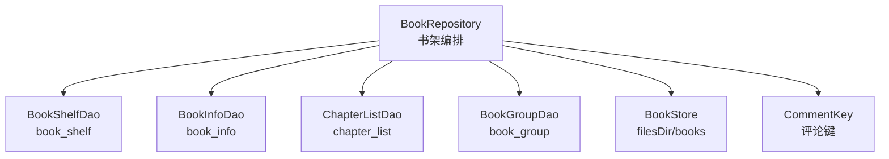
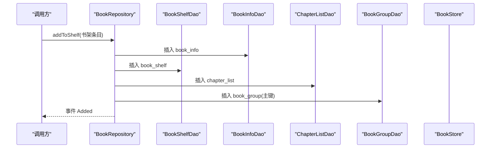
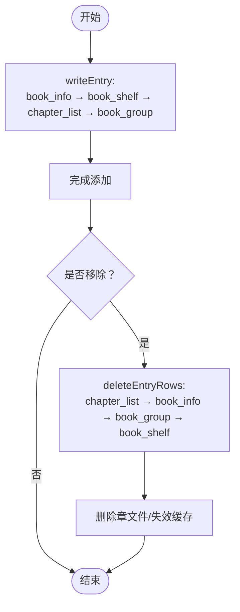
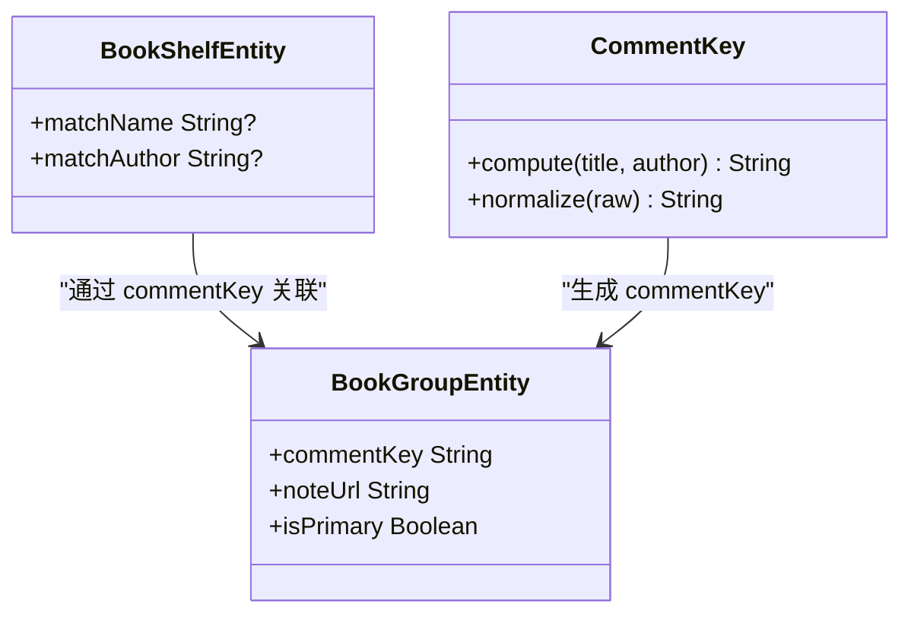
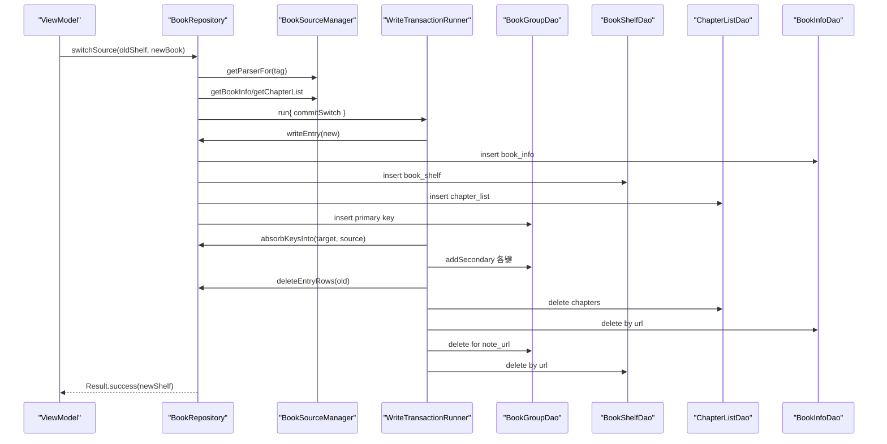
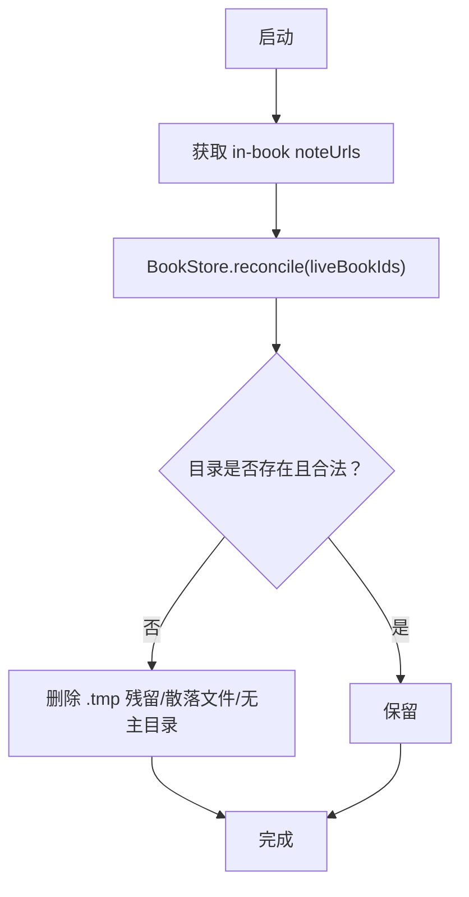
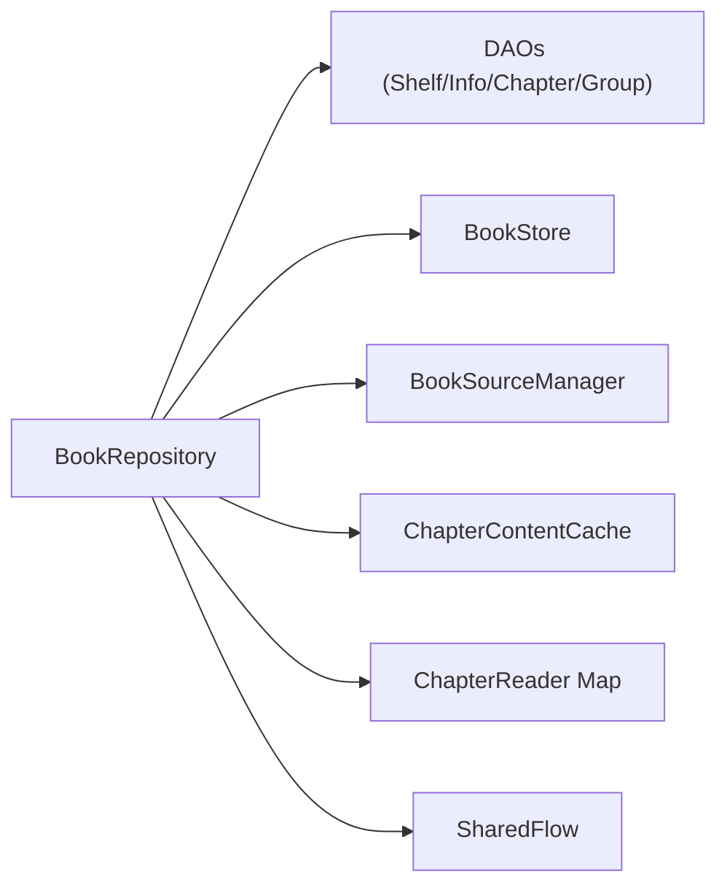

# 书架管理

<cite>
**本文引用的文件**
- [BookRepository.kt](file://lib_book_common/src/main/java/com/ebook/common/repository/BookRepository.kt)
- [BookShelfDao.kt](file://lib_ebook_db/src/main/java/com/ebook/db/dao/BookShelfDao.kt)
- [ChapterListDao.kt](file://lib_ebook_db/src/main/java/com/ebook/db/dao/ChapterListDao.kt)
- [BookInfoDao.kt](file://lib_ebook_db/src/main/java/com/ebook/db/dao/BookInfoDao.kt)
- [BookGroupDao.kt](file://lib_ebook_db/src/main/java/com/ebook/db/dao/BookGroupDao.kt)
- [BookShelfEntity.kt](file://lib_ebook_db/src/main/java/com/ebook/db/entity/BookShelfEntity.kt)
- [BookInfoEntity.kt](file://lib_ebook_db/src/main/java/com/ebook/db/entity/BookInfoEntity.kt)
- [ChapterListEntity.kt](file://lib_ebook_db/src/main/java/com/ebook/db/entity/ChapterListEntity.kt)
- [BookGroupEntity.kt](file://lib_ebook_db/src/main/java/com/ebook/db/entity/BookGroupEntity.kt)
- [BookStore.kt](file://lib_book_common/src/main/java/com/ebook/common/store/BookStore.kt)
- [CommentKey.kt](file://lib_book_common/src/main/java/com/ebook/common/domain/CommentKey.kt)
</cite>

## 目录
1. [简介](#简介)
2. [项目结构](#项目结构)
3. [核心组件](#核心组件)
4. [架构总览](#架构总览)
5. [详细组件分析](#详细组件分析)
6. [依赖关系分析](#依赖关系分析)
7. [性能考量](#性能考量)
8. [故障排查指南](#故障排查指南)
9. [结论](#结论)
10. [附录：关键流程与示例指引](#附录：关键流程与示例指引)

## 简介
本文件聚焦“书架管理”能力，围绕 BookRepository 的 CRUD、阅读进度保存、级联写入与清理、响应式数据流、章节时间戳策略、M2 评论聚合键（matchName/matchAuthor）管理、以及内容仓库对账 reconcileContentStore 的工作机制进行系统化说明。目标是帮助读者在不深入源码的前提下理解“一个书架条目在数据库与存储中如何被安全地创建、更新、删除与回收”，并能在实际工程中正确调用这些能力。

## 项目结构
书架相关的数据访问与业务编排位于 lib_book_common 的 BookRepository；持久化模型与 DAO 位于 lib_ebook_db；本地内容与缓存由 lib_book_common 的 BookStore 提供；评论聚合键由 CommentKey 派生。整体职责边界清晰：
- 领域层（BookRepository）：编排跨表写入、事件发布、换源、目录同步、章节读取与刷新、M2 键管理、内容对账。
- 持久层（DAO + Entity）：Room 映射 book_shelf / book_info / chapter_list / book_group 等表，提供查询与事务保障。
- 存储层（BookStore）：管理 filesDir/books 下的章文件、封面、导入暂存、容量统计与对账。
- 领域工具（CommentKey）：按书名/作者归一化计算不透明评论桶键。

图表来源
- [BookRepository.kt:52-74](file://lib_book_common/src/main/java/com/ebook/common/repository/BookRepository.kt#L52-L74)
- [BookShelfDao.kt:19-109](file://lib_ebook_db/src/main/java/com/ebook/db/dao/BookShelfDao.kt#L19-L109)
- [BookStore.kt:151-160](file://lib_book_common/src/main/java/com/ebook/common/store/BookStore.kt#L151-L160)
- [CommentKey.kt:41-49](file://lib_book_common/src/main/java/com/ebook/common/domain/CommentKey.kt#L41-L49)

章节来源
- [BookRepository.kt:52-74](file://lib_book_common/src/main/java/com/ebook/common/repository/BookRepository.kt#L52-L74)
- [BookShelfDao.kt:19-109](file://lib_ebook_db/src/main/java/com/ebook/db/dao/BookShelfDao.kt#L19-L109)

## 核心组件
- BookRepository：书架 CRUD、阅读进度保存、级联写入/清理、换源、目录同步、章节统一读取、M2 键管理、内容对账、事件发布。
- DAO 层：BookShelfDao/BookInfoDao/ChapterListDao/BookGroupDao，提供 Room 查询与插入/更新/删除能力。
- 实体层：BookShelfEntity/BookInfoEntity/ChapterListEntity/BookGroupEntity，定义表结构与字段语义。
- BookStore：章文件读写、封面写入、导入暂存、容量统计与对账。
- CommentKey：基于书名/作者归一化的评论桶键算法。

章节来源
- [BookRepository.kt:75-146](file://lib_book_common/src/main/java/com/ebook/common/repository/BookRepository.kt#L75-L146)
- [BookShelfDao.kt:19-109](file://lib_ebook_db/src/main/java/com/ebook/db/dao/BookShelfDao.kt#L19-L109)
- [BookStore.kt:37-160](file://lib_book_common/src/main/java/com/ebook/common/store/BookStore.kt#L37-L160)
- [CommentKey.kt:20-84](file://lib_book_common/src/main/java/com/ebook/common/domain/CommentKey.kt#L20-L84)

## 架构总览
书架管理的核心在于“一个书架条目 = 多张表行 + 若干章文件”。写路径遵循固定顺序：book_info → book_shelf → chapter_list → book_group；读路径通过 observeBookShelf 或 getAllBooksWithDetails 获取关联信息，并按 durChapterIndex 显式排序修正 rowid 带来的乱序。删除路径逆向：chapter_list → book_info → book_group → book_shelf。

图表来源
- [BookRepository.kt:142-191](file://lib_book_common/src/main/java/com/ebook/common/repository/BookRepository.kt#L142-L191)
- [BookShelfDao.kt:78-83](file://lib_ebook_db/src/main/java/com/ebook/db/dao/BookShelfDao.kt#L78-L83)
- [BookInfoDao.kt](file://lib_ebook_db/src/main/java/com/ebook/db/dao/BookInfoDao.kt)
- [ChapterListDao.kt](file://lib_ebook_db/src/main/java/com/ebook/db/dao/ChapterListDao.kt)
- [BookGroupDao.kt](file://lib_ebook_db/src/main/java/com/ebook/db/dao/BookGroupDao.kt)

章节来源
- [BookRepository.kt:142-191](file://lib_book_common/src/main/java/com/ebook/common/repository/BookRepository.kt#L142-L191)

## 详细组件分析

### 书架 CRUD 与级联写入/清理
- 添加：addToShelf 委托 writeEntry，按顺序写入四张表并广播 Added 事件。writeEntry 会设置 book_info.finalRefreshData（若为 0）、chapter_list.noteUrl/tag、book_group.commentKey（基于 matchName/matchAuthor 或 book_info.name/author）。
- 移除：removeFromShelf 调用 deleteEntryRows 逆向删除四表行，随后删除章文件与失效内存缓存，并广播 Removed 事件。
- 删除顺序保证：先删子（章节），再删父（书籍信息），最后删关系与主记录，避免孤儿行。

图表来源
- [BookRepository.kt:142-221](file://lib_book_common/src/main/java/com/ebook/common/repository/BookRepository.kt#L142-L221)

章节来源
- [BookRepository.kt:142-221](file://lib_book_common/src/main/java/com/ebook/common/repository/BookRepository.kt#L142-L221)

### 阅读进度保存与事件
- saveProgress 更新 finalDate 并插入/覆盖 book_shelf，随后发出 ProgressUpdated 事件，供 UI 刷新与统计。
- observeBookShelf 返回 Flow，基于 Room 失效自动推送，仅做关联填充与过滤孤立 info，不做写副作用。

章节来源
- [BookRepository.kt:86-140](file://lib_book_common/src/main/java/com/ebook/common/repository/BookRepository.kt#L86-L140)
- [BookShelfDao.kt:31-59](file://lib_ebook_db/src/main/java/com/ebook/db/dao/BookShelfDao.kt#L31-L59)

### 响应式数据流与关联查询排序修正
- observeBookShelf：Flow 版本只做关联填充，过滤掉 info 为 null 的孤立条目，适合长期订阅。
- getAllBooksWithDetails：一次性查询全量关联数据，并对 chapterList 按 durChapterIndex 显式排序，修复因 REPLACE 导致 rowid 跳变造成的乱序；同时清理孤立记录（book_shelf 存在但 book_info 缺失的行）。

章节来源
- [BookRepository.kt:93-128](file://lib_book_common/src/main/java/com/ebook/common/repository/BookRepository.kt#L93-L128)
- [BookShelfDao.kt:21-33](file://lib_ebook_db/src/main/java/com/ebook/db/dao/BookShelfDao.kt#L21-L33)

### 章节时间戳处理策略
- writeEntry 在首次解析目录后，若 book_info.finalRefreshData 为 0，则设置为当前时间，避免用户进入详情页重复抓取多页目录。
- syncChaptersFromSource 仅在限频窗口外触发网络请求，并在得出结论（UpToDate/Diverged/Appended）时通过 setFinalRefreshData 定向更新时间戳，避免整行 REPLACE 导致的字段丢失。

章节来源
- [BookRepository.kt:158-191](file://lib_book_common/src/main/java/com/ebook/common/repository/BookRepository.kt#L158-L191)
- [BookRepository.kt:512-612](file://lib_book_common/src/main/java/com/ebook/common/repository/BookRepository.kt#L512-L612)

### M2 评论聚合键与匹配名/作者
- 评论键计算：CommentKey.compute 基于书名与作者归一化后的 SHA-256，带版本前缀 ck1。
- 写入：writeEntry 使用 matchName/matchAuthor（若为空回落到 book_info.name/author）计算 commentKey，并插入 isPrimary=true 的主键行。
- 读：getCommentKeysForBook 返回该 noteUrl 对应的全部键（并集查询），getPrimaryKeyForBook 返回 isPrimary 行作为写评论的唯一目标。
- 修键：updateMatchMeta 将旧主键降级，新键成为主键，保留旧行以便历史评论可见；persistMatchMeta 落库 matchName/matchAuthor 用于界面回显。
- 拆分：splitBook 只允许删除 secondary 行，禁止删除主键行。

图表来源
- [CommentKey.kt:41-49](file://lib_book_common/src/main/java/com/ebook/common/domain/CommentKey.kt#L41-L49)
- [BookGroupEntity.kt:21-37](file://lib_ebook_db/src/main/java/com/ebook/db/entity/BookGroupEntity.kt#L21-L37)
- [BookShelfEntity.kt:57-64](file://lib_ebook_db/src/main/java/com/ebook/db/entity/BookShelfEntity.kt#L57-L64)

章节来源
- [BookRepository.kt:643-839](file://lib_book_common/src/main/java/com/ebook/common/repository/BookRepository.kt#L643-L839)
- [CommentKey.kt:20-84](file://lib_book_common/src/main/java/com/ebook/common/domain/CommentKey.kt#L20-L84)
- [BookGroupEntity.kt:21-37](file://lib_ebook_db/src/main/java/com/ebook/db/entity/BookGroupEntity.kt#L21-L37)

### 换源（switchSource）与事务保证
- 前置校验：本地书不可换源；目标不能是当前条目本身；目标不能已在书架上（防覆盖冲突）。
- 网络阶段：取 parser → getBookInfo → getChapterList → 继承旧条目的 durChapter/durChapterPage/finalDate/matchName/matchAuthor。
- 事务阶段：commitSwitch 执行 writeEntry(new) → absorbKeysInto(target, source) → deleteEntryRows(old) → 清理旧下载任务。
- 失败窗口：解析失败一行不动；事务内失败整体回滚；提交后事件未发（进程被杀）由下次查询自愈。

图表来源
- [BookRepository.kt:292-432](file://lib_book_common/src/main/java/com/ebook/common/repository/BookRepository.kt#L292-L432)

章节来源
- [BookRepository.kt:292-432](file://lib_book_common/src/main/java/com/ebook/common/repository/BookRepository.kt#L292-L432)

### 章节正文统一读取与刷新
- loadChapter：按 BookFormat 路由到 ChapterReader → 规范化段落 → 经 ChapterContentCache 缓存 → 返回渲染所需内容。本地书与网络书走同一管线。
- refreshChapter：仅网络书有效，删除章文件并失效内存缓存，下次读取重新抓取。

章节来源
- [BookRepository.kt:434-490](file://lib_book_common/src/main/java/com/ebook/common/repository/BookRepository.kt#L434-L490)

### 目录重抓与追加（syncChaptersFromSource）
- 限频判断：基于 book_info.finalRefreshData 与 REFRESH_TIME。
- 远端拉取：按 tag 取 parser 拉目录，空结果且本地有章视为失败（不写时间戳）。
- 判定：UpToDate/Diverged/Appended。Appendable 时以 max(durChapterIndex)+1 起号追加尾部新章，并更新时间戳，发出 ChaptersUpdated 事件。

章节来源
- [BookRepository.kt:492-612](file://lib_book_common/src/main/java/com/ebook/common/repository/BookRepository.kt#L492-L612)

### 智能合并与拆分
- mergeTailChapters：仅本地目标书可补章；判据为旧书归一化章名序列是新书前缀；成功则追加章节并删除新条目；失败（分叉/非本地/缺失）返回明确结果。
- splitBook：仅能删除 secondary 键行，禁止删除主键行。

章节来源
- [BookRepository.kt:706-793](file://lib_book_common/src/main/java/com/ebook/common/repository/BookRepository.kt#L706-L793)

### 内容仓库对账（reconcileContentStore）
- 启动时收集 liveBookIds（book_shelf 中的 note_url），交给 BookStore.reconcile 删除无主目录、.tmp 残留与散落文件。
- 安全边界：只在应用启动时调用一次，导入进行中不得调用；目录名经 dirName 派生（URL→md5），避免误删网络书缓存。

图表来源
- [BookRepository.kt:841-855](file://lib_book_common/src/main/java/com/ebook/common/repository/BookRepository.kt#L841-L855)
- [BookStore.kt:141-160](file://lib_book_common/src/main/java/com/ebook/common/store/BookStore.kt#L141-L160)

章节来源
- [BookRepository.kt:841-855](file://lib_book_common/src/main/java/com/ebook/common/repository/BookRepository.kt#L841-L855)
- [BookStore.kt:141-160](file://lib_book_common/src/main/java/com/ebook/common/store/BookStore.kt#L141-L160)

## 依赖关系分析
- BookRepository 强耦合于 DAO 层与 BookStore；DAO 层通过 Room 提供事务一致性；BookStore 负责物理文件与对账。
- 评论键依赖 CommentKey 的稳定归一化规则；换源依赖 BookSourceManager 取 parser；章节读取依赖 ChapterReader 与 ContentCache。
- 事件通过 SharedFlow 发布，UI 侧订阅 observeBookShelf 或具体事件。

图表来源
- [BookRepository.kt:52-74](file://lib_book_common/src/main/java/com/ebook/common/repository/BookRepository.kt#L52-L74)

章节来源
- [BookRepository.kt:52-74](file://lib_book_common/src/main/java/com/ebook/common/repository/BookRepository.kt#L52-L74)

## 性能考量
- 关联查询排序：getAllBooksWithDetails 对 chapterList 按 durChapterIndex 排序，修正 rowid 跳变导致的乱序，避免 UI 错序与缓存命中率下降。
- 限频控制：目录重抓受 finalRefreshData 限制，减少无效网络请求。
- 定向更新：setFinalRefreshData 避免整行 REPLACE 造成字段丢失。
- 批量操作：transactions.run 包裹多表写，确保原子性；换源路径尽量缩小事务范围，避免长时间持有锁。
- 存储统计：BookStore.storageUsage 一次遍历得出字节与册数，避免多次 IO。

章节来源
- [BookRepository.kt:102-128](file://lib_book_common/src/main/java/com/ebook/common/repository/BookRepository.kt#L102-L128)
- [BookRepository.kt:512-612](file://lib_book_common/src/main/java/com/ebook/common/repository/BookRepository.kt#L512-L612)
- [BookStore.kt:116-139](file://lib_book_common/src/main/java/com/ebook/common/store/BookStore.kt#L116-L139)

## 故障排查指南
- 换源失败类型：
  - 本地书不可换源：抛出参数错误，提示本地书无源。
  - 目标相同：防止无意义操作与数据丢失。
  - 目标已在书架：抛出 BookAlreadyOnShelfException，需引导用户去读已有条目。
  - 解析失败/网络失败：Result.failure，携带根因异常。
- 孤立记录：getAllBooksWithDetails 会清理“有 shelf 无 info”的记录；若出现“书消失”，检查是否在换源/导入中途崩溃导致半写状态。
- 目录重抓：Diverged 表示本地与远端结构不一致，应建议用户换源或重新导入；Throttled 表示限频窗口内；Failed 携带 cause 便于上报。
- 内容对账：启动后若发现占用异常增大，检查是否有导入中断的 .tmp 残留或无主目录；reconcile 会在下次启动清理。

章节来源
- [BookRepository.kt:292-339](file://lib_book_common/src/main/java/com/ebook/common/repository/BookRepository.kt#L292-L339)
- [BookRepository.kt:512-612](file://lib_book_common/src/main/java/com/ebook/common/repository/BookRepository.kt#L512-L612)
- [BookRepository.kt:841-855](file://lib_book_common/src/main/java/com/ebook/common/repository/BookRepository.kt#L841-L855)

## 结论
BookRepository 将书架的 CRUD、阅读进度、目录同步、章节读取、评论键管理与内容对账整合为一处编排点，遵循明确的写入/删除顺序与事务边界，确保数据一致性与用户体验。通过响应式 Flow 与事件通道，UI 可稳定消费变化；通过 CommentKey 与 book_group，实现跨源评论聚合与修键；通过 BookStore 的对账，回收无主文件，维持磁盘整洁。

## 附录：关键流程与示例指引

### 安全地将一本书加入书架（步骤指引）
- 准备数据：构造 BookShelfEntity，附带 bookInfo（可选）与 chapterList（可选）。
- 调用 addToShelf：内部会级联写入四张表，并广播 Added 事件。
- 注意事项：
  - 确保 chapterList 已设置 noteUrl/tag，writeEntry 会自动回填。
  - 若 book_info.finalRefreshData 为 0，会被设为当前时间，避免重复抓取目录。
  - 若未提供 matchName/matchAuthor，将回落到 book_info.name/author 计算评论键。

参考路径
- [BookRepository.kt:142-191](file://lib_book_common/src/main/java/com/ebook/common/repository/BookRepository.kt#L142-L191)

### 处理本地书与网络书的差异
- 本地书：tag=loc_book，正文存储在本地文件，read/load 走本地 ChapterReader。
- 网络书：正文通过网络抓取，refreshChapter 可强制重抓单章。
- 格式解析：resolveFormat 根据 tag 与 bookFormat 决定 reader。

参考路径
- [BookRepository.kt:434-490](file://lib_book_common/src/main/java/com/ebook/common/repository/BookRepository.kt#L434-L490)
- [BookRepository.kt:630-641](file://lib_book_common/src/main/java/com/ebook/common/repository/BookRepository.kt#L630-L641)

### 批量操作的事务保证
- 使用 transactions.run 包裹多表写（如 syncChaptersFromSource 的追加、mergeTailChapters 的补章）。
- 换源 commitSwitch 在一个事务内完成“写新 → 吸收旧键 → 删旧 → 清队列”，避免中间态暴露。

参考路径
- [BookRepository.kt:512-612](file://lib_book_common/src/main/java/com/ebook/common/repository/BookRepository.kt#L512-L612)
- [BookRepository.kt:411-416](file://lib_book_common/src/main/java/com/ebook/common/repository/BookRepository.kt#L411-L416)
- [BookRepository.kt:734-780](file://lib_book_common/src/main/java/com/ebook/common/repository/BookRepository.kt#L734-L780)