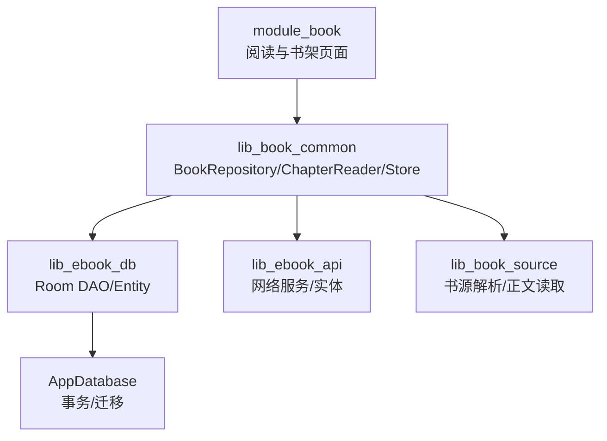
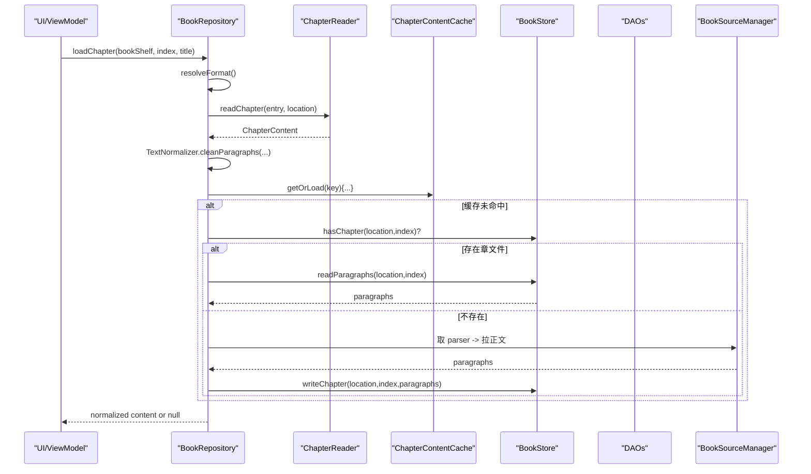
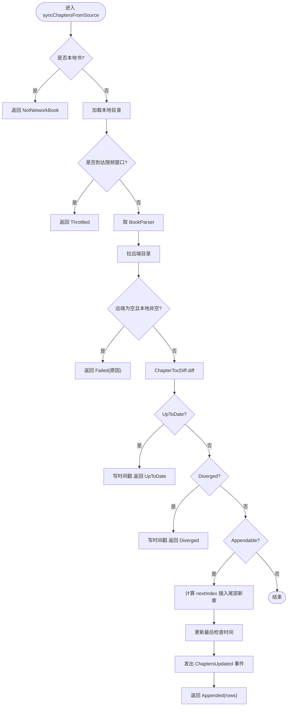
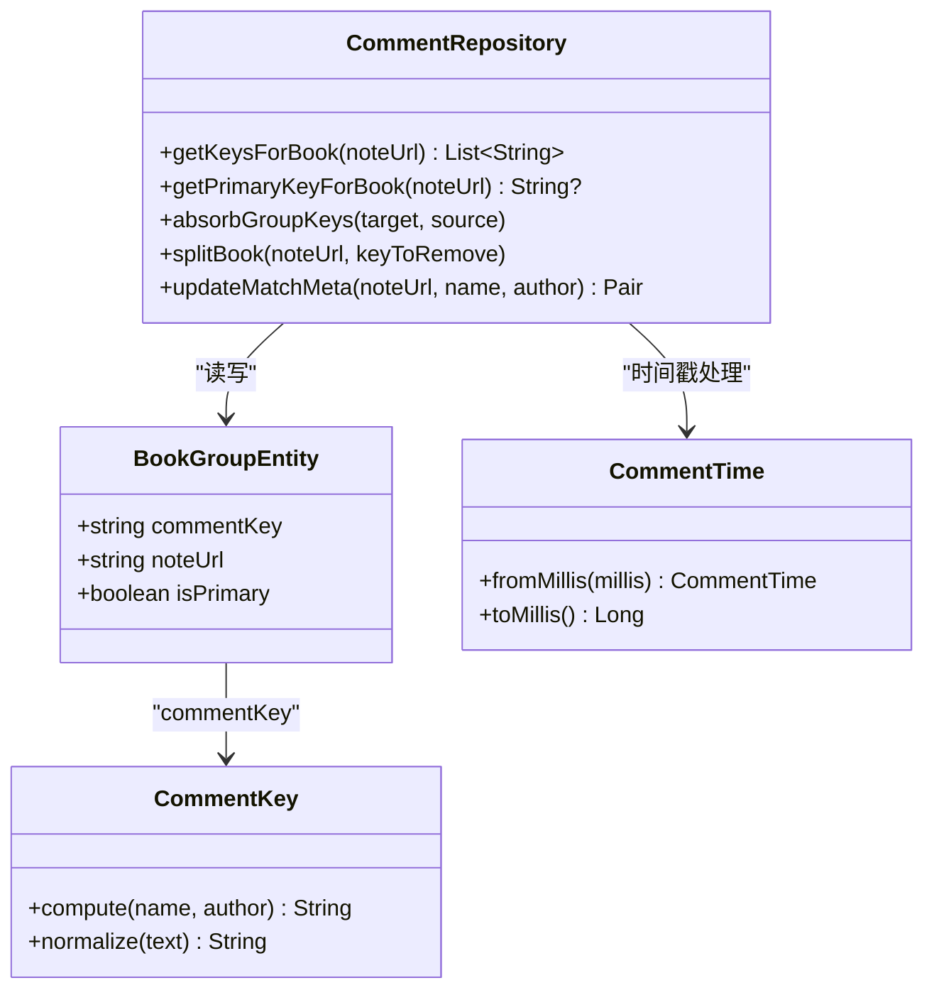
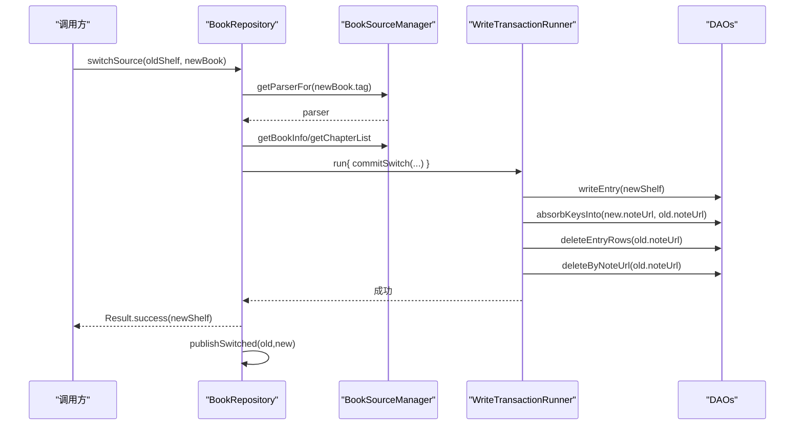
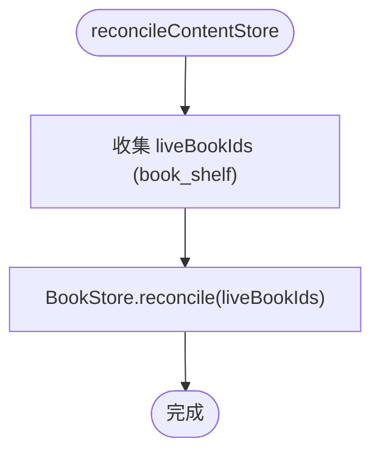
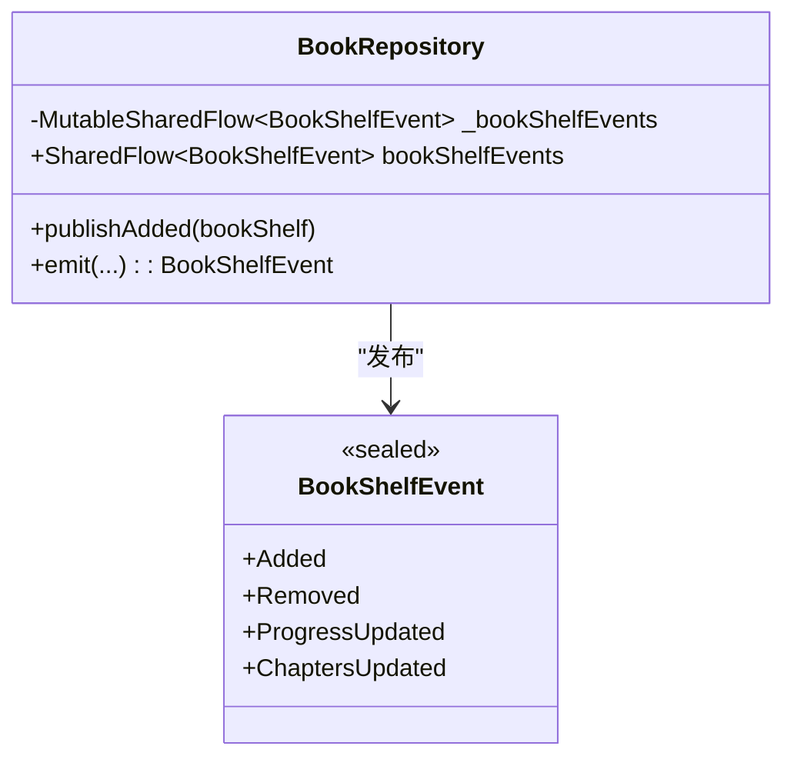
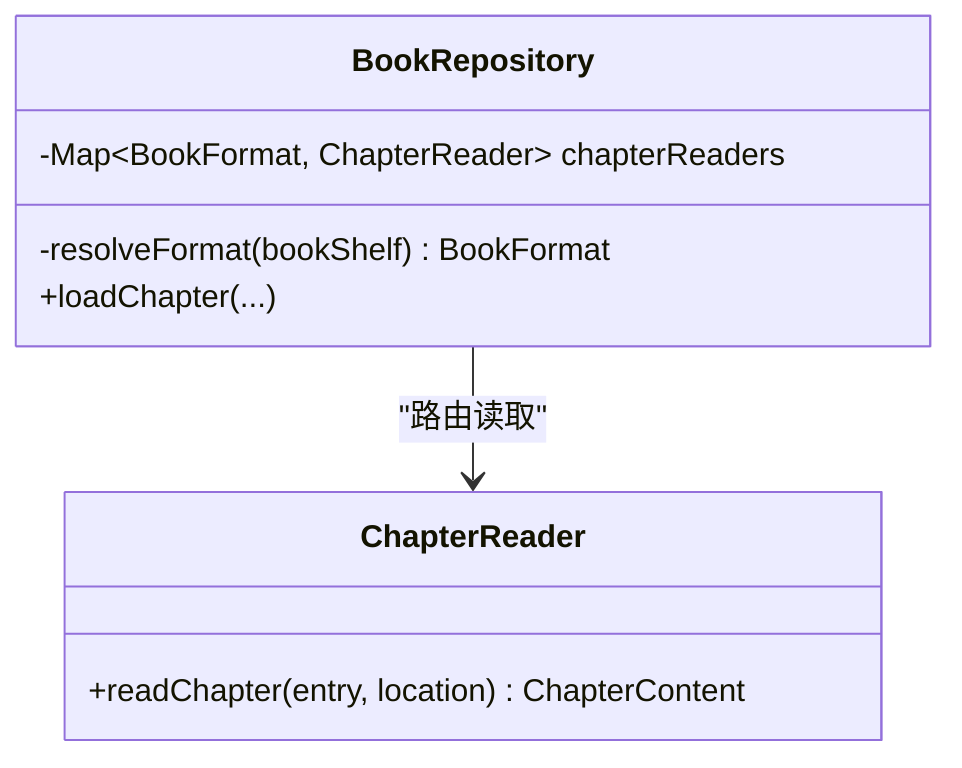
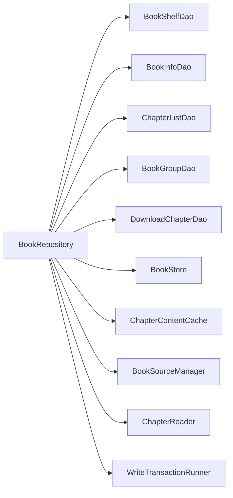

# 书籍仓库

<cite>
**本文引用的文件**
- [BookRepository.kt](file://lib_book_common/src/main/java/com/ebook/common/repository/BookRepository.kt)
- [ChapterReader.kt](file://lib_book_common/src/main/java/com/ebook/common/analyze/local/ChapterReader.kt)
- [WriteTransactionRunner.kt](file://lib_book_common/src/main/java/com/ebook/common/store/WriteTransactionRunner.kt)
- [CommentKey.kt](file://lib_book_common/src/main/java/com/ebook/common/domain/CommentKey.kt)
- [CommentTime.kt](file://lib_book_common/src/main/java/com/ebook/common/domain/CommentTime.kt)
- [CommentRepository.kt](file://lib_book_common/src/main/java/com/ebook/common/repository/CommentRepository.kt)
- [CommentPage.kt](file://lib_ebook_api/src/main/java/com/ebook/api/entity/CommentPage.kt)
- [Comment.kt](file://lib_ebook_api/src/main/java/com/ebook/api/entity/Comment.kt)
- [CommentService.kt](file://lib_ebook_api/src/main/java/com/ebook/api/service/comment/CommentService.kt)
- [AppDatabase.kt](file://lib_ebook_db/src/main/java/com/ebook/db/AppDatabase.kt)
- [BookInfoDao.kt](file://lib_ebook_db/src/main/java/com/ebook/db/dao/BookInfoDao.kt)
- [BookShelfDao.kt](file://lib_ebook_db/src/main/java/com/ebook/db/dao/BookShelfDao.kt)
- [ChapterListDao.kt](file://lib_ebook_db/src/main/java/com/ebook/db/dao/ChapterListDao.kt)
- [BookGroupDao.kt](file://lib_ebook_db/src/main/java/com/ebook/db/dao/BookGroupDao.kt)
- [DBCode.kt](file://lib_ebook_db/src/main/java/com/ebook/db/event/DBCode.kt)
- [Constant.kt](file://lib_book_common/src/main/java/com/ebook/common/event/Constant.kt)
- [KeyCode.kt](file://lib_book_common/src/main/java/com/ebook/common/event/KeyCode.kt)
- [RouteArgs.kt](file://lib_book_common/src/main/java/com/ebook/common/event/RouteArgs.kt)
- [BookStoreTest.kt](file://lib_book_common/src/test/java/com/ebook/common/store/BookStoreTest.kt)
- [ChapterContentCacheTest.kt](file://lib_book_common/src/test/java/com/ebook/common/store/ChapterContentCacheTest.kt)
- [BookRepositorySwitchSourceTest.kt](file://lib_book_common/src/test/java/com/ebook/common/repository/BookRepositorySwitchSourceTest.kt)
- [BookRepositoryChapterSyncTest.kt](file://lib_book_common/src/test/java/com/ebook/common/repository/BookRepositoryChapterSyncTest.kt)
- [CommentRepositoryTest.kt](file://lib_book_common/src/test/java/com/ebook/common/repository/CommentRepositoryTest.kt)
</cite>

## 目录
1. [简介](#简介)
2. [项目结构](#项目结构)
3. [核心组件](#核心组件)
4. [架构总览](#架构总览)
5. [详细组件分析](#详细组件分析)
6. [依赖关系分析](#依赖关系分析)
7. [性能考虑](#性能考虑)
8. [故障排查指南](#故障排查指南)
9. [结论](#结论)
10. [附录](#附录)

## 简介
本章节面向“书籍仓库”这一主题，聚焦以下目标：
- 解释 BookRepository 对书架数据操作的封装、阅读进度保存机制、章节正文统一读取管线。
- 说明评论聚合键（M2）的管理方式、阅读中换源的事务处理、内容仓库对账流程。
- 描述 SharedFlow 事件总线的设计与 WriteTransactionRunner 的原子性保证、ChapterReader 的多格式支持。
- 给出扩展新章节格式、自定义内容存储、处理数据同步冲突的实践要点。
- 阐述本地书与网络书的统一抽象、缓存策略设计与性能优化方案。
- 解释 M2 评论聚合的数据模型、主键合并拆分逻辑与数据一致性保证。

## 项目结构
本项目采用多模块 Gradle 工程，业务层通过 lib_book_common 暴露领域能力；数据库由 lib_ebook_db 提供 Room 实体与 DAO；网络与实体在 lib_ebook_api；脚本解析与沙箱在 lib_book_source。BookRepository 位于 lib_book_common，是书架、阅读、评论键、换源、对账的统一入口。

**图表来源**
- [BookRepository.kt:52-74](file://lib_book_common/src/main/java/com/ebook/common/repository/BookRepository.kt#L52-L74)
- [AppDatabase.kt](file://lib_ebook_db/src/main/java/com/ebook/db/AppDatabase.kt)

**章节来源**
- [BookRepository.kt:38-74](file://lib_book_common/src/main/java/com/ebook/common/repository/BookRepository.kt#L38-L74)

## 核心组件
- BookRepository：书架 CRUD、阅读进度、章节统一读取、评论键管理、换源事务、对账、事件发布。
- ChapterReader：章节正文读取的最小接口，按 BookFormat 路由到具体实现。
- WriteTransactionRunner：统一的写事务包装，确保批量写操作原子提交。
- CommentKey/CommentTime：评论聚合键与时间戳的规范化类型。
- CommentRepository：评论读写、聚合、迁移等上层逻辑。
- AppDatabase + DAO：Room 数据库访问层，负责表结构与查询。
- Event 常量：SharedFlow 事件通道与键值定义。

**章节来源**
- [BookRepository.kt:52-74](file://lib_book_common/src/main/java/com/ebook/common/repository/BookRepository.kt#L52-L74)
- [ChapterReader.kt:3-20](file://lib_book_common/src/main/java/com/ebook/common/analyze/local/ChapterReader.kt#L3-L20)
- [WriteTransactionRunner.kt:3-13](file://lib_book_common/src/main/java/com/ebook/common/store/WriteTransactionRunner.kt#L3-L13)
- [CommentKey.kt](file://lib_book_common/src/main/java/com/ebook/common/domain/CommentKey.kt)
- [CommentTime.kt](file://lib_book_common/src/main/java/com/ebook/common/domain/CommentTime.kt)
- [CommentRepository.kt](file://lib_book_common/src/main/java/com/ebook/common/repository/CommentRepository.kt)
- [AppDatabase.kt](file://lib_ebook_db/src/main/java/com/ebook/db/AppDatabase.kt)

## 架构总览
BookRepository 作为“仓库层”，对上暴露业务语义方法（如加载章节、换源、对账），对下协调 DAO、存储、缓存、解析器与事件总线。其关键职责包括：
- 书架数据：添加、删除、观察、按 URL 获取、清理孤立记录。
- 阅读进度：保存并触发事件。
- 章节正文：统一读取管线，跨本地/网络走同一入口，规范化清洗在缓存前进行。
- 评论聚合键：读并集、写主键、合并/拆分/修键。
- 换源：跨书源原地替换条目，保持进度映射，事务内完成写入。
- 对账：回收无主目录与散落文件。
- 事件总线：基于 SharedFlow 的书架事件流。

**图表来源**
- [BookRepository.kt:455-475](file://lib_book_common/src/main/java/com/ebook/common/repository/BookRepository.kt#L455-L475)
- [ChapterReader.kt:10-20](file://lib_book_common/src/main/java/com/ebook/common/analyze/local/ChapterReader.kt#L10-L20)

## 详细组件分析

### BookRepository：书架与阅读核心
- 书架数据操作
  - 获取全部书籍、带详情列表、按 URL 获取、移除（含关联清理）。
  - 观察书架 Flow 返回完整信息，过滤孤立条目。
- 阅读进度保存
  - 更新 finalDate 并插入，随后发出 ProgressUpdated 事件。
- 章节正文统一读取
  - 按 BookFormat 路由到 ChapterReader；规范化清洗发生在进入缓存之前；内存缓存 Key 为 chapterRef(noteUrl, index)。
  - 刷新单章仅针对网络书，删除章文件并失效内存缓存。
- 目录重抓与追加
  - 限频判窗 → 取源 → 拉远端目录 → 计算 diff → 仅接受纯追加并写入尾部新章；分叉或失败不写时间戳。
- 评论聚合键管理（M2）
  - 读取某 book 的全部 commentKey（并集）、写入主键、合并/拆分/修键。
- 阅读中换源
  - 网络解析在事务外，库内写在一个事务内；先插新后删旧；吸收旧键再删旧；清旧下载队列；失败回滚。
- 内容仓库对账
  - 收集 liveBookIds，交由 BookStore.reconcile 回收无主目录与残留文件。
- 事件发布
  - 基于 SharedFlow 的 _bookShelfEvents，对外暴露不可变 SharedFlow<BookShelfEvent>。

**图表来源**
- [BookRepository.kt:512-600](file://lib_book_common/src/main/java/com/ebook/common/repository/BookRepository.kt#L512-L600)

**章节来源**
- [BookRepository.kt:81-146](file://lib_book_common/src/main/java/com/ebook/common/repository/BookRepository.kt#L81-L146)
- [BookRepository.kt:148-221](file://lib_book_common/src/main/java/com/ebook/common/repository/BookRepository.kt#L148-L221)
- [BookRepository.kt:292-432](file://lib_book_common/src/main/java/com/ebook/common/repository/BookRepository.kt#L292-L432)
- [BookRepository.kt:455-490](file://lib_book_common/src/main/java/com/ebook/common/repository/BookRepository.kt#L455-L490)
- [BookRepository.kt:512-612](file://lib_book_common/src/main/java/com/ebook/common/repository/BookRepository.kt#L512-L612)
- [BookRepository.kt:649-665](file://lib_book_common/src/main/java/com/ebook/common/repository/BookRepository.kt#L649-L665)
- [BookRepository.kt:688-839](file://lib_book_common/src/main/java/com/ebook/common/repository/BookRepository.kt#L688-L839)
- [BookRepository.kt:852-866](file://lib_book_common/src/main/java/com/ebook/common/repository/BookRepository.kt#L852-L866)

### 评论聚合键（M2）管理
- 数据模型
  - 每个书架条目对应一行 book_group 记录，包含 commentKey、noteUrl、isPrimary。
  - 读评论时取 noteUrl 对应的所有 commentKey（并集）；写评论只用 isPrimary=true 的主键。
- 合并/拆分/修键
  - 合并：将 sourceNoteUrl 的全部关联键并入 targetNoteUrl（覆盖场景用，避免被删导致并集丢失）。
  - 拆分：删除指定 secondary 行，禁止删除主键。
  - 修键：根据新的匹配名/作者重算键，旧主键降级为 secondary，新键成为主键；元数据与主键同事务提交。
- 一致性
  - 主键唯一性由 DAO 约束；吸收 secondary 使用 IGNORE 避免重复插入；修键时 clearPrimary 再 insert 新主键，失败则无主键（需由调用方保障事务边界）。

**图表来源**
- [BookRepository.kt:649-839](file://lib_book_common/src/main/java/com/ebook/common/repository/BookRepository.kt#L649-L839)
- [CommentKey.kt](file://lib_book_common/src/main/java/com/ebook/common/domain/CommentKey.kt)
- [CommentTime.kt](file://lib_book_common/src/main/java/com/ebook/common/domain/CommentTime.kt)
- [CommentRepository.kt](file://lib_book_common/src/main/java/com/ebook/common/repository/CommentRepository.kt)

**章节来源**
- [BookRepository.kt:649-839](file://lib_book_common/src/main/java/com/ebook/common/repository/BookRepository.kt#L649-L839)
- [CommentKey.kt](file://lib_book_common/src/main/java/com/ebook/common/domain/CommentKey.kt)
- [CommentTime.kt](file://lib_book_common/src/main/java/com/ebook/common/domain/CommentTime.kt)
- [CommentRepository.kt](file://lib_book_common/src/main/java/com/ebook/common/repository/CommentRepository.kt)

### 阅读中换源的事务处理
- 设计要点
  - 网络解析在事务外，避免把慢网络阻塞 Room 写线程。
  - 事务内顺序：先插入新条目、吸收旧键、删除旧条目、清除旧下载任务。
  - 失败回滚：Room 事务保证原子性；异常上抛给调用方。
  - 进度映射：durChapter 截断至新目录长度-1，页级进度复位，保留 finalDate 与 matchName/matchAuthor。
- 事件发布
  - 成功后先发 Removed(old)，再发 Added(new)，保证内存快照消费者不会同时持有两条同一作品条目。

**图表来源**
- [BookRepository.kt:292-432](file://lib_book_common/src/main/java/com/ebook/common/repository/BookRepository.kt#L292-L432)

**章节来源**
- [BookRepository.kt:292-432](file://lib_book_common/src/main/java/com/ebook/common/repository/BookRepository.kt#L292-L432)

### 内容仓库对账流程
- 目的：回收 DB 中已无书的目录、导入中断残留 .tmp 与散落文件。
- 时机：进程启动一次，导入进行中不得调用。
- 流程：收集当前书架的 noteUrl 集合，交给 BookStore.reconcile 执行清理。

**图表来源**
- [BookRepository.kt:852-855](file://lib_book_common/src/main/java/com/ebook/common/repository/BookRepository.kt#L852-L855)

**章节来源**
- [BookRepository.kt:852-855](file://lib_book_common/src/main/java/com/ebook/common/repository/BookRepository.kt#L852-L855)

### SharedFlow 事件总线设计
- 设计动机：替代 RxBus，使用 Kotlin Coroutines + Flow。
- 实现：_bookShelfEvents 为 MutableSharedFlow，对外暴露 asSharedFlow 只读视图；事件类型包括 Added/Removed/ProgressUpdated/ChaptersUpdated。
- 可靠性：事件不是事实源，事实来自 Room 失效流；进程被杀可能丢事件，但 UI 通过 observeBookShelf 自愈。

**图表来源**
- [BookRepository.kt:75-77](file://lib_book_common/src/main/java/com/ebook/common/repository/BookRepository.kt#L75-L77)
- [BookRepository.kt:873-892](file://lib_book_common/src/main/java/com/ebook/common/repository/BookRepository.kt#L873-L892)

**章节来源**
- [BookRepository.kt:75-77](file://lib_book_common/src/main/java/com/ebook/common/repository/BookRepository.kt#L75-L77)
- [BookRepository.kt:873-892](file://lib_book_common/src/main/java/com/ebook/common/repository/BookRepository.kt#L873-L892)

### WriteTransactionRunner 的原子性保证
- 作用：统一包裹写事务，避免每处手写 withTransaction；便于测试（纯 JVM 可模拟）。
- 行为：run(block) 内部应开启 Room 写事务并在结束时提交或回滚；生产实现由 Hilt 注入，测试可用 ImmediateTransactionRunner 直接执行 block。
- 约束：事务块内不应切换线程，否则会跳出 Room 事务线程。

**章节来源**
- [WriteTransactionRunner.kt:3-13](file://lib_book_common/src/main/java/com/ebook/common/store/WriteTransactionRunner.kt#L3-L13)
- [BookRepository.kt:411-416](file://lib_book_common/src/main/java/com/ebook/common/repository/BookRepository.kt#L411-L416)

### ChapterReader 的多格式支持
- 接口：readChapter(entry, location) 返回段落数据（原文，不清洗）。
- 路由：BookRepository.resolveFormat 决定使用 TXT 还是 NETWORK reader；本地书按 bookFormat 列（缺省 TXT），网络书固定 NETWORK。
- 扩展点：新增章节格式只需实现 ChapterReader 并注册到 Map<BookFormat, ChapterReader>，然后在 resolveFormat 中增加分支。

**图表来源**
- [ChapterReader.kt:3-20](file://lib_book_common/src/main/java/com/ebook/common/analyze/local/ChapterReader.kt#L3-L20)
- [BookRepository.kt:631-641](file://lib_book_common/src/main/java/com/ebook/common/repository/BookRepository.kt#L631-L641)
- [BookRepository.kt:455-475](file://lib_book_common/src/main/java/com/ebook/common/repository/BookRepository.kt#L455-L475)

**章节来源**
- [ChapterReader.kt:3-20](file://lib_book_common/src/main/java/com/ebook/common/analyze/local/ChapterReader.kt#L3-L20)
- [BookRepository.kt:631-641](file://lib_book_common/src/main/java/com/ebook/common/repository/BookRepository.kt#L631-L641)
- [BookRepository.kt:455-475](file://lib_book_common/src/main/java/com/ebook/common/repository/BookRepository.kt#L455-L475)

### 本地书与网络书的统一抽象
- 抽象点：BookLocation（noteUrl + format + tag）作为内容定位；ChapterReader 统一接口；loadChapter 统一入口。
- 差异：本地书按 bookFormat 选择 reader，网络书走 JsoupSourceReader（通过 BookSourceManager 取 parser）。
- 缓存：contentCache 以 chapterRef(noteUrl, index) 为键，存清洗后的段落。

**章节来源**
- [BookRepository.kt:455-490](file://lib_book_common/src/main/java/com/ebook/common/repository/BookRepository.kt#L455-L490)
- [BookRepository.kt:631-641](file://lib_book_common/src/main/java/com/ebook/common/repository/BookRepository.kt#L631-L641)

### 缓存策略设计
- 内存缓存：ChapterContentCache.getOrLoad(key){...}，key 为 chapterRef(noteUrl, index)。
- 磁盘存储：BookStore.writeChapter/readChapter/hasChapter/deleteChapter 管理 filesDir/books/<noteUrl>/cNNNNN.txt。
- 刷新：refreshChapter 仅用于网络书，删除章文件并失效内存缓存。
- 对账：reconcile 回收无主目录与残留文件。

**章节来源**
- [BookRepository.kt:455-490](file://lib_book_common/src/main/java/com/ebook/common/repository/BookRepository.kt#L455-L490)
- [BookRepository.kt:852-855](file://lib_book_common/src/main/java/com/ebook/common/repository/BookRepository.kt#L852-L855)

### 性能优化方案
- 目录重抓限频：基于 finalRefreshData 与 REFRESH_TIME 判定，减少无效请求。
- 纯追加策略：只接受尾部新章，避免序号漂移导致的静默错误。
- 缓存前置规范化：清洗仅在 loadChapter 时进行一次，结果存入缓存，渲染直接消费。
- 事务边界最小化：网络解析在事务外，降低 Room 写线程占用。
- 批量写入：mergeTailChapters 与 syncChaptersFromSource 使用事务内批量插入，减少 IO 次数。

**章节来源**
- [BookRepository.kt:512-600](file://lib_book_common/src/main/java/com/ebook/common/repository/BookRepository.kt#L512-L600)
- [BookRepository.kt:734-780](file://lib_book_common/src/main/java/com/ebook/common/repository/BookRepository.kt#L734-L780)

## 依赖关系分析
- BookRepository 依赖 DAO（BookShelfDao、BookInfoDao、ChapterListDao、BookGroupDao、DownloadChapterDao）。
- 依赖 BookStore、ChapterContentCache 管理内容与缓存。
- 依赖 BookSourceManager 取 parser 进行网络解析。
- 依赖 ChapterReader 路由读取不同格式的章节。
- 依赖 WriteTransactionRunner 封装事务。
- 事件系统使用 SharedFlow，与 UI 解耦。

**图表来源**
- [BookRepository.kt:52-74](file://lib_book_common/src/main/java/com/ebook/common/repository/BookRepository.kt#L52-L74)

**章节来源**
- [BookRepository.kt:52-74](file://lib_book_common/src/main/java/com/ebook/common/repository/BookRepository.kt#L52-L74)

## 性能考虑
- 目录检查限频避免频繁网络请求。
- 章节正文缓存减少重复解析与 IO。
- 事务内批量写入降低数据库压力。
- 规范化清洗前置缓存，避免重复计算。
- 对账只在启动时运行，避免运行时开销。

[本节为通用性能建议，无需具体文件引用]

## 故障排查指南
- 换源失败
  - 解析阶段失败：保留原条目，用户可重试或另选候选。
  - 事务内失败：回滚，仍为旧条目。
  - 事件丢失：UI 通过 observeBookShelf 自愈。
- 目录重抓
  - 限频窗口内不发起请求。
  - 远端目录为空视为失败，不写时间戳。
  - 分叉时不发事件，需用户处置（换源或重新导入）。
- 章节刷新
  - 仅网络书有效；本地书无需刷新。
  - 刷新会删除章文件并失效内存缓存。
- 对账
  - 启动时回收无主目录；导入进行中不得调用。

**章节来源**
- [BookRepository.kt:292-432](file://lib_book_common/src/main/java/com/ebook/common/repository/BookRepository.kt#L292-L432)
- [BookRepository.kt:512-600](file://lib_book_common/src/main/java/com/ebook/common/repository/BookRepository.kt#L512-L600)
- [BookRepository.kt:852-855](file://lib_book_common/src/main/java/com/ebook/common/repository/BookRepository.kt#L852-L855)

## 结论
BookRepository 作为书籍仓库的核心，统一了书架管理、阅读进度、章节读取、评论键、换源与对账等关键路径。通过 SharedFlow 事件总线、WriteTransactionRunner 事务封装、ChapterReader 多格式支持以及缓存策略，实现了高内聚、低耦合、可扩展的架构。M2 评论聚合提供了跨源评论合并的能力，配合主键合并拆分与修键逻辑，保证了数据一致性与用户体验。

[本节为总结，无需具体文件引用]

## 附录

### 扩展新章节格式
- 步骤
  - 实现 ChapterReader 接口，提供 readChapter 方法。
  - 在 BookRepository 的 chapterReaders Map 中注册新格式。
  - 在 resolveFormat 中增加分支，将新格式映射到对应 reader。
- 参考路径
  - [ChapterReader.kt:10-20](file://lib_book_common/src/main/java/com/ebook/common/analyze/local/ChapterReader.kt#L10-L20)
  - [BookRepository.kt:631-641](file://lib_book_common/src/main/java/com/ebook/common/repository/BookRepository.kt#L631-L641)
  - [BookRepository.kt:455-475](file://lib_book_common/src/main/java/com/ebook/common/repository/BookRepository.kt#L455-L475)

**章节来源**
- [ChapterReader.kt:10-20](file://lib_book_common/src/main/java/com/ebook/common/analyze/local/ChapterReader.kt#L10-L20)
- [BookRepository.kt:631-641](file://lib_book_common/src/main/java/com/ebook/common/repository/BookRepository.kt#L631-L641)
- [BookRepository.kt:455-475](file://lib_book_common/src/main/java/com/ebook/common/repository/BookRepository.kt#L455-L475)

### 实现自定义内容存储
- 步骤
  - 实现 BookStore 接口，提供 writeChapter/readChapter/hasChapter/deleteChapter/reconcile 等方法。
  - 在 BookRepository 中注入自定义实现，替换默认存储。
- 参考路径
  - [BookRepository.kt:852-855](file://lib_book_common/src/main/java/com/ebook/common/repository/BookRepository.kt#L852-L855)
  - [BookStoreTest.kt](file://lib_book_common/src/test/java/com/ebook/common/store/BookStoreTest.kt)

**章节来源**
- [BookRepository.kt:852-855](file://lib_book_common/src/main/java/com/ebook/common/repository/BookRepository.kt#L852-L855)
- [BookStoreTest.kt](file://lib_book_common/src/test/java/com/ebook/common/store/BookStoreTest.kt)

### 处理数据同步冲突
- 目录重抓冲突
  - 分叉时放弃整笔变更，提示用户换源或重新导入。
  - 限频窗口内不发起请求，避免频繁网络。
- 章节正文冲突
  - 仅接受纯追加，避免序号漂移。
  - 刷新章节仅针对网络书，删除章文件并失效缓存。
- 评论键冲突
  - 合并时吸收 secondary 键，拆分时禁止删除主键。
  - 修键时旧主键降级，新键成为主键，元数据与主键同事务提交。

**章节来源**
- [BookRepository.kt:512-600](file://lib_book_common/src/main/java/com/ebook/common/repository/BookRepository.kt#L512-L600)
- [BookRepository.kt:688-839](file://lib_book_common/src/main/java/com/ebook/common/repository/BookRepository.kt#L688-L839)