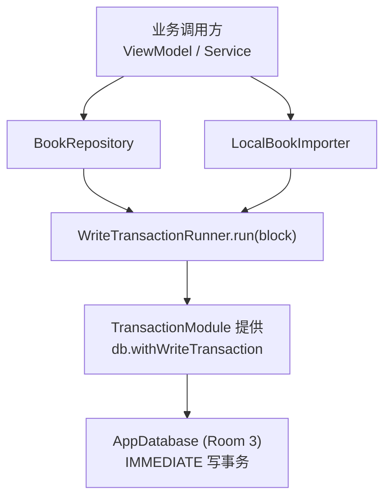
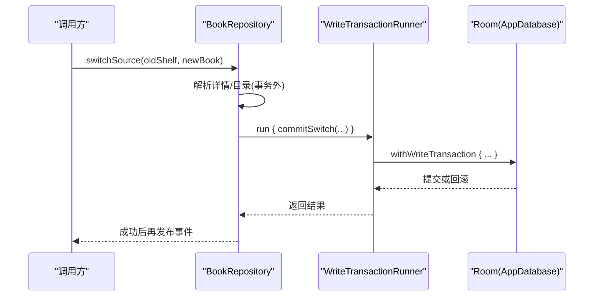
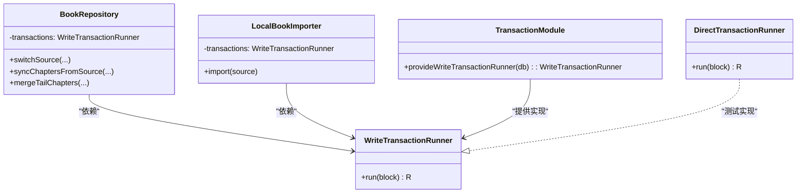

# 事务管理

<cite>
**本文引用的文件**
- [WriteTransactionRunner.kt](file://lib_book_common/src/main/java/com/ebook/common/store/WriteTransactionRunner.kt)
- [TransactionModule.kt](file://lib_book_common/src/main/java/com/ebook/common/di/TransactionModule.kt)
- [BookRepository.kt](file://lib_book_common/src/main/java/com/ebook/common/repository/BookRepository.kt)
- [LocalBookImporter.kt](file://lib_book_common/src/main/java/com/ebook/common/importer/LocalBookImporter.kt)
- [FakeDaos.kt](file://lib_book_common/src/test/java/com/ebook/common/repository/FakeDaos.kt)
</cite>

## 目录
1. [简介](#简介)
2. [项目结构](#项目结构)
3. [核心组件](#核心组件)
4. [架构总览](#架构总览)
5. [关键组件详解](#关键组件详解)
6. [依赖关系分析](#依赖关系分析)
7. [性能与并发](#性能与并发)
8. [故障排查](#故障排查)
9. [结论](#结论)
10. [附录：使用要点与示例路径](#附录使用要点与示例路径)

## 简介
本文围绕本项目的“写事务”抽象，解释原子性保证、Room 写事务的线程限制、事务边界设计原则；梳理需要事务保证的操作场景（writeEntry 级联写入、commitSwitch 换源、mergeTailChapters 补章事务）；说明失败回滚语义、部分提交风险防护、并发访问隔离；给出正确使用 transactions.run 块的方法、避免事务内耗时操作的建议、可回滚操作序列的设计；并解释 publishAdded 事件发射时机、事务外操作的限制、事件与数据库的最终一致性。最后补充 DirectTransactionRunner 的测试用途、生产实现差异及性能监控与调试技巧。

## 项目结构
事务相关的关键位置集中在共享库 lib_book_common：
- 事务接口定义：WriteTransactionRunner
- 生产装配：TransactionModule（Room 3 withWriteTransaction）
- 业务入口：BookRepository（换源、章节同步、评论键吸收等）
- 导入流水线：LocalBookImporter（本地书籍批量写索引）
- 测试替身：FakeDaos（含 DirectTransactionRunner）

图表来源
- [BookRepository.kt:52-74](file://lib_book_common/src/main/java/com/ebook/common/repository/BookRepository.kt#L52-L74)
- [LocalBookImporter.kt:44-55](file://lib_book_common/src/main/java/com/ebook/common/importer/LocalBookImporter.kt#L44-L55)
- [TransactionModule.kt:12-24](file://lib_book_common/src/main/java/com/ebook/common/di/TransactionModule.kt#L12-L24)

小节来源
- [WriteTransactionRunner.kt:3-13](file://lib_book_common/src/main/java/com/ebook/common/store/WriteTransactionRunner.kt#L3-L13)
- [TransactionModule.kt:12-24](file://lib_book_common/src/main/java/com/ebook/common/di/TransactionModule.kt#L12-L24)

## 核心组件
- WriteTransactionRunner：统一的写事务“接缝”，屏蔽具体事务实现，允许在纯 JVM 测试中绕过 Room 直接执行 block。
- TransactionModule：为生产环境注入基于 Room 3 withWriteTransaction 的实现，确保所有写操作进入 IMMEDIATE 事务。
- BookRepository：封装书架条目 CRUD、换源、章节同步、评论键吸收等业务，将多表写收敛到单一事务边界。
- LocalBookImporter：本地书籍导入流程，将拷贝/切分后的章节批量写入数据库，失败时回滚并清理磁盘残留。
- FakeDaos.DirectTransactionRunner：测试用“直通”事务实现，便于在无 Room 环境下验证逻辑顺序与异常回滚。

小节来源
- [WriteTransactionRunner.kt:3-13](file://lib_book_common/src/main/java/com/ebook/common/store/WriteTransactionRunner.kt#L3-L13)
- [TransactionModule.kt:12-24](file://lib_book_common/src/main/java/com/ebook/common/di/TransactionModule.kt#L12-L24)
- [BookRepository.kt:52-74](file://lib_book_common/src/main/java/com/ebook/common/repository/BookRepository.kt#L52-L74)
- [LocalBookImporter.kt:44-55](file://lib_book_common/src/main/java/com/ebook/common/importer/LocalBookImporter.kt#L44-L55)
- [FakeDaos.kt:250-256](file://lib_book_common/src/test/java/com/ebook/common/repository/FakeDaos.kt#L250-L256)

## 架构总览
事务边界以“一个业务动作 = 一个事务”为原则，所有涉及多表一致性的写操作都通过 WriteTransactionRunner.run 包裹。Room 写事务线程受限且短小精悍，网络解析、IO 重活一律放在事务之外。

图表来源
- [BookRepository.kt:292-339](file://lib_book_common/src/main/java/com/ebook/common/repository/BookRepository.kt#L292-L339)
- [TransactionModule.kt:17-23](file://lib_book_common/src/main/java/com/ebook/common/di/TransactionModule.kt#L17-L23)

小节来源
- [BookRepository.kt:228-339](file://lib_book_common/src/main/java/com/ebook/common/repository/BookRepository.kt#L228-L339)
- [TransactionModule.kt:12-24](file://lib_book_common/src/main/java/com/ebook/common/di/TransactionModule.kt#L12-L24)

## 关键组件详解

### WriteTransactionRunner 与事务抽象
- 作用：统一“把这些写当作一次事务提交”的接入点，避免各处各自调用 withWriteTransaction，降低事务边界散落的风险。
- 设计要点：
  - 仅暴露 run(block) 方法，简化调用方心智负担。
  - 通过 Hilt 注入，生产替换为 Room 实现，测试替换为直通实现。
  - 不承载业务逻辑，只负责事务生命周期。

小节来源
- [WriteTransactionRunner.kt:3-13](file://lib_book_common/src/main/java/com/ebook/common/store/WriteTransactionRunner.kt#L3-L13)
- [TransactionModule.kt:12-24](file://lib_book_common/src/main/java/com/ebook/common/di/TransactionModule.kt#L12-L24)

### Room 写事务线程限制与边界原则
- 线程限制：Room 的写事务运行在受限线程上，事务块内禁止切换上下文（withContext），否则等于跳出事务线程，形成伪事务。
- 边界原则：
  - 网络请求、解析、大 IO 必须在事务外完成。
  - 事务内只做最小必要的 DAO 写。
  - 事件广播、UI 更新、缓存失效等在事务成功后进行。
- 违反后果：长事务导致全库写排队、锁竞争、卡顿甚至超时。

小节来源
- [BookRepository.kt:228-235](file://lib_book_common/src/main/java/com/ebook/common/repository/BookRepository.kt#L228-L235)
- [BookRepository.kt:386-416](file://lib_book_common/src/main/java/com/ebook/common/repository/BookRepository.kt#L386-L416)

### writeEntry 的级联写入
- 目标：一次性写入 book_info → book_shelf → chapter_list → book_group 主键行，保证“一个书架条目”的多表一致性。
- 设计：
  - 抽取独立私有方法，供 addToShelf 与 switchSource 复用，避免重复“一个条目由哪些行组成”的逻辑。
  - 不在 writeEntry 内部发事件，避免未提交的写被误认为事实。
  - 时间戳策略：若 finalRefreshData 为空则写入当前时间，减少后续重复抓取。
- 复杂度：O(N) 章节列表插入；注意 chapterListDao.insertAll 的批写效率。

小节来源
- [BookRepository.kt:148-191](file://lib_book_common/src/main/java/com/ebook/common/repository/BookRepository.kt#L148-L191)

### commitSwitch 的换源事务
- 目标：在同一事务内完成“插新 → 吸收旧键 → 删旧 → 清旧队列”的全量更新。
- 顺序约束：
  - 先插新后删旧：防止中途失败导致条目消失。
  - 吸收旧键必须先于删旧：删除旧条目会连同其历史合并出的 secondary 键一起移除，需提前迁移到新条目。
  - 删除旧 noteUrl 下的下载任务：避免下载管理页计数异常与死任务。
- 线程：刻意不调用 withContext，保持在 Room 写事务线程。

小节来源
- [BookRepository.kt:386-416](file://lib_book_common/src/main/java/com/ebook/common/repository/BookRepository.kt#L386-L416)

### mergeTailChapters 的补章事务
- 目标：对本地书追加新章节，要求“纯追加”，不允许改序或覆盖已有章，避免静默读错章。
- 约束：
  - 仅接受本地书；网络书无“补一章”的载体。
  - 判定分叉（站点改版、中间插章、删章重排）一律整笔放弃，交由上层决策。
  - 成功追加后不需失效内容缓存（已有章 key 不变）。
- 事务：在同一个写事务内追加章节行，失败回滚，保证目录与章节文件的对应关系不被破坏。

小节来源
- [BookRepository.kt:734-790](file://lib_book_common/src/main/java/com/ebook/common/repository/BookRepository.kt#L734-L790)
- [BookRepository.kt:498-509](file://lib_book_common/src/main/java/com/ebook/common/repository/BookRepository.kt#L498-L509)

### LocalBookImporter 的事务与回滚
- 流程：拷贝即哈希 → 后台切分落章文件 → 一个事务批量写索引。
- 顺序：先改名章文件目录，后写数据库；反之一旦数据库写入失败会留下指向不存在目录的索引，更难回收。
- 回滚：事务抛异常时删除已写入的章文件目录，避免“库里不存在但磁盘有书”的孤儿状态。
- 事件：事务成功后才调用 publishAdded，保证事件与最终持久化一致。

小节来源
- [LocalBookImporter.kt:33-42](file://lib_book_common/src/main/java/com/ebook/common/importer/LocalBookImporter.kt#L33-L42)
- [LocalBookImporter.kt:121-137](file://lib_book_common/src/main/java/com/ebook/common/importer/LocalBookImporter.kt#L121-L137)

### 事件与最终一致性
- publishAdded 的时机：仅在事务提交成功后发出，确保消费者收到的事件对应已落盘的事实。
- 换源事件：switchSource 成功后先广播 Removed(旧)，再 Added(新)，顺序不影响最终态，但有助于 UI 平滑过渡。
- 章节更新：syncChaptersFromSource 成功追加后发出 ChaptersUpdated，用于刷新阅读列表。

小节来源
- [LocalBookImporter.kt:134-137](file://lib_book_common/src/main/java/com/ebook/common/importer/LocalBookImporter.kt#L134-L137)
- [BookRepository.kt:327-333](file://lib_book_common/src/main/java/com/ebook/common/repository/BookRepository.kt#L327-L333)
- [BookRepository.kt:590-598](file://lib_book_common/src/main/java/com/ebook/common/repository/BookRepository.kt#L590-L598)

## 依赖关系分析
- BookRepository 依赖 WriteTransactionRunner 注入的事务能力，解耦了具体事务实现。
- TransactionModule 提供 Room 3 的 withWriteTransaction 实现，作为生产唯一入口。
- LocalBookImporter 同样依赖 WriteTransactionRunner，确保导入批量写的一致性。
- 测试通过 DirectTransactionRunner 绕过 Room，验证业务逻辑而不依赖数据库。

图表来源
- [BookRepository.kt:52-74](file://lib_book_common/src/main/java/com/ebook/common/repository/BookRepository.kt#L52-L74)
- [LocalBookImporter.kt:44-55](file://lib_book_common/src/main/java/com/ebook/common/importer/LocalBookImporter.kt#L44-L55)
- [TransactionModule.kt:12-24](file://lib_book_common/src/main/java/com/ebook/common/di/TransactionModule.kt#L12-L24)
- [FakeDaos.kt:250-256](file://lib_book_common/src/test/java/com/ebook/common/repository/FakeDaos.kt#L250-L256)

小节来源
- [BookRepository.kt:52-74](file://lib_book_common/src/main/java/com/ebook/common/repository/BookRepository.kt#L52-L74)
- [LocalBookImporter.kt:44-55](file://lib_book_common/src/main/java/com/ebook/common/importer/LocalBookImporter.kt#L44-L55)
- [TransactionModule.kt:12-24](file://lib_book_common/src/main/java/com/ebook/common/di/TransactionModule.kt#L12-L24)
- [FakeDaos.kt:250-256](file://lib_book_common/src/test/java/com/ebook/common/repository/FakeDaos.kt#L250-L256)

## 性能与并发
- 事务长度控制：网络解析、IO 必须置于事务外，事务内仅做最小写操作，缩短锁持有时间。
- 批量写优化：chapterListDao.insertAll 等批写 API 减少提交次数。
- 线程安全：Room 写事务线程受限，避免 in-transit 切换上下文；必要时在事务前/后切换线程。
- 隔离级别：Room 3 withWriteTransaction 默认 IMMEDIATE，保证写操作的强一致与可见性；并发写串行化，避免脏写。
- 缓存一致性：章节追加不失效已有缓存键；换源与修改已有章时需考虑失效策略（如 contentCache.invalidateBook）。

小节来源
- [BookRepository.kt:228-235](file://lib_book_common/src/main/java/com/ebook/common/repository/BookRepository.kt#L228-L235)
- [BookRepository.kt:498-509](file://lib_book_common/src/main/java/com/ebook/common/repository/BookRepository.kt#L498-L509)
- [BookRepository.kt:386-416](file://lib_book_common/src/main/java/com/ebook/common/repository/BookRepository.kt#L386-L416)

## 故障排查
- 常见错误：
  - 事务内 withContext：会导致伪事务，建议把网络/IO 移出事务，事务前后切换线程。
  - 事件过早发出：未提交的事务不应广播事件，应在事务成功后再 emit。
  - 局部失败：确保“先插新后删旧”的顺序，防止数据丢失。
- 定位技巧：
  - 检查事务边界是否包含耗时操作。
  - 核对写顺序是否符合“先新后旧”“先吸收键后删旧”。
  - 查看导入失败时是否清理了磁盘残留。
- 日志与监控：
  - 记录事务起止时间与步骤，识别瓶颈。
  - 关注 Room 写锁等待与超时日志。

小节来源
- [BookRepository.kt:228-235](file://lib_book_common/src/main/java/com/ebook/common/repository/BookRepository.kt#L228-L235)
- [BookRepository.kt:327-339](file://lib_book_common/src/main/java/com/ebook/common/repository/BookRepository.kt#L327-L339)
- [LocalBookImporter.kt:121-137](file://lib_book_common/src/main/java/com/ebook/common/importer/LocalBookImporter.kt#L121-L137)

## 结论
本项目通过 WriteTransactionRunner 抽象统一了写事务边界，结合 Room 3 的 withWriteTransaction 实现了强一致的写操作。业务层遵循“网络在外、事务内仅写”的原则，保证了高性能与正确性。换源、补章、导入等复杂写操作均通过有序的事务步骤保障数据完整性，并在成功后发布事件以实现最终一致性。DirectTransactionRunner 为测试提供了轻量替代，便于在不依赖数据库的情况下验证逻辑。

## 附录：使用要点与示例路径
- 正确使用 transactions.run 块：
  - 将多表写放入同一事务，避免多次提交带来的不一致。
  - 不要在事务内发起网络请求或长时间 IO。
  - 事件广播、缓存失效等副作用放到事务成功后。
- 避免事务内耗时操作：
  - 解析、下载、文件处理等操作应前置到事务之前。
  - 如需多线程，请在事务前后切换上下文。
- 设计可回滚的操作序列：
  - 采用“先新后旧”“先吸收键后删旧”的顺序。
  - 失败时清理磁盘与内存状态，保持系统稳定。
- 示例路径：
  - 事务边界与事件时机：[BookRepository.kt:292-339](file://lib_book_common/src/main/java/com/ebook/common/repository/BookRepository.kt#L292-L339)
  - 换源事务步骤：[BookRepository.kt:386-416](file://lib_book_common/src/main/java/com/ebook/common/repository/BookRepository.kt#L386-L416)
  - 补章事务与缓存策略：[BookRepository.kt:498-509](file://lib_book_common/src/main/java/com/ebook/common/repository/BookRepository.kt#L498-L509), [BookRepository.kt:734-790](file://lib_book_common/src/main/java/com/ebook/common/repository/BookRepository.kt#L734-L790)
  - 导入事务与回滚清理：[LocalBookImporter.kt:121-137](file://lib_book_common/src/main/java/com/ebook/common/importer/LocalBookImporter.kt#L121-L137)
  - 测试直通事务：[FakeDaos.kt:250-256](file://lib_book_common/src/test/java/com/ebook/common/repository/FakeDaos.kt#L250-L256)